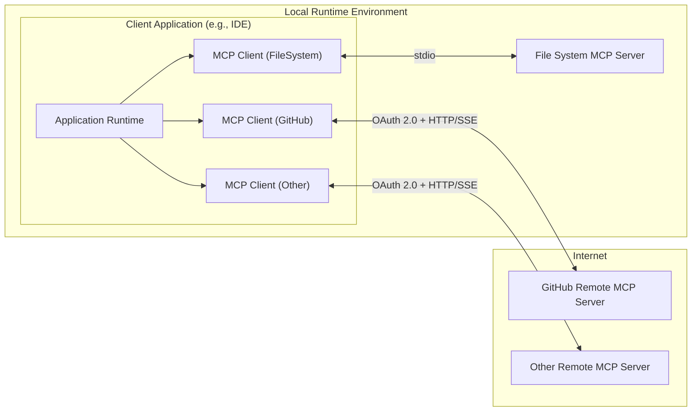
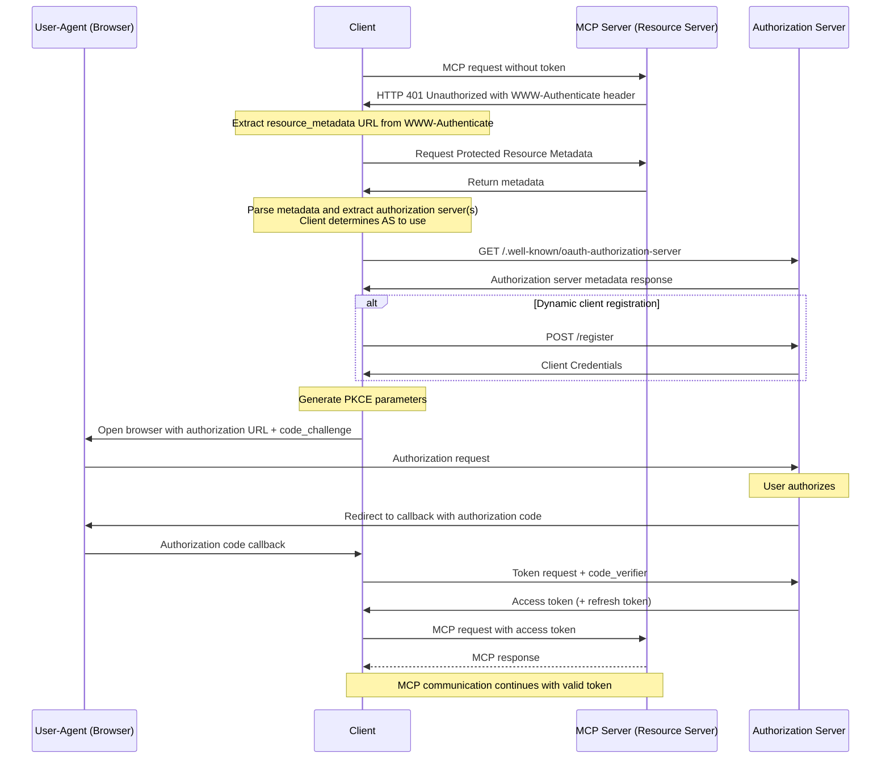

Repository: github/github-mcp-server
Files analyzed: 176

Estimated tokens: 274.4k

Directory structure:
└── github-github-mcp-server/
├── README.md
├── CODE_OF_CONDUCT.md
├── CONTRIBUTING.md
├── Dockerfile
├── go.mod
├── go.sum
├── LICENSE
├── SECURITY.md
├── SUPPORT.md
├── third-party-licenses.darwin.md
├── third-party-licenses.linux.md
├── third-party-licenses.windows.md
├── .dockerignore
├── .golangci.yml
├── .goreleaser.yaml
├── cmd/
│ ├── github-mcp-server/
│ │ ├── generate_docs.go
│ │ └── main.go
│ └── mcpcurl/
│ ├── README.md
│ └── main.go
├── docs/
│ ├── error-handling.md
│ ├── host-integration.md
│ ├── remote-server.md
│ └── testing.md
├── e2e/
│ ├── README.md
│ └── e2e_test.go
├── internal/
│ ├── ghmcp/
│ │ └── server.go
│ ├── githubv4mock/
│ │ ├── githubv4mock.go
│ │ ├── local_round_tripper.go
│ │ ├── objects_are_equal_values.go
│ │ ├── objects_are_equal_values_test.go
│ │ └── query.go
│ └── toolsnaps/
│ ├── toolsnaps.go
│ └── toolsnaps_test.go
├── pkg/
│ ├── errors/
│ │ ├── error.go
│ │ └── error_test.go
│ ├── github/
│ │ ├── actions.go
│ │ ├── actions_test.go
│ │ ├── code_scanning.go
│ │ ├── code_scanning_test.go
│ │ ├── context_tools.go
│ │ ├── context_tools_test.go
│ │ ├── dynamic_tools.go
│ │ ├── helper_test.go
│ │ ├── issues.go
│ │ ├── issues_test.go
│ │ ├── notifications.go
│ │ ├── notifications_test.go
│ │ ├── pullrequests.go
│ │ ├── pullrequests_test.go
│ │ ├── repositories.go
│ │ ├── repositories_test.go
│ │ ├── repository_resource.go
│ │ ├── repository_resource_test.go
│ │ ├── search.go
│ │ ├── search_test.go
│ │ ├── search_utils.go
│ │ ├── secret_scanning.go
│ │ ├── secret_scanning_test.go
│ │ ├── server.go
│ │ ├── server_test.go
│ │ ├── tools.go
│ │ └── **toolsnaps**/
│ │ ├── add_issue_comment.snap
│ │ ├── add_pull_request_review_comment_to_pending_review.snap
│ │ ├── assign_copilot_to_issue.snap
│ │ ├── create_and_submit_pull_request_review.snap
│ │ ├── create_branch.snap
│ │ ├── create_issue.snap
│ │ ├── create_or_update_file.snap
│ │ ├── create_pending_pull_request_review.snap
│ │ ├── create_pull_request.snap
│ │ ├── create_repository.snap
│ │ ├── delete_file.snap
│ │ ├── delete_pending_pull_request_review.snap
│ │ ├── dismiss_notification.snap
│ │ ├── fork_repository.snap
│ │ ├── get_code_scanning_alert.snap
│ │ ├── get_commit.snap
│ │ ├── get_file_contents.snap
│ │ ├── get_issue.snap
│ │ ├── get_issue_comments.snap
│ │ ├── get_me.snap
│ │ ├── get_notification_details.snap
│ │ ├── get_pull_request.snap
│ │ ├── get_pull_request_comments.snap
│ │ ├── get_pull_request_diff.snap
│ │ ├── get_pull_request_files.snap
│ │ ├── get_pull_request_reviews.snap
│ │ ├── get_pull_request_status.snap
│ │ ├── get_tag.snap
│ │ ├── list_branches.snap
│ │ ├── list_code_scanning_alerts.snap
│ │ ├── list_commits.snap
│ │ ├── list_issues.snap
│ │ ├── list_notifications.snap
│ │ ├── list_pull_requests.snap
│ │ ├── list_tags.snap
│ │ ├── manage_notification_subscription.snap
│ │ ├── manage_repository_notification_subscription.snap
│ │ ├── mark_all_notifications_read.snap
│ │ ├── merge_pull_request.snap
│ │ ├── push_files.snap
│ │ ├── request_copilot_review.snap
│ │ ├── search_code.snap
│ │ ├── search_issues.snap
│ │ ├── search_pull_requests.snap
│ │ ├── search_repositories.snap
│ │ ├── search_users.snap
│ │ ├── submit_pending_pull_request_review.snap
│ │ ├── update_issue.snap
│ │ ├── update_pull_request.snap
│ │ └── update_pull_request_branch.snap
│ ├── log/
│ │ ├── io.go
│ │ └── io_test.go
│ ├── raw/
│ │ ├── raw.go
│ │ ├── raw_mock.go
│ │ └── raw_test.go
│ ├── toolsets/
│ │ ├── toolsets.go
│ │ └── toolsets_test.go
│ └── translations/
│ └── translations.go
├── script/
│ ├── get-me
│ ├── licenses
│ ├── licenses-check
│ ├── prettyprint-log
│ └── tag-release
├── third-party/
│ ├── github.com/
│ │ ├── fsnotify/
│ │ │ └── fsnotify/
│ │ │ └── LICENSE
│ │ ├── github/
│ │ │ └── github-mcp-server/
│ │ │ └── LICENSE
│ │ ├── go-openapi/
│ │ │ ├── jsonpointer/
│ │ │ │ └── LICENSE
│ │ │ └── swag/
│ │ │ └── LICENSE
│ │ ├── go-viper/
│ │ │ └── mapstructure/
│ │ │ └── v2/
│ │ │ └── LICENSE
│ │ ├── google/
│ │ │ ├── go-github/
│ │ │ │ ├── v71/
│ │ │ │ │ └── github/
│ │ │ │ │ └── LICENSE
│ │ │ │ └── v72/
│ │ │ │ └── github/
│ │ │ │ └── LICENSE
│ │ │ ├── go-querystring/
│ │ │ │ └── query/
│ │ │ │ └── LICENSE
│ │ │ └── uuid/
│ │ │ └── LICENSE
│ │ ├── gorilla/
│ │ │ └── mux/
│ │ │ └── LICENSE
│ │ ├── inconshreveable/
│ │ │ └── mousetrap/
│ │ │ └── LICENSE
│ │ ├── josephburnett/
│ │ │ └── jd/
│ │ │ └── v2/
│ │ │ └── LICENSE
│ │ ├── josharian/
│ │ │ └── intern/
│ │ │ └── license.md
│ │ ├── mailru/
│ │ │ └── easyjson/
│ │ │ └── LICENSE
│ │ ├── mark3labs/
│ │ │ └── mcp-go/
│ │ │ └── LICENSE
│ │ ├── migueleliasweb/
│ │ │ └── go-github-mock/
│ │ │ └── src/
│ │ │ └── mock/
│ │ │ └── LICENSE
│ │ ├── pelletier/
│ │ │ └── go-toml/
│ │ │ └── v2/
│ │ │ └── LICENSE
│ │ ├── sagikazarmark/
│ │ │ └── locafero/
│ │ │ └── LICENSE
│ │ ├── shurcooL/
│ │ │ ├── githubv4/
│ │ │ │ └── LICENSE
│ │ │ └── graphql/
│ │ │ └── LICENSE
│ │ ├── sirupsen/
│ │ │ └── logrus/
│ │ │ └── LICENSE
│ │ ├── sourcegraph/
│ │ │ └── conc/
│ │ │ └── LICENSE
│ │ ├── spf13/
│ │ │ ├── afero/
│ │ │ │ └── LICENSE.txt
│ │ │ ├── cast/
│ │ │ │ └── LICENSE
│ │ │ ├── cobra/
│ │ │ │ └── LICENSE.txt
│ │ │ ├── pflag/
│ │ │ │ └── LICENSE
│ │ │ └── viper/
│ │ │ └── LICENSE
│ │ ├── subosito/
│ │ │ └── gotenv/
│ │ │ └── LICENSE
│ │ ├── yosida95/
│ │ │ └── uritemplate/
│ │ │ └── v3/
│ │ │ └── LICENSE
│ │ └── yudai/
│ │ └── golcs/
│ │ └── LICENSE
│ ├── golang.org/
│ │ └── x/
│ │ ├── exp/
│ │ │ └── LICENSE
│ │ ├── sys/
│ │ │ ├── unix/
│ │ │ │ └── LICENSE
│ │ │ └── windows/
│ │ │ └── LICENSE
│ │ ├── text/
│ │ │ └── LICENSE
│ │ └── time/
│ │ └── rate/
│ │ └── LICENSE
│ └── gopkg.in/
│ ├── yaml.v2/
│ │ ├── LICENSE
│ │ └── NOTICE
│ └── yaml.v3/
│ ├── LICENSE
│ └── NOTICE
└── .github/
├── CODEOWNERS
├── dependabot.yml
├── licenses.tmpl
├── pull_request_template.md
├── ISSUE_TEMPLATE/
│ ├── bug_report.md
│ └── feature_request.md
└── workflows/
├── code-scanning.yml
├── docker-publish.yml
├── docs-check.yml
├── go.yml
├── goreleaser.yml
├── license-check.yml
└── lint.yaml

================================================
FILE: README.md
================================================

# GitHub MCP Server

The GitHub MCP Server is a [Model Context Protocol (MCP)](https://modelcontextprotocol.io/introduction)
server that provides seamless integration with GitHub APIs, enabling advanced
automation and interaction capabilities for developers and tools.

### Use Cases

- Automating GitHub workflows and processes.
- Extracting and analyzing data from GitHub repositories.
- Building AI powered tools and applications that interact with GitHub's ecosystem.

---

## Remote GitHub MCP Server

[](https://insiders.vscode.dev/redirect/mcp/install?name=github&config=%7B%22type%22%3A%20%22http%22%2C%22url%22%3A%20%22https%3A%2F%2Fapi.githubcopilot.com%2Fmcp%2F%22%7D) [](https://insiders.vscode.dev/redirect/mcp/install?name=github&config=%7B%22type%22%3A%20%22http%22%2C%22url%22%3A%20%22https%3A%2F%2Fapi.githubcopilot.com%2Fmcp%2F%22%7D&quality=insiders)

The remote GitHub MCP Server is hosted by GitHub and provides the easiest method for getting up and running. If your MCP host does not support remote MCP servers, don't worry! You can use the [local version of the GitHub MCP Server](https://github.com/github/github-mcp-server?tab=readme-ov-file#local-github-mcp-server) instead.

## Prerequisites

1. An MCP host that supports the latest MCP specification and remote servers, such as [VS Code](https://code.visualstudio.com/).

## Installation

### Usage with VS Code

For quick installation, use one of the one-click install buttons above. Once you complete that flow, toggle Agent mode (located by the Copilot Chat text input) and the server will start. Make sure you're using [VS Code 1.101](https://code.visualstudio.com/updates/v1_101) or [later](https://code.visualstudio.com/updates) for remote MCP and OAuth support.

Alternatively, to manually configure VS Code, choose the appropriate JSON block from the examples below and add it to your host configuration:

<table>
<tr><th>Using OAuth</th><th>Using a GitHub PAT</th></tr>
<tr><th align=left colspan=2>VS Code (version 1.101 or greater)</th></tr>
<tr valign=top>
<td>
  
```json
{
  "servers": {
    "github": {
      "type": "http",
      "url": "https://api.githubcopilot.com/mcp/"
    }
  }
}
```

</td>
<td>

```json
{
  "servers": {
    "github": {
      "type": "http",
      "url": "https://api.githubcopilot.com/mcp/",
      "headers": {
        "Authorization": "Bearer ${input:github_mcp_pat}"
      }
    }
  },
  "inputs": [
    {
      "type": "promptString",
      "id": "github_mcp_pat",
      "description": "GitHub Personal Access Token",
      "password": true
    }
  ]
}
```

</td>
</tr>
</table>

### Usage in other MCP Hosts

For MCP Hosts that are [Remote MCP-compatible](docs/host-integration.md), choose the appropriate JSON block from the examples below and add it to your host configuration:

<table>
<tr><th>Using OAuth</th><th>Using a GitHub PAT</th></tr>
<tr valign=top>
<td>
  
```json
{
  "mcpServers": {
    "github": {
      "url": "https://api.githubcopilot.com/mcp/"
    }
  }
}
```

</td>
<td>

```json
{
  "mcpServers": {
    "github": {
      "url": "https://api.githubcopilot.com/mcp/",
      "authorization_token": "Bearer <your GitHub PAT>"
    }
  }
}
```

</td>
</tr>
</table>

> **Note:** The exact configuration format may vary by host. Refer to your host's documentation for the correct syntax and location for remote MCP server setup.

### Configuration

See [Remote Server Documentation](docs/remote-server.md) on how to pass additional configuration settings to the remote GitHub MCP Server.

---

## Local GitHub MCP Server

[](https://insiders.vscode.dev/redirect/mcp/install?name=github&inputs=%5B%7B%22id%22%3A%22github_token%22%2C%22type%22%3A%22promptString%22%2C%22description%22%3A%22GitHub%20Personal%20Access%20Token%22%2C%22password%22%3Atrue%7D%5D&config=%7B%22command%22%3A%22docker%22%2C%22args%22%3A%5B%22run%22%2C%22-i%22%2C%22--rm%22%2C%22-e%22%2C%22GITHUB_PERSONAL_ACCESS_TOKEN%22%2C%22ghcr.io%2Fgithub%2Fgithub-mcp-server%22%5D%2C%22env%22%3A%7B%22GITHUB_PERSONAL_ACCESS_TOKEN%22%3A%22%24%7Binput%3Agithub_token%7D%22%7D%7D) [](https://insiders.vscode.dev/redirect/mcp/install?name=github&inputs=%5B%7B%22id%22%3A%22github_token%22%2C%22type%22%3A%22promptString%22%2C%22description%22%3A%22GitHub%20Personal%20Access%20Token%22%2C%22password%22%3Atrue%7D%5D&config=%7B%22command%22%3A%22docker%22%2C%22args%22%3A%5B%22run%22%2C%22-i%22%2C%22--rm%22%2C%22-e%22%2C%22GITHUB_PERSONAL_ACCESS_TOKEN%22%2C%22ghcr.io%2Fgithub%2Fgithub-mcp-server%22%5D%2C%22env%22%3A%7B%22GITHUB_PERSONAL_ACCESS_TOKEN%22%3A%22%24%7Binput%3Agithub_token%7D%22%7D%7D&quality=insiders)

## Prerequisites

1. To run the server in a container, you will need to have [Docker](https://www.docker.com/) installed.
2. Once Docker is installed, you will also need to ensure Docker is running. The image is public; if you get errors on pull, you may have an expired token and need to `docker logout ghcr.io`.
3. Lastly you will need to [Create a GitHub Personal Access Token](https://github.com/settings/personal-access-tokens/new).
   The MCP server can use many of the GitHub APIs, so enable the permissions that you feel comfortable granting your AI tools (to learn more about access tokens, please check out the [documentation](https://docs.github.com/en/authentication/keeping-your-account-and-data-secure/managing-your-personal-access-tokens)).

## Installation

### Usage with VS Code

For quick installation, use one of the one-click install buttons. Once you complete that flow, toggle Agent mode (located by the Copilot Chat text input) and the server will start.

### Usage in other MCP Hosts

Add the following JSON block to your IDE MCP settings.

```json
{
  "mcp": {
    "inputs": [
      {
        "type": "promptString",
        "id": "github_token",
        "description": "GitHub Personal Access Token",
        "password": true
      }
    ],
    "servers": {
      "github": {
        "command": "docker",
        "args": [
          "run",
          "-i",
          "--rm",
          "-e",
          "GITHUB_PERSONAL_ACCESS_TOKEN",
          "ghcr.io/github/github-mcp-server"
        ],
        "env": {
          "GITHUB_PERSONAL_ACCESS_TOKEN": "${input:github_token}"
        }
      }
    }
  }
}
```

Optionally, you can add a similar example (i.e. without the mcp key) to a file called `.vscode/mcp.json` in your workspace. This will allow you to share the configuration with others.

```json
{
  "inputs": [
    {
      "type": "promptString",
      "id": "github_token",
      "description": "GitHub Personal Access Token",
      "password": true
    }
  ],
  "servers": {
    "github": {
      "command": "docker",
      "args": [
        "run",
        "-i",
        "--rm",
        "-e",
        "GITHUB_PERSONAL_ACCESS_TOKEN",
        "ghcr.io/github/github-mcp-server"
      ],
      "env": {
        "GITHUB_PERSONAL_ACCESS_TOKEN": "${input:github_token}"
      }
    }
  }
}
```

More about using MCP server tools in VS Code's [agent mode documentation](https://code.visualstudio.com/docs/copilot/chat/mcp-servers).

### Usage with Claude Desktop

```json
{
  "mcpServers": {
    "github": {
      "command": "docker",
      "args": [
        "run",
        "-i",
        "--rm",
        "-e",
        "GITHUB_PERSONAL_ACCESS_TOKEN",
        "ghcr.io/github/github-mcp-server"
      ],
      "env": {
        "GITHUB_PERSONAL_ACCESS_TOKEN": "<YOUR_TOKEN>"
      }
    }
  }
}
```

### Build from source

If you don't have Docker, you can use `go build` to build the binary in the
`cmd/github-mcp-server` directory, and use the `github-mcp-server stdio` command with the `GITHUB_PERSONAL_ACCESS_TOKEN` environment variable set to your token. To specify the output location of the build, use the `-o` flag. You should configure your server to use the built executable as its `command`. For example:

```JSON
{
  "mcp": {
    "servers": {
      "github": {
        "command": "/path/to/github-mcp-server",
        "args": ["stdio"],
        "env": {
          "GITHUB_PERSONAL_ACCESS_TOKEN": "<YOUR_TOKEN>"
        }
      }
    }
  }
}
```

## Tool Configuration

The GitHub MCP Server supports enabling or disabling specific groups of functionalities via the `--toolsets` flag. This allows you to control which GitHub API capabilities are available to your AI tools. Enabling only the toolsets that you need can help the LLM with tool choice and reduce the context size.

_Toolsets are not limited to Tools. Relevant MCP Resources and Prompts are also included where applicable._

### Available Toolsets

The following sets of tools are available (all are on by default):

<!-- START AUTOMATED TOOLSETS -->

| Toolset             | Description                                                                                                         |
| ------------------- | ------------------------------------------------------------------------------------------------------------------- |
| `context`           | **Strongly recommended**: Tools that provide context about the current user and GitHub context you are operating in |
| `actions`           | GitHub Actions workflows and CI/CD operations                                                                       |
| `code_security`     | Code security related tools, such as GitHub Code Scanning                                                           |
| `experiments`       | Experimental features that are not considered stable yet                                                            |
| `issues`            | GitHub Issues related tools                                                                                         |
| `notifications`     | GitHub Notifications related tools                                                                                  |
| `orgs`              | GitHub Organization related tools                                                                                   |
| `pull_requests`     | GitHub Pull Request related tools                                                                                   |
| `repos`             | GitHub Repository related tools                                                                                     |
| `secret_protection` | Secret protection related tools, such as GitHub Secret Scanning                                                     |
| `users`             | GitHub User related tools                                                                                           |

<!-- END AUTOMATED TOOLSETS -->

#### Specifying Toolsets

To specify toolsets you want available to the LLM, you can pass an allow-list in two ways:

1. **Using Command Line Argument**:

   ```bash
   github-mcp-server --toolsets repos,issues,pull_requests,actions,code_security
   ```

2. **Using Environment Variable**:
   ```bash
   GITHUB_TOOLSETS="repos,issues,pull_requests,actions,code_security" ./github-mcp-server
   ```

The environment variable `GITHUB_TOOLSETS` takes precedence over the command line argument if both are provided.

### Using Toolsets With Docker

When using Docker, you can pass the toolsets as environment variables:

```bash
docker run -i --rm \
  -e GITHUB_PERSONAL_ACCESS_TOKEN=<your-token> \
  -e GITHUB_TOOLSETS="repos,issues,pull_requests,actions,code_security,experiments" \
  ghcr.io/github/github-mcp-server
```

### The "all" Toolset

The special toolset `all` can be provided to enable all available toolsets regardless of any other configuration:

```bash
./github-mcp-server --toolsets all
```

Or using the environment variable:

```bash
GITHUB_TOOLSETS="all" ./github-mcp-server
```

## Dynamic Tool Discovery

**Note**: This feature is currently in beta and may not be available in all environments. Please test it out and let us know if you encounter any issues.

Instead of starting with all tools enabled, you can turn on dynamic toolset discovery. Dynamic toolsets allow the MCP host to list and enable toolsets in response to a user prompt. This should help to avoid situations where the model gets confused by the sheer number of tools available.

### Using Dynamic Tool Discovery

When using the binary, you can pass the `--dynamic-toolsets` flag.

```bash
./github-mcp-server --dynamic-toolsets
```

When using Docker, you can pass the toolsets as environment variables:

```bash
docker run -i --rm \
  -e GITHUB_PERSONAL_ACCESS_TOKEN=<your-token> \
  -e GITHUB_DYNAMIC_TOOLSETS=1 \
  ghcr.io/github/github-mcp-server
```

## Read-Only Mode

To run the server in read-only mode, you can use the `--read-only` flag. This will only offer read-only tools, preventing any modifications to repositories, issues, pull requests, etc.

```bash
./github-mcp-server --read-only
```

When using Docker, you can pass the read-only mode as an environment variable:

```bash
docker run -i --rm \
  -e GITHUB_PERSONAL_ACCESS_TOKEN=<your-token> \
  -e GITHUB_READ_ONLY=1 \
  ghcr.io/github/github-mcp-server
```

## GitHub Enterprise Server and Enterprise Cloud with data residency (ghe.com)

The flag `--gh-host` and the environment variable `GITHUB_HOST` can be used to set
the hostname for GitHub Enterprise Server or GitHub Enterprise Cloud with data residency.

- For GitHub Enterprise Server, prefix the hostname with the `https://` URI scheme, as it otherwise defaults to `http://`, which GitHub Enterprise Server does not support.
- For GitHub Enterprise Cloud with data residency, use `https://YOURSUBDOMAIN.ghe.com` as the hostname.

```json
"github": {
    "command": "docker",
    "args": [
    "run",
    "-i",
    "--rm",
    "-e",
    "GITHUB_PERSONAL_ACCESS_TOKEN",
    "-e",
    "GITHUB_HOST",
    "ghcr.io/github/github-mcp-server"
    ],
    "env": {
        "GITHUB_PERSONAL_ACCESS_TOKEN": "${input:github_token}",
        "GITHUB_HOST": "https://<your GHES or ghe.com domain name>"
    }
}
```

## i18n / Overriding Descriptions

The descriptions of the tools can be overridden by creating a
`github-mcp-server-config.json` file in the same directory as the binary.

The file should contain a JSON object with the tool names as keys and the new
descriptions as values. For example:

```json
{
  "TOOL_ADD_ISSUE_COMMENT_DESCRIPTION": "an alternative description",
  "TOOL_CREATE_BRANCH_DESCRIPTION": "Create a new branch in a GitHub repository"
}
```

You can create an export of the current translations by running the binary with
the `--export-translations` flag.

This flag will preserve any translations/overrides you have made, while adding
any new translations that have been added to the binary since the last time you
exported.

```sh
./github-mcp-server --export-translations
cat github-mcp-server-config.json
```

You can also use ENV vars to override the descriptions. The environment
variable names are the same as the keys in the JSON file, prefixed with
`GITHUB_MCP_` and all uppercase.

For example, to override the `TOOL_ADD_ISSUE_COMMENT_DESCRIPTION` tool, you can
set the following environment variable:

```sh
export GITHUB_MCP_TOOL_ADD_ISSUE_COMMENT_DESCRIPTION="an alternative description"
```

## Tools

<!-- START AUTOMATED TOOLS -->
<details>

<summary>Actions</summary>

- **cancel_workflow_run** - Cancel workflow run

  - `owner`: Repository owner (string, required)
  - `repo`: Repository name (string, required)
  - `run_id`: The unique identifier of the workflow run (number, required)

- **delete_workflow_run_logs** - Delete workflow logs

  - `owner`: Repository owner (string, required)
  - `repo`: Repository name (string, required)
  - `run_id`: The unique identifier of the workflow run (number, required)

- **download_workflow_run_artifact** - Download workflow artifact

  - `artifact_id`: The unique identifier of the artifact (number, required)
  - `owner`: Repository owner (string, required)
  - `repo`: Repository name (string, required)

- **get_job_logs** - Get job logs

  - `failed_only`: When true, gets logs for all failed jobs in run_id (boolean, optional)
  - `job_id`: The unique identifier of the workflow job (required for single job logs) (number, optional)
  - `owner`: Repository owner (string, required)
  - `repo`: Repository name (string, required)
  - `return_content`: Returns actual log content instead of URLs (boolean, optional)
  - `run_id`: Workflow run ID (required when using failed_only) (number, optional)

- **get_workflow_run** - Get workflow run

  - `owner`: Repository owner (string, required)
  - `repo`: Repository name (string, required)
  - `run_id`: The unique identifier of the workflow run (number, required)

- **get_workflow_run_logs** - Get workflow run logs

  - `owner`: Repository owner (string, required)
  - `repo`: Repository name (string, required)
  - `run_id`: The unique identifier of the workflow run (number, required)

- **get_workflow_run_usage** - Get workflow usage

  - `owner`: Repository owner (string, required)
  - `repo`: Repository name (string, required)
  - `run_id`: The unique identifier of the workflow run (number, required)

- **list_workflow_jobs** - List workflow jobs

  - `filter`: Filters jobs by their completed_at timestamp (string, optional)
  - `owner`: Repository owner (string, required)
  - `page`: The page number of the results to fetch (number, optional)
  - `per_page`: The number of results per page (max 100) (number, optional)
  - `repo`: Repository name (string, required)
  - `run_id`: The unique identifier of the workflow run (number, required)

- **list_workflow_run_artifacts** - List workflow artifacts

  - `owner`: Repository owner (string, required)
  - `page`: The page number of the results to fetch (number, optional)
  - `per_page`: The number of results per page (max 100) (number, optional)
  - `repo`: Repository name (string, required)
  - `run_id`: The unique identifier of the workflow run (number, required)

- **list_workflow_runs** - List workflow runs

  - `actor`: Returns someone's workflow runs. Use the login for the user who created the workflow run. (string, optional)
  - `branch`: Returns workflow runs associated with a branch. Use the name of the branch. (string, optional)
  - `event`: Returns workflow runs for a specific event type (string, optional)
  - `owner`: Repository owner (string, required)
  - `page`: The page number of the results to fetch (number, optional)
  - `per_page`: The number of results per page (max 100) (number, optional)
  - `repo`: Repository name (string, required)
  - `status`: Returns workflow runs with the check run status (string, optional)
  - `workflow_id`: The workflow ID or workflow file name (string, required)

- **list_workflows** - List workflows

  - `owner`: Repository owner (string, required)
  - `page`: The page number of the results to fetch (number, optional)
  - `per_page`: The number of results per page (max 100) (number, optional)
  - `repo`: Repository name (string, required)

- **rerun_failed_jobs** - Rerun failed jobs

  - `owner`: Repository owner (string, required)
  - `repo`: Repository name (string, required)
  - `run_id`: The unique identifier of the workflow run (number, required)

- **rerun_workflow_run** - Rerun workflow run

  - `owner`: Repository owner (string, required)
  - `repo`: Repository name (string, required)
  - `run_id`: The unique identifier of the workflow run (number, required)

- **run_workflow** - Run workflow
  - `inputs`: Inputs the workflow accepts (object, optional)
  - `owner`: Repository owner (string, required)
  - `ref`: The git reference for the workflow. The reference can be a branch or tag name. (string, required)
  - `repo`: Repository name (string, required)
  - `workflow_id`: The workflow ID (numeric) or workflow file name (e.g., main.yml, ci.yaml) (string, required)

</details>

<details>

<summary>Code Security</summary>

- **get_code_scanning_alert** - Get code scanning alert

  - `alertNumber`: The number of the alert. (number, required)
  - `owner`: The owner of the repository. (string, required)
  - `repo`: The name of the repository. (string, required)

- **list_code_scanning_alerts** - List code scanning alerts
  - `owner`: The owner of the repository. (string, required)
  - `ref`: The Git reference for the results you want to list. (string, optional)
  - `repo`: The name of the repository. (string, required)
  - `severity`: Filter code scanning alerts by severity (string, optional)
  - `state`: Filter code scanning alerts by state. Defaults to open (string, optional)
  - `tool_name`: The name of the tool used for code scanning. (string, optional)

</details>

<details>

<summary>Context</summary>

- **get_me** - Get my user profile
  - `reason`: Optional: the reason for requesting the user information (string, optional)

</details>

<details>

<summary>Issues</summary>

- **add_issue_comment** - Add comment to issue

  - `body`: Comment content (string, required)
  - `issue_number`: Issue number to comment on (number, required)
  - `owner`: Repository owner (string, required)
  - `repo`: Repository name (string, required)

- **assign_copilot_to_issue** - Assign Copilot to issue

  - `issueNumber`: Issue number (number, required)
  - `owner`: Repository owner (string, required)
  - `repo`: Repository name (string, required)

- **create_issue** - Open new issue

  - `assignees`: Usernames to assign to this issue (string[], optional)
  - `body`: Issue body content (string, optional)
  - `labels`: Labels to apply to this issue (string[], optional)
  - `milestone`: Milestone number (number, optional)
  - `owner`: Repository owner (string, required)
  - `repo`: Repository name (string, required)
  - `title`: Issue title (string, required)

- **get_issue** - Get issue details

  - `issue_number`: The number of the issue (number, required)
  - `owner`: The owner of the repository (string, required)
  - `repo`: The name of the repository (string, required)

- **get_issue_comments** - Get issue comments

  - `issue_number`: Issue number (number, required)
  - `owner`: Repository owner (string, required)
  - `page`: Page number (number, optional)
  - `per_page`: Number of records per page (number, optional)
  - `repo`: Repository name (string, required)

- **list_issues** - List issues

  - `direction`: Sort direction (string, optional)
  - `labels`: Filter by labels (string[], optional)
  - `owner`: Repository owner (string, required)
  - `page`: Page number for pagination (min 1) (number, optional)
  - `perPage`: Results per page for pagination (min 1, max 100) (number, optional)
  - `repo`: Repository name (string, required)
  - `since`: Filter by date (ISO 8601 timestamp) (string, optional)
  - `sort`: Sort order (string, optional)
  - `state`: Filter by state (string, optional)

- **search_issues** - Search issues

  - `order`: Sort order (string, optional)
  - `owner`: Optional repository owner. If provided with repo, only notifications for this repository are listed. (string, optional)
  - `page`: Page number for pagination (min 1) (number, optional)
  - `perPage`: Results per page for pagination (min 1, max 100) (number, optional)
  - `query`: Search query using GitHub issues search syntax (string, required)
  - `repo`: Optional repository name. If provided with owner, only notifications for this repository are listed. (string, optional)
  - `sort`: Sort field by number of matches of categories, defaults to best match (string, optional)

- **update_issue** - Edit issue
  - `assignees`: New assignees (string[], optional)
  - `body`: New description (string, optional)
  - `issue_number`: Issue number to update (number, required)
  - `labels`: New labels (string[], optional)
  - `milestone`: New milestone number (number, optional)
  - `owner`: Repository owner (string, required)
  - `repo`: Repository name (string, required)
  - `state`: New state (string, optional)
  - `title`: New title (string, optional)

</details>

<details>

<summary>Notifications</summary>

- **dismiss_notification** - Dismiss notification

  - `state`: The new state of the notification (read/done) (string, optional)
  - `threadID`: The ID of the notification thread (string, required)

- **get_notification_details** - Get notification details

  - `notificationID`: The ID of the notification (string, required)

- **list_notifications** - List notifications

  - `before`: Only show notifications updated before the given time (ISO 8601 format) (string, optional)
  - `filter`: Filter notifications to, use default unless specified. Read notifications are ones that have already been acknowledged by the user. Participating notifications are those that the user is directly involved in, such as issues or pull requests they have commented on or created. (string, optional)
  - `owner`: Optional repository owner. If provided with repo, only notifications for this repository are listed. (string, optional)
  - `page`: Page number for pagination (min 1) (number, optional)
  - `perPage`: Results per page for pagination (min 1, max 100) (number, optional)
  - `repo`: Optional repository name. If provided with owner, only notifications for this repository are listed. (string, optional)
  - `since`: Only show notifications updated after the given time (ISO 8601 format) (string, optional)

- **manage_notification_subscription** - Manage notification subscription

  - `action`: Action to perform: ignore, watch, or delete the notification subscription. (string, required)
  - `notificationID`: The ID of the notification thread. (string, required)

- **manage_repository_notification_subscription** - Manage repository notification subscription

  - `action`: Action to perform: ignore, watch, or delete the repository notification subscription. (string, required)
  - `owner`: The account owner of the repository. (string, required)
  - `repo`: The name of the repository. (string, required)

- **mark_all_notifications_read** - Mark all notifications as read
  - `lastReadAt`: Describes the last point that notifications were checked (optional). Default: Now (string, optional)
  - `owner`: Optional repository owner. If provided with repo, only notifications for this repository are marked as read. (string, optional)
  - `repo`: Optional repository name. If provided with owner, only notifications for this repository are marked as read. (string, optional)

</details>

<details>

<summary>Organizations</summary>

- **search_orgs** - Search organizations
  - `order`: Sort order (string, optional)
  - `page`: Page number for pagination (min 1) (number, optional)
  - `perPage`: Results per page for pagination (min 1, max 100) (number, optional)
  - `query`: Search query using GitHub organizations search syntax scoped to type:org (string, required)
  - `sort`: Sort field by category (string, optional)

</details>

<details>

<summary>Pull Requests</summary>

- **add_pull_request_review_comment_to_pending_review** - Add comment to the requester's latest pending pull request review

  - `body`: The text of the review comment (string, required)
  - `line`: The line of the blob in the pull request diff that the comment applies to. For multi-line comments, the last line of the range (number, optional)
  - `owner`: Repository owner (string, required)
  - `path`: The relative path to the file that necessitates a comment (string, required)
  - `pullNumber`: Pull request number (number, required)
  - `repo`: Repository name (string, required)
  - `side`: The side of the diff to comment on. LEFT indicates the previous state, RIGHT indicates the new state (string, optional)
  - `startLine`: For multi-line comments, the first line of the range that the comment applies to (number, optional)
  - `startSide`: For multi-line comments, the starting side of the diff that the comment applies to. LEFT indicates the previous state, RIGHT indicates the new state (string, optional)
  - `subjectType`: The level at which the comment is targeted (string, required)

- **create_and_submit_pull_request_review** - Create and submit a pull request review without comments

  - `body`: Review comment text (string, required)
  - `commitID`: SHA of commit to review (string, optional)
  - `event`: Review action to perform (string, required)
  - `owner`: Repository owner (string, required)
  - `pullNumber`: Pull request number (number, required)
  - `repo`: Repository name (string, required)

- **create_pending_pull_request_review** - Create pending pull request review

  - `commitID`: SHA of commit to review (string, optional)
  - `owner`: Repository owner (string, required)
  - `pullNumber`: Pull request number (number, required)
  - `repo`: Repository name (string, required)

- **create_pull_request** - Open new pull request

  - `base`: Branch to merge into (string, required)
  - `body`: PR description (string, optional)
  - `draft`: Create as draft PR (boolean, optional)
  - `head`: Branch containing changes (string, required)
  - `maintainer_can_modify`: Allow maintainer edits (boolean, optional)
  - `owner`: Repository owner (string, required)
  - `repo`: Repository name (string, required)
  - `title`: PR title (string, required)

- **delete_pending_pull_request_review** - Delete the requester's latest pending pull request review

  - `owner`: Repository owner (string, required)
  - `pullNumber`: Pull request number (number, required)
  - `repo`: Repository name (string, required)

- **get_pull_request** - Get pull request details

  - `owner`: Repository owner (string, required)
  - `pullNumber`: Pull request number (number, required)
  - `repo`: Repository name (string, required)

- **get_pull_request_comments** - Get pull request comments

  - `owner`: Repository owner (string, required)
  - `pullNumber`: Pull request number (number, required)
  - `repo`: Repository name (string, required)

- **get_pull_request_diff** - Get pull request diff

  - `owner`: Repository owner (string, required)
  - `pullNumber`: Pull request number (number, required)
  - `repo`: Repository name (string, required)

- **get_pull_request_files** - Get pull request files

  - `owner`: Repository owner (string, required)
  - `page`: Page number for pagination (min 1) (number, optional)
  - `perPage`: Results per page for pagination (min 1, max 100) (number, optional)
  - `pullNumber`: Pull request number (number, required)
  - `repo`: Repository name (string, required)

- **get_pull_request_reviews** - Get pull request reviews

  - `owner`: Repository owner (string, required)
  - `pullNumber`: Pull request number (number, required)
  - `repo`: Repository name (string, required)

- **get_pull_request_status** - Get pull request status checks

  - `owner`: Repository owner (string, required)
  - `pullNumber`: Pull request number (number, required)
  - `repo`: Repository name (string, required)

- **list_pull_requests** - List pull requests

  - `base`: Filter by base branch (string, optional)
  - `direction`: Sort direction (string, optional)
  - `head`: Filter by head user/org and branch (string, optional)
  - `owner`: Repository owner (string, required)
  - `page`: Page number for pagination (min 1) (number, optional)
  - `perPage`: Results per page for pagination (min 1, max 100) (number, optional)
  - `repo`: Repository name (string, required)
  - `sort`: Sort by (string, optional)
  - `state`: Filter by state (string, optional)

- **merge_pull_request** - Merge pull request

  - `commit_message`: Extra detail for merge commit (string, optional)
  - `commit_title`: Title for merge commit (string, optional)
  - `merge_method`: Merge method (string, optional)
  - `owner`: Repository owner (string, required)
  - `pullNumber`: Pull request number (number, required)
  - `repo`: Repository name (string, required)

- **request_copilot_review** - Request Copilot review

  - `owner`: Repository owner (string, required)
  - `pullNumber`: Pull request number (number, required)
  - `repo`: Repository name (string, required)

- **search_pull_requests** - Search pull requests

  - `order`: Sort order (string, optional)
  - `owner`: Optional repository owner. If provided with repo, only notifications for this repository are listed. (string, optional)
  - `page`: Page number for pagination (min 1) (number, optional)
  - `perPage`: Results per page for pagination (min 1, max 100) (number, optional)
  - `query`: Search query using GitHub pull request search syntax (string, required)
  - `repo`: Optional repository name. If provided with owner, only notifications for this repository are listed. (string, optional)
  - `sort`: Sort field by number of matches of categories, defaults to best match (string, optional)

- **submit_pending_pull_request_review** - Submit the requester's latest pending pull request review

  - `body`: The text of the review comment (string, optional)
  - `event`: The event to perform (string, required)
  - `owner`: Repository owner (string, required)
  - `pullNumber`: Pull request number (number, required)
  - `repo`: Repository name (string, required)

- **update_pull_request** - Edit pull request

  - `base`: New base branch name (string, optional)
  - `body`: New description (string, optional)
  - `maintainer_can_modify`: Allow maintainer edits (boolean, optional)
  - `owner`: Repository owner (string, required)
  - `pullNumber`: Pull request number to update (number, required)
  - `repo`: Repository name (string, required)
  - `state`: New state (string, optional)
  - `title`: New title (string, optional)

- **update_pull_request_branch** - Update pull request branch
  - `expectedHeadSha`: The expected SHA of the pull request's HEAD ref (string, optional)
  - `owner`: Repository owner (string, required)
  - `pullNumber`: Pull request number (number, required)
  - `repo`: Repository name (string, required)

</details>

<details>

<summary>Repositories</summary>

- **create_branch** - Create branch

  - `branch`: Name for new branch (string, required)
  - `from_branch`: Source branch (defaults to repo default) (string, optional)
  - `owner`: Repository owner (string, required)
  - `repo`: Repository name (string, required)

- **create_or_update_file** - Create or update file

  - `branch`: Branch to create/update the file in (string, required)
  - `content`: Content of the file (string, required)
  - `message`: Commit message (string, required)
  - `owner`: Repository owner (username or organization) (string, required)
  - `path`: Path where to create/update the file (string, required)
  - `repo`: Repository name (string, required)
  - `sha`: SHA of file being replaced (for updates) (string, optional)

- **create_repository** - Create repository

  - `autoInit`: Initialize with README (boolean, optional)
  - `description`: Repository description (string, optional)
  - `name`: Repository name (string, required)
  - `private`: Whether repo should be private (boolean, optional)

- **delete_file** - Delete file

  - `branch`: Branch to delete the file from (string, required)
  - `message`: Commit message (string, required)
  - `owner`: Repository owner (username or organization) (string, required)
  - `path`: Path to the file to delete (string, required)
  - `repo`: Repository name (string, required)

- **fork_repository** - Fork repository

  - `organization`: Organization to fork to (string, optional)
  - `owner`: Repository owner (string, required)
  - `repo`: Repository name (string, required)

- **get_commit** - Get commit details

  - `owner`: Repository owner (string, required)
  - `page`: Page number for pagination (min 1) (number, optional)
  - `perPage`: Results per page for pagination (min 1, max 100) (number, optional)
  - `repo`: Repository name (string, required)
  - `sha`: Commit SHA, branch name, or tag name (string, required)

- **get_file_contents** - Get file or directory contents

  - `owner`: Repository owner (username or organization) (string, required)
  - `path`: Path to file/directory (directories must end with a slash '/') (string, required)
  - `ref`: Accepts optional git refs such as `refs/tags/{tag}`, `refs/heads/{branch}` or `refs/pull/{pr_number}/head` (string, optional)
  - `repo`: Repository name (string, required)
  - `sha`: Accepts optional git sha, if sha is specified it will be used instead of ref (string, optional)

- **get_tag** - Get tag details

  - `owner`: Repository owner (string, required)
  - `repo`: Repository name (string, required)
  - `tag`: Tag name (string, required)

- **list_branches** - List branches

  - `owner`: Repository owner (string, required)
  - `page`: Page number for pagination (min 1) (number, optional)
  - `perPage`: Results per page for pagination (min 1, max 100) (number, optional)
  - `repo`: Repository name (string, required)

- **list_commits** - List commits

  - `author`: Author username or email address (string, optional)
  - `owner`: Repository owner (string, required)
  - `page`: Page number for pagination (min 1) (number, optional)
  - `perPage`: Results per page for pagination (min 1, max 100) (number, optional)
  - `repo`: Repository name (string, required)
  - `sha`: SHA or Branch name (string, optional)

- **list_tags** - List tags

  - `owner`: Repository owner (string, required)
  - `page`: Page number for pagination (min 1) (number, optional)
  - `perPage`: Results per page for pagination (min 1, max 100) (number, optional)
  - `repo`: Repository name (string, required)

- **push_files** - Push files to repository

  - `branch`: Branch to push to (string, required)
  - `files`: Array of file objects to push, each object with path (string) and content (string) (object[], required)
  - `message`: Commit message (string, required)
  - `owner`: Repository owner (string, required)
  - `repo`: Repository name (string, required)

- **search_code** - Search code

  - `order`: Sort order (string, optional)
  - `page`: Page number for pagination (min 1) (number, optional)
  - `perPage`: Results per page for pagination (min 1, max 100) (number, optional)
  - `q`: Search query using GitHub code search syntax (string, required)
  - `sort`: Sort field ('indexed' only) (string, optional)

- **search_repositories** - Search repositories
  - `page`: Page number for pagination (min 1) (number, optional)
  - `perPage`: Results per page for pagination (min 1, max 100) (number, optional)
  - `query`: Search query (string, required)

</details>

<details>

<summary>Secret Protection</summary>

- **get_secret_scanning_alert** - Get secret scanning alert

  - `alertNumber`: The number of the alert. (number, required)
  - `owner`: The owner of the repository. (string, required)
  - `repo`: The name of the repository. (string, required)

- **list_secret_scanning_alerts** - List secret scanning alerts
  - `owner`: The owner of the repository. (string, required)
  - `repo`: The name of the repository. (string, required)
  - `resolution`: Filter by resolution (string, optional)
  - `secret_type`: A comma-separated list of secret types to return. All default secret patterns are returned. To return generic patterns, pass the token name(s) in the parameter. (string, optional)
  - `state`: Filter by state (string, optional)

</details>

<details>

<summary>Users</summary>

- **search_users** - Search users
  - `order`: Sort order (string, optional)
  - `page`: Page number for pagination (min 1) (number, optional)
  - `perPage`: Results per page for pagination (min 1, max 100) (number, optional)
  - `query`: Search query using GitHub users search syntax scoped to type:user (string, required)
  - `sort`: Sort field by category (string, optional)

</details>
<!-- END AUTOMATED TOOLS -->

## Library Usage

The exported Go API of this module should currently be considered unstable, and subject to breaking changes. In the future, we may offer stability; please file an issue if there is a use case where this would be valuable.

## License

This project is licensed under the terms of the MIT open source license. Please refer to [MIT](./LICENSE) for the full terms.

================================================
FILE: CODE_OF_CONDUCT.md
================================================

# Contributor Covenant Code of Conduct

## Our Pledge

We as members, contributors, and leaders pledge to make participation in our
community a harassment-free experience for everyone, regardless of age, body
size, visible or invisible disability, ethnicity, sex characteristics, gender
identity and expression, level of experience, education, socio-economic status,
nationality, personal appearance, race, religion, or sexual identity
and orientation.

We pledge to act and interact in ways that contribute to an open, welcoming,
diverse, inclusive, and healthy community.

## Our Standards

Examples of behavior that contributes to a positive environment for our
community include:

- Demonstrating empathy and kindness toward other people
- Being respectful of differing opinions, viewpoints, and experiences
- Giving and gracefully accepting constructive feedback
- Accepting responsibility and apologizing to those affected by our mistakes,
  and learning from the experience
- Focusing on what is best not just for us as individuals, but for the
  overall community

Examples of unacceptable behavior include:

- The use of sexualized language or imagery, and sexual attention or
  advances of any kind
- Trolling, insulting or derogatory comments, and personal or political attacks
- Public or private harassment
- Publishing others' private information, such as a physical or email
  address, without their explicit permission
- Other conduct which could reasonably be considered inappropriate in a
  professional setting

## Enforcement Responsibilities

Community leaders are responsible for clarifying and enforcing our standards of
acceptable behavior and will take appropriate and fair corrective action in
response to any behavior that they deem inappropriate, threatening, offensive,
or harmful.

Community leaders have the right and responsibility to remove, edit, or reject
comments, commits, code, wiki edits, issues, and other contributions that are
not aligned to this Code of Conduct, and will communicate reasons for moderation
decisions when appropriate.

## Scope

This Code of Conduct applies within all community spaces, and also applies when
an individual is officially representing the community in public spaces.
Examples of representing our community include using an official e-mail address,
posting via an official social media account, or acting as an appointed
representative at an online or offline event.

## Enforcement

Instances of abusive, harassing, or otherwise unacceptable behavior may be
reported to the community leaders responsible for enforcement at
GitHub.
All complaints will be reviewed and investigated promptly and fairly.

All community leaders are obligated to respect the privacy and security of the
reporter of any incident.

## Enforcement Guidelines

Community leaders will follow these Community Impact Guidelines in determining
the consequences for any action they deem in violation of this Code of Conduct:

### 1. Correction

**Community Impact**: Use of inappropriate language or other behavior deemed
unprofessional or unwelcome in the community.

**Consequence**: A private, written warning from community leaders, providing
clarity around the nature of the violation and an explanation of why the
behavior was inappropriate. A public apology may be requested.

### 2. Warning

**Community Impact**: A violation through a single incident or series
of actions.

**Consequence**: A warning with consequences for continued behavior. No
interaction with the people involved, including unsolicited interaction with
those enforcing the Code of Conduct, for a specified period of time. This
includes avoiding interactions in community spaces as well as external channels
like social media. Violating these terms may lead to a temporary or
permanent ban.

### 3. Temporary Ban

**Community Impact**: A serious violation of community standards, including
sustained inappropriate behavior.

**Consequence**: A temporary ban from any sort of interaction or public
communication with the community for a specified period of time. No public or
private interaction with the people involved, including unsolicited interaction
with those enforcing the Code of Conduct, is allowed during this period.
Violating these terms may lead to a permanent ban.

### 4. Permanent Ban

**Community Impact**: Demonstrating a pattern of violation of community
standards, including sustained inappropriate behavior, harassment of an
individual, or aggression toward or disparagement of classes of individuals.

**Consequence**: A permanent ban from any sort of public interaction within
the community.

## Attribution

This Code of Conduct is adapted from the [Contributor Covenant][homepage],
version 2.0, available at
https://www.contributor-covenant.org/version/2/0/code_of_conduct.html.

Community Impact Guidelines were inspired by [Mozilla's code of conduct
enforcement ladder](https://github.com/mozilla/diversity).

[homepage]: https://www.contributor-covenant.org

For answers to common questions about this code of conduct, see the FAQ at
https://www.contributor-covenant.org/faq. Translations are available at
https://www.contributor-covenant.org/translations.

================================================
FILE: CONTRIBUTING.md
================================================

## Contributing

[fork]: https://github.com/github/github-mcp-server/fork
[pr]: https://github.com/github/github-mcp-server/compare
[style]: https://github.com/github/github-mcp-server/blob/main/.golangci.yml

Hi there! We're thrilled that you'd like to contribute to this project. Your help is essential for keeping it great.

Contributions to this project are [released](https://help.github.com/articles/github-terms-of-service/#6-contributions-under-repository-license) to the public under the [project's open source license](LICENSE).

Please note that this project is released with a [Contributor Code of Conduct](CODE_OF_CONDUCT.md). By participating in this project you agree to abide by its terms.

## Prerequisites for running and testing code

These are one time installations required to be able to test your changes locally as part of the pull request (PR) submission process.

1. install Go [through download](https://go.dev/doc/install) | [through Homebrew](https://formulae.brew.sh/formula/go)
1. [install golangci-lint v2](https://golangci-lint.run/welcome/install/#local-installation)

## Submitting a pull request

> **Important**: Please open your pull request against the `next` branch, not `main`. The `next` branch is where we integrate new features and changes before they are merged to `main`.

1. [Fork][fork] and clone the repository
1. Make sure the tests pass on your machine: `go test -v ./...`
1. Make sure linter passes on your machine: `golangci-lint run`
1. Create a new branch: `git checkout -b my-branch-name`
1. Make your change, add tests, and make sure the tests and linter still pass
1. Push to your fork and [submit a pull request][pr] targeting the `next` branch
1. Pat yourself on the back and wait for your pull request to be reviewed and merged.

Here are a few things you can do that will increase the likelihood of your pull request being accepted:

- Follow the [style guide][style].
- Write tests.
- Keep your change as focused as possible. If there are multiple changes you would like to make that are not dependent upon each other, consider submitting them as separate pull requests.
- Write a [good commit message](http://tbaggery.com/2008/04/19/a-note-about-git-commit-messages.html).

## Resources

- [How to Contribute to Open Source](https://opensource.guide/how-to-contribute/)
- [Using Pull Requests](https://help.github.com/articles/about-pull-requests/)
- [GitHub Help](https://help.github.com)

================================================
FILE: Dockerfile
================================================
FROM golang:1.24.4-alpine AS build
ARG VERSION="dev"

# Set the working directory

WORKDIR /build

# Install git

RUN --mount=type=cache,target=/var/cache/apk \
 apk add git

# Build the server

# go build automatically download required module dependencies to /go/pkg/mod

RUN --mount=type=cache,target=/go/pkg/mod \
 --mount=type=cache,target=/root/.cache/go-build \
 --mount=type=bind,target=. \
 CGO_ENABLED=0 go build -ldflags="-s -w -X main.version=${VERSION} -X main.commit=$(git rev-parse HEAD) -X main.date=$(date -u +%Y-%m-%dT%H:%M:%SZ)" \
 -o /bin/github-mcp-server cmd/github-mcp-server/main.go

# Make a stage to run the app

FROM gcr.io/distroless/base-debian12

# Set the working directory

WORKDIR /server

# Copy the binary from the build stage

COPY --from=build /bin/github-mcp-server .

# Set the entrypoint to the server binary

ENTRYPOINT ["/server/github-mcp-server"]

# Default arguments for ENTRYPOINT

CMD ["stdio"]

================================================
FILE: go.mod
================================================
module github.com/github/github-mcp-server

go 1.23.7

require (
github.com/google/go-github/v72 v72.0.0
github.com/josephburnett/jd v1.9.2
github.com/mark3labs/mcp-go v0.32.0
github.com/migueleliasweb/go-github-mock v1.3.0
github.com/sirupsen/logrus v1.9.3
github.com/spf13/cobra v1.9.1
github.com/spf13/viper v1.20.1
github.com/stretchr/testify v1.10.0
)

require (
github.com/go-openapi/jsonpointer v0.19.5 // indirect
github.com/go-openapi/swag v0.21.1 // indirect
github.com/josharian/intern v1.0.0 // indirect
github.com/mailru/easyjson v0.7.7 // indirect
github.com/yudai/golcs v0.0.0-20170316035057-ecda9a501e82 // indirect
golang.org/x/exp v0.0.0-20240719175910-8a7402abbf56 // indirect
gopkg.in/yaml.v2 v2.4.0 // indirect
)

require (
github.com/davecgh/go-spew v1.1.2-0.20180830191138-d8f796af33cc // indirect
github.com/fsnotify/fsnotify v1.8.0 // indirect
github.com/go-viper/mapstructure/v2 v2.3.0
github.com/google/go-github/v71 v71.0.0 // indirect
github.com/google/go-querystring v1.1.0 // indirect
github.com/google/uuid v1.6.0 // indirect
github.com/gorilla/mux v1.8.0 // indirect
github.com/inconshreveable/mousetrap v1.1.0 // indirect
github.com/pelletier/go-toml/v2 v2.2.3 // indirect
github.com/pmezard/go-difflib v1.0.1-0.20181226105442-5d4384ee4fb2 // indirect
github.com/rogpeppe/go-internal v1.13.1 // indirect
github.com/sagikazarmark/locafero v0.9.0 // indirect
github.com/shurcooL/githubv4 v0.0.0-20240727222349-48295856cce7
github.com/shurcooL/graphql v0.0.0-20230722043721-ed46e5a46466
github.com/sourcegraph/conc v0.3.0 // indirect
github.com/spf13/afero v1.14.0 // indirect
github.com/spf13/cast v1.7.1 // indirect
github.com/spf13/pflag v1.0.6
github.com/subosito/gotenv v1.6.0 // indirect
github.com/yosida95/uritemplate/v3 v3.0.2 // indirect
go.uber.org/multierr v1.11.0 // indirect
golang.org/x/oauth2 v0.29.0 // indirect
golang.org/x/sys v0.31.0 // indirect
golang.org/x/text v0.23.0 // indirect
golang.org/x/time v0.5.0 // indirect
gopkg.in/check.v1 v1.0.0-20201130134442-10cb98267c6c // indirect
gopkg.in/yaml.v3 v3.0.1 // indirect
)

================================================
FILE: go.sum
================================================
github.com/cpuguy83/go-md2man/v2 v2.0.6/go.mod h1:oOW0eioCTA6cOiMLiUPZOpcVxMig6NIQQ7OS05n1F4g=
github.com/creack/pty v1.1.9/go.mod h1:oKZEueFk5CKHvIhNR5MUki03XCEU+Q6VDXinZuGJ33E=
github.com/davecgh/go-spew v1.1.0/go.mod h1:J7Y8YcW2NihsgmVo/mv3lAwl/skON4iLHjSsI+c5H38=
github.com/davecgh/go-spew v1.1.1/go.mod h1:J7Y8YcW2NihsgmVo/mv3lAwl/skON4iLHjSsI+c5H38=
github.com/davecgh/go-spew v1.1.2-0.20180830191138-d8f796af33cc h1:U9qPSI2PIWSS1VwoXQT9A3Wy9MM3WgvqSxFWenqJduM=
github.com/davecgh/go-spew v1.1.2-0.20180830191138-d8f796af33cc/go.mod h1:J7Y8YcW2NihsgmVo/mv3lAwl/skON4iLHjSsI+c5H38=
github.com/frankban/quicktest v1.14.6 h1:7Xjx+VpznH+oBnejlPUj8oUpdxnVs4f8XU8WnHkI4W8=
github.com/frankban/quicktest v1.14.6/go.mod h1:4ptaffx2x8+WTWXmUCuVU6aPUX1/Mz7zb5vbUoiM6w0=
github.com/fsnotify/fsnotify v1.8.0 h1:dAwr6QBTBZIkG8roQaJjGof0pp0EeF+tNV7YBP3F/8M=
github.com/fsnotify/fsnotify v1.8.0/go.mod h1:8jBTzvmWwFyi3Pb8djgCCO5IBqzKJ/Jwo8TRcHyHii0=
github.com/go-openapi/jsonpointer v0.19.5 h1:gZr+CIYByUqjcgeLXnQu2gHYQC9o73G2XUeOFYEICuY=
github.com/go-openapi/jsonpointer v0.19.5/go.mod h1:Pl9vOtqEWErmShwVjC8pYs9cog34VGT37dQOVbmoatg=
github.com/go-openapi/swag v0.19.5/go.mod h1:POnQmlKehdgb5mhVOsnJFsivZCEZ/vjK9gh66Z9tfKk=
github.com/go-openapi/swag v0.21.1 h1:wm0rhTb5z7qpJRHBdPOMuY4QjVUMbF6/kwoYeRAOrKU=
github.com/go-openapi/swag v0.21.1/go.mod h1:QYRuS/SOXUCsnplDa677K7+DxSOj6IPNl/eQntq43wQ=
github.com/go-viper/mapstructure/v2 v2.3.0 h1:27XbWsHIqhbdR5TIC911OfYvgSaW93HM+dX7970Q7jk=
github.com/go-viper/mapstructure/v2 v2.3.0/go.mod h1:oJDH3BJKyqBA2TXFhDsKDGDTlndYOZ6rGS0BRZIxGhM=
github.com/google/go-cmp v0.5.2/go.mod h1:v8dTdLbMG2kIc/vJvl+f65V22dbkXbowE6jgT/gNBxE=
github.com/google/go-cmp v0.7.0 h1:wk8382ETsv4JYUZwIsn6YpYiWiBsYLSJiTsyBybVuN8=
github.com/google/go-cmp v0.7.0/go.mod h1:pXiqmnSA92OHEEa9HXL2W4E7lf9JzCmGVUdgjX3N/iU=
github.com/google/go-github/v71 v71.0.0 h1:Zi16OymGKZZMm8ZliffVVJ/Q9YZreDKONCr+WUd0Z30=
github.com/google/go-github/v71 v71.0.0/go.mod h1:URZXObp2BLlMjwu0O8g4y6VBneUj2bCHgnI8FfgZ51M=
github.com/google/go-github/v72 v72.0.0 h1:FcIO37BLoVPBO9igQQ6tStsv2asG4IPcYFi655PPvBM=
github.com/google/go-github/v72 v72.0.0/go.mod h1:WWtw8GMRiL62mvIquf1kO3onRHeWWKmK01qdCY8c5fg=
github.com/google/go-querystring v1.1.0 h1:AnCroh3fv4ZBgVIf1Iwtovgjaw/GiKJo8M8yD/fhyJ8=
github.com/google/go-querystring v1.1.0/go.mod h1:Kcdr2DB4koayq7X8pmAG4sNG59So17icRSOU623lUBU=
github.com/google/uuid v1.6.0 h1:NIvaJDMOsjHA8n1jAhLSgzrAzy1Hgr+hNrb57e+94F0=
github.com/google/uuid v1.6.0/go.mod h1:TIyPZe4MgqvfeYDBFedMoGGpEw/LqOeaOT+nhxU+yHo=
github.com/gorilla/mux v1.8.0 h1:i40aqfkR1h2SlN9hojwV5ZA91wcXFOvkdNIeFDP5koI=
github.com/gorilla/mux v1.8.0/go.mod h1:DVbg23sWSpFRCP0SfiEN6jmj59UnW/n46BH5rLB71So=
github.com/inconshreveable/mousetrap v1.1.0 h1:wN+x4NVGpMsO7ErUn/mUI3vEoE6Jt13X2s0bqwp9tc8=
github.com/inconshreveable/mousetrap v1.1.0/go.mod h1:vpF70FUmC8bwa3OWnCshd2FqLfsEA9PFc4w1p2J65bw=
github.com/josephburnett/jd v1.9.2 h1:ECJRRFXCCqbtidkAHckHGSZm/JIaAxS1gygHLF8MI5Y=
github.com/josephburnett/jd v1.9.2/go.mod h1:bImDr8QXpxMb3SD+w1cDRHp97xP6UwI88xUAuxwDQfM=
github.com/josharian/intern v1.0.0 h1:vlS4z54oSdjm0bgjRigI+G1HpF+tI+9rE5LLzOg8HmY=
github.com/josharian/intern v1.0.0/go.mod h1:5DoeVV0s6jJacbCEi61lwdGj/aVlrQvzHFFd8Hwg//Y=
github.com/kr/pretty v0.1.0/go.mod h1:dAy3ld7l9f0ibDNOQOHHMYYIIbhfbHSm3C4ZsoJORNo=
github.com/kr/pretty v0.2.1/go.mod h1:ipq/a2n7PKx3OHsz4KJII5eveXtPO4qwEXGdVfWzfnI=
github.com/kr/pretty v0.3.1 h1:flRD4NNwYAUpkphVc1HcthR4KEIFJ65n8Mw5qdRn3LE=
github.com/kr/pretty v0.3.1/go.mod h1:hoEshYVHaxMs3cyo3Yncou5ZscifuDolrwPKZanG3xk=
github.com/kr/pty v1.1.1/go.mod h1:pFQYn66WHrOpPYNljwOMqo10TkYh1fy3cYio2l3bCsQ=
github.com/kr/text v0.1.0/go.mod h1:4Jbv+DJW3UT/LiOwJeYQe1efqtUx/iVham/4vfdArNI=
github.com/kr/text v0.2.0 h1:5Nx0Ya0ZqY2ygV366QzturHI13Jq95ApcVaJBhpS+AY=
github.com/kr/text v0.2.0/go.mod h1:eLer722TekiGuMkidMxC/pM04lWEeraHUUmBw8l2grE=
github.com/mailru/easyjson v0.0.0-20190614124828-94de47d64c63/go.mod h1:C1wdFJiN94OJF2b5HbByQZoLdCWB1Yqtg26g4irojpc=
github.com/mailru/easyjson v0.0.0-20190626092158-b2ccc519800e/go.mod h1:C1wdFJiN94OJF2b5HbByQZoLdCWB1Yqtg26g4irojpc=
github.com/mailru/easyjson v0.7.6/go.mod h1:xzfreul335JAWq5oZzymOObrkdz5UnU4kGfJJLY9Nlc=
github.com/mailru/easyjson v0.7.7 h1:UGYAvKxe3sBsEDzO8ZeWOSlIQfWFlxbzLZe7hwFURr0=
github.com/mailru/easyjson v0.7.7/go.mod h1:xzfreul335JAWq5oZzymOObrkdz5UnU4kGfJJLY9Nlc=
github.com/mark3labs/mcp-go v0.32.0 h1:fgwmbfL2gbd67obg57OfV2Dnrhs1HtSdlY/i5fn7MU8=
github.com/mark3labs/mcp-go v0.32.0/go.mod h1:rXqOudj/djTORU/ThxYx8fqEVj/5pvTuuebQ2RC7uk4=
github.com/migueleliasweb/go-github-mock v1.3.0 h1:2sVP9JEMB2ubQw1IKto3/fzF51oFC6eVWOOFDgQoq88=
github.com/migueleliasweb/go-github-mock v1.3.0/go.mod h1:ipQhV8fTcj/G6m7BKzin08GaJ/3B5/SonRAkgrk0zCY=
github.com/niemeyer/pretty v0.0.0-20200227124842-a10e7caefd8e/go.mod h1:zD1mROLANZcx1PVRCS0qkT7pwLkGfwJo4zjcN/Tysno=
github.com/pelletier/go-toml/v2 v2.2.3 h1:YmeHyLY8mFWbdkNWwpr+qIL2bEqT0o95WSdkNHvL12M=
github.com/pelletier/go-toml/v2 v2.2.3/go.mod h1:MfCQTFTvCcUyyvvwm1+G6H/jORL20Xlb6rzQu9GuUkc=
github.com/pmezard/go-difflib v1.0.0/go.mod h1:iKH77koFhYxTK1pcRnkKkqfTogsbg7gZNVY4sRDYZ/4=
github.com/pmezard/go-difflib v1.0.1-0.20181226105442-5d4384ee4fb2 h1:Jamvg5psRIccs7FGNTlIRMkT8wgtp5eCXdBlqhYGL6U=
github.com/pmezard/go-difflib v1.0.1-0.20181226105442-5d4384ee4fb2/go.mod h1:iKH77koFhYxTK1pcRnkKkqfTogsbg7gZNVY4sRDYZ/4=
github.com/rogpeppe/go-internal v1.13.1 h1:KvO1DLK/DRN07sQ1LQKScxyZJuNnedQ5/wKSR38lUII=
github.com/rogpeppe/go-internal v1.13.1/go.mod h1:uMEvuHeurkdAXX61udpOXGD/AzZDWNMNyH2VO9fmH0o=
github.com/russross/blackfriday/v2 v2.1.0/go.mod h1:+Rmxgy9KzJVeS9/2gXHxylqXiyQDYRxCVz55jmeOWTM=
github.com/sagikazarmark/locafero v0.9.0 h1:GbgQGNtTrEmddYDSAH9QLRyfAHY12md+8YFTqyMTC9k=
github.com/sagikazarmark/locafero v0.9.0/go.mod h1:UBUyz37V+EdMS3hDF3QWIiVr/2dPrx49OMO0Bn0hJqk=
github.com/shurcooL/githubv4 v0.0.0-20240727222349-48295856cce7 h1:cYCy18SHPKRkvclm+pWm1Lk4YrREb4IOIb/YdFO0p2M=
github.com/shurcooL/githubv4 v0.0.0-20240727222349-48295856cce7/go.mod h1:zqMwyHmnN/eDOZOdiTohqIUKUrTFX62PNlu7IJdu0q8=
github.com/shurcooL/graphql v0.0.0-20230722043721-ed46e5a46466 h1:17JxqqJY66GmZVHkmAsGEkcIu0oCe3AM420QDgGwZx0=
github.com/shurcooL/graphql v0.0.0-20230722043721-ed46e5a46466/go.mod h1:9dIRpgIY7hVhoqfe0/FcYp0bpInZaT7dc3BYOprrIUE=
github.com/sirupsen/logrus v1.9.3 h1:dueUQJ1C2q9oE3F7wvmSGAaVtTmUizReu6fjN8uqzbQ=
github.com/sirupsen/logrus v1.9.3/go.mod h1:naHLuLoDiP4jHNo9R0sCBMtWGeIprob74mVsIT4qYEQ=
github.com/sourcegraph/conc v0.3.0 h1:OQTbbt6P72L20UqAkXXuLOj79LfEanQ+YQFNpLA9ySo=
github.com/sourcegraph/conc v0.3.0/go.mod h1:Sdozi7LEKbFPqYX2/J+iBAM6HpqSLTASQIKqDmF7Mt0=
github.com/spf13/afero v1.14.0 h1:9tH6MapGnn/j0eb0yIXiLjERO8RB6xIVZRDCX7PtqWA=
github.com/spf13/afero v1.14.0/go.mod h1:acJQ8t0ohCGuMN3O+Pv0V0hgMxNYDlvdk+VTfyZmbYo=
github.com/spf13/cast v1.7.1 h1:cuNEagBQEHWN1FnbGEjCXL2szYEXqfJPbP2HNUaca9Y=
github.com/spf13/cast v1.7.1/go.mod h1:ancEpBxwJDODSW/UG4rDrAqiKolqNNh2DX3mk86cAdo=
github.com/spf13/cobra v1.9.1 h1:CXSaggrXdbHK9CF+8ywj8Amf7PBRmPCOJugH954Nnlo=
github.com/spf13/cobra v1.9.1/go.mod h1:nDyEzZ8ogv936Cinf6g1RU9MRY64Ir93oCnqb9wxYW0=
github.com/spf13/pflag v1.0.6 h1:jFzHGLGAlb3ruxLB8MhbI6A8+AQX/2eW4qeyNZXNp2o=
github.com/spf13/pflag v1.0.6/go.mod h1:McXfInJRrz4CZXVZOBLb0bTZqETkiAhM9Iw0y3An2Bg=
github.com/spf13/viper v1.20.1 h1:ZMi+z/lvLyPSCoNtFCpqjy0S4kPbirhpTMwl8BkW9X4=
github.com/spf13/viper v1.20.1/go.mod h1:P9Mdzt1zoHIG8m2eZQinpiBjo6kCmZSKBClNNqjJvu4=
github.com/stretchr/objx v0.1.0/go.mod h1:HFkY916IF+rwdDfMAkV7OtwuqBVzrE8GR6GFx+wExME=
github.com/stretchr/testify v1.3.0/go.mod h1:M5WIy9Dh21IEIfnGCwXGc5bZfKNJtfHm1UVUgZn+9EI=
github.com/stretchr/testify v1.6.1/go.mod h1:6Fq8oRcR53rry900zMqJjRRixrwX3KX962/h/Wwjteg=
github.com/stretchr/testify v1.7.0/go.mod h1:6Fq8oRcR53rry900zMqJjRRixrwX3KX962/h/Wwjteg=
github.com/stretchr/testify v1.10.0 h1:Xv5erBjTwe/5IxqUQTdXv5kgmIvbHo3QQyRwhJsOfJA=
github.com/stretchr/testify v1.10.0/go.mod h1:r2ic/lqez/lEtzL7wO/rwa5dbSLXVDPFyf8C91i36aY=
github.com/subosito/gotenv v1.6.0 h1:9NlTDc1FTs4qu0DDq7AEtTPNw6SVm7uBMsUCUjABIf8=
github.com/subosito/gotenv v1.6.0/go.mod h1:Dk4QP5c2W3ibzajGcXpNraDfq2IrhjMIvMSWPKKo0FU=
github.com/yosida95/uritemplate/v3 v3.0.2 h1:Ed3Oyj9yrmi9087+NczuL5BwkIc4wvTb5zIM+UJPGz4=
github.com/yosida95/uritemplate/v3 v3.0.2/go.mod h1:ILOh0sOhIJR3+L/8afwt/kE++YT040gmv5BQTMR2HP4=
github.com/yudai/golcs v0.0.0-20170316035057-ecda9a501e82 h1:BHyfKlQyqbsFN5p3IfnEUduWvb9is428/nNb5L3U01M=
github.com/yudai/golcs v0.0.0-20170316035057-ecda9a501e82/go.mod h1:lgjkn3NuSvDfVJdfcVVdX+jpBxNmX4rDAzaS45IcYoM=
go.uber.org/multierr v1.11.0 h1:blXXJkSxSSfBVBlC76pxqeO+LN3aDfLQo+309xJstO0=
go.uber.org/multierr v1.11.0/go.mod h1:20+QtiLqy0Nd6FdQB9TLXag12DsQkrbs3htMFfDN80Y=
golang.org/x/exp v0.0.0-20240719175910-8a7402abbf56 h1:2dVuKD2vS7b0QIHQbpyTISPd0LeHDbnYEryqj5Q1ug8=
golang.org/x/exp v0.0.0-20240719175910-8a7402abbf56/go.mod h1:M4RDyNAINzryxdtnbRXRL/OHtkFuWGRjvuhBJpk2IlY=
golang.org/x/oauth2 v0.29.0 h1:WdYw2tdTK1S8olAzWHdgeqfy+Mtm9XNhv/xJsY65d98=
golang.org/x/oauth2 v0.29.0/go.mod h1:onh5ek6nERTohokkhCD/y2cV4Do3fxFHFuAejCkRWT8=
golang.org/x/sys v0.0.0-20220715151400-c0bba94af5f8/go.mod h1:oPkhp1MJrh7nUepCBck5+mAzfO9JrbApNNgaTdGDITg=
golang.org/x/sys v0.31.0 h1:ioabZlmFYtWhL+TRYpcnNlLwhyxaM9kWTDEmfnprqik=
golang.org/x/sys v0.31.0/go.mod h1:BJP2sWEmIv4KK5OTEluFJCKSidICx8ciO85XgH3Ak8k=
golang.org/x/text v0.23.0 h1:D71I7dUrlY+VX0gQShAThNGHFxZ13dGLBHQLVl1mJlY=
golang.org/x/text v0.23.0/go.mod h1:/BLNzu4aZCJ1+kcD0DNRotWKage4q2rGVAg4o22unh4=
golang.org/x/time v0.5.0 h1:o7cqy6amK/52YcAKIPlM3a+Fpj35zvRj2TP+e1xFSfk=
golang.org/x/time v0.5.0/go.mod h1:3BpzKBy/shNhVucY/MWOyx10tF3SFh9QdLuxbVysPQM=
golang.org/x/xerrors v0.0.0-20191204190536-9bdfabe68543/go.mod h1:I/5z698sn9Ka8TeJc9MKroUUfqBBauWjQqLJ2OPfmY0=
gopkg.in/check.v1 v0.0.0-20161208181325-20d25e280405/go.mod h1:Co6ibVJAznAaIkqp8huTwlJQCZ016jof/cbN4VW5Yz0=
gopkg.in/check.v1 v1.0.0-20180628173108-788fd7840127/go.mod h1:Co6ibVJAznAaIkqp8huTwlJQCZ016jof/cbN4VW5Yz0=
gopkg.in/check.v1 v1.0.0-20200227125254-8fa46927fb4f/go.mod h1:Co6ibVJAznAaIkqp8huTwlJQCZ016jof/cbN4VW5Yz0=
gopkg.in/check.v1 v1.0.0-20201130134442-10cb98267c6c h1:Hei/4ADfdWqJk1ZMxUNpqntNwaWcugrBjAiHlqqRiVk=
gopkg.in/check.v1 v1.0.0-20201130134442-10cb98267c6c/go.mod h1:JHkPIbrfpd72SG/EVd6muEfDQjcINNoR0C8j2r3qZ4Q=
gopkg.in/yaml.v2 v2.2.2/go.mod h1:hI93XBmqTisBFMUTm0b8Fm+jr3Dg1NNxqwp+5A1VGuI=
gopkg.in/yaml.v2 v2.4.0 h1:D8xgwECY7CYvx+Y2n4sBz93Jn9JRvxdiyyo8CTfuKaY=
gopkg.in/yaml.v2 v2.4.0/go.mod h1:RDklbk79AGWmwhnvt/jBztapEOGDOx6ZbXqjP6csGnQ=
gopkg.in/yaml.v3 v3.0.0-20200313102051-9f266ea9e77c/go.mod h1:K4uyk7z7BCEPqu6E+C64Yfv1cQ7kz7rIZviUmN+EgEM=
gopkg.in/yaml.v3 v3.0.0-20200615113413-eeeca48fe776/go.mod h1:K4uyk7z7BCEPqu6E+C64Yfv1cQ7kz7rIZviUmN+EgEM=
gopkg.in/yaml.v3 v3.0.1 h1:fxVm/GzAzEWqLHuvctI91KS9hhNmmWOoWu0XTYJS7CA=
gopkg.in/yaml.v3 v3.0.1/go.mod h1:K4uyk7z7BCEPqu6E+C64Yfv1cQ7kz7rIZviUmN+EgEM=

================================================
FILE: LICENSE
================================================
MIT License

Copyright (c) 2025 GitHub

Permission is hereby granted, free of charge, to any person obtaining a copy
of this software and associated documentation files (the "Software"), to deal
in the Software without restriction, including without limitation the rights
to use, copy, modify, merge, publish, distribute, sublicense, and/or sell
copies of the Software, and to permit persons to whom the Software is
furnished to do so, subject to the following conditions:

The above copyright notice and this permission notice shall be included in all
copies or substantial portions of the Software.

THE SOFTWARE IS PROVIDED "AS IS", WITHOUT WARRANTY OF ANY KIND, EXPRESS OR
IMPLIED, INCLUDING BUT NOT LIMITED TO THE WARRANTIES OF MERCHANTABILITY,
FITNESS FOR A PARTICULAR PURPOSE AND NONINFRINGEMENT. IN NO EVENT SHALL THE
AUTHORS OR COPYRIGHT HOLDERS BE LIABLE FOR ANY CLAIM, DAMAGES OR OTHER
LIABILITY, WHETHER IN AN ACTION OF CONTRACT, TORT OR OTHERWISE, ARISING FROM,
OUT OF OR IN CONNECTION WITH THE SOFTWARE OR THE USE OR OTHER DEALINGS IN THE
SOFTWARE.

================================================
FILE: SECURITY.md
================================================
Thanks for helping make GitHub safe for everyone.

# Security

GitHub takes the security of our software products and services seriously, including all of the open source code repositories managed through our GitHub organizations, such as [GitHub](https://github.com/GitHub).

Even though [open source repositories are outside of the scope of our bug bounty program](https://bounty.github.com/index.html#scope) and therefore not eligible for bounty rewards, we will ensure that your finding gets passed along to the appropriate maintainers for remediation.

## Reporting Security Issues

If you believe you have found a security vulnerability in any GitHub-owned repository, please report it to us through coordinated disclosure.

**Please do not report security vulnerabilities through public GitHub issues, discussions, or pull requests.**

Instead, please send an email to opensource-security[@]github.com.

Please include as much of the information listed below as you can to help us better understand and resolve the issue:

- The type of issue (e.g., buffer overflow, SQL injection, or cross-site scripting)
- Full paths of source file(s) related to the manifestation of the issue
- The location of the affected source code (tag/branch/commit or direct URL)
- Any special configuration required to reproduce the issue
- Step-by-step instructions to reproduce the issue
- Proof-of-concept or exploit code (if possible)
- Impact of the issue, including how an attacker might exploit the issue

This information will help us triage your report more quickly.

## Policy

See [GitHub's Safe Harbor Policy](https://docs.github.com/en/site-policy/security-policies/github-bug-bounty-program-legal-safe-harbor#1-safe-harbor-terms)

================================================
FILE: SUPPORT.md
================================================

# Support

## How to file issues and get help

This project uses GitHub issues to track bugs and feature requests. Please search the existing issues before filing new issues to avoid duplicates. For new issues, file your bug or feature request as a new issue.

For help or questions about using this project, please open an issue.

- The `github-mcp-server` is under active development and maintained by GitHub staff **AND THE COMMUNITY**. We will do our best to respond to support, feature requests, and community questions in a timely manner.

## GitHub Support Policy

Support for this project is limited to the resources listed above.

================================================
FILE: third-party-licenses.darwin.md
================================================

# GitHub MCP Server dependencies

The following open source dependencies are used to build the [github/github-mcp-server][] GitHub Model Context Protocol Server.

## Go Packages

Some packages may only be included on certain architectures or operating systems.

- [github.com/fsnotify/fsnotify](https://pkg.go.dev/github.com/fsnotify/fsnotify) ([BSD-3-Clause](https://github.com/fsnotify/fsnotify/blob/v1.8.0/LICENSE))
- [github.com/github/github-mcp-server](https://pkg.go.dev/github.com/github/github-mcp-server) ([MIT](https://github.com/github/github-mcp-server/blob/HEAD/LICENSE))
- [github.com/go-openapi/jsonpointer](https://pkg.go.dev/github.com/go-openapi/jsonpointer) ([Apache-2.0](https://github.com/go-openapi/jsonpointer/blob/v0.19.5/LICENSE))
- [github.com/go-openapi/swag](https://pkg.go.dev/github.com/go-openapi/swag) ([Apache-2.0](https://github.com/go-openapi/swag/blob/v0.21.1/LICENSE))
- [github.com/go-viper/mapstructure/v2](https://pkg.go.dev/github.com/go-viper/mapstructure/v2) ([MIT](https://github.com/go-viper/mapstructure/blob/v2.3.0/LICENSE))
- [github.com/google/go-github/v71/github](https://pkg.go.dev/github.com/google/go-github/v71/github) ([BSD-3-Clause](https://github.com/google/go-github/blob/v71.0.0/LICENSE))
- [github.com/google/go-github/v72/github](https://pkg.go.dev/github.com/google/go-github/v72/github) ([BSD-3-Clause](https://github.com/google/go-github/blob/v72.0.0/LICENSE))
- [github.com/google/go-querystring/query](https://pkg.go.dev/github.com/google/go-querystring/query) ([BSD-3-Clause](https://github.com/google/go-querystring/blob/v1.1.0/LICENSE))
- [github.com/google/uuid](https://pkg.go.dev/github.com/google/uuid) ([BSD-3-Clause](https://github.com/google/uuid/blob/v1.6.0/LICENSE))
- [github.com/gorilla/mux](https://pkg.go.dev/github.com/gorilla/mux) ([BSD-3-Clause](https://github.com/gorilla/mux/blob/v1.8.0/LICENSE))
- [github.com/josephburnett/jd/v2](https://pkg.go.dev/github.com/josephburnett/jd/v2) ([MIT](https://github.com/josephburnett/jd/blob/v1.9.2/LICENSE))
- [github.com/josharian/intern](https://pkg.go.dev/github.com/josharian/intern) ([MIT](https://github.com/josharian/intern/blob/v1.0.0/license.md))
- [github.com/mailru/easyjson](https://pkg.go.dev/github.com/mailru/easyjson) ([MIT](https://github.com/mailru/easyjson/blob/v0.7.7/LICENSE))
- [github.com/mark3labs/mcp-go](https://pkg.go.dev/github.com/mark3labs/mcp-go) ([MIT](https://github.com/mark3labs/mcp-go/blob/v0.32.0/LICENSE))
- [github.com/migueleliasweb/go-github-mock/src/mock](https://pkg.go.dev/github.com/migueleliasweb/go-github-mock/src/mock) ([MIT](https://github.com/migueleliasweb/go-github-mock/blob/v1.3.0/LICENSE))
- [github.com/pelletier/go-toml/v2](https://pkg.go.dev/github.com/pelletier/go-toml/v2) ([MIT](https://github.com/pelletier/go-toml/blob/v2.2.3/LICENSE))
- [github.com/sagikazarmark/locafero](https://pkg.go.dev/github.com/sagikazarmark/locafero) ([MIT](https://github.com/sagikazarmark/locafero/blob/v0.9.0/LICENSE))
- [github.com/shurcooL/githubv4](https://pkg.go.dev/github.com/shurcooL/githubv4) ([MIT](https://github.com/shurcooL/githubv4/blob/48295856cce7/LICENSE))
- [github.com/shurcooL/graphql](https://pkg.go.dev/github.com/shurcooL/graphql) ([MIT](https://github.com/shurcooL/graphql/blob/ed46e5a46466/LICENSE))
- [github.com/sirupsen/logrus](https://pkg.go.dev/github.com/sirupsen/logrus) ([MIT](https://github.com/sirupsen/logrus/blob/v1.9.3/LICENSE))
- [github.com/sourcegraph/conc](https://pkg.go.dev/github.com/sourcegraph/conc) ([MIT](https://github.com/sourcegraph/conc/blob/v0.3.0/LICENSE))
- [github.com/spf13/afero](https://pkg.go.dev/github.com/spf13/afero) ([Apache-2.0](https://github.com/spf13/afero/blob/v1.14.0/LICENSE.txt))
- [github.com/spf13/cast](https://pkg.go.dev/github.com/spf13/cast) ([MIT](https://github.com/spf13/cast/blob/v1.7.1/LICENSE))
- [github.com/spf13/cobra](https://pkg.go.dev/github.com/spf13/cobra) ([Apache-2.0](https://github.com/spf13/cobra/blob/v1.9.1/LICENSE.txt))
- [github.com/spf13/pflag](https://pkg.go.dev/github.com/spf13/pflag) ([BSD-3-Clause](https://github.com/spf13/pflag/blob/v1.0.6/LICENSE))
- [github.com/spf13/viper](https://pkg.go.dev/github.com/spf13/viper) ([MIT](https://github.com/spf13/viper/blob/v1.20.1/LICENSE))
- [github.com/subosito/gotenv](https://pkg.go.dev/github.com/subosito/gotenv) ([MIT](https://github.com/subosito/gotenv/blob/v1.6.0/LICENSE))
- [github.com/yosida95/uritemplate/v3](https://pkg.go.dev/github.com/yosida95/uritemplate/v3) ([BSD-3-Clause](https://github.com/yosida95/uritemplate/blob/v3.0.2/LICENSE))
- [github.com/yudai/golcs](https://pkg.go.dev/github.com/yudai/golcs) ([MIT](https://github.com/yudai/golcs/blob/ecda9a501e82/LICENSE))
- [golang.org/x/exp](https://pkg.go.dev/golang.org/x/exp) ([BSD-3-Clause](https://cs.opensource.google/go/x/exp/+/8a7402ab:LICENSE))
- [golang.org/x/sys/unix](https://pkg.go.dev/golang.org/x/sys/unix) ([BSD-3-Clause](https://cs.opensource.google/go/x/sys/+/v0.31.0:LICENSE))
- [golang.org/x/text](https://pkg.go.dev/golang.org/x/text) ([BSD-3-Clause](https://cs.opensource.google/go/x/text/+/v0.23.0:LICENSE))
- [golang.org/x/time/rate](https://pkg.go.dev/golang.org/x/time/rate) ([BSD-3-Clause](https://cs.opensource.google/go/x/time/+/v0.5.0:LICENSE))
- [gopkg.in/yaml.v2](https://pkg.go.dev/gopkg.in/yaml.v2) ([Apache-2.0](https://github.com/go-yaml/yaml/blob/v2.4.0/LICENSE))
- [gopkg.in/yaml.v3](https://pkg.go.dev/gopkg.in/yaml.v3) ([MIT](https://github.com/go-yaml/yaml/blob/v3.0.1/LICENSE))

[github/github-mcp-server]: https://github.com/github/github-mcp-server

================================================
FILE: third-party-licenses.linux.md
================================================

# GitHub MCP Server dependencies

The following open source dependencies are used to build the [github/github-mcp-server][] GitHub Model Context Protocol Server.

## Go Packages

Some packages may only be included on certain architectures or operating systems.

- [github.com/fsnotify/fsnotify](https://pkg.go.dev/github.com/fsnotify/fsnotify) ([BSD-3-Clause](https://github.com/fsnotify/fsnotify/blob/v1.8.0/LICENSE))
- [github.com/github/github-mcp-server](https://pkg.go.dev/github.com/github/github-mcp-server) ([MIT](https://github.com/github/github-mcp-server/blob/HEAD/LICENSE))
- [github.com/go-openapi/jsonpointer](https://pkg.go.dev/github.com/go-openapi/jsonpointer) ([Apache-2.0](https://github.com/go-openapi/jsonpointer/blob/v0.19.5/LICENSE))
- [github.com/go-openapi/swag](https://pkg.go.dev/github.com/go-openapi/swag) ([Apache-2.0](https://github.com/go-openapi/swag/blob/v0.21.1/LICENSE))
- [github.com/go-viper/mapstructure/v2](https://pkg.go.dev/github.com/go-viper/mapstructure/v2) ([MIT](https://github.com/go-viper/mapstructure/blob/v2.3.0/LICENSE))
- [github.com/google/go-github/v71/github](https://pkg.go.dev/github.com/google/go-github/v71/github) ([BSD-3-Clause](https://github.com/google/go-github/blob/v71.0.0/LICENSE))
- [github.com/google/go-github/v72/github](https://pkg.go.dev/github.com/google/go-github/v72/github) ([BSD-3-Clause](https://github.com/google/go-github/blob/v72.0.0/LICENSE))
- [github.com/google/go-querystring/query](https://pkg.go.dev/github.com/google/go-querystring/query) ([BSD-3-Clause](https://github.com/google/go-querystring/blob/v1.1.0/LICENSE))
- [github.com/google/uuid](https://pkg.go.dev/github.com/google/uuid) ([BSD-3-Clause](https://github.com/google/uuid/blob/v1.6.0/LICENSE))
- [github.com/gorilla/mux](https://pkg.go.dev/github.com/gorilla/mux) ([BSD-3-Clause](https://github.com/gorilla/mux/blob/v1.8.0/LICENSE))
- [github.com/josephburnett/jd/v2](https://pkg.go.dev/github.com/josephburnett/jd/v2) ([MIT](https://github.com/josephburnett/jd/blob/v1.9.2/LICENSE))
- [github.com/josharian/intern](https://pkg.go.dev/github.com/josharian/intern) ([MIT](https://github.com/josharian/intern/blob/v1.0.0/license.md))
- [github.com/mailru/easyjson](https://pkg.go.dev/github.com/mailru/easyjson) ([MIT](https://github.com/mailru/easyjson/blob/v0.7.7/LICENSE))
- [github.com/mark3labs/mcp-go](https://pkg.go.dev/github.com/mark3labs/mcp-go) ([MIT](https://github.com/mark3labs/mcp-go/blob/v0.32.0/LICENSE))
- [github.com/migueleliasweb/go-github-mock/src/mock](https://pkg.go.dev/github.com/migueleliasweb/go-github-mock/src/mock) ([MIT](https://github.com/migueleliasweb/go-github-mock/blob/v1.3.0/LICENSE))
- [github.com/pelletier/go-toml/v2](https://pkg.go.dev/github.com/pelletier/go-toml/v2) ([MIT](https://github.com/pelletier/go-toml/blob/v2.2.3/LICENSE))
- [github.com/sagikazarmark/locafero](https://pkg.go.dev/github.com/sagikazarmark/locafero) ([MIT](https://github.com/sagikazarmark/locafero/blob/v0.9.0/LICENSE))
- [github.com/shurcooL/githubv4](https://pkg.go.dev/github.com/shurcooL/githubv4) ([MIT](https://github.com/shurcooL/githubv4/blob/48295856cce7/LICENSE))
- [github.com/shurcooL/graphql](https://pkg.go.dev/github.com/shurcooL/graphql) ([MIT](https://github.com/shurcooL/graphql/blob/ed46e5a46466/LICENSE))
- [github.com/sirupsen/logrus](https://pkg.go.dev/github.com/sirupsen/logrus) ([MIT](https://github.com/sirupsen/logrus/blob/v1.9.3/LICENSE))
- [github.com/sourcegraph/conc](https://pkg.go.dev/github.com/sourcegraph/conc) ([MIT](https://github.com/sourcegraph/conc/blob/v0.3.0/LICENSE))
- [github.com/spf13/afero](https://pkg.go.dev/github.com/spf13/afero) ([Apache-2.0](https://github.com/spf13/afero/blob/v1.14.0/LICENSE.txt))
- [github.com/spf13/cast](https://pkg.go.dev/github.com/spf13/cast) ([MIT](https://github.com/spf13/cast/blob/v1.7.1/LICENSE))
- [github.com/spf13/cobra](https://pkg.go.dev/github.com/spf13/cobra) ([Apache-2.0](https://github.com/spf13/cobra/blob/v1.9.1/LICENSE.txt))
- [github.com/spf13/pflag](https://pkg.go.dev/github.com/spf13/pflag) ([BSD-3-Clause](https://github.com/spf13/pflag/blob/v1.0.6/LICENSE))
- [github.com/spf13/viper](https://pkg.go.dev/github.com/spf13/viper) ([MIT](https://github.com/spf13/viper/blob/v1.20.1/LICENSE))
- [github.com/subosito/gotenv](https://pkg.go.dev/github.com/subosito/gotenv) ([MIT](https://github.com/subosito/gotenv/blob/v1.6.0/LICENSE))
- [github.com/yosida95/uritemplate/v3](https://pkg.go.dev/github.com/yosida95/uritemplate/v3) ([BSD-3-Clause](https://github.com/yosida95/uritemplate/blob/v3.0.2/LICENSE))
- [github.com/yudai/golcs](https://pkg.go.dev/github.com/yudai/golcs) ([MIT](https://github.com/yudai/golcs/blob/ecda9a501e82/LICENSE))
- [golang.org/x/exp](https://pkg.go.dev/golang.org/x/exp) ([BSD-3-Clause](https://cs.opensource.google/go/x/exp/+/8a7402ab:LICENSE))
- [golang.org/x/sys/unix](https://pkg.go.dev/golang.org/x/sys/unix) ([BSD-3-Clause](https://cs.opensource.google/go/x/sys/+/v0.31.0:LICENSE))
- [golang.org/x/text](https://pkg.go.dev/golang.org/x/text) ([BSD-3-Clause](https://cs.opensource.google/go/x/text/+/v0.23.0:LICENSE))
- [golang.org/x/time/rate](https://pkg.go.dev/golang.org/x/time/rate) ([BSD-3-Clause](https://cs.opensource.google/go/x/time/+/v0.5.0:LICENSE))
- [gopkg.in/yaml.v2](https://pkg.go.dev/gopkg.in/yaml.v2) ([Apache-2.0](https://github.com/go-yaml/yaml/blob/v2.4.0/LICENSE))
- [gopkg.in/yaml.v3](https://pkg.go.dev/gopkg.in/yaml.v3) ([MIT](https://github.com/go-yaml/yaml/blob/v3.0.1/LICENSE))

[github/github-mcp-server]: https://github.com/github/github-mcp-server

================================================
FILE: third-party-licenses.windows.md
================================================

# GitHub MCP Server dependencies

The following open source dependencies are used to build the [github/github-mcp-server][] GitHub Model Context Protocol Server.

## Go Packages

Some packages may only be included on certain architectures or operating systems.

- [github.com/fsnotify/fsnotify](https://pkg.go.dev/github.com/fsnotify/fsnotify) ([BSD-3-Clause](https://github.com/fsnotify/fsnotify/blob/v1.8.0/LICENSE))
- [github.com/github/github-mcp-server](https://pkg.go.dev/github.com/github/github-mcp-server) ([MIT](https://github.com/github/github-mcp-server/blob/HEAD/LICENSE))
- [github.com/go-openapi/jsonpointer](https://pkg.go.dev/github.com/go-openapi/jsonpointer) ([Apache-2.0](https://github.com/go-openapi/jsonpointer/blob/v0.19.5/LICENSE))
- [github.com/go-openapi/swag](https://pkg.go.dev/github.com/go-openapi/swag) ([Apache-2.0](https://github.com/go-openapi/swag/blob/v0.21.1/LICENSE))
- [github.com/go-viper/mapstructure/v2](https://pkg.go.dev/github.com/go-viper/mapstructure/v2) ([MIT](https://github.com/go-viper/mapstructure/blob/v2.3.0/LICENSE))
- [github.com/google/go-github/v71/github](https://pkg.go.dev/github.com/google/go-github/v71/github) ([BSD-3-Clause](https://github.com/google/go-github/blob/v71.0.0/LICENSE))
- [github.com/google/go-github/v72/github](https://pkg.go.dev/github.com/google/go-github/v72/github) ([BSD-3-Clause](https://github.com/google/go-github/blob/v72.0.0/LICENSE))
- [github.com/google/go-querystring/query](https://pkg.go.dev/github.com/google/go-querystring/query) ([BSD-3-Clause](https://github.com/google/go-querystring/blob/v1.1.0/LICENSE))
- [github.com/google/uuid](https://pkg.go.dev/github.com/google/uuid) ([BSD-3-Clause](https://github.com/google/uuid/blob/v1.6.0/LICENSE))
- [github.com/gorilla/mux](https://pkg.go.dev/github.com/gorilla/mux) ([BSD-3-Clause](https://github.com/gorilla/mux/blob/v1.8.0/LICENSE))
- [github.com/inconshreveable/mousetrap](https://pkg.go.dev/github.com/inconshreveable/mousetrap) ([Apache-2.0](https://github.com/inconshreveable/mousetrap/blob/v1.1.0/LICENSE))
- [github.com/josephburnett/jd/v2](https://pkg.go.dev/github.com/josephburnett/jd/v2) ([MIT](https://github.com/josephburnett/jd/blob/v1.9.2/LICENSE))
- [github.com/josharian/intern](https://pkg.go.dev/github.com/josharian/intern) ([MIT](https://github.com/josharian/intern/blob/v1.0.0/license.md))
- [github.com/mailru/easyjson](https://pkg.go.dev/github.com/mailru/easyjson) ([MIT](https://github.com/mailru/easyjson/blob/v0.7.7/LICENSE))
- [github.com/mark3labs/mcp-go](https://pkg.go.dev/github.com/mark3labs/mcp-go) ([MIT](https://github.com/mark3labs/mcp-go/blob/v0.32.0/LICENSE))
- [github.com/migueleliasweb/go-github-mock/src/mock](https://pkg.go.dev/github.com/migueleliasweb/go-github-mock/src/mock) ([MIT](https://github.com/migueleliasweb/go-github-mock/blob/v1.3.0/LICENSE))
- [github.com/pelletier/go-toml/v2](https://pkg.go.dev/github.com/pelletier/go-toml/v2) ([MIT](https://github.com/pelletier/go-toml/blob/v2.2.3/LICENSE))
- [github.com/sagikazarmark/locafero](https://pkg.go.dev/github.com/sagikazarmark/locafero) ([MIT](https://github.com/sagikazarmark/locafero/blob/v0.9.0/LICENSE))
- [github.com/shurcooL/githubv4](https://pkg.go.dev/github.com/shurcooL/githubv4) ([MIT](https://github.com/shurcooL/githubv4/blob/48295856cce7/LICENSE))
- [github.com/shurcooL/graphql](https://pkg.go.dev/github.com/shurcooL/graphql) ([MIT](https://github.com/shurcooL/graphql/blob/ed46e5a46466/LICENSE))
- [github.com/sirupsen/logrus](https://pkg.go.dev/github.com/sirupsen/logrus) ([MIT](https://github.com/sirupsen/logrus/blob/v1.9.3/LICENSE))
- [github.com/sourcegraph/conc](https://pkg.go.dev/github.com/sourcegraph/conc) ([MIT](https://github.com/sourcegraph/conc/blob/v0.3.0/LICENSE))
- [github.com/spf13/afero](https://pkg.go.dev/github.com/spf13/afero) ([Apache-2.0](https://github.com/spf13/afero/blob/v1.14.0/LICENSE.txt))
- [github.com/spf13/cast](https://pkg.go.dev/github.com/spf13/cast) ([MIT](https://github.com/spf13/cast/blob/v1.7.1/LICENSE))
- [github.com/spf13/cobra](https://pkg.go.dev/github.com/spf13/cobra) ([Apache-2.0](https://github.com/spf13/cobra/blob/v1.9.1/LICENSE.txt))
- [github.com/spf13/pflag](https://pkg.go.dev/github.com/spf13/pflag) ([BSD-3-Clause](https://github.com/spf13/pflag/blob/v1.0.6/LICENSE))
- [github.com/spf13/viper](https://pkg.go.dev/github.com/spf13/viper) ([MIT](https://github.com/spf13/viper/blob/v1.20.1/LICENSE))
- [github.com/subosito/gotenv](https://pkg.go.dev/github.com/subosito/gotenv) ([MIT](https://github.com/subosito/gotenv/blob/v1.6.0/LICENSE))
- [github.com/yosida95/uritemplate/v3](https://pkg.go.dev/github.com/yosida95/uritemplate/v3) ([BSD-3-Clause](https://github.com/yosida95/uritemplate/blob/v3.0.2/LICENSE))
- [github.com/yudai/golcs](https://pkg.go.dev/github.com/yudai/golcs) ([MIT](https://github.com/yudai/golcs/blob/ecda9a501e82/LICENSE))
- [golang.org/x/exp](https://pkg.go.dev/golang.org/x/exp) ([BSD-3-Clause](https://cs.opensource.google/go/x/exp/+/8a7402ab:LICENSE))
- [golang.org/x/sys/windows](https://pkg.go.dev/golang.org/x/sys/windows) ([BSD-3-Clause](https://cs.opensource.google/go/x/sys/+/v0.31.0:LICENSE))
- [golang.org/x/text](https://pkg.go.dev/golang.org/x/text) ([BSD-3-Clause](https://cs.opensource.google/go/x/text/+/v0.23.0:LICENSE))
- [golang.org/x/time/rate](https://pkg.go.dev/golang.org/x/time/rate) ([BSD-3-Clause](https://cs.opensource.google/go/x/time/+/v0.5.0:LICENSE))
- [gopkg.in/yaml.v2](https://pkg.go.dev/gopkg.in/yaml.v2) ([Apache-2.0](https://github.com/go-yaml/yaml/blob/v2.4.0/LICENSE))
- [gopkg.in/yaml.v3](https://pkg.go.dev/gopkg.in/yaml.v3) ([MIT](https://github.com/go-yaml/yaml/blob/v3.0.1/LICENSE))

[github/github-mcp-server]: https://github.com/github/github-mcp-server

================================================
FILE: .dockerignore
================================================
.github
.vscode
script
third-party
.dockerignore
.gitignore
**/\*.yml
**/_.yaml
\*\*/_.md \*_/_\_test.go
LICENSE

================================================
FILE: .golangci.yml
================================================

# https://golangci-lint.run/usage/configuration

version: "2"

run:
timeout: 5m
tests: true
concurrency: 4

linters:
enable: - govet - errcheck - staticcheck - revive - ineffassign - unused - misspell - nakedret - bodyclose - gocritic - makezero - gosec
settings:
staticcheck:
checks: - all - '-QF1008' # Allow embedded structs to be referenced by field - '-ST1000' # Do not require package comments
revive:
rules: - name: exported
disabled: true - name: exported
disabled: true - name: package-comments
disabled: true

formatters:
enable: - gofmt - goimports

output:
formats:
text:
print-linter-name: true
print-issued-lines: true

================================================
FILE: .goreleaser.yaml
================================================
version: 2
project_name: github-mcp-server
before:
hooks: - go mod tidy - go generate ./...

builds:

- env:
  - CGO_ENABLED=0
    ldflags:
  - -s -w -X main.version={{.Version}} -X main.commit={{.Commit}} -X main.date={{.Date}}
    goos:
  - linux
  - windows
  - darwin
    main: ./cmd/github-mcp-server

archives:

- formats: tar.gz
  # this name template makes the OS and Arch compatible with the results of `uname`.
  name*template: >-
  {{ .ProjectName }}*
  {{- title .Os }}\_
  {{- if eq .Arch "amd64" }}x86_64
  {{- else if eq .Arch "386" }}i386
  {{- else }}{{ .Arch }}{{ end }}
  {{- if .Arm }}v{{ .Arm }}{{ end }}
  # use zip for windows archives
  format_overrides:
  - goos: windows
    formats: zip

changelog:
sort: asc
filters:
exclude: - "^docs:" - "^test:"

release:
draft: true
prerelease: auto
name_template: "GitHub MCP Server {{.Version}}"

================================================
FILE: cmd/github-mcp-server/generate_docs.go
================================================
package main

import (
"context"
"fmt"
"net/url"
"os"
"regexp"
"sort"
"strings"

    "github.com/github/github-mcp-server/pkg/github"
    "github.com/github/github-mcp-server/pkg/raw"
    "github.com/github/github-mcp-server/pkg/toolsets"
    "github.com/github/github-mcp-server/pkg/translations"
    gogithub "github.com/google/go-github/v72/github"
    "github.com/mark3labs/mcp-go/mcp"
    "github.com/shurcooL/githubv4"
    "github.com/spf13/cobra"

)

var generateDocsCmd = &cobra.Command{
Use: "generate-docs",
Short: "Generate documentation for tools and toolsets",
Long: `Generate the automated sections of README.md and docs/remote-server.md with current tool and toolset information.`,
RunE: func(cmd \*cobra.Command, args []string) error {
return generateAllDocs()
},
}

func init() {
rootCmd.AddCommand(generateDocsCmd)
}

// mockGetClient returns a mock GitHub client for documentation generation
func mockGetClient(ctx context.Context) (\*gogithub.Client, error) {
return gogithub.NewClient(nil), nil
}

// mockGetGQLClient returns a mock GraphQL client for documentation generation
func mockGetGQLClient(ctx context.Context) (\*githubv4.Client, error) {
return githubv4.NewClient(nil), nil
}

// mockGetRawClient returns a mock raw client for documentation generation
func mockGetRawClient(ctx context.Context) (\*raw.Client, error) {
return nil, nil
}

func generateAllDocs() error {
if err := generateReadmeDocs("README.md"); err != nil {
return fmt.Errorf("failed to generate README docs: %w", err)
}

    if err := generateRemoteServerDocs("docs/remote-server.md"); err != nil {
    	return fmt.Errorf("failed to generate remote-server docs: %w", err)
    }

    return nil

}

func generateReadmeDocs(readmePath string) error {
// Create translation helper
t, \_ := translations.TranslationHelper()

    // Create toolset group with mock clients
    tsg := github.DefaultToolsetGroup(false, mockGetClient, mockGetGQLClient, mockGetRawClient, t)

    // Generate toolsets documentation
    toolsetsDoc := generateToolsetsDoc(tsg)

    // Generate tools documentation
    toolsDoc := generateToolsDoc(tsg)

    // Read the current README.md
    // #nosec G304 - readmePath is controlled by command line flag, not user input
    content, err := os.ReadFile(readmePath)
    if err != nil {
    	return fmt.Errorf("failed to read README.md: %w", err)
    }

    // Replace toolsets section
    updatedContent := replaceSection(string(content), "START AUTOMATED TOOLSETS", "END AUTOMATED TOOLSETS", toolsetsDoc)

    // Replace tools section
    updatedContent = replaceSection(updatedContent, "START AUTOMATED TOOLS", "END AUTOMATED TOOLS", toolsDoc)

    // Write back to file
    err = os.WriteFile(readmePath, []byte(updatedContent), 0600)
    if err != nil {
    	return fmt.Errorf("failed to write README.md: %w", err)
    }

    fmt.Println("Successfully updated README.md with automated documentation")
    return nil

}

func generateRemoteServerDocs(docsPath string) error {
content, err := os.ReadFile(docsPath) //#nosec G304
if err != nil {
return fmt.Errorf("failed to read docs file: %w", err)
}

    toolsetsDoc := generateRemoteToolsetsDoc()

    // Replace content between markers
    startMarker := "<!-- START AUTOMATED TOOLSETS -->"
    endMarker := "<!-- END AUTOMATED TOOLSETS -->"

    contentStr := string(content)
    startIndex := strings.Index(contentStr, startMarker)
    endIndex := strings.Index(contentStr, endMarker)

    if startIndex == -1 || endIndex == -1 {
    	return fmt.Errorf("automation markers not found in %s", docsPath)
    }

    newContent := contentStr[:startIndex] + startMarker + "\n" + toolsetsDoc + "\n" + endMarker + contentStr[endIndex+len(endMarker):]

    return os.WriteFile(docsPath, []byte(newContent), 0600) //#nosec G306

}

func generateToolsetsDoc(tsg \*toolsets.ToolsetGroup) string {
var lines []string

    // Add table header and separator
    lines = append(lines, "| Toolset                 | Description                                                   |")
    lines = append(lines, "| ----------------------- | ------------------------------------------------------------- |")

    // Add the context toolset row (handled separately in README)
    lines = append(lines, "| `context`               | **Strongly recommended**: Tools that provide context about the current user and GitHub context you are operating in |")

    // Get all toolsets except context (which is handled separately above)
    var toolsetNames []string
    for name := range tsg.Toolsets {
    	if name != "context" && name != "dynamic" { // Skip context and dynamic toolsets as they're handled separately
    		toolsetNames = append(toolsetNames, name)
    	}
    }

    // Sort toolset names for consistent output
    sort.Strings(toolsetNames)

    for _, name := range toolsetNames {
    	toolset := tsg.Toolsets[name]
    	lines = append(lines, fmt.Sprintf("| `%s` | %s |", name, toolset.Description))
    }

    return strings.Join(lines, "\n")

}

func generateToolsDoc(tsg \*toolsets.ToolsetGroup) string {
var sections []string

    // Get all toolset names and sort them alphabetically for deterministic order
    var toolsetNames []string
    for name := range tsg.Toolsets {
    	if name != "dynamic" { // Skip dynamic toolset as it's handled separately
    		toolsetNames = append(toolsetNames, name)
    	}
    }
    sort.Strings(toolsetNames)

    for _, toolsetName := range toolsetNames {
    	toolset := tsg.Toolsets[toolsetName]

    	tools := toolset.GetAvailableTools()
    	if len(tools) == 0 {
    		continue
    	}

    	// Sort tools by name for deterministic order
    	sort.Slice(tools, func(i, j int) bool {
    		return tools[i].Tool.Name < tools[j].Tool.Name
    	})

    	// Generate section header - capitalize first letter and replace underscores
    	sectionName := formatToolsetName(toolsetName)

    	var toolDocs []string
    	for _, serverTool := range tools {
    		toolDoc := generateToolDoc(serverTool.Tool)
    		toolDocs = append(toolDocs, toolDoc)
    	}

    	if len(toolDocs) > 0 {
    		section := fmt.Sprintf("<details>\n\n<summary>%s</summary>\n\n%s\n\n</details>",
    			sectionName, strings.Join(toolDocs, "\n\n"))
    		sections = append(sections, section)
    	}
    }

    return strings.Join(sections, "\n\n")

}

func formatToolsetName(name string) string {
switch name {
case "pull*requests":
return "Pull Requests"
case "repos":
return "Repositories"
case "code_security":
return "Code Security"
case "secret_protection":
return "Secret Protection"
case "orgs":
return "Organizations"
default:
// Fallback: capitalize first letter and replace underscores with spaces
parts := strings.Split(name, "*")
for i, part := range parts {
if len(part) > 0 {
parts[i] = strings.ToUpper(string(part[0])) + part[1:]
}
}
return strings.Join(parts, " ")
}
}

func generateToolDoc(tool mcp.Tool) string {
var lines []string

    // Tool name only (using annotation name instead of verbose description)
    lines = append(lines, fmt.Sprintf("- **%s** - %s", tool.Name, tool.Annotations.Title))

    // Parameters
    schema := tool.InputSchema
    if len(schema.Properties) > 0 {
    	// Get parameter names and sort them for deterministic order
    	var paramNames []string
    	for propName := range schema.Properties {
    		paramNames = append(paramNames, propName)
    	}
    	sort.Strings(paramNames)

    	for _, propName := range paramNames {
    		prop := schema.Properties[propName]
    		required := contains(schema.Required, propName)
    		requiredStr := "optional"
    		if required {
    			requiredStr = "required"
    		}

    		// Get the type and description
    		typeStr := "unknown"
    		description := ""

    		if propMap, ok := prop.(map[string]interface{}); ok {
    			if typeVal, ok := propMap["type"].(string); ok {
    				if typeVal == "array" {
    					if items, ok := propMap["items"].(map[string]interface{}); ok {
    						if itemType, ok := items["type"].(string); ok {
    							typeStr = itemType + "[]"
    						}
    					} else {
    						typeStr = "array"
    					}
    				} else {
    					typeStr = typeVal
    				}
    			}

    			if desc, ok := propMap["description"].(string); ok {
    				description = desc
    			}
    		}

    		paramLine := fmt.Sprintf("  - `%s`: %s (%s, %s)", propName, description, typeStr, requiredStr)
    		lines = append(lines, paramLine)
    	}
    } else {
    	lines = append(lines, "  - No parameters required")
    }

    return strings.Join(lines, "\n")

}

func contains(slice []string, item string) bool {
for \_, s := range slice {
if s == item {
return true
}
}
return false
}

func replaceSection(content, startMarker, endMarker, newContent string) string {
startPattern := fmt.Sprintf(`<!-- %s -->`, regexp.QuoteMeta(startMarker))
endPattern := fmt.Sprintf(`<!-- %s -->`, regexp.QuoteMeta(endMarker))

    re := regexp.MustCompile(fmt.Sprintf(`(?s)%s.*?%s`, startPattern, endPattern))

    replacement := fmt.Sprintf("<!-- %s -->\n%s\n<!-- %s -->", startMarker, newContent, endMarker)

    return re.ReplaceAllString(content, replacement)

}

func generateRemoteToolsetsDoc() string {
var buf strings.Builder

    // Create translation helper
    t, _ := translations.TranslationHelper()

    // Create toolset group with mock clients
    tsg := github.DefaultToolsetGroup(false, mockGetClient, mockGetGQLClient, mockGetRawClient, t)

    // Generate table header
    buf.WriteString("| Name           | Description                                      | API URL                                               | 1-Click Install (VS Code)                                                                                                                                                                                                 | Read-only Link                                                                                                 | 1-Click Read-only Install (VS Code)                                                                                                                                                                                                 |\n")
    buf.WriteString("|----------------|--------------------------------------------------|-------------------------------------------------------|----------------------------------------------------------------------------------------------------------------------------------------------------------------------------------------------------------------------------|---------------------------------------------------------------------------------------------------------------|-----------------------------------------------------------------------------------------------------------------------------------------------------------------------------------------------------------------------------|\n")

    // Get all toolsets
    toolsetNames := make([]string, 0, len(tsg.Toolsets))
    for name := range tsg.Toolsets {
    	if name != "context" && name != "dynamic" { // Skip context and dynamic toolsets as they're handled separately
    		toolsetNames = append(toolsetNames, name)
    	}
    }
    sort.Strings(toolsetNames)

    // Add "all" toolset first (special case)
    buf.WriteString("| all            | All available GitHub MCP tools                    | https://api.githubcopilot.com/mcp/                    | [Install](https://insiders.vscode.dev/redirect/mcp/install?name=github&config=%7B%22type%22%3A%20%22http%22%2C%22url%22%3A%20%22https%3A%2F%2Fapi.githubcopilot.com%2Fmcp%2F%22%7D)                                      | [read-only](https://api.githubcopilot.com/mcp/readonly)                                                      | [Install read-only](https://insiders.vscode.dev/redirect/mcp/install?name=github&config=%7B%22type%22%3A%20%22http%22%2C%22url%22%3A%20%22https%3A%2F%2Fapi.githubcopilot.com%2Fmcp%2Freadonly%22%7D) |\n")

    // Add individual toolsets
    for _, name := range toolsetNames {
    	toolset := tsg.Toolsets[name]

    	formattedName := formatToolsetName(name)
    	description := toolset.Description
    	apiURL := fmt.Sprintf("https://api.githubcopilot.com/mcp/x/%s", name)
    	readonlyURL := fmt.Sprintf("https://api.githubcopilot.com/mcp/x/%s/readonly", name)

    	// Create install config JSON (URL encoded)
    	installConfig := url.QueryEscape(fmt.Sprintf(`{"type": "http","url": "%s"}`, apiURL))
    	readonlyConfig := url.QueryEscape(fmt.Sprintf(`{"type": "http","url": "%s"}`, readonlyURL))

    	// Fix URL encoding to use %20 instead of + for spaces
    	installConfig = strings.ReplaceAll(installConfig, "+", "%20")
    	readonlyConfig = strings.ReplaceAll(readonlyConfig, "+", "%20")

    	installLink := fmt.Sprintf("[Install](https://insiders.vscode.dev/redirect/mcp/install?name=gh-%s&config=%s)", name, installConfig)
    	readonlyInstallLink := fmt.Sprintf("[Install read-only](https://insiders.vscode.dev/redirect/mcp/install?name=gh-%s&config=%s)", name, readonlyConfig)

    	buf.WriteString(fmt.Sprintf("| %-14s | %-48s | %-53s | %-218s | %-110s | %-288s |\n",
    		formattedName,
    		description,
    		apiURL,
    		installLink,
    		fmt.Sprintf("[read-only](%s)", readonlyURL),
    		readonlyInstallLink,
    	))
    }

    return buf.String()

}

================================================
FILE: cmd/github-mcp-server/main.go
================================================
package main

import (
"errors"
"fmt"
"os"
"strings"

    "github.com/github/github-mcp-server/internal/ghmcp"
    "github.com/github/github-mcp-server/pkg/github"
    "github.com/spf13/cobra"
    "github.com/spf13/pflag"
    "github.com/spf13/viper"

)

// These variables are set by the build process using ldflags.
var version = "version"
var commit = "commit"
var date = "date"

var (
rootCmd = &cobra.Command{
Use: "server",
Short: "GitHub MCP Server",
Long: `A GitHub MCP server that handles various tools and resources.`,
Version: fmt.Sprintf("Version: %s\nCommit: %s\nBuild Date: %s", version, commit, date),
}

    stdioCmd = &cobra.Command{
    	Use:   "stdio",
    	Short: "Start stdio server",
    	Long:  `Start a server that communicates via standard input/output streams using JSON-RPC messages.`,
    	RunE: func(_ *cobra.Command, _ []string) error {
    		token := viper.GetString("personal_access_token")
    		if token == "" {
    			return errors.New("GITHUB_PERSONAL_ACCESS_TOKEN not set")
    		}

    		// If you're wondering why we're not using viper.GetStringSlice("toolsets"),
    		// it's because viper doesn't handle comma-separated values correctly for env
    		// vars when using GetStringSlice.
    		// https://github.com/spf13/viper/issues/380
    		var enabledToolsets []string
    		if err := viper.UnmarshalKey("toolsets", &enabledToolsets); err != nil {
    			return fmt.Errorf("failed to unmarshal toolsets: %w", err)
    		}

    		stdioServerConfig := ghmcp.StdioServerConfig{
    			Version:              version,
    			Host:                 viper.GetString("host"),
    			Token:                token,
    			EnabledToolsets:      enabledToolsets,
    			DynamicToolsets:      viper.GetBool("dynamic_toolsets"),
    			ReadOnly:             viper.GetBool("read-only"),
    			ExportTranslations:   viper.GetBool("export-translations"),
    			EnableCommandLogging: viper.GetBool("enable-command-logging"),
    			LogFilePath:          viper.GetString("log-file"),
    		}
    		return ghmcp.RunStdioServer(stdioServerConfig)
    	},
    }

)

func init() {
cobra.OnInitialize(initConfig)
rootCmd.SetGlobalNormalizationFunc(wordSepNormalizeFunc)

    rootCmd.SetVersionTemplate("{{.Short}}\n{{.Version}}\n")

    // Add global flags that will be shared by all commands
    rootCmd.PersistentFlags().StringSlice("toolsets", github.DefaultTools, "An optional comma separated list of groups of tools to allow, defaults to enabling all")
    rootCmd.PersistentFlags().Bool("dynamic-toolsets", false, "Enable dynamic toolsets")
    rootCmd.PersistentFlags().Bool("read-only", false, "Restrict the server to read-only operations")
    rootCmd.PersistentFlags().String("log-file", "", "Path to log file")
    rootCmd.PersistentFlags().Bool("enable-command-logging", false, "When enabled, the server will log all command requests and responses to the log file")
    rootCmd.PersistentFlags().Bool("export-translations", false, "Save translations to a JSON file")
    rootCmd.PersistentFlags().String("gh-host", "", "Specify the GitHub hostname (for GitHub Enterprise etc.)")

    // Bind flag to viper
    _ = viper.BindPFlag("toolsets", rootCmd.PersistentFlags().Lookup("toolsets"))
    _ = viper.BindPFlag("dynamic_toolsets", rootCmd.PersistentFlags().Lookup("dynamic-toolsets"))
    _ = viper.BindPFlag("read-only", rootCmd.PersistentFlags().Lookup("read-only"))
    _ = viper.BindPFlag("log-file", rootCmd.PersistentFlags().Lookup("log-file"))
    _ = viper.BindPFlag("enable-command-logging", rootCmd.PersistentFlags().Lookup("enable-command-logging"))
    _ = viper.BindPFlag("export-translations", rootCmd.PersistentFlags().Lookup("export-translations"))
    _ = viper.BindPFlag("host", rootCmd.PersistentFlags().Lookup("gh-host"))

    // Add subcommands
    rootCmd.AddCommand(stdioCmd)

}

func initConfig() {
// Initialize Viper configuration
viper.SetEnvPrefix("github")
viper.AutomaticEnv()

}

func main() {
if err := rootCmd.Execute(); err != nil {
fmt.Fprintf(os.Stderr, "%v\n", err)
os.Exit(1)
}
}

func wordSepNormalizeFunc(f \*pflag.FlagSet, name string) pflag.NormalizedName {
from := []string{"_"}
to := "-"
for _, sep := range from {
name = strings.ReplaceAll(name, sep, to)
}
return pflag.NormalizedName(name)
}

================================================
FILE: cmd/mcpcurl/README.md
================================================

# mcpcurl

A CLI tool that dynamically builds commands based on schemas retrieved from MCP servers that can
be executed against the configured MCP server.

## Overview

`mcpcurl` is a command-line interface that:

1. Connects to an MCP server via stdio
2. Dynamically retrieves the available tools schema
3. Generates CLI commands corresponding to each tool
4. Handles parameter validation based on the schema
5. Executes commands and displays responses

## Installation

## Usage

```console
mcpcurl --stdio-server-cmd="<command to start MCP server>" <command> [flags]
```

The `--stdio-server-cmd` flag is required for all commands and specifies the command to run the MCP server.

### Available Commands

- `tools`: Contains all dynamically generated tool commands from the schema
- `schema`: Fetches and displays the raw schema from the MCP server
- `help`: Shows help for any command

### Examples

List available tools in Github's MCP server:

```console
% ./mcpcurl --stdio-server-cmd "docker run -i --rm -e GITHUB_PERSONAL_ACCESS_TOKEN mcp/github" tools --help
Contains all dynamically generated tool commands from the schema

Usage:
  mcpcurl tools [command]

Available Commands:
  add_issue_comment     Add a comment to an existing issue
  create_branch         Create a new branch in a GitHub repository
  create_issue          Create a new issue in a GitHub repository
  create_or_update_file Create or update a single file in a GitHub repository
  create_pull_request   Create a new pull request in a GitHub repository
  create_repository     Create a new GitHub repository in your account
  fork_repository       Fork a GitHub repository to your account or specified organization
  get_file_contents     Get the contents of a file or directory from a GitHub repository
  get_issue             Get details of a specific issue in a GitHub repository
  get_issue_comments    Get comments for a GitHub issue
  list_commits          Get list of commits of a branch in a GitHub repository
  list_issues           List issues in a GitHub repository with filtering options
  push_files            Push multiple files to a GitHub repository in a single commit
  search_code           Search for code across GitHub repositories
  search_issues         Search for issues and pull requests across GitHub repositories
  search_repositories   Search for GitHub repositories
  search_users          Search for users on GitHub
  update_issue          Update an existing issue in a GitHub repository

Flags:
  -h, --help   help for tools

Global Flags:
      --pretty                    Pretty print MCP response (only for JSON responses) (default true)
      --stdio-server-cmd string   Shell command to invoke MCP server via stdio (required)

Use "mcpcurl tools [command] --help" for more information about a command.
```

Get help for a specific tool:

```console
 % ./mcpcurl --stdio-server-cmd "docker run -i --rm -e GITHUB_PERSONAL_ACCESS_TOKEN mcp/github" tools get_issue --help
Get details of a specific issue in a GitHub repository

Usage:
  mcpcurl tools get_issue [flags]

Flags:
  -h, --help                 help for get_issue
      --issue_number float
      --owner string
      --repo string

Global Flags:
      --pretty                    Pretty print MCP response (only for JSON responses) (default true)
      --stdio-server-cmd string   Shell command to invoke MCP server via stdio (required)

```

Use one of the tools:

```console
 % ./mcpcurl --stdio-server-cmd "docker run -i --rm -e GITHUB_PERSONAL_ACCESS_TOKEN mcp/github" tools get_issue --owner golang --repo go --issue_number 1
{
  "active_lock_reason": null,
  "assignee": null,
  "assignees": [],
  "author_association": "CONTRIBUTOR",
  "body": "by **rsc+personal@swtch.com**:\n\n\u003cpre\u003eWhat steps will reproduce the problem?\n1. Run build on Ubuntu 9.10, which uses gcc 4.4.1\n\nWhat is the expected output? What do you see instead?\n\nCgo fails with the following error:\n\n{{{\ngo/misc/cgo/stdio$ make\ncgo  file.go\ncould not determine kind of name for C.CString\ncould not determine kind of name for C.puts\ncould not determine kind of name for C.fflushstdout\ncould not determine kind of name for C.free\nthrow: sys·mapaccess1: key not in map\n\npanic PC=0x2b01c2b96a08\nthrow+0x33 /media/scratch/workspace/go/src/pkg/runtime/runtime.c:71\n    throw(0x4d2daf, 0x0)\nsys·mapaccess1+0x74 \n/media/scratch/workspace/go/src/pkg/runtime/hashmap.c:769\n    sys·mapaccess1(0xc2b51930, 0x2b01)\nmain·*Prog·loadDebugInfo+0xa67 \n/media/scratch/workspace/go/src/cmd/cgo/gcc.go:164\n    main·*Prog·loadDebugInfo(0xc2bc0000, 0x2b01)\nmain·main+0x352 \n/media/scratch/workspace/go/src/cmd/cgo/main.go:68\n    main·main()\nmainstart+0xf \n/media/scratch/workspace/go/src/pkg/runtime/amd64/asm.s:55\n    mainstart()\ngoexit /media/scratch/workspace/go/src/pkg/runtime/proc.c:133\n    goexit()\nmake: *** [file.cgo1.go] Error 2\n}}}\n\nPlease use labels and text to provide additional information.\u003c/pre\u003e\n",
  "closed_at": "2014-12-08T10:02:16Z",
  "closed_by": null,
  "comments": 12,
  "comments_url": "https://api.github.com/repos/golang/go/issues/1/comments",
  "created_at": "2009-10-22T06:07:26Z",
  "events_url": "https://api.github.com/repos/golang/go/issues/1/events",
  [...]
}
```

## Dynamic Commands

All tools provided by the MCP server are automatically available as subcommands under the `tools` command. Each generated command has:

- Appropriate flags matching the tool's input schema
- Validation for required parameters
- Type validation
- Enum validation (for string parameters with allowable values)
- Help text generated from the tool's description

## How It Works

1. `mcpcurl` makes a JSON-RPC request to the server using the `tools/list` method
2. The server responds with a schema describing all available tools
3. `mcpcurl` dynamically builds a command structure based on this schema
4. When a command is executed, arguments are converted to a JSON-RPC request
5. The request is sent to the server via stdin, and the response is printed to stdout

================================================
FILE: cmd/mcpcurl/main.go
================================================
package main

import (
"bytes"
"crypto/rand"
"encoding/json"
"fmt"
"io"
"math/big"
"os"
"os/exec"
"slices"
"strings"

    "github.com/spf13/cobra"
    "github.com/spf13/viper"

)

type (
// SchemaResponse represents the top-level response containing tools
SchemaResponse struct {
Result Result `json:"result"`
JSONRPC string `json:"jsonrpc"`
ID int `json:"id"`
}

    // Result contains the list of available tools
    Result struct {
    	Tools []Tool `json:"tools"`
    }

    // Tool represents a single command with its schema
    Tool struct {
    	Name        string      `json:"name"`
    	Description string      `json:"description"`
    	InputSchema InputSchema `json:"inputSchema"`
    }

    // InputSchema defines the structure of a tool's input parameters
    InputSchema struct {
    	Type                 string              `json:"type"`
    	Properties           map[string]Property `json:"properties"`
    	Required             []string            `json:"required"`
    	AdditionalProperties bool                `json:"additionalProperties"`
    	Schema               string              `json:"$schema"`
    }

    // Property defines a single parameter's type and constraints
    Property struct {
    	Type        string        `json:"type"`
    	Description string        `json:"description"`
    	Enum        []string      `json:"enum,omitempty"`
    	Minimum     *float64      `json:"minimum,omitempty"`
    	Maximum     *float64      `json:"maximum,omitempty"`
    	Items       *PropertyItem `json:"items,omitempty"`
    }

    // PropertyItem defines the type of items in an array property
    PropertyItem struct {
    	Type                 string              `json:"type"`
    	Properties           map[string]Property `json:"properties,omitempty"`
    	Required             []string            `json:"required,omitempty"`
    	AdditionalProperties bool                `json:"additionalProperties,omitempty"`
    }

    // JSONRPCRequest represents a JSON-RPC 2.0 request
    JSONRPCRequest struct {
    	JSONRPC string        `json:"jsonrpc"`
    	ID      int           `json:"id"`
    	Method  string        `json:"method"`
    	Params  RequestParams `json:"params"`
    }

    // RequestParams contains the tool name and arguments
    RequestParams struct {
    	Name      string                 `json:"name"`
    	Arguments map[string]interface{} `json:"arguments"`
    }

    // Content matches the response format of a text content response
    Content struct {
    	Type string `json:"type"`
    	Text string `json:"text"`
    }

    ResponseResult struct {
    	Content []Content `json:"content"`
    }

    Response struct {
    	Result  ResponseResult `json:"result"`
    	JSONRPC string         `json:"jsonrpc"`
    	ID      int            `json:"id"`
    }

)

var (
// Create root command
rootCmd = &cobra.Command{
Use: "mcpcurl",
Short: "CLI tool with dynamically generated commands",
Long: "A CLI tool for interacting with MCP API based on dynamically loaded schemas",
PersistentPreRunE: func(cmd \*cobra.Command, \_ []string) error {
// Skip validation for help and completion commands
if cmd.Name() == "help" || cmd.Name() == "completion" {
return nil
}

    		// Check if the required global flag is provided
    		serverCmd, _ := cmd.Flags().GetString("stdio-server-cmd")
    		if serverCmd == "" {
    			return fmt.Errorf("--stdio-server-cmd is required")
    		}
    		return nil
    	},
    }

    // Add schema command
    schemaCmd = &cobra.Command{
    	Use:   "schema",
    	Short: "Fetch schema from MCP server",
    	Long:  "Fetches the tools schema from the MCP server specified by --stdio-server-cmd",
    	RunE: func(cmd *cobra.Command, _ []string) error {
    		serverCmd, _ := cmd.Flags().GetString("stdio-server-cmd")
    		if serverCmd == "" {
    			return fmt.Errorf("--stdio-server-cmd is required")
    		}

    		// Build the JSON-RPC request for tools/list
    		jsonRequest, err := buildJSONRPCRequest("tools/list", "", nil)
    		if err != nil {
    			return fmt.Errorf("failed to build JSON-RPC request: %w", err)
    		}

    		// Execute the server command and pass the JSON-RPC request
    		response, err := executeServerCommand(serverCmd, jsonRequest)
    		if err != nil {
    			return fmt.Errorf("error executing server command: %w", err)
    		}

    		// Output the response
    		fmt.Println(response)
    		return nil
    	},
    }

    // Create the tools command
    toolsCmd = &cobra.Command{
    	Use:   "tools",
    	Short: "Access available tools",
    	Long:  "Contains all dynamically generated tool commands from the schema",
    }

)

func main() {
rootCmd.AddCommand(schemaCmd)

    // Add global flag for stdio server command
    rootCmd.PersistentFlags().String("stdio-server-cmd", "", "Shell command to invoke MCP server via stdio (required)")
    _ = rootCmd.MarkPersistentFlagRequired("stdio-server-cmd")

    // Add global flag for pretty printing
    rootCmd.PersistentFlags().Bool("pretty", true, "Pretty print MCP response (only for JSON or JSONL responses)")

    // Add the tools command to the root command
    rootCmd.AddCommand(toolsCmd)

    // Execute the root command once to parse flags
    _ = rootCmd.ParseFlags(os.Args[1:])

    // Get pretty flag
    prettyPrint, err := rootCmd.Flags().GetBool("pretty")
    if err != nil {
    	_, _ = fmt.Fprintf(os.Stderr, "Error getting pretty flag: %v\n", err)
    	os.Exit(1)
    }
    // Get server command
    serverCmd, err := rootCmd.Flags().GetString("stdio-server-cmd")
    if err == nil && serverCmd != "" {
    	// Fetch schema from server
    	jsonRequest, err := buildJSONRPCRequest("tools/list", "", nil)
    	if err == nil {
    		response, err := executeServerCommand(serverCmd, jsonRequest)
    		if err == nil {
    			// Parse the schema response
    			var schemaResp SchemaResponse
    			if err := json.Unmarshal([]byte(response), &schemaResp); err == nil {
    				// Add all the generated commands as subcommands of tools
    				for _, tool := range schemaResp.Result.Tools {
    					addCommandFromTool(toolsCmd, &tool, prettyPrint)
    				}
    			}
    		}
    	}
    }

    // Execute
    if err := rootCmd.Execute(); err != nil {
    	_, _ = fmt.Fprintf(os.Stderr, "Error executing command: %v\n", err)
    	os.Exit(1)
    }

}

// addCommandFromTool creates a cobra command from a tool schema
func addCommandFromTool(toolsCmd *cobra.Command, tool *Tool, prettyPrint bool) {
// Create command from tool
cmd := &cobra.Command{
Use: tool.Name,
Short: tool.Description,
Run: func(cmd \*cobra.Command, _ []string) {
// Build a map of arguments from flags
arguments, err := buildArgumentsMap(cmd, tool)
if err != nil {
_, \_ = fmt.Fprintf(os.Stderr, "failed to build arguments map: %v\n", err)
return
}

    		jsonData, err := buildJSONRPCRequest("tools/call", tool.Name, arguments)
    		if err != nil {
    			_, _ = fmt.Fprintf(os.Stderr, "failed to build JSONRPC request: %v\n", err)
    			return
    		}

    		// Execute the server command
    		serverCmd, err := cmd.Flags().GetString("stdio-server-cmd")
    		if err != nil {
    			_, _ = fmt.Fprintf(os.Stderr, "failed to get stdio-server-cmd: %v\n", err)
    			return
    		}
    		response, err := executeServerCommand(serverCmd, jsonData)
    		if err != nil {
    			_, _ = fmt.Fprintf(os.Stderr, "error executing server command: %v\n", err)
    			return
    		}
    		if err := printResponse(response, prettyPrint); err != nil {
    			_, _ = fmt.Fprintf(os.Stderr, "error printing response: %v\n", err)
    			return
    		}
    	},
    }

    // Initialize viper for this command
    viperInit := func() {
    	viper.Reset()
    	viper.AutomaticEnv()
    	viper.SetEnvPrefix(strings.ToUpper(tool.Name))
    	viper.SetEnvKeyReplacer(strings.NewReplacer("-", "_"))
    }

    // We'll call the init function directly instead of with cobra.OnInitialize
    // to avoid conflicts between commands
    viperInit()

    // Add flags based on schema properties
    for name, prop := range tool.InputSchema.Properties {
    	isRequired := slices.Contains(tool.InputSchema.Required, name)

    	// Enhance description to indicate if parameter is optional
    	description := prop.Description
    	if !isRequired {
    		description += " (optional)"
    	}

    	switch prop.Type {
    	case "string":
    		cmd.Flags().String(name, "", description)
    		if len(prop.Enum) > 0 {
    			// Add validation in PreRun for enum values
    			cmd.PreRunE = func(cmd *cobra.Command, _ []string) error {
    				for flagName, property := range tool.InputSchema.Properties {
    					if len(property.Enum) > 0 {
    						value, _ := cmd.Flags().GetString(flagName)
    						if value != "" && !slices.Contains(property.Enum, value) {
    							return fmt.Errorf("%s must be one of: %s", flagName, strings.Join(property.Enum, ", "))
    						}
    					}
    				}
    				return nil
    			}
    		}
    	case "number":
    		cmd.Flags().Float64(name, 0, description)
    	case "boolean":
    		cmd.Flags().Bool(name, false, description)
    	case "array":
    		if prop.Items != nil {
    			switch prop.Items.Type {
    			case "string":
    				cmd.Flags().StringSlice(name, []string{}, description)
    			case "object":
    				cmd.Flags().String(name+"-json", "", description+" (provide as JSON array)")
    			}
    		}
    	}

    	if isRequired {
    		_ = cmd.MarkFlagRequired(name)
    	}

    	// Bind flag to viper
    	_ = viper.BindPFlag(name, cmd.Flags().Lookup(name))
    }

    // Add command to root
    toolsCmd.AddCommand(cmd)

}

// buildArgumentsMap extracts flag values into a map of arguments
func buildArgumentsMap(cmd *cobra.Command, tool *Tool) (map[string]interface{}, error) {
arguments := make(map[string]interface{})

    for name, prop := range tool.InputSchema.Properties {
    	switch prop.Type {
    	case "string":
    		if value, _ := cmd.Flags().GetString(name); value != "" {
    			arguments[name] = value
    		}
    	case "number":
    		if value, _ := cmd.Flags().GetFloat64(name); value != 0 {
    			arguments[name] = value
    		}
    	case "boolean":
    		// For boolean, we need to check if it was explicitly set
    		if cmd.Flags().Changed(name) {
    			value, _ := cmd.Flags().GetBool(name)
    			arguments[name] = value
    		}
    	case "array":
    		if prop.Items != nil {
    			switch prop.Items.Type {
    			case "string":
    				if values, _ := cmd.Flags().GetStringSlice(name); len(values) > 0 {
    					arguments[name] = values
    				}
    			case "object":
    				if jsonStr, _ := cmd.Flags().GetString(name + "-json"); jsonStr != "" {
    					var jsonArray []interface{}
    					if err := json.Unmarshal([]byte(jsonStr), &jsonArray); err != nil {
    						return nil, fmt.Errorf("error parsing JSON for %s: %w", name, err)
    					}
    					arguments[name] = jsonArray
    				}
    			}
    		}
    	}
    }

    return arguments, nil

}

// buildJSONRPCRequest creates a JSON-RPC request with the given tool name and arguments
func buildJSONRPCRequest(method, toolName string, arguments map[string]interface{}) (string, error) {
id, err := rand.Int(rand.Reader, big.NewInt(10000))
if err != nil {
return "", fmt.Errorf("failed to generate random ID: %w", err)
}
request := JSONRPCRequest{
JSONRPC: "2.0",
ID: int(id.Int64()), // Random ID between 0 and 9999
Method: method,
Params: RequestParams{
Name: toolName,
Arguments: arguments,
},
}
jsonData, err := json.Marshal(request)
if err != nil {
return "", fmt.Errorf("failed to marshal JSON request: %w", err)
}
return string(jsonData), nil
}

// executeServerCommand runs the specified command, sends the JSON request to stdin,
// and returns the response from stdout
func executeServerCommand(cmdStr, jsonRequest string) (string, error) {
// Split the command string into command and arguments
cmdParts := strings.Fields(cmdStr)
if len(cmdParts) == 0 {
return "", fmt.Errorf("empty command")
}

    cmd := exec.Command(cmdParts[0], cmdParts[1:]...) //nolint:gosec //mcpcurl is a test command that needs to execute arbitrary shell commands

    // Setup stdin pipe
    stdin, err := cmd.StdinPipe()
    if err != nil {
    	return "", fmt.Errorf("failed to create stdin pipe: %w", err)
    }

    // Setup stdout and stderr pipes
    var stdout, stderr bytes.Buffer
    cmd.Stdout = &stdout
    cmd.Stderr = &stderr

    // Start the command
    if err := cmd.Start(); err != nil {
    	return "", fmt.Errorf("failed to start command: %w", err)
    }

    // Write the JSON request to stdin
    if _, err := io.WriteString(stdin, jsonRequest+"\n"); err != nil {
    	return "", fmt.Errorf("failed to write to stdin: %w", err)
    }
    _ = stdin.Close()

    // Wait for the command to complete
    if err := cmd.Wait(); err != nil {
    	return "", fmt.Errorf("command failed: %w, stderr: %s", err, stderr.String())
    }

    return stdout.String(), nil

}

func printResponse(response string, prettyPrint bool) error {
if !prettyPrint {
fmt.Println(response)
return nil
}

    // Parse the JSON response
    var resp Response
    if err := json.Unmarshal([]byte(response), &resp); err != nil {
    	return fmt.Errorf("failed to parse JSON: %w", err)
    }

    // Extract text from content items of type "text"
    for _, content := range resp.Result.Content {
    	if content.Type == "text" {
    		var textContentObj map[string]interface{}
    		err := json.Unmarshal([]byte(content.Text), &textContentObj)

    		if err == nil {
    			prettyText, err := json.MarshalIndent(textContentObj, "", "  ")
    			if err != nil {
    				return fmt.Errorf("failed to pretty print text content: %w", err)
    			}
    			fmt.Println(string(prettyText))
    			continue
    		}

    		// Fallback parsing as JSONL
    		var textContentList []map[string]interface{}
    		if err := json.Unmarshal([]byte(content.Text), &textContentList); err != nil {
    			return fmt.Errorf("failed to parse text content as a list: %w", err)
    		}
    		prettyText, err := json.MarshalIndent(textContentList, "", "  ")
    		if err != nil {
    			return fmt.Errorf("failed to pretty print array content: %w", err)
    		}
    		fmt.Println(string(prettyText))
    	}
    }

    // If no text content found, print the original response
    if len(resp.Result.Content) == 0 {
    	fmt.Println(response)
    }

    return nil

}

================================================
FILE: docs/error-handling.md
================================================

# Error Handling

This document describes the error handling patterns used in the GitHub MCP Server, specifically how we handle GitHub API errors and avoid direct use of mcp-go error types.

## Overview

The GitHub MCP Server implements a custom error handling approach that serves two primary purposes:

1. **Tool Response Generation**: Return appropriate MCP tool error responses to clients
2. **Middleware Inspection**: Store detailed error information in the request context for middleware analysis

This dual approach enables better observability and debugging capabilities, particularly for remote server deployments where understanding the nature of failures (rate limiting, authentication, 404s, 500s, etc.) is crucial for validation and monitoring.

## Error Types

### GitHubAPIError

Used for REST API errors from the GitHub API:

```go
type GitHubAPIError struct {
    Message  string           `json:"message"`
    Response *github.Response `json:"-"`
    Err      error            `json:"-"`
}
```

### GitHubGraphQLError

Used for GraphQL API errors from the GitHub API:

```go
type GitHubGraphQLError struct {
    Message string `json:"message"`
    Err     error  `json:"-"`
}
```

## Usage Patterns

### For GitHub REST API Errors

Instead of directly returning `mcp.NewToolResultError()`, use:

```go
return ghErrors.NewGitHubAPIErrorResponse(ctx, message, response, err), nil
```

This function:

- Creates a `GitHubAPIError` with the provided message, response, and error
- Stores the error in the context for middleware inspection
- Returns an appropriate MCP tool error response

### For GitHub GraphQL API Errors

```go
return ghErrors.NewGitHubGraphQLErrorResponse(ctx, message, err), nil
```

### Context Management

The error handling system uses context to store errors for later inspection:

```go
// Initialize context with error tracking
ctx = errors.ContextWithGitHubErrors(ctx)

// Retrieve errors for inspection (typically in middleware)
apiErrors, err := errors.GetGitHubAPIErrors(ctx)
graphqlErrors, err := errors.GetGitHubGraphQLErrors(ctx)
```

## Design Principles

### User-Actionable vs. Developer Errors

- **User-actionable errors** (authentication failures, rate limits, 404s) should be returned as failed tool calls using the error response functions
- **Developer errors** (JSON marshaling failures, internal logic errors) should be returned as actual Go errors that bubble up through the MCP framework

### Context Limitations

This approach was designed to work around current limitations in mcp-go where context is not propagated through each step of request processing. By storing errors in context values, middleware can inspect them without requiring context propagation.

### Graceful Error Handling

Error storage operations in context are designed to fail gracefully - if context storage fails, the tool will still return an appropriate error response to the client.

## Benefits

1. **Observability**: Middleware can inspect the specific types of GitHub API errors occurring
2. **Debugging**: Detailed error information is preserved without exposing potentially sensitive data in logs
3. **Validation**: Remote servers can use error types and HTTP status codes to validate that changes don't break functionality
4. **Privacy**: Error inspection can be done programmatically using `errors.Is` checks without logging PII

## Example Implementation

```go
func GetIssue(getClient GetClientFn, t translations.TranslationHelperFunc) (tool mcp.Tool, handler server.ToolHandlerFunc) {
    return mcp.NewTool("get_issue", /* ... */),
        func(ctx context.Context, request mcp.CallToolRequest) (*mcp.CallToolResult, error) {
            owner, err := RequiredParam[string](request, "owner")
            if err != nil {
                return mcp.NewToolResultError(err.Error()), nil
            }

            client, err := getClient(ctx)
            if err != nil {
                return nil, fmt.Errorf("failed to get GitHub client: %w", err)
            }

            issue, resp, err := client.Issues.Get(ctx, owner, repo, issueNumber)
            if err != nil {
                return ghErrors.NewGitHubAPIErrorResponse(ctx,
                    "failed to get issue",
                    resp,
                    err,
                ), nil
            }

            return MarshalledTextResult(issue), nil
        }
}
```

This approach ensures that both the client receives an appropriate error response and any middleware can inspect the underlying GitHub API error for monitoring and debugging purposes.

================================================
FILE: docs/host-integration.md
================================================

# GitHub Remote MCP Integration Guide for MCP Host Authors

This guide outlines high-level considerations for MCP Host authors who want to allow installation of the Remote GitHub MCP server.

The goal is to explain the architecture at a high-level, define key requirements, and provide guidance to get you started, while pointing to official documentation for deeper implementation details.

---

## Table of Contents

- [Understanding MCP Architecture](#understanding-mcp-architecture)
- [Connecting to the Remote GitHub MCP Server](#connecting-to-the-remote-github-mcp-server)
  - [Authentication and Authorization](#authentication-and-authorization)
  - [OAuth Support on GitHub](#oauth-support-on-github)
  - [Create an OAuth-enabled App Using the GitHub UI](#create-an-oauth-enabled-app-using-the-github-ui)
  - [Things to Consider](#things-to-consider)
  - [Initiating the OAuth Flow from your Client Application](#initiating-the-oauth-flow-from-your-client-application)
- [Handling Organization Access Restrictions](#handling-organization-access-restrictions)
- [Essential Security Considerations](#essential-security-considerations)
- [Additional Resources](#additional-resources)

---

## Understanding MCP Architecture

The Model Context Protocol (MCP) enables seamless communication between your application and various external tools through an architecture defined by the [MCP Standard](https://modelcontextprotocol.io/).

### High-level Architecture

The diagram below illustrates how a single client application can connect to multiple MCP Servers, each providing access to a unique set of resources. Notice that some MCP Servers are running locally (side-by-side with the client application) while others are hosted remotely. GitHub's MCP offerings are available to run either locally or remotely.



### Runtime Environment

- **Application**: The user-facing application you are building. It instantiates one or more MCP clients and orchestrates tool calls.
- **MCP Client**: A component within your client application that maintains a 1:1 connection with a single MCP server.
- **MCP Server**: A service that provides access to a specific set of tools.
  - **Local MCP Server**: An MCP Server running locally, side-by-side with the Application.
  - **Remote MCP Server**: An MCP Server running remotely, accessed via the internet. Most Remote MCP Servers require authentication via OAuth.

For more detail, see the [official MCP specification](https://modelcontextprotocol.io/specification/draft).

> [!NOTE]
> GitHub offers both a Local MCP Server and a Remote MCP Server.

---

## Connecting to the Remote GitHub MCP Server

### Authentication and Authorization

GitHub MCP Servers require a valid access token in the `Authorization` header. This is true for both the Local GitHub MCP Server and the Remote GitHub MCP Server.

For the Remote GitHub MCP Server, the recommended way to obtain a valid access token is to ensure your client application supports [OAuth 2.1](https://datatracker.ietf.org/doc/html/draft-ietf-oauth-v2-1-13). It should be noted, however, that you may also supply any valid access token. For example, you may supply a pre-generated Personal Access Token (PAT).

> [!IMPORTANT]
> The Remote GitHub MCP Server itself does not provide Authentication services.
> Your client application must obtain valid GitHub access tokens through one of the supported methods.

The expected flow for obtaining a valid access token via OAuth is depicted in the [MCP Specification](https://modelcontextprotocol.io/specification/draft/basic/authorization#authorization-flow-steps). For convenience, we've embedded a copy of the authorization flow below. Please study it carefully as the remainder of this document is written with this flow in mind.



> [!NOTE]
> Dynamic Client Registration is NOT supported by Remote GitHub MCP Server at this time.

#### OAuth Support on GitHub

GitHub offers two solutions for obtaining access tokens via OAuth: [**GitHub Apps**](https://docs.github.com/en/apps/using-github-apps/about-using-github-apps#about-github-apps) and [**OAuth Apps**](https://docs.github.com/en/apps/oauth-apps). These solutions are typically created, administered, and maintained by GitHub Organization administrators. Collaborate with a GitHub Organization administrator to configure either a **GitHub App** or an **OAuth App** to allow your client application to utilize GitHub OAuth support. Furthermore, be aware that it may be necessary for users of your client application to register your **GitHub App** or **OAuth App** within their own GitHub Organization in order to generate authorization tokens capable of accessing Organization's GitHub resources.

> [!TIP]
> Before proceeding, check whether your organization already supports one of these solutions. Administrators of your GitHub Organization can help you determine what **GitHub Apps** or **OAuth Apps** are already registered. If there's an existing **GitHub App** or **OAuth App** that fits your use case, consider reusing it for Remote MCP Authorization. That said, be sure to take heed of the following warning.

> [!WARNING]
> Both **GitHub Apps** and **OAuth Apps** require the client application to pass a "client secret" in order to initiate the OAuth flow. If your client application is designed to run in an uncontrolled environment (i.e. customer-provided hardware), end users will be able to discover your "client secret" and potentially exploit it for other purposes. In such cases, our recommendation is to register a new **GitHub App** (or **OAuth App**) exclusively dedicated to servicing OAuth requests from your client application.

#### Create an OAuth-enabled App Using the GitHub UI

Detailed instructions for creating a **GitHub App** can be found at ["Creating GitHub Apps"](https://docs.github.com/en/apps/creating-github-apps/about-creating-github-apps/about-creating-github-apps#building-a-github-app). (RECOMMENDED)<br/>
Detailed instructions for creating an **OAuth App** can be found ["Creating an OAuth App"](https://docs.github.com/en/apps/oauth-apps/building-oauth-apps/creating-an-oauth-app).

For guidance on which type of app to choose, see ["Differences Between GitHub Apps and OAuth Apps"](https://docs.github.com/en/apps/oauth-apps/building-oauth-apps/differences-between-github-apps-and-oauth-apps).

#### Things to Consider:

- Tokens provided by **GitHub Apps** are generally more secure because they:
  - include an expiration
  - include support for fine-grained permissions
- **GitHub Apps** must be installed on a GitHub Organization before they can be used.<br/>In general, installation must be approved by someone in the Organization with administrator permissions. For more details, see [this explanation](https://docs.github.com/en/apps/oauth-apps/building-oauth-apps/differences-between-github-apps-and-oauth-apps#who-can-install-github-apps-and-authorize-oauth-apps).<br/>By contrast, **OAuth Apps** don't require installation and, typically, can be used immediately.
- Members of an Organization may use the GitHub UI to [request that a GitHub App be installed](https://docs.github.com/en/apps/using-github-apps/requesting-a-github-app-from-your-organization-owner) organization-wide.
- While not strictly necessary, if you expect that a wide range of users will use your MCP Server, consider publishing its corresponding **GitHub App** or **OAuth App** on the [GitHub App Marketplace](https://github.com/marketplace?type=apps) to ensure that it's discoverable by your audience.

#### Initiating the OAuth Flow from your Client Application

For **GitHub Apps**, details on initiating the OAuth flow from a client application are described in detail [here](https://docs.github.com/en/apps/creating-github-apps/authenticating-with-a-github-app/generating-a-user-access-token-for-a-github-app#using-the-web-application-flow-to-generate-a-user-access-token).

For **OAuth Apps**, details on initiating the OAuth flow from a client application are described in detail [here](https://docs.github.com/en/apps/oauth-apps/building-oauth-apps/authorizing-oauth-apps#web-application-flow).

> [!IMPORTANT]
> For endpoint discovery, be sure to honor the [`WWW-Authenticate` information provided](https://modelcontextprotocol.io/specification/draft/basic/authorization#authorization-server-location) by the Remote GitHub MCP Server rather than relying on hard-coded endpoints like `https://github.com/login/oauth/authorize`.

### Handling Organization Access Restrictions

Organizations may block **GitHub Apps** and **OAuth Apps** until explicitly approved. Within your client application code, you can provide actionable next steps for a smooth user experience in the event that OAuth-related calls fail due to your **GitHub App** or **OAuth App** being unavailable (i.e. not registered within the user's organization).

1. Detect the specific error.
2. Notify the user clearly.
3. Depending on their GitHub organization privileges:
   - Org Members: Prompt them to request approval from a GitHub organization admin, within the organization where access has not been approved.
   - Org Admins: Link them to the corresponding GitHub organization’s App approval settings at `https://github.com/organizations/[ORG_NAME]/settings/oauth_application_policy`

## Essential Security Considerations

- **Token Storage**: Use secure platform APIs (e.g. keytar for Node.js).
- **Input Validation**: Sanitize all tool arguments.
- **HTTPS Only**: Never send requests over plaintext HTTP. Always use HTTPS in production.
- **PKCE:** We strongly recommend implementing [PKCE](https://datatracker.ietf.org/doc/html/rfc7636) for all OAuth flows to prevent code interception, to prepare for upcoming PKCE support.

## Additional Resources

- [MCP Official Spec](https://modelcontextprotocol.io/specification/draft)
- [MCP SDKs](https://modelcontextprotocol.io/sdk/java/mcp-overview)
- [GitHub Docs on Creating GitHub Apps](https://docs.github.com/en/apps/creating-github-apps)
- [GitHub Docs on Using GitHub Apps](https://docs.github.com/en/apps/using-github-apps/about-using-github-apps)
- [GitHub Docs on Creating OAuth Apps](https://docs.github.com/en/apps/oauth-apps)
- GitHub Docs on Installing OAuth Apps into a [Personal Account](https://docs.github.com/en/apps/oauth-apps/using-oauth-apps/installing-an-oauth-app-in-your-personal-account) and [Organization](https://docs.github.com/en/apps/oauth-apps/using-oauth-apps/installing-an-oauth-app-in-your-organization)
- [Managing OAuth Apps at the Organization Level](https://docs.github.com/en/organizations/managing-oauth-access-to-your-organizations-data)
- [Managing Programmatic Access at the GitHub Organization Level](https://docs.github.com/en/organizations/managing-programmatic-access-to-your-organization)
- [Building Copilot Extensions](https://docs.github.com/en/copilot/building-copilot-extensions)
- [Managing App/Extension Visibility](https://docs.github.com/en/copilot/building-copilot-extensions/managing-the-availability-of-your-copilot-extension) (including GitHub Marketplace information)
- [Example Implementation in VS Code Repository](https://github.com/microsoft/vscode/blob/main/src/vs/workbench/api/common/extHostMcp.ts#L313)

================================================
FILE: docs/remote-server.md
================================================

# Remote GitHub MCP Server 🚀

[](https://insiders.vscode.dev/redirect/mcp/install?name=github&config=%7B%22type%22%3A%20%22http%22%2C%22url%22%3A%20%22https%3A%2F%2Fapi.githubcopilot.com%2Fmcp%2F%22%7D) [](https://insiders.vscode.dev/redirect/mcp/install?name=github&config=%7B%22type%22%3A%20%22http%22%2C%22url%22%3A%20%22https%3A%2F%2Fapi.githubcopilot.com%2Fmcp%2F%22%7D&quality=insiders)

Easily connect to the GitHub MCP Server using the hosted version – no local setup or runtime required.

**URL:** https://api.githubcopilot.com/mcp/

## About

The remote GitHub MCP server is built using this repository as a library, and binding it into GitHub server infrastructure with an internal repository. You can open issues and propose changes in this repository, and we regularly update the remote server to include the latest version of this code.

## Remote MCP Toolsets

Below is a table of available toolsets for the remote GitHub MCP Server. Each toolset is provided as a distinct URL so you can mix and match to create the perfect combination of tools for your use-case. Add `/readonly` to the end of any URL to restrict the tools in the toolset to only those that enable read access. We also provide the option to use [headers](#headers) instead.

<!-- START AUTOMATED TOOLSETS -->

| Name              | Description                                                     | API URL                                               | 1-Click Install (VS Code)                                                                                                                                                                                              | Read-only Link                                                              | 1-Click Read-only Install (VS Code)                                                                                                                                                                                                         |
| ----------------- | --------------------------------------------------------------- | ----------------------------------------------------- | ---------------------------------------------------------------------------------------------------------------------------------------------------------------------------------------------------------------------- | --------------------------------------------------------------------------- | ------------------------------------------------------------------------------------------------------------------------------------------------------------------------------------------------------------------------------------------- |
| all               | All available GitHub MCP tools                                  | https://api.githubcopilot.com/mcp/                    | [Install](https://insiders.vscode.dev/redirect/mcp/install?name=github&config=%7B%22type%22%3A%20%22http%22%2C%22url%22%3A%20%22https%3A%2F%2Fapi.githubcopilot.com%2Fmcp%2F%22%7D)                                    | [read-only](https://api.githubcopilot.com/mcp/readonly)                     | [Install read-only](https://insiders.vscode.dev/redirect/mcp/install?name=github&config=%7B%22type%22%3A%20%22http%22%2C%22url%22%3A%20%22https%3A%2F%2Fapi.githubcopilot.com%2Fmcp%2Freadonly%22%7D)                                       |
| Actions           | GitHub Actions workflows and CI/CD operations                   | https://api.githubcopilot.com/mcp/x/actions           | [Install](https://insiders.vscode.dev/redirect/mcp/install?name=gh-actions&config=%7B%22type%22%3A%20%22http%22%2C%22url%22%3A%20%22https%3A%2F%2Fapi.githubcopilot.com%2Fmcp%2Fx%2Factions%22%7D)                     | [read-only](https://api.githubcopilot.com/mcp/x/actions/readonly)           | [Install read-only](https://insiders.vscode.dev/redirect/mcp/install?name=gh-actions&config=%7B%22type%22%3A%20%22http%22%2C%22url%22%3A%20%22https%3A%2F%2Fapi.githubcopilot.com%2Fmcp%2Fx%2Factions%2Freadonly%22%7D)                     |
| Code Security     | Code security related tools, such as GitHub Code Scanning       | https://api.githubcopilot.com/mcp/x/code_security     | [Install](https://insiders.vscode.dev/redirect/mcp/install?name=gh-code_security&config=%7B%22type%22%3A%20%22http%22%2C%22url%22%3A%20%22https%3A%2F%2Fapi.githubcopilot.com%2Fmcp%2Fx%2Fcode_security%22%7D)         | [read-only](https://api.githubcopilot.com/mcp/x/code_security/readonly)     | [Install read-only](https://insiders.vscode.dev/redirect/mcp/install?name=gh-code_security&config=%7B%22type%22%3A%20%22http%22%2C%22url%22%3A%20%22https%3A%2F%2Fapi.githubcopilot.com%2Fmcp%2Fx%2Fcode_security%2Freadonly%22%7D)         |
| Experiments       | Experimental features that are not considered stable yet        | https://api.githubcopilot.com/mcp/x/experiments       | [Install](https://insiders.vscode.dev/redirect/mcp/install?name=gh-experiments&config=%7B%22type%22%3A%20%22http%22%2C%22url%22%3A%20%22https%3A%2F%2Fapi.githubcopilot.com%2Fmcp%2Fx%2Fexperiments%22%7D)             | [read-only](https://api.githubcopilot.com/mcp/x/experiments/readonly)       | [Install read-only](https://insiders.vscode.dev/redirect/mcp/install?name=gh-experiments&config=%7B%22type%22%3A%20%22http%22%2C%22url%22%3A%20%22https%3A%2F%2Fapi.githubcopilot.com%2Fmcp%2Fx%2Fexperiments%2Freadonly%22%7D)             |
| Issues            | GitHub Issues related tools                                     | https://api.githubcopilot.com/mcp/x/issues            | [Install](https://insiders.vscode.dev/redirect/mcp/install?name=gh-issues&config=%7B%22type%22%3A%20%22http%22%2C%22url%22%3A%20%22https%3A%2F%2Fapi.githubcopilot.com%2Fmcp%2Fx%2Fissues%22%7D)                       | [read-only](https://api.githubcopilot.com/mcp/x/issues/readonly)            | [Install read-only](https://insiders.vscode.dev/redirect/mcp/install?name=gh-issues&config=%7B%22type%22%3A%20%22http%22%2C%22url%22%3A%20%22https%3A%2F%2Fapi.githubcopilot.com%2Fmcp%2Fx%2Fissues%2Freadonly%22%7D)                       |
| Notifications     | GitHub Notifications related tools                              | https://api.githubcopilot.com/mcp/x/notifications     | [Install](https://insiders.vscode.dev/redirect/mcp/install?name=gh-notifications&config=%7B%22type%22%3A%20%22http%22%2C%22url%22%3A%20%22https%3A%2F%2Fapi.githubcopilot.com%2Fmcp%2Fx%2Fnotifications%22%7D)         | [read-only](https://api.githubcopilot.com/mcp/x/notifications/readonly)     | [Install read-only](https://insiders.vscode.dev/redirect/mcp/install?name=gh-notifications&config=%7B%22type%22%3A%20%22http%22%2C%22url%22%3A%20%22https%3A%2F%2Fapi.githubcopilot.com%2Fmcp%2Fx%2Fnotifications%2Freadonly%22%7D)         |
| Organizations     | GitHub Organization related tools                               | https://api.githubcopilot.com/mcp/x/orgs              | [Install](https://insiders.vscode.dev/redirect/mcp/install?name=gh-orgs&config=%7B%22type%22%3A%20%22http%22%2C%22url%22%3A%20%22https%3A%2F%2Fapi.githubcopilot.com%2Fmcp%2Fx%2Forgs%22%7D)                           | [read-only](https://api.githubcopilot.com/mcp/x/orgs/readonly)              | [Install read-only](https://insiders.vscode.dev/redirect/mcp/install?name=gh-orgs&config=%7B%22type%22%3A%20%22http%22%2C%22url%22%3A%20%22https%3A%2F%2Fapi.githubcopilot.com%2Fmcp%2Fx%2Forgs%2Freadonly%22%7D)                           |
| Pull Requests     | GitHub Pull Request related tools                               | https://api.githubcopilot.com/mcp/x/pull_requests     | [Install](https://insiders.vscode.dev/redirect/mcp/install?name=gh-pull_requests&config=%7B%22type%22%3A%20%22http%22%2C%22url%22%3A%20%22https%3A%2F%2Fapi.githubcopilot.com%2Fmcp%2Fx%2Fpull_requests%22%7D)         | [read-only](https://api.githubcopilot.com/mcp/x/pull_requests/readonly)     | [Install read-only](https://insiders.vscode.dev/redirect/mcp/install?name=gh-pull_requests&config=%7B%22type%22%3A%20%22http%22%2C%22url%22%3A%20%22https%3A%2F%2Fapi.githubcopilot.com%2Fmcp%2Fx%2Fpull_requests%2Freadonly%22%7D)         |
| Repositories      | GitHub Repository related tools                                 | https://api.githubcopilot.com/mcp/x/repos             | [Install](https://insiders.vscode.dev/redirect/mcp/install?name=gh-repos&config=%7B%22type%22%3A%20%22http%22%2C%22url%22%3A%20%22https%3A%2F%2Fapi.githubcopilot.com%2Fmcp%2Fx%2Frepos%22%7D)                         | [read-only](https://api.githubcopilot.com/mcp/x/repos/readonly)             | [Install read-only](https://insiders.vscode.dev/redirect/mcp/install?name=gh-repos&config=%7B%22type%22%3A%20%22http%22%2C%22url%22%3A%20%22https%3A%2F%2Fapi.githubcopilot.com%2Fmcp%2Fx%2Frepos%2Freadonly%22%7D)                         |
| Secret Protection | Secret protection related tools, such as GitHub Secret Scanning | https://api.githubcopilot.com/mcp/x/secret_protection | [Install](https://insiders.vscode.dev/redirect/mcp/install?name=gh-secret_protection&config=%7B%22type%22%3A%20%22http%22%2C%22url%22%3A%20%22https%3A%2F%2Fapi.githubcopilot.com%2Fmcp%2Fx%2Fsecret_protection%22%7D) | [read-only](https://api.githubcopilot.com/mcp/x/secret_protection/readonly) | [Install read-only](https://insiders.vscode.dev/redirect/mcp/install?name=gh-secret_protection&config=%7B%22type%22%3A%20%22http%22%2C%22url%22%3A%20%22https%3A%2F%2Fapi.githubcopilot.com%2Fmcp%2Fx%2Fsecret_protection%2Freadonly%22%7D) |
| Users             | GitHub User related tools                                       | https://api.githubcopilot.com/mcp/x/users             | [Install](https://insiders.vscode.dev/redirect/mcp/install?name=gh-users&config=%7B%22type%22%3A%20%22http%22%2C%22url%22%3A%20%22https%3A%2F%2Fapi.githubcopilot.com%2Fmcp%2Fx%2Fusers%22%7D)                         | [read-only](https://api.githubcopilot.com/mcp/x/users/readonly)             | [Install read-only](https://insiders.vscode.dev/redirect/mcp/install?name=gh-users&config=%7B%22type%22%3A%20%22http%22%2C%22url%22%3A%20%22https%3A%2F%2Fapi.githubcopilot.com%2Fmcp%2Fx%2Fusers%2Freadonly%22%7D)                         |

<!-- END AUTOMATED TOOLSETS -->

### Headers

You can configure toolsets and readonly mode by providing HTTP headers in your server configuration.

The headers are:

- `X-MCP-Toolsets=<toolset>,<toolset>...`
- `X-MCP-Readonly=true`

================================================
FILE: docs/testing.md
================================================

# Testing

This project uses a combination of unit tests and end-to-end (e2e) tests to ensure correctness and stability.

## Unit Testing Patterns

- Unit tests are located alongside implementation, with filenames ending in `_test.go`.
- Currently the preference is to use internal tests i.e. test files do not have `_test` package suffix.
- Tests use [testify](https://github.com/stretchr/testify) for assertions and require statements. Use `require` when continuing the test is not meaningful, for example it is almost never correct to continue after an error expectation.
- Mocking is performed using [go-github-mock](https://github.com/migueleliasweb/go-github-mock) or `githubv4mock` for simulating GitHub rest and GQL API responses.
- Each tool's schema is snapshotted and checked for changes using the `toolsnaps` utility (see below).
- Tests are designed to be explicit and verbose to aid maintainability and clarity.
- Handler unit tests should take the form of:
  1. Test tool snapshot
  1. Very important expectations against the schema (e.g. `ReadOnly` annotation)
  1. Behavioural tests in table-driven form

## End-to-End (e2e) Tests

- E2E tests are located in the [`e2e/`](../e2e/) directory. See the [e2e/README.md](../e2e/README.md) for full details on running and debugging these tests.

## toolsnaps: Tool Schema Snapshots

- The `toolsnaps` utility ensures that the JSON schema for each tool does not change unexpectedly.
- Snapshots are stored in `__toolsnaps__/*.snap` files , where `*` represents the name of the tool
- When running tests, the current tool schema is compared to the snapshot. If there is a difference, the test will fail and show a diff.
- If you intentionally change a tool's schema, update the snapshots by running tests with the environment variable: `UPDATE_TOOLSNAPS=true go test ./...`
- In CI (when `GITHUB_ACTIONS=true`), missing snapshots will cause a test failure to ensure snapshots are always
  committed.

## Notes

- Some tools that mutate global state (e.g., marking all notifications as read) are tested primarily with unit tests, not e2e, to avoid side effects.
- For more on the limitations and philosophy of the e2e suite, see the [e2e/README.md](../e2e/README.md).

================================================
FILE: e2e/README.md
================================================

# End To End (e2e) Tests

The purpose of the E2E tests is to have a simple (currently) test that gives maintainers some confidence in the black box behavior of our artifacts. It does this by:

- Building the `github-mcp-server` docker image
- Running the image
- Interacting with the server via stdio
- Issuing requests that interact with the live GitHub API

## Running the Tests

A service must be running that supports image building and container creation via the `docker` CLI.

Since these tests require a token to interact with real resources on the GitHub API, it is gated behind the `e2e` build flag.

```
GITHUB_MCP_SERVER_E2E_TOKEN=<YOUR TOKEN> go test -v --tags e2e ./e2e
```

The `GITHUB_MCP_SERVER_E2E_TOKEN` environment variable is mapped to `GITHUB_PERSONAL_ACCESS_TOKEN` internally, but separated to avoid accidental reuse of credentials.

## Example

The following diff adjusts the `get_me` tool to return `foobar` as the user login.

```diff
diff --git a/pkg/github/context_tools.go b/pkg/github/context_tools.go
index 1c91d70..ac4ef2b 100644
--- a/pkg/github/context_tools.go
+++ b/pkg/github/context_tools.go
@@ -39,6 +39,8 @@ func GetMe(getClient GetClientFn, t translations.TranslationHelperFunc) (tool mc
                                return mcp.NewToolResultError(fmt.Sprintf("failed to get user: %s", string(body))), nil
                        }

+                       user.Login = sPtr("foobar")
+
                        r, err := json.Marshal(user)
                        if err != nil {
                                return nil, fmt.Errorf("failed to marshal user: %w", err)
@@ -47,3 +49,7 @@ func GetMe(getClient GetClientFn, t translations.TranslationHelperFunc) (tool mc
                        return mcp.NewToolResultText(string(r)), nil
                }
 }
+
+func sPtr(s string) *string {
+       return &s
+}
```

Running the tests:

```
➜ GITHUB_MCP_SERVER_E2E_TOKEN=$(gh auth token) go test -v --tags e2e ./e2e
=== RUN   TestE2E
    e2e_test.go:92: Building Docker image for e2e tests...
    e2e_test.go:36: Starting Stdio MCP client...
=== RUN   TestE2E/Initialize
=== RUN   TestE2E/CallTool_get_me
    e2e_test.go:85:
                Error Trace:    /Users/williammartin/workspace/github-mcp-server/e2e/e2e_test.go:85
                Error:          Not equal:
                                expected: "foobar"
                                actual  : "williammartin"

                                Diff:
                                --- Expected
                                +++ Actual
                                @@ -1 +1 @@
                                -foobar
                                +williammartin
                Test:           TestE2E/CallTool_get_me
                Messages:       expected login to match
--- FAIL: TestE2E (1.05s)
    --- PASS: TestE2E/Initialize (0.09s)
    --- FAIL: TestE2E/CallTool_get_me (0.46s)
FAIL
FAIL    github.com/github/github-mcp-server/e2e 1.433s
FAIL
```

## Debugging the Tests

It is possible to provide `GITHUB_MCP_SERVER_E2E_DEBUG=true` to run the e2e tests with an in-process version of the MCP server. This has slightly reduced coverage as it doesn't integrate with Docker, or make use of the cobra/viper configuration parsing. However, it allows for placing breakpoints in the MCP Server internals, supporting much better debugging flows than the fully black-box tests.

One might argue that the lack of visibility into failures for the black box tests also indicates a product need, but this solves for the immediate pain point felt as a maintainer.

## Limitations

The current test suite is intentionally very limited in scope. This is because the maintenance costs on e2e tests tend to increase significantly over time. To read about some challenges with GitHub integration tests, see [go-github integration tests README](https://github.com/google/go-github/blob/5b75aa86dba5cf4af2923afa0938774f37fa0a67/test/README.md). We will expand this suite circumspectly!

The tests are quite repetitive and verbose. This is intentional as we want to see them develop more before committing to abstractions.

Currently, visibility into failures is not particularly good. We're hoping that we can pull apart the mcp-go client and have it hook into streams representing stdio without requiring an exec. This way we can get breakpoints in the debugger easily.

### Global State Mutation Tests

Some tools (such as those that mark all notifications as read) would change the global state for the tester, and are also not idempotent, so they offer little value for end to end tests and instead should rely on unit testing and manual verifications.

================================================
FILE: e2e/e2e_test.go
================================================
//go:build e2e

package e2e_test

import (
"context"
"encoding/json"
"fmt"
"net/http"
"os"
"os/exec"
"slices"
"strings"
"sync"
"testing"
"time"

    "github.com/github/github-mcp-server/internal/ghmcp"
    "github.com/github/github-mcp-server/pkg/github"
    "github.com/github/github-mcp-server/pkg/translations"
    gogithub "github.com/google/go-github/v72/github"
    mcpClient "github.com/mark3labs/mcp-go/client"
    "github.com/mark3labs/mcp-go/mcp"
    "github.com/stretchr/testify/require"

)

var (
// Shared variables and sync.Once instances to ensure one-time execution
getTokenOnce sync.Once
token string

    getHostOnce sync.Once
    host        string

    buildOnce  sync.Once
    buildError error

)

// getE2EToken ensures the environment variable is checked only once and returns the token
func getE2EToken(t \*testing.T) string {
getTokenOnce.Do(func() {
token = os.Getenv("GITHUB_MCP_SERVER_E2E_TOKEN")
if token == "" {
t.Fatalf("GITHUB_MCP_SERVER_E2E_TOKEN environment variable is not set")
}
})
return token
}

// getE2EHost ensures the environment variable is checked only once and returns the host
func getE2EHost() string {
getHostOnce.Do(func() {
host = os.Getenv("GITHUB_MCP_SERVER_E2E_HOST")
})
return host
}

func getRESTClient(t *testing.T) *gogithub.Client {
// Get token and ensure Docker image is built
token := getE2EToken(t)

    // Create a new GitHub client with the token
    ghClient := gogithub.NewClient(nil).WithAuthToken(token)

    if host := getE2EHost(); host != "" && host != "https://github.com" {
    	var err error
    	// Currently this works for GHEC because the API is exposed at the api subdomain and the path prefix
    	// but it would be preferable to extract the host parsing from the main server logic, and use it here.
    	ghClient, err = ghClient.WithEnterpriseURLs(host, host)
    	require.NoError(t, err, "expected to create GitHub client with host")
    }

    return ghClient

}

// ensureDockerImageBuilt makes sure the Docker image is built only once across all tests
func ensureDockerImageBuilt(t \*testing.T) {
buildOnce.Do(func() {
t.Log("Building Docker image for e2e tests...")
cmd := exec.Command("docker", "build", "-t", "github/e2e-github-mcp-server", ".")
cmd.Dir = ".." // Run this in the context of the root, where the Dockerfile is located.
output, err := cmd.CombinedOutput()
buildError = err
if err != nil {
t.Logf("Docker build output: %s", string(output))
}
})

    // Check if the build was successful
    require.NoError(t, buildError, "expected to build Docker image successfully")

}

// clientOpts holds configuration options for the MCP client setup
type clientOpts struct {
// Toolsets to enable in the MCP server
enabledToolsets []string
}

// clientOption defines a function type for configuring ClientOpts
type clientOption func(\*clientOpts)

// withToolsets returns an option that either sets the GITHUB_TOOLSETS envvar when executing in docker,
// or sets the toolsets in the MCP server when running in-process.
func withToolsets(toolsets []string) clientOption {
return func(opts \*clientOpts) {
opts.enabledToolsets = toolsets
}
}

func setupMCPClient(t *testing.T, options ...clientOption) *mcpClient.Client {
// Get token and ensure Docker image is built
token := getE2EToken(t)

    // Create and configure options
    opts := &clientOpts{}

    // Apply all options to configure the opts struct
    for _, option := range options {
    	option(opts)
    }

    // By default, we run the tests including the Docker image, but with DEBUG
    // enabled, we run the server in-process, allowing for easier debugging.
    var client *mcpClient.Client
    if os.Getenv("GITHUB_MCP_SERVER_E2E_DEBUG") == "" {
    	ensureDockerImageBuilt(t)

    	// Prepare Docker arguments
    	args := []string{
    		"docker",
    		"run",
    		"-i",
    		"--rm",
    		"-e",
    		"GITHUB_PERSONAL_ACCESS_TOKEN", // Personal access token is all required
    	}

    	host := getE2EHost()
    	if host != "" {
    		args = append(args, "-e", "GITHUB_HOST")
    	}

    	// Add toolsets environment variable to the Docker arguments
    	if len(opts.enabledToolsets) > 0 {
    		args = append(args, "-e", "GITHUB_TOOLSETS")
    	}

    	// Add the image name
    	args = append(args, "github/e2e-github-mcp-server")

    	// Construct the env vars for the MCP Client to execute docker with
    	dockerEnvVars := []string{
    		fmt.Sprintf("GITHUB_PERSONAL_ACCESS_TOKEN=%s", token),
    		fmt.Sprintf("GITHUB_TOOLSETS=%s", strings.Join(opts.enabledToolsets, ",")),
    	}

    	if host != "" {
    		dockerEnvVars = append(dockerEnvVars, fmt.Sprintf("GITHUB_HOST=%s", host))
    	}

    	// Create the client
    	t.Log("Starting Stdio MCP client...")
    	var err error
    	client, err = mcpClient.NewStdioMCPClient(args[0], dockerEnvVars, args[1:]...)
    	require.NoError(t, err, "expected to create client successfully")
    } else {
    	// We need this because the fully compiled server has a default for the viper config, which is
    	// not in scope for using the MCP server directly. This probably indicates that we should refactor
    	// so that there is a shared setup mechanism, but let's wait till we feel more friction.
    	enabledToolsets := opts.enabledToolsets
    	if enabledToolsets == nil {
    		enabledToolsets = github.DefaultTools
    	}

    	ghServer, err := ghmcp.NewMCPServer(ghmcp.MCPServerConfig{
    		Token:           token,
    		EnabledToolsets: enabledToolsets,
    		Host:            getE2EHost(),
    		Translator:      translations.NullTranslationHelper,
    	})
    	require.NoError(t, err, "expected to construct MCP server successfully")

    	t.Log("Starting In Process MCP client...")
    	client, err = mcpClient.NewInProcessClient(ghServer)
    	require.NoError(t, err, "expected to create in-process client successfully")
    }

    t.Cleanup(func() {
    	require.NoError(t, client.Close(), "expected to close client successfully")
    })

    // Initialize the client
    ctx, cancel := context.WithTimeout(context.Background(), 5*time.Second)
    defer cancel()

    request := mcp.InitializeRequest{}
    request.Params.ProtocolVersion = "2025-03-26"
    request.Params.ClientInfo = mcp.Implementation{
    	Name:    "e2e-test-client",
    	Version: "0.0.1",
    }

    result, err := client.Initialize(ctx, request)
    require.NoError(t, err, "failed to initialize client")
    require.Equal(t, "github-mcp-server", result.ServerInfo.Name, "unexpected server name")

    return client

}

func TestGetMe(t \*testing.T) {
t.Parallel()

    mcpClient := setupMCPClient(t)
    ctx := context.Background()

    // When we call the "get_me" tool
    request := mcp.CallToolRequest{}
    request.Params.Name = "get_me"

    response, err := mcpClient.CallTool(ctx, request)
    require.NoError(t, err, "expected to call 'get_me' tool successfully")

    require.False(t, response.IsError, "expected result not to be an error")
    require.Len(t, response.Content, 1, "expected content to have one item")

    textContent, ok := response.Content[0].(mcp.TextContent)
    require.True(t, ok, "expected content to be of type TextContent")

    var trimmedContent struct {
    	Login string `json:"login"`
    }
    err = json.Unmarshal([]byte(textContent.Text), &trimmedContent)
    require.NoError(t, err, "expected to unmarshal text content successfully")

    // Then the login in the response should match the login obtained via the same
    // token using the GitHub API.
    ghClient := getRESTClient(t)
    user, _, err := ghClient.Users.Get(context.Background(), "")
    require.NoError(t, err, "expected to get user successfully")
    require.Equal(t, trimmedContent.Login, *user.Login, "expected login to match")

}

func TestToolsets(t \*testing.T) {
t.Parallel()

    mcpClient := setupMCPClient(
    	t,
    	withToolsets([]string{"repos", "issues"}),
    )

    ctx := context.Background()

    request := mcp.ListToolsRequest{}
    response, err := mcpClient.ListTools(ctx, request)
    require.NoError(t, err, "expected to list tools successfully")

    // We could enumerate the tools here, but we'll need to expose that information
    // declaratively in the MCP server, so for the moment let's just check the existence
    // of an issue and repo tool, and the non-existence of a pull_request tool.
    var toolsContains = func(expectedName string) bool {
    	return slices.ContainsFunc(response.Tools, func(tool mcp.Tool) bool {
    		return tool.Name == expectedName
    	})
    }

    require.True(t, toolsContains("get_issue"), "expected to find 'get_issue' tool")
    require.True(t, toolsContains("list_branches"), "expected to find 'list_branches' tool")
    require.False(t, toolsContains("get_pull_request"), "expected not to find 'get_pull_request' tool")

}

func TestTags(t \*testing.T) {
t.Parallel()

    mcpClient := setupMCPClient(t)

    ctx := context.Background()

    // First, who am I
    getMeRequest := mcp.CallToolRequest{}
    getMeRequest.Params.Name = "get_me"

    t.Log("Getting current user...")
    resp, err := mcpClient.CallTool(ctx, getMeRequest)
    require.NoError(t, err, "expected to call 'get_me' tool successfully")
    require.False(t, resp.IsError, fmt.Sprintf("expected result not to be an error: %+v", resp))

    require.False(t, resp.IsError, "expected result not to be an error")
    require.Len(t, resp.Content, 1, "expected content to have one item")

    textContent, ok := resp.Content[0].(mcp.TextContent)
    require.True(t, ok, "expected content to be of type TextContent")

    var trimmedGetMeText struct {
    	Login string `json:"login"`
    }
    err = json.Unmarshal([]byte(textContent.Text), &trimmedGetMeText)
    require.NoError(t, err, "expected to unmarshal text content successfully")

    currentOwner := trimmedGetMeText.Login

    // Then create a repository with a README (via autoInit)
    repoName := fmt.Sprintf("github-mcp-server-e2e-%s-%d", t.Name(), time.Now().UnixMilli())
    createRepoRequest := mcp.CallToolRequest{}
    createRepoRequest.Params.Name = "create_repository"
    createRepoRequest.Params.Arguments = map[string]any{
    	"name":     repoName,
    	"private":  true,
    	"autoInit": true,
    }

    t.Logf("Creating repository %s/%s...", currentOwner, repoName)
    _, err = mcpClient.CallTool(ctx, createRepoRequest)
    require.NoError(t, err, "expected to call 'get_me' tool successfully")
    require.False(t, resp.IsError, fmt.Sprintf("expected result not to be an error: %+v", resp))

    // Cleanup the repository after the test
    t.Cleanup(func() {
    	// MCP Server doesn't support deletions, but we can use the GitHub Client
    	ghClient := getRESTClient(t)
    	t.Logf("Deleting repository %s/%s...", currentOwner, repoName)
    	_, err := ghClient.Repositories.Delete(context.Background(), currentOwner, repoName)
    	require.NoError(t, err, "expected to delete repository successfully")
    })

    // Then create a tag
    // MCP Server doesn't support tag creation, but we can use the GitHub Client
    ghClient := getRESTClient(t)
    t.Logf("Creating tag %s/%s:%s...", currentOwner, repoName, "v0.0.1")
    ref, _, err := ghClient.Git.GetRef(context.Background(), currentOwner, repoName, "refs/heads/main")
    require.NoError(t, err, "expected to get ref successfully")

    tagObj, _, err := ghClient.Git.CreateTag(context.Background(), currentOwner, repoName, &gogithub.Tag{
    	Tag:     gogithub.Ptr("v0.0.1"),
    	Message: gogithub.Ptr("v0.0.1"),
    	Object: &gogithub.GitObject{
    		SHA:  ref.Object.SHA,
    		Type: gogithub.Ptr("commit"),
    	},
    })
    require.NoError(t, err, "expected to create tag object successfully")

    _, _, err = ghClient.Git.CreateRef(context.Background(), currentOwner, repoName, &gogithub.Reference{
    	Ref: gogithub.Ptr("refs/tags/v0.0.1"),
    	Object: &gogithub.GitObject{
    		SHA: tagObj.SHA,
    	},
    })
    require.NoError(t, err, "expected to create tag ref successfully")

    // List the tags
    listTagsRequest := mcp.CallToolRequest{}
    listTagsRequest.Params.Name = "list_tags"
    listTagsRequest.Params.Arguments = map[string]any{
    	"owner": currentOwner,
    	"repo":  repoName,
    }

    t.Logf("Listing tags for %s/%s...", currentOwner, repoName)
    resp, err = mcpClient.CallTool(ctx, listTagsRequest)
    require.NoError(t, err, "expected to call 'list_tags' tool successfully")
    require.False(t, resp.IsError, fmt.Sprintf("expected result not to be an error: %+v", resp))

    require.False(t, resp.IsError, "expected result not to be an error")
    require.Len(t, resp.Content, 1, "expected content to have one item")

    textContent, ok = resp.Content[0].(mcp.TextContent)
    require.True(t, ok, "expected content to be of type TextContent")

    var trimmedTags []struct {
    	Name   string `json:"name"`
    	Commit struct {
    		SHA string `json:"sha"`
    	} `json:"commit"`
    }
    err = json.Unmarshal([]byte(textContent.Text), &trimmedTags)
    require.NoError(t, err, "expected to unmarshal text content successfully")

    require.Len(t, trimmedTags, 1, "expected to find one tag")
    require.Equal(t, "v0.0.1", trimmedTags[0].Name, "expected tag name to match")
    require.Equal(t, *ref.Object.SHA, trimmedTags[0].Commit.SHA, "expected tag SHA to match")

    // And fetch an individual tag
    getTagRequest := mcp.CallToolRequest{}
    getTagRequest.Params.Name = "get_tag"
    getTagRequest.Params.Arguments = map[string]any{
    	"owner": currentOwner,
    	"repo":  repoName,
    	"tag":   "v0.0.1",
    }

    t.Logf("Getting tag %s/%s:%s...", currentOwner, repoName, "v0.0.1")
    resp, err = mcpClient.CallTool(ctx, getTagRequest)
    require.NoError(t, err, "expected to call 'get_tag' tool successfully")
    require.False(t, resp.IsError, "expected result not to be an error")

    var trimmedTag []struct { // don't understand why this is an array
    	Name   string `json:"name"`
    	Commit struct {
    		SHA string `json:"sha"`
    	} `json:"commit"`
    }
    err = json.Unmarshal([]byte(textContent.Text), &trimmedTag)
    require.NoError(t, err, "expected to unmarshal text content successfully")
    require.Len(t, trimmedTag, 1, "expected to find one tag")
    require.Equal(t, "v0.0.1", trimmedTag[0].Name, "expected tag name to match")
    require.Equal(t, *ref.Object.SHA, trimmedTag[0].Commit.SHA, "expected tag SHA to match")

}

func TestFileDeletion(t \*testing.T) {
t.Parallel()

    mcpClient := setupMCPClient(t)

    ctx := context.Background()

    // First, who am I
    getMeRequest := mcp.CallToolRequest{}
    getMeRequest.Params.Name = "get_me"

    t.Log("Getting current user...")
    resp, err := mcpClient.CallTool(ctx, getMeRequest)
    require.NoError(t, err, "expected to call 'get_me' tool successfully")
    require.False(t, resp.IsError, fmt.Sprintf("expected result not to be an error: %+v", resp))

    require.False(t, resp.IsError, "expected result not to be an error")
    require.Len(t, resp.Content, 1, "expected content to have one item")

    textContent, ok := resp.Content[0].(mcp.TextContent)
    require.True(t, ok, "expected content to be of type TextContent")

    var trimmedGetMeText struct {
    	Login string `json:"login"`
    }
    err = json.Unmarshal([]byte(textContent.Text), &trimmedGetMeText)
    require.NoError(t, err, "expected to unmarshal text content successfully")

    currentOwner := trimmedGetMeText.Login

    // Then create a repository with a README (via autoInit)
    repoName := fmt.Sprintf("github-mcp-server-e2e-%s-%d", t.Name(), time.Now().UnixMilli())
    createRepoRequest := mcp.CallToolRequest{}
    createRepoRequest.Params.Name = "create_repository"
    createRepoRequest.Params.Arguments = map[string]any{
    	"name":     repoName,
    	"private":  true,
    	"autoInit": true,
    }
    t.Logf("Creating repository %s/%s...", currentOwner, repoName)
    _, err = mcpClient.CallTool(ctx, createRepoRequest)
    require.NoError(t, err, "expected to call 'get_me' tool successfully")
    require.False(t, resp.IsError, fmt.Sprintf("expected result not to be an error: %+v", resp))

    // Cleanup the repository after the test
    t.Cleanup(func() {
    	// MCP Server doesn't support deletions, but we can use the GitHub Client
    	ghClient := getRESTClient(t)
    	t.Logf("Deleting repository %s/%s...", currentOwner, repoName)
    	_, err := ghClient.Repositories.Delete(context.Background(), currentOwner, repoName)
    	require.NoError(t, err, "expected to delete repository successfully")
    })

    // Create a branch on which to create a new commit
    createBranchRequest := mcp.CallToolRequest{}
    createBranchRequest.Params.Name = "create_branch"
    createBranchRequest.Params.Arguments = map[string]any{
    	"owner":       currentOwner,
    	"repo":        repoName,
    	"branch":      "test-branch",
    	"from_branch": "main",
    }

    t.Logf("Creating branch in %s/%s...", currentOwner, repoName)
    resp, err = mcpClient.CallTool(ctx, createBranchRequest)
    require.NoError(t, err, "expected to call 'create_branch' tool successfully")
    require.False(t, resp.IsError, fmt.Sprintf("expected result not to be an error: %+v", resp))

    // Create a commit with a new file
    commitRequest := mcp.CallToolRequest{}
    commitRequest.Params.Name = "create_or_update_file"
    commitRequest.Params.Arguments = map[string]any{
    	"owner":   currentOwner,
    	"repo":    repoName,
    	"path":    "test-file.txt",
    	"content": fmt.Sprintf("Created by e2e test %s", t.Name()),
    	"message": "Add test file",
    	"branch":  "test-branch",
    }

    t.Logf("Creating commit with new file in %s/%s...", currentOwner, repoName)
    resp, err = mcpClient.CallTool(ctx, commitRequest)
    require.NoError(t, err, "expected to call 'create_or_update_file' tool successfully")
    require.False(t, resp.IsError, fmt.Sprintf("expected result not to be an error: %+v", resp))

    // Check the file exists
    getFileContentsRequest := mcp.CallToolRequest{}
    getFileContentsRequest.Params.Name = "get_file_contents"
    getFileContentsRequest.Params.Arguments = map[string]any{
    	"owner":  currentOwner,
    	"repo":   repoName,
    	"path":   "test-file.txt",
    	"branch": "test-branch",
    }

    t.Logf("Getting file contents in %s/%s...", currentOwner, repoName)
    resp, err = mcpClient.CallTool(ctx, getFileContentsRequest)
    require.NoError(t, err, "expected to call 'get_file_contents' tool successfully")
    require.False(t, resp.IsError, fmt.Sprintf("expected result not to be an error: %+v", resp))

    embeddedResource, ok := resp.Content[1].(mcp.EmbeddedResource)
    require.True(t, ok, "expected content to be of type EmbeddedResource")

    // raw api
    textResource, ok := embeddedResource.Resource.(mcp.TextResourceContents)
    require.True(t, ok, "expected embedded resource to be of type TextResourceContents")

    require.Equal(t, fmt.Sprintf("Created by e2e test %s", t.Name()), textResource.Text, "expected file content to match")

    // Delete the file
    deleteFileRequest := mcp.CallToolRequest{}
    deleteFileRequest.Params.Name = "delete_file"
    deleteFileRequest.Params.Arguments = map[string]any{
    	"owner":   currentOwner,
    	"repo":    repoName,
    	"path":    "test-file.txt",
    	"message": "Delete test file",
    	"branch":  "test-branch",
    }

    t.Logf("Deleting file in %s/%s...", currentOwner, repoName)
    resp, err = mcpClient.CallTool(ctx, deleteFileRequest)
    require.NoError(t, err, "expected to call 'delete_file' tool successfully")
    require.False(t, resp.IsError, fmt.Sprintf("expected result not to be an error: %+v", resp))

    // See that there is a commit that removes the file
    listCommitsRequest := mcp.CallToolRequest{}
    listCommitsRequest.Params.Name = "list_commits"
    listCommitsRequest.Params.Arguments = map[string]any{
    	"owner": currentOwner,
    	"repo":  repoName,
    	"sha":   "test-branch", // can be SHA or branch, which is an unfortunate API design
    }

    t.Logf("Listing commits in %s/%s...", currentOwner, repoName)
    resp, err = mcpClient.CallTool(ctx, listCommitsRequest)
    require.NoError(t, err, "expected to call 'list_commits' tool successfully")
    require.False(t, resp.IsError, fmt.Sprintf("expected result not to be an error: %+v", resp))

    textContent, ok = resp.Content[0].(mcp.TextContent)
    require.True(t, ok, "expected content to be of type TextContent")

    var trimmedListCommitsText []struct {
    	SHA    string `json:"sha"`
    	Commit struct {
    		Message string `json:"message"`
    	}
    	Files []struct {
    		Filename  string `json:"filename"`
    		Deletions int    `json:"deletions"`
    	}
    }
    err = json.Unmarshal([]byte(textContent.Text), &trimmedListCommitsText)
    require.NoError(t, err, "expected to unmarshal text content successfully")
    require.GreaterOrEqual(t, len(trimmedListCommitsText), 1, "expected to find at least one commit")

    deletionCommit := trimmedListCommitsText[0]
    require.Equal(t, "Delete test file", deletionCommit.Commit.Message, "expected commit message to match")

    // Now get the commit so we can look at the file changes because list_commits doesn't include them
    getCommitRequest := mcp.CallToolRequest{}
    getCommitRequest.Params.Name = "get_commit"
    getCommitRequest.Params.Arguments = map[string]any{
    	"owner": currentOwner,
    	"repo":  repoName,
    	"sha":   deletionCommit.SHA,
    }

    t.Logf("Getting commit %s/%s:%s...", currentOwner, repoName, deletionCommit.SHA)
    resp, err = mcpClient.CallTool(ctx, getCommitRequest)
    require.NoError(t, err, "expected to call 'get_commit' tool successfully")
    require.False(t, resp.IsError, fmt.Sprintf("expected result not to be an error: %+v", resp))

    textContent, ok = resp.Content[0].(mcp.TextContent)
    require.True(t, ok, "expected content to be of type TextContent")

    var trimmedGetCommitText struct {
    	Files []struct {
    		Filename  string `json:"filename"`
    		Deletions int    `json:"deletions"`
    	}
    }
    err = json.Unmarshal([]byte(textContent.Text), &trimmedGetCommitText)
    require.NoError(t, err, "expected to unmarshal text content successfully")
    require.Len(t, trimmedGetCommitText.Files, 1, "expected to find one file change")
    require.Equal(t, "test-file.txt", trimmedGetCommitText.Files[0].Filename, "expected filename to match")
    require.Equal(t, 1, trimmedGetCommitText.Files[0].Deletions, "expected one deletion")

}

func TestDirectoryDeletion(t \*testing.T) {
t.Parallel()

    mcpClient := setupMCPClient(t)

    ctx := context.Background()

    // First, who am I
    getMeRequest := mcp.CallToolRequest{}
    getMeRequest.Params.Name = "get_me"

    t.Log("Getting current user...")
    resp, err := mcpClient.CallTool(ctx, getMeRequest)
    require.NoError(t, err, "expected to call 'get_me' tool successfully")
    require.False(t, resp.IsError, fmt.Sprintf("expected result not to be an error: %+v", resp))

    require.False(t, resp.IsError, "expected result not to be an error")
    require.Len(t, resp.Content, 1, "expected content to have one item")

    textContent, ok := resp.Content[0].(mcp.TextContent)
    require.True(t, ok, "expected content to be of type TextContent")

    var trimmedGetMeText struct {
    	Login string `json:"login"`
    }
    err = json.Unmarshal([]byte(textContent.Text), &trimmedGetMeText)
    require.NoError(t, err, "expected to unmarshal text content successfully")

    currentOwner := trimmedGetMeText.Login

    // Then create a repository with a README (via autoInit)
    repoName := fmt.Sprintf("github-mcp-server-e2e-%s-%d", t.Name(), time.Now().UnixMilli())
    createRepoRequest := mcp.CallToolRequest{}
    createRepoRequest.Params.Name = "create_repository"
    createRepoRequest.Params.Arguments = map[string]any{
    	"name":     repoName,
    	"private":  true,
    	"autoInit": true,
    }
    t.Logf("Creating repository %s/%s...", currentOwner, repoName)
    _, err = mcpClient.CallTool(ctx, createRepoRequest)
    require.NoError(t, err, "expected to call 'get_me' tool successfully")
    require.False(t, resp.IsError, fmt.Sprintf("expected result not to be an error: %+v", resp))

    // Cleanup the repository after the test
    t.Cleanup(func() {
    	// MCP Server doesn't support deletions, but we can use the GitHub Client
    	ghClient := getRESTClient(t)
    	t.Logf("Deleting repository %s/%s...", currentOwner, repoName)
    	_, err := ghClient.Repositories.Delete(context.Background(), currentOwner, repoName)
    	require.NoError(t, err, "expected to delete repository successfully")
    })

    // Create a branch on which to create a new commit
    createBranchRequest := mcp.CallToolRequest{}
    createBranchRequest.Params.Name = "create_branch"
    createBranchRequest.Params.Arguments = map[string]any{
    	"owner":       currentOwner,
    	"repo":        repoName,
    	"branch":      "test-branch",
    	"from_branch": "main",
    }

    t.Logf("Creating branch in %s/%s...", currentOwner, repoName)
    resp, err = mcpClient.CallTool(ctx, createBranchRequest)
    require.NoError(t, err, "expected to call 'create_branch' tool successfully")
    require.False(t, resp.IsError, fmt.Sprintf("expected result not to be an error: %+v", resp))

    // Create a commit with a new file
    commitRequest := mcp.CallToolRequest{}
    commitRequest.Params.Name = "create_or_update_file"
    commitRequest.Params.Arguments = map[string]any{
    	"owner":   currentOwner,
    	"repo":    repoName,
    	"path":    "test-dir/test-file.txt",
    	"content": fmt.Sprintf("Created by e2e test %s", t.Name()),
    	"message": "Add test file",
    	"branch":  "test-branch",
    }

    t.Logf("Creating commit with new file in %s/%s...", currentOwner, repoName)
    resp, err = mcpClient.CallTool(ctx, commitRequest)
    require.NoError(t, err, "expected to call 'create_or_update_file' tool successfully")
    require.False(t, resp.IsError, fmt.Sprintf("expected result not to be an error: %+v", resp))

    textContent, ok = resp.Content[0].(mcp.TextContent)
    require.True(t, ok, "expected content to be of type TextContent")

    // Check the file exists
    getFileContentsRequest := mcp.CallToolRequest{}
    getFileContentsRequest.Params.Name = "get_file_contents"
    getFileContentsRequest.Params.Arguments = map[string]any{
    	"owner":  currentOwner,
    	"repo":   repoName,
    	"path":   "test-dir/test-file.txt",
    	"branch": "test-branch",
    }

    t.Logf("Getting file contents in %s/%s...", currentOwner, repoName)
    resp, err = mcpClient.CallTool(ctx, getFileContentsRequest)
    require.NoError(t, err, "expected to call 'get_file_contents' tool successfully")
    require.False(t, resp.IsError, fmt.Sprintf("expected result not to be an error: %+v", resp))

    embeddedResource, ok := resp.Content[1].(mcp.EmbeddedResource)
    require.True(t, ok, "expected content to be of type EmbeddedResource")

    // raw api
    textResource, ok := embeddedResource.Resource.(mcp.TextResourceContents)
    require.True(t, ok, "expected embedded resource to be of type TextResourceContents")

    require.Equal(t, fmt.Sprintf("Created by e2e test %s", t.Name()), textResource.Text, "expected file content to match")

    // Delete the directory containing the file
    deleteFileRequest := mcp.CallToolRequest{}
    deleteFileRequest.Params.Name = "delete_file"
    deleteFileRequest.Params.Arguments = map[string]any{
    	"owner":   currentOwner,
    	"repo":    repoName,
    	"path":    "test-dir",
    	"message": "Delete test directory",
    	"branch":  "test-branch",
    }

    t.Logf("Deleting directory in %s/%s...", currentOwner, repoName)
    resp, err = mcpClient.CallTool(ctx, deleteFileRequest)
    require.NoError(t, err, "expected to call 'delete_file' tool successfully")
    require.False(t, resp.IsError, fmt.Sprintf("expected result not to be an error: %+v", resp))

    // See that there is a commit that removes the directory
    listCommitsRequest := mcp.CallToolRequest{}
    listCommitsRequest.Params.Name = "list_commits"
    listCommitsRequest.Params.Arguments = map[string]any{
    	"owner": currentOwner,
    	"repo":  repoName,
    	"sha":   "test-branch", // can be SHA or branch, which is an unfortunate API design
    }

    t.Logf("Listing commits in %s/%s...", currentOwner, repoName)
    resp, err = mcpClient.CallTool(ctx, listCommitsRequest)
    require.NoError(t, err, "expected to call 'list_commits' tool successfully")
    require.False(t, resp.IsError, fmt.Sprintf("expected result not to be an error: %+v", resp))

    textContent, ok = resp.Content[0].(mcp.TextContent)
    require.True(t, ok, "expected content to be of type TextContent")

    var trimmedListCommitsText []struct {
    	SHA    string `json:"sha"`
    	Commit struct {
    		Message string `json:"message"`
    	}
    	Files []struct {
    		Filename  string `json:"filename"`
    		Deletions int    `json:"deletions"`
    	} `json:"files"`
    }
    err = json.Unmarshal([]byte(textContent.Text), &trimmedListCommitsText)
    require.NoError(t, err, "expected to unmarshal text content successfully")
    require.GreaterOrEqual(t, len(trimmedListCommitsText), 1, "expected to find at least one commit")

    deletionCommit := trimmedListCommitsText[0]
    require.Equal(t, "Delete test directory", deletionCommit.Commit.Message, "expected commit message to match")

    // Now get the commit so we can look at the file changes because list_commits doesn't include them
    getCommitRequest := mcp.CallToolRequest{}
    getCommitRequest.Params.Name = "get_commit"
    getCommitRequest.Params.Arguments = map[string]any{
    	"owner": currentOwner,
    	"repo":  repoName,
    	"sha":   deletionCommit.SHA,
    }

    t.Logf("Getting commit %s/%s:%s...", currentOwner, repoName, deletionCommit.SHA)
    resp, err = mcpClient.CallTool(ctx, getCommitRequest)
    require.NoError(t, err, "expected to call 'get_commit' tool successfully")
    require.False(t, resp.IsError, fmt.Sprintf("expected result not to be an error: %+v", resp))

    textContent, ok = resp.Content[0].(mcp.TextContent)
    require.True(t, ok, "expected content to be of type TextContent")

    var trimmedGetCommitText struct {
    	Files []struct {
    		Filename  string `json:"filename"`
    		Deletions int    `json:"deletions"`
    	}
    }
    err = json.Unmarshal([]byte(textContent.Text), &trimmedGetCommitText)
    require.NoError(t, err, "expected to unmarshal text content successfully")
    require.Len(t, trimmedGetCommitText.Files, 1, "expected to find one file change")
    require.Equal(t, "test-dir/test-file.txt", trimmedGetCommitText.Files[0].Filename, "expected filename to match")
    require.Equal(t, 1, trimmedGetCommitText.Files[0].Deletions, "expected one deletion")

}

func TestRequestCopilotReview(t \*testing.T) {
t.Parallel()

    if getE2EHost() != "" && getE2EHost() != "https://github.com" {
    	t.Skip("Skipping test because the host does not support copilot reviews")
    }

    mcpClient := setupMCPClient(t)
    ctx := context.Background()

    // First, who am I
    getMeRequest := mcp.CallToolRequest{}
    getMeRequest.Params.Name = "get_me"

    t.Log("Getting current user...")
    resp, err := mcpClient.CallTool(ctx, getMeRequest)
    require.NoError(t, err, "expected to call 'get_me' tool successfully")
    require.False(t, resp.IsError, fmt.Sprintf("expected result not to be an error: %+v", resp))

    require.False(t, resp.IsError, "expected result not to be an error")
    require.Len(t, resp.Content, 1, "expected content to have one item")

    textContent, ok := resp.Content[0].(mcp.TextContent)
    require.True(t, ok, "expected content to be of type TextContent")

    var trimmedGetMeText struct {
    	Login string `json:"login"`
    }
    err = json.Unmarshal([]byte(textContent.Text), &trimmedGetMeText)
    require.NoError(t, err, "expected to unmarshal text content successfully")

    currentOwner := trimmedGetMeText.Login

    // Then create a repository with a README (via autoInit)
    repoName := fmt.Sprintf("github-mcp-server-e2e-%s-%d", t.Name(), time.Now().UnixMilli())
    createRepoRequest := mcp.CallToolRequest{}
    createRepoRequest.Params.Name = "create_repository"
    createRepoRequest.Params.Arguments = map[string]any{
    	"name":     repoName,
    	"private":  true,
    	"autoInit": true,
    }

    t.Logf("Creating repository %s/%s...", currentOwner, repoName)
    _, err = mcpClient.CallTool(ctx, createRepoRequest)
    require.NoError(t, err, "expected to call 'create_repository' tool successfully")
    require.False(t, resp.IsError, fmt.Sprintf("expected result not to be an error: %+v", resp))

    // Cleanup the repository after the test
    t.Cleanup(func() {
    	// MCP Server doesn't support deletions, but we can use the GitHub Client
    	ghClient := gogithub.NewClient(nil).WithAuthToken(getE2EToken(t))
    	t.Logf("Deleting repository %s/%s...", currentOwner, repoName)
    	_, err := ghClient.Repositories.Delete(context.Background(), currentOwner, repoName)
    	require.NoError(t, err, "expected to delete repository successfully")
    })

    // Create a branch on which to create a new commit
    createBranchRequest := mcp.CallToolRequest{}
    createBranchRequest.Params.Name = "create_branch"
    createBranchRequest.Params.Arguments = map[string]any{
    	"owner":       currentOwner,
    	"repo":        repoName,
    	"branch":      "test-branch",
    	"from_branch": "main",
    }

    t.Logf("Creating branch in %s/%s...", currentOwner, repoName)
    resp, err = mcpClient.CallTool(ctx, createBranchRequest)
    require.NoError(t, err, "expected to call 'create_branch' tool successfully")
    require.False(t, resp.IsError, fmt.Sprintf("expected result not to be an error: %+v", resp))

    // Create a commit with a new file
    commitRequest := mcp.CallToolRequest{}
    commitRequest.Params.Name = "create_or_update_file"
    commitRequest.Params.Arguments = map[string]any{
    	"owner":   currentOwner,
    	"repo":    repoName,
    	"path":    "test-file.txt",
    	"content": fmt.Sprintf("Created by e2e test %s", t.Name()),
    	"message": "Add test file",
    	"branch":  "test-branch",
    }

    t.Logf("Creating commit with new file in %s/%s...", currentOwner, repoName)
    resp, err = mcpClient.CallTool(ctx, commitRequest)
    require.NoError(t, err, "expected to call 'create_or_update_file' tool successfully")
    require.False(t, resp.IsError, fmt.Sprintf("expected result not to be an error: %+v", resp))

    textContent, ok = resp.Content[0].(mcp.TextContent)
    require.True(t, ok, "expected content to be of type TextContent")

    var trimmedCommitText struct {
    	SHA string `json:"sha"`
    }
    err = json.Unmarshal([]byte(textContent.Text), &trimmedCommitText)
    require.NoError(t, err, "expected to unmarshal text content successfully")
    commitId := trimmedCommitText.SHA

    // Create a pull request
    prRequest := mcp.CallToolRequest{}
    prRequest.Params.Name = "create_pull_request"
    prRequest.Params.Arguments = map[string]any{
    	"owner":    currentOwner,
    	"repo":     repoName,
    	"title":    "Test PR",
    	"body":     "This is a test PR",
    	"head":     "test-branch",
    	"base":     "main",
    	"commitId": commitId,
    }

    t.Logf("Creating pull request in %s/%s...", currentOwner, repoName)
    resp, err = mcpClient.CallTool(ctx, prRequest)
    require.NoError(t, err, "expected to call 'create_pull_request' tool successfully")
    require.False(t, resp.IsError, fmt.Sprintf("expected result not to be an error: %+v", resp))

    // Request a copilot review
    requestCopilotReviewRequest := mcp.CallToolRequest{}
    requestCopilotReviewRequest.Params.Name = "request_copilot_review"
    requestCopilotReviewRequest.Params.Arguments = map[string]any{
    	"owner":      currentOwner,
    	"repo":       repoName,
    	"pullNumber": 1,
    }

    t.Logf("Requesting Copilot review for pull request in %s/%s...", currentOwner, repoName)
    resp, err = mcpClient.CallTool(ctx, requestCopilotReviewRequest)
    require.NoError(t, err, "expected to call 'request_copilot_review' tool successfully")
    require.False(t, resp.IsError, fmt.Sprintf("expected result not to be an error: %+v", resp))

    textContent, ok = resp.Content[0].(mcp.TextContent)
    require.True(t, ok, "expected content to be of type TextContent")
    require.Equal(t, "", textContent.Text, "expected content to be empty")

    // Finally, get requested reviews and see copilot is in there
    // MCP Server doesn't support requesting reviews yet, but we can use the GitHub Client
    ghClient := gogithub.NewClient(nil).WithAuthToken(getE2EToken(t))
    t.Logf("Getting reviews for pull request in %s/%s...", currentOwner, repoName)
    reviewRequests, _, err := ghClient.PullRequests.ListReviewers(context.Background(), currentOwner, repoName, 1, nil)
    require.NoError(t, err, "expected to get review requests successfully")

    // Check that there is one review request from copilot
    require.Len(t, reviewRequests.Users, 1, "expected to find one review request")
    require.Equal(t, "Copilot", *reviewRequests.Users[0].Login, "expected review request to be for Copilot")
    require.Equal(t, "Bot", *reviewRequests.Users[0].Type, "expected review request to be for Bot")

}

func TestAssignCopilotToIssue(t \*testing.T) {
t.Parallel()

    if getE2EHost() != "" && getE2EHost() != "https://github.com" {
    	t.Skip("Skipping test because the host does not support copilot being assigned to issues")
    }

    mcpClient := setupMCPClient(t)
    ctx := context.Background()

    // First, who am I
    getMeRequest := mcp.CallToolRequest{}
    getMeRequest.Params.Name = "get_me"

    t.Log("Getting current user...")
    resp, err := mcpClient.CallTool(ctx, getMeRequest)
    require.NoError(t, err, "expected to call 'get_me' tool successfully")
    require.False(t, resp.IsError, fmt.Sprintf("expected result not to be an error: %+v", resp))

    require.False(t, resp.IsError, "expected result not to be an error")
    require.Len(t, resp.Content, 1, "expected content to have one item")

    textContent, ok := resp.Content[0].(mcp.TextContent)
    require.True(t, ok, "expected content to be of type TextContent")

    var trimmedGetMeText struct {
    	Login string `json:"login"`
    }
    err = json.Unmarshal([]byte(textContent.Text), &trimmedGetMeText)
    require.NoError(t, err, "expected to unmarshal text content successfully")

    currentOwner := trimmedGetMeText.Login

    // Then create a repository with a README (via autoInit)
    repoName := fmt.Sprintf("github-mcp-server-e2e-%s-%d", t.Name(), time.Now().UnixMilli())
    createRepoRequest := mcp.CallToolRequest{}
    createRepoRequest.Params.Name = "create_repository"
    createRepoRequest.Params.Arguments = map[string]any{
    	"name":     repoName,
    	"private":  true,
    	"autoInit": true,
    }

    t.Logf("Creating repository %s/%s...", currentOwner, repoName)
    _, err = mcpClient.CallTool(ctx, createRepoRequest)
    require.NoError(t, err, "expected to call 'create_repository' tool successfully")
    require.False(t, resp.IsError, fmt.Sprintf("expected result not to be an error: %+v", resp))

    // Cleanup the repository after the test
    t.Cleanup(func() {
    	// MCP Server doesn't support deletions, but we can use the GitHub Client
    	ghClient := getRESTClient(t)
    	t.Logf("Deleting repository %s/%s...", currentOwner, repoName)
    	_, err := ghClient.Repositories.Delete(context.Background(), currentOwner, repoName)
    	require.NoError(t, err, "expected to delete repository successfully")
    })

    // Create an issue
    createIssueRequest := mcp.CallToolRequest{}
    createIssueRequest.Params.Name = "create_issue"
    createIssueRequest.Params.Arguments = map[string]any{
    	"owner": currentOwner,
    	"repo":  repoName,
    	"title": "Test issue to assign copilot to",
    }

    t.Logf("Creating issue in %s/%s...", currentOwner, repoName)
    resp, err = mcpClient.CallTool(ctx, createIssueRequest)
    require.NoError(t, err, "expected to call 'create_issue' tool successfully")
    require.False(t, resp.IsError, fmt.Sprintf("expected result not to be an error: %+v", resp))

    // Assign copilot to the issue
    assignCopilotRequest := mcp.CallToolRequest{}
    assignCopilotRequest.Params.Name = "assign_copilot_to_issue"
    assignCopilotRequest.Params.Arguments = map[string]any{
    	"owner":       currentOwner,
    	"repo":        repoName,
    	"issueNumber": 1,
    }

    t.Logf("Assigning copilot to issue in %s/%s...", currentOwner, repoName)
    resp, err = mcpClient.CallTool(ctx, assignCopilotRequest)
    require.NoError(t, err, "expected to call 'assign_copilot_to_issue' tool successfully")

    textContent, ok = resp.Content[0].(mcp.TextContent)
    require.True(t, ok, "expected content to be of type TextContent")

    possibleExpectedFailure := "copilot isn't available as an assignee for this issue. Please inform the user to visit https://docs.github.com/en/copilot/using-github-copilot/using-copilot-coding-agent-to-work-on-tasks/about-assigning-tasks-to-copilot for more information."
    if resp.IsError && textContent.Text == possibleExpectedFailure {
    	t.Skip("skipping because copilot wasn't available as an assignee on this issue, it's likely that the owner doesn't have copilot enabled in their settings")
    }

    require.False(t, resp.IsError, fmt.Sprintf("expected result not to be an error: %+v", resp))

    require.Equal(t, "successfully assigned copilot to issue", textContent.Text)

    // Check that copilot is assigned to the issue
    // MCP Server doesn't support getting assignees yet
    ghClient := getRESTClient(t)
    assignees, response, err := ghClient.Issues.Get(context.Background(), currentOwner, repoName, 1)
    require.NoError(t, err, "expected to get issue successfully")
    require.Equal(t, http.StatusOK, response.StatusCode, "expected to get issue successfully")
    require.Len(t, assignees.Assignees, 1, "expected to find one assignee")
    require.Equal(t, "Copilot", *assignees.Assignees[0].Login, "expected copilot to be assigned to the issue")

}

func TestPullRequestAtomicCreateAndSubmit(t \*testing.T) {
t.Parallel()

    mcpClient := setupMCPClient(t)

    ctx := context.Background()

    // First, who am I
    getMeRequest := mcp.CallToolRequest{}
    getMeRequest.Params.Name = "get_me"

    t.Log("Getting current user...")
    resp, err := mcpClient.CallTool(ctx, getMeRequest)
    require.NoError(t, err, "expected to call 'get_me' tool successfully")
    require.False(t, resp.IsError, fmt.Sprintf("expected result not to be an error: %+v", resp))

    require.False(t, resp.IsError, "expected result not to be an error")
    require.Len(t, resp.Content, 1, "expected content to have one item")

    textContent, ok := resp.Content[0].(mcp.TextContent)
    require.True(t, ok, "expected content to be of type TextContent")

    var trimmedGetMeText struct {
    	Login string `json:"login"`
    }
    err = json.Unmarshal([]byte(textContent.Text), &trimmedGetMeText)
    require.NoError(t, err, "expected to unmarshal text content successfully")

    currentOwner := trimmedGetMeText.Login

    // Then create a repository with a README (via autoInit)
    repoName := fmt.Sprintf("github-mcp-server-e2e-%s-%d", t.Name(), time.Now().UnixMilli())
    createRepoRequest := mcp.CallToolRequest{}
    createRepoRequest.Params.Name = "create_repository"
    createRepoRequest.Params.Arguments = map[string]any{
    	"name":     repoName,
    	"private":  true,
    	"autoInit": true,
    }

    t.Logf("Creating repository %s/%s...", currentOwner, repoName)
    _, err = mcpClient.CallTool(ctx, createRepoRequest)
    require.NoError(t, err, "expected to call 'get_me' tool successfully")
    require.False(t, resp.IsError, fmt.Sprintf("expected result not to be an error: %+v", resp))

    // Cleanup the repository after the test
    t.Cleanup(func() {
    	// MCP Server doesn't support deletions, but we can use the GitHub Client
    	ghClient := getRESTClient(t)
    	t.Logf("Deleting repository %s/%s...", currentOwner, repoName)
    	_, err := ghClient.Repositories.Delete(context.Background(), currentOwner, repoName)
    	require.NoError(t, err, "expected to delete repository successfully")
    })

    // Create a branch on which to create a new commit
    createBranchRequest := mcp.CallToolRequest{}
    createBranchRequest.Params.Name = "create_branch"
    createBranchRequest.Params.Arguments = map[string]any{
    	"owner":       currentOwner,
    	"repo":        repoName,
    	"branch":      "test-branch",
    	"from_branch": "main",
    }

    t.Logf("Creating branch in %s/%s...", currentOwner, repoName)
    resp, err = mcpClient.CallTool(ctx, createBranchRequest)
    require.NoError(t, err, "expected to call 'create_branch' tool successfully")
    require.False(t, resp.IsError, fmt.Sprintf("expected result not to be an error: %+v", resp))

    // Create a commit with a new file
    commitRequest := mcp.CallToolRequest{}
    commitRequest.Params.Name = "create_or_update_file"
    commitRequest.Params.Arguments = map[string]any{
    	"owner":   currentOwner,
    	"repo":    repoName,
    	"path":    "test-file.txt",
    	"content": fmt.Sprintf("Created by e2e test %s", t.Name()),
    	"message": "Add test file",
    	"branch":  "test-branch",
    }

    t.Logf("Creating commit with new file in %s/%s...", currentOwner, repoName)
    resp, err = mcpClient.CallTool(ctx, commitRequest)
    require.NoError(t, err, "expected to call 'create_or_update_file' tool successfully")
    require.False(t, resp.IsError, fmt.Sprintf("expected result not to be an error: %+v", resp))

    textContent, ok = resp.Content[0].(mcp.TextContent)
    require.True(t, ok, "expected content to be of type TextContent")

    var trimmedCommitText struct {
    	Commit struct {
    		SHA string `json:"sha"`
    	} `json:"commit"`
    }
    err = json.Unmarshal([]byte(textContent.Text), &trimmedCommitText)
    require.NoError(t, err, "expected to unmarshal text content successfully")
    commitID := trimmedCommitText.Commit.SHA

    // Create a pull request
    prRequest := mcp.CallToolRequest{}
    prRequest.Params.Name = "create_pull_request"
    prRequest.Params.Arguments = map[string]any{
    	"owner": currentOwner,
    	"repo":  repoName,
    	"title": "Test PR",
    	"body":  "This is a test PR",
    	"head":  "test-branch",
    	"base":  "main",
    }

    t.Logf("Creating pull request in %s/%s...", currentOwner, repoName)
    resp, err = mcpClient.CallTool(ctx, prRequest)
    require.NoError(t, err, "expected to call 'create_pull_request' tool successfully")
    require.False(t, resp.IsError, fmt.Sprintf("expected result not to be an error: %+v", resp))

    // Create and submit a review
    createAndSubmitReviewRequest := mcp.CallToolRequest{}
    createAndSubmitReviewRequest.Params.Name = "create_and_submit_pull_request_review"
    createAndSubmitReviewRequest.Params.Arguments = map[string]any{
    	"owner":      currentOwner,
    	"repo":       repoName,
    	"pullNumber": 1,
    	"event":      "COMMENT", // the only event we can use as the creator of the PR
    	"body":       "Looks good if you like bad code I guess!",
    	"commitID":   commitID,
    }

    t.Logf("Creating and submitting review for pull request in %s/%s...", currentOwner, repoName)
    resp, err = mcpClient.CallTool(ctx, createAndSubmitReviewRequest)
    require.NoError(t, err, "expected to call 'create_and_submit_pull_request_review' tool successfully")
    require.False(t, resp.IsError, fmt.Sprintf("expected result not to be an error: %+v", resp))

    // Finally, get the list of reviews and see that our review has been submitted
    getPullRequestsReview := mcp.CallToolRequest{}
    getPullRequestsReview.Params.Name = "get_pull_request_reviews"
    getPullRequestsReview.Params.Arguments = map[string]any{
    	"owner":      currentOwner,
    	"repo":       repoName,
    	"pullNumber": 1,
    }

    t.Logf("Getting reviews for pull request in %s/%s...", currentOwner, repoName)
    resp, err = mcpClient.CallTool(ctx, getPullRequestsReview)
    require.NoError(t, err, "expected to call 'get_pull_request_reviews' tool successfully")
    require.False(t, resp.IsError, fmt.Sprintf("expected result not to be an error: %+v", resp))

    textContent, ok = resp.Content[0].(mcp.TextContent)
    require.True(t, ok, "expected content to be of type TextContent")

    var reviews []struct {
    	State string `json:"state"`
    }
    err = json.Unmarshal([]byte(textContent.Text), &reviews)
    require.NoError(t, err, "expected to unmarshal text content successfully")

    // Check that there is one review
    require.Len(t, reviews, 1, "expected to find one review")
    require.Equal(t, "COMMENTED", reviews[0].State, "expected review state to be COMMENTED")

}

func TestPullRequestReviewCommentSubmit(t \*testing.T) {
t.Parallel()

    mcpClient := setupMCPClient(t)

    ctx := context.Background()

    // First, who am I
    getMeRequest := mcp.CallToolRequest{}
    getMeRequest.Params.Name = "get_me"

    t.Log("Getting current user...")
    resp, err := mcpClient.CallTool(ctx, getMeRequest)
    require.NoError(t, err, "expected to call 'get_me' tool successfully")
    require.False(t, resp.IsError, fmt.Sprintf("expected result not to be an error: %+v", resp))

    require.False(t, resp.IsError, "expected result not to be an error")
    require.Len(t, resp.Content, 1, "expected content to have one item")

    textContent, ok := resp.Content[0].(mcp.TextContent)
    require.True(t, ok, "expected content to be of type TextContent")

    var trimmedGetMeText struct {
    	Login string `json:"login"`
    }
    err = json.Unmarshal([]byte(textContent.Text), &trimmedGetMeText)
    require.NoError(t, err, "expected to unmarshal text content successfully")

    currentOwner := trimmedGetMeText.Login

    // Then create a repository with a README (via autoInit)
    repoName := fmt.Sprintf("github-mcp-server-e2e-%s-%d", t.Name(), time.Now().UnixMilli())
    createRepoRequest := mcp.CallToolRequest{}
    createRepoRequest.Params.Name = "create_repository"
    createRepoRequest.Params.Arguments = map[string]any{
    	"name":     repoName,
    	"private":  true,
    	"autoInit": true,
    }

    t.Logf("Creating repository %s/%s...", currentOwner, repoName)
    _, err = mcpClient.CallTool(ctx, createRepoRequest)
    require.NoError(t, err, "expected to call 'create_repository' tool successfully")
    require.False(t, resp.IsError, fmt.Sprintf("expected result not to be an error: %+v", resp))

    // Cleanup the repository after the test
    t.Cleanup(func() {
    	// MCP Server doesn't support deletions, but we can use the GitHub Client
    	ghClient := getRESTClient(t)
    	t.Logf("Deleting repository %s/%s...", currentOwner, repoName)
    	_, err := ghClient.Repositories.Delete(context.Background(), currentOwner, repoName)
    	require.NoError(t, err, "expected to delete repository successfully")
    })

    // Create a branch on which to create a new commit
    createBranchRequest := mcp.CallToolRequest{}
    createBranchRequest.Params.Name = "create_branch"
    createBranchRequest.Params.Arguments = map[string]any{
    	"owner":       currentOwner,
    	"repo":        repoName,
    	"branch":      "test-branch",
    	"from_branch": "main",
    }

    t.Logf("Creating branch in %s/%s...", currentOwner, repoName)
    resp, err = mcpClient.CallTool(ctx, createBranchRequest)
    require.NoError(t, err, "expected to call 'create_branch' tool successfully")
    require.False(t, resp.IsError, fmt.Sprintf("expected result not to be an error: %+v", resp))

    // Create a commit with a new file
    commitRequest := mcp.CallToolRequest{}
    commitRequest.Params.Name = "create_or_update_file"
    commitRequest.Params.Arguments = map[string]any{
    	"owner":   currentOwner,
    	"repo":    repoName,
    	"path":    "test-file.txt",
    	"content": fmt.Sprintf("Created by e2e test %s\nwith multiple lines", t.Name()),
    	"message": "Add test file",
    	"branch":  "test-branch",
    }

    t.Logf("Creating commit with new file in %s/%s...", currentOwner, repoName)
    resp, err = mcpClient.CallTool(ctx, commitRequest)
    require.NoError(t, err, "expected to call 'create_or_update_file' tool successfully")
    require.False(t, resp.IsError, fmt.Sprintf("expected result not to be an error: %+v", resp))

    textContent, ok = resp.Content[0].(mcp.TextContent)
    require.True(t, ok, "expected content to be of type TextContent")

    var trimmedCommitText struct {
    	Commit struct {
    		SHA string `json:"sha"`
    	} `json:"commit"`
    }
    err = json.Unmarshal([]byte(textContent.Text), &trimmedCommitText)
    require.NoError(t, err, "expected to unmarshal text content successfully")
    commitId := trimmedCommitText.Commit.SHA

    // Create a pull request
    prRequest := mcp.CallToolRequest{}
    prRequest.Params.Name = "create_pull_request"
    prRequest.Params.Arguments = map[string]any{
    	"owner": currentOwner,
    	"repo":  repoName,
    	"title": "Test PR",
    	"body":  "This is a test PR",
    	"head":  "test-branch",
    	"base":  "main",
    }

    t.Logf("Creating pull request in %s/%s...", currentOwner, repoName)
    resp, err = mcpClient.CallTool(ctx, prRequest)
    require.NoError(t, err, "expected to call 'create_pull_request' tool successfully")
    require.False(t, resp.IsError, fmt.Sprintf("expected result not to be an error: %+v", resp))

    // Create a review for the pull request, but we can't approve it
    // because the current owner also owns the PR.
    createPendingPullRequestReviewRequest := mcp.CallToolRequest{}
    createPendingPullRequestReviewRequest.Params.Name = "create_pending_pull_request_review"
    createPendingPullRequestReviewRequest.Params.Arguments = map[string]any{
    	"owner":      currentOwner,
    	"repo":       repoName,
    	"pullNumber": 1,
    }

    t.Logf("Creating pending review for pull request in %s/%s...", currentOwner, repoName)
    resp, err = mcpClient.CallTool(ctx, createPendingPullRequestReviewRequest)
    require.NoError(t, err, "expected to call 'create_pending_pull_request_review' tool successfully")
    require.False(t, resp.IsError, fmt.Sprintf("expected result not to be an error: %+v", resp))

    textContent, ok = resp.Content[0].(mcp.TextContent)
    require.True(t, ok, "expected content to be of type TextContent")
    require.Equal(t, "pending pull request created", textContent.Text)

    // Add a file review comment
    addFileReviewCommentRequest := mcp.CallToolRequest{}
    addFileReviewCommentRequest.Params.Name = "add_pull_request_review_comment_to_pending_review"
    addFileReviewCommentRequest.Params.Arguments = map[string]any{
    	"owner":       currentOwner,
    	"repo":        repoName,
    	"pullNumber":  1,
    	"path":        "test-file.txt",
    	"subjectType": "FILE",
    	"body":        "File review comment",
    }

    t.Logf("Adding file review comment to pull request in %s/%s...", currentOwner, repoName)
    resp, err = mcpClient.CallTool(ctx, addFileReviewCommentRequest)
    require.NoError(t, err, "expected to call 'add_pull_request_review_comment_to_pending_review' tool successfully")
    require.False(t, resp.IsError, fmt.Sprintf("expected result not to be an error: %+v", resp))

    // Add a single line review comment
    addSingleLineReviewCommentRequest := mcp.CallToolRequest{}
    addSingleLineReviewCommentRequest.Params.Name = "add_pull_request_review_comment_to_pending_review"
    addSingleLineReviewCommentRequest.Params.Arguments = map[string]any{
    	"owner":       currentOwner,
    	"repo":        repoName,
    	"pullNumber":  1,
    	"path":        "test-file.txt",
    	"subjectType": "LINE",
    	"body":        "Single line review comment",
    	"line":        1,
    	"side":        "RIGHT",
    	"commitId":    commitId,
    }

    t.Logf("Adding single line review comment to pull request in %s/%s...", currentOwner, repoName)
    resp, err = mcpClient.CallTool(ctx, addSingleLineReviewCommentRequest)
    require.NoError(t, err, "expected to call 'add_pull_request_review_comment_to_pending_review' tool successfully")
    require.False(t, resp.IsError, fmt.Sprintf("expected result not to be an error: %+v", resp))

    // Add a multiline review comment
    addMultilineReviewCommentRequest := mcp.CallToolRequest{}
    addMultilineReviewCommentRequest.Params.Name = "add_pull_request_review_comment_to_pending_review"
    addMultilineReviewCommentRequest.Params.Arguments = map[string]any{
    	"owner":       currentOwner,
    	"repo":        repoName,
    	"pullNumber":  1,
    	"path":        "test-file.txt",
    	"subjectType": "LINE",
    	"body":        "Multiline review comment",
    	"startLine":   1,
    	"line":        2,
    	"startSide":   "RIGHT",
    	"side":        "RIGHT",
    	"commitId":    commitId,
    }

    t.Logf("Adding multi line review comment to pull request in %s/%s...", currentOwner, repoName)
    resp, err = mcpClient.CallTool(ctx, addMultilineReviewCommentRequest)
    require.NoError(t, err, "expected to call 'add_pull_request_review_comment_to_pending_review' tool successfully")
    require.False(t, resp.IsError, fmt.Sprintf("expected result not to be an error: %+v", resp))

    // Submit the review
    submitReviewRequest := mcp.CallToolRequest{}
    submitReviewRequest.Params.Name = "submit_pending_pull_request_review"
    submitReviewRequest.Params.Arguments = map[string]any{
    	"owner":      currentOwner,
    	"repo":       repoName,
    	"pullNumber": 1,
    	"event":      "COMMENT", // the only event we can use as the creator of the PR
    	"body":       "Looks good if you like bad code I guess!",
    }

    t.Logf("Submitting review for pull request in %s/%s...", currentOwner, repoName)
    resp, err = mcpClient.CallTool(ctx, submitReviewRequest)
    require.NoError(t, err, "expected to call 'submit_pending_pull_request_review' tool successfully")
    require.False(t, resp.IsError, fmt.Sprintf("expected result not to be an error: %+v", resp))

    // Finally, get the review and see that it has been created
    getPullRequestsReview := mcp.CallToolRequest{}
    getPullRequestsReview.Params.Name = "get_pull_request_reviews"
    getPullRequestsReview.Params.Arguments = map[string]any{
    	"owner":      currentOwner,
    	"repo":       repoName,
    	"pullNumber": 1,
    }

    t.Logf("Getting reviews for pull request in %s/%s...", currentOwner, repoName)
    resp, err = mcpClient.CallTool(ctx, getPullRequestsReview)
    require.NoError(t, err, "expected to call 'get_pull_request_reviews' tool successfully")
    require.False(t, resp.IsError, fmt.Sprintf("expected result not to be an error: %+v", resp))

    textContent, ok = resp.Content[0].(mcp.TextContent)
    require.True(t, ok, "expected content to be of type TextContent")

    var reviews []struct {
    	ID    int    `json:"id"`
    	State string `json:"state"`
    }
    err = json.Unmarshal([]byte(textContent.Text), &reviews)
    require.NoError(t, err, "expected to unmarshal text content successfully")

    // Check that there is one review
    require.Len(t, reviews, 1, "expected to find one review")
    require.Equal(t, "COMMENTED", reviews[0].State, "expected review state to be COMMENTED")

    // Check that there are three review comments
    // MCP Server doesn't support this, but we can use the GitHub Client
    ghClient := getRESTClient(t)
    comments, _, err := ghClient.PullRequests.ListReviewComments(context.Background(), currentOwner, repoName, 1, int64(reviews[0].ID), nil)
    require.NoError(t, err, "expected to list review comments successfully")
    require.Equal(t, 3, len(comments), "expected to find three review comments")

}

func TestPullRequestReviewDeletion(t \*testing.T) {
t.Parallel()

    mcpClient := setupMCPClient(t)

    ctx := context.Background()

    // First, who am I
    getMeRequest := mcp.CallToolRequest{}
    getMeRequest.Params.Name = "get_me"

    t.Log("Getting current user...")
    resp, err := mcpClient.CallTool(ctx, getMeRequest)
    require.NoError(t, err, "expected to call 'get_me' tool successfully")
    require.False(t, resp.IsError, fmt.Sprintf("expected result not to be an error: %+v", resp))

    require.False(t, resp.IsError, "expected result not to be an error")
    require.Len(t, resp.Content, 1, "expected content to have one item")

    textContent, ok := resp.Content[0].(mcp.TextContent)
    require.True(t, ok, "expected content to be of type TextContent")

    var trimmedGetMeText struct {
    	Login string `json:"login"`
    }
    err = json.Unmarshal([]byte(textContent.Text), &trimmedGetMeText)
    require.NoError(t, err, "expected to unmarshal text content successfully")

    currentOwner := trimmedGetMeText.Login

    // Then create a repository with a README (via autoInit)
    repoName := fmt.Sprintf("github-mcp-server-e2e-%s-%d", t.Name(), time.Now().UnixMilli())
    createRepoRequest := mcp.CallToolRequest{}
    createRepoRequest.Params.Name = "create_repository"
    createRepoRequest.Params.Arguments = map[string]any{
    	"name":     repoName,
    	"private":  true,
    	"autoInit": true,
    }

    t.Logf("Creating repository %s/%s...", currentOwner, repoName)
    _, err = mcpClient.CallTool(ctx, createRepoRequest)
    require.NoError(t, err, "expected to call 'get_me' tool successfully")
    require.False(t, resp.IsError, fmt.Sprintf("expected result not to be an error: %+v", resp))

    // Cleanup the repository after the test
    t.Cleanup(func() {
    	// MCP Server doesn't support deletions, but we can use the GitHub Client
    	ghClient := getRESTClient(t)
    	t.Logf("Deleting repository %s/%s...", currentOwner, repoName)
    	_, err := ghClient.Repositories.Delete(context.Background(), currentOwner, repoName)
    	require.NoError(t, err, "expected to delete repository successfully")
    })

    // Create a branch on which to create a new commit
    createBranchRequest := mcp.CallToolRequest{}
    createBranchRequest.Params.Name = "create_branch"
    createBranchRequest.Params.Arguments = map[string]any{
    	"owner":       currentOwner,
    	"repo":        repoName,
    	"branch":      "test-branch",
    	"from_branch": "main",
    }

    t.Logf("Creating branch in %s/%s...", currentOwner, repoName)
    resp, err = mcpClient.CallTool(ctx, createBranchRequest)
    require.NoError(t, err, "expected to call 'create_branch' tool successfully")
    require.False(t, resp.IsError, fmt.Sprintf("expected result not to be an error: %+v", resp))

    // Create a commit with a new file
    commitRequest := mcp.CallToolRequest{}
    commitRequest.Params.Name = "create_or_update_file"
    commitRequest.Params.Arguments = map[string]any{
    	"owner":   currentOwner,
    	"repo":    repoName,
    	"path":    "test-file.txt",
    	"content": fmt.Sprintf("Created by e2e test %s", t.Name()),
    	"message": "Add test file",
    	"branch":  "test-branch",
    }

    t.Logf("Creating commit with new file in %s/%s...", currentOwner, repoName)
    resp, err = mcpClient.CallTool(ctx, commitRequest)
    require.NoError(t, err, "expected to call 'create_or_update_file' tool successfully")
    require.False(t, resp.IsError, fmt.Sprintf("expected result not to be an error: %+v", resp))

    // Create a pull request
    prRequest := mcp.CallToolRequest{}
    prRequest.Params.Name = "create_pull_request"
    prRequest.Params.Arguments = map[string]any{
    	"owner": currentOwner,
    	"repo":  repoName,
    	"title": "Test PR",
    	"body":  "This is a test PR",
    	"head":  "test-branch",
    	"base":  "main",
    }

    t.Logf("Creating pull request in %s/%s...", currentOwner, repoName)
    resp, err = mcpClient.CallTool(ctx, prRequest)
    require.NoError(t, err, "expected to call 'create_pull_request' tool successfully")
    require.False(t, resp.IsError, fmt.Sprintf("expected result not to be an error: %+v", resp))

    // Create a review for the pull request, but we can't approve it
    // because the current owner also owns the PR.
    createPendingPullRequestReviewRequest := mcp.CallToolRequest{}
    createPendingPullRequestReviewRequest.Params.Name = "create_pending_pull_request_review"
    createPendingPullRequestReviewRequest.Params.Arguments = map[string]any{
    	"owner":      currentOwner,
    	"repo":       repoName,
    	"pullNumber": 1,
    }

    t.Logf("Creating pending review for pull request in %s/%s...", currentOwner, repoName)
    resp, err = mcpClient.CallTool(ctx, createPendingPullRequestReviewRequest)
    require.NoError(t, err, "expected to call 'create_pending_pull_request_review' tool successfully")
    require.False(t, resp.IsError, fmt.Sprintf("expected result not to be an error: %+v", resp))

    textContent, ok = resp.Content[0].(mcp.TextContent)
    require.True(t, ok, "expected content to be of type TextContent")
    require.Equal(t, "pending pull request created", textContent.Text)

    // See that there is a pending review
    getPullRequestsReview := mcp.CallToolRequest{}
    getPullRequestsReview.Params.Name = "get_pull_request_reviews"
    getPullRequestsReview.Params.Arguments = map[string]any{
    	"owner":      currentOwner,
    	"repo":       repoName,
    	"pullNumber": 1,
    }

    t.Logf("Getting reviews for pull request in %s/%s...", currentOwner, repoName)
    resp, err = mcpClient.CallTool(ctx, getPullRequestsReview)
    require.NoError(t, err, "expected to call 'get_pull_request_reviews' tool successfully")
    require.False(t, resp.IsError, fmt.Sprintf("expected result not to be an error: %+v", resp))

    textContent, ok = resp.Content[0].(mcp.TextContent)
    require.True(t, ok, "expected content to be of type TextContent")

    var reviews []struct {
    	State string `json:"state"`
    }
    err = json.Unmarshal([]byte(textContent.Text), &reviews)
    require.NoError(t, err, "expected to unmarshal text content successfully")

    // Check that there is one review
    require.Len(t, reviews, 1, "expected to find one review")
    require.Equal(t, "PENDING", reviews[0].State, "expected review state to be PENDING")

    // Delete the review
    deleteReviewRequest := mcp.CallToolRequest{}
    deleteReviewRequest.Params.Name = "delete_pending_pull_request_review"
    deleteReviewRequest.Params.Arguments = map[string]any{
    	"owner":      currentOwner,
    	"repo":       repoName,
    	"pullNumber": 1,
    }

    t.Logf("Deleting review for pull request in %s/%s...", currentOwner, repoName)
    resp, err = mcpClient.CallTool(ctx, deleteReviewRequest)
    require.NoError(t, err, "expected to call 'delete_pending_pull_request_review' tool successfully")
    require.False(t, resp.IsError, fmt.Sprintf("expected result not to be an error: %+v", resp))

    // See that there are no reviews
    t.Logf("Getting reviews for pull request in %s/%s...", currentOwner, repoName)
    resp, err = mcpClient.CallTool(ctx, getPullRequestsReview)
    require.NoError(t, err, "expected to call 'get_pull_request_reviews' tool successfully")
    require.False(t, resp.IsError, fmt.Sprintf("expected result not to be an error: %+v", resp))

    textContent, ok = resp.Content[0].(mcp.TextContent)
    require.True(t, ok, "expected content to be of type TextContent")

    var noReviews []struct{}
    err = json.Unmarshal([]byte(textContent.Text), &noReviews)
    require.NoError(t, err, "expected to unmarshal text content successfully")
    require.Len(t, noReviews, 0, "expected to find no reviews")

}

================================================
FILE: internal/ghmcp/server.go
================================================
package ghmcp

import (
"context"
"fmt"
"io"
"log"
"net/http"
"net/url"
"os"
"os/signal"
"strings"
"syscall"

    "github.com/github/github-mcp-server/pkg/errors"
    "github.com/github/github-mcp-server/pkg/github"
    mcplog "github.com/github/github-mcp-server/pkg/log"
    "github.com/github/github-mcp-server/pkg/raw"
    "github.com/github/github-mcp-server/pkg/translations"
    gogithub "github.com/google/go-github/v72/github"
    "github.com/mark3labs/mcp-go/mcp"
    "github.com/mark3labs/mcp-go/server"
    "github.com/shurcooL/githubv4"
    "github.com/sirupsen/logrus"

)

type MCPServerConfig struct {
// Version of the server
Version string

    // GitHub Host to target for API requests (e.g. github.com or github.enterprise.com)
    Host string

    // GitHub Token to authenticate with the GitHub API
    Token string

    // EnabledToolsets is a list of toolsets to enable
    // See: https://github.com/github/github-mcp-server?tab=readme-ov-file#tool-configuration
    EnabledToolsets []string

    // Whether to enable dynamic toolsets
    // See: https://github.com/github/github-mcp-server?tab=readme-ov-file#dynamic-tool-discovery
    DynamicToolsets bool

    // ReadOnly indicates if we should only offer read-only tools
    ReadOnly bool

    // Translator provides translated text for the server tooling
    Translator translations.TranslationHelperFunc

}

func NewMCPServer(cfg MCPServerConfig) (\*server.MCPServer, error) {
apiHost, err := parseAPIHost(cfg.Host)
if err != nil {
return nil, fmt.Errorf("failed to parse API host: %w", err)
}

    // Construct our REST client
    restClient := gogithub.NewClient(nil).WithAuthToken(cfg.Token)
    restClient.UserAgent = fmt.Sprintf("github-mcp-server/%s", cfg.Version)
    restClient.BaseURL = apiHost.baseRESTURL
    restClient.UploadURL = apiHost.uploadURL

    // Construct our GraphQL client
    // We're using NewEnterpriseClient here unconditionally as opposed to NewClient because we already
    // did the necessary API host parsing so that github.com will return the correct URL anyway.
    gqlHTTPClient := &http.Client{
    	Transport: &bearerAuthTransport{
    		transport: http.DefaultTransport,
    		token:     cfg.Token,
    	},
    } // We're going to wrap the Transport later in beforeInit
    gqlClient := githubv4.NewEnterpriseClient(apiHost.graphqlURL.String(), gqlHTTPClient)

    // When a client send an initialize request, update the user agent to include the client info.
    beforeInit := func(_ context.Context, _ any, message *mcp.InitializeRequest) {
    	userAgent := fmt.Sprintf(
    		"github-mcp-server/%s (%s/%s)",
    		cfg.Version,
    		message.Params.ClientInfo.Name,
    		message.Params.ClientInfo.Version,
    	)

    	restClient.UserAgent = userAgent

    	gqlHTTPClient.Transport = &userAgentTransport{
    		transport: gqlHTTPClient.Transport,
    		agent:     userAgent,
    	}
    }

    hooks := &server.Hooks{
    	OnBeforeInitialize: []server.OnBeforeInitializeFunc{beforeInit},
    	OnBeforeAny: []server.BeforeAnyHookFunc{
    		func(ctx context.Context, _ any, _ mcp.MCPMethod, _ any) {
    			// Ensure the context is cleared of any previous errors
    			// as context isn't propagated through middleware
    			errors.ContextWithGitHubErrors(ctx)
    		},
    	},
    }

    ghServer := github.NewServer(cfg.Version, server.WithHooks(hooks))

    enabledToolsets := cfg.EnabledToolsets
    if cfg.DynamicToolsets {
    	// filter "all" from the enabled toolsets
    	enabledToolsets = make([]string, 0, len(cfg.EnabledToolsets))
    	for _, toolset := range cfg.EnabledToolsets {
    		if toolset != "all" {
    			enabledToolsets = append(enabledToolsets, toolset)
    		}
    	}
    }

    getClient := func(_ context.Context) (*gogithub.Client, error) {
    	return restClient, nil // closing over client
    }

    getGQLClient := func(_ context.Context) (*githubv4.Client, error) {
    	return gqlClient, nil // closing over client
    }

    getRawClient := func(ctx context.Context) (*raw.Client, error) {
    	client, err := getClient(ctx)
    	if err != nil {
    		return nil, fmt.Errorf("failed to get GitHub client: %w", err)
    	}
    	return raw.NewClient(client, apiHost.rawURL), nil // closing over client
    }

    // Create default toolsets
    tsg := github.DefaultToolsetGroup(cfg.ReadOnly, getClient, getGQLClient, getRawClient, cfg.Translator)
    err = tsg.EnableToolsets(enabledToolsets)

    if err != nil {
    	return nil, fmt.Errorf("failed to enable toolsets: %w", err)
    }

    // Register all mcp functionality with the server
    tsg.RegisterAll(ghServer)

    if cfg.DynamicToolsets {
    	dynamic := github.InitDynamicToolset(ghServer, tsg, cfg.Translator)
    	dynamic.RegisterTools(ghServer)
    }

    return ghServer, nil

}

type StdioServerConfig struct {
// Version of the server
Version string

    // GitHub Host to target for API requests (e.g. github.com or github.enterprise.com)
    Host string

    // GitHub Token to authenticate with the GitHub API
    Token string

    // EnabledToolsets is a list of toolsets to enable
    // See: https://github.com/github/github-mcp-server?tab=readme-ov-file#tool-configuration
    EnabledToolsets []string

    // Whether to enable dynamic toolsets
    // See: https://github.com/github/github-mcp-server?tab=readme-ov-file#dynamic-tool-discovery
    DynamicToolsets bool

    // ReadOnly indicates if we should only register read-only tools
    ReadOnly bool

    // ExportTranslations indicates if we should export translations
    // See: https://github.com/github/github-mcp-server?tab=readme-ov-file#i18n--overriding-descriptions
    ExportTranslations bool

    // EnableCommandLogging indicates if we should log commands
    EnableCommandLogging bool

    // Path to the log file if not stderr
    LogFilePath string

}

// RunStdioServer is not concurrent safe.
func RunStdioServer(cfg StdioServerConfig) error {
// Create app context
ctx, stop := signal.NotifyContext(context.Background(), os.Interrupt, syscall.SIGTERM)
defer stop()

    t, dumpTranslations := translations.TranslationHelper()

    ghServer, err := NewMCPServer(MCPServerConfig{
    	Version:         cfg.Version,
    	Host:            cfg.Host,
    	Token:           cfg.Token,
    	EnabledToolsets: cfg.EnabledToolsets,
    	DynamicToolsets: cfg.DynamicToolsets,
    	ReadOnly:        cfg.ReadOnly,
    	Translator:      t,
    })
    if err != nil {
    	return fmt.Errorf("failed to create MCP server: %w", err)
    }

    stdioServer := server.NewStdioServer(ghServer)

    logrusLogger := logrus.New()
    if cfg.LogFilePath != "" {
    	file, err := os.OpenFile(cfg.LogFilePath, os.O_CREATE|os.O_WRONLY|os.O_APPEND, 0600)
    	if err != nil {
    		return fmt.Errorf("failed to open log file: %w", err)
    	}

    	logrusLogger.SetLevel(logrus.DebugLevel)
    	logrusLogger.SetOutput(file)
    }
    stdLogger := log.New(logrusLogger.Writer(), "stdioserver", 0)
    stdioServer.SetErrorLogger(stdLogger)

    if cfg.ExportTranslations {
    	// Once server is initialized, all translations are loaded
    	dumpTranslations()
    }

    // Start listening for messages
    errC := make(chan error, 1)
    go func() {
    	in, out := io.Reader(os.Stdin), io.Writer(os.Stdout)

    	if cfg.EnableCommandLogging {
    		loggedIO := mcplog.NewIOLogger(in, out, logrusLogger)
    		in, out = loggedIO, loggedIO
    	}
    	// enable GitHub errors in the context
    	ctx := errors.ContextWithGitHubErrors(ctx)
    	errC <- stdioServer.Listen(ctx, in, out)
    }()

    // Output github-mcp-server string
    _, _ = fmt.Fprintf(os.Stderr, "GitHub MCP Server running on stdio\n")

    // Wait for shutdown signal
    select {
    case <-ctx.Done():
    	logrusLogger.Infof("shutting down server...")
    case err := <-errC:
    	if err != nil {
    		return fmt.Errorf("error running server: %w", err)
    	}
    }

    return nil

}

type apiHost struct {
baseRESTURL *url.URL
graphqlURL *url.URL
uploadURL *url.URL
rawURL *url.URL
}

func newDotcomHost() (apiHost, error) {
baseRestURL, err := url.Parse("https://api.github.com/")
if err != nil {
return apiHost{}, fmt.Errorf("failed to parse dotcom REST URL: %w", err)
}

    gqlURL, err := url.Parse("https://api.github.com/graphql")
    if err != nil {
    	return apiHost{}, fmt.Errorf("failed to parse dotcom GraphQL URL: %w", err)
    }

    uploadURL, err := url.Parse("https://uploads.github.com")
    if err != nil {
    	return apiHost{}, fmt.Errorf("failed to parse dotcom Upload URL: %w", err)
    }

    rawURL, err := url.Parse("https://raw.githubusercontent.com/")
    if err != nil {
    	return apiHost{}, fmt.Errorf("failed to parse dotcom Raw URL: %w", err)
    }

    return apiHost{
    	baseRESTURL: baseRestURL,
    	graphqlURL:  gqlURL,
    	uploadURL:   uploadURL,
    	rawURL:      rawURL,
    }, nil

}

func newGHECHost(hostname string) (apiHost, error) {
u, err := url.Parse(hostname)
if err != nil {
return apiHost{}, fmt.Errorf("failed to parse GHEC URL: %w", err)
}

    // Unsecured GHEC would be an error
    if u.Scheme == "http" {
    	return apiHost{}, fmt.Errorf("GHEC URL must be HTTPS")
    }

    restURL, err := url.Parse(fmt.Sprintf("https://api.%s/", u.Hostname()))
    if err != nil {
    	return apiHost{}, fmt.Errorf("failed to parse GHEC REST URL: %w", err)
    }

    gqlURL, err := url.Parse(fmt.Sprintf("https://api.%s/graphql", u.Hostname()))
    if err != nil {
    	return apiHost{}, fmt.Errorf("failed to parse GHEC GraphQL URL: %w", err)
    }

    uploadURL, err := url.Parse(fmt.Sprintf("https://uploads.%s", u.Hostname()))
    if err != nil {
    	return apiHost{}, fmt.Errorf("failed to parse GHEC Upload URL: %w", err)
    }

    rawURL, err := url.Parse(fmt.Sprintf("https://raw.%s/", u.Hostname()))
    if err != nil {
    	return apiHost{}, fmt.Errorf("failed to parse GHEC Raw URL: %w", err)
    }

    return apiHost{
    	baseRESTURL: restURL,
    	graphqlURL:  gqlURL,
    	uploadURL:   uploadURL,
    	rawURL:      rawURL,
    }, nil

}

func newGHESHost(hostname string) (apiHost, error) {
u, err := url.Parse(hostname)
if err != nil {
return apiHost{}, fmt.Errorf("failed to parse GHES URL: %w", err)
}

    restURL, err := url.Parse(fmt.Sprintf("%s://%s/api/v3/", u.Scheme, u.Hostname()))
    if err != nil {
    	return apiHost{}, fmt.Errorf("failed to parse GHES REST URL: %w", err)
    }

    gqlURL, err := url.Parse(fmt.Sprintf("%s://%s/api/graphql", u.Scheme, u.Hostname()))
    if err != nil {
    	return apiHost{}, fmt.Errorf("failed to parse GHES GraphQL URL: %w", err)
    }

    uploadURL, err := url.Parse(fmt.Sprintf("%s://%s/api/uploads/", u.Scheme, u.Hostname()))
    if err != nil {
    	return apiHost{}, fmt.Errorf("failed to parse GHES Upload URL: %w", err)
    }
    rawURL, err := url.Parse(fmt.Sprintf("%s://%s/raw/", u.Scheme, u.Hostname()))
    if err != nil {
    	return apiHost{}, fmt.Errorf("failed to parse GHES Raw URL: %w", err)
    }

    return apiHost{
    	baseRESTURL: restURL,
    	graphqlURL:  gqlURL,
    	uploadURL:   uploadURL,
    	rawURL:      rawURL,
    }, nil

}

// Note that this does not handle ports yet, so development environments are out.
func parseAPIHost(s string) (apiHost, error) {
if s == "" {
return newDotcomHost()
}

    u, err := url.Parse(s)
    if err != nil {
    	return apiHost{}, fmt.Errorf("could not parse host as URL: %s", s)
    }

    if u.Scheme == "" {
    	return apiHost{}, fmt.Errorf("host must have a scheme (http or https): %s", s)
    }

    if strings.HasSuffix(u.Hostname(), "github.com") {
    	return newDotcomHost()
    }

    if strings.HasSuffix(u.Hostname(), "ghe.com") {
    	return newGHECHost(s)
    }

    return newGHESHost(s)

}

type userAgentTransport struct {
transport http.RoundTripper
agent string
}

func (t *userAgentTransport) RoundTrip(req *http.Request) (\*http.Response, error) {
req = req.Clone(req.Context())
req.Header.Set("User-Agent", t.agent)
return t.transport.RoundTrip(req)
}

type bearerAuthTransport struct {
transport http.RoundTripper
token string
}

func (t *bearerAuthTransport) RoundTrip(req *http.Request) (\*http.Response, error) {
req = req.Clone(req.Context())
req.Header.Set("Authorization", "Bearer "+t.token)
return t.transport.RoundTrip(req)
}

================================================
FILE: internal/githubv4mock/githubv4mock.go
================================================
// githubv4mock package provides a mock GraphQL server used for testing queries produced via
// shurcooL/githubv4 or shurcooL/graphql modules.
package githubv4mock

import (
"encoding/json"
"fmt"
"io"
"net/http"
)

type Matcher struct {
Request string
Variables map[string]any

    Response GQLResponse

}

// NewQueryMatcher constructs a new matcher for the provided query and variables.
// If the provided query is a string, it will be used-as-is, otherwise it will be
// converted to a string using the constructQuery function taken from shurcooL/graphql.
func NewQueryMatcher(query any, variables map[string]any, response GQLResponse) Matcher {
queryString, ok := query.(string)
if !ok {
queryString = constructQuery(query, variables)
}

    return Matcher{
    	Request:   queryString,
    	Variables: variables,
    	Response:  response,
    }

}

// NewMutationMatcher constructs a new matcher for the provided mutation and variables.
// If the provided mutation is a string, it will be used-as-is, otherwise it will be
// converted to a string using the constructMutation function taken from shurcooL/graphql.
//
// The input parameter is a special form of variable, matching the usage in shurcooL/githubv4. It will be added
// to the query as a variable called `input`. Furthermore, it will be converted to a map[string]any
// to be used for later equality comparison, as when the http handler is called, the request body will no longer
// contain the input struct type information.
func NewMutationMatcher(mutation any, input any, variables map[string]any, response GQLResponse) Matcher {
mutationString, ok := mutation.(string)
if !ok {
// Matching shurcooL/githubv4 mutation behaviour found in https://github.com/shurcooL/githubv4/blob/48295856cce734663ddbd790ff54800f784f3193/githubv4.go#L45-L56
if variables == nil {
variables = map[string]any{"input": input}
} else {
variables["input"] = input
}

    	mutationString = constructMutation(mutation, variables)
    	m, _ := githubv4InputStructToMap(input)
    	variables["input"] = m
    }

    return Matcher{
    	Request:   mutationString,
    	Variables: variables,
    	Response:  response,
    }

}

type GQLResponse struct {
Data map[string]any `json:"data"`
Errors []struct {
Message string `json:"message"`
} `json:"errors,omitempty"`
}

// DataResponse is the happy path response constructor for a mocked GraphQL request.
func DataResponse(data map[string]any) GQLResponse {
return GQLResponse{
Data: data,
}
}

// ErrorResponse is the unhappy path response constructor for a mocked GraphQL request.\
// Note that for the moment it is only possible to return a single error message.
func ErrorResponse(errorMsg string) GQLResponse {
return GQLResponse{
Errors: []struct {
Message string `json:"message"`
}{
{
Message: errorMsg,
},
},
}
}

// githubv4InputStructToMap converts a struct to a map[string]any, it uses JSON marshalling rather than reflection
// to do so, because the json struct tags are used in the real implementation to produce the variable key names,
// and we need to ensure that when variable matching occurs in the http handler, the keys correctly match.
func githubv4InputStructToMap(s any) (map[string]any, error) {
jsonBytes, err := json.Marshal(s)
if err != nil {
return nil, err
}

    var result map[string]any
    err = json.Unmarshal(jsonBytes, &result)
    return result, err

}

// NewMockedHTTPClient creates a new HTTP client that registers a handler for /graphql POST requests.
// For each request, an attempt will be be made to match the request body against the provided matchers.
// If a match is found, the corresponding response will be returned with StatusOK.
//
// Note that query and variable matching can be slightly fickle. The client expects an EXACT match on the query,
// which in most cases will have been constructed from a type with graphql tags. The query construction code in
// shurcooL/githubv4 uses the field types to derive the query string, thus a go string is not the same as a graphql.ID,
// even though `type ID string`. It is therefore expected that matching variables have the right type for example:
//
// githubv4mock.NewQueryMatcher(
// struct {
// Repository struct {
// PullRequest struct {
// ID githubv4.ID
// } `graphql:"pullRequest(number: $prNum)"`
// } `graphql:"repository(owner: $owner, name: $repo)"`
// }{},
// map[string]any{
// "owner": githubv4.String("owner"),
// "repo": githubv4.String("repo"),
// "prNum": githubv4.Int(42),
// },
// githubv4mock.DataResponse(
// map[string]any{
// "repository": map[string]any{
// "pullRequest": map[string]any{
// "id": "PR*kwDODKw3uc6WYN1T",
// },
// },
// },
// ),
// )
//
// To aid in variable equality checks, values are considered equal if they approximate to the same type. This is
// required because when the http handler is called, the request body no longer has the type information. This manifests
// particularly when using the githubv4.Input types which have type deffed fields in their structs. For example:
//
// type CloseIssueInput struct {
// IssueID ID `json:"issueId"`
// StateReason *IssueClosedStateReason `json:"stateReason,omitempty"`
// }
//
// This client does not currently provide a mechanism for out-of-band errors e.g. returning a 500,
// and errors are constrained to GQL errors returned in the response body with a 200 status code.
func NewMockedHTTPClient(ms ...Matcher) *http.Client {
matchers := make(map[string]Matcher, len(ms))
for *, m := range ms {
matchers[m.Request] = m
}

    mux := http.NewServeMux()
    mux.HandleFunc("/graphql", func(w http.ResponseWriter, r *http.Request) {
    	if r.Method != http.MethodPost {
    		http.Error(w, "method not allowed", http.StatusMethodNotAllowed)
    		return
    	}

    	gqlRequest, err := parseBody(r.Body)
    	if err != nil {
    		http.Error(w, "invalid request body", http.StatusBadRequest)
    		return
    	}
    	defer func() { _ = r.Body.Close() }()

    	matcher, ok := matchers[gqlRequest.Query]
    	if !ok {
    		http.Error(w, fmt.Sprintf("no matcher found for query %s", gqlRequest.Query), http.StatusNotFound)
    		return
    	}

    	if len(gqlRequest.Variables) > 0 {
    		if len(gqlRequest.Variables) != len(matcher.Variables) {
    			http.Error(w, "variables do not have the same length", http.StatusBadRequest)
    			return
    		}

    		for k, v := range matcher.Variables {
    			if !objectsAreEqualValues(v, gqlRequest.Variables[k]) {
    				http.Error(w, "variable does not match", http.StatusBadRequest)
    				return
    			}
    		}
    	}

    	responseBody, err := json.Marshal(matcher.Response)
    	if err != nil {
    		http.Error(w, "error marshalling response", http.StatusInternalServerError)
    		return
    	}

    	w.Header().Set("Content-Type", "application/json")
    	w.WriteHeader(http.StatusOK)
    	_, _ = w.Write(responseBody)
    })

    return &http.Client{Transport: &localRoundTripper{
    	handler: mux,
    }}

}

type gqlRequest struct {
Query string `json:"query"`
Variables map[string]any `json:"variables,omitempty"`
}

func parseBody(r io.Reader) (gqlRequest, error) {
var req gqlRequest
err := json.NewDecoder(r).Decode(&req)
return req, err
}

func Ptr[T any](v T) \*T { return &v }

================================================
FILE: internal/githubv4mock/local_round_tripper.go
================================================
// Ths contents of this file are taken from https://github.com/shurcooL/graphql/blob/ed46e5a4646634fc16cb07c3b8db389542cc8847/graphql_test.go#L155-L165
// because they are not exported by the module, and we would like to use them in building the githubv4mock test utility.
//
// The original license, copied from https://github.com/shurcooL/graphql/blob/ed46e5a4646634fc16cb07c3b8db389542cc8847/LICENSE
//
// MIT License

// Copyright (c) 2017 Dmitri Shuralyov

// Permission is hereby granted, free of charge, to any person obtaining a copy
// of this software and associated documentation files (the "Software"), to deal
// in the Software without restriction, including without limitation the rights
// to use, copy, modify, merge, publish, distribute, sublicense, and/or sell
// copies of the Software, and to permit persons to whom the Software is
// furnished to do so, subject to the following conditions:

// The above copyright notice and this permission notice shall be included in all
// copies or substantial portions of the Software.

// THE SOFTWARE IS PROVIDED "AS IS", WITHOUT WARRANTY OF ANY KIND, EXPRESS OR
// IMPLIED, INCLUDING BUT NOT LIMITED TO THE WARRANTIES OF MERCHANTABILITY,
// FITNESS FOR A PARTICULAR PURPOSE AND NONINFRINGEMENT. IN NO EVENT SHALL THE
// AUTHORS OR COPYRIGHT HOLDERS BE LIABLE FOR ANY CLAIM, DAMAGES OR OTHER
// LIABILITY, WHETHER IN AN ACTION OF CONTRACT, TORT OR OTHERWISE, ARISING FROM,
// OUT OF OR IN CONNECTION WITH THE SOFTWARE OR THE USE OR OTHER DEALINGS IN THE
// SOFTWARE.
package githubv4mock

import (
"net/http"
"net/http/httptest"
)

// localRoundTripper is an http.RoundTripper that executes HTTP transactions
// by using handler directly, instead of going over an HTTP connection.
type localRoundTripper struct {
handler http.Handler
}

func (l localRoundTripper) RoundTrip(req *http.Request) (*http.Response, error) {
w := httptest.NewRecorder()
l.handler.ServeHTTP(w, req)
return w.Result(), nil
}

================================================
FILE: internal/githubv4mock/objects_are_equal_values.go
================================================
// The contents of this file are taken from https://github.com/stretchr/testify/blob/016e2e9c269209287f33ec203f340a9a723fe22c/assert/assertions.go#L166
// because I do not want to take a dependency on the entire testify module just to use this equality check.
//
// There is a modification in objectsAreEqual to check that typed nils are equal, even if their types are different.
//
// The original license, copied from https://github.com/stretchr/testify/blob/016e2e9c269209287f33ec203f340a9a723fe22c/LICENSE
//
// MIT License
//
// Copyright (c) 2012-2020 Mat Ryer, Tyler Bunnell and contributors.

// Permission is hereby granted, free of charge, to any person obtaining a copy
// of this software and associated documentation files (the "Software"), to deal
// in the Software without restriction, including without limitation the rights
// to use, copy, modify, merge, publish, distribute, sublicense, and/or sell
// copies of the Software, and to permit persons to whom the Software is
// furnished to do so, subject to the following conditions:

// The above copyright notice and this permission notice shall be included in all
// copies or substantial portions of the Software.

// THE SOFTWARE IS PROVIDED "AS IS", WITHOUT WARRANTY OF ANY KIND, EXPRESS OR
// IMPLIED, INCLUDING BUT NOT LIMITED TO THE WARRANTIES OF MERCHANTABILITY,
// FITNESS FOR A PARTICULAR PURPOSE AND NONINFRINGEMENT. IN NO EVENT SHALL THE
// AUTHORS OR COPYRIGHT HOLDERS BE LIABLE FOR ANY CLAIM, DAMAGES OR OTHER
// LIABILITY, WHETHER IN AN ACTION OF CONTRACT, TORT OR OTHERWISE, ARISING FROM,
// OUT OF OR IN CONNECTION WITH THE SOFTWARE OR THE USE OR OTHER DEALINGS IN THE
// SOFTWARE.
package githubv4mock

import (
"bytes"
"reflect"
)

func objectsAreEqualValues(expected, actual any) bool {
if objectsAreEqual(expected, actual) {
return true
}

    expectedValue := reflect.ValueOf(expected)
    actualValue := reflect.ValueOf(actual)
    if !expectedValue.IsValid() || !actualValue.IsValid() {
    	return false
    }

    expectedType := expectedValue.Type()
    actualType := actualValue.Type()
    if !expectedType.ConvertibleTo(actualType) {
    	return false
    }

    if !isNumericType(expectedType) || !isNumericType(actualType) {
    	// Attempt comparison after type conversion
    	return reflect.DeepEqual(
    		expectedValue.Convert(actualType).Interface(), actual,
    	)
    }

    // If BOTH values are numeric, there are chances of false positives due
    // to overflow or underflow. So, we need to make sure to always convert
    // the smaller type to a larger type before comparing.
    if expectedType.Size() >= actualType.Size() {
    	return actualValue.Convert(expectedType).Interface() == expected
    }

    return expectedValue.Convert(actualType).Interface() == actual

}

// objectsAreEqual determines if two objects are considered equal.
//
// This function does no assertion of any kind.
func objectsAreEqual(expected, actual any) bool {
// There is a modification in objectsAreEqual to check that typed nils are equal, even if their types are different.
// This is required because when a nil is provided as a variable, the type is not known.
if isNil(expected) && isNil(actual) {
return true
}

    exp, ok := expected.([]byte)
    if !ok {
    	return reflect.DeepEqual(expected, actual)
    }

    act, ok := actual.([]byte)
    if !ok {
    	return false
    }
    if exp == nil || act == nil {
    	return exp == nil && act == nil
    }
    return bytes.Equal(exp, act)

}

// isNumericType returns true if the type is one of:
// int, int8, int16, int32, int64, uint, uint8, uint16, uint32, uint64,
// float32, float64, complex64, complex128
func isNumericType(t reflect.Type) bool {
return t.Kind() >= reflect.Int && t.Kind() <= reflect.Complex128
}

func isNil(i any) bool {
if i == nil {
return true
}
v := reflect.ValueOf(i)
switch v.Kind() {
case reflect.Chan, reflect.Func, reflect.Interface, reflect.Map, reflect.Pointer, reflect.Slice:
return v.IsNil()
default:
return false
}
}

================================================
FILE: internal/githubv4mock/objects_are_equal_values_test.go
================================================
// The contents of this file are taken from https://github.com/stretchr/testify/blob/016e2e9c269209287f33ec203f340a9a723fe22c/assert/assertions_test.go#L140-L174
//
// There is a modification to test objectsAreEqualValues to check that typed nils are equal, even if their types are different.

// The original license, copied from https://github.com/stretchr/testify/blob/016e2e9c269209287f33ec203f340a9a723fe22c/LICENSE
//
// MIT License
//
// Copyright (c) 2012-2020 Mat Ryer, Tyler Bunnell and contributors.

// Permission is hereby granted, free of charge, to any person obtaining a copy
// of this software and associated documentation files (the "Software"), to deal
// in the Software without restriction, including without limitation the rights
// to use, copy, modify, merge, publish, distribute, sublicense, and/or sell
// copies of the Software, and to permit persons to whom the Software is
// furnished to do so, subject to the following conditions:

// The above copyright notice and this permission notice shall be included in all
// copies or substantial portions of the Software.

// THE SOFTWARE IS PROVIDED "AS IS", WITHOUT WARRANTY OF ANY KIND, EXPRESS OR
// IMPLIED, INCLUDING BUT NOT LIMITED TO THE WARRANTIES OF MERCHANTABILITY,
// FITNESS FOR A PARTICULAR PURPOSE AND NONINFRINGEMENT. IN NO EVENT SHALL THE
// AUTHORS OR COPYRIGHT HOLDERS BE LIABLE FOR ANY CLAIM, DAMAGES OR OTHER
// LIABILITY, WHETHER IN AN ACTION OF CONTRACT, TORT OR OTHERWISE, ARISING FROM,
// OUT OF OR IN CONNECTION WITH THE SOFTWARE OR THE USE OR OTHER DEALINGS IN THE
// SOFTWARE.
package githubv4mock

import (
"fmt"
"math"
"testing"
"time"
)

func TestObjectsAreEqualValues(t \*testing.T) {
now := time.Now()

    cases := []struct {
    	expected interface{}
    	actual   interface{}
    	result   bool
    }{
    	{uint32(10), int32(10), true},
    	{0, nil, false},
    	{nil, 0, false},
    	{now, now.In(time.Local), false}, // should not be time zone independent
    	{int(270), int8(14), false},      // should handle overflow/underflow
    	{int8(14), int(270), false},
    	{[]int{270, 270}, []int8{14, 14}, false},
    	{complex128(1e+100 + 1e+100i), complex64(complex(math.Inf(0), math.Inf(0))), false},
    	{complex64(complex(math.Inf(0), math.Inf(0))), complex128(1e+100 + 1e+100i), false},
    	{complex128(1e+100 + 1e+100i), 270, false},
    	{270, complex128(1e+100 + 1e+100i), false},
    	{complex128(1e+100 + 1e+100i), 3.14, false},
    	{3.14, complex128(1e+100 + 1e+100i), false},
    	{complex128(1e+10 + 1e+10i), complex64(1e+10 + 1e+10i), true},
    	{complex64(1e+10 + 1e+10i), complex128(1e+10 + 1e+10i), true},
    	{(*string)(nil), nil, true},         // typed nil vs untyped nil
    	{(*string)(nil), (*int)(nil), true}, // different typed nils
    }

    for _, c := range cases {
    	t.Run(fmt.Sprintf("ObjectsAreEqualValues(%#v, %#v)", c.expected, c.actual), func(t *testing.T) {
    		res := objectsAreEqualValues(c.expected, c.actual)

    		if res != c.result {
    			t.Errorf("ObjectsAreEqualValues(%#v, %#v) should return %#v", c.expected, c.actual, c.result)
    		}
    	})
    }

}

================================================
FILE: internal/githubv4mock/query.go
================================================
// Ths contents of this file are taken from https://github.com/shurcooL/graphql/blob/ed46e5a4646634fc16cb07c3b8db389542cc8847/query.go
// because they are not exported by the module, and we would like to use them in building the githubv4mock test utility.
//
// The original license, copied from https://github.com/shurcooL/graphql/blob/ed46e5a4646634fc16cb07c3b8db389542cc8847/LICENSE
//
// MIT License

// Copyright (c) 2017 Dmitri Shuralyov

// Permission is hereby granted, free of charge, to any person obtaining a copy
// of this software and associated documentation files (the "Software"), to deal
// in the Software without restriction, including without limitation the rights
// to use, copy, modify, merge, publish, distribute, sublicense, and/or sell
// copies of the Software, and to permit persons to whom the Software is
// furnished to do so, subject to the following conditions:

// The above copyright notice and this permission notice shall be included in all
// copies or substantial portions of the Software.

// THE SOFTWARE IS PROVIDED "AS IS", WITHOUT WARRANTY OF ANY KIND, EXPRESS OR
// IMPLIED, INCLUDING BUT NOT LIMITED TO THE WARRANTIES OF MERCHANTABILITY,
// FITNESS FOR A PARTICULAR PURPOSE AND NONINFRINGEMENT. IN NO EVENT SHALL THE
// AUTHORS OR COPYRIGHT HOLDERS BE LIABLE FOR ANY CLAIM, DAMAGES OR OTHER
// LIABILITY, WHETHER IN AN ACTION OF CONTRACT, TORT OR OTHERWISE, ARISING FROM,
// OUT OF OR IN CONNECTION WITH THE SOFTWARE OR THE USE OR OTHER DEALINGS IN THE
// SOFTWARE.
package githubv4mock

import (
"bytes"
"encoding/json"
"io"
"reflect"
"sort"

    "github.com/shurcooL/graphql/ident"

)

func constructQuery(v any, variables map[string]any) string {
query := query(v)
if len(variables) > 0 {
return "query(" + queryArguments(variables) + ")" + query
}
return query
}

func constructMutation(v any, variables map[string]any) string {
query := query(v)
if len(variables) > 0 {
return "mutation(" + queryArguments(variables) + ")" + query
}
return "mutation" + query
}

// queryArguments constructs a minified arguments string for variables.
//
// E.g., map[string]any{"a": Int(123), "b": NewBoolean(true)} -> "$a:Int!$b:Boolean".
func queryArguments(variables map[string]any) string {
// Sort keys in order to produce deterministic output for testing purposes.
// TODO: If tests can be made to work with non-deterministic output, then no need to sort.
keys := make([]string, 0, len(variables))
for k := range variables {
keys = append(keys, k)
}
sort.Strings(keys)

    var buf bytes.Buffer
    for _, k := range keys {
    	_, _ = io.WriteString(&buf, "$")
    	_, _ = io.WriteString(&buf, k)
    	_, _ = io.WriteString(&buf, ":")
    	writeArgumentType(&buf, reflect.TypeOf(variables[k]), true)
    	// Don't insert a comma here.
    	// Commas in GraphQL are insignificant, and we want minified output.
    	// See https://spec.graphql.org/October2021/#sec-Insignificant-Commas.
    }
    return buf.String()

}

// writeArgumentType writes a minified GraphQL type for t to w.
// value indicates whether t is a value (required) type or pointer (optional) type.
// If value is true, then "!" is written at the end of t.
func writeArgumentType(w io.Writer, t reflect.Type, value bool) {
if t.Kind() == reflect.Ptr {
// Pointer is an optional type, so no "!" at the end of the pointer's underlying type.
writeArgumentType(w, t.Elem(), false)
return
}

    switch t.Kind() {
    case reflect.Slice, reflect.Array:
    	// List. E.g., "[Int]".
    	_, _ = io.WriteString(w, "[")
    	writeArgumentType(w, t.Elem(), true)
    	_, _ = io.WriteString(w, "]")
    default:
    	// Named type. E.g., "Int".
    	name := t.Name()
    	if name == "string" { // HACK: Workaround for https://github.com/shurcooL/githubv4/issues/12.
    		name = "ID"
    	}
    	_, _ = io.WriteString(w, name)
    }

    if value {
    	// Value is a required type, so add "!" to the end.
    	_, _ = io.WriteString(w, "!")
    }

}

// query uses writeQuery to recursively construct
// a minified query string from the provided struct v.
//
// E.g., struct{Foo Int, BarBaz \*Boolean} -> "{foo,barBaz}".
func query(v any) string {
var buf bytes.Buffer
writeQuery(&buf, reflect.TypeOf(v), false)
return buf.String()
}

// writeQuery writes a minified query for t to w.
// If inline is true, the struct fields of t are inlined into parent struct.
func writeQuery(w io.Writer, t reflect.Type, inline bool) {
switch t.Kind() {
case reflect.Ptr, reflect.Slice:
writeQuery(w, t.Elem(), false)
case reflect.Struct:
// If the type implements json.Unmarshaler, it's a scalar. Don't expand it.
if reflect.PointerTo(t).Implements(jsonUnmarshaler) {
return
}
if !inline {
_, _ = io.WriteString(w, "{")
}
for i := 0; i < t.NumField(); i++ {
if i != 0 {
_, _ = io.WriteString(w, ",")
}
f := t.Field(i)
value, ok := f.Tag.Lookup("graphql")
inlineField := f.Anonymous && !ok
if !inlineField {
if ok {
_, _ = io.WriteString(w, value)
} else {
_, _ = io.WriteString(w, ident.ParseMixedCaps(f.Name).ToLowerCamelCase())
}
}
writeQuery(w, f.Type, inlineField)
}
if !inline {
_, _ = io.WriteString(w, "}")
}
}
}

var jsonUnmarshaler = reflect.TypeOf((\*json.Unmarshaler)(nil)).Elem()

================================================
FILE: internal/toolsnaps/toolsnaps.go
================================================
// Package toolsnaps provides test utilities for ensuring json schemas for tools
// have not changed unexpectedly.
package toolsnaps

import (
"encoding/json"
"fmt"
"os"
"path/filepath"

    "github.com/josephburnett/jd/v2"

)

// Test checks that the JSON schema for a tool has not changed unexpectedly.
// It compares the marshaled JSON of the provided tool against a stored snapshot file.
// If the UPDATE_TOOLSNAPS environment variable is set to "true", it updates the snapshot file instead.
// If the snapshot does not exist and not running in CI, it creates the snapshot file.
// If the snapshot does not exist and running in CI (GITHUB_ACTIONS="true"), it returns an error.
// If the snapshot exists, it compares the tool's JSON to the snapshot and returns an error if they differ.
// Returns an error if marshaling, reading, or comparing fails.
func Test(toolName string, tool any) error {
toolJSON, err := json.MarshalIndent(tool, "", " ")
if err != nil {
return fmt.Errorf("failed to marshal tool %s: %w", toolName, err)
}

    snapPath := fmt.Sprintf("__toolsnaps__/%s.snap", toolName)

    // If UPDATE_TOOLSNAPS is set, then we write the tool JSON to the snapshot file and exit
    if os.Getenv("UPDATE_TOOLSNAPS") == "true" {
    	return writeSnap(snapPath, toolJSON)
    }

    snapJSON, err := os.ReadFile(snapPath) //nolint:gosec // filepaths are controlled by the test suite, so this is safe.
    // If the snapshot file does not exist, this must be the first time this test is run.
    // We write the tool JSON to the snapshot file and exit.
    if os.IsNotExist(err) {
    	// If we're running in CI, we will error if there is not snapshot because it's important that snapshots
    	// are committed alongside the tests, rather than just being constructed and not committed during a CI run.
    	if os.Getenv("GITHUB_ACTIONS") == "true" {
    		return fmt.Errorf("tool snapshot does not exist for %s. Please run the tests with UPDATE_TOOLSNAPS=true to create it", toolName)
    	}

    	return writeSnap(snapPath, toolJSON)
    }

    // Otherwise we will compare the tool JSON to the snapshot JSON
    toolNode, err := jd.ReadJsonString(string(toolJSON))
    if err != nil {
    	return fmt.Errorf("failed to parse tool JSON for %s: %w", toolName, err)
    }

    snapNode, err := jd.ReadJsonString(string(snapJSON))
    if err != nil {
    	return fmt.Errorf("failed to parse snapshot JSON for %s: %w", toolName, err)
    }

    // jd.Set allows arrays to be compared without order sensitivity,
    // which is useful because we don't really care about this when exposing tool schemas.
    diff := toolNode.Diff(snapNode, jd.SET).Render()
    if diff != "" {
    	// If there is a difference, we return an error with the diff
    	return fmt.Errorf("tool schema for %s has changed unexpectedly:\n%s\nrun with `UPDATE_TOOLSNAPS=true` if this is expected", toolName, diff)
    }

    return nil

}

func writeSnap(snapPath string, contents []byte) error {
// Ensure the directory exists
if err := os.MkdirAll(filepath.Dir(snapPath), 0700); err != nil {
return fmt.Errorf("failed to create snapshot directory: %w", err)
}

    // Write the snapshot file
    if err := os.WriteFile(snapPath, contents, 0600); err != nil {
    	return fmt.Errorf("failed to write snapshot file: %w", err)
    }

    return nil

}

================================================
FILE: internal/toolsnaps/toolsnaps_test.go
================================================
package toolsnaps

import (
"encoding/json"
"os"
"path/filepath"
"testing"

    "github.com/stretchr/testify/assert"
    "github.com/stretchr/testify/require"

)

type dummyTool struct {
Name string `json:"name"`
Value int `json:"value"`
}

// withIsolatedWorkingDir creates a temp dir, changes to it, and restores the original working dir after the test.
func withIsolatedWorkingDir(t \*testing.T) {
dir := t.TempDir()
origDir, err := os.Getwd()
require.NoError(t, err)
t.Cleanup(func() { require.NoError(t, os.Chdir(origDir)) })
require.NoError(t, os.Chdir(dir))
}

func TestSnapshotDoesNotExistNotInCI(t \*testing.T) {
withIsolatedWorkingDir(t)

    // Given we are not running in CI
    t.Setenv("GITHUB_ACTIONS", "false") // This REALLY is required because the tests run in CI
    tool := dummyTool{"foo", 42}

    // When we test the snapshot
    err := Test("dummy", tool)

    // Then it should succeed and write the snapshot file
    require.NoError(t, err)
    path := filepath.Join("__toolsnaps__", "dummy.snap")
    _, statErr := os.Stat(path)
    assert.NoError(t, statErr, "expected snapshot file to be written")

}

func TestSnapshotDoesNotExistInCI(t \*testing.T) {
withIsolatedWorkingDir(t)
// Ensure that UPDATE_TOOLSNAPS is not set for this test, which it might be if someone is running
// UPDATE_TOOLSNAPS=true go test ./...
t.Setenv("UPDATE_TOOLSNAPS", "false")

    // Given we are running in CI
    t.Setenv("GITHUB_ACTIONS", "true")
    tool := dummyTool{"foo", 42}

    // When we test the snapshot
    err := Test("dummy", tool)

    // Then it should error about missing snapshot in CI
    require.Error(t, err)
    assert.Contains(t, err.Error(), "tool snapshot does not exist", "expected error about missing snapshot in CI")

}

func TestSnapshotExistsMatch(t \*testing.T) {
withIsolatedWorkingDir(t)

    // Given a matching snapshot file exists
    tool := dummyTool{"foo", 42}
    b, _ := json.MarshalIndent(tool, "", "  ")
    require.NoError(t, os.MkdirAll("__toolsnaps__", 0700))
    require.NoError(t, os.WriteFile(filepath.Join("__toolsnaps__", "dummy.snap"), b, 0600))

    // When we test the snapshot
    err := Test("dummy", tool)

    // Then it should succeed (no error)
    require.NoError(t, err)

}

func TestSnapshotExistsDiff(t \*testing.T) {
withIsolatedWorkingDir(t)
// Ensure that UPDATE_TOOLSNAPS is not set for this test, which it might be if someone is running
// UPDATE_TOOLSNAPS=true go test ./...
t.Setenv("UPDATE_TOOLSNAPS", "false")

    // Given a non-matching snapshot file exists
    require.NoError(t, os.MkdirAll("__toolsnaps__", 0700))
    require.NoError(t, os.WriteFile(filepath.Join("__toolsnaps__", "dummy.snap"), []byte(`{"name":"foo","value":1}`), 0600))
    tool := dummyTool{"foo", 2}

    // When we test the snapshot
    err := Test("dummy", tool)

    // Then it should error about the schema diff
    require.Error(t, err)
    assert.Contains(t, err.Error(), "tool schema for dummy has changed unexpectedly", "expected error about diff")

}

func TestUpdateToolsnaps(t \*testing.T) {
withIsolatedWorkingDir(t)

    // Given UPDATE_TOOLSNAPS is set, regardless of whether a matching snapshot file exists
    t.Setenv("UPDATE_TOOLSNAPS", "true")
    require.NoError(t, os.MkdirAll("__toolsnaps__", 0700))
    require.NoError(t, os.WriteFile(filepath.Join("__toolsnaps__", "dummy.snap"), []byte(`{"name":"foo","value":1}`), 0600))
    tool := dummyTool{"foo", 42}

    // When we test the snapshot
    err := Test("dummy", tool)

    // Then it should succeed and write the snapshot file
    require.NoError(t, err)
    path := filepath.Join("__toolsnaps__", "dummy.snap")
    _, statErr := os.Stat(path)
    assert.NoError(t, statErr, "expected snapshot file to be written")

}

func TestMalformedSnapshotJSON(t \*testing.T) {
withIsolatedWorkingDir(t)
// Ensure that UPDATE_TOOLSNAPS is not set for this test, which it might be if someone is running
// UPDATE_TOOLSNAPS=true go test ./...
t.Setenv("UPDATE_TOOLSNAPS", "false")

    // Given a malformed snapshot file exists
    require.NoError(t, os.MkdirAll("__toolsnaps__", 0700))
    require.NoError(t, os.WriteFile(filepath.Join("__toolsnaps__", "dummy.snap"), []byte(`not-json`), 0600))
    tool := dummyTool{"foo", 42}

    // When we test the snapshot
    err := Test("dummy", tool)

    // Then it should error about malformed snapshot JSON
    require.Error(t, err)
    assert.Contains(t, err.Error(), "failed to parse snapshot JSON for dummy", "expected error about malformed snapshot JSON")

}

================================================
FILE: pkg/errors/error.go
================================================
package errors

import (
"context"
"fmt"

    "github.com/google/go-github/v72/github"
    "github.com/mark3labs/mcp-go/mcp"

)

type GitHubAPIError struct {
Message string `json:"message"`
Response \*github.Response `json:"-"`
Err error `json:"-"`
}

// NewGitHubAPIError creates a new GitHubAPIError with the provided message, response, and error.
func newGitHubAPIError(message string, resp *github.Response, err error) *GitHubAPIError {
return &GitHubAPIError{
Message: message,
Response: resp,
Err: err,
}
}

func (e \*GitHubAPIError) Error() string {
return fmt.Errorf("%s: %w", e.Message, e.Err).Error()
}

type GitHubGraphQLError struct {
Message string `json:"message"`
Err error `json:"-"`
}

func newGitHubGraphQLError(message string, err error) \*GitHubGraphQLError {
return &GitHubGraphQLError{
Message: message,
Err: err,
}
}

func (e \*GitHubGraphQLError) Error() string {
return fmt.Errorf("%s: %w", e.Message, e.Err).Error()
}

type GitHubErrorKey struct{}
type GitHubCtxErrors struct {
api []*GitHubAPIError
graphQL []*GitHubGraphQLError
}

// ContextWithGitHubErrors updates or creates a context with a pointer to GitHub error information (to be used by middleware).
func ContextWithGitHubErrors(ctx context.Context) context.Context {
if ctx == nil {
ctx = context.Background()
}
if val, ok := ctx.Value(GitHubErrorKey{}).(*GitHubCtxErrors); ok {
// If the context already has GitHubCtxErrors, we just empty the slices to start fresh
val.api = []*GitHubAPIError{}
val.graphQL = []\*GitHubGraphQLError{}
} else {
// If not, we create a new GitHubCtxErrors and set it in the context
ctx = context.WithValue(ctx, GitHubErrorKey{}, &GitHubCtxErrors{})
}

    return ctx

}

// GetGitHubAPIErrors retrieves the slice of GitHubAPIErrors from the context.
func GetGitHubAPIErrors(ctx context.Context) ([]*GitHubAPIError, error) {
if val, ok := ctx.Value(GitHubErrorKey{}).(*GitHubCtxErrors); ok {
return val.api, nil // return the slice of API errors from the context
}
return nil, fmt.Errorf("context does not contain GitHubCtxErrors")
}

// GetGitHubGraphQLErrors retrieves the slice of GitHubGraphQLErrors from the context.
func GetGitHubGraphQLErrors(ctx context.Context) ([]*GitHubGraphQLError, error) {
if val, ok := ctx.Value(GitHubErrorKey{}).(*GitHubCtxErrors); ok {
return val.graphQL, nil // return the slice of GraphQL errors from the context
}
return nil, fmt.Errorf("context does not contain GitHubCtxErrors")
}

func NewGitHubAPIErrorToCtx(ctx context.Context, message string, resp \*github.Response, err error) (context.Context, error) {
apiErr := newGitHubAPIError(message, resp, err)
if ctx != nil {
_, _ = addGitHubAPIErrorToContext(ctx, apiErr) // Explicitly ignore error for graceful handling
}
return ctx, nil
}

func addGitHubAPIErrorToContext(ctx context.Context, err *GitHubAPIError) (context.Context, error) {
if val, ok := ctx.Value(GitHubErrorKey{}).(*GitHubCtxErrors); ok {
val.api = append(val.api, err) // append the error to the existing slice in the context
return ctx, nil
}
return nil, fmt.Errorf("context does not contain GitHubCtxErrors")
}

func addGitHubGraphQLErrorToContext(ctx context.Context, err *GitHubGraphQLError) (context.Context, error) {
if val, ok := ctx.Value(GitHubErrorKey{}).(*GitHubCtxErrors); ok {
val.graphQL = append(val.graphQL, err) // append the error to the existing slice in the context
return ctx, nil
}
return nil, fmt.Errorf("context does not contain GitHubCtxErrors")
}

// NewGitHubAPIErrorResponse returns an mcp.NewToolResultError and retains the error in the context for access via middleware
func NewGitHubAPIErrorResponse(ctx context.Context, message string, resp *github.Response, err error) *mcp.CallToolResult {
apiErr := newGitHubAPIError(message, resp, err)
if ctx != nil {
_, _ = addGitHubAPIErrorToContext(ctx, apiErr) // Explicitly ignore error for graceful handling
}
return mcp.NewToolResultErrorFromErr(message, err)
}

// NewGitHubGraphQLErrorResponse returns an mcp.NewToolResultError and retains the error in the context for access via middleware
func NewGitHubGraphQLErrorResponse(ctx context.Context, message string, err error) \*mcp.CallToolResult {
graphQLErr := newGitHubGraphQLError(message, err)
if ctx != nil {
_, _ = addGitHubGraphQLErrorToContext(ctx, graphQLErr) // Explicitly ignore error for graceful handling
}
return mcp.NewToolResultErrorFromErr(message, err)
}

================================================
FILE: pkg/errors/error_test.go
================================================
package errors

import (
"context"
"fmt"
"net/http"
"testing"

    "github.com/google/go-github/v72/github"
    "github.com/stretchr/testify/assert"
    "github.com/stretchr/testify/require"

)

func TestGitHubErrorContext(t *testing.T) {
t.Run("API errors can be added to context and retrieved", func(t *testing.T) {
// Given a context with GitHub error tracking enabled
ctx := ContextWithGitHubErrors(context.Background())

    	// Create a mock GitHub response
    	resp := &github.Response{
    		Response: &http.Response{
    			StatusCode: 404,
    			Status:     "404 Not Found",
    		},
    	}
    	originalErr := fmt.Errorf("resource not found")

    	// When we add an API error to the context
    	updatedCtx, err := NewGitHubAPIErrorToCtx(ctx, "failed to fetch resource", resp, originalErr)
    	require.NoError(t, err)

    	// Then we should be able to retrieve the error from the updated context
    	apiErrors, err := GetGitHubAPIErrors(updatedCtx)
    	require.NoError(t, err)
    	require.Len(t, apiErrors, 1)

    	apiError := apiErrors[0]
    	assert.Equal(t, "failed to fetch resource", apiError.Message)
    	assert.Equal(t, resp, apiError.Response)
    	assert.Equal(t, originalErr, apiError.Err)
    	assert.Equal(t, "failed to fetch resource: resource not found", apiError.Error())
    })

    t.Run("GraphQL errors can be added to context and retrieved", func(t *testing.T) {
    	// Given a context with GitHub error tracking enabled
    	ctx := ContextWithGitHubErrors(context.Background())

    	originalErr := fmt.Errorf("GraphQL query failed")

    	// When we add a GraphQL error to the context
    	graphQLErr := newGitHubGraphQLError("failed to execute mutation", originalErr)
    	updatedCtx, err := addGitHubGraphQLErrorToContext(ctx, graphQLErr)
    	require.NoError(t, err)

    	// Then we should be able to retrieve the error from the updated context
    	gqlErrors, err := GetGitHubGraphQLErrors(updatedCtx)
    	require.NoError(t, err)
    	require.Len(t, gqlErrors, 1)

    	gqlError := gqlErrors[0]
    	assert.Equal(t, "failed to execute mutation", gqlError.Message)
    	assert.Equal(t, originalErr, gqlError.Err)
    	assert.Equal(t, "failed to execute mutation: GraphQL query failed", gqlError.Error())
    })

    t.Run("multiple errors can be accumulated in context", func(t *testing.T) {
    	// Given a context with GitHub error tracking enabled
    	ctx := ContextWithGitHubErrors(context.Background())

    	// When we add multiple API errors
    	resp1 := &github.Response{Response: &http.Response{StatusCode: 404}}
    	resp2 := &github.Response{Response: &http.Response{StatusCode: 403}}

    	ctx, err := NewGitHubAPIErrorToCtx(ctx, "first error", resp1, fmt.Errorf("not found"))
    	require.NoError(t, err)

    	ctx, err = NewGitHubAPIErrorToCtx(ctx, "second error", resp2, fmt.Errorf("forbidden"))
    	require.NoError(t, err)

    	// And add a GraphQL error
    	gqlErr := newGitHubGraphQLError("graphql error", fmt.Errorf("query failed"))
    	ctx, err = addGitHubGraphQLErrorToContext(ctx, gqlErr)
    	require.NoError(t, err)

    	// Then we should be able to retrieve all errors
    	apiErrors, err := GetGitHubAPIErrors(ctx)
    	require.NoError(t, err)
    	assert.Len(t, apiErrors, 2)

    	gqlErrors, err := GetGitHubGraphQLErrors(ctx)
    	require.NoError(t, err)
    	assert.Len(t, gqlErrors, 1)

    	// Verify error details
    	assert.Equal(t, "first error", apiErrors[0].Message)
    	assert.Equal(t, "second error", apiErrors[1].Message)
    	assert.Equal(t, "graphql error", gqlErrors[0].Message)
    })

    t.Run("context pointer sharing allows middleware to inspect errors without context propagation", func(t *testing.T) {
    	// This test demonstrates the key behavior: even when the context itself
    	// isn't propagated through function calls, the pointer to the error slice
    	// is shared, allowing middleware to inspect errors that were added later.

    	// Given a context with GitHub error tracking enabled
    	originalCtx := ContextWithGitHubErrors(context.Background())

    	// Simulate a middleware that captures the context early
    	var middlewareCtx context.Context

    	// Middleware function that captures the context
    	middleware := func(ctx context.Context) {
    		middlewareCtx = ctx // Middleware saves the context reference
    	}

    	// Call middleware with the original context
    	middleware(originalCtx)

    	// Simulate some business logic that adds errors to the context
    	// but doesn't propagate the updated context back to middleware
    	businessLogic := func(ctx context.Context) {
    		resp := &github.Response{Response: &http.Response{StatusCode: 500}}

    		// Add an error to the context (this modifies the shared pointer)
    		_, err := NewGitHubAPIErrorToCtx(ctx, "business logic failed", resp, fmt.Errorf("internal error"))
    		require.NoError(t, err)

    		// Add another error
    		_, err = NewGitHubAPIErrorToCtx(ctx, "second failure", resp, fmt.Errorf("another error"))
    		require.NoError(t, err)
    	}

    	// Execute business logic - note that we don't propagate the returned context
    	businessLogic(originalCtx)

    	// Then the middleware should be able to see the errors that were added
    	// even though it only has a reference to the original context
    	apiErrors, err := GetGitHubAPIErrors(middlewareCtx)
    	require.NoError(t, err)
    	assert.Len(t, apiErrors, 2, "Middleware should see errors added after it captured the context")

    	assert.Equal(t, "business logic failed", apiErrors[0].Message)
    	assert.Equal(t, "second failure", apiErrors[1].Message)
    })

    t.Run("context without GitHub errors returns error", func(t *testing.T) {
    	// Given a regular context without GitHub error tracking
    	ctx := context.Background()

    	// When we try to retrieve errors
    	apiErrors, err := GetGitHubAPIErrors(ctx)

    	// Then it should return an error
    	assert.Error(t, err)
    	assert.Contains(t, err.Error(), "context does not contain GitHubCtxErrors")
    	assert.Nil(t, apiErrors)

    	// Same for GraphQL errors
    	gqlErrors, err := GetGitHubGraphQLErrors(ctx)
    	assert.Error(t, err)
    	assert.Contains(t, err.Error(), "context does not contain GitHubCtxErrors")
    	assert.Nil(t, gqlErrors)
    })

    t.Run("ContextWithGitHubErrors resets existing errors", func(t *testing.T) {
    	// Given a context with existing errors
    	ctx := ContextWithGitHubErrors(context.Background())
    	resp := &github.Response{Response: &http.Response{StatusCode: 404}}
    	ctx, err := NewGitHubAPIErrorToCtx(ctx, "existing error", resp, fmt.Errorf("error"))
    	require.NoError(t, err)

    	// Verify error exists
    	apiErrors, err := GetGitHubAPIErrors(ctx)
    	require.NoError(t, err)
    	assert.Len(t, apiErrors, 1)

    	// When we call ContextWithGitHubErrors again
    	resetCtx := ContextWithGitHubErrors(ctx)

    	// Then the errors should be cleared
    	apiErrors, err = GetGitHubAPIErrors(resetCtx)
    	require.NoError(t, err)
    	assert.Len(t, apiErrors, 0, "Errors should be reset")
    })

    t.Run("NewGitHubAPIErrorResponse creates MCP error result and stores context error", func(t *testing.T) {
    	// Given a context with GitHub error tracking enabled
    	ctx := ContextWithGitHubErrors(context.Background())

    	resp := &github.Response{Response: &http.Response{StatusCode: 422}}
    	originalErr := fmt.Errorf("validation failed")

    	// When we create an API error response
    	result := NewGitHubAPIErrorResponse(ctx, "API call failed", resp, originalErr)

    	// Then it should return an MCP error result
    	require.NotNil(t, result)
    	assert.True(t, result.IsError)

    	// And the error should be stored in the context
    	apiErrors, err := GetGitHubAPIErrors(ctx)
    	require.NoError(t, err)
    	require.Len(t, apiErrors, 1)

    	apiError := apiErrors[0]
    	assert.Equal(t, "API call failed", apiError.Message)
    	assert.Equal(t, resp, apiError.Response)
    	assert.Equal(t, originalErr, apiError.Err)
    })

    t.Run("NewGitHubGraphQLErrorResponse creates MCP error result and stores context error", func(t *testing.T) {
    	// Given a context with GitHub error tracking enabled
    	ctx := ContextWithGitHubErrors(context.Background())

    	originalErr := fmt.Errorf("mutation failed")

    	// When we create a GraphQL error response
    	result := NewGitHubGraphQLErrorResponse(ctx, "GraphQL call failed", originalErr)

    	// Then it should return an MCP error result
    	require.NotNil(t, result)
    	assert.True(t, result.IsError)

    	// And the error should be stored in the context
    	gqlErrors, err := GetGitHubGraphQLErrors(ctx)
    	require.NoError(t, err)
    	require.Len(t, gqlErrors, 1)

    	gqlError := gqlErrors[0]
    	assert.Equal(t, "GraphQL call failed", gqlError.Message)
    	assert.Equal(t, originalErr, gqlError.Err)
    })

    t.Run("NewGitHubAPIErrorToCtx with uninitialized context does not error", func(t *testing.T) {
    	// Given a regular context without GitHub error tracking initialized
    	ctx := context.Background()

    	// Create a mock GitHub response
    	resp := &github.Response{
    		Response: &http.Response{
    			StatusCode: 500,
    			Status:     "500 Internal Server Error",
    		},
    	}
    	originalErr := fmt.Errorf("internal server error")

    	// When we try to add an API error to an uninitialized context
    	updatedCtx, err := NewGitHubAPIErrorToCtx(ctx, "failed operation", resp, originalErr)

    	// Then it should not return an error (graceful handling)
    	assert.NoError(t, err, "NewGitHubAPIErrorToCtx should handle uninitialized context gracefully")
    	assert.Equal(t, ctx, updatedCtx, "Context should be returned unchanged when not initialized")

    	// And attempting to retrieve errors should still return an error since context wasn't initialized
    	apiErrors, err := GetGitHubAPIErrors(updatedCtx)
    	assert.Error(t, err)
    	assert.Contains(t, err.Error(), "context does not contain GitHubCtxErrors")
    	assert.Nil(t, apiErrors)
    })

    t.Run("NewGitHubAPIErrorToCtx with nil context does not error", func(t *testing.T) {
    	// Given a nil context
    	var ctx context.Context = nil

    	// Create a mock GitHub response
    	resp := &github.Response{
    		Response: &http.Response{
    			StatusCode: 400,
    			Status:     "400 Bad Request",
    		},
    	}
    	originalErr := fmt.Errorf("bad request")

    	// When we try to add an API error to a nil context
    	updatedCtx, err := NewGitHubAPIErrorToCtx(ctx, "failed with nil context", resp, originalErr)

    	// Then it should not return an error (graceful handling)
    	assert.NoError(t, err, "NewGitHubAPIErrorToCtx should handle nil context gracefully")
    	assert.Nil(t, updatedCtx, "Context should remain nil when passed as nil")
    })

}

func TestGitHubErrorTypes(t *testing.T) {
t.Run("GitHubAPIError implements error interface", func(t *testing.T) {
resp := &github.Response{Response: &http.Response{StatusCode: 404}}
originalErr := fmt.Errorf("not found")

    	apiErr := newGitHubAPIError("test message", resp, originalErr)

    	// Should implement error interface
    	var err error = apiErr
    	assert.Equal(t, "test message: not found", err.Error())
    })

    t.Run("GitHubGraphQLError implements error interface", func(t *testing.T) {
    	originalErr := fmt.Errorf("query failed")

    	gqlErr := newGitHubGraphQLError("test message", originalErr)

    	// Should implement error interface
    	var err error = gqlErr
    	assert.Equal(t, "test message: query failed", err.Error())
    })

}

// TestMiddlewareScenario demonstrates a realistic middleware scenario
func TestMiddlewareScenario(t *testing.T) {
t.Run("realistic middleware error collection scenario", func(t *testing.T) {
// Simulate a realistic HTTP middleware scenario

    	// 1. Request comes in, middleware sets up error tracking
    	ctx := ContextWithGitHubErrors(context.Background())

    	// 2. Middleware stores reference to context for later inspection
    	var middlewareCtx context.Context
    	setupMiddleware := func(ctx context.Context) context.Context {
    		middlewareCtx = ctx
    		return ctx
    	}

    	// 3. Setup middleware
    	ctx = setupMiddleware(ctx)

    	// 4. Simulate multiple service calls that add errors
    	simulateServiceCall1 := func(ctx context.Context) {
    		resp := &github.Response{Response: &http.Response{StatusCode: 403}}
    		_, err := NewGitHubAPIErrorToCtx(ctx, "insufficient permissions", resp, fmt.Errorf("forbidden"))
    		require.NoError(t, err)
    	}

    	simulateServiceCall2 := func(ctx context.Context) {
    		resp := &github.Response{Response: &http.Response{StatusCode: 404}}
    		_, err := NewGitHubAPIErrorToCtx(ctx, "resource not found", resp, fmt.Errorf("not found"))
    		require.NoError(t, err)
    	}

    	simulateGraphQLCall := func(ctx context.Context) {
    		gqlErr := newGitHubGraphQLError("mutation failed", fmt.Errorf("invalid input"))
    		_, err := addGitHubGraphQLErrorToContext(ctx, gqlErr)
    		require.NoError(t, err)
    	}

    	// 5. Execute service calls (without context propagation)
    	simulateServiceCall1(ctx)
    	simulateServiceCall2(ctx)
    	simulateGraphQLCall(ctx)

    	// 6. Middleware inspects errors at the end of request processing
    	finalizeMiddleware := func(ctx context.Context) ([]string, []string) {
    		var apiErrorMessages []string
    		var gqlErrorMessages []string

    		if apiErrors, err := GetGitHubAPIErrors(ctx); err == nil {
    			for _, apiErr := range apiErrors {
    				apiErrorMessages = append(apiErrorMessages, apiErr.Message)
    			}
    		}

    		if gqlErrors, err := GetGitHubGraphQLErrors(ctx); err == nil {
    			for _, gqlErr := range gqlErrors {
    				gqlErrorMessages = append(gqlErrorMessages, gqlErr.Message)
    			}
    		}

    		return apiErrorMessages, gqlErrorMessages
    	}

    	// 7. Middleware can see all errors that were added during request processing
    	apiMessages, gqlMessages := finalizeMiddleware(middlewareCtx)

    	// Verify all errors were captured
    	assert.Len(t, apiMessages, 2)
    	assert.Contains(t, apiMessages, "insufficient permissions")
    	assert.Contains(t, apiMessages, "resource not found")

    	assert.Len(t, gqlMessages, 1)
    	assert.Contains(t, gqlMessages, "mutation failed")
    })

}

================================================
FILE: pkg/github/actions.go
================================================
package github

import (
"context"
"encoding/json"
"fmt"
"io"
"net/http"
"strconv"
"strings"

    ghErrors "github.com/github/github-mcp-server/pkg/errors"
    "github.com/github/github-mcp-server/pkg/translations"
    "github.com/google/go-github/v72/github"
    "github.com/mark3labs/mcp-go/mcp"
    "github.com/mark3labs/mcp-go/server"

)

const (
DescriptionRepositoryOwner = "Repository owner"
DescriptionRepositoryName = "Repository name"
)

// ListWorkflows creates a tool to list workflows in a repository
func ListWorkflows(getClient GetClientFn, t translations.TranslationHelperFunc) (tool mcp.Tool, handler server.ToolHandlerFunc) {
return mcp.NewTool("list_workflows",
mcp.WithDescription(t("TOOL_LIST_WORKFLOWS_DESCRIPTION", "List workflows in a repository")),
mcp.WithToolAnnotation(mcp.ToolAnnotation{
Title: t("TOOL_LIST_WORKFLOWS_USER_TITLE", "List workflows"),
ReadOnlyHint: ToBoolPtr(true),
}),
mcp.WithString("owner",
mcp.Required(),
mcp.Description(DescriptionRepositoryOwner),
),
mcp.WithString("repo",
mcp.Required(),
mcp.Description(DescriptionRepositoryName),
),
mcp.WithNumber("per_page",
mcp.Description("The number of results per page (max 100)"),
),
mcp.WithNumber("page",
mcp.Description("The page number of the results to fetch"),
),
),
func(ctx context.Context, request mcp.CallToolRequest) (\*mcp.CallToolResult, error) {
owner, err := RequiredParam[string](request, "owner")
if err != nil {
return mcp.NewToolResultError(err.Error()), nil
}
repo, err := RequiredParam[string](request, "repo")
if err != nil {
return mcp.NewToolResultError(err.Error()), nil
}

    		// Get optional pagination parameters
    		perPage, err := OptionalIntParam(request, "per_page")
    		if err != nil {
    			return mcp.NewToolResultError(err.Error()), nil
    		}
    		page, err := OptionalIntParam(request, "page")
    		if err != nil {
    			return mcp.NewToolResultError(err.Error()), nil
    		}

    		client, err := getClient(ctx)
    		if err != nil {
    			return nil, fmt.Errorf("failed to get GitHub client: %w", err)
    		}

    		// Set up list options
    		opts := &github.ListOptions{
    			PerPage: perPage,
    			Page:    page,
    		}

    		workflows, resp, err := client.Actions.ListWorkflows(ctx, owner, repo, opts)
    		if err != nil {
    			return nil, fmt.Errorf("failed to list workflows: %w", err)
    		}
    		defer func() { _ = resp.Body.Close() }()

    		r, err := json.Marshal(workflows)
    		if err != nil {
    			return nil, fmt.Errorf("failed to marshal response: %w", err)
    		}

    		return mcp.NewToolResultText(string(r)), nil
    	}

}

// ListWorkflowRuns creates a tool to list workflow runs for a specific workflow
func ListWorkflowRuns(getClient GetClientFn, t translations.TranslationHelperFunc) (tool mcp.Tool, handler server.ToolHandlerFunc) {
return mcp.NewTool("list_workflow_runs",
mcp.WithDescription(t("TOOL_LIST_WORKFLOW_RUNS_DESCRIPTION", "List workflow runs for a specific workflow")),
mcp.WithToolAnnotation(mcp.ToolAnnotation{
Title: t("TOOL_LIST_WORKFLOW_RUNS_USER_TITLE", "List workflow runs"),
ReadOnlyHint: ToBoolPtr(true),
}),
mcp.WithString("owner",
mcp.Required(),
mcp.Description(DescriptionRepositoryOwner),
),
mcp.WithString("repo",
mcp.Required(),
mcp.Description(DescriptionRepositoryName),
),
mcp.WithString("workflow_id",
mcp.Required(),
mcp.Description("The workflow ID or workflow file name"),
),
mcp.WithString("actor",
mcp.Description("Returns someone's workflow runs. Use the login for the user who created the workflow run."),
),
mcp.WithString("branch",
mcp.Description("Returns workflow runs associated with a branch. Use the name of the branch."),
),
mcp.WithString("event",
mcp.Description("Returns workflow runs for a specific event type"),
mcp.Enum(
"branch_protection_rule",
"check_run",
"check_suite",
"create",
"delete",
"deployment",
"deployment_status",
"discussion",
"discussion_comment",
"fork",
"gollum",
"issue_comment",
"issues",
"label",
"merge_group",
"milestone",
"page_build",
"public",
"pull_request",
"pull_request_review",
"pull_request_review_comment",
"pull_request_target",
"push",
"registry_package",
"release",
"repository_dispatch",
"schedule",
"status",
"watch",
"workflow_call",
"workflow_dispatch",
"workflow_run",
),
),
mcp.WithString("status",
mcp.Description("Returns workflow runs with the check run status"),
mcp.Enum("queued", "in_progress", "completed", "requested", "waiting"),
),
mcp.WithNumber("per_page",
mcp.Description("The number of results per page (max 100)"),
),
mcp.WithNumber("page",
mcp.Description("The page number of the results to fetch"),
),
),
func(ctx context.Context, request mcp.CallToolRequest) (\*mcp.CallToolResult, error) {
owner, err := RequiredParam[string](request, "owner")
if err != nil {
return mcp.NewToolResultError(err.Error()), nil
}
repo, err := RequiredParam[string](request, "repo")
if err != nil {
return mcp.NewToolResultError(err.Error()), nil
}
workflowID, err := RequiredParam[string](request, "workflow_id")
if err != nil {
return mcp.NewToolResultError(err.Error()), nil
}

    		// Get optional filtering parameters
    		actor, err := OptionalParam[string](request, "actor")
    		if err != nil {
    			return mcp.NewToolResultError(err.Error()), nil
    		}
    		branch, err := OptionalParam[string](request, "branch")
    		if err != nil {
    			return mcp.NewToolResultError(err.Error()), nil
    		}
    		event, err := OptionalParam[string](request, "event")
    		if err != nil {
    			return mcp.NewToolResultError(err.Error()), nil
    		}
    		status, err := OptionalParam[string](request, "status")
    		if err != nil {
    			return mcp.NewToolResultError(err.Error()), nil
    		}

    		// Get optional pagination parameters
    		perPage, err := OptionalIntParam(request, "per_page")
    		if err != nil {
    			return mcp.NewToolResultError(err.Error()), nil
    		}
    		page, err := OptionalIntParam(request, "page")
    		if err != nil {
    			return mcp.NewToolResultError(err.Error()), nil
    		}

    		client, err := getClient(ctx)
    		if err != nil {
    			return nil, fmt.Errorf("failed to get GitHub client: %w", err)
    		}

    		// Set up list options
    		opts := &github.ListWorkflowRunsOptions{
    			Actor:  actor,
    			Branch: branch,
    			Event:  event,
    			Status: status,
    			ListOptions: github.ListOptions{
    				PerPage: perPage,
    				Page:    page,
    			},
    		}

    		workflowRuns, resp, err := client.Actions.ListWorkflowRunsByFileName(ctx, owner, repo, workflowID, opts)
    		if err != nil {
    			return nil, fmt.Errorf("failed to list workflow runs: %w", err)
    		}
    		defer func() { _ = resp.Body.Close() }()

    		r, err := json.Marshal(workflowRuns)
    		if err != nil {
    			return nil, fmt.Errorf("failed to marshal response: %w", err)
    		}

    		return mcp.NewToolResultText(string(r)), nil
    	}

}

// RunWorkflow creates a tool to run an Actions workflow
func RunWorkflow(getClient GetClientFn, t translations.TranslationHelperFunc) (tool mcp.Tool, handler server.ToolHandlerFunc) {
return mcp.NewTool("run_workflow",
mcp.WithDescription(t("TOOL_RUN_WORKFLOW_DESCRIPTION", "Run an Actions workflow by workflow ID or filename")),
mcp.WithToolAnnotation(mcp.ToolAnnotation{
Title: t("TOOL_RUN_WORKFLOW_USER_TITLE", "Run workflow"),
ReadOnlyHint: ToBoolPtr(false),
}),
mcp.WithString("owner",
mcp.Required(),
mcp.Description(DescriptionRepositoryOwner),
),
mcp.WithString("repo",
mcp.Required(),
mcp.Description(DescriptionRepositoryName),
),
mcp.WithString("workflow_id",
mcp.Required(),
mcp.Description("The workflow ID (numeric) or workflow file name (e.g., main.yml, ci.yaml)"),
),
mcp.WithString("ref",
mcp.Required(),
mcp.Description("The git reference for the workflow. The reference can be a branch or tag name."),
),
mcp.WithObject("inputs",
mcp.Description("Inputs the workflow accepts"),
),
),
func(ctx context.Context, request mcp.CallToolRequest) (\*mcp.CallToolResult, error) {
owner, err := RequiredParam[string](request, "owner")
if err != nil {
return mcp.NewToolResultError(err.Error()), nil
}
repo, err := RequiredParam[string](request, "repo")
if err != nil {
return mcp.NewToolResultError(err.Error()), nil
}
workflowID, err := RequiredParam[string](request, "workflow_id")
if err != nil {
return mcp.NewToolResultError(err.Error()), nil
}
ref, err := RequiredParam[string](request, "ref")
if err != nil {
return mcp.NewToolResultError(err.Error()), nil
}

    		// Get optional inputs parameter
    		var inputs map[string]interface{}
    		if requestInputs, ok := request.GetArguments()["inputs"]; ok {
    			if inputsMap, ok := requestInputs.(map[string]interface{}); ok {
    				inputs = inputsMap
    			}
    		}

    		client, err := getClient(ctx)
    		if err != nil {
    			return nil, fmt.Errorf("failed to get GitHub client: %w", err)
    		}

    		event := github.CreateWorkflowDispatchEventRequest{
    			Ref:    ref,
    			Inputs: inputs,
    		}

    		var resp *github.Response
    		var workflowType string

    		if workflowIDInt, parseErr := strconv.ParseInt(workflowID, 10, 64); parseErr == nil {
    			resp, err = client.Actions.CreateWorkflowDispatchEventByID(ctx, owner, repo, workflowIDInt, event)
    			workflowType = "workflow_id"
    		} else {
    			resp, err = client.Actions.CreateWorkflowDispatchEventByFileName(ctx, owner, repo, workflowID, event)
    			workflowType = "workflow_file"
    		}

    		if err != nil {
    			return nil, fmt.Errorf("failed to run workflow: %w", err)
    		}
    		defer func() { _ = resp.Body.Close() }()

    		result := map[string]any{
    			"message":       "Workflow run has been queued",
    			"workflow_type": workflowType,
    			"workflow_id":   workflowID,
    			"ref":           ref,
    			"inputs":        inputs,
    			"status":        resp.Status,
    			"status_code":   resp.StatusCode,
    		}

    		r, err := json.Marshal(result)
    		if err != nil {
    			return nil, fmt.Errorf("failed to marshal response: %w", err)
    		}

    		return mcp.NewToolResultText(string(r)), nil
    	}

}

// GetWorkflowRun creates a tool to get details of a specific workflow run
func GetWorkflowRun(getClient GetClientFn, t translations.TranslationHelperFunc) (tool mcp.Tool, handler server.ToolHandlerFunc) {
return mcp.NewTool("get_workflow_run",
mcp.WithDescription(t("TOOL_GET_WORKFLOW_RUN_DESCRIPTION", "Get details of a specific workflow run")),
mcp.WithToolAnnotation(mcp.ToolAnnotation{
Title: t("TOOL_GET_WORKFLOW_RUN_USER_TITLE", "Get workflow run"),
ReadOnlyHint: ToBoolPtr(true),
}),
mcp.WithString("owner",
mcp.Required(),
mcp.Description(DescriptionRepositoryOwner),
),
mcp.WithString("repo",
mcp.Required(),
mcp.Description(DescriptionRepositoryName),
),
mcp.WithNumber("run_id",
mcp.Required(),
mcp.Description("The unique identifier of the workflow run"),
),
),
func(ctx context.Context, request mcp.CallToolRequest) (\*mcp.CallToolResult, error) {
owner, err := RequiredParam[string](request, "owner")
if err != nil {
return mcp.NewToolResultError(err.Error()), nil
}
repo, err := RequiredParam[string](request, "repo")
if err != nil {
return mcp.NewToolResultError(err.Error()), nil
}
runIDInt, err := RequiredInt(request, "run_id")
if err != nil {
return mcp.NewToolResultError(err.Error()), nil
}
runID := int64(runIDInt)

    		client, err := getClient(ctx)
    		if err != nil {
    			return nil, fmt.Errorf("failed to get GitHub client: %w", err)
    		}

    		workflowRun, resp, err := client.Actions.GetWorkflowRunByID(ctx, owner, repo, runID)
    		if err != nil {
    			return nil, fmt.Errorf("failed to get workflow run: %w", err)
    		}
    		defer func() { _ = resp.Body.Close() }()

    		r, err := json.Marshal(workflowRun)
    		if err != nil {
    			return nil, fmt.Errorf("failed to marshal response: %w", err)
    		}

    		return mcp.NewToolResultText(string(r)), nil
    	}

}

// GetWorkflowRunLogs creates a tool to download logs for a specific workflow run
func GetWorkflowRunLogs(getClient GetClientFn, t translations.TranslationHelperFunc) (tool mcp.Tool, handler server.ToolHandlerFunc) {
return mcp.NewTool("get_workflow_run_logs",
mcp.WithDescription(t("TOOL_GET_WORKFLOW_RUN_LOGS_DESCRIPTION", "Download logs for a specific workflow run (EXPENSIVE: downloads ALL logs as ZIP. Consider using get_job_logs with failed_only=true for debugging failed jobs)")),
mcp.WithToolAnnotation(mcp.ToolAnnotation{
Title: t("TOOL_GET_WORKFLOW_RUN_LOGS_USER_TITLE", "Get workflow run logs"),
ReadOnlyHint: ToBoolPtr(true),
}),
mcp.WithString("owner",
mcp.Required(),
mcp.Description(DescriptionRepositoryOwner),
),
mcp.WithString("repo",
mcp.Required(),
mcp.Description(DescriptionRepositoryName),
),
mcp.WithNumber("run_id",
mcp.Required(),
mcp.Description("The unique identifier of the workflow run"),
),
),
func(ctx context.Context, request mcp.CallToolRequest) (\*mcp.CallToolResult, error) {
owner, err := RequiredParam[string](request, "owner")
if err != nil {
return mcp.NewToolResultError(err.Error()), nil
}
repo, err := RequiredParam[string](request, "repo")
if err != nil {
return mcp.NewToolResultError(err.Error()), nil
}
runIDInt, err := RequiredInt(request, "run_id")
if err != nil {
return mcp.NewToolResultError(err.Error()), nil
}
runID := int64(runIDInt)

    		client, err := getClient(ctx)
    		if err != nil {
    			return nil, fmt.Errorf("failed to get GitHub client: %w", err)
    		}

    		// Get the download URL for the logs
    		url, resp, err := client.Actions.GetWorkflowRunLogs(ctx, owner, repo, runID, 1)
    		if err != nil {
    			return nil, fmt.Errorf("failed to get workflow run logs: %w", err)
    		}
    		defer func() { _ = resp.Body.Close() }()

    		// Create response with the logs URL and information
    		result := map[string]any{
    			"logs_url":         url.String(),
    			"message":          "Workflow run logs are available for download",
    			"note":             "The logs_url provides a download link for the complete workflow run logs as a ZIP archive. You can download this archive to extract and examine individual job logs.",
    			"warning":          "This downloads ALL logs as a ZIP file which can be large and expensive. For debugging failed jobs, consider using get_job_logs with failed_only=true and run_id instead.",
    			"optimization_tip": "Use: get_job_logs with parameters {run_id: " + fmt.Sprintf("%d", runID) + ", failed_only: true} for more efficient failed job debugging",
    		}

    		r, err := json.Marshal(result)
    		if err != nil {
    			return nil, fmt.Errorf("failed to marshal response: %w", err)
    		}

    		return mcp.NewToolResultText(string(r)), nil
    	}

}

// ListWorkflowJobs creates a tool to list jobs for a specific workflow run
func ListWorkflowJobs(getClient GetClientFn, t translations.TranslationHelperFunc) (tool mcp.Tool, handler server.ToolHandlerFunc) {
return mcp.NewTool("list_workflow_jobs",
mcp.WithDescription(t("TOOL_LIST_WORKFLOW_JOBS_DESCRIPTION", "List jobs for a specific workflow run")),
mcp.WithToolAnnotation(mcp.ToolAnnotation{
Title: t("TOOL_LIST_WORKFLOW_JOBS_USER_TITLE", "List workflow jobs"),
ReadOnlyHint: ToBoolPtr(true),
}),
mcp.WithString("owner",
mcp.Required(),
mcp.Description(DescriptionRepositoryOwner),
),
mcp.WithString("repo",
mcp.Required(),
mcp.Description(DescriptionRepositoryName),
),
mcp.WithNumber("run_id",
mcp.Required(),
mcp.Description("The unique identifier of the workflow run"),
),
mcp.WithString("filter",
mcp.Description("Filters jobs by their completed_at timestamp"),
mcp.Enum("latest", "all"),
),
mcp.WithNumber("per_page",
mcp.Description("The number of results per page (max 100)"),
),
mcp.WithNumber("page",
mcp.Description("The page number of the results to fetch"),
),
),
func(ctx context.Context, request mcp.CallToolRequest) (\*mcp.CallToolResult, error) {
owner, err := RequiredParam[string](request, "owner")
if err != nil {
return mcp.NewToolResultError(err.Error()), nil
}
repo, err := RequiredParam[string](request, "repo")
if err != nil {
return mcp.NewToolResultError(err.Error()), nil
}
runIDInt, err := RequiredInt(request, "run_id")
if err != nil {
return mcp.NewToolResultError(err.Error()), nil
}
runID := int64(runIDInt)

    		// Get optional filtering parameters
    		filter, err := OptionalParam[string](request, "filter")
    		if err != nil {
    			return mcp.NewToolResultError(err.Error()), nil
    		}

    		// Get optional pagination parameters
    		perPage, err := OptionalIntParam(request, "per_page")
    		if err != nil {
    			return mcp.NewToolResultError(err.Error()), nil
    		}
    		page, err := OptionalIntParam(request, "page")
    		if err != nil {
    			return mcp.NewToolResultError(err.Error()), nil
    		}

    		client, err := getClient(ctx)
    		if err != nil {
    			return nil, fmt.Errorf("failed to get GitHub client: %w", err)
    		}

    		// Set up list options
    		opts := &github.ListWorkflowJobsOptions{
    			Filter: filter,
    			ListOptions: github.ListOptions{
    				PerPage: perPage,
    				Page:    page,
    			},
    		}

    		jobs, resp, err := client.Actions.ListWorkflowJobs(ctx, owner, repo, runID, opts)
    		if err != nil {
    			return nil, fmt.Errorf("failed to list workflow jobs: %w", err)
    		}
    		defer func() { _ = resp.Body.Close() }()

    		// Add optimization tip for failed job debugging
    		response := map[string]any{
    			"jobs":             jobs,
    			"optimization_tip": "For debugging failed jobs, consider using get_job_logs with failed_only=true and run_id=" + fmt.Sprintf("%d", runID) + " to get logs directly without needing to list jobs first",
    		}

    		r, err := json.Marshal(response)
    		if err != nil {
    			return nil, fmt.Errorf("failed to marshal response: %w", err)
    		}

    		return mcp.NewToolResultText(string(r)), nil
    	}

}

// GetJobLogs creates a tool to download logs for a specific workflow job or efficiently get all failed job logs for a workflow run
func GetJobLogs(getClient GetClientFn, t translations.TranslationHelperFunc) (tool mcp.Tool, handler server.ToolHandlerFunc) {
return mcp.NewTool("get_job_logs",
mcp.WithDescription(t("TOOL_GET_JOB_LOGS_DESCRIPTION", "Download logs for a specific workflow job or efficiently get all failed job logs for a workflow run")),
mcp.WithToolAnnotation(mcp.ToolAnnotation{
Title: t("TOOL_GET_JOB_LOGS_USER_TITLE", "Get job logs"),
ReadOnlyHint: ToBoolPtr(true),
}),
mcp.WithString("owner",
mcp.Required(),
mcp.Description(DescriptionRepositoryOwner),
),
mcp.WithString("repo",
mcp.Required(),
mcp.Description(DescriptionRepositoryName),
),
mcp.WithNumber("job_id",
mcp.Description("The unique identifier of the workflow job (required for single job logs)"),
),
mcp.WithNumber("run_id",
mcp.Description("Workflow run ID (required when using failed_only)"),
),
mcp.WithBoolean("failed_only",
mcp.Description("When true, gets logs for all failed jobs in run_id"),
),
mcp.WithBoolean("return_content",
mcp.Description("Returns actual log content instead of URLs"),
),
),
func(ctx context.Context, request mcp.CallToolRequest) (\*mcp.CallToolResult, error) {
owner, err := RequiredParam[string](request, "owner")
if err != nil {
return mcp.NewToolResultError(err.Error()), nil
}
repo, err := RequiredParam[string](request, "repo")
if err != nil {
return mcp.NewToolResultError(err.Error()), nil
}

    		// Get optional parameters
    		jobID, err := OptionalIntParam(request, "job_id")
    		if err != nil {
    			return mcp.NewToolResultError(err.Error()), nil
    		}
    		runID, err := OptionalIntParam(request, "run_id")
    		if err != nil {
    			return mcp.NewToolResultError(err.Error()), nil
    		}
    		failedOnly, err := OptionalParam[bool](request, "failed_only")
    		if err != nil {
    			return mcp.NewToolResultError(err.Error()), nil
    		}
    		returnContent, err := OptionalParam[bool](request, "return_content")
    		if err != nil {
    			return mcp.NewToolResultError(err.Error()), nil
    		}

    		client, err := getClient(ctx)
    		if err != nil {
    			return nil, fmt.Errorf("failed to get GitHub client: %w", err)
    		}

    		// Validate parameters
    		if failedOnly && runID == 0 {
    			return mcp.NewToolResultError("run_id is required when failed_only is true"), nil
    		}
    		if !failedOnly && jobID == 0 {
    			return mcp.NewToolResultError("job_id is required when failed_only is false"), nil
    		}

    		if failedOnly && runID > 0 {
    			// Handle failed-only mode: get logs for all failed jobs in the workflow run
    			return handleFailedJobLogs(ctx, client, owner, repo, int64(runID), returnContent)
    		} else if jobID > 0 {
    			// Handle single job mode
    			return handleSingleJobLogs(ctx, client, owner, repo, int64(jobID), returnContent)
    		}

    		return mcp.NewToolResultError("Either job_id must be provided for single job logs, or run_id with failed_only=true for failed job logs"), nil
    	}

}

// handleFailedJobLogs gets logs for all failed jobs in a workflow run
func handleFailedJobLogs(ctx context.Context, client *github.Client, owner, repo string, runID int64, returnContent bool) (*mcp.CallToolResult, error) {
// First, get all jobs for the workflow run
jobs, resp, err := client.Actions.ListWorkflowJobs(ctx, owner, repo, runID, &github.ListWorkflowJobsOptions{
Filter: "latest",
})
if err != nil {
return ghErrors.NewGitHubAPIErrorResponse(ctx, "failed to list workflow jobs", resp, err), nil
}
defer func() { \_ = resp.Body.Close() }()

    // Filter for failed jobs
    var failedJobs []*github.WorkflowJob
    for _, job := range jobs.Jobs {
    	if job.GetConclusion() == "failure" {
    		failedJobs = append(failedJobs, job)
    	}
    }

    if len(failedJobs) == 0 {
    	result := map[string]any{
    		"message":     "No failed jobs found in this workflow run",
    		"run_id":      runID,
    		"total_jobs":  len(jobs.Jobs),
    		"failed_jobs": 0,
    	}
    	r, _ := json.Marshal(result)
    	return mcp.NewToolResultText(string(r)), nil
    }

    // Collect logs for all failed jobs
    var logResults []map[string]any
    for _, job := range failedJobs {
    	jobResult, resp, err := getJobLogData(ctx, client, owner, repo, job.GetID(), job.GetName(), returnContent)
    	if err != nil {
    		// Continue with other jobs even if one fails
    		jobResult = map[string]any{
    			"job_id":   job.GetID(),
    			"job_name": job.GetName(),
    			"error":    err.Error(),
    		}
    		// Enable reporting of status codes and error causes
    		_, _ = ghErrors.NewGitHubAPIErrorToCtx(ctx, "failed to get job logs", resp, err) // Explicitly ignore error for graceful handling
    	}

    	logResults = append(logResults, jobResult)
    }

    result := map[string]any{
    	"message":       fmt.Sprintf("Retrieved logs for %d failed jobs", len(failedJobs)),
    	"run_id":        runID,
    	"total_jobs":    len(jobs.Jobs),
    	"failed_jobs":   len(failedJobs),
    	"logs":          logResults,
    	"return_format": map[string]bool{"content": returnContent, "urls": !returnContent},
    }

    r, err := json.Marshal(result)
    if err != nil {
    	return nil, fmt.Errorf("failed to marshal response: %w", err)
    }

    return mcp.NewToolResultText(string(r)), nil

}

// handleSingleJobLogs gets logs for a single job
func handleSingleJobLogs(ctx context.Context, client *github.Client, owner, repo string, jobID int64, returnContent bool) (*mcp.CallToolResult, error) {
jobResult, resp, err := getJobLogData(ctx, client, owner, repo, jobID, "", returnContent)
if err != nil {
return ghErrors.NewGitHubAPIErrorResponse(ctx, "failed to get job logs", resp, err), nil
}

    r, err := json.Marshal(jobResult)
    if err != nil {
    	return nil, fmt.Errorf("failed to marshal response: %w", err)
    }

    return mcp.NewToolResultText(string(r)), nil

}

// getJobLogData retrieves log data for a single job, either as URL or content
func getJobLogData(ctx context.Context, client *github.Client, owner, repo string, jobID int64, jobName string, returnContent bool) (map[string]any, *github.Response, error) {
// Get the download URL for the job logs
url, resp, err := client.Actions.GetWorkflowJobLogs(ctx, owner, repo, jobID, 1)
if err != nil {
return nil, resp, fmt.Errorf("failed to get job logs for job %d: %w", jobID, err)
}
defer func() { \_ = resp.Body.Close() }()

    result := map[string]any{
    	"job_id": jobID,
    }
    if jobName != "" {
    	result["job_name"] = jobName
    }

    if returnContent {
    	// Download and return the actual log content
    	content, httpResp, err := downloadLogContent(url.String()) //nolint:bodyclose // Response body is closed in downloadLogContent, but we need to return httpResp
    	if err != nil {
    		// To keep the return value consistent wrap the response as a GitHub Response
    		ghRes := &github.Response{
    			Response: httpResp,
    		}
    		return nil, ghRes, fmt.Errorf("failed to download log content for job %d: %w", jobID, err)
    	}
    	result["logs_content"] = content
    	result["message"] = "Job logs content retrieved successfully"
    } else {
    	// Return just the URL
    	result["logs_url"] = url.String()
    	result["message"] = "Job logs are available for download"
    	result["note"] = "The logs_url provides a download link for the individual job logs in plain text format. Use return_content=true to get the actual log content."
    }

    return result, resp, nil

}

// downloadLogContent downloads the actual log content from a GitHub logs URL
func downloadLogContent(logURL string) (string, \*http.Response, error) {
httpResp, err := http.Get(logURL) //nolint:gosec // URLs are provided by GitHub API and are safe
if err != nil {
return "", httpResp, fmt.Errorf("failed to download logs: %w", err)
}
defer func() { \_ = httpResp.Body.Close() }()

    if httpResp.StatusCode != http.StatusOK {
    	return "", httpResp, fmt.Errorf("failed to download logs: HTTP %d", httpResp.StatusCode)
    }

    content, err := io.ReadAll(httpResp.Body)
    if err != nil {
    	return "", httpResp, fmt.Errorf("failed to read log content: %w", err)
    }

    // Clean up and format the log content for better readability
    logContent := strings.TrimSpace(string(content))
    return logContent, httpResp, nil

}

// RerunWorkflowRun creates a tool to re-run an entire workflow run
func RerunWorkflowRun(getClient GetClientFn, t translations.TranslationHelperFunc) (tool mcp.Tool, handler server.ToolHandlerFunc) {
return mcp.NewTool("rerun_workflow_run",
mcp.WithDescription(t("TOOL_RERUN_WORKFLOW_RUN_DESCRIPTION", "Re-run an entire workflow run")),
mcp.WithToolAnnotation(mcp.ToolAnnotation{
Title: t("TOOL_RERUN_WORKFLOW_RUN_USER_TITLE", "Rerun workflow run"),
ReadOnlyHint: ToBoolPtr(false),
}),
mcp.WithString("owner",
mcp.Required(),
mcp.Description(DescriptionRepositoryOwner),
),
mcp.WithString("repo",
mcp.Required(),
mcp.Description(DescriptionRepositoryName),
),
mcp.WithNumber("run_id",
mcp.Required(),
mcp.Description("The unique identifier of the workflow run"),
),
),
func(ctx context.Context, request mcp.CallToolRequest) (\*mcp.CallToolResult, error) {
owner, err := RequiredParam[string](request, "owner")
if err != nil {
return mcp.NewToolResultError(err.Error()), nil
}
repo, err := RequiredParam[string](request, "repo")
if err != nil {
return mcp.NewToolResultError(err.Error()), nil
}
runIDInt, err := RequiredInt(request, "run_id")
if err != nil {
return mcp.NewToolResultError(err.Error()), nil
}
runID := int64(runIDInt)

    		client, err := getClient(ctx)
    		if err != nil {
    			return nil, fmt.Errorf("failed to get GitHub client: %w", err)
    		}

    		resp, err := client.Actions.RerunWorkflowByID(ctx, owner, repo, runID)
    		if err != nil {
    			return ghErrors.NewGitHubAPIErrorResponse(ctx, "failed to rerun workflow run", resp, err), nil
    		}
    		defer func() { _ = resp.Body.Close() }()

    		result := map[string]any{
    			"message":     "Workflow run has been queued for re-run",
    			"run_id":      runID,
    			"status":      resp.Status,
    			"status_code": resp.StatusCode,
    		}

    		r, err := json.Marshal(result)
    		if err != nil {
    			return nil, fmt.Errorf("failed to marshal response: %w", err)
    		}

    		return mcp.NewToolResultText(string(r)), nil
    	}

}

// RerunFailedJobs creates a tool to re-run only the failed jobs in a workflow run
func RerunFailedJobs(getClient GetClientFn, t translations.TranslationHelperFunc) (tool mcp.Tool, handler server.ToolHandlerFunc) {
return mcp.NewTool("rerun_failed_jobs",
mcp.WithDescription(t("TOOL_RERUN_FAILED_JOBS_DESCRIPTION", "Re-run only the failed jobs in a workflow run")),
mcp.WithToolAnnotation(mcp.ToolAnnotation{
Title: t("TOOL_RERUN_FAILED_JOBS_USER_TITLE", "Rerun failed jobs"),
ReadOnlyHint: ToBoolPtr(false),
}),
mcp.WithString("owner",
mcp.Required(),
mcp.Description(DescriptionRepositoryOwner),
),
mcp.WithString("repo",
mcp.Required(),
mcp.Description(DescriptionRepositoryName),
),
mcp.WithNumber("run_id",
mcp.Required(),
mcp.Description("The unique identifier of the workflow run"),
),
),
func(ctx context.Context, request mcp.CallToolRequest) (\*mcp.CallToolResult, error) {
owner, err := RequiredParam[string](request, "owner")
if err != nil {
return mcp.NewToolResultError(err.Error()), nil
}
repo, err := RequiredParam[string](request, "repo")
if err != nil {
return mcp.NewToolResultError(err.Error()), nil
}
runIDInt, err := RequiredInt(request, "run_id")
if err != nil {
return mcp.NewToolResultError(err.Error()), nil
}
runID := int64(runIDInt)

    		client, err := getClient(ctx)
    		if err != nil {
    			return nil, fmt.Errorf("failed to get GitHub client: %w", err)
    		}

    		resp, err := client.Actions.RerunFailedJobsByID(ctx, owner, repo, runID)
    		if err != nil {
    			return ghErrors.NewGitHubAPIErrorResponse(ctx, "failed to rerun failed jobs", resp, err), nil
    		}
    		defer func() { _ = resp.Body.Close() }()

    		result := map[string]any{
    			"message":     "Failed jobs have been queued for re-run",
    			"run_id":      runID,
    			"status":      resp.Status,
    			"status_code": resp.StatusCode,
    		}

    		r, err := json.Marshal(result)
    		if err != nil {
    			return nil, fmt.Errorf("failed to marshal response: %w", err)
    		}

    		return mcp.NewToolResultText(string(r)), nil
    	}

}

// CancelWorkflowRun creates a tool to cancel a workflow run
func CancelWorkflowRun(getClient GetClientFn, t translations.TranslationHelperFunc) (tool mcp.Tool, handler server.ToolHandlerFunc) {
return mcp.NewTool("cancel_workflow_run",
mcp.WithDescription(t("TOOL_CANCEL_WORKFLOW_RUN_DESCRIPTION", "Cancel a workflow run")),
mcp.WithToolAnnotation(mcp.ToolAnnotation{
Title: t("TOOL_CANCEL_WORKFLOW_RUN_USER_TITLE", "Cancel workflow run"),
ReadOnlyHint: ToBoolPtr(false),
}),
mcp.WithString("owner",
mcp.Required(),
mcp.Description(DescriptionRepositoryOwner),
),
mcp.WithString("repo",
mcp.Required(),
mcp.Description(DescriptionRepositoryName),
),
mcp.WithNumber("run_id",
mcp.Required(),
mcp.Description("The unique identifier of the workflow run"),
),
),
func(ctx context.Context, request mcp.CallToolRequest) (\*mcp.CallToolResult, error) {
owner, err := RequiredParam[string](request, "owner")
if err != nil {
return mcp.NewToolResultError(err.Error()), nil
}
repo, err := RequiredParam[string](request, "repo")
if err != nil {
return mcp.NewToolResultError(err.Error()), nil
}
runIDInt, err := RequiredInt(request, "run_id")
if err != nil {
return mcp.NewToolResultError(err.Error()), nil
}
runID := int64(runIDInt)

    		client, err := getClient(ctx)
    		if err != nil {
    			return nil, fmt.Errorf("failed to get GitHub client: %w", err)
    		}

    		resp, err := client.Actions.CancelWorkflowRunByID(ctx, owner, repo, runID)
    		if err != nil {
    			return ghErrors.NewGitHubAPIErrorResponse(ctx, "failed to cancel workflow run", resp, err), nil
    		}
    		defer func() { _ = resp.Body.Close() }()

    		result := map[string]any{
    			"message":     "Workflow run has been cancelled",
    			"run_id":      runID,
    			"status":      resp.Status,
    			"status_code": resp.StatusCode,
    		}

    		r, err := json.Marshal(result)
    		if err != nil {
    			return nil, fmt.Errorf("failed to marshal response: %w", err)
    		}

    		return mcp.NewToolResultText(string(r)), nil
    	}

}

// ListWorkflowRunArtifacts creates a tool to list artifacts for a workflow run
func ListWorkflowRunArtifacts(getClient GetClientFn, t translations.TranslationHelperFunc) (tool mcp.Tool, handler server.ToolHandlerFunc) {
return mcp.NewTool("list_workflow_run_artifacts",
mcp.WithDescription(t("TOOL_LIST_WORKFLOW_RUN_ARTIFACTS_DESCRIPTION", "List artifacts for a workflow run")),
mcp.WithToolAnnotation(mcp.ToolAnnotation{
Title: t("TOOL_LIST_WORKFLOW_RUN_ARTIFACTS_USER_TITLE", "List workflow artifacts"),
ReadOnlyHint: ToBoolPtr(true),
}),
mcp.WithString("owner",
mcp.Required(),
mcp.Description(DescriptionRepositoryOwner),
),
mcp.WithString("repo",
mcp.Required(),
mcp.Description(DescriptionRepositoryName),
),
mcp.WithNumber("run_id",
mcp.Required(),
mcp.Description("The unique identifier of the workflow run"),
),
mcp.WithNumber("per_page",
mcp.Description("The number of results per page (max 100)"),
),
mcp.WithNumber("page",
mcp.Description("The page number of the results to fetch"),
),
),
func(ctx context.Context, request mcp.CallToolRequest) (\*mcp.CallToolResult, error) {
owner, err := RequiredParam[string](request, "owner")
if err != nil {
return mcp.NewToolResultError(err.Error()), nil
}
repo, err := RequiredParam[string](request, "repo")
if err != nil {
return mcp.NewToolResultError(err.Error()), nil
}
runIDInt, err := RequiredInt(request, "run_id")
if err != nil {
return mcp.NewToolResultError(err.Error()), nil
}
runID := int64(runIDInt)

    		// Get optional pagination parameters
    		perPage, err := OptionalIntParam(request, "per_page")
    		if err != nil {
    			return mcp.NewToolResultError(err.Error()), nil
    		}
    		page, err := OptionalIntParam(request, "page")
    		if err != nil {
    			return mcp.NewToolResultError(err.Error()), nil
    		}

    		client, err := getClient(ctx)
    		if err != nil {
    			return nil, fmt.Errorf("failed to get GitHub client: %w", err)
    		}

    		// Set up list options
    		opts := &github.ListOptions{
    			PerPage: perPage,
    			Page:    page,
    		}

    		artifacts, resp, err := client.Actions.ListWorkflowRunArtifacts(ctx, owner, repo, runID, opts)
    		if err != nil {
    			return ghErrors.NewGitHubAPIErrorResponse(ctx, "failed to list workflow run artifacts", resp, err), nil
    		}
    		defer func() { _ = resp.Body.Close() }()

    		r, err := json.Marshal(artifacts)
    		if err != nil {
    			return nil, fmt.Errorf("failed to marshal response: %w", err)
    		}

    		return mcp.NewToolResultText(string(r)), nil
    	}

}

// DownloadWorkflowRunArtifact creates a tool to download a workflow run artifact
func DownloadWorkflowRunArtifact(getClient GetClientFn, t translations.TranslationHelperFunc) (tool mcp.Tool, handler server.ToolHandlerFunc) {
return mcp.NewTool("download_workflow_run_artifact",
mcp.WithDescription(t("TOOL_DOWNLOAD_WORKFLOW_RUN_ARTIFACT_DESCRIPTION", "Get download URL for a workflow run artifact")),
mcp.WithToolAnnotation(mcp.ToolAnnotation{
Title: t("TOOL_DOWNLOAD_WORKFLOW_RUN_ARTIFACT_USER_TITLE", "Download workflow artifact"),
ReadOnlyHint: ToBoolPtr(true),
}),
mcp.WithString("owner",
mcp.Required(),
mcp.Description(DescriptionRepositoryOwner),
),
mcp.WithString("repo",
mcp.Required(),
mcp.Description(DescriptionRepositoryName),
),
mcp.WithNumber("artifact_id",
mcp.Required(),
mcp.Description("The unique identifier of the artifact"),
),
),
func(ctx context.Context, request mcp.CallToolRequest) (\*mcp.CallToolResult, error) {
owner, err := RequiredParam[string](request, "owner")
if err != nil {
return mcp.NewToolResultError(err.Error()), nil
}
repo, err := RequiredParam[string](request, "repo")
if err != nil {
return mcp.NewToolResultError(err.Error()), nil
}
artifactIDInt, err := RequiredInt(request, "artifact_id")
if err != nil {
return mcp.NewToolResultError(err.Error()), nil
}
artifactID := int64(artifactIDInt)

    		client, err := getClient(ctx)
    		if err != nil {
    			return nil, fmt.Errorf("failed to get GitHub client: %w", err)
    		}

    		// Get the download URL for the artifact
    		url, resp, err := client.Actions.DownloadArtifact(ctx, owner, repo, artifactID, 1)
    		if err != nil {
    			return ghErrors.NewGitHubAPIErrorResponse(ctx, "failed to get artifact download URL", resp, err), nil
    		}
    		defer func() { _ = resp.Body.Close() }()

    		// Create response with the download URL and information
    		result := map[string]any{
    			"download_url": url.String(),
    			"message":      "Artifact is available for download",
    			"note":         "The download_url provides a download link for the artifact as a ZIP archive. The link is temporary and expires after a short time.",
    			"artifact_id":  artifactID,
    		}

    		r, err := json.Marshal(result)
    		if err != nil {
    			return nil, fmt.Errorf("failed to marshal response: %w", err)
    		}

    		return mcp.NewToolResultText(string(r)), nil
    	}

}

// DeleteWorkflowRunLogs creates a tool to delete logs for a workflow run
func DeleteWorkflowRunLogs(getClient GetClientFn, t translations.TranslationHelperFunc) (tool mcp.Tool, handler server.ToolHandlerFunc) {
return mcp.NewTool("delete_workflow_run_logs",
mcp.WithDescription(t("TOOL_DELETE_WORKFLOW_RUN_LOGS_DESCRIPTION", "Delete logs for a workflow run")),
mcp.WithToolAnnotation(mcp.ToolAnnotation{
Title: t("TOOL_DELETE_WORKFLOW_RUN_LOGS_USER_TITLE", "Delete workflow logs"),
ReadOnlyHint: ToBoolPtr(false),
DestructiveHint: ToBoolPtr(true),
}),
mcp.WithString("owner",
mcp.Required(),
mcp.Description(DescriptionRepositoryOwner),
),
mcp.WithString("repo",
mcp.Required(),
mcp.Description(DescriptionRepositoryName),
),
mcp.WithNumber("run_id",
mcp.Required(),
mcp.Description("The unique identifier of the workflow run"),
),
),
func(ctx context.Context, request mcp.CallToolRequest) (\*mcp.CallToolResult, error) {
owner, err := RequiredParam[string](request, "owner")
if err != nil {
return mcp.NewToolResultError(err.Error()), nil
}
repo, err := RequiredParam[string](request, "repo")
if err != nil {
return mcp.NewToolResultError(err.Error()), nil
}
runIDInt, err := RequiredInt(request, "run_id")
if err != nil {
return mcp.NewToolResultError(err.Error()), nil
}
runID := int64(runIDInt)

    		client, err := getClient(ctx)
    		if err != nil {
    			return nil, fmt.Errorf("failed to get GitHub client: %w", err)
    		}

    		resp, err := client.Actions.DeleteWorkflowRunLogs(ctx, owner, repo, runID)
    		if err != nil {
    			return ghErrors.NewGitHubAPIErrorResponse(ctx, "failed to delete workflow run logs", resp, err), nil
    		}
    		defer func() { _ = resp.Body.Close() }()

    		result := map[string]any{
    			"message":     "Workflow run logs have been deleted",
    			"run_id":      runID,
    			"status":      resp.Status,
    			"status_code": resp.StatusCode,
    		}

    		r, err := json.Marshal(result)
    		if err != nil {
    			return nil, fmt.Errorf("failed to marshal response: %w", err)
    		}

    		return mcp.NewToolResultText(string(r)), nil
    	}

}

// GetWorkflowRunUsage creates a tool to get usage metrics for a workflow run
func GetWorkflowRunUsage(getClient GetClientFn, t translations.TranslationHelperFunc) (tool mcp.Tool, handler server.ToolHandlerFunc) {
return mcp.NewTool("get_workflow_run_usage",
mcp.WithDescription(t("TOOL_GET_WORKFLOW_RUN_USAGE_DESCRIPTION", "Get usage metrics for a workflow run")),
mcp.WithToolAnnotation(mcp.ToolAnnotation{
Title: t("TOOL_GET_WORKFLOW_RUN_USAGE_USER_TITLE", "Get workflow usage"),
ReadOnlyHint: ToBoolPtr(true),
}),
mcp.WithString("owner",
mcp.Required(),
mcp.Description(DescriptionRepositoryOwner),
),
mcp.WithString("repo",
mcp.Required(),
mcp.Description(DescriptionRepositoryName),
),
mcp.WithNumber("run_id",
mcp.Required(),
mcp.Description("The unique identifier of the workflow run"),
),
),
func(ctx context.Context, request mcp.CallToolRequest) (\*mcp.CallToolResult, error) {
owner, err := RequiredParam[string](request, "owner")
if err != nil {
return mcp.NewToolResultError(err.Error()), nil
}
repo, err := RequiredParam[string](request, "repo")
if err != nil {
return mcp.NewToolResultError(err.Error()), nil
}
runIDInt, err := RequiredInt(request, "run_id")
if err != nil {
return mcp.NewToolResultError(err.Error()), nil
}
runID := int64(runIDInt)

    		client, err := getClient(ctx)
    		if err != nil {
    			return nil, fmt.Errorf("failed to get GitHub client: %w", err)
    		}

    		usage, resp, err := client.Actions.GetWorkflowRunUsageByID(ctx, owner, repo, runID)
    		if err != nil {
    			return ghErrors.NewGitHubAPIErrorResponse(ctx, "failed to get workflow run usage", resp, err), nil
    		}
    		defer func() { _ = resp.Body.Close() }()

    		r, err := json.Marshal(usage)
    		if err != nil {
    			return nil, fmt.Errorf("failed to marshal response: %w", err)
    		}

    		return mcp.NewToolResultText(string(r)), nil
    	}

}

================================================
FILE: pkg/github/actions_test.go
================================================
package github

import (
"context"
"encoding/json"
"net/http"
"net/http/httptest"
"testing"

    "github.com/github/github-mcp-server/pkg/translations"
    "github.com/google/go-github/v72/github"
    "github.com/migueleliasweb/go-github-mock/src/mock"
    "github.com/stretchr/testify/assert"
    "github.com/stretchr/testify/require"

)

func Test*ListWorkflows(t \*testing.T) {
// Verify tool definition once
mockClient := github.NewClient(nil)
tool, * := ListWorkflows(stubGetClientFn(mockClient), translations.NullTranslationHelper)

    assert.Equal(t, "list_workflows", tool.Name)
    assert.NotEmpty(t, tool.Description)
    assert.Contains(t, tool.InputSchema.Properties, "owner")
    assert.Contains(t, tool.InputSchema.Properties, "repo")
    assert.Contains(t, tool.InputSchema.Properties, "per_page")
    assert.Contains(t, tool.InputSchema.Properties, "page")
    assert.ElementsMatch(t, tool.InputSchema.Required, []string{"owner", "repo"})

    tests := []struct {
    	name           string
    	mockedClient   *http.Client
    	requestArgs    map[string]any
    	expectError    bool
    	expectedErrMsg string
    }{
    	{
    		name: "successful workflow listing",
    		mockedClient: mock.NewMockedHTTPClient(
    			mock.WithRequestMatchHandler(
    				mock.GetReposActionsWorkflowsByOwnerByRepo,
    				http.HandlerFunc(func(w http.ResponseWriter, _ *http.Request) {
    					workflows := &github.Workflows{
    						TotalCount: github.Ptr(2),
    						Workflows: []*github.Workflow{
    							{
    								ID:        github.Ptr(int64(123)),
    								Name:      github.Ptr("CI"),
    								Path:      github.Ptr(".github/workflows/ci.yml"),
    								State:     github.Ptr("active"),
    								CreatedAt: &github.Timestamp{},
    								UpdatedAt: &github.Timestamp{},
    								URL:       github.Ptr("https://api.github.com/repos/owner/repo/actions/workflows/123"),
    								HTMLURL:   github.Ptr("https://github.com/owner/repo/actions/workflows/ci.yml"),
    								BadgeURL:  github.Ptr("https://github.com/owner/repo/workflows/CI/badge.svg"),
    								NodeID:    github.Ptr("W_123"),
    							},
    							{
    								ID:        github.Ptr(int64(456)),
    								Name:      github.Ptr("Deploy"),
    								Path:      github.Ptr(".github/workflows/deploy.yml"),
    								State:     github.Ptr("active"),
    								CreatedAt: &github.Timestamp{},
    								UpdatedAt: &github.Timestamp{},
    								URL:       github.Ptr("https://api.github.com/repos/owner/repo/actions/workflows/456"),
    								HTMLURL:   github.Ptr("https://github.com/owner/repo/actions/workflows/deploy.yml"),
    								BadgeURL:  github.Ptr("https://github.com/owner/repo/workflows/Deploy/badge.svg"),
    								NodeID:    github.Ptr("W_456"),
    							},
    						},
    					}
    					w.WriteHeader(http.StatusOK)
    					_ = json.NewEncoder(w).Encode(workflows)
    				}),
    			),
    		),
    		requestArgs: map[string]any{
    			"owner": "owner",
    			"repo":  "repo",
    		},
    		expectError: false,
    	},
    	{
    		name:         "missing required parameter owner",
    		mockedClient: mock.NewMockedHTTPClient(),
    		requestArgs: map[string]any{
    			"repo": "repo",
    		},
    		expectError:    true,
    		expectedErrMsg: "missing required parameter: owner",
    	},
    }

    for _, tc := range tests {
    	t.Run(tc.name, func(t *testing.T) {
    		// Setup client with mock
    		client := github.NewClient(tc.mockedClient)
    		_, handler := ListWorkflows(stubGetClientFn(client), translations.NullTranslationHelper)

    		// Create call request
    		request := createMCPRequest(tc.requestArgs)

    		// Call handler
    		result, err := handler(context.Background(), request)

    		require.NoError(t, err)
    		require.Equal(t, tc.expectError, result.IsError)

    		// Parse the result and get the text content if no error
    		textContent := getTextResult(t, result)

    		if tc.expectedErrMsg != "" {
    			assert.Equal(t, tc.expectedErrMsg, textContent.Text)
    			return
    		}

    		// Unmarshal and verify the result
    		var response github.Workflows
    		err = json.Unmarshal([]byte(textContent.Text), &response)
    		require.NoError(t, err)
    		assert.NotNil(t, response.TotalCount)
    		assert.Greater(t, *response.TotalCount, 0)
    		assert.NotEmpty(t, response.Workflows)
    	})
    }

}

func Test*RunWorkflow(t \*testing.T) {
// Verify tool definition once
mockClient := github.NewClient(nil)
tool, * := RunWorkflow(stubGetClientFn(mockClient), translations.NullTranslationHelper)

    assert.Equal(t, "run_workflow", tool.Name)
    assert.NotEmpty(t, tool.Description)
    assert.Contains(t, tool.InputSchema.Properties, "owner")
    assert.Contains(t, tool.InputSchema.Properties, "repo")
    assert.Contains(t, tool.InputSchema.Properties, "workflow_id")
    assert.Contains(t, tool.InputSchema.Properties, "ref")
    assert.Contains(t, tool.InputSchema.Properties, "inputs")
    assert.ElementsMatch(t, tool.InputSchema.Required, []string{"owner", "repo", "workflow_id", "ref"})

    tests := []struct {
    	name           string
    	mockedClient   *http.Client
    	requestArgs    map[string]any
    	expectError    bool
    	expectedErrMsg string
    }{
    	{
    		name: "successful workflow run",
    		mockedClient: mock.NewMockedHTTPClient(
    			mock.WithRequestMatchHandler(
    				mock.PostReposActionsWorkflowsDispatchesByOwnerByRepoByWorkflowId,
    				http.HandlerFunc(func(w http.ResponseWriter, _ *http.Request) {
    					w.WriteHeader(http.StatusNoContent)
    				}),
    			),
    		),
    		requestArgs: map[string]any{
    			"owner":       "owner",
    			"repo":        "repo",
    			"workflow_id": "12345",
    			"ref":         "main",
    		},
    		expectError: false,
    	},
    	{
    		name:         "missing required parameter workflow_id",
    		mockedClient: mock.NewMockedHTTPClient(),
    		requestArgs: map[string]any{
    			"owner": "owner",
    			"repo":  "repo",
    			"ref":   "main",
    		},
    		expectError:    true,
    		expectedErrMsg: "missing required parameter: workflow_id",
    	},
    }

    for _, tc := range tests {
    	t.Run(tc.name, func(t *testing.T) {
    		// Setup client with mock
    		client := github.NewClient(tc.mockedClient)
    		_, handler := RunWorkflow(stubGetClientFn(client), translations.NullTranslationHelper)

    		// Create call request
    		request := createMCPRequest(tc.requestArgs)

    		// Call handler
    		result, err := handler(context.Background(), request)

    		require.NoError(t, err)
    		require.Equal(t, tc.expectError, result.IsError)

    		// Parse the result and get the text content if no error
    		textContent := getTextResult(t, result)

    		if tc.expectedErrMsg != "" {
    			assert.Equal(t, tc.expectedErrMsg, textContent.Text)
    			return
    		}

    		// Unmarshal and verify the result
    		var response map[string]any
    		err = json.Unmarshal([]byte(textContent.Text), &response)
    		require.NoError(t, err)
    		assert.Equal(t, "Workflow run has been queued", response["message"])
    		assert.Contains(t, response, "workflow_type")
    	})
    }

}

func Test*RunWorkflow_WithFilename(t *testing.T) {
// Test the unified RunWorkflow function with filenames
tests := []struct {
name string
mockedClient *http.Client
requestArgs map[string]any
expectError bool
expectedErrMsg string
}{
{
name: "successful workflow run by filename",
mockedClient: mock.NewMockedHTTPClient(
mock.WithRequestMatchHandler(
mock.PostReposActionsWorkflowsDispatchesByOwnerByRepoByWorkflowId,
http.HandlerFunc(func(w http.ResponseWriter, * *http.Request) {
w.WriteHeader(http.StatusNoContent)
}),
),
),
requestArgs: map[string]any{
"owner": "owner",
"repo": "repo",
"workflow*id": "ci.yml",
"ref": "main",
},
expectError: false,
},
{
name: "successful workflow run by numeric ID as string",
mockedClient: mock.NewMockedHTTPClient(
mock.WithRequestMatchHandler(
mock.PostReposActionsWorkflowsDispatchesByOwnerByRepoByWorkflowId,
http.HandlerFunc(func(w http.ResponseWriter, * *http.Request) {
w.WriteHeader(http.StatusNoContent)
}),
),
),
requestArgs: map[string]any{
"owner": "owner",
"repo": "repo",
"workflow_id": "12345",
"ref": "main",
},
expectError: false,
},
{
name: "missing required parameter workflow_id",
mockedClient: mock.NewMockedHTTPClient(),
requestArgs: map[string]any{
"owner": "owner",
"repo": "repo",
"ref": "main",
},
expectError: true,
expectedErrMsg: "missing required parameter: workflow_id",
},
}

    for _, tc := range tests {
    	t.Run(tc.name, func(t *testing.T) {
    		// Setup client with mock
    		client := github.NewClient(tc.mockedClient)
    		_, handler := RunWorkflow(stubGetClientFn(client), translations.NullTranslationHelper)

    		// Create call request
    		request := createMCPRequest(tc.requestArgs)

    		// Call handler
    		result, err := handler(context.Background(), request)

    		require.NoError(t, err)
    		require.Equal(t, tc.expectError, result.IsError)

    		// Parse the result and get the text content if no error
    		textContent := getTextResult(t, result)

    		if tc.expectedErrMsg != "" {
    			assert.Equal(t, tc.expectedErrMsg, textContent.Text)
    			return
    		}

    		// Unmarshal and verify the result
    		var response map[string]any
    		err = json.Unmarshal([]byte(textContent.Text), &response)
    		require.NoError(t, err)
    		assert.Equal(t, "Workflow run has been queued", response["message"])
    		assert.Contains(t, response, "workflow_type")
    	})
    }

}

func Test*CancelWorkflowRun(t \*testing.T) {
// Verify tool definition once
mockClient := github.NewClient(nil)
tool, * := CancelWorkflowRun(stubGetClientFn(mockClient), translations.NullTranslationHelper)

    assert.Equal(t, "cancel_workflow_run", tool.Name)
    assert.NotEmpty(t, tool.Description)
    assert.Contains(t, tool.InputSchema.Properties, "owner")
    assert.Contains(t, tool.InputSchema.Properties, "repo")
    assert.Contains(t, tool.InputSchema.Properties, "run_id")
    assert.ElementsMatch(t, tool.InputSchema.Required, []string{"owner", "repo", "run_id"})

    tests := []struct {
    	name           string
    	mockedClient   *http.Client
    	requestArgs    map[string]any
    	expectError    bool
    	expectedErrMsg string
    }{
    	{
    		name: "successful workflow run cancellation",
    		mockedClient: mock.NewMockedHTTPClient(
    			mock.WithRequestMatch(
    				mock.EndpointPattern{
    					Pattern: "/repos/owner/repo/actions/runs/12345/cancel",
    					Method:  "POST",
    				},
    				"", // Empty response body for 202 Accepted
    			),
    		),
    		requestArgs: map[string]any{
    			"owner":  "owner",
    			"repo":   "repo",
    			"run_id": float64(12345),
    		},
    		expectError: false,
    	},
    	{
    		name:         "missing required parameter run_id",
    		mockedClient: mock.NewMockedHTTPClient(),
    		requestArgs: map[string]any{
    			"owner": "owner",
    			"repo":  "repo",
    		},
    		expectError:    true,
    		expectedErrMsg: "missing required parameter: run_id",
    	},
    }

    for _, tc := range tests {
    	t.Run(tc.name, func(t *testing.T) {
    		// Setup client with mock
    		client := github.NewClient(tc.mockedClient)
    		_, handler := CancelWorkflowRun(stubGetClientFn(client), translations.NullTranslationHelper)

    		// Create call request
    		request := createMCPRequest(tc.requestArgs)

    		// Call handler
    		result, err := handler(context.Background(), request)

    		require.NoError(t, err)
    		require.Equal(t, tc.expectError, result.IsError)

    		// Parse the result and get the text content
    		textContent := getTextResult(t, result)

    		if tc.expectedErrMsg != "" {
    			assert.Equal(t, tc.expectedErrMsg, textContent.Text)
    			return
    		}

    		// Unmarshal and verify the result
    		var response map[string]any
    		err = json.Unmarshal([]byte(textContent.Text), &response)
    		require.NoError(t, err)
    		assert.Equal(t, "Workflow run has been cancelled", response["message"])
    		assert.Equal(t, float64(12345), response["run_id"])
    	})
    }

}

func Test*ListWorkflowRunArtifacts(t \*testing.T) {
// Verify tool definition once
mockClient := github.NewClient(nil)
tool, * := ListWorkflowRunArtifacts(stubGetClientFn(mockClient), translations.NullTranslationHelper)

    assert.Equal(t, "list_workflow_run_artifacts", tool.Name)
    assert.NotEmpty(t, tool.Description)
    assert.Contains(t, tool.InputSchema.Properties, "owner")
    assert.Contains(t, tool.InputSchema.Properties, "repo")
    assert.Contains(t, tool.InputSchema.Properties, "run_id")
    assert.Contains(t, tool.InputSchema.Properties, "per_page")
    assert.Contains(t, tool.InputSchema.Properties, "page")
    assert.ElementsMatch(t, tool.InputSchema.Required, []string{"owner", "repo", "run_id"})

    tests := []struct {
    	name           string
    	mockedClient   *http.Client
    	requestArgs    map[string]any
    	expectError    bool
    	expectedErrMsg string
    }{
    	{
    		name: "successful artifacts listing",
    		mockedClient: mock.NewMockedHTTPClient(
    			mock.WithRequestMatchHandler(
    				mock.GetReposActionsRunsArtifactsByOwnerByRepoByRunId,
    				http.HandlerFunc(func(w http.ResponseWriter, _ *http.Request) {
    					artifacts := &github.ArtifactList{
    						TotalCount: github.Ptr(int64(2)),
    						Artifacts: []*github.Artifact{
    							{
    								ID:                 github.Ptr(int64(1)),
    								NodeID:             github.Ptr("A_1"),
    								Name:               github.Ptr("build-artifacts"),
    								SizeInBytes:        github.Ptr(int64(1024)),
    								URL:                github.Ptr("https://api.github.com/repos/owner/repo/actions/artifacts/1"),
    								ArchiveDownloadURL: github.Ptr("https://api.github.com/repos/owner/repo/actions/artifacts/1/zip"),
    								Expired:            github.Ptr(false),
    								CreatedAt:          &github.Timestamp{},
    								UpdatedAt:          &github.Timestamp{},
    								ExpiresAt:          &github.Timestamp{},
    								WorkflowRun: &github.ArtifactWorkflowRun{
    									ID:               github.Ptr(int64(12345)),
    									RepositoryID:     github.Ptr(int64(1)),
    									HeadRepositoryID: github.Ptr(int64(1)),
    									HeadBranch:       github.Ptr("main"),
    									HeadSHA:          github.Ptr("abc123"),
    								},
    							},
    							{
    								ID:                 github.Ptr(int64(2)),
    								NodeID:             github.Ptr("A_2"),
    								Name:               github.Ptr("test-results"),
    								SizeInBytes:        github.Ptr(int64(512)),
    								URL:                github.Ptr("https://api.github.com/repos/owner/repo/actions/artifacts/2"),
    								ArchiveDownloadURL: github.Ptr("https://api.github.com/repos/owner/repo/actions/artifacts/2/zip"),
    								Expired:            github.Ptr(false),
    								CreatedAt:          &github.Timestamp{},
    								UpdatedAt:          &github.Timestamp{},
    								ExpiresAt:          &github.Timestamp{},
    								WorkflowRun: &github.ArtifactWorkflowRun{
    									ID:               github.Ptr(int64(12345)),
    									RepositoryID:     github.Ptr(int64(1)),
    									HeadRepositoryID: github.Ptr(int64(1)),
    									HeadBranch:       github.Ptr("main"),
    									HeadSHA:          github.Ptr("abc123"),
    								},
    							},
    						},
    					}
    					w.WriteHeader(http.StatusOK)
    					_ = json.NewEncoder(w).Encode(artifacts)
    				}),
    			),
    		),
    		requestArgs: map[string]any{
    			"owner":  "owner",
    			"repo":   "repo",
    			"run_id": float64(12345),
    		},
    		expectError: false,
    	},
    	{
    		name:         "missing required parameter run_id",
    		mockedClient: mock.NewMockedHTTPClient(),
    		requestArgs: map[string]any{
    			"owner": "owner",
    			"repo":  "repo",
    		},
    		expectError:    true,
    		expectedErrMsg: "missing required parameter: run_id",
    	},
    }

    for _, tc := range tests {
    	t.Run(tc.name, func(t *testing.T) {
    		// Setup client with mock
    		client := github.NewClient(tc.mockedClient)
    		_, handler := ListWorkflowRunArtifacts(stubGetClientFn(client), translations.NullTranslationHelper)

    		// Create call request
    		request := createMCPRequest(tc.requestArgs)

    		// Call handler
    		result, err := handler(context.Background(), request)

    		require.NoError(t, err)
    		require.Equal(t, tc.expectError, result.IsError)

    		// Parse the result and get the text content if no error
    		textContent := getTextResult(t, result)

    		if tc.expectedErrMsg != "" {
    			assert.Equal(t, tc.expectedErrMsg, textContent.Text)
    			return
    		}

    		// Unmarshal and verify the result
    		var response github.ArtifactList
    		err = json.Unmarshal([]byte(textContent.Text), &response)
    		require.NoError(t, err)
    		assert.NotNil(t, response.TotalCount)
    		assert.Greater(t, *response.TotalCount, int64(0))
    		assert.NotEmpty(t, response.Artifacts)
    	})
    }

}

func Test*DownloadWorkflowRunArtifact(t \*testing.T) {
// Verify tool definition once
mockClient := github.NewClient(nil)
tool, * := DownloadWorkflowRunArtifact(stubGetClientFn(mockClient), translations.NullTranslationHelper)

    assert.Equal(t, "download_workflow_run_artifact", tool.Name)
    assert.NotEmpty(t, tool.Description)
    assert.Contains(t, tool.InputSchema.Properties, "owner")
    assert.Contains(t, tool.InputSchema.Properties, "repo")
    assert.Contains(t, tool.InputSchema.Properties, "artifact_id")
    assert.ElementsMatch(t, tool.InputSchema.Required, []string{"owner", "repo", "artifact_id"})

    tests := []struct {
    	name           string
    	mockedClient   *http.Client
    	requestArgs    map[string]any
    	expectError    bool
    	expectedErrMsg string
    }{
    	{
    		name: "successful artifact download URL",
    		mockedClient: mock.NewMockedHTTPClient(
    			mock.WithRequestMatchHandler(
    				mock.EndpointPattern{
    					Pattern: "/repos/owner/repo/actions/artifacts/123/zip",
    					Method:  "GET",
    				},
    				http.HandlerFunc(func(w http.ResponseWriter, r *http.Request) {
    					// GitHub returns a 302 redirect to the download URL
    					w.Header().Set("Location", "https://api.github.com/repos/owner/repo/actions/artifacts/123/download")
    					w.WriteHeader(http.StatusFound)
    				}),
    			),
    		),
    		requestArgs: map[string]any{
    			"owner":       "owner",
    			"repo":        "repo",
    			"artifact_id": float64(123),
    		},
    		expectError: false,
    	},
    	{
    		name:         "missing required parameter artifact_id",
    		mockedClient: mock.NewMockedHTTPClient(),
    		requestArgs: map[string]any{
    			"owner": "owner",
    			"repo":  "repo",
    		},
    		expectError:    true,
    		expectedErrMsg: "missing required parameter: artifact_id",
    	},
    }

    for _, tc := range tests {
    	t.Run(tc.name, func(t *testing.T) {
    		// Setup client with mock
    		client := github.NewClient(tc.mockedClient)
    		_, handler := DownloadWorkflowRunArtifact(stubGetClientFn(client), translations.NullTranslationHelper)

    		// Create call request
    		request := createMCPRequest(tc.requestArgs)

    		// Call handler
    		result, err := handler(context.Background(), request)

    		require.NoError(t, err)
    		require.Equal(t, tc.expectError, result.IsError)

    		// Parse the result and get the text content if no error
    		textContent := getTextResult(t, result)

    		if tc.expectedErrMsg != "" {
    			assert.Equal(t, tc.expectedErrMsg, textContent.Text)
    			return
    		}

    		// Unmarshal and verify the result
    		var response map[string]any
    		err = json.Unmarshal([]byte(textContent.Text), &response)
    		require.NoError(t, err)
    		assert.Contains(t, response, "download_url")
    		assert.Contains(t, response, "message")
    		assert.Equal(t, "Artifact is available for download", response["message"])
    		assert.Equal(t, float64(123), response["artifact_id"])
    	})
    }

}

func Test*DeleteWorkflowRunLogs(t \*testing.T) {
// Verify tool definition once
mockClient := github.NewClient(nil)
tool, * := DeleteWorkflowRunLogs(stubGetClientFn(mockClient), translations.NullTranslationHelper)

    assert.Equal(t, "delete_workflow_run_logs", tool.Name)
    assert.NotEmpty(t, tool.Description)
    assert.Contains(t, tool.InputSchema.Properties, "owner")
    assert.Contains(t, tool.InputSchema.Properties, "repo")
    assert.Contains(t, tool.InputSchema.Properties, "run_id")
    assert.ElementsMatch(t, tool.InputSchema.Required, []string{"owner", "repo", "run_id"})

    tests := []struct {
    	name           string
    	mockedClient   *http.Client
    	requestArgs    map[string]any
    	expectError    bool
    	expectedErrMsg string
    }{
    	{
    		name: "successful logs deletion",
    		mockedClient: mock.NewMockedHTTPClient(
    			mock.WithRequestMatchHandler(
    				mock.DeleteReposActionsRunsLogsByOwnerByRepoByRunId,
    				http.HandlerFunc(func(w http.ResponseWriter, _ *http.Request) {
    					w.WriteHeader(http.StatusNoContent)
    				}),
    			),
    		),
    		requestArgs: map[string]any{
    			"owner":  "owner",
    			"repo":   "repo",
    			"run_id": float64(12345),
    		},
    		expectError: false,
    	},
    	{
    		name:         "missing required parameter run_id",
    		mockedClient: mock.NewMockedHTTPClient(),
    		requestArgs: map[string]any{
    			"owner": "owner",
    			"repo":  "repo",
    		},
    		expectError:    true,
    		expectedErrMsg: "missing required parameter: run_id",
    	},
    }

    for _, tc := range tests {
    	t.Run(tc.name, func(t *testing.T) {
    		// Setup client with mock
    		client := github.NewClient(tc.mockedClient)
    		_, handler := DeleteWorkflowRunLogs(stubGetClientFn(client), translations.NullTranslationHelper)

    		// Create call request
    		request := createMCPRequest(tc.requestArgs)

    		// Call handler
    		result, err := handler(context.Background(), request)

    		require.NoError(t, err)
    		require.Equal(t, tc.expectError, result.IsError)

    		// Parse the result and get the text content if no error
    		textContent := getTextResult(t, result)

    		if tc.expectedErrMsg != "" {
    			assert.Equal(t, tc.expectedErrMsg, textContent.Text)
    			return
    		}

    		// Unmarshal and verify the result
    		var response map[string]any
    		err = json.Unmarshal([]byte(textContent.Text), &response)
    		require.NoError(t, err)
    		assert.Equal(t, "Workflow run logs have been deleted", response["message"])
    		assert.Equal(t, float64(12345), response["run_id"])
    	})
    }

}

func Test*GetWorkflowRunUsage(t \*testing.T) {
// Verify tool definition once
mockClient := github.NewClient(nil)
tool, * := GetWorkflowRunUsage(stubGetClientFn(mockClient), translations.NullTranslationHelper)

    assert.Equal(t, "get_workflow_run_usage", tool.Name)
    assert.NotEmpty(t, tool.Description)
    assert.Contains(t, tool.InputSchema.Properties, "owner")
    assert.Contains(t, tool.InputSchema.Properties, "repo")
    assert.Contains(t, tool.InputSchema.Properties, "run_id")
    assert.ElementsMatch(t, tool.InputSchema.Required, []string{"owner", "repo", "run_id"})

    tests := []struct {
    	name           string
    	mockedClient   *http.Client
    	requestArgs    map[string]any
    	expectError    bool
    	expectedErrMsg string
    }{
    	{
    		name: "successful workflow run usage",
    		mockedClient: mock.NewMockedHTTPClient(
    			mock.WithRequestMatchHandler(
    				mock.GetReposActionsRunsTimingByOwnerByRepoByRunId,
    				http.HandlerFunc(func(w http.ResponseWriter, _ *http.Request) {
    					usage := &github.WorkflowRunUsage{
    						Billable: &github.WorkflowRunBillMap{
    							"UBUNTU": &github.WorkflowRunBill{
    								TotalMS: github.Ptr(int64(120000)),
    								Jobs:    github.Ptr(2),
    								JobRuns: []*github.WorkflowRunJobRun{
    									{
    										JobID:      github.Ptr(1),
    										DurationMS: github.Ptr(int64(60000)),
    									},
    									{
    										JobID:      github.Ptr(2),
    										DurationMS: github.Ptr(int64(60000)),
    									},
    								},
    							},
    						},
    						RunDurationMS: github.Ptr(int64(120000)),
    					}
    					w.WriteHeader(http.StatusOK)
    					_ = json.NewEncoder(w).Encode(usage)
    				}),
    			),
    		),
    		requestArgs: map[string]any{
    			"owner":  "owner",
    			"repo":   "repo",
    			"run_id": float64(12345),
    		},
    		expectError: false,
    	},
    	{
    		name:         "missing required parameter run_id",
    		mockedClient: mock.NewMockedHTTPClient(),
    		requestArgs: map[string]any{
    			"owner": "owner",
    			"repo":  "repo",
    		},
    		expectError:    true,
    		expectedErrMsg: "missing required parameter: run_id",
    	},
    }

    for _, tc := range tests {
    	t.Run(tc.name, func(t *testing.T) {
    		// Setup client with mock
    		client := github.NewClient(tc.mockedClient)
    		_, handler := GetWorkflowRunUsage(stubGetClientFn(client), translations.NullTranslationHelper)

    		// Create call request
    		request := createMCPRequest(tc.requestArgs)

    		// Call handler
    		result, err := handler(context.Background(), request)

    		require.NoError(t, err)
    		require.Equal(t, tc.expectError, result.IsError)

    		// Parse the result and get the text content if no error
    		textContent := getTextResult(t, result)

    		if tc.expectedErrMsg != "" {
    			assert.Equal(t, tc.expectedErrMsg, textContent.Text)
    			return
    		}

    		// Unmarshal and verify the result
    		var response github.WorkflowRunUsage
    		err = json.Unmarshal([]byte(textContent.Text), &response)
    		require.NoError(t, err)
    		assert.NotNil(t, response.RunDurationMS)
    		assert.NotNil(t, response.Billable)
    	})
    }

}

func Test*GetJobLogs(t \*testing.T) {
// Verify tool definition once
mockClient := github.NewClient(nil)
tool, * := GetJobLogs(stubGetClientFn(mockClient), translations.NullTranslationHelper)

    assert.Equal(t, "get_job_logs", tool.Name)
    assert.NotEmpty(t, tool.Description)
    assert.Contains(t, tool.InputSchema.Properties, "owner")
    assert.Contains(t, tool.InputSchema.Properties, "repo")
    assert.Contains(t, tool.InputSchema.Properties, "job_id")
    assert.Contains(t, tool.InputSchema.Properties, "run_id")
    assert.Contains(t, tool.InputSchema.Properties, "failed_only")
    assert.Contains(t, tool.InputSchema.Properties, "return_content")
    assert.ElementsMatch(t, tool.InputSchema.Required, []string{"owner", "repo"})

    tests := []struct {
    	name           string
    	mockedClient   *http.Client
    	requestArgs    map[string]any
    	expectError    bool
    	expectedErrMsg string
    	checkResponse  func(t *testing.T, response map[string]any)
    }{
    	{
    		name: "successful single job logs with URL",
    		mockedClient: mock.NewMockedHTTPClient(
    			mock.WithRequestMatchHandler(
    				mock.GetReposActionsJobsLogsByOwnerByRepoByJobId,
    				http.HandlerFunc(func(w http.ResponseWriter, _ *http.Request) {
    					w.Header().Set("Location", "https://github.com/logs/job/123")
    					w.WriteHeader(http.StatusFound)
    				}),
    			),
    		),
    		requestArgs: map[string]any{
    			"owner":  "owner",
    			"repo":   "repo",
    			"job_id": float64(123),
    		},
    		expectError: false,
    		checkResponse: func(t *testing.T, response map[string]any) {
    			assert.Equal(t, float64(123), response["job_id"])
    			assert.Contains(t, response, "logs_url")
    			assert.Equal(t, "Job logs are available for download", response["message"])
    			assert.Contains(t, response, "note")
    		},
    	},
    	{
    		name: "successful failed jobs logs",
    		mockedClient: mock.NewMockedHTTPClient(
    			mock.WithRequestMatchHandler(
    				mock.GetReposActionsRunsJobsByOwnerByRepoByRunId,
    				http.HandlerFunc(func(w http.ResponseWriter, _ *http.Request) {
    					jobs := &github.Jobs{
    						TotalCount: github.Ptr(3),
    						Jobs: []*github.WorkflowJob{
    							{
    								ID:         github.Ptr(int64(1)),
    								Name:       github.Ptr("test-job-1"),
    								Conclusion: github.Ptr("success"),
    							},
    							{
    								ID:         github.Ptr(int64(2)),
    								Name:       github.Ptr("test-job-2"),
    								Conclusion: github.Ptr("failure"),
    							},
    							{
    								ID:         github.Ptr(int64(3)),
    								Name:       github.Ptr("test-job-3"),
    								Conclusion: github.Ptr("failure"),
    							},
    						},
    					}
    					w.WriteHeader(http.StatusOK)
    					_ = json.NewEncoder(w).Encode(jobs)
    				}),
    			),
    			mock.WithRequestMatchHandler(
    				mock.GetReposActionsJobsLogsByOwnerByRepoByJobId,
    				http.HandlerFunc(func(w http.ResponseWriter, r *http.Request) {
    					w.Header().Set("Location", "https://github.com/logs/job/"+r.URL.Path[len(r.URL.Path)-1:])
    					w.WriteHeader(http.StatusFound)
    				}),
    			),
    		),
    		requestArgs: map[string]any{
    			"owner":       "owner",
    			"repo":        "repo",
    			"run_id":      float64(456),
    			"failed_only": true,
    		},
    		expectError: false,
    		checkResponse: func(t *testing.T, response map[string]any) {
    			assert.Equal(t, float64(456), response["run_id"])
    			assert.Equal(t, float64(3), response["total_jobs"])
    			assert.Equal(t, float64(2), response["failed_jobs"])
    			assert.Contains(t, response, "logs")
    			assert.Equal(t, "Retrieved logs for 2 failed jobs", response["message"])

    			logs, ok := response["logs"].([]interface{})
    			assert.True(t, ok)
    			assert.Len(t, logs, 2)
    		},
    	},
    	{
    		name: "no failed jobs found",
    		mockedClient: mock.NewMockedHTTPClient(
    			mock.WithRequestMatchHandler(
    				mock.GetReposActionsRunsJobsByOwnerByRepoByRunId,
    				http.HandlerFunc(func(w http.ResponseWriter, _ *http.Request) {
    					jobs := &github.Jobs{
    						TotalCount: github.Ptr(2),
    						Jobs: []*github.WorkflowJob{
    							{
    								ID:         github.Ptr(int64(1)),
    								Name:       github.Ptr("test-job-1"),
    								Conclusion: github.Ptr("success"),
    							},
    							{
    								ID:         github.Ptr(int64(2)),
    								Name:       github.Ptr("test-job-2"),
    								Conclusion: github.Ptr("success"),
    							},
    						},
    					}
    					w.WriteHeader(http.StatusOK)
    					_ = json.NewEncoder(w).Encode(jobs)
    				}),
    			),
    		),
    		requestArgs: map[string]any{
    			"owner":       "owner",
    			"repo":        "repo",
    			"run_id":      float64(456),
    			"failed_only": true,
    		},
    		expectError: false,
    		checkResponse: func(t *testing.T, response map[string]any) {
    			assert.Equal(t, "No failed jobs found in this workflow run", response["message"])
    			assert.Equal(t, float64(456), response["run_id"])
    			assert.Equal(t, float64(2), response["total_jobs"])
    			assert.Equal(t, float64(0), response["failed_jobs"])
    		},
    	},
    	{
    		name:         "missing job_id when not using failed_only",
    		mockedClient: mock.NewMockedHTTPClient(),
    		requestArgs: map[string]any{
    			"owner": "owner",
    			"repo":  "repo",
    		},
    		expectError:    true,
    		expectedErrMsg: "job_id is required when failed_only is false",
    	},
    	{
    		name:         "missing run_id when using failed_only",
    		mockedClient: mock.NewMockedHTTPClient(),
    		requestArgs: map[string]any{
    			"owner":       "owner",
    			"repo":        "repo",
    			"failed_only": true,
    		},
    		expectError:    true,
    		expectedErrMsg: "run_id is required when failed_only is true",
    	},
    	{
    		name:         "missing required parameter owner",
    		mockedClient: mock.NewMockedHTTPClient(),
    		requestArgs: map[string]any{
    			"repo":   "repo",
    			"job_id": float64(123),
    		},
    		expectError:    true,
    		expectedErrMsg: "missing required parameter: owner",
    	},
    	{
    		name:         "missing required parameter repo",
    		mockedClient: mock.NewMockedHTTPClient(),
    		requestArgs: map[string]any{
    			"owner":  "owner",
    			"job_id": float64(123),
    		},
    		expectError:    true,
    		expectedErrMsg: "missing required parameter: repo",
    	},
    	{
    		name: "API error when getting single job logs",
    		mockedClient: mock.NewMockedHTTPClient(
    			mock.WithRequestMatchHandler(
    				mock.GetReposActionsJobsLogsByOwnerByRepoByJobId,
    				http.HandlerFunc(func(w http.ResponseWriter, _ *http.Request) {
    					w.WriteHeader(http.StatusNotFound)
    					_ = json.NewEncoder(w).Encode(map[string]string{
    						"message": "Not Found",
    					})
    				}),
    			),
    		),
    		requestArgs: map[string]any{
    			"owner":  "owner",
    			"repo":   "repo",
    			"job_id": float64(999),
    		},
    		expectError: true,
    	},
    	{
    		name: "API error when listing workflow jobs for failed_only",
    		mockedClient: mock.NewMockedHTTPClient(
    			mock.WithRequestMatchHandler(
    				mock.GetReposActionsRunsJobsByOwnerByRepoByRunId,
    				http.HandlerFunc(func(w http.ResponseWriter, _ *http.Request) {
    					w.WriteHeader(http.StatusNotFound)
    					_ = json.NewEncoder(w).Encode(map[string]string{
    						"message": "Not Found",
    					})
    				}),
    			),
    		),
    		requestArgs: map[string]any{
    			"owner":       "owner",
    			"repo":        "repo",
    			"run_id":      float64(999),
    			"failed_only": true,
    		},
    		expectError: true,
    	},
    }

    for _, tc := range tests {
    	t.Run(tc.name, func(t *testing.T) {
    		// Setup client with mock
    		client := github.NewClient(tc.mockedClient)
    		_, handler := GetJobLogs(stubGetClientFn(client), translations.NullTranslationHelper)

    		// Create call request
    		request := createMCPRequest(tc.requestArgs)

    		// Call handler
    		result, err := handler(context.Background(), request)

    		require.NoError(t, err)
    		require.Equal(t, tc.expectError, result.IsError)

    		// Parse the result and get the text content
    		textContent := getTextResult(t, result)

    		if tc.expectedErrMsg != "" {
    			assert.Equal(t, tc.expectedErrMsg, textContent.Text)
    			return
    		}

    		if tc.expectError {
    			// For API errors, just verify we got an error
    			assert.True(t, result.IsError)
    			return
    		}

    		// Unmarshal and verify the result
    		var response map[string]any
    		err = json.Unmarshal([]byte(textContent.Text), &response)
    		require.NoError(t, err)

    		if tc.checkResponse != nil {
    			tc.checkResponse(t, response)
    		}
    	})
    }

}

func Test_GetJobLogs_WithContentReturn(t \*testing.T) {
// Test the return_content functionality with a mock HTTP server
logContent := "2023-01-01T10:00:00.000Z Starting job...\n2023-01-01T10:00:01.000Z Running tests...\n2023-01-01T10:00:02.000Z Job completed successfully"

    // Create a test server to serve log content
    testServer := httptest.NewServer(http.HandlerFunc(func(w http.ResponseWriter, r *http.Request) {
    	w.WriteHeader(http.StatusOK)
    	_, _ = w.Write([]byte(logContent))
    }))
    defer testServer.Close()

    mockedClient := mock.NewMockedHTTPClient(
    	mock.WithRequestMatchHandler(
    		mock.GetReposActionsJobsLogsByOwnerByRepoByJobId,
    		http.HandlerFunc(func(w http.ResponseWriter, _ *http.Request) {
    			w.Header().Set("Location", testServer.URL)
    			w.WriteHeader(http.StatusFound)
    		}),
    	),
    )

    client := github.NewClient(mockedClient)
    _, handler := GetJobLogs(stubGetClientFn(client), translations.NullTranslationHelper)

    request := createMCPRequest(map[string]any{
    	"owner":          "owner",
    	"repo":           "repo",
    	"job_id":         float64(123),
    	"return_content": true,
    })

    result, err := handler(context.Background(), request)
    require.NoError(t, err)
    require.False(t, result.IsError)

    textContent := getTextResult(t, result)
    var response map[string]any
    err = json.Unmarshal([]byte(textContent.Text), &response)
    require.NoError(t, err)

    assert.Equal(t, float64(123), response["job_id"])
    assert.Equal(t, logContent, response["logs_content"])
    assert.Equal(t, "Job logs content retrieved successfully", response["message"])
    assert.NotContains(t, response, "logs_url") // Should not have URL when returning content

}

================================================
FILE: pkg/github/code_scanning.go
================================================
package github

import (
"context"
"encoding/json"
"fmt"
"io"
"net/http"

    ghErrors "github.com/github/github-mcp-server/pkg/errors"
    "github.com/github/github-mcp-server/pkg/translations"
    "github.com/google/go-github/v72/github"
    "github.com/mark3labs/mcp-go/mcp"
    "github.com/mark3labs/mcp-go/server"

)

func GetCodeScanningAlert(getClient GetClientFn, t translations.TranslationHelperFunc) (tool mcp.Tool, handler server.ToolHandlerFunc) {
return mcp.NewTool("get_code_scanning_alert",
mcp.WithDescription(t("TOOL_GET_CODE_SCANNING_ALERT_DESCRIPTION", "Get details of a specific code scanning alert in a GitHub repository.")),
mcp.WithToolAnnotation(mcp.ToolAnnotation{
Title: t("TOOL_GET_CODE_SCANNING_ALERT_USER_TITLE", "Get code scanning alert"),
ReadOnlyHint: ToBoolPtr(true),
}),
mcp.WithString("owner",
mcp.Required(),
mcp.Description("The owner of the repository."),
),
mcp.WithString("repo",
mcp.Required(),
mcp.Description("The name of the repository."),
),
mcp.WithNumber("alertNumber",
mcp.Required(),
mcp.Description("The number of the alert."),
),
),
func(ctx context.Context, request mcp.CallToolRequest) (\*mcp.CallToolResult, error) {
owner, err := RequiredParam[string](request, "owner")
if err != nil {
return mcp.NewToolResultError(err.Error()), nil
}
repo, err := RequiredParam[string](request, "repo")
if err != nil {
return mcp.NewToolResultError(err.Error()), nil
}
alertNumber, err := RequiredInt(request, "alertNumber")
if err != nil {
return mcp.NewToolResultError(err.Error()), nil
}

    		client, err := getClient(ctx)
    		if err != nil {
    			return nil, fmt.Errorf("failed to get GitHub client: %w", err)
    		}

    		alert, resp, err := client.CodeScanning.GetAlert(ctx, owner, repo, int64(alertNumber))
    		if err != nil {
    			return ghErrors.NewGitHubAPIErrorResponse(ctx,
    				"failed to get alert",
    				resp,
    				err,
    			), nil
    		}
    		defer func() { _ = resp.Body.Close() }()

    		if resp.StatusCode != http.StatusOK {
    			body, err := io.ReadAll(resp.Body)
    			if err != nil {
    				return nil, fmt.Errorf("failed to read response body: %w", err)
    			}
    			return mcp.NewToolResultError(fmt.Sprintf("failed to get alert: %s", string(body))), nil
    		}

    		r, err := json.Marshal(alert)
    		if err != nil {
    			return nil, fmt.Errorf("failed to marshal alert: %w", err)
    		}

    		return mcp.NewToolResultText(string(r)), nil
    	}

}

func ListCodeScanningAlerts(getClient GetClientFn, t translations.TranslationHelperFunc) (tool mcp.Tool, handler server.ToolHandlerFunc) {
return mcp.NewTool("list_code_scanning_alerts",
mcp.WithDescription(t("TOOL_LIST_CODE_SCANNING_ALERTS_DESCRIPTION", "List code scanning alerts in a GitHub repository.")),
mcp.WithToolAnnotation(mcp.ToolAnnotation{
Title: t("TOOL_LIST_CODE_SCANNING_ALERTS_USER_TITLE", "List code scanning alerts"),
ReadOnlyHint: ToBoolPtr(true),
}),
mcp.WithString("owner",
mcp.Required(),
mcp.Description("The owner of the repository."),
),
mcp.WithString("repo",
mcp.Required(),
mcp.Description("The name of the repository."),
),
mcp.WithString("state",
mcp.Description("Filter code scanning alerts by state. Defaults to open"),
mcp.DefaultString("open"),
mcp.Enum("open", "closed", "dismissed", "fixed"),
),
mcp.WithString("ref",
mcp.Description("The Git reference for the results you want to list."),
),
mcp.WithString("severity",
mcp.Description("Filter code scanning alerts by severity"),
mcp.Enum("critical", "high", "medium", "low", "warning", "note", "error"),
),
mcp.WithString("tool_name",
mcp.Description("The name of the tool used for code scanning."),
),
),
func(ctx context.Context, request mcp.CallToolRequest) (\*mcp.CallToolResult, error) {
owner, err := RequiredParam[string](request, "owner")
if err != nil {
return mcp.NewToolResultError(err.Error()), nil
}
repo, err := RequiredParam[string](request, "repo")
if err != nil {
return mcp.NewToolResultError(err.Error()), nil
}
ref, err := OptionalParam[string](request, "ref")
if err != nil {
return mcp.NewToolResultError(err.Error()), nil
}
state, err := OptionalParam[string](request, "state")
if err != nil {
return mcp.NewToolResultError(err.Error()), nil
}
severity, err := OptionalParam[string](request, "severity")
if err != nil {
return mcp.NewToolResultError(err.Error()), nil
}
toolName, err := OptionalParam[string](request, "tool_name")
if err != nil {
return mcp.NewToolResultError(err.Error()), nil
}

    		client, err := getClient(ctx)
    		if err != nil {
    			return nil, fmt.Errorf("failed to get GitHub client: %w", err)
    		}
    		alerts, resp, err := client.CodeScanning.ListAlertsForRepo(ctx, owner, repo, &github.AlertListOptions{Ref: ref, State: state, Severity: severity, ToolName: toolName})
    		if err != nil {
    			return ghErrors.NewGitHubAPIErrorResponse(ctx,
    				"failed to list alerts",
    				resp,
    				err,
    			), nil
    		}
    		defer func() { _ = resp.Body.Close() }()

    		if resp.StatusCode != http.StatusOK {
    			body, err := io.ReadAll(resp.Body)
    			if err != nil {
    				return nil, fmt.Errorf("failed to read response body: %w", err)
    			}
    			return mcp.NewToolResultError(fmt.Sprintf("failed to list alerts: %s", string(body))), nil
    		}

    		r, err := json.Marshal(alerts)
    		if err != nil {
    			return nil, fmt.Errorf("failed to marshal alerts: %w", err)
    		}

    		return mcp.NewToolResultText(string(r)), nil
    	}

}

================================================
FILE: pkg/github/code_scanning_test.go
================================================
package github

import (
"context"
"encoding/json"
"net/http"
"testing"

    "github.com/github/github-mcp-server/internal/toolsnaps"
    "github.com/github/github-mcp-server/pkg/translations"
    "github.com/google/go-github/v72/github"
    "github.com/migueleliasweb/go-github-mock/src/mock"
    "github.com/stretchr/testify/assert"
    "github.com/stretchr/testify/require"

)

func Test*GetCodeScanningAlert(t \*testing.T) {
// Verify tool definition once
mockClient := github.NewClient(nil)
tool, * := GetCodeScanningAlert(stubGetClientFn(mockClient), translations.NullTranslationHelper)
require.NoError(t, toolsnaps.Test(tool.Name, tool))

    assert.Equal(t, "get_code_scanning_alert", tool.Name)
    assert.NotEmpty(t, tool.Description)
    assert.Contains(t, tool.InputSchema.Properties, "owner")
    assert.Contains(t, tool.InputSchema.Properties, "repo")
    assert.Contains(t, tool.InputSchema.Properties, "alertNumber")
    assert.ElementsMatch(t, tool.InputSchema.Required, []string{"owner", "repo", "alertNumber"})

    // Setup mock alert for success case
    mockAlert := &github.Alert{
    	Number:  github.Ptr(42),
    	State:   github.Ptr("open"),
    	Rule:    &github.Rule{ID: github.Ptr("test-rule"), Description: github.Ptr("Test Rule Description")},
    	HTMLURL: github.Ptr("https://github.com/owner/repo/security/code-scanning/42"),
    }

    tests := []struct {
    	name           string
    	mockedClient   *http.Client
    	requestArgs    map[string]interface{}
    	expectError    bool
    	expectedAlert  *github.Alert
    	expectedErrMsg string
    }{
    	{
    		name: "successful alert fetch",
    		mockedClient: mock.NewMockedHTTPClient(
    			mock.WithRequestMatch(
    				mock.GetReposCodeScanningAlertsByOwnerByRepoByAlertNumber,
    				mockAlert,
    			),
    		),
    		requestArgs: map[string]interface{}{
    			"owner":       "owner",
    			"repo":        "repo",
    			"alertNumber": float64(42),
    		},
    		expectError:   false,
    		expectedAlert: mockAlert,
    	},
    	{
    		name: "alert fetch fails",
    		mockedClient: mock.NewMockedHTTPClient(
    			mock.WithRequestMatchHandler(
    				mock.GetReposCodeScanningAlertsByOwnerByRepoByAlertNumber,
    				http.HandlerFunc(func(w http.ResponseWriter, _ *http.Request) {
    					w.WriteHeader(http.StatusNotFound)
    					_, _ = w.Write([]byte(`{"message": "Not Found"}`))
    				}),
    			),
    		),
    		requestArgs: map[string]interface{}{
    			"owner":       "owner",
    			"repo":        "repo",
    			"alertNumber": float64(9999),
    		},
    		expectError:    true,
    		expectedErrMsg: "failed to get alert",
    	},
    }

    for _, tc := range tests {
    	t.Run(tc.name, func(t *testing.T) {
    		// Setup client with mock
    		client := github.NewClient(tc.mockedClient)
    		_, handler := GetCodeScanningAlert(stubGetClientFn(client), translations.NullTranslationHelper)

    		// Create call request
    		request := createMCPRequest(tc.requestArgs)

    		// Call handler
    		result, err := handler(context.Background(), request)

    		// Verify results
    		if tc.expectError {
    			require.NoError(t, err)
    			require.True(t, result.IsError)
    			errorContent := getErrorResult(t, result)
    			assert.Contains(t, errorContent.Text, tc.expectedErrMsg)
    			return
    		}

    		require.NoError(t, err)
    		require.False(t, result.IsError)

    		// Parse the result and get the text content if no error
    		textContent := getTextResult(t, result)

    		// Unmarshal and verify the result
    		var returnedAlert github.Alert
    		err = json.Unmarshal([]byte(textContent.Text), &returnedAlert)
    		assert.NoError(t, err)
    		assert.Equal(t, *tc.expectedAlert.Number, *returnedAlert.Number)
    		assert.Equal(t, *tc.expectedAlert.State, *returnedAlert.State)
    		assert.Equal(t, *tc.expectedAlert.Rule.ID, *returnedAlert.Rule.ID)
    		assert.Equal(t, *tc.expectedAlert.HTMLURL, *returnedAlert.HTMLURL)

    	})
    }

}

func Test*ListCodeScanningAlerts(t \*testing.T) {
// Verify tool definition once
mockClient := github.NewClient(nil)
tool, * := ListCodeScanningAlerts(stubGetClientFn(mockClient), translations.NullTranslationHelper)
require.NoError(t, toolsnaps.Test(tool.Name, tool))

    assert.Equal(t, "list_code_scanning_alerts", tool.Name)
    assert.NotEmpty(t, tool.Description)
    assert.Contains(t, tool.InputSchema.Properties, "owner")
    assert.Contains(t, tool.InputSchema.Properties, "repo")
    assert.Contains(t, tool.InputSchema.Properties, "ref")
    assert.Contains(t, tool.InputSchema.Properties, "state")
    assert.Contains(t, tool.InputSchema.Properties, "severity")
    assert.Contains(t, tool.InputSchema.Properties, "tool_name")
    assert.ElementsMatch(t, tool.InputSchema.Required, []string{"owner", "repo"})

    // Setup mock alerts for success case
    mockAlerts := []*github.Alert{
    	{
    		Number:  github.Ptr(42),
    		State:   github.Ptr("open"),
    		Rule:    &github.Rule{ID: github.Ptr("test-rule-1"), Description: github.Ptr("Test Rule 1")},
    		HTMLURL: github.Ptr("https://github.com/owner/repo/security/code-scanning/42"),
    	},
    	{
    		Number:  github.Ptr(43),
    		State:   github.Ptr("fixed"),
    		Rule:    &github.Rule{ID: github.Ptr("test-rule-2"), Description: github.Ptr("Test Rule 2")},
    		HTMLURL: github.Ptr("https://github.com/owner/repo/security/code-scanning/43"),
    	},
    }

    tests := []struct {
    	name           string
    	mockedClient   *http.Client
    	requestArgs    map[string]interface{}
    	expectError    bool
    	expectedAlerts []*github.Alert
    	expectedErrMsg string
    }{
    	{
    		name: "successful alerts listing",
    		mockedClient: mock.NewMockedHTTPClient(
    			mock.WithRequestMatchHandler(
    				mock.GetReposCodeScanningAlertsByOwnerByRepo,
    				expectQueryParams(t, map[string]string{
    					"ref":       "main",
    					"state":     "open",
    					"severity":  "high",
    					"tool_name": "codeql",
    				}).andThen(
    					mockResponse(t, http.StatusOK, mockAlerts),
    				),
    			),
    		),
    		requestArgs: map[string]interface{}{
    			"owner":     "owner",
    			"repo":      "repo",
    			"ref":       "main",
    			"state":     "open",
    			"severity":  "high",
    			"tool_name": "codeql",
    		},
    		expectError:    false,
    		expectedAlerts: mockAlerts,
    	},
    	{
    		name: "alerts listing fails",
    		mockedClient: mock.NewMockedHTTPClient(
    			mock.WithRequestMatchHandler(
    				mock.GetReposCodeScanningAlertsByOwnerByRepo,
    				http.HandlerFunc(func(w http.ResponseWriter, _ *http.Request) {
    					w.WriteHeader(http.StatusUnauthorized)
    					_, _ = w.Write([]byte(`{"message": "Unauthorized access"}`))
    				}),
    			),
    		),
    		requestArgs: map[string]interface{}{
    			"owner": "owner",
    			"repo":  "repo",
    		},
    		expectError:    true,
    		expectedErrMsg: "failed to list alerts",
    	},
    }

    for _, tc := range tests {
    	t.Run(tc.name, func(t *testing.T) {
    		// Setup client with mock
    		client := github.NewClient(tc.mockedClient)
    		_, handler := ListCodeScanningAlerts(stubGetClientFn(client), translations.NullTranslationHelper)

    		// Create call request
    		request := createMCPRequest(tc.requestArgs)

    		// Call handler
    		result, err := handler(context.Background(), request)

    		// Verify results
    		if tc.expectError {
    			require.NoError(t, err)
    			require.True(t, result.IsError)
    			errorContent := getErrorResult(t, result)
    			assert.Contains(t, errorContent.Text, tc.expectedErrMsg)
    			return
    		}

    		require.NoError(t, err)
    		require.False(t, result.IsError)

    		// Parse the result and get the text content if no error
    		textContent := getTextResult(t, result)

    		// Unmarshal and verify the result
    		var returnedAlerts []*github.Alert
    		err = json.Unmarshal([]byte(textContent.Text), &returnedAlerts)
    		assert.NoError(t, err)
    		assert.Len(t, returnedAlerts, len(tc.expectedAlerts))
    		for i, alert := range returnedAlerts {
    			assert.Equal(t, *tc.expectedAlerts[i].Number, *alert.Number)
    			assert.Equal(t, *tc.expectedAlerts[i].State, *alert.State)
    			assert.Equal(t, *tc.expectedAlerts[i].Rule.ID, *alert.Rule.ID)
    			assert.Equal(t, *tc.expectedAlerts[i].HTMLURL, *alert.HTMLURL)
    		}
    	})
    }

}

================================================
FILE: pkg/github/context_tools.go
================================================
package github

import (
"context"

    ghErrors "github.com/github/github-mcp-server/pkg/errors"
    "github.com/github/github-mcp-server/pkg/translations"
    "github.com/mark3labs/mcp-go/mcp"
    "github.com/mark3labs/mcp-go/server"

)

// GetMe creates a tool to get details of the authenticated user.
func GetMe(getClient GetClientFn, t translations.TranslationHelperFunc) (mcp.Tool, server.ToolHandlerFunc) {
tool := mcp.NewTool("get_me",
mcp.WithDescription(t("TOOL_GET_ME_DESCRIPTION", "Get details of the authenticated GitHub user. Use this when a request includes \"me\", \"my\". The output will not change unless the user changes their profile, so only call this once.")),
mcp.WithToolAnnotation(mcp.ToolAnnotation{
Title: t("TOOL_GET_ME_USER_TITLE", "Get my user profile"),
ReadOnlyHint: ToBoolPtr(true),
}),
mcp.WithString("reason",
mcp.Description("Optional: the reason for requesting the user information"),
),
)

    type args struct{}
    handler := mcp.NewTypedToolHandler(func(ctx context.Context, _ mcp.CallToolRequest, _ args) (*mcp.CallToolResult, error) {
    	client, err := getClient(ctx)
    	if err != nil {
    		return mcp.NewToolResultErrorFromErr("failed to get GitHub client", err), nil
    	}

    	user, res, err := client.Users.Get(ctx, "")
    	if err != nil {
    		return ghErrors.NewGitHubAPIErrorResponse(ctx,
    			"failed to get user",
    			res,
    			err,
    		), nil
    	}

    	return MarshalledTextResult(user), nil
    })

    return tool, handler

}

================================================
FILE: pkg/github/context_tools_test.go
================================================
package github

import (
"context"
"encoding/json"
"testing"
"time"

    "github.com/github/github-mcp-server/internal/toolsnaps"
    "github.com/github/github-mcp-server/pkg/translations"
    "github.com/google/go-github/v72/github"
    "github.com/migueleliasweb/go-github-mock/src/mock"
    "github.com/stretchr/testify/assert"
    "github.com/stretchr/testify/require"

)

func Test_GetMe(t \*testing.T) {
t.Parallel()

    tool, _ := GetMe(nil, translations.NullTranslationHelper)
    require.NoError(t, toolsnaps.Test(tool.Name, tool))

    // Verify some basic very important properties
    assert.Equal(t, "get_me", tool.Name)
    assert.True(t, *tool.Annotations.ReadOnlyHint, "get_me tool should be read-only")

    // Setup mock user response
    mockUser := &github.User{
    	Login:     github.Ptr("testuser"),
    	Name:      github.Ptr("Test User"),
    	Email:     github.Ptr("test@example.com"),
    	Bio:       github.Ptr("GitHub user for testing"),
    	Company:   github.Ptr("Test Company"),
    	Location:  github.Ptr("Test Location"),
    	HTMLURL:   github.Ptr("https://github.com/testuser"),
    	CreatedAt: &github.Timestamp{Time: time.Now().Add(-365 * 24 * time.Hour)},
    	Type:      github.Ptr("User"),
    	Plan: &github.Plan{
    		Name: github.Ptr("pro"),
    	},
    }

    tests := []struct {
    	name               string
    	stubbedGetClientFn GetClientFn
    	requestArgs        map[string]any
    	expectToolError    bool
    	expectedUser       *github.User
    	expectedToolErrMsg string
    }{
    	{
    		name: "successful get user",
    		stubbedGetClientFn: stubGetClientFromHTTPFn(
    			mock.NewMockedHTTPClient(
    				mock.WithRequestMatch(
    					mock.GetUser,
    					mockUser,
    				),
    			),
    		),
    		requestArgs:     map[string]any{},
    		expectToolError: false,
    		expectedUser:    mockUser,
    	},
    	{
    		name: "successful get user with reason",
    		stubbedGetClientFn: stubGetClientFromHTTPFn(
    			mock.NewMockedHTTPClient(
    				mock.WithRequestMatch(
    					mock.GetUser,
    					mockUser,
    				),
    			),
    		),
    		requestArgs: map[string]any{
    			"reason": "Testing API",
    		},
    		expectToolError: false,
    		expectedUser:    mockUser,
    	},
    	{
    		name:               "getting client fails",
    		stubbedGetClientFn: stubGetClientFnErr("expected test error"),
    		requestArgs:        map[string]any{},
    		expectToolError:    true,
    		expectedToolErrMsg: "failed to get GitHub client: expected test error",
    	},
    	{
    		name: "get user fails",
    		stubbedGetClientFn: stubGetClientFromHTTPFn(
    			mock.NewMockedHTTPClient(
    				mock.WithRequestMatchHandler(
    					mock.GetUser,
    					badRequestHandler("expected test failure"),
    				),
    			),
    		),
    		requestArgs:        map[string]any{},
    		expectToolError:    true,
    		expectedToolErrMsg: "expected test failure",
    	},
    }

    for _, tc := range tests {
    	t.Run(tc.name, func(t *testing.T) {
    		_, handler := GetMe(tc.stubbedGetClientFn, translations.NullTranslationHelper)

    		request := createMCPRequest(tc.requestArgs)
    		result, err := handler(context.Background(), request)
    		require.NoError(t, err)
    		textContent := getTextResult(t, result)

    		if tc.expectToolError {
    			assert.True(t, result.IsError, "expected tool call result to be an error")
    			assert.Contains(t, textContent.Text, tc.expectedToolErrMsg)
    			return
    		}

    		// Unmarshal and verify the result
    		var returnedUser github.User
    		err = json.Unmarshal([]byte(textContent.Text), &returnedUser)
    		require.NoError(t, err)

    		// Verify user details
    		assert.Equal(t, *tc.expectedUser.Login, *returnedUser.Login)
    		assert.Equal(t, *tc.expectedUser.Name, *returnedUser.Name)
    		assert.Equal(t, *tc.expectedUser.Email, *returnedUser.Email)
    		assert.Equal(t, *tc.expectedUser.Bio, *returnedUser.Bio)
    		assert.Equal(t, *tc.expectedUser.HTMLURL, *returnedUser.HTMLURL)
    		assert.Equal(t, *tc.expectedUser.Type, *returnedUser.Type)
    	})
    }

}

================================================
FILE: pkg/github/dynamic_tools.go
================================================
package github

import (
"context"
"encoding/json"
"fmt"

    "github.com/github/github-mcp-server/pkg/toolsets"
    "github.com/github/github-mcp-server/pkg/translations"
    "github.com/mark3labs/mcp-go/mcp"
    "github.com/mark3labs/mcp-go/server"

)

func ToolsetEnum(toolsetGroup \*toolsets.ToolsetGroup) mcp.PropertyOption {
toolsetNames := make([]string, 0, len(toolsetGroup.Toolsets))
for name := range toolsetGroup.Toolsets {
toolsetNames = append(toolsetNames, name)
}
return mcp.Enum(toolsetNames...)
}

func EnableToolset(s *server.MCPServer, toolsetGroup *toolsets.ToolsetGroup, t translations.TranslationHelperFunc) (tool mcp.Tool, handler server.ToolHandlerFunc) {
return mcp.NewTool("enable*toolset",
mcp.WithDescription(t("TOOL_ENABLE_TOOLSET_DESCRIPTION", "Enable one of the sets of tools the GitHub MCP server provides, use get_toolset_tools and list_available_toolsets first to see what this will enable")),
mcp.WithToolAnnotation(mcp.ToolAnnotation{
Title: t("TOOL_ENABLE_TOOLSET_USER_TITLE", "Enable a toolset"),
// Not modifying GitHub data so no need to show a warning
ReadOnlyHint: ToBoolPtr(true),
}),
mcp.WithString("toolset",
mcp.Required(),
mcp.Description("The name of the toolset to enable"),
ToolsetEnum(toolsetGroup),
),
),
func(* context.Context, request mcp.CallToolRequest) (\*mcp.CallToolResult, error) {
// We need to convert the toolsets back to a map for JSON serialization
toolsetName, err := RequiredParam[string](request, "toolset")
if err != nil {
return mcp.NewToolResultError(err.Error()), nil
}
toolset := toolsetGroup.Toolsets[toolsetName]
if toolset == nil {
return mcp.NewToolResultError(fmt.Sprintf("Toolset %s not found", toolsetName)), nil
}
if toolset.Enabled {
return mcp.NewToolResultText(fmt.Sprintf("Toolset %s is already enabled", toolsetName)), nil
}

    		toolset.Enabled = true

    		// caution: this currently affects the global tools and notifies all clients:
    		//
    		// Send notification to all initialized sessions
    		// s.sendNotificationToAllClients("notifications/tools/list_changed", nil)
    		s.AddTools(toolset.GetActiveTools()...)

    		return mcp.NewToolResultText(fmt.Sprintf("Toolset %s enabled", toolsetName)), nil
    	}

}

func ListAvailableToolsets(toolsetGroup *toolsets.ToolsetGroup, t translations.TranslationHelperFunc) (tool mcp.Tool, handler server.ToolHandlerFunc) {
return mcp.NewTool("list*available_toolsets",
mcp.WithDescription(t("TOOL_LIST_AVAILABLE_TOOLSETS_DESCRIPTION", "List all available toolsets this GitHub MCP server can offer, providing the enabled status of each. Use this when a task could be achieved with a GitHub tool and the currently available tools aren't enough. Call get_toolset_tools with these toolset names to discover specific tools you can call")),
mcp.WithToolAnnotation(mcp.ToolAnnotation{
Title: t("TOOL_LIST_AVAILABLE_TOOLSETS_USER_TITLE", "List available toolsets"),
ReadOnlyHint: ToBoolPtr(true),
}),
),
func(* context.Context, \_ mcp.CallToolRequest) (*mcp.CallToolResult, error) {
// We need to convert the toolsetGroup back to a map for JSON serialization

    		payload := []map[string]string{}

    		for name, ts := range toolsetGroup.Toolsets {
    			{
    				t := map[string]string{
    					"name":              name,
    					"description":       ts.Description,
    					"can_enable":        "true",
    					"currently_enabled": fmt.Sprintf("%t", ts.Enabled),
    				}
    				payload = append(payload, t)
    			}
    		}

    		r, err := json.Marshal(payload)
    		if err != nil {
    			return nil, fmt.Errorf("failed to marshal features: %w", err)
    		}

    		return mcp.NewToolResultText(string(r)), nil
    	}

}

func GetToolsetsTools(toolsetGroup *toolsets.ToolsetGroup, t translations.TranslationHelperFunc) (tool mcp.Tool, handler server.ToolHandlerFunc) {
return mcp.NewTool("get*toolset_tools",
mcp.WithDescription(t("TOOL_GET_TOOLSET_TOOLS_DESCRIPTION", "Lists all the capabilities that are enabled with the specified toolset, use this to get clarity on whether enabling a toolset would help you to complete a task")),
mcp.WithToolAnnotation(mcp.ToolAnnotation{
Title: t("TOOL_GET_TOOLSET_TOOLS_USER_TITLE", "List all tools in a toolset"),
ReadOnlyHint: ToBoolPtr(true),
}),
mcp.WithString("toolset",
mcp.Required(),
mcp.Description("The name of the toolset you want to get the tools for"),
ToolsetEnum(toolsetGroup),
),
),
func(* context.Context, request mcp.CallToolRequest) (*mcp.CallToolResult, error) {
// We need to convert the toolsetGroup back to a map for JSON serialization
toolsetName, err := RequiredParam[string](request, "toolset")
if err != nil {
return mcp.NewToolResultError(err.Error()), nil
}
toolset := toolsetGroup.Toolsets[toolsetName]
if toolset == nil {
return mcp.NewToolResultError(fmt.Sprintf("Toolset %s not found", toolsetName)), nil
}
payload := []map[string]string{}

    		for _, st := range toolset.GetAvailableTools() {
    			tool := map[string]string{
    				"name":        st.Tool.Name,
    				"description": st.Tool.Description,
    				"can_enable":  "true",
    				"toolset":     toolsetName,
    			}
    			payload = append(payload, tool)
    		}

    		r, err := json.Marshal(payload)
    		if err != nil {
    			return nil, fmt.Errorf("failed to marshal features: %w", err)
    		}

    		return mcp.NewToolResultText(string(r)), nil
    	}

}

================================================
FILE: pkg/github/helper_test.go
================================================
package github

import (
"encoding/json"
"net/http"
"testing"

    "github.com/mark3labs/mcp-go/mcp"
    "github.com/stretchr/testify/assert"
    "github.com/stretchr/testify/require"

)

type expectations struct {
path string
queryParams map[string]string
requestBody any
}

// expect is a helper function to create a partial mock that expects various
// request behaviors, such as path, query parameters, and request body.
func expect(t *testing.T, e expectations) *partialMock {
return &partialMock{
t: t,
expectedPath: e.path,
expectedQueryParams: e.queryParams,
expectedRequestBody: e.requestBody,
}
}

// expectPath is a helper function to create a partial mock that expects a
// request with the given path, with the ability to chain a response handler.
func expectPath(t *testing.T, expectedPath string) *partialMock {
return &partialMock{
t: t,
expectedPath: expectedPath,
}
}

// expectQueryParams is a helper function to create a partial mock that expects a
// request with the given query parameters, with the ability to chain a response handler.
func expectQueryParams(t *testing.T, expectedQueryParams map[string]string) *partialMock {
return &partialMock{
t: t,
expectedQueryParams: expectedQueryParams,
}
}

// expectRequestBody is a helper function to create a partial mock that expects a
// request with the given body, with the ability to chain a response handler.
func expectRequestBody(t *testing.T, expectedRequestBody any) *partialMock {
return &partialMock{
t: t,
expectedRequestBody: expectedRequestBody,
}
}

type partialMock struct {
t \*testing.T

    expectedPath        string
    expectedQueryParams map[string]string
    expectedRequestBody any

}

func (p *partialMock) andThen(responseHandler http.HandlerFunc) http.HandlerFunc {
p.t.Helper()
return func(w http.ResponseWriter, r *http.Request) {
if p.expectedPath != "" {
require.Equal(p.t, p.expectedPath, r.URL.Path)
}

    	if p.expectedQueryParams != nil {
    		require.Equal(p.t, len(p.expectedQueryParams), len(r.URL.Query()))
    		for k, v := range p.expectedQueryParams {
    			require.Equal(p.t, v, r.URL.Query().Get(k))
    		}
    	}

    	if p.expectedRequestBody != nil {
    		var unmarshaledRequestBody any
    		err := json.NewDecoder(r.Body).Decode(&unmarshaledRequestBody)
    		require.NoError(p.t, err)

    		require.Equal(p.t, p.expectedRequestBody, unmarshaledRequestBody)
    	}

    	responseHandler(w, r)
    }

}

// mockResponse is a helper function to create a mock HTTP response handler
// that returns a specified status code and marshaled body.
func mockResponse(t *testing.T, code int, body interface{}) http.HandlerFunc {
t.Helper()
return func(w http.ResponseWriter, \_ *http.Request) {
w.WriteHeader(code)
// Some tests do not expect to return a JSON object, such as fetching a raw pull request diff,
// so allow strings to be returned directly.
s, ok := body.(string)
if ok {
_, _ = w.Write([]byte(s))
return
}

    	b, err := json.Marshal(body)
    	require.NoError(t, err)
    	_, _ = w.Write(b)
    }

}

// createMCPRequest is a helper function to create a MCP request with the given arguments.
func createMCPRequest(args any) mcp.CallToolRequest {
return mcp.CallToolRequest{
Params: struct {
Name string `json:"name"`
Arguments any `json:"arguments,omitempty"`
Meta \*mcp.Meta `json:"_meta,omitempty"`
}{
Arguments: args,
},
}
}

// getTextResult is a helper function that returns a text result from a tool call.
func getTextResult(t *testing.T, result *mcp.CallToolResult) mcp.TextContent {
t.Helper()
assert.NotNil(t, result)
require.Len(t, result.Content, 1)
require.IsType(t, mcp.TextContent{}, result.Content[0])
textContent := result.Content[0].(mcp.TextContent)
assert.Equal(t, "text", textContent.Type)
return textContent
}

func getErrorResult(t *testing.T, result *mcp.CallToolResult) mcp.TextContent {
res := getTextResult(t, result)
require.True(t, result.IsError, "expected tool call result to be an error")
return res
}

// getTextResourceResult is a helper function that returns a text result from a tool call.
func getTextResourceResult(t *testing.T, result *mcp.CallToolResult) mcp.TextResourceContents {
t.Helper()
assert.NotNil(t, result)
require.Len(t, result.Content, 2)
content := result.Content[1]
require.IsType(t, mcp.EmbeddedResource{}, content)
resource := content.(mcp.EmbeddedResource)
require.IsType(t, mcp.TextResourceContents{}, resource.Resource)
return resource.Resource.(mcp.TextResourceContents)
}

// getBlobResourceResult is a helper function that returns a blob result from a tool call.
func getBlobResourceResult(t *testing.T, result *mcp.CallToolResult) mcp.BlobResourceContents {
t.Helper()
assert.NotNil(t, result)
require.Len(t, result.Content, 2)
content := result.Content[1]
require.IsType(t, mcp.EmbeddedResource{}, content)
resource := content.(mcp.EmbeddedResource)
require.IsType(t, mcp.BlobResourceContents{}, resource.Resource)
return resource.Resource.(mcp.BlobResourceContents)
}

func TestOptionalParamOK(t \*testing.T) {
tests := []struct {
name string
args map[string]interface{}
paramName string
expectedVal interface{}
expectedOk bool
expectError bool
errorMsg string
}{
{
name: "present and correct type (string)",
args: map[string]interface{}{"myParam": "hello"},
paramName: "myParam",
expectedVal: "hello",
expectedOk: true,
expectError: false,
},
{
name: "present and correct type (bool)",
args: map[string]interface{}{"myParam": true},
paramName: "myParam",
expectedVal: true,
expectedOk: true,
expectError: false,
},
{
name: "present and correct type (number)",
args: map[string]interface{}{"myParam": float64(123)},
paramName: "myParam",
expectedVal: float64(123),
expectedOk: true,
expectError: false,
},
{
name: "present but wrong type (string expected, got bool)",
args: map[string]interface{}{"myParam": true},
paramName: "myParam",
expectedVal: "", // Zero value for string
expectedOk: true, // ok is true because param exists
expectError: true,
errorMsg: "parameter myParam is not of type string, is bool",
},
{
name: "present but wrong type (bool expected, got string)",
args: map[string]interface{}{"myParam": "true"},
paramName: "myParam",
expectedVal: false, // Zero value for bool
expectedOk: true, // ok is true because param exists
expectError: true,
errorMsg: "parameter myParam is not of type bool, is string",
},
{
name: "parameter not present",
args: map[string]interface{}{"anotherParam": "value"},
paramName: "myParam",
expectedVal: "", // Zero value for string
expectedOk: false,
expectError: false,
},
}

    for _, tc := range tests {
    	t.Run(tc.name, func(t *testing.T) {
    		request := createMCPRequest(tc.args)

    		// Test with string type assertion
    		if _, isString := tc.expectedVal.(string); isString || tc.errorMsg == "parameter myParam is not of type string, is bool" {
    			val, ok, err := OptionalParamOK[string](request, tc.paramName)
    			if tc.expectError {
    				require.Error(t, err)
    				assert.Contains(t, err.Error(), tc.errorMsg)
    				assert.Equal(t, tc.expectedOk, ok)   // Check ok even on error
    				assert.Equal(t, tc.expectedVal, val) // Check zero value on error
    			} else {
    				require.NoError(t, err)
    				assert.Equal(t, tc.expectedOk, ok)
    				assert.Equal(t, tc.expectedVal, val)
    			}
    		}

    		// Test with bool type assertion
    		if _, isBool := tc.expectedVal.(bool); isBool || tc.errorMsg == "parameter myParam is not of type bool, is string" {
    			val, ok, err := OptionalParamOK[bool](request, tc.paramName)
    			if tc.expectError {
    				require.Error(t, err)
    				assert.Contains(t, err.Error(), tc.errorMsg)
    				assert.Equal(t, tc.expectedOk, ok)   // Check ok even on error
    				assert.Equal(t, tc.expectedVal, val) // Check zero value on error
    			} else {
    				require.NoError(t, err)
    				assert.Equal(t, tc.expectedOk, ok)
    				assert.Equal(t, tc.expectedVal, val)
    			}
    		}

    		// Test with float64 type assertion (for number case)
    		if _, isFloat := tc.expectedVal.(float64); isFloat {
    			val, ok, err := OptionalParamOK[float64](request, tc.paramName)
    			if tc.expectError {
    				// This case shouldn't happen for float64 in the defined tests
    				require.Fail(t, "Unexpected error case for float64")
    			} else {
    				require.NoError(t, err)
    				assert.Equal(t, tc.expectedOk, ok)
    				assert.Equal(t, tc.expectedVal, val)
    			}
    		}
    	})
    }

}

================================================
FILE: pkg/github/issues.go
================================================
package github

import (
"context"
"encoding/json"
"fmt"
"io"
"net/http"
"strings"
"time"

    "github.com/github/github-mcp-server/pkg/translations"
    "github.com/go-viper/mapstructure/v2"
    "github.com/google/go-github/v72/github"
    "github.com/mark3labs/mcp-go/mcp"
    "github.com/mark3labs/mcp-go/server"
    "github.com/shurcooL/githubv4"

)

// GetIssue creates a tool to get details of a specific issue in a GitHub repository.
func GetIssue(getClient GetClientFn, t translations.TranslationHelperFunc) (tool mcp.Tool, handler server.ToolHandlerFunc) {
return mcp.NewTool("get_issue",
mcp.WithDescription(t("TOOL_GET_ISSUE_DESCRIPTION", "Get details of a specific issue in a GitHub repository.")),
mcp.WithToolAnnotation(mcp.ToolAnnotation{
Title: t("TOOL_GET_ISSUE_USER_TITLE", "Get issue details"),
ReadOnlyHint: ToBoolPtr(true),
}),
mcp.WithString("owner",
mcp.Required(),
mcp.Description("The owner of the repository"),
),
mcp.WithString("repo",
mcp.Required(),
mcp.Description("The name of the repository"),
),
mcp.WithNumber("issue_number",
mcp.Required(),
mcp.Description("The number of the issue"),
),
),
func(ctx context.Context, request mcp.CallToolRequest) (\*mcp.CallToolResult, error) {
owner, err := RequiredParam[string](request, "owner")
if err != nil {
return mcp.NewToolResultError(err.Error()), nil
}
repo, err := RequiredParam[string](request, "repo")
if err != nil {
return mcp.NewToolResultError(err.Error()), nil
}
issueNumber, err := RequiredInt(request, "issue_number")
if err != nil {
return mcp.NewToolResultError(err.Error()), nil
}

    		client, err := getClient(ctx)
    		if err != nil {
    			return nil, fmt.Errorf("failed to get GitHub client: %w", err)
    		}
    		issue, resp, err := client.Issues.Get(ctx, owner, repo, issueNumber)
    		if err != nil {
    			return nil, fmt.Errorf("failed to get issue: %w", err)
    		}
    		defer func() { _ = resp.Body.Close() }()

    		if resp.StatusCode != http.StatusOK {
    			body, err := io.ReadAll(resp.Body)
    			if err != nil {
    				return nil, fmt.Errorf("failed to read response body: %w", err)
    			}
    			return mcp.NewToolResultError(fmt.Sprintf("failed to get issue: %s", string(body))), nil
    		}

    		r, err := json.Marshal(issue)
    		if err != nil {
    			return nil, fmt.Errorf("failed to marshal issue: %w", err)
    		}

    		return mcp.NewToolResultText(string(r)), nil
    	}

}

// AddIssueComment creates a tool to add a comment to an issue.
func AddIssueComment(getClient GetClientFn, t translations.TranslationHelperFunc) (tool mcp.Tool, handler server.ToolHandlerFunc) {
return mcp.NewTool("add_issue_comment",
mcp.WithDescription(t("TOOL_ADD_ISSUE_COMMENT_DESCRIPTION", "Add a comment to a specific issue in a GitHub repository.")),
mcp.WithToolAnnotation(mcp.ToolAnnotation{
Title: t("TOOL_ADD_ISSUE_COMMENT_USER_TITLE", "Add comment to issue"),
ReadOnlyHint: ToBoolPtr(false),
}),
mcp.WithString("owner",
mcp.Required(),
mcp.Description("Repository owner"),
),
mcp.WithString("repo",
mcp.Required(),
mcp.Description("Repository name"),
),
mcp.WithNumber("issue_number",
mcp.Required(),
mcp.Description("Issue number to comment on"),
),
mcp.WithString("body",
mcp.Required(),
mcp.Description("Comment content"),
),
),
func(ctx context.Context, request mcp.CallToolRequest) (\*mcp.CallToolResult, error) {
owner, err := RequiredParam[string](request, "owner")
if err != nil {
return mcp.NewToolResultError(err.Error()), nil
}
repo, err := RequiredParam[string](request, "repo")
if err != nil {
return mcp.NewToolResultError(err.Error()), nil
}
issueNumber, err := RequiredInt(request, "issue_number")
if err != nil {
return mcp.NewToolResultError(err.Error()), nil
}
body, err := RequiredParam[string](request, "body")
if err != nil {
return mcp.NewToolResultError(err.Error()), nil
}

    		comment := &github.IssueComment{
    			Body: github.Ptr(body),
    		}

    		client, err := getClient(ctx)
    		if err != nil {
    			return nil, fmt.Errorf("failed to get GitHub client: %w", err)
    		}
    		createdComment, resp, err := client.Issues.CreateComment(ctx, owner, repo, issueNumber, comment)
    		if err != nil {
    			return nil, fmt.Errorf("failed to create comment: %w", err)
    		}
    		defer func() { _ = resp.Body.Close() }()

    		if resp.StatusCode != http.StatusCreated {
    			body, err := io.ReadAll(resp.Body)
    			if err != nil {
    				return nil, fmt.Errorf("failed to read response body: %w", err)
    			}
    			return mcp.NewToolResultError(fmt.Sprintf("failed to create comment: %s", string(body))), nil
    		}

    		r, err := json.Marshal(createdComment)
    		if err != nil {
    			return nil, fmt.Errorf("failed to marshal response: %w", err)
    		}

    		return mcp.NewToolResultText(string(r)), nil
    	}

}

// SearchIssues creates a tool to search for issues.
func SearchIssues(getClient GetClientFn, t translations.TranslationHelperFunc) (tool mcp.Tool, handler server.ToolHandlerFunc) {
return mcp.NewTool("search_issues",
mcp.WithDescription(t("TOOL_SEARCH_ISSUES_DESCRIPTION", "Search for issues in GitHub repositories using issues search syntax already scoped to is:issue")),
mcp.WithToolAnnotation(mcp.ToolAnnotation{
Title: t("TOOL_SEARCH_ISSUES_USER_TITLE", "Search issues"),
ReadOnlyHint: ToBoolPtr(true),
}),
mcp.WithString("query",
mcp.Required(),
mcp.Description("Search query using GitHub issues search syntax"),
),
mcp.WithString("owner",
mcp.Description("Optional repository owner. If provided with repo, only notifications for this repository are listed."),
),
mcp.WithString("repo",
mcp.Description("Optional repository name. If provided with owner, only notifications for this repository are listed."),
),
mcp.WithString("sort",
mcp.Description("Sort field by number of matches of categories, defaults to best match"),
mcp.Enum(
"comments",
"reactions",
"reactions-+1",
"reactions--1",
"reactions-smile",
"reactions-thinking_face",
"reactions-heart",
"reactions-tada",
"interactions",
"created",
"updated",
),
),
mcp.WithString("order",
mcp.Description("Sort order"),
mcp.Enum("asc", "desc"),
),
WithPagination(),
),
func(ctx context.Context, request mcp.CallToolRequest) (\*mcp.CallToolResult, error) {
return searchHandler(ctx, getClient, request, "issue", "failed to search issues")
}
}

// CreateIssue creates a tool to create a new issue in a GitHub repository.
func CreateIssue(getClient GetClientFn, t translations.TranslationHelperFunc) (tool mcp.Tool, handler server.ToolHandlerFunc) {
return mcp.NewTool("create_issue",
mcp.WithDescription(t("TOOL_CREATE_ISSUE_DESCRIPTION", "Create a new issue in a GitHub repository.")),
mcp.WithToolAnnotation(mcp.ToolAnnotation{
Title: t("TOOL_CREATE_ISSUE_USER_TITLE", "Open new issue"),
ReadOnlyHint: ToBoolPtr(false),
}),
mcp.WithString("owner",
mcp.Required(),
mcp.Description("Repository owner"),
),
mcp.WithString("repo",
mcp.Required(),
mcp.Description("Repository name"),
),
mcp.WithString("title",
mcp.Required(),
mcp.Description("Issue title"),
),
mcp.WithString("body",
mcp.Description("Issue body content"),
),
mcp.WithArray("assignees",
mcp.Description("Usernames to assign to this issue"),
mcp.Items(
map[string]any{
"type": "string",
},
),
),
mcp.WithArray("labels",
mcp.Description("Labels to apply to this issue"),
mcp.Items(
map[string]any{
"type": "string",
},
),
),
mcp.WithNumber("milestone",
mcp.Description("Milestone number"),
),
),
func(ctx context.Context, request mcp.CallToolRequest) (\*mcp.CallToolResult, error) {
owner, err := RequiredParam[string](request, "owner")
if err != nil {
return mcp.NewToolResultError(err.Error()), nil
}
repo, err := RequiredParam[string](request, "repo")
if err != nil {
return mcp.NewToolResultError(err.Error()), nil
}
title, err := RequiredParam[string](request, "title")
if err != nil {
return mcp.NewToolResultError(err.Error()), nil
}

    		// Optional parameters
    		body, err := OptionalParam[string](request, "body")
    		if err != nil {
    			return mcp.NewToolResultError(err.Error()), nil
    		}

    		// Get assignees
    		assignees, err := OptionalStringArrayParam(request, "assignees")
    		if err != nil {
    			return mcp.NewToolResultError(err.Error()), nil
    		}

    		// Get labels
    		labels, err := OptionalStringArrayParam(request, "labels")
    		if err != nil {
    			return mcp.NewToolResultError(err.Error()), nil
    		}

    		// Get optional milestone
    		milestone, err := OptionalIntParam(request, "milestone")
    		if err != nil {
    			return mcp.NewToolResultError(err.Error()), nil
    		}

    		var milestoneNum *int
    		if milestone != 0 {
    			milestoneNum = &milestone
    		}

    		// Create the issue request
    		issueRequest := &github.IssueRequest{
    			Title:     github.Ptr(title),
    			Body:      github.Ptr(body),
    			Assignees: &assignees,
    			Labels:    &labels,
    			Milestone: milestoneNum,
    		}

    		client, err := getClient(ctx)
    		if err != nil {
    			return nil, fmt.Errorf("failed to get GitHub client: %w", err)
    		}
    		issue, resp, err := client.Issues.Create(ctx, owner, repo, issueRequest)
    		if err != nil {
    			return nil, fmt.Errorf("failed to create issue: %w", err)
    		}
    		defer func() { _ = resp.Body.Close() }()

    		if resp.StatusCode != http.StatusCreated {
    			body, err := io.ReadAll(resp.Body)
    			if err != nil {
    				return nil, fmt.Errorf("failed to read response body: %w", err)
    			}
    			return mcp.NewToolResultError(fmt.Sprintf("failed to create issue: %s", string(body))), nil
    		}

    		r, err := json.Marshal(issue)
    		if err != nil {
    			return nil, fmt.Errorf("failed to marshal response: %w", err)
    		}

    		return mcp.NewToolResultText(string(r)), nil
    	}

}

// ListIssues creates a tool to list and filter repository issues
func ListIssues(getClient GetClientFn, t translations.TranslationHelperFunc) (tool mcp.Tool, handler server.ToolHandlerFunc) {
return mcp.NewTool("list_issues",
mcp.WithDescription(t("TOOL_LIST_ISSUES_DESCRIPTION", "List issues in a GitHub repository.")),
mcp.WithToolAnnotation(mcp.ToolAnnotation{
Title: t("TOOL_LIST_ISSUES_USER_TITLE", "List issues"),
ReadOnlyHint: ToBoolPtr(true),
}),
mcp.WithString("owner",
mcp.Required(),
mcp.Description("Repository owner"),
),
mcp.WithString("repo",
mcp.Required(),
mcp.Description("Repository name"),
),
mcp.WithString("state",
mcp.Description("Filter by state"),
mcp.Enum("open", "closed", "all"),
),
mcp.WithArray("labels",
mcp.Description("Filter by labels"),
mcp.Items(
map[string]interface{}{
"type": "string",
},
),
),
mcp.WithString("sort",
mcp.Description("Sort order"),
mcp.Enum("created", "updated", "comments"),
),
mcp.WithString("direction",
mcp.Description("Sort direction"),
mcp.Enum("asc", "desc"),
),
mcp.WithString("since",
mcp.Description("Filter by date (ISO 8601 timestamp)"),
),
WithPagination(),
),
func(ctx context.Context, request mcp.CallToolRequest) (\*mcp.CallToolResult, error) {
owner, err := RequiredParam[string](request, "owner")
if err != nil {
return mcp.NewToolResultError(err.Error()), nil
}
repo, err := RequiredParam[string](request, "repo")
if err != nil {
return mcp.NewToolResultError(err.Error()), nil
}

    		opts := &github.IssueListByRepoOptions{}

    		// Set optional parameters if provided
    		opts.State, err = OptionalParam[string](request, "state")
    		if err != nil {
    			return mcp.NewToolResultError(err.Error()), nil
    		}

    		// Get labels
    		opts.Labels, err = OptionalStringArrayParam(request, "labels")
    		if err != nil {
    			return mcp.NewToolResultError(err.Error()), nil
    		}

    		opts.Sort, err = OptionalParam[string](request, "sort")
    		if err != nil {
    			return mcp.NewToolResultError(err.Error()), nil
    		}

    		opts.Direction, err = OptionalParam[string](request, "direction")
    		if err != nil {
    			return mcp.NewToolResultError(err.Error()), nil
    		}

    		since, err := OptionalParam[string](request, "since")
    		if err != nil {
    			return mcp.NewToolResultError(err.Error()), nil
    		}
    		if since != "" {
    			timestamp, err := parseISOTimestamp(since)
    			if err != nil {
    				return mcp.NewToolResultError(fmt.Sprintf("failed to list issues: %s", err.Error())), nil
    			}
    			opts.Since = timestamp
    		}

    		if page, ok := request.GetArguments()["page"].(float64); ok {
    			opts.ListOptions.Page = int(page)
    		}

    		if perPage, ok := request.GetArguments()["perPage"].(float64); ok {
    			opts.ListOptions.PerPage = int(perPage)
    		}

    		client, err := getClient(ctx)
    		if err != nil {
    			return nil, fmt.Errorf("failed to get GitHub client: %w", err)
    		}
    		issues, resp, err := client.Issues.ListByRepo(ctx, owner, repo, opts)
    		if err != nil {
    			return nil, fmt.Errorf("failed to list issues: %w", err)
    		}
    		defer func() { _ = resp.Body.Close() }()

    		if resp.StatusCode != http.StatusOK {
    			body, err := io.ReadAll(resp.Body)
    			if err != nil {
    				return nil, fmt.Errorf("failed to read response body: %w", err)
    			}
    			return mcp.NewToolResultError(fmt.Sprintf("failed to list issues: %s", string(body))), nil
    		}

    		r, err := json.Marshal(issues)
    		if err != nil {
    			return nil, fmt.Errorf("failed to marshal issues: %w", err)
    		}

    		return mcp.NewToolResultText(string(r)), nil
    	}

}

// UpdateIssue creates a tool to update an existing issue in a GitHub repository.
func UpdateIssue(getClient GetClientFn, t translations.TranslationHelperFunc) (tool mcp.Tool, handler server.ToolHandlerFunc) {
return mcp.NewTool("update_issue",
mcp.WithDescription(t("TOOL_UPDATE_ISSUE_DESCRIPTION", "Update an existing issue in a GitHub repository.")),
mcp.WithToolAnnotation(mcp.ToolAnnotation{
Title: t("TOOL_UPDATE_ISSUE_USER_TITLE", "Edit issue"),
ReadOnlyHint: ToBoolPtr(false),
}),
mcp.WithString("owner",
mcp.Required(),
mcp.Description("Repository owner"),
),
mcp.WithString("repo",
mcp.Required(),
mcp.Description("Repository name"),
),
mcp.WithNumber("issue_number",
mcp.Required(),
mcp.Description("Issue number to update"),
),
mcp.WithString("title",
mcp.Description("New title"),
),
mcp.WithString("body",
mcp.Description("New description"),
),
mcp.WithString("state",
mcp.Description("New state"),
mcp.Enum("open", "closed"),
),
mcp.WithArray("labels",
mcp.Description("New labels"),
mcp.Items(
map[string]interface{}{
"type": "string",
},
),
),
mcp.WithArray("assignees",
mcp.Description("New assignees"),
mcp.Items(
map[string]interface{}{
"type": "string",
},
),
),
mcp.WithNumber("milestone",
mcp.Description("New milestone number"),
),
),
func(ctx context.Context, request mcp.CallToolRequest) (\*mcp.CallToolResult, error) {
owner, err := RequiredParam[string](request, "owner")
if err != nil {
return mcp.NewToolResultError(err.Error()), nil
}
repo, err := RequiredParam[string](request, "repo")
if err != nil {
return mcp.NewToolResultError(err.Error()), nil
}
issueNumber, err := RequiredInt(request, "issue_number")
if err != nil {
return mcp.NewToolResultError(err.Error()), nil
}

    		// Create the issue request with only provided fields
    		issueRequest := &github.IssueRequest{}

    		// Set optional parameters if provided
    		title, err := OptionalParam[string](request, "title")
    		if err != nil {
    			return mcp.NewToolResultError(err.Error()), nil
    		}
    		if title != "" {
    			issueRequest.Title = github.Ptr(title)
    		}

    		body, err := OptionalParam[string](request, "body")
    		if err != nil {
    			return mcp.NewToolResultError(err.Error()), nil
    		}
    		if body != "" {
    			issueRequest.Body = github.Ptr(body)
    		}

    		state, err := OptionalParam[string](request, "state")
    		if err != nil {
    			return mcp.NewToolResultError(err.Error()), nil
    		}
    		if state != "" {
    			issueRequest.State = github.Ptr(state)
    		}

    		// Get labels
    		labels, err := OptionalStringArrayParam(request, "labels")
    		if err != nil {
    			return mcp.NewToolResultError(err.Error()), nil
    		}
    		if len(labels) > 0 {
    			issueRequest.Labels = &labels
    		}

    		// Get assignees
    		assignees, err := OptionalStringArrayParam(request, "assignees")
    		if err != nil {
    			return mcp.NewToolResultError(err.Error()), nil
    		}
    		if len(assignees) > 0 {
    			issueRequest.Assignees = &assignees
    		}

    		milestone, err := OptionalIntParam(request, "milestone")
    		if err != nil {
    			return mcp.NewToolResultError(err.Error()), nil
    		}
    		if milestone != 0 {
    			milestoneNum := milestone
    			issueRequest.Milestone = &milestoneNum
    		}

    		client, err := getClient(ctx)
    		if err != nil {
    			return nil, fmt.Errorf("failed to get GitHub client: %w", err)
    		}
    		updatedIssue, resp, err := client.Issues.Edit(ctx, owner, repo, issueNumber, issueRequest)
    		if err != nil {
    			return nil, fmt.Errorf("failed to update issue: %w", err)
    		}
    		defer func() { _ = resp.Body.Close() }()

    		if resp.StatusCode != http.StatusOK {
    			body, err := io.ReadAll(resp.Body)
    			if err != nil {
    				return nil, fmt.Errorf("failed to read response body: %w", err)
    			}
    			return mcp.NewToolResultError(fmt.Sprintf("failed to update issue: %s", string(body))), nil
    		}

    		r, err := json.Marshal(updatedIssue)
    		if err != nil {
    			return nil, fmt.Errorf("failed to marshal response: %w", err)
    		}

    		return mcp.NewToolResultText(string(r)), nil
    	}

}

// GetIssueComments creates a tool to get comments for a GitHub issue.
func GetIssueComments(getClient GetClientFn, t translations.TranslationHelperFunc) (tool mcp.Tool, handler server.ToolHandlerFunc) {
return mcp.NewTool("get_issue_comments",
mcp.WithDescription(t("TOOL_GET_ISSUE_COMMENTS_DESCRIPTION", "Get comments for a specific issue in a GitHub repository.")),
mcp.WithToolAnnotation(mcp.ToolAnnotation{
Title: t("TOOL_GET_ISSUE_COMMENTS_USER_TITLE", "Get issue comments"),
ReadOnlyHint: ToBoolPtr(true),
}),
mcp.WithString("owner",
mcp.Required(),
mcp.Description("Repository owner"),
),
mcp.WithString("repo",
mcp.Required(),
mcp.Description("Repository name"),
),
mcp.WithNumber("issue_number",
mcp.Required(),
mcp.Description("Issue number"),
),
mcp.WithNumber("page",
mcp.Description("Page number"),
),
mcp.WithNumber("per_page",
mcp.Description("Number of records per page"),
),
),
func(ctx context.Context, request mcp.CallToolRequest) (\*mcp.CallToolResult, error) {
owner, err := RequiredParam[string](request, "owner")
if err != nil {
return mcp.NewToolResultError(err.Error()), nil
}
repo, err := RequiredParam[string](request, "repo")
if err != nil {
return mcp.NewToolResultError(err.Error()), nil
}
issueNumber, err := RequiredInt(request, "issue_number")
if err != nil {
return mcp.NewToolResultError(err.Error()), nil
}
page, err := OptionalIntParamWithDefault(request, "page", 1)
if err != nil {
return mcp.NewToolResultError(err.Error()), nil
}
perPage, err := OptionalIntParamWithDefault(request, "per_page", 30)
if err != nil {
return mcp.NewToolResultError(err.Error()), nil
}

    		opts := &github.IssueListCommentsOptions{
    			ListOptions: github.ListOptions{
    				Page:    page,
    				PerPage: perPage,
    			},
    		}

    		client, err := getClient(ctx)
    		if err != nil {
    			return nil, fmt.Errorf("failed to get GitHub client: %w", err)
    		}
    		comments, resp, err := client.Issues.ListComments(ctx, owner, repo, issueNumber, opts)
    		if err != nil {
    			return nil, fmt.Errorf("failed to get issue comments: %w", err)
    		}
    		defer func() { _ = resp.Body.Close() }()

    		if resp.StatusCode != http.StatusOK {
    			body, err := io.ReadAll(resp.Body)
    			if err != nil {
    				return nil, fmt.Errorf("failed to read response body: %w", err)
    			}
    			return mcp.NewToolResultError(fmt.Sprintf("failed to get issue comments: %s", string(body))), nil
    		}

    		r, err := json.Marshal(comments)
    		if err != nil {
    			return nil, fmt.Errorf("failed to marshal response: %w", err)
    		}

    		return mcp.NewToolResultText(string(r)), nil
    	}

}

// mvpDescription is an MVP idea for generating tool descriptions from structured data in a shared format.
// It is not intended for widespread usage and is not a complete implementation.
type mvpDescription struct {
summary string
outcomes []string
referenceLinks []string
}

func (d \*mvpDescription) String() string {
var sb strings.Builder
sb.WriteString(d.summary)
if len(d.outcomes) > 0 {
sb.WriteString("\n\n")
sb.WriteString("This tool can help with the following outcomes:\n")
for \_, outcome := range d.outcomes {
sb.WriteString(fmt.Sprintf("- %s\n", outcome))
}
}

    if len(d.referenceLinks) > 0 {
    	sb.WriteString("\n\n")
    	sb.WriteString("More information can be found at:\n")
    	for _, link := range d.referenceLinks {
    		sb.WriteString(fmt.Sprintf("- %s\n", link))
    	}
    }

    return sb.String()

}

func AssignCopilotToIssue(getGQLClient GetGQLClientFn, t translations.TranslationHelperFunc) (mcp.Tool, server.ToolHandlerFunc) {
description := mvpDescription{
summary: "Assign Copilot to a specific issue in a GitHub repository.",
outcomes: []string{
"a Pull Request created with source code changes to resolve the issue",
},
referenceLinks: []string{
"https://docs.github.com/en/copilot/using-github-copilot/using-copilot-coding-agent-to-work-on-tasks/about-assigning-tasks-to-copilot",
},
}

    return mcp.NewTool("assign_copilot_to_issue",
    		mcp.WithDescription(t("TOOL_ASSIGN_COPILOT_TO_ISSUE_DESCRIPTION", description.String())),
    		mcp.WithToolAnnotation(mcp.ToolAnnotation{
    			Title:          t("TOOL_ASSIGN_COPILOT_TO_ISSUE_USER_TITLE", "Assign Copilot to issue"),
    			ReadOnlyHint:   ToBoolPtr(false),
    			IdempotentHint: ToBoolPtr(true),
    		}),
    		mcp.WithString("owner",
    			mcp.Required(),
    			mcp.Description("Repository owner"),
    		),
    		mcp.WithString("repo",
    			mcp.Required(),
    			mcp.Description("Repository name"),
    		),
    		mcp.WithNumber("issueNumber",
    			mcp.Required(),
    			mcp.Description("Issue number"),
    		),
    	),
    	func(ctx context.Context, request mcp.CallToolRequest) (*mcp.CallToolResult, error) {
    		var params struct {
    			Owner       string
    			Repo        string
    			IssueNumber int32
    		}
    		if err := mapstructure.Decode(request.Params.Arguments, &params); err != nil {
    			return mcp.NewToolResultError(err.Error()), nil
    		}

    		client, err := getGQLClient(ctx)
    		if err != nil {
    			return nil, fmt.Errorf("failed to get GitHub client: %w", err)
    		}

    		// Firstly, we try to find the copilot bot in the suggested actors for the repository.
    		// Although as I write this, we would expect copilot to be at the top of the list, in future, maybe
    		// it will not be on the first page of responses, thus we will keep paginating until we find it.
    		type botAssignee struct {
    			ID       githubv4.ID
    			Login    string
    			TypeName string `graphql:"__typename"`
    		}

    		type suggestedActorsQuery struct {
    			Repository struct {
    				SuggestedActors struct {
    					Nodes []struct {
    						Bot botAssignee `graphql:"... on Bot"`
    					}
    					PageInfo struct {
    						HasNextPage bool
    						EndCursor   string
    					}
    				} `graphql:"suggestedActors(first: 100, after: $endCursor, capabilities: CAN_BE_ASSIGNED)"`
    			} `graphql:"repository(owner: $owner, name: $name)"`
    		}

    		variables := map[string]any{
    			"owner":     githubv4.String(params.Owner),
    			"name":      githubv4.String(params.Repo),
    			"endCursor": (*githubv4.String)(nil),
    		}

    		var copilotAssignee *botAssignee
    		for {
    			var query suggestedActorsQuery
    			err := client.Query(ctx, &query, variables)
    			if err != nil {
    				return nil, err
    			}

    			// Iterate all the returned nodes looking for the copilot bot, which is supposed to have the
    			// same name on each host. We need this in order to get the ID for later assignment.
    			for _, node := range query.Repository.SuggestedActors.Nodes {
    				if node.Bot.Login == "copilot-swe-agent" {
    					copilotAssignee = &node.Bot
    					break
    				}
    			}

    			if !query.Repository.SuggestedActors.PageInfo.HasNextPage {
    				break
    			}
    			variables["endCursor"] = githubv4.String(query.Repository.SuggestedActors.PageInfo.EndCursor)
    		}

    		// If we didn't find the copilot bot, we can't proceed any further.
    		if copilotAssignee == nil {
    			// The e2e tests depend upon this specific message to skip the test.
    			return mcp.NewToolResultError("copilot isn't available as an assignee for this issue. Please inform the user to visit https://docs.github.com/en/copilot/using-github-copilot/using-copilot-coding-agent-to-work-on-tasks/about-assigning-tasks-to-copilot for more information."), nil
    		}

    		// Next let's get the GQL Node ID and current assignees for this issue because the only way to
    		// assign copilot is to use replaceActorsForAssignable which requires the full list.
    		var getIssueQuery struct {
    			Repository struct {
    				Issue struct {
    					ID        githubv4.ID
    					Assignees struct {
    						Nodes []struct {
    							ID githubv4.ID
    						}
    					} `graphql:"assignees(first: 100)"`
    				} `graphql:"issue(number: $number)"`
    			} `graphql:"repository(owner: $owner, name: $name)"`
    		}

    		variables = map[string]any{
    			"owner":  githubv4.String(params.Owner),
    			"name":   githubv4.String(params.Repo),
    			"number": githubv4.Int(params.IssueNumber),
    		}

    		if err := client.Query(ctx, &getIssueQuery, variables); err != nil {
    			return mcp.NewToolResultError(fmt.Sprintf("failed to get issue ID: %v", err)), nil
    		}

    		// Finally, do the assignment. Just for reference, assigning copilot to an issue that it is already
    		// assigned to seems to have no impact (which is a good thing).
    		var assignCopilotMutation struct {
    			ReplaceActorsForAssignable struct {
    				Typename string `graphql:"__typename"` // Not required but we need a selector or GQL errors
    			} `graphql:"replaceActorsForAssignable(input: $input)"`
    		}

    		actorIDs := make([]githubv4.ID, len(getIssueQuery.Repository.Issue.Assignees.Nodes)+1)
    		for i, node := range getIssueQuery.Repository.Issue.Assignees.Nodes {
    			actorIDs[i] = node.ID
    		}
    		actorIDs[len(getIssueQuery.Repository.Issue.Assignees.Nodes)] = copilotAssignee.ID

    		if err := client.Mutate(
    			ctx,
    			&assignCopilotMutation,
    			ReplaceActorsForAssignableInput{
    				AssignableID: getIssueQuery.Repository.Issue.ID,
    				ActorIDs:     actorIDs,
    			},
    			nil,
    		); err != nil {
    			return nil, fmt.Errorf("failed to replace actors for assignable: %w", err)
    		}

    		return mcp.NewToolResultText("successfully assigned copilot to issue"), nil
    	}

}

type ReplaceActorsForAssignableInput struct {
AssignableID githubv4.ID `json:"assignableId"`
ActorIDs []githubv4.ID `json:"actorIds"`
}

// parseISOTimestamp parses an ISO 8601 timestamp string into a time.Time object.
// Returns the parsed time or an error if parsing fails.
// Example formats supported: "2023-01-15T14:30:00Z", "2023-01-15"
func parseISOTimestamp(timestamp string) (time.Time, error) {
if timestamp == "" {
return time.Time{}, fmt.Errorf("empty timestamp")
}

    // Try RFC3339 format (standard ISO 8601 with time)
    t, err := time.Parse(time.RFC3339, timestamp)
    if err == nil {
    	return t, nil
    }

    // Try simple date format (YYYY-MM-DD)
    t, err = time.Parse("2006-01-02", timestamp)
    if err == nil {
    	return t, nil
    }

    // Return error with supported formats
    return time.Time{}, fmt.Errorf("invalid ISO 8601 timestamp: %s (supported formats: YYYY-MM-DDThh:mm:ssZ or YYYY-MM-DD)", timestamp)

}

func AssignCodingAgentPrompt(t translations.TranslationHelperFunc) (tool mcp.Prompt, handler server.PromptHandlerFunc) {
return mcp.NewPrompt("AssignCodingAgent",
mcp.WithPromptDescription(t("PROMPT_ASSIGN_CODING_AGENT_DESCRIPTION", "Assign GitHub Coding Agent to multiple tasks in a GitHub repository.")),
mcp.WithArgument("repo", mcp.ArgumentDescription("The repository to assign tasks in (owner/repo)."), mcp.RequiredArgument()),
), func(ctx context.Context, request mcp.GetPromptRequest) (\*mcp.GetPromptResult, error) {
repo := request.Params.Arguments["repo"]

    		messages := []mcp.PromptMessage{
    			{
    				Role:    "system",
    				Content: mcp.NewTextContent("You are a personal assistant for GitHub the Copilot GitHub Coding Agent. Your task is to help the user assign tasks to the Coding Agent based on their open GitHub issues. You can use `assign_copilot_to_issue` tool to assign the Coding Agent to issues that are suitable for autonomous work, and `search_issues` tool to find issues that match the user's criteria. You can also use `list_issues` to get a list of issues in the repository."),
    			},
    			{
    				Role:    "user",
    				Content: mcp.NewTextContent(fmt.Sprintf("Please go and get a list of the most recent 10 issues from the %s GitHub repository", repo)),
    			},
    			{
    				Role:    "assistant",
    				Content: mcp.NewTextContent(fmt.Sprintf("Sure! I will get a list of the 10 most recent issues for the repo %s.", repo)),
    			},
    			{
    				Role:    "user",
    				Content: mcp.NewTextContent("For each issue, please check if it is a clearly defined coding task with acceptance criteria and a low to medium complexity to identify issues that are suitable for an AI Coding Agent to work on. Then assign each of the identified issues to Copilot."),
    			},
    			{
    				Role:    "assistant",
    				Content: mcp.NewTextContent("Certainly! Let me carefully check which ones are clearly scoped issues that are good to assign to the coding agent, and I will summarize and assign them now."),
    			},
    			{
    				Role:    "user",
    				Content: mcp.NewTextContent("Great, if you are unsure if an issue is good to assign, ask me first, rather than assigning copilot. If you are certain the issue is clear and suitable you can assign it to Copilot without asking."),
    			},
    		}
    		return &mcp.GetPromptResult{
    			Messages: messages,
    		}, nil
    	}

}

================================================
FILE: pkg/github/issues_test.go
================================================
package github

import (
"context"
"encoding/json"
"fmt"
"net/http"
"testing"
"time"

    "github.com/github/github-mcp-server/internal/githubv4mock"
    "github.com/github/github-mcp-server/internal/toolsnaps"
    "github.com/github/github-mcp-server/pkg/translations"
    "github.com/google/go-github/v72/github"
    "github.com/migueleliasweb/go-github-mock/src/mock"
    "github.com/shurcooL/githubv4"
    "github.com/stretchr/testify/assert"
    "github.com/stretchr/testify/require"

)

func Test*GetIssue(t \*testing.T) {
// Verify tool definition once
mockClient := github.NewClient(nil)
tool, * := GetIssue(stubGetClientFn(mockClient), translations.NullTranslationHelper)
require.NoError(t, toolsnaps.Test(tool.Name, tool))

    assert.Equal(t, "get_issue", tool.Name)
    assert.NotEmpty(t, tool.Description)
    assert.Contains(t, tool.InputSchema.Properties, "owner")
    assert.Contains(t, tool.InputSchema.Properties, "repo")
    assert.Contains(t, tool.InputSchema.Properties, "issue_number")
    assert.ElementsMatch(t, tool.InputSchema.Required, []string{"owner", "repo", "issue_number"})

    // Setup mock issue for success case
    mockIssue := &github.Issue{
    	Number:  github.Ptr(42),
    	Title:   github.Ptr("Test Issue"),
    	Body:    github.Ptr("This is a test issue"),
    	State:   github.Ptr("open"),
    	HTMLURL: github.Ptr("https://github.com/owner/repo/issues/42"),
    }

    tests := []struct {
    	name           string
    	mockedClient   *http.Client
    	requestArgs    map[string]interface{}
    	expectError    bool
    	expectedIssue  *github.Issue
    	expectedErrMsg string
    }{
    	{
    		name: "successful issue retrieval",
    		mockedClient: mock.NewMockedHTTPClient(
    			mock.WithRequestMatch(
    				mock.GetReposIssuesByOwnerByRepoByIssueNumber,
    				mockIssue,
    			),
    		),
    		requestArgs: map[string]interface{}{
    			"owner":        "owner",
    			"repo":         "repo",
    			"issue_number": float64(42),
    		},
    		expectError:   false,
    		expectedIssue: mockIssue,
    	},
    	{
    		name: "issue not found",
    		mockedClient: mock.NewMockedHTTPClient(
    			mock.WithRequestMatchHandler(
    				mock.GetReposIssuesByOwnerByRepoByIssueNumber,
    				mockResponse(t, http.StatusNotFound, `{"message": "Issue not found"}`),
    			),
    		),
    		requestArgs: map[string]interface{}{
    			"owner":        "owner",
    			"repo":         "repo",
    			"issue_number": float64(999),
    		},
    		expectError:    true,
    		expectedErrMsg: "failed to get issue",
    	},
    }

    for _, tc := range tests {
    	t.Run(tc.name, func(t *testing.T) {
    		// Setup client with mock
    		client := github.NewClient(tc.mockedClient)
    		_, handler := GetIssue(stubGetClientFn(client), translations.NullTranslationHelper)

    		// Create call request
    		request := createMCPRequest(tc.requestArgs)

    		// Call handler
    		result, err := handler(context.Background(), request)

    		// Verify results
    		if tc.expectError {
    			require.Error(t, err)
    			assert.Contains(t, err.Error(), tc.expectedErrMsg)
    			return
    		}

    		require.NoError(t, err)
    		textContent := getTextResult(t, result)

    		// Unmarshal and verify the result
    		var returnedIssue github.Issue
    		err = json.Unmarshal([]byte(textContent.Text), &returnedIssue)
    		require.NoError(t, err)
    		assert.Equal(t, *tc.expectedIssue.Number, *returnedIssue.Number)
    		assert.Equal(t, *tc.expectedIssue.Title, *returnedIssue.Title)
    		assert.Equal(t, *tc.expectedIssue.Body, *returnedIssue.Body)
    	})
    }

}

func Test*AddIssueComment(t \*testing.T) {
// Verify tool definition once
mockClient := github.NewClient(nil)
tool, * := AddIssueComment(stubGetClientFn(mockClient), translations.NullTranslationHelper)
require.NoError(t, toolsnaps.Test(tool.Name, tool))

    assert.Equal(t, "add_issue_comment", tool.Name)
    assert.NotEmpty(t, tool.Description)
    assert.Contains(t, tool.InputSchema.Properties, "owner")
    assert.Contains(t, tool.InputSchema.Properties, "repo")
    assert.Contains(t, tool.InputSchema.Properties, "issue_number")
    assert.Contains(t, tool.InputSchema.Properties, "body")
    assert.ElementsMatch(t, tool.InputSchema.Required, []string{"owner", "repo", "issue_number", "body"})

    // Setup mock comment for success case
    mockComment := &github.IssueComment{
    	ID:   github.Ptr(int64(123)),
    	Body: github.Ptr("This is a test comment"),
    	User: &github.User{
    		Login: github.Ptr("testuser"),
    	},
    	HTMLURL: github.Ptr("https://github.com/owner/repo/issues/42#issuecomment-123"),
    }

    tests := []struct {
    	name            string
    	mockedClient    *http.Client
    	requestArgs     map[string]interface{}
    	expectError     bool
    	expectedComment *github.IssueComment
    	expectedErrMsg  string
    }{
    	{
    		name: "successful comment creation",
    		mockedClient: mock.NewMockedHTTPClient(
    			mock.WithRequestMatchHandler(
    				mock.PostReposIssuesCommentsByOwnerByRepoByIssueNumber,
    				mockResponse(t, http.StatusCreated, mockComment),
    			),
    		),
    		requestArgs: map[string]interface{}{
    			"owner":        "owner",
    			"repo":         "repo",
    			"issue_number": float64(42),
    			"body":         "This is a test comment",
    		},
    		expectError:     false,
    		expectedComment: mockComment,
    	},
    	{
    		name: "comment creation fails",
    		mockedClient: mock.NewMockedHTTPClient(
    			mock.WithRequestMatchHandler(
    				mock.PostReposIssuesCommentsByOwnerByRepoByIssueNumber,
    				http.HandlerFunc(func(w http.ResponseWriter, _ *http.Request) {
    					w.WriteHeader(http.StatusUnprocessableEntity)
    					_, _ = w.Write([]byte(`{"message": "Invalid request"}`))
    				}),
    			),
    		),
    		requestArgs: map[string]interface{}{
    			"owner":        "owner",
    			"repo":         "repo",
    			"issue_number": float64(42),
    			"body":         "",
    		},
    		expectError:    false,
    		expectedErrMsg: "missing required parameter: body",
    	},
    }

    for _, tc := range tests {
    	t.Run(tc.name, func(t *testing.T) {
    		// Setup client with mock
    		client := github.NewClient(tc.mockedClient)
    		_, handler := AddIssueComment(stubGetClientFn(client), translations.NullTranslationHelper)

    		// Create call request
    		request := createMCPRequest(tc.requestArgs)

    		// Call handler
    		result, err := handler(context.Background(), request)

    		// Verify results
    		if tc.expectError {
    			require.Error(t, err)
    			assert.Contains(t, err.Error(), tc.expectedErrMsg)
    			return
    		}

    		if tc.expectedErrMsg != "" {
    			require.NotNil(t, result)
    			textContent := getTextResult(t, result)
    			assert.Contains(t, textContent.Text, tc.expectedErrMsg)
    			return
    		}

    		require.NoError(t, err)

    		// Parse the result and get the text content if no error
    		textContent := getTextResult(t, result)

    		// Unmarshal and verify the result
    		var returnedComment github.IssueComment
    		err = json.Unmarshal([]byte(textContent.Text), &returnedComment)
    		require.NoError(t, err)
    		assert.Equal(t, *tc.expectedComment.ID, *returnedComment.ID)
    		assert.Equal(t, *tc.expectedComment.Body, *returnedComment.Body)
    		assert.Equal(t, *tc.expectedComment.User.Login, *returnedComment.User.Login)

    	})
    }

}

func Test*SearchIssues(t \*testing.T) {
// Verify tool definition once
mockClient := github.NewClient(nil)
tool, * := SearchIssues(stubGetClientFn(mockClient), translations.NullTranslationHelper)
require.NoError(t, toolsnaps.Test(tool.Name, tool))

    assert.Equal(t, "search_issues", tool.Name)
    assert.NotEmpty(t, tool.Description)
    assert.Contains(t, tool.InputSchema.Properties, "query")
    assert.Contains(t, tool.InputSchema.Properties, "owner")
    assert.Contains(t, tool.InputSchema.Properties, "repo")
    assert.Contains(t, tool.InputSchema.Properties, "sort")
    assert.Contains(t, tool.InputSchema.Properties, "order")
    assert.Contains(t, tool.InputSchema.Properties, "perPage")
    assert.Contains(t, tool.InputSchema.Properties, "page")
    assert.ElementsMatch(t, tool.InputSchema.Required, []string{"query"})

    // Setup mock search results
    mockSearchResult := &github.IssuesSearchResult{
    	Total:             github.Ptr(2),
    	IncompleteResults: github.Ptr(false),
    	Issues: []*github.Issue{
    		{
    			Number:   github.Ptr(42),
    			Title:    github.Ptr("Bug: Something is broken"),
    			Body:     github.Ptr("This is a bug report"),
    			State:    github.Ptr("open"),
    			HTMLURL:  github.Ptr("https://github.com/owner/repo/issues/42"),
    			Comments: github.Ptr(5),
    			User: &github.User{
    				Login: github.Ptr("user1"),
    			},
    		},
    		{
    			Number:   github.Ptr(43),
    			Title:    github.Ptr("Feature: Add new functionality"),
    			Body:     github.Ptr("This is a feature request"),
    			State:    github.Ptr("open"),
    			HTMLURL:  github.Ptr("https://github.com/owner/repo/issues/43"),
    			Comments: github.Ptr(3),
    			User: &github.User{
    				Login: github.Ptr("user2"),
    			},
    		},
    	},
    }

    tests := []struct {
    	name           string
    	mockedClient   *http.Client
    	requestArgs    map[string]interface{}
    	expectError    bool
    	expectedResult *github.IssuesSearchResult
    	expectedErrMsg string
    }{
    	{
    		name: "successful issues search with all parameters",
    		mockedClient: mock.NewMockedHTTPClient(
    			mock.WithRequestMatchHandler(
    				mock.GetSearchIssues,
    				expectQueryParams(
    					t,
    					map[string]string{
    						"q":        "is:issue repo:owner/repo is:open",
    						"sort":     "created",
    						"order":    "desc",
    						"page":     "1",
    						"per_page": "30",
    					},
    				).andThen(
    					mockResponse(t, http.StatusOK, mockSearchResult),
    				),
    			),
    		),
    		requestArgs: map[string]interface{}{
    			"query":   "repo:owner/repo is:open",
    			"sort":    "created",
    			"order":   "desc",
    			"page":    float64(1),
    			"perPage": float64(30),
    		},
    		expectError:    false,
    		expectedResult: mockSearchResult,
    	},
    	{
    		name: "issues search with owner and repo parameters",
    		mockedClient: mock.NewMockedHTTPClient(
    			mock.WithRequestMatchHandler(
    				mock.GetSearchIssues,
    				expectQueryParams(
    					t,
    					map[string]string{
    						"q":        "repo:test-owner/test-repo is:issue is:open",
    						"sort":     "created",
    						"order":    "asc",
    						"page":     "1",
    						"per_page": "30",
    					},
    				).andThen(
    					mockResponse(t, http.StatusOK, mockSearchResult),
    				),
    			),
    		),
    		requestArgs: map[string]interface{}{
    			"query": "is:open",
    			"owner": "test-owner",
    			"repo":  "test-repo",
    			"sort":  "created",
    			"order": "asc",
    		},
    		expectError:    false,
    		expectedResult: mockSearchResult,
    	},
    	{
    		name: "issues search with only owner parameter (should ignore it)",
    		mockedClient: mock.NewMockedHTTPClient(
    			mock.WithRequestMatchHandler(
    				mock.GetSearchIssues,
    				expectQueryParams(
    					t,
    					map[string]string{
    						"q":        "is:issue bug",
    						"page":     "1",
    						"per_page": "30",
    					},
    				).andThen(
    					mockResponse(t, http.StatusOK, mockSearchResult),
    				),
    			),
    		),
    		requestArgs: map[string]interface{}{
    			"query": "bug",
    			"owner": "test-owner",
    		},
    		expectError:    false,
    		expectedResult: mockSearchResult,
    	},
    	{
    		name: "issues search with only repo parameter (should ignore it)",
    		mockedClient: mock.NewMockedHTTPClient(
    			mock.WithRequestMatchHandler(
    				mock.GetSearchIssues,
    				expectQueryParams(
    					t,
    					map[string]string{
    						"q":        "is:issue feature",
    						"page":     "1",
    						"per_page": "30",
    					},
    				).andThen(
    					mockResponse(t, http.StatusOK, mockSearchResult),
    				),
    			),
    		),
    		requestArgs: map[string]interface{}{
    			"query": "feature",
    			"repo":  "test-repo",
    		},
    		expectError:    false,
    		expectedResult: mockSearchResult,
    	},
    	{
    		name: "issues search with minimal parameters",
    		mockedClient: mock.NewMockedHTTPClient(
    			mock.WithRequestMatch(
    				mock.GetSearchIssues,
    				mockSearchResult,
    			),
    		),
    		requestArgs: map[string]interface{}{
    			"query": "is:issue repo:owner/repo is:open",
    		},
    		expectError:    false,
    		expectedResult: mockSearchResult,
    	},
    	{
    		name: "search issues fails",
    		mockedClient: mock.NewMockedHTTPClient(
    			mock.WithRequestMatchHandler(
    				mock.GetSearchIssues,
    				http.HandlerFunc(func(w http.ResponseWriter, _ *http.Request) {
    					w.WriteHeader(http.StatusBadRequest)
    					_, _ = w.Write([]byte(`{"message": "Validation Failed"}`))
    				}),
    			),
    		),
    		requestArgs: map[string]interface{}{
    			"query": "invalid:query",
    		},
    		expectError:    true,
    		expectedErrMsg: "failed to search issues",
    	},
    }

    for _, tc := range tests {
    	t.Run(tc.name, func(t *testing.T) {
    		// Setup client with mock
    		client := github.NewClient(tc.mockedClient)
    		_, handler := SearchIssues(stubGetClientFn(client), translations.NullTranslationHelper)

    		// Create call request
    		request := createMCPRequest(tc.requestArgs)

    		// Call handler
    		result, err := handler(context.Background(), request)

    		// Verify results
    		if tc.expectError {
    			require.Error(t, err)
    			assert.Contains(t, err.Error(), tc.expectedErrMsg)
    			return
    		}

    		require.NoError(t, err)

    		// Parse the result and get the text content if no error
    		textContent := getTextResult(t, result)

    		// Unmarshal and verify the result
    		var returnedResult github.IssuesSearchResult
    		err = json.Unmarshal([]byte(textContent.Text), &returnedResult)
    		require.NoError(t, err)
    		assert.Equal(t, *tc.expectedResult.Total, *returnedResult.Total)
    		assert.Equal(t, *tc.expectedResult.IncompleteResults, *returnedResult.IncompleteResults)
    		assert.Len(t, returnedResult.Issues, len(tc.expectedResult.Issues))
    		for i, issue := range returnedResult.Issues {
    			assert.Equal(t, *tc.expectedResult.Issues[i].Number, *issue.Number)
    			assert.Equal(t, *tc.expectedResult.Issues[i].Title, *issue.Title)
    			assert.Equal(t, *tc.expectedResult.Issues[i].State, *issue.State)
    			assert.Equal(t, *tc.expectedResult.Issues[i].HTMLURL, *issue.HTMLURL)
    			assert.Equal(t, *tc.expectedResult.Issues[i].User.Login, *issue.User.Login)
    		}
    	})
    }

}

func Test*CreateIssue(t \*testing.T) {
// Verify tool definition once
mockClient := github.NewClient(nil)
tool, * := CreateIssue(stubGetClientFn(mockClient), translations.NullTranslationHelper)
require.NoError(t, toolsnaps.Test(tool.Name, tool))

    assert.Equal(t, "create_issue", tool.Name)
    assert.NotEmpty(t, tool.Description)
    assert.Contains(t, tool.InputSchema.Properties, "owner")
    assert.Contains(t, tool.InputSchema.Properties, "repo")
    assert.Contains(t, tool.InputSchema.Properties, "title")
    assert.Contains(t, tool.InputSchema.Properties, "body")
    assert.Contains(t, tool.InputSchema.Properties, "assignees")
    assert.Contains(t, tool.InputSchema.Properties, "labels")
    assert.Contains(t, tool.InputSchema.Properties, "milestone")
    assert.ElementsMatch(t, tool.InputSchema.Required, []string{"owner", "repo", "title"})

    // Setup mock issue for success case
    mockIssue := &github.Issue{
    	Number:    github.Ptr(123),
    	Title:     github.Ptr("Test Issue"),
    	Body:      github.Ptr("This is a test issue"),
    	State:     github.Ptr("open"),
    	HTMLURL:   github.Ptr("https://github.com/owner/repo/issues/123"),
    	Assignees: []*github.User{{Login: github.Ptr("user1")}, {Login: github.Ptr("user2")}},
    	Labels:    []*github.Label{{Name: github.Ptr("bug")}, {Name: github.Ptr("help wanted")}},
    	Milestone: &github.Milestone{Number: github.Ptr(5)},
    }

    tests := []struct {
    	name           string
    	mockedClient   *http.Client
    	requestArgs    map[string]interface{}
    	expectError    bool
    	expectedIssue  *github.Issue
    	expectedErrMsg string
    }{
    	{
    		name: "successful issue creation with all fields",
    		mockedClient: mock.NewMockedHTTPClient(
    			mock.WithRequestMatchHandler(
    				mock.PostReposIssuesByOwnerByRepo,
    				expectRequestBody(t, map[string]any{
    					"title":     "Test Issue",
    					"body":      "This is a test issue",
    					"labels":    []any{"bug", "help wanted"},
    					"assignees": []any{"user1", "user2"},
    					"milestone": float64(5),
    				}).andThen(
    					mockResponse(t, http.StatusCreated, mockIssue),
    				),
    			),
    		),
    		requestArgs: map[string]interface{}{
    			"owner":     "owner",
    			"repo":      "repo",
    			"title":     "Test Issue",
    			"body":      "This is a test issue",
    			"assignees": []any{"user1", "user2"},
    			"labels":    []any{"bug", "help wanted"},
    			"milestone": float64(5),
    		},
    		expectError:   false,
    		expectedIssue: mockIssue,
    	},
    	{
    		name: "successful issue creation with minimal fields",
    		mockedClient: mock.NewMockedHTTPClient(
    			mock.WithRequestMatchHandler(
    				mock.PostReposIssuesByOwnerByRepo,
    				mockResponse(t, http.StatusCreated, &github.Issue{
    					Number:  github.Ptr(124),
    					Title:   github.Ptr("Minimal Issue"),
    					HTMLURL: github.Ptr("https://github.com/owner/repo/issues/124"),
    					State:   github.Ptr("open"),
    				}),
    			),
    		),
    		requestArgs: map[string]interface{}{
    			"owner":     "owner",
    			"repo":      "repo",
    			"title":     "Minimal Issue",
    			"assignees": nil, // Expect no failure with nil optional value.
    		},
    		expectError: false,
    		expectedIssue: &github.Issue{
    			Number:  github.Ptr(124),
    			Title:   github.Ptr("Minimal Issue"),
    			HTMLURL: github.Ptr("https://github.com/owner/repo/issues/124"),
    			State:   github.Ptr("open"),
    		},
    	},
    	{
    		name: "issue creation fails",
    		mockedClient: mock.NewMockedHTTPClient(
    			mock.WithRequestMatchHandler(
    				mock.PostReposIssuesByOwnerByRepo,
    				http.HandlerFunc(func(w http.ResponseWriter, _ *http.Request) {
    					w.WriteHeader(http.StatusUnprocessableEntity)
    					_, _ = w.Write([]byte(`{"message": "Validation failed"}`))
    				}),
    			),
    		),
    		requestArgs: map[string]interface{}{
    			"owner": "owner",
    			"repo":  "repo",
    			"title": "",
    		},
    		expectError:    false,
    		expectedErrMsg: "missing required parameter: title",
    	},
    }

    for _, tc := range tests {
    	t.Run(tc.name, func(t *testing.T) {
    		// Setup client with mock
    		client := github.NewClient(tc.mockedClient)
    		_, handler := CreateIssue(stubGetClientFn(client), translations.NullTranslationHelper)

    		// Create call request
    		request := createMCPRequest(tc.requestArgs)

    		// Call handler
    		result, err := handler(context.Background(), request)

    		// Verify results
    		if tc.expectError {
    			require.Error(t, err)
    			assert.Contains(t, err.Error(), tc.expectedErrMsg)
    			return
    		}

    		if tc.expectedErrMsg != "" {
    			require.NotNil(t, result)
    			textContent := getTextResult(t, result)
    			assert.Contains(t, textContent.Text, tc.expectedErrMsg)
    			return
    		}

    		require.NoError(t, err)
    		textContent := getTextResult(t, result)

    		// Unmarshal and verify the result
    		var returnedIssue github.Issue
    		err = json.Unmarshal([]byte(textContent.Text), &returnedIssue)
    		require.NoError(t, err)

    		assert.Equal(t, *tc.expectedIssue.Number, *returnedIssue.Number)
    		assert.Equal(t, *tc.expectedIssue.Title, *returnedIssue.Title)
    		assert.Equal(t, *tc.expectedIssue.State, *returnedIssue.State)
    		assert.Equal(t, *tc.expectedIssue.HTMLURL, *returnedIssue.HTMLURL)

    		if tc.expectedIssue.Body != nil {
    			assert.Equal(t, *tc.expectedIssue.Body, *returnedIssue.Body)
    		}

    		// Check assignees if expected
    		if len(tc.expectedIssue.Assignees) > 0 {
    			assert.Equal(t, len(tc.expectedIssue.Assignees), len(returnedIssue.Assignees))
    			for i, assignee := range returnedIssue.Assignees {
    				assert.Equal(t, *tc.expectedIssue.Assignees[i].Login, *assignee.Login)
    			}
    		}

    		// Check labels if expected
    		if len(tc.expectedIssue.Labels) > 0 {
    			assert.Equal(t, len(tc.expectedIssue.Labels), len(returnedIssue.Labels))
    			for i, label := range returnedIssue.Labels {
    				assert.Equal(t, *tc.expectedIssue.Labels[i].Name, *label.Name)
    			}
    		}
    	})
    }

}

func Test*ListIssues(t \*testing.T) {
// Verify tool definition
mockClient := github.NewClient(nil)
tool, * := ListIssues(stubGetClientFn(mockClient), translations.NullTranslationHelper)
require.NoError(t, toolsnaps.Test(tool.Name, tool))

    assert.Equal(t, "list_issues", tool.Name)
    assert.NotEmpty(t, tool.Description)
    assert.Contains(t, tool.InputSchema.Properties, "owner")
    assert.Contains(t, tool.InputSchema.Properties, "repo")
    assert.Contains(t, tool.InputSchema.Properties, "state")
    assert.Contains(t, tool.InputSchema.Properties, "labels")
    assert.Contains(t, tool.InputSchema.Properties, "sort")
    assert.Contains(t, tool.InputSchema.Properties, "direction")
    assert.Contains(t, tool.InputSchema.Properties, "since")
    assert.Contains(t, tool.InputSchema.Properties, "page")
    assert.Contains(t, tool.InputSchema.Properties, "perPage")
    assert.ElementsMatch(t, tool.InputSchema.Required, []string{"owner", "repo"})

    // Setup mock issues for success case
    mockIssues := []*github.Issue{
    	{
    		Number:    github.Ptr(123),
    		Title:     github.Ptr("First Issue"),
    		Body:      github.Ptr("This is the first test issue"),
    		State:     github.Ptr("open"),
    		HTMLURL:   github.Ptr("https://github.com/owner/repo/issues/123"),
    		CreatedAt: &github.Timestamp{Time: time.Date(2023, 1, 1, 0, 0, 0, 0, time.UTC)},
    	},
    	{
    		Number:    github.Ptr(456),
    		Title:     github.Ptr("Second Issue"),
    		Body:      github.Ptr("This is the second test issue"),
    		State:     github.Ptr("open"),
    		HTMLURL:   github.Ptr("https://github.com/owner/repo/issues/456"),
    		Labels:    []*github.Label{{Name: github.Ptr("bug")}},
    		CreatedAt: &github.Timestamp{Time: time.Date(2023, 2, 1, 0, 0, 0, 0, time.UTC)},
    	},
    }

    tests := []struct {
    	name           string
    	mockedClient   *http.Client
    	requestArgs    map[string]interface{}
    	expectError    bool
    	expectedIssues []*github.Issue
    	expectedErrMsg string
    }{
    	{
    		name: "list issues with minimal parameters",
    		mockedClient: mock.NewMockedHTTPClient(
    			mock.WithRequestMatch(
    				mock.GetReposIssuesByOwnerByRepo,
    				mockIssues,
    			),
    		),
    		requestArgs: map[string]interface{}{
    			"owner": "owner",
    			"repo":  "repo",
    		},
    		expectError:    false,
    		expectedIssues: mockIssues,
    	},
    	{
    		name: "list issues with all parameters",
    		mockedClient: mock.NewMockedHTTPClient(
    			mock.WithRequestMatchHandler(
    				mock.GetReposIssuesByOwnerByRepo,
    				expectQueryParams(t, map[string]string{
    					"state":     "open",
    					"labels":    "bug,enhancement",
    					"sort":      "created",
    					"direction": "desc",
    					"since":     "2023-01-01T00:00:00Z",
    					"page":      "1",
    					"per_page":  "30",
    				}).andThen(
    					mockResponse(t, http.StatusOK, mockIssues),
    				),
    			),
    		),
    		requestArgs: map[string]interface{}{
    			"owner":     "owner",
    			"repo":      "repo",
    			"state":     "open",
    			"labels":    []any{"bug", "enhancement"},
    			"sort":      "created",
    			"direction": "desc",
    			"since":     "2023-01-01T00:00:00Z",
    			"page":      float64(1),
    			"perPage":   float64(30),
    		},
    		expectError:    false,
    		expectedIssues: mockIssues,
    	},
    	{
    		name: "invalid since parameter",
    		mockedClient: mock.NewMockedHTTPClient(
    			mock.WithRequestMatch(
    				mock.GetReposIssuesByOwnerByRepo,
    				mockIssues,
    			),
    		),
    		requestArgs: map[string]interface{}{
    			"owner": "owner",
    			"repo":  "repo",
    			"since": "invalid-date",
    		},
    		expectError:    true,
    		expectedErrMsg: "invalid ISO 8601 timestamp",
    	},
    	{
    		name: "list issues fails with error",
    		mockedClient: mock.NewMockedHTTPClient(
    			mock.WithRequestMatchHandler(
    				mock.GetReposIssuesByOwnerByRepo,
    				http.HandlerFunc(func(w http.ResponseWriter, _ *http.Request) {
    					w.WriteHeader(http.StatusNotFound)
    					_, _ = w.Write([]byte(`{"message": "Repository not found"}`))
    				}),
    			),
    		),
    		requestArgs: map[string]interface{}{
    			"owner": "nonexistent",
    			"repo":  "repo",
    		},
    		expectError:    true,
    		expectedErrMsg: "failed to list issues",
    	},
    }

    for _, tc := range tests {
    	t.Run(tc.name, func(t *testing.T) {
    		// Setup client with mock
    		client := github.NewClient(tc.mockedClient)
    		_, handler := ListIssues(stubGetClientFn(client), translations.NullTranslationHelper)

    		// Create call request
    		request := createMCPRequest(tc.requestArgs)

    		// Call handler
    		result, err := handler(context.Background(), request)

    		// Verify results
    		if tc.expectError {
    			if err != nil {
    				assert.Contains(t, err.Error(), tc.expectedErrMsg)
    			} else {
    				// For errors returned as part of the result, not as an error
    				assert.NotNil(t, result)
    				textContent := getTextResult(t, result)
    				assert.Contains(t, textContent.Text, tc.expectedErrMsg)
    			}
    			return
    		}

    		require.NoError(t, err)

    		// Parse the result and get the text content if no error
    		textContent := getTextResult(t, result)

    		// Unmarshal and verify the result
    		var returnedIssues []*github.Issue
    		err = json.Unmarshal([]byte(textContent.Text), &returnedIssues)
    		require.NoError(t, err)

    		assert.Len(t, returnedIssues, len(tc.expectedIssues))
    		for i, issue := range returnedIssues {
    			assert.Equal(t, *tc.expectedIssues[i].Number, *issue.Number)
    			assert.Equal(t, *tc.expectedIssues[i].Title, *issue.Title)
    			assert.Equal(t, *tc.expectedIssues[i].State, *issue.State)
    			assert.Equal(t, *tc.expectedIssues[i].HTMLURL, *issue.HTMLURL)
    		}
    	})
    }

}

func Test*UpdateIssue(t \*testing.T) {
// Verify tool definition
mockClient := github.NewClient(nil)
tool, * := UpdateIssue(stubGetClientFn(mockClient), translations.NullTranslationHelper)
require.NoError(t, toolsnaps.Test(tool.Name, tool))

    assert.Equal(t, "update_issue", tool.Name)
    assert.NotEmpty(t, tool.Description)
    assert.Contains(t, tool.InputSchema.Properties, "owner")
    assert.Contains(t, tool.InputSchema.Properties, "repo")
    assert.Contains(t, tool.InputSchema.Properties, "issue_number")
    assert.Contains(t, tool.InputSchema.Properties, "title")
    assert.Contains(t, tool.InputSchema.Properties, "body")
    assert.Contains(t, tool.InputSchema.Properties, "state")
    assert.Contains(t, tool.InputSchema.Properties, "labels")
    assert.Contains(t, tool.InputSchema.Properties, "assignees")
    assert.Contains(t, tool.InputSchema.Properties, "milestone")
    assert.ElementsMatch(t, tool.InputSchema.Required, []string{"owner", "repo", "issue_number"})

    // Setup mock issue for success case
    mockIssue := &github.Issue{
    	Number:    github.Ptr(123),
    	Title:     github.Ptr("Updated Issue Title"),
    	Body:      github.Ptr("Updated issue description"),
    	State:     github.Ptr("closed"),
    	HTMLURL:   github.Ptr("https://github.com/owner/repo/issues/123"),
    	Assignees: []*github.User{{Login: github.Ptr("assignee1")}, {Login: github.Ptr("assignee2")}},
    	Labels:    []*github.Label{{Name: github.Ptr("bug")}, {Name: github.Ptr("priority")}},
    	Milestone: &github.Milestone{Number: github.Ptr(5)},
    }

    tests := []struct {
    	name           string
    	mockedClient   *http.Client
    	requestArgs    map[string]interface{}
    	expectError    bool
    	expectedIssue  *github.Issue
    	expectedErrMsg string
    }{
    	{
    		name: "update issue with all fields",
    		mockedClient: mock.NewMockedHTTPClient(
    			mock.WithRequestMatchHandler(
    				mock.PatchReposIssuesByOwnerByRepoByIssueNumber,
    				expectRequestBody(t, map[string]any{
    					"title":     "Updated Issue Title",
    					"body":      "Updated issue description",
    					"state":     "closed",
    					"labels":    []any{"bug", "priority"},
    					"assignees": []any{"assignee1", "assignee2"},
    					"milestone": float64(5),
    				}).andThen(
    					mockResponse(t, http.StatusOK, mockIssue),
    				),
    			),
    		),
    		requestArgs: map[string]interface{}{
    			"owner":        "owner",
    			"repo":         "repo",
    			"issue_number": float64(123),
    			"title":        "Updated Issue Title",
    			"body":         "Updated issue description",
    			"state":        "closed",
    			"labels":       []any{"bug", "priority"},
    			"assignees":    []any{"assignee1", "assignee2"},
    			"milestone":    float64(5),
    		},
    		expectError:   false,
    		expectedIssue: mockIssue,
    	},
    	{
    		name: "update issue with minimal fields",
    		mockedClient: mock.NewMockedHTTPClient(
    			mock.WithRequestMatchHandler(
    				mock.PatchReposIssuesByOwnerByRepoByIssueNumber,
    				mockResponse(t, http.StatusOK, &github.Issue{
    					Number:  github.Ptr(123),
    					Title:   github.Ptr("Only Title Updated"),
    					HTMLURL: github.Ptr("https://github.com/owner/repo/issues/123"),
    					State:   github.Ptr("open"),
    				}),
    			),
    		),
    		requestArgs: map[string]interface{}{
    			"owner":        "owner",
    			"repo":         "repo",
    			"issue_number": float64(123),
    			"title":        "Only Title Updated",
    		},
    		expectError: false,
    		expectedIssue: &github.Issue{
    			Number:  github.Ptr(123),
    			Title:   github.Ptr("Only Title Updated"),
    			HTMLURL: github.Ptr("https://github.com/owner/repo/issues/123"),
    			State:   github.Ptr("open"),
    		},
    	},
    	{
    		name: "update issue fails with not found",
    		mockedClient: mock.NewMockedHTTPClient(
    			mock.WithRequestMatchHandler(
    				mock.PatchReposIssuesByOwnerByRepoByIssueNumber,
    				http.HandlerFunc(func(w http.ResponseWriter, _ *http.Request) {
    					w.WriteHeader(http.StatusNotFound)
    					_, _ = w.Write([]byte(`{"message": "Issue not found"}`))
    				}),
    			),
    		),
    		requestArgs: map[string]interface{}{
    			"owner":        "owner",
    			"repo":         "repo",
    			"issue_number": float64(999),
    			"title":        "This issue doesn't exist",
    		},
    		expectError:    true,
    		expectedErrMsg: "failed to update issue",
    	},
    	{
    		name: "update issue fails with validation error",
    		mockedClient: mock.NewMockedHTTPClient(
    			mock.WithRequestMatchHandler(
    				mock.PatchReposIssuesByOwnerByRepoByIssueNumber,
    				http.HandlerFunc(func(w http.ResponseWriter, _ *http.Request) {
    					w.WriteHeader(http.StatusUnprocessableEntity)
    					_, _ = w.Write([]byte(`{"message": "Invalid state value"}`))
    				}),
    			),
    		),
    		requestArgs: map[string]interface{}{
    			"owner":        "owner",
    			"repo":         "repo",
    			"issue_number": float64(123),
    			"state":        "invalid_state",
    		},
    		expectError:    true,
    		expectedErrMsg: "failed to update issue",
    	},
    }

    for _, tc := range tests {
    	t.Run(tc.name, func(t *testing.T) {
    		// Setup client with mock
    		client := github.NewClient(tc.mockedClient)
    		_, handler := UpdateIssue(stubGetClientFn(client), translations.NullTranslationHelper)

    		// Create call request
    		request := createMCPRequest(tc.requestArgs)

    		// Call handler
    		result, err := handler(context.Background(), request)

    		// Verify results
    		if tc.expectError {
    			if err != nil {
    				assert.Contains(t, err.Error(), tc.expectedErrMsg)
    			} else {
    				// For errors returned as part of the result, not as an error
    				require.NotNil(t, result)
    				textContent := getTextResult(t, result)
    				assert.Contains(t, textContent.Text, tc.expectedErrMsg)
    			}
    			return
    		}

    		require.NoError(t, err)

    		// Parse the result and get the text content if no error
    		textContent := getTextResult(t, result)

    		// Unmarshal and verify the result
    		var returnedIssue github.Issue
    		err = json.Unmarshal([]byte(textContent.Text), &returnedIssue)
    		require.NoError(t, err)

    		assert.Equal(t, *tc.expectedIssue.Number, *returnedIssue.Number)
    		assert.Equal(t, *tc.expectedIssue.Title, *returnedIssue.Title)
    		assert.Equal(t, *tc.expectedIssue.State, *returnedIssue.State)
    		assert.Equal(t, *tc.expectedIssue.HTMLURL, *returnedIssue.HTMLURL)

    		if tc.expectedIssue.Body != nil {
    			assert.Equal(t, *tc.expectedIssue.Body, *returnedIssue.Body)
    		}

    		// Check assignees if expected
    		if len(tc.expectedIssue.Assignees) > 0 {
    			assert.Len(t, returnedIssue.Assignees, len(tc.expectedIssue.Assignees))
    			for i, assignee := range returnedIssue.Assignees {
    				assert.Equal(t, *tc.expectedIssue.Assignees[i].Login, *assignee.Login)
    			}
    		}

    		// Check labels if expected
    		if len(tc.expectedIssue.Labels) > 0 {
    			assert.Len(t, returnedIssue.Labels, len(tc.expectedIssue.Labels))
    			for i, label := range returnedIssue.Labels {
    				assert.Equal(t, *tc.expectedIssue.Labels[i].Name, *label.Name)
    			}
    		}

    		// Check milestone if expected
    		if tc.expectedIssue.Milestone != nil {
    			assert.NotNil(t, returnedIssue.Milestone)
    			assert.Equal(t, *tc.expectedIssue.Milestone.Number, *returnedIssue.Milestone.Number)
    		}
    	})
    }

}

func Test_ParseISOTimestamp(t \*testing.T) {
tests := []struct {
name string
input string
expectedErr bool
expectedTime time.Time
}{
{
name: "valid RFC3339 format",
input: "2023-01-15T14:30:00Z",
expectedErr: false,
expectedTime: time.Date(2023, 1, 15, 14, 30, 0, 0, time.UTC),
},
{
name: "valid date only format",
input: "2023-01-15",
expectedErr: false,
expectedTime: time.Date(2023, 1, 15, 0, 0, 0, 0, time.UTC),
},
{
name: "empty timestamp",
input: "",
expectedErr: true,
},
{
name: "invalid format",
input: "15/01/2023",
expectedErr: true,
},
{
name: "invalid date",
input: "2023-13-45",
expectedErr: true,
},
}

    for _, tc := range tests {
    	t.Run(tc.name, func(t *testing.T) {
    		parsedTime, err := parseISOTimestamp(tc.input)

    		if tc.expectedErr {
    			assert.Error(t, err)
    		} else {
    			assert.NoError(t, err)
    			assert.Equal(t, tc.expectedTime, parsedTime)
    		}
    	})
    }

}

func Test*GetIssueComments(t \*testing.T) {
// Verify tool definition once
mockClient := github.NewClient(nil)
tool, * := GetIssueComments(stubGetClientFn(mockClient), translations.NullTranslationHelper)
require.NoError(t, toolsnaps.Test(tool.Name, tool))

    assert.Equal(t, "get_issue_comments", tool.Name)
    assert.NotEmpty(t, tool.Description)
    assert.Contains(t, tool.InputSchema.Properties, "owner")
    assert.Contains(t, tool.InputSchema.Properties, "repo")
    assert.Contains(t, tool.InputSchema.Properties, "issue_number")
    assert.Contains(t, tool.InputSchema.Properties, "page")
    assert.Contains(t, tool.InputSchema.Properties, "per_page")
    assert.ElementsMatch(t, tool.InputSchema.Required, []string{"owner", "repo", "issue_number"})

    // Setup mock comments for success case
    mockComments := []*github.IssueComment{
    	{
    		ID:   github.Ptr(int64(123)),
    		Body: github.Ptr("This is the first comment"),
    		User: &github.User{
    			Login: github.Ptr("user1"),
    		},
    		CreatedAt: &github.Timestamp{Time: time.Now().Add(-time.Hour * 24)},
    	},
    	{
    		ID:   github.Ptr(int64(456)),
    		Body: github.Ptr("This is the second comment"),
    		User: &github.User{
    			Login: github.Ptr("user2"),
    		},
    		CreatedAt: &github.Timestamp{Time: time.Now().Add(-time.Hour)},
    	},
    }

    tests := []struct {
    	name             string
    	mockedClient     *http.Client
    	requestArgs      map[string]interface{}
    	expectError      bool
    	expectedComments []*github.IssueComment
    	expectedErrMsg   string
    }{
    	{
    		name: "successful comments retrieval",
    		mockedClient: mock.NewMockedHTTPClient(
    			mock.WithRequestMatch(
    				mock.GetReposIssuesCommentsByOwnerByRepoByIssueNumber,
    				mockComments,
    			),
    		),
    		requestArgs: map[string]interface{}{
    			"owner":        "owner",
    			"repo":         "repo",
    			"issue_number": float64(42),
    		},
    		expectError:      false,
    		expectedComments: mockComments,
    	},
    	{
    		name: "successful comments retrieval with pagination",
    		mockedClient: mock.NewMockedHTTPClient(
    			mock.WithRequestMatchHandler(
    				mock.GetReposIssuesCommentsByOwnerByRepoByIssueNumber,
    				expectQueryParams(t, map[string]string{
    					"page":     "2",
    					"per_page": "10",
    				}).andThen(
    					mockResponse(t, http.StatusOK, mockComments),
    				),
    			),
    		),
    		requestArgs: map[string]interface{}{
    			"owner":        "owner",
    			"repo":         "repo",
    			"issue_number": float64(42),
    			"page":         float64(2),
    			"per_page":     float64(10),
    		},
    		expectError:      false,
    		expectedComments: mockComments,
    	},
    	{
    		name: "issue not found",
    		mockedClient: mock.NewMockedHTTPClient(
    			mock.WithRequestMatchHandler(
    				mock.GetReposIssuesCommentsByOwnerByRepoByIssueNumber,
    				mockResponse(t, http.StatusNotFound, `{"message": "Issue not found"}`),
    			),
    		),
    		requestArgs: map[string]interface{}{
    			"owner":        "owner",
    			"repo":         "repo",
    			"issue_number": float64(999),
    		},
    		expectError:    true,
    		expectedErrMsg: "failed to get issue comments",
    	},
    }

    for _, tc := range tests {
    	t.Run(tc.name, func(t *testing.T) {
    		// Setup client with mock
    		client := github.NewClient(tc.mockedClient)
    		_, handler := GetIssueComments(stubGetClientFn(client), translations.NullTranslationHelper)

    		// Create call request
    		request := createMCPRequest(tc.requestArgs)

    		// Call handler
    		result, err := handler(context.Background(), request)

    		// Verify results
    		if tc.expectError {
    			require.Error(t, err)
    			assert.Contains(t, err.Error(), tc.expectedErrMsg)
    			return
    		}

    		require.NoError(t, err)
    		textContent := getTextResult(t, result)

    		// Unmarshal and verify the result
    		var returnedComments []*github.IssueComment
    		err = json.Unmarshal([]byte(textContent.Text), &returnedComments)
    		require.NoError(t, err)
    		assert.Equal(t, len(tc.expectedComments), len(returnedComments))
    		if len(returnedComments) > 0 {
    			assert.Equal(t, *tc.expectedComments[0].Body, *returnedComments[0].Body)
    			assert.Equal(t, *tc.expectedComments[0].User.Login, *returnedComments[0].User.Login)
    		}
    	})
    }

}

func TestAssignCopilotToIssue(t \*testing.T) {
t.Parallel()

    // Verify tool definition
    mockClient := githubv4.NewClient(nil)
    tool, _ := AssignCopilotToIssue(stubGetGQLClientFn(mockClient), translations.NullTranslationHelper)
    require.NoError(t, toolsnaps.Test(tool.Name, tool))

    assert.Equal(t, "assign_copilot_to_issue", tool.Name)
    assert.NotEmpty(t, tool.Description)
    assert.Contains(t, tool.InputSchema.Properties, "owner")
    assert.Contains(t, tool.InputSchema.Properties, "repo")
    assert.Contains(t, tool.InputSchema.Properties, "issueNumber")
    assert.ElementsMatch(t, tool.InputSchema.Required, []string{"owner", "repo", "issueNumber"})

    var pageOfFakeBots = func(n int) []struct{} {
    	// We don't _really_ need real bots here, just objects that count as entries for the page
    	bots := make([]struct{}, n)
    	for i := range n {
    		bots[i] = struct{}{}
    	}
    	return bots
    }

    tests := []struct {
    	name               string
    	requestArgs        map[string]any
    	mockedClient       *http.Client
    	expectToolError    bool
    	expectedToolErrMsg string
    }{
    	{
    		name: "successful assignment when there are no existing assignees",
    		requestArgs: map[string]any{
    			"owner":       "owner",
    			"repo":        "repo",
    			"issueNumber": float64(123),
    		},
    		mockedClient: githubv4mock.NewMockedHTTPClient(
    			githubv4mock.NewQueryMatcher(
    				struct {
    					Repository struct {
    						SuggestedActors struct {
    							Nodes []struct {
    								Bot struct {
    									ID       githubv4.ID
    									Login    githubv4.String
    									TypeName string `graphql:"__typename"`
    								} `graphql:"... on Bot"`
    							}
    							PageInfo struct {
    								HasNextPage bool
    								EndCursor   string
    							}
    						} `graphql:"suggestedActors(first: 100, after: $endCursor, capabilities: CAN_BE_ASSIGNED)"`
    					} `graphql:"repository(owner: $owner, name: $name)"`
    				}{},
    				map[string]any{
    					"owner":     githubv4.String("owner"),
    					"name":      githubv4.String("repo"),
    					"endCursor": (*githubv4.String)(nil),
    				},
    				githubv4mock.DataResponse(map[string]any{
    					"repository": map[string]any{
    						"suggestedActors": map[string]any{
    							"nodes": []any{
    								map[string]any{
    									"id":         githubv4.ID("copilot-swe-agent-id"),
    									"login":      githubv4.String("copilot-swe-agent"),
    									"__typename": "Bot",
    								},
    							},
    						},
    					},
    				}),
    			),
    			githubv4mock.NewQueryMatcher(
    				struct {
    					Repository struct {
    						Issue struct {
    							ID        githubv4.ID
    							Assignees struct {
    								Nodes []struct {
    									ID githubv4.ID
    								}
    							} `graphql:"assignees(first: 100)"`
    						} `graphql:"issue(number: $number)"`
    					} `graphql:"repository(owner: $owner, name: $name)"`
    				}{},
    				map[string]any{
    					"owner":  githubv4.String("owner"),
    					"name":   githubv4.String("repo"),
    					"number": githubv4.Int(123),
    				},
    				githubv4mock.DataResponse(map[string]any{
    					"repository": map[string]any{
    						"issue": map[string]any{
    							"id": githubv4.ID("test-issue-id"),
    							"assignees": map[string]any{
    								"nodes": []any{},
    							},
    						},
    					},
    				}),
    			),
    			githubv4mock.NewMutationMatcher(
    				struct {
    					ReplaceActorsForAssignable struct {
    						Typename string `graphql:"__typename"`
    					} `graphql:"replaceActorsForAssignable(input: $input)"`
    				}{},
    				ReplaceActorsForAssignableInput{
    					AssignableID: githubv4.ID("test-issue-id"),
    					ActorIDs:     []githubv4.ID{githubv4.ID("copilot-swe-agent-id")},
    				},
    				nil,
    				githubv4mock.DataResponse(map[string]any{}),
    			),
    		),
    	},
    	{
    		name: "successful assignment when there are existing assignees",
    		requestArgs: map[string]any{
    			"owner":       "owner",
    			"repo":        "repo",
    			"issueNumber": float64(123),
    		},
    		mockedClient: githubv4mock.NewMockedHTTPClient(
    			githubv4mock.NewQueryMatcher(
    				struct {
    					Repository struct {
    						SuggestedActors struct {
    							Nodes []struct {
    								Bot struct {
    									ID       githubv4.ID
    									Login    githubv4.String
    									TypeName string `graphql:"__typename"`
    								} `graphql:"... on Bot"`
    							}
    							PageInfo struct {
    								HasNextPage bool
    								EndCursor   string
    							}
    						} `graphql:"suggestedActors(first: 100, after: $endCursor, capabilities: CAN_BE_ASSIGNED)"`
    					} `graphql:"repository(owner: $owner, name: $name)"`
    				}{},
    				map[string]any{
    					"owner":     githubv4.String("owner"),
    					"name":      githubv4.String("repo"),
    					"endCursor": (*githubv4.String)(nil),
    				},
    				githubv4mock.DataResponse(map[string]any{
    					"repository": map[string]any{
    						"suggestedActors": map[string]any{
    							"nodes": []any{
    								map[string]any{
    									"id":         githubv4.ID("copilot-swe-agent-id"),
    									"login":      githubv4.String("copilot-swe-agent"),
    									"__typename": "Bot",
    								},
    							},
    						},
    					},
    				}),
    			),
    			githubv4mock.NewQueryMatcher(
    				struct {
    					Repository struct {
    						Issue struct {
    							ID        githubv4.ID
    							Assignees struct {
    								Nodes []struct {
    									ID githubv4.ID
    								}
    							} `graphql:"assignees(first: 100)"`
    						} `graphql:"issue(number: $number)"`
    					} `graphql:"repository(owner: $owner, name: $name)"`
    				}{},
    				map[string]any{
    					"owner":  githubv4.String("owner"),
    					"name":   githubv4.String("repo"),
    					"number": githubv4.Int(123),
    				},
    				githubv4mock.DataResponse(map[string]any{
    					"repository": map[string]any{
    						"issue": map[string]any{
    							"id": githubv4.ID("test-issue-id"),
    							"assignees": map[string]any{
    								"nodes": []any{
    									map[string]any{
    										"id": githubv4.ID("existing-assignee-id"),
    									},
    									map[string]any{
    										"id": githubv4.ID("existing-assignee-id-2"),
    									},
    								},
    							},
    						},
    					},
    				}),
    			),
    			githubv4mock.NewMutationMatcher(
    				struct {
    					ReplaceActorsForAssignable struct {
    						Typename string `graphql:"__typename"`
    					} `graphql:"replaceActorsForAssignable(input: $input)"`
    				}{},
    				ReplaceActorsForAssignableInput{
    					AssignableID: githubv4.ID("test-issue-id"),
    					ActorIDs: []githubv4.ID{
    						githubv4.ID("existing-assignee-id"),
    						githubv4.ID("existing-assignee-id-2"),
    						githubv4.ID("copilot-swe-agent-id"),
    					},
    				},
    				nil,
    				githubv4mock.DataResponse(map[string]any{}),
    			),
    		),
    	},
    	{
    		name: "copilot bot not on first page of suggested actors",
    		requestArgs: map[string]any{
    			"owner":       "owner",
    			"repo":        "repo",
    			"issueNumber": float64(123),
    		},
    		mockedClient: githubv4mock.NewMockedHTTPClient(
    			// First page of suggested actors
    			githubv4mock.NewQueryMatcher(
    				struct {
    					Repository struct {
    						SuggestedActors struct {
    							Nodes []struct {
    								Bot struct {
    									ID       githubv4.ID
    									Login    githubv4.String
    									TypeName string `graphql:"__typename"`
    								} `graphql:"... on Bot"`
    							}
    							PageInfo struct {
    								HasNextPage bool
    								EndCursor   string
    							}
    						} `graphql:"suggestedActors(first: 100, after: $endCursor, capabilities: CAN_BE_ASSIGNED)"`
    					} `graphql:"repository(owner: $owner, name: $name)"`
    				}{},
    				map[string]any{
    					"owner":     githubv4.String("owner"),
    					"name":      githubv4.String("repo"),
    					"endCursor": (*githubv4.String)(nil),
    				},
    				githubv4mock.DataResponse(map[string]any{
    					"repository": map[string]any{
    						"suggestedActors": map[string]any{
    							"nodes": pageOfFakeBots(100),
    							"pageInfo": map[string]any{
    								"hasNextPage": true,
    								"endCursor":   githubv4.String("next-page-cursor"),
    							},
    						},
    					},
    				}),
    			),
    			// Second page of suggested actors
    			githubv4mock.NewQueryMatcher(
    				struct {
    					Repository struct {
    						SuggestedActors struct {
    							Nodes []struct {
    								Bot struct {
    									ID       githubv4.ID
    									Login    githubv4.String
    									TypeName string `graphql:"__typename"`
    								} `graphql:"... on Bot"`
    							}
    							PageInfo struct {
    								HasNextPage bool
    								EndCursor   string
    							}
    						} `graphql:"suggestedActors(first: 100, after: $endCursor, capabilities: CAN_BE_ASSIGNED)"`
    					} `graphql:"repository(owner: $owner, name: $name)"`
    				}{},
    				map[string]any{
    					"owner":     githubv4.String("owner"),
    					"name":      githubv4.String("repo"),
    					"endCursor": githubv4.String("next-page-cursor"),
    				},
    				githubv4mock.DataResponse(map[string]any{
    					"repository": map[string]any{
    						"suggestedActors": map[string]any{
    							"nodes": []any{
    								map[string]any{
    									"id":         githubv4.ID("copilot-swe-agent-id"),
    									"login":      githubv4.String("copilot-swe-agent"),
    									"__typename": "Bot",
    								},
    							},
    						},
    					},
    				}),
    			),
    			githubv4mock.NewQueryMatcher(
    				struct {
    					Repository struct {
    						Issue struct {
    							ID        githubv4.ID
    							Assignees struct {
    								Nodes []struct {
    									ID githubv4.ID
    								}
    							} `graphql:"assignees(first: 100)"`
    						} `graphql:"issue(number: $number)"`
    					} `graphql:"repository(owner: $owner, name: $name)"`
    				}{},
    				map[string]any{
    					"owner":  githubv4.String("owner"),
    					"name":   githubv4.String("repo"),
    					"number": githubv4.Int(123),
    				},
    				githubv4mock.DataResponse(map[string]any{
    					"repository": map[string]any{
    						"issue": map[string]any{
    							"id": githubv4.ID("test-issue-id"),
    							"assignees": map[string]any{
    								"nodes": []any{},
    							},
    						},
    					},
    				}),
    			),
    			githubv4mock.NewMutationMatcher(
    				struct {
    					ReplaceActorsForAssignable struct {
    						Typename string `graphql:"__typename"`
    					} `graphql:"replaceActorsForAssignable(input: $input)"`
    				}{},
    				ReplaceActorsForAssignableInput{
    					AssignableID: githubv4.ID("test-issue-id"),
    					ActorIDs:     []githubv4.ID{githubv4.ID("copilot-swe-agent-id")},
    				},
    				nil,
    				githubv4mock.DataResponse(map[string]any{}),
    			),
    		),
    	},
    	{
    		name: "copilot not a suggested actor",
    		requestArgs: map[string]any{
    			"owner":       "owner",
    			"repo":        "repo",
    			"issueNumber": float64(123),
    		},
    		mockedClient: githubv4mock.NewMockedHTTPClient(
    			githubv4mock.NewQueryMatcher(
    				struct {
    					Repository struct {
    						SuggestedActors struct {
    							Nodes []struct {
    								Bot struct {
    									ID       githubv4.ID
    									Login    githubv4.String
    									TypeName string `graphql:"__typename"`
    								} `graphql:"... on Bot"`
    							}
    							PageInfo struct {
    								HasNextPage bool
    								EndCursor   string
    							}
    						} `graphql:"suggestedActors(first: 100, after: $endCursor, capabilities: CAN_BE_ASSIGNED)"`
    					} `graphql:"repository(owner: $owner, name: $name)"`
    				}{},
    				map[string]any{
    					"owner":     githubv4.String("owner"),
    					"name":      githubv4.String("repo"),
    					"endCursor": (*githubv4.String)(nil),
    				},
    				githubv4mock.DataResponse(map[string]any{
    					"repository": map[string]any{
    						"suggestedActors": map[string]any{
    							"nodes": []any{},
    						},
    					},
    				}),
    			),
    		),
    		expectToolError:    true,
    		expectedToolErrMsg: "copilot isn't available as an assignee for this issue. Please inform the user to visit https://docs.github.com/en/copilot/using-github-copilot/using-copilot-coding-agent-to-work-on-tasks/about-assigning-tasks-to-copilot for more information.",
    	},
    }

    for _, tc := range tests {
    	t.Run(tc.name, func(t *testing.T) {

    		t.Parallel()
    		// Setup client with mock
    		client := githubv4.NewClient(tc.mockedClient)
    		_, handler := AssignCopilotToIssue(stubGetGQLClientFn(client), translations.NullTranslationHelper)

    		// Create call request
    		request := createMCPRequest(tc.requestArgs)

    		// Call handler
    		result, err := handler(context.Background(), request)
    		require.NoError(t, err)

    		textContent := getTextResult(t, result)

    		if tc.expectToolError {
    			require.True(t, result.IsError)
    			assert.Contains(t, textContent.Text, tc.expectedToolErrMsg)
    			return
    		}

    		require.False(t, result.IsError, fmt.Sprintf("expected there to be no tool error, text was %s", textContent.Text))
    		require.Equal(t, textContent.Text, "successfully assigned copilot to issue")
    	})
    }

}

================================================
FILE: pkg/github/notifications.go
================================================
package github

import (
"context"
"encoding/json"
"fmt"
"io"
"net/http"
"strconv"
"time"

    ghErrors "github.com/github/github-mcp-server/pkg/errors"
    "github.com/github/github-mcp-server/pkg/translations"
    "github.com/google/go-github/v72/github"
    "github.com/mark3labs/mcp-go/mcp"
    "github.com/mark3labs/mcp-go/server"

)

const (
FilterDefault = "default"
FilterIncludeRead = "include_read_notifications"
FilterOnlyParticipating = "only_participating"
)

// ListNotifications creates a tool to list notifications for the current user.
func ListNotifications(getClient GetClientFn, t translations.TranslationHelperFunc) (tool mcp.Tool, handler server.ToolHandlerFunc) {
return mcp.NewTool("list_notifications",
mcp.WithDescription(t("TOOL_LIST_NOTIFICATIONS_DESCRIPTION", "Lists all GitHub notifications for the authenticated user, including unread notifications, mentions, review requests, assignments, and updates on issues or pull requests. Use this tool whenever the user asks what to work on next, requests a summary of their GitHub activity, wants to see pending reviews, or needs to check for new updates or tasks. This tool is the primary way to discover actionable items, reminders, and outstanding work on GitHub. Always call this tool when asked what to work on next, what is pending, or what needs attention in GitHub.")),
mcp.WithToolAnnotation(mcp.ToolAnnotation{
Title: t("TOOL_LIST_NOTIFICATIONS_USER_TITLE", "List notifications"),
ReadOnlyHint: ToBoolPtr(true),
}),
mcp.WithString("filter",
mcp.Description("Filter notifications to, use default unless specified. Read notifications are ones that have already been acknowledged by the user. Participating notifications are those that the user is directly involved in, such as issues or pull requests they have commented on or created."),
mcp.Enum(FilterDefault, FilterIncludeRead, FilterOnlyParticipating),
),
mcp.WithString("since",
mcp.Description("Only show notifications updated after the given time (ISO 8601 format)"),
),
mcp.WithString("before",
mcp.Description("Only show notifications updated before the given time (ISO 8601 format)"),
),
mcp.WithString("owner",
mcp.Description("Optional repository owner. If provided with repo, only notifications for this repository are listed."),
),
mcp.WithString("repo",
mcp.Description("Optional repository name. If provided with owner, only notifications for this repository are listed."),
),
WithPagination(),
),
func(ctx context.Context, request mcp.CallToolRequest) (\*mcp.CallToolResult, error) {
client, err := getClient(ctx)
if err != nil {
return nil, fmt.Errorf("failed to get GitHub client: %w", err)
}

    		filter, err := OptionalParam[string](request, "filter")
    		if err != nil {
    			return mcp.NewToolResultError(err.Error()), nil
    		}

    		since, err := OptionalParam[string](request, "since")
    		if err != nil {
    			return mcp.NewToolResultError(err.Error()), nil
    		}

    		before, err := OptionalParam[string](request, "before")
    		if err != nil {
    			return mcp.NewToolResultError(err.Error()), nil
    		}

    		owner, err := OptionalParam[string](request, "owner")
    		if err != nil {
    			return mcp.NewToolResultError(err.Error()), nil
    		}
    		repo, err := OptionalParam[string](request, "repo")
    		if err != nil {
    			return mcp.NewToolResultError(err.Error()), nil
    		}

    		paginationParams, err := OptionalPaginationParams(request)
    		if err != nil {
    			return mcp.NewToolResultError(err.Error()), nil
    		}

    		// Build options
    		opts := &github.NotificationListOptions{
    			All:           filter == FilterIncludeRead,
    			Participating: filter == FilterOnlyParticipating,
    			ListOptions: github.ListOptions{
    				Page:    paginationParams.page,
    				PerPage: paginationParams.perPage,
    			},
    		}

    		// Parse time parameters if provided
    		if since != "" {
    			sinceTime, err := time.Parse(time.RFC3339, since)
    			if err != nil {
    				return mcp.NewToolResultError(fmt.Sprintf("invalid since time format, should be RFC3339/ISO8601: %v", err)), nil
    			}
    			opts.Since = sinceTime
    		}

    		if before != "" {
    			beforeTime, err := time.Parse(time.RFC3339, before)
    			if err != nil {
    				return mcp.NewToolResultError(fmt.Sprintf("invalid before time format, should be RFC3339/ISO8601: %v", err)), nil
    			}
    			opts.Before = beforeTime
    		}

    		var notifications []*github.Notification
    		var resp *github.Response

    		if owner != "" && repo != "" {
    			notifications, resp, err = client.Activity.ListRepositoryNotifications(ctx, owner, repo, opts)
    		} else {
    			notifications, resp, err = client.Activity.ListNotifications(ctx, opts)
    		}
    		if err != nil {
    			return ghErrors.NewGitHubAPIErrorResponse(ctx,
    				"failed to list notifications",
    				resp,
    				err,
    			), nil
    		}
    		defer func() { _ = resp.Body.Close() }()

    		if resp.StatusCode != http.StatusOK {
    			body, err := io.ReadAll(resp.Body)
    			if err != nil {
    				return nil, fmt.Errorf("failed to read response body: %w", err)
    			}
    			return mcp.NewToolResultError(fmt.Sprintf("failed to get notifications: %s", string(body))), nil
    		}

    		// Marshal response to JSON
    		r, err := json.Marshal(notifications)
    		if err != nil {
    			return nil, fmt.Errorf("failed to marshal response: %w", err)
    		}

    		return mcp.NewToolResultText(string(r)), nil
    	}

}

// DismissNotification creates a tool to mark a notification as read/done.
func DismissNotification(getclient GetClientFn, t translations.TranslationHelperFunc) (tool mcp.Tool, handler server.ToolHandlerFunc) {
return mcp.NewTool("dismiss_notification",
mcp.WithDescription(t("TOOL_DISMISS_NOTIFICATION_DESCRIPTION", "Dismiss a notification by marking it as read or done")),
mcp.WithToolAnnotation(mcp.ToolAnnotation{
Title: t("TOOL_DISMISS_NOTIFICATION_USER_TITLE", "Dismiss notification"),
ReadOnlyHint: ToBoolPtr(false),
}),
mcp.WithString("threadID",
mcp.Required(),
mcp.Description("The ID of the notification thread"),
),
mcp.WithString("state", mcp.Description("The new state of the notification (read/done)"), mcp.Enum("read", "done")),
),
func(ctx context.Context, request mcp.CallToolRequest) (\*mcp.CallToolResult, error) {
client, err := getclient(ctx)
if err != nil {
return nil, fmt.Errorf("failed to get GitHub client: %w", err)
}

    		threadID, err := RequiredParam[string](request, "threadID")
    		if err != nil {
    			return mcp.NewToolResultError(err.Error()), nil
    		}

    		state, err := RequiredParam[string](request, "state")
    		if err != nil {
    			return mcp.NewToolResultError(err.Error()), nil
    		}

    		var resp *github.Response
    		switch state {
    		case "done":
    			// for some inexplicable reason, the API seems to have threadID as int64 and string depending on the endpoint
    			var threadIDInt int64
    			threadIDInt, err = strconv.ParseInt(threadID, 10, 64)
    			if err != nil {
    				return mcp.NewToolResultError(fmt.Sprintf("invalid threadID format: %v", err)), nil
    			}
    			resp, err = client.Activity.MarkThreadDone(ctx, threadIDInt)
    		case "read":
    			resp, err = client.Activity.MarkThreadRead(ctx, threadID)
    		default:
    			return mcp.NewToolResultError("Invalid state. Must be one of: read, done."), nil
    		}

    		if err != nil {
    			return ghErrors.NewGitHubAPIErrorResponse(ctx,
    				fmt.Sprintf("failed to mark notification as %s", state),
    				resp,
    				err,
    			), nil
    		}
    		defer func() { _ = resp.Body.Close() }()

    		if resp.StatusCode != http.StatusResetContent && resp.StatusCode != http.StatusOK {
    			body, err := io.ReadAll(resp.Body)
    			if err != nil {
    				return nil, fmt.Errorf("failed to read response body: %w", err)
    			}
    			return mcp.NewToolResultError(fmt.Sprintf("failed to mark notification as %s: %s", state, string(body))), nil
    		}

    		return mcp.NewToolResultText(fmt.Sprintf("Notification marked as %s", state)), nil
    	}

}

// MarkAllNotificationsRead creates a tool to mark all notifications as read.
func MarkAllNotificationsRead(getClient GetClientFn, t translations.TranslationHelperFunc) (tool mcp.Tool, handler server.ToolHandlerFunc) {
return mcp.NewTool("mark_all_notifications_read",
mcp.WithDescription(t("TOOL_MARK_ALL_NOTIFICATIONS_READ_DESCRIPTION", "Mark all notifications as read")),
mcp.WithToolAnnotation(mcp.ToolAnnotation{
Title: t("TOOL_MARK_ALL_NOTIFICATIONS_READ_USER_TITLE", "Mark all notifications as read"),
ReadOnlyHint: ToBoolPtr(false),
}),
mcp.WithString("lastReadAt",
mcp.Description("Describes the last point that notifications were checked (optional). Default: Now"),
),
mcp.WithString("owner",
mcp.Description("Optional repository owner. If provided with repo, only notifications for this repository are marked as read."),
),
mcp.WithString("repo",
mcp.Description("Optional repository name. If provided with owner, only notifications for this repository are marked as read."),
),
),
func(ctx context.Context, request mcp.CallToolRequest) (\*mcp.CallToolResult, error) {
client, err := getClient(ctx)
if err != nil {
return nil, fmt.Errorf("failed to get GitHub client: %w", err)
}

    		lastReadAt, err := OptionalParam[string](request, "lastReadAt")
    		if err != nil {
    			return mcp.NewToolResultError(err.Error()), nil
    		}

    		owner, err := OptionalParam[string](request, "owner")
    		if err != nil {
    			return mcp.NewToolResultError(err.Error()), nil
    		}
    		repo, err := OptionalParam[string](request, "repo")
    		if err != nil {
    			return mcp.NewToolResultError(err.Error()), nil
    		}

    		var lastReadTime time.Time
    		if lastReadAt != "" {
    			lastReadTime, err = time.Parse(time.RFC3339, lastReadAt)
    			if err != nil {
    				return mcp.NewToolResultError(fmt.Sprintf("invalid lastReadAt time format, should be RFC3339/ISO8601: %v", err)), nil
    			}
    		} else {
    			lastReadTime = time.Now()
    		}

    		markReadOptions := github.Timestamp{
    			Time: lastReadTime,
    		}

    		var resp *github.Response
    		if owner != "" && repo != "" {
    			resp, err = client.Activity.MarkRepositoryNotificationsRead(ctx, owner, repo, markReadOptions)
    		} else {
    			resp, err = client.Activity.MarkNotificationsRead(ctx, markReadOptions)
    		}
    		if err != nil {
    			return ghErrors.NewGitHubAPIErrorResponse(ctx,
    				"failed to mark all notifications as read",
    				resp,
    				err,
    			), nil
    		}
    		defer func() { _ = resp.Body.Close() }()

    		if resp.StatusCode != http.StatusResetContent && resp.StatusCode != http.StatusOK {
    			body, err := io.ReadAll(resp.Body)
    			if err != nil {
    				return nil, fmt.Errorf("failed to read response body: %w", err)
    			}
    			return mcp.NewToolResultError(fmt.Sprintf("failed to mark all notifications as read: %s", string(body))), nil
    		}

    		return mcp.NewToolResultText("All notifications marked as read"), nil
    	}

}

// GetNotificationDetails creates a tool to get details for a specific notification.
func GetNotificationDetails(getClient GetClientFn, t translations.TranslationHelperFunc) (tool mcp.Tool, handler server.ToolHandlerFunc) {
return mcp.NewTool("get_notification_details",
mcp.WithDescription(t("TOOL_GET_NOTIFICATION_DETAILS_DESCRIPTION", "Get detailed information for a specific GitHub notification, always call this tool when the user asks for details about a specific notification, if you don't know the ID list notifications first.")),
mcp.WithToolAnnotation(mcp.ToolAnnotation{
Title: t("TOOL_GET_NOTIFICATION_DETAILS_USER_TITLE", "Get notification details"),
ReadOnlyHint: ToBoolPtr(true),
}),
mcp.WithString("notificationID",
mcp.Required(),
mcp.Description("The ID of the notification"),
),
),
func(ctx context.Context, request mcp.CallToolRequest) (\*mcp.CallToolResult, error) {
client, err := getClient(ctx)
if err != nil {
return nil, fmt.Errorf("failed to get GitHub client: %w", err)
}

    		notificationID, err := RequiredParam[string](request, "notificationID")
    		if err != nil {
    			return mcp.NewToolResultError(err.Error()), nil
    		}

    		thread, resp, err := client.Activity.GetThread(ctx, notificationID)
    		if err != nil {
    			return ghErrors.NewGitHubAPIErrorResponse(ctx,
    				fmt.Sprintf("failed to get notification details for ID '%s'", notificationID),
    				resp,
    				err,
    			), nil
    		}
    		defer func() { _ = resp.Body.Close() }()

    		if resp.StatusCode != http.StatusOK {
    			body, err := io.ReadAll(resp.Body)
    			if err != nil {
    				return nil, fmt.Errorf("failed to read response body: %w", err)
    			}
    			return mcp.NewToolResultError(fmt.Sprintf("failed to get notification details: %s", string(body))), nil
    		}

    		r, err := json.Marshal(thread)
    		if err != nil {
    			return nil, fmt.Errorf("failed to marshal response: %w", err)
    		}

    		return mcp.NewToolResultText(string(r)), nil
    	}

}

// Enum values for ManageNotificationSubscription action
const (
NotificationActionIgnore = "ignore"
NotificationActionWatch = "watch"
NotificationActionDelete = "delete"
)

// ManageNotificationSubscription creates a tool to manage a notification subscription (ignore, watch, delete)
func ManageNotificationSubscription(getClient GetClientFn, t translations.TranslationHelperFunc) (tool mcp.Tool, handler server.ToolHandlerFunc) {
return mcp.NewTool("manage_notification_subscription",
mcp.WithDescription(t("TOOL_MANAGE_NOTIFICATION_SUBSCRIPTION_DESCRIPTION", "Manage a notification subscription: ignore, watch, or delete a notification thread subscription.")),
mcp.WithToolAnnotation(mcp.ToolAnnotation{
Title: t("TOOL_MANAGE_NOTIFICATION_SUBSCRIPTION_USER_TITLE", "Manage notification subscription"),
ReadOnlyHint: ToBoolPtr(false),
}),
mcp.WithString("notificationID",
mcp.Required(),
mcp.Description("The ID of the notification thread."),
),
mcp.WithString("action",
mcp.Required(),
mcp.Description("Action to perform: ignore, watch, or delete the notification subscription."),
mcp.Enum(NotificationActionIgnore, NotificationActionWatch, NotificationActionDelete),
),
),
func(ctx context.Context, request mcp.CallToolRequest) (\*mcp.CallToolResult, error) {
client, err := getClient(ctx)
if err != nil {
return nil, fmt.Errorf("failed to get GitHub client: %w", err)
}

    		notificationID, err := RequiredParam[string](request, "notificationID")
    		if err != nil {
    			return mcp.NewToolResultError(err.Error()), nil
    		}
    		action, err := RequiredParam[string](request, "action")
    		if err != nil {
    			return mcp.NewToolResultError(err.Error()), nil
    		}

    		var (
    			resp   *github.Response
    			result any
    			apiErr error
    		)

    		switch action {
    		case NotificationActionIgnore:
    			sub := &github.Subscription{Ignored: ToBoolPtr(true)}
    			result, resp, apiErr = client.Activity.SetThreadSubscription(ctx, notificationID, sub)
    		case NotificationActionWatch:
    			sub := &github.Subscription{Ignored: ToBoolPtr(false), Subscribed: ToBoolPtr(true)}
    			result, resp, apiErr = client.Activity.SetThreadSubscription(ctx, notificationID, sub)
    		case NotificationActionDelete:
    			resp, apiErr = client.Activity.DeleteThreadSubscription(ctx, notificationID)
    		default:
    			return mcp.NewToolResultError("Invalid action. Must be one of: ignore, watch, delete."), nil
    		}

    		if apiErr != nil {
    			return ghErrors.NewGitHubAPIErrorResponse(ctx,
    				fmt.Sprintf("failed to %s notification subscription", action),
    				resp,
    				apiErr,
    			), nil
    		}
    		defer func() { _ = resp.Body.Close() }()

    		if resp.StatusCode < 200 || resp.StatusCode >= 300 {
    			body, _ := io.ReadAll(resp.Body)
    			return mcp.NewToolResultError(fmt.Sprintf("failed to %s notification subscription: %s", action, string(body))), nil
    		}

    		if action == NotificationActionDelete {
    			// Special case for delete as there is no response body
    			return mcp.NewToolResultText("Notification subscription deleted"), nil
    		}

    		r, err := json.Marshal(result)
    		if err != nil {
    			return nil, fmt.Errorf("failed to marshal response: %w", err)
    		}
    		return mcp.NewToolResultText(string(r)), nil
    	}

}

const (
RepositorySubscriptionActionWatch = "watch"
RepositorySubscriptionActionIgnore = "ignore"
RepositorySubscriptionActionDelete = "delete"
)

// ManageRepositoryNotificationSubscription creates a tool to manage a repository notification subscription (ignore, watch, delete)
func ManageRepositoryNotificationSubscription(getClient GetClientFn, t translations.TranslationHelperFunc) (tool mcp.Tool, handler server.ToolHandlerFunc) {
return mcp.NewTool("manage_repository_notification_subscription",
mcp.WithDescription(t("TOOL_MANAGE_REPOSITORY_NOTIFICATION_SUBSCRIPTION_DESCRIPTION", "Manage a repository notification subscription: ignore, watch, or delete repository notifications subscription for the provided repository.")),
mcp.WithToolAnnotation(mcp.ToolAnnotation{
Title: t("TOOL_MANAGE_REPOSITORY_NOTIFICATION_SUBSCRIPTION_USER_TITLE", "Manage repository notification subscription"),
ReadOnlyHint: ToBoolPtr(false),
}),
mcp.WithString("owner",
mcp.Required(),
mcp.Description("The account owner of the repository."),
),
mcp.WithString("repo",
mcp.Required(),
mcp.Description("The name of the repository."),
),
mcp.WithString("action",
mcp.Required(),
mcp.Description("Action to perform: ignore, watch, or delete the repository notification subscription."),
mcp.Enum(RepositorySubscriptionActionIgnore, RepositorySubscriptionActionWatch, RepositorySubscriptionActionDelete),
),
),
func(ctx context.Context, request mcp.CallToolRequest) (\*mcp.CallToolResult, error) {
client, err := getClient(ctx)
if err != nil {
return nil, fmt.Errorf("failed to get GitHub client: %w", err)
}

    		owner, err := RequiredParam[string](request, "owner")
    		if err != nil {
    			return mcp.NewToolResultError(err.Error()), nil
    		}
    		repo, err := RequiredParam[string](request, "repo")
    		if err != nil {
    			return mcp.NewToolResultError(err.Error()), nil
    		}
    		action, err := RequiredParam[string](request, "action")
    		if err != nil {
    			return mcp.NewToolResultError(err.Error()), nil
    		}

    		var (
    			resp   *github.Response
    			result any
    			apiErr error
    		)

    		switch action {
    		case RepositorySubscriptionActionIgnore:
    			sub := &github.Subscription{Ignored: ToBoolPtr(true)}
    			result, resp, apiErr = client.Activity.SetRepositorySubscription(ctx, owner, repo, sub)
    		case RepositorySubscriptionActionWatch:
    			sub := &github.Subscription{Ignored: ToBoolPtr(false), Subscribed: ToBoolPtr(true)}
    			result, resp, apiErr = client.Activity.SetRepositorySubscription(ctx, owner, repo, sub)
    		case RepositorySubscriptionActionDelete:
    			resp, apiErr = client.Activity.DeleteRepositorySubscription(ctx, owner, repo)
    		default:
    			return mcp.NewToolResultError("Invalid action. Must be one of: ignore, watch, delete."), nil
    		}

    		if apiErr != nil {
    			return ghErrors.NewGitHubAPIErrorResponse(ctx,
    				fmt.Sprintf("failed to %s repository subscription", action),
    				resp,
    				apiErr,
    			), nil
    		}
    		if resp != nil {
    			defer func() { _ = resp.Body.Close() }()
    		}

    		// Handle non-2xx status codes
    		if resp != nil && (resp.StatusCode < 200 || resp.StatusCode >= 300) {
    			body, _ := io.ReadAll(resp.Body)
    			return mcp.NewToolResultError(fmt.Sprintf("failed to %s repository subscription: %s", action, string(body))), nil
    		}

    		if action == RepositorySubscriptionActionDelete {
    			// Special case for delete as there is no response body
    			return mcp.NewToolResultText("Repository subscription deleted"), nil
    		}

    		r, err := json.Marshal(result)
    		if err != nil {
    			return nil, fmt.Errorf("failed to marshal response: %w", err)
    		}
    		return mcp.NewToolResultText(string(r)), nil
    	}

}

================================================
FILE: pkg/github/notifications_test.go
================================================
package github

import (
"context"
"encoding/json"
"net/http"
"testing"

    "github.com/github/github-mcp-server/internal/toolsnaps"
    "github.com/github/github-mcp-server/pkg/translations"
    "github.com/google/go-github/v72/github"
    "github.com/migueleliasweb/go-github-mock/src/mock"
    "github.com/stretchr/testify/assert"
    "github.com/stretchr/testify/require"

)

func Test*ListNotifications(t \*testing.T) {
// Verify tool definition and schema
mockClient := github.NewClient(nil)
tool, * := ListNotifications(stubGetClientFn(mockClient), translations.NullTranslationHelper)
require.NoError(t, toolsnaps.Test(tool.Name, tool))

    assert.Equal(t, "list_notifications", tool.Name)
    assert.NotEmpty(t, tool.Description)
    assert.Contains(t, tool.InputSchema.Properties, "filter")
    assert.Contains(t, tool.InputSchema.Properties, "since")
    assert.Contains(t, tool.InputSchema.Properties, "before")
    assert.Contains(t, tool.InputSchema.Properties, "owner")
    assert.Contains(t, tool.InputSchema.Properties, "repo")
    assert.Contains(t, tool.InputSchema.Properties, "page")
    assert.Contains(t, tool.InputSchema.Properties, "perPage")
    // All fields are optional, so Required should be empty
    assert.Empty(t, tool.InputSchema.Required)

    mockNotification := &github.Notification{
    	ID:     github.Ptr("123"),
    	Reason: github.Ptr("mention"),
    }

    tests := []struct {
    	name           string
    	mockedClient   *http.Client
    	requestArgs    map[string]interface{}
    	expectError    bool
    	expectedResult []*github.Notification
    	expectedErrMsg string
    }{
    	{
    		name: "success default filter (no params)",
    		mockedClient: mock.NewMockedHTTPClient(
    			mock.WithRequestMatch(
    				mock.GetNotifications,
    				[]*github.Notification{mockNotification},
    			),
    		),
    		requestArgs:    map[string]interface{}{},
    		expectError:    false,
    		expectedResult: []*github.Notification{mockNotification},
    	},
    	{
    		name: "success with filter=include_read_notifications",
    		mockedClient: mock.NewMockedHTTPClient(
    			mock.WithRequestMatch(
    				mock.GetNotifications,
    				[]*github.Notification{mockNotification},
    			),
    		),
    		requestArgs: map[string]interface{}{
    			"filter": "include_read_notifications",
    		},
    		expectError:    false,
    		expectedResult: []*github.Notification{mockNotification},
    	},
    	{
    		name: "success with filter=only_participating",
    		mockedClient: mock.NewMockedHTTPClient(
    			mock.WithRequestMatch(
    				mock.GetNotifications,
    				[]*github.Notification{mockNotification},
    			),
    		),
    		requestArgs: map[string]interface{}{
    			"filter": "only_participating",
    		},
    		expectError:    false,
    		expectedResult: []*github.Notification{mockNotification},
    	},
    	{
    		name: "success for repo notifications",
    		mockedClient: mock.NewMockedHTTPClient(
    			mock.WithRequestMatch(
    				mock.GetReposNotificationsByOwnerByRepo,
    				[]*github.Notification{mockNotification},
    			),
    		),
    		requestArgs: map[string]interface{}{
    			"filter":  "default",
    			"since":   "2024-01-01T00:00:00Z",
    			"before":  "2024-01-02T00:00:00Z",
    			"owner":   "octocat",
    			"repo":    "hello-world",
    			"page":    float64(2),
    			"perPage": float64(10),
    		},
    		expectError:    false,
    		expectedResult: []*github.Notification{mockNotification},
    	},
    	{
    		name: "error",
    		mockedClient: mock.NewMockedHTTPClient(
    			mock.WithRequestMatchHandler(
    				mock.GetNotifications,
    				mockResponse(t, http.StatusInternalServerError, `{"message": "error"}`),
    			),
    		),
    		requestArgs:    map[string]interface{}{},
    		expectError:    true,
    		expectedErrMsg: "error",
    	},
    }

    for _, tc := range tests {
    	t.Run(tc.name, func(t *testing.T) {
    		client := github.NewClient(tc.mockedClient)
    		_, handler := ListNotifications(stubGetClientFn(client), translations.NullTranslationHelper)
    		request := createMCPRequest(tc.requestArgs)
    		result, err := handler(context.Background(), request)

    		if tc.expectError {
    			require.NoError(t, err)
    			require.True(t, result.IsError)
    			errorContent := getErrorResult(t, result)
    			if tc.expectedErrMsg != "" {
    				assert.Contains(t, errorContent.Text, tc.expectedErrMsg)
    			}
    			return
    		}

    		require.NoError(t, err)
    		require.False(t, result.IsError)
    		textContent := getTextResult(t, result)
    		t.Logf("textContent: %s", textContent.Text)
    		var returned []*github.Notification
    		err = json.Unmarshal([]byte(textContent.Text), &returned)
    		require.NoError(t, err)
    		require.NotEmpty(t, returned)
    		assert.Equal(t, *tc.expectedResult[0].ID, *returned[0].ID)
    	})
    }

}

func Test*ManageNotificationSubscription(t \*testing.T) {
// Verify tool definition and schema
mockClient := github.NewClient(nil)
tool, * := ManageNotificationSubscription(stubGetClientFn(mockClient), translations.NullTranslationHelper)
require.NoError(t, toolsnaps.Test(tool.Name, tool))

    assert.Equal(t, "manage_notification_subscription", tool.Name)
    assert.NotEmpty(t, tool.Description)
    assert.Contains(t, tool.InputSchema.Properties, "notificationID")
    assert.Contains(t, tool.InputSchema.Properties, "action")
    assert.ElementsMatch(t, tool.InputSchema.Required, []string{"notificationID", "action"})

    mockSub := &github.Subscription{Ignored: github.Ptr(true)}
    mockSubWatch := &github.Subscription{Ignored: github.Ptr(false), Subscribed: github.Ptr(true)}

    tests := []struct {
    	name           string
    	mockedClient   *http.Client
    	requestArgs    map[string]interface{}
    	expectError    bool
    	expectIgnored  *bool
    	expectDeleted  bool
    	expectInvalid  bool
    	expectedErrMsg string
    }{
    	{
    		name: "ignore subscription",
    		mockedClient: mock.NewMockedHTTPClient(
    			mock.WithRequestMatch(
    				mock.PutNotificationsThreadsSubscriptionByThreadId,
    				mockSub,
    			),
    		),
    		requestArgs: map[string]interface{}{
    			"notificationID": "123",
    			"action":         "ignore",
    		},
    		expectError:   false,
    		expectIgnored: github.Ptr(true),
    	},
    	{
    		name: "watch subscription",
    		mockedClient: mock.NewMockedHTTPClient(
    			mock.WithRequestMatch(
    				mock.PutNotificationsThreadsSubscriptionByThreadId,
    				mockSubWatch,
    			),
    		),
    		requestArgs: map[string]interface{}{
    			"notificationID": "123",
    			"action":         "watch",
    		},
    		expectError:   false,
    		expectIgnored: github.Ptr(false),
    	},
    	{
    		name: "delete subscription",
    		mockedClient: mock.NewMockedHTTPClient(
    			mock.WithRequestMatch(
    				mock.DeleteNotificationsThreadsSubscriptionByThreadId,
    				nil,
    			),
    		),
    		requestArgs: map[string]interface{}{
    			"notificationID": "123",
    			"action":         "delete",
    		},
    		expectError:   false,
    		expectDeleted: true,
    	},
    	{
    		name:         "invalid action",
    		mockedClient: mock.NewMockedHTTPClient(),
    		requestArgs: map[string]interface{}{
    			"notificationID": "123",
    			"action":         "invalid",
    		},
    		expectError:   false,
    		expectInvalid: true,
    	},
    	{
    		name:         "missing required notificationID",
    		mockedClient: mock.NewMockedHTTPClient(),
    		requestArgs: map[string]interface{}{
    			"action": "ignore",
    		},
    		expectError: true,
    	},
    	{
    		name:         "missing required action",
    		mockedClient: mock.NewMockedHTTPClient(),
    		requestArgs: map[string]interface{}{
    			"notificationID": "123",
    		},
    		expectError: true,
    	},
    }

    for _, tc := range tests {
    	t.Run(tc.name, func(t *testing.T) {
    		client := github.NewClient(tc.mockedClient)
    		_, handler := ManageNotificationSubscription(stubGetClientFn(client), translations.NullTranslationHelper)
    		request := createMCPRequest(tc.requestArgs)
    		result, err := handler(context.Background(), request)

    		if tc.expectError {
    			require.NoError(t, err)
    			require.NotNil(t, result)
    			text := getTextResult(t, result).Text
    			switch {
    			case tc.requestArgs["notificationID"] == nil:
    				assert.Contains(t, text, "missing required parameter: notificationID")
    			case tc.requestArgs["action"] == nil:
    				assert.Contains(t, text, "missing required parameter: action")
    			default:
    				assert.Contains(t, text, "error")
    			}
    			return
    		}

    		require.NoError(t, err)
    		textContent := getTextResult(t, result)
    		if tc.expectIgnored != nil {
    			var returned github.Subscription
    			err = json.Unmarshal([]byte(textContent.Text), &returned)
    			require.NoError(t, err)
    			assert.Equal(t, *tc.expectIgnored, *returned.Ignored)
    		}
    		if tc.expectDeleted {
    			assert.Contains(t, textContent.Text, "deleted")
    		}
    		if tc.expectInvalid {
    			assert.Contains(t, textContent.Text, "Invalid action")
    		}
    	})
    }

}

func Test*ManageRepositoryNotificationSubscription(t \*testing.T) {
// Verify tool definition and schema
mockClient := github.NewClient(nil)
tool, * := ManageRepositoryNotificationSubscription(stubGetClientFn(mockClient), translations.NullTranslationHelper)
require.NoError(t, toolsnaps.Test(tool.Name, tool))

    assert.Equal(t, "manage_repository_notification_subscription", tool.Name)
    assert.NotEmpty(t, tool.Description)
    assert.Contains(t, tool.InputSchema.Properties, "owner")
    assert.Contains(t, tool.InputSchema.Properties, "repo")
    assert.Contains(t, tool.InputSchema.Properties, "action")
    assert.ElementsMatch(t, tool.InputSchema.Required, []string{"owner", "repo", "action"})

    mockSub := &github.Subscription{Ignored: github.Ptr(true)}
    mockWatchSub := &github.Subscription{Ignored: github.Ptr(false), Subscribed: github.Ptr(true)}

    tests := []struct {
    	name             string
    	mockedClient     *http.Client
    	requestArgs      map[string]interface{}
    	expectError      bool
    	expectIgnored    *bool
    	expectSubscribed *bool
    	expectDeleted    bool
    	expectInvalid    bool
    	expectedErrMsg   string
    }{
    	{
    		name: "ignore subscription",
    		mockedClient: mock.NewMockedHTTPClient(
    			mock.WithRequestMatch(
    				mock.PutReposSubscriptionByOwnerByRepo,
    				mockSub,
    			),
    		),
    		requestArgs: map[string]interface{}{
    			"owner":  "owner",
    			"repo":   "repo",
    			"action": "ignore",
    		},
    		expectError:   false,
    		expectIgnored: github.Ptr(true),
    	},
    	{
    		name: "watch subscription",
    		mockedClient: mock.NewMockedHTTPClient(
    			mock.WithRequestMatch(
    				mock.PutReposSubscriptionByOwnerByRepo,
    				mockWatchSub,
    			),
    		),
    		requestArgs: map[string]interface{}{
    			"owner":  "owner",
    			"repo":   "repo",
    			"action": "watch",
    		},
    		expectError:      false,
    		expectIgnored:    github.Ptr(false),
    		expectSubscribed: github.Ptr(true),
    	},
    	{
    		name: "delete subscription",
    		mockedClient: mock.NewMockedHTTPClient(
    			mock.WithRequestMatch(
    				mock.DeleteReposSubscriptionByOwnerByRepo,
    				nil,
    			),
    		),
    		requestArgs: map[string]interface{}{
    			"owner":  "owner",
    			"repo":   "repo",
    			"action": "delete",
    		},
    		expectError:   false,
    		expectDeleted: true,
    	},
    	{
    		name:         "invalid action",
    		mockedClient: mock.NewMockedHTTPClient(),
    		requestArgs: map[string]interface{}{
    			"owner":  "owner",
    			"repo":   "repo",
    			"action": "invalid",
    		},
    		expectError:   false,
    		expectInvalid: true,
    	},
    	{
    		name:         "missing required owner",
    		mockedClient: mock.NewMockedHTTPClient(),
    		requestArgs: map[string]interface{}{
    			"repo":   "repo",
    			"action": "ignore",
    		},
    		expectError: true,
    	},
    	{
    		name:         "missing required repo",
    		mockedClient: mock.NewMockedHTTPClient(),
    		requestArgs: map[string]interface{}{
    			"owner":  "owner",
    			"action": "ignore",
    		},
    		expectError: true,
    	},
    	{
    		name:         "missing required action",
    		mockedClient: mock.NewMockedHTTPClient(),
    		requestArgs: map[string]interface{}{
    			"owner": "owner",
    			"repo":  "repo",
    		},
    		expectError: true,
    	},
    }

    for _, tc := range tests {
    	t.Run(tc.name, func(t *testing.T) {
    		client := github.NewClient(tc.mockedClient)
    		_, handler := ManageRepositoryNotificationSubscription(stubGetClientFn(client), translations.NullTranslationHelper)
    		request := createMCPRequest(tc.requestArgs)
    		result, err := handler(context.Background(), request)

    		if tc.expectError {
    			require.NoError(t, err)
    			require.NotNil(t, result)
    			text := getTextResult(t, result).Text
    			switch {
    			case tc.requestArgs["owner"] == nil:
    				assert.Contains(t, text, "missing required parameter: owner")
    			case tc.requestArgs["repo"] == nil:
    				assert.Contains(t, text, "missing required parameter: repo")
    			case tc.requestArgs["action"] == nil:
    				assert.Contains(t, text, "missing required parameter: action")
    			default:
    				assert.Contains(t, text, "error")
    			}
    			return
    		}

    		require.NoError(t, err)
    		textContent := getTextResult(t, result)
    		if tc.expectIgnored != nil || tc.expectSubscribed != nil {
    			var returned github.Subscription
    			err = json.Unmarshal([]byte(textContent.Text), &returned)
    			require.NoError(t, err)
    			if tc.expectIgnored != nil {
    				assert.Equal(t, *tc.expectIgnored, *returned.Ignored)
    			}
    			if tc.expectSubscribed != nil {
    				assert.Equal(t, *tc.expectSubscribed, *returned.Subscribed)
    			}
    		}
    		if tc.expectDeleted {
    			assert.Contains(t, textContent.Text, "deleted")
    		}
    		if tc.expectInvalid {
    			assert.Contains(t, textContent.Text, "Invalid action")
    		}
    	})
    }

}

func Test*DismissNotification(t \*testing.T) {
// Verify tool definition and schema
mockClient := github.NewClient(nil)
tool, * := DismissNotification(stubGetClientFn(mockClient), translations.NullTranslationHelper)
require.NoError(t, toolsnaps.Test(tool.Name, tool))

    assert.Equal(t, "dismiss_notification", tool.Name)
    assert.NotEmpty(t, tool.Description)
    assert.Contains(t, tool.InputSchema.Properties, "threadID")
    assert.Contains(t, tool.InputSchema.Properties, "state")
    assert.ElementsMatch(t, tool.InputSchema.Required, []string{"threadID"})

    tests := []struct {
    	name           string
    	mockedClient   *http.Client
    	requestArgs    map[string]interface{}
    	expectError    bool
    	expectRead     bool
    	expectDone     bool
    	expectInvalid  bool
    	expectedErrMsg string
    }{
    	{
    		name: "mark as read",
    		mockedClient: mock.NewMockedHTTPClient(
    			mock.WithRequestMatch(
    				mock.PatchNotificationsThreadsByThreadId,
    				nil,
    			),
    		),
    		requestArgs: map[string]interface{}{
    			"threadID": "123",
    			"state":    "read",
    		},
    		expectError: false,
    		expectRead:  true,
    	},
    	{
    		name: "mark as done",
    		mockedClient: mock.NewMockedHTTPClient(
    			mock.WithRequestMatch(
    				mock.DeleteNotificationsThreadsByThreadId,
    				nil,
    			),
    		),
    		requestArgs: map[string]interface{}{
    			"threadID": "123",
    			"state":    "done",
    		},
    		expectError: false,
    		expectDone:  true,
    	},
    	{
    		name:         "invalid threadID format",
    		mockedClient: mock.NewMockedHTTPClient(),
    		requestArgs: map[string]interface{}{
    			"threadID": "notanumber",
    			"state":    "done",
    		},
    		expectError:   false,
    		expectInvalid: true,
    	},
    	{
    		name:         "missing required threadID",
    		mockedClient: mock.NewMockedHTTPClient(),
    		requestArgs: map[string]interface{}{
    			"state": "read",
    		},
    		expectError: true,
    	},
    	{
    		name:         "missing required state",
    		mockedClient: mock.NewMockedHTTPClient(),
    		requestArgs: map[string]interface{}{
    			"threadID": "123",
    		},
    		expectError: true,
    	},
    	{
    		name:         "invalid state value",
    		mockedClient: mock.NewMockedHTTPClient(),
    		requestArgs: map[string]interface{}{
    			"threadID": "123",
    			"state":    "invalid",
    		},
    		expectError: true,
    	},
    }

    for _, tc := range tests {
    	t.Run(tc.name, func(t *testing.T) {
    		client := github.NewClient(tc.mockedClient)
    		_, handler := DismissNotification(stubGetClientFn(client), translations.NullTranslationHelper)
    		request := createMCPRequest(tc.requestArgs)
    		result, err := handler(context.Background(), request)

    		if tc.expectError {
    			// The tool returns a ToolResultError with a specific message
    			require.NoError(t, err)
    			require.NotNil(t, result)
    			text := getTextResult(t, result).Text
    			switch {
    			case tc.requestArgs["threadID"] == nil:
    				assert.Contains(t, text, "missing required parameter: threadID")
    			case tc.requestArgs["state"] == nil:
    				assert.Contains(t, text, "missing required parameter: state")
    			case tc.name == "invalid threadID format":
    				assert.Contains(t, text, "invalid threadID format")
    			case tc.name == "invalid state value":
    				assert.Contains(t, text, "Invalid state. Must be one of: read, done.")
    			default:
    				// fallback for other errors
    				assert.Contains(t, text, "error")
    			}
    			return
    		}

    		require.NoError(t, err)
    		textContent := getTextResult(t, result)
    		if tc.expectRead {
    			assert.Contains(t, textContent.Text, "Notification marked as read")
    		}
    		if tc.expectDone {
    			assert.Contains(t, textContent.Text, "Notification marked as done")
    		}
    		if tc.expectInvalid {
    			assert.Contains(t, textContent.Text, "invalid threadID format")
    		}
    	})
    }

}

func Test*MarkAllNotificationsRead(t \*testing.T) {
// Verify tool definition and schema
mockClient := github.NewClient(nil)
tool, * := MarkAllNotificationsRead(stubGetClientFn(mockClient), translations.NullTranslationHelper)
require.NoError(t, toolsnaps.Test(tool.Name, tool))

    assert.Equal(t, "mark_all_notifications_read", tool.Name)
    assert.NotEmpty(t, tool.Description)
    assert.Contains(t, tool.InputSchema.Properties, "lastReadAt")
    assert.Contains(t, tool.InputSchema.Properties, "owner")
    assert.Contains(t, tool.InputSchema.Properties, "repo")
    assert.Empty(t, tool.InputSchema.Required)

    tests := []struct {
    	name           string
    	mockedClient   *http.Client
    	requestArgs    map[string]interface{}
    	expectError    bool
    	expectMarked   bool
    	expectedErrMsg string
    }{
    	{
    		name: "success (no params)",
    		mockedClient: mock.NewMockedHTTPClient(
    			mock.WithRequestMatch(
    				mock.PutNotifications,
    				nil,
    			),
    		),
    		requestArgs:  map[string]interface{}{},
    		expectError:  false,
    		expectMarked: true,
    	},
    	{
    		name: "success with lastReadAt param",
    		mockedClient: mock.NewMockedHTTPClient(
    			mock.WithRequestMatch(
    				mock.PutNotifications,
    				nil,
    			),
    		),
    		requestArgs: map[string]interface{}{
    			"lastReadAt": "2024-01-01T00:00:00Z",
    		},
    		expectError:  false,
    		expectMarked: true,
    	},
    	{
    		name: "success with owner and repo",
    		mockedClient: mock.NewMockedHTTPClient(
    			mock.WithRequestMatch(
    				mock.PutReposNotificationsByOwnerByRepo,
    				nil,
    			),
    		),
    		requestArgs: map[string]interface{}{
    			"owner": "octocat",
    			"repo":  "hello-world",
    		},
    		expectError:  false,
    		expectMarked: true,
    	},
    	{
    		name: "API error",
    		mockedClient: mock.NewMockedHTTPClient(
    			mock.WithRequestMatchHandler(
    				mock.PutNotifications,
    				mockResponse(t, http.StatusInternalServerError, `{"message": "error"}`),
    			),
    		),
    		requestArgs:    map[string]interface{}{},
    		expectError:    true,
    		expectedErrMsg: "error",
    	},
    }

    for _, tc := range tests {
    	t.Run(tc.name, func(t *testing.T) {
    		client := github.NewClient(tc.mockedClient)
    		_, handler := MarkAllNotificationsRead(stubGetClientFn(client), translations.NullTranslationHelper)
    		request := createMCPRequest(tc.requestArgs)
    		result, err := handler(context.Background(), request)

    		if tc.expectError {
    			require.NoError(t, err)
    			require.True(t, result.IsError)
    			errorContent := getErrorResult(t, result)
    			if tc.expectedErrMsg != "" {
    				assert.Contains(t, errorContent.Text, tc.expectedErrMsg)
    			}
    			return
    		}

    		require.NoError(t, err)
    		require.False(t, result.IsError)
    		textContent := getTextResult(t, result)
    		if tc.expectMarked {
    			assert.Contains(t, textContent.Text, "All notifications marked as read")
    		}
    	})
    }

}

func Test*GetNotificationDetails(t \*testing.T) {
// Verify tool definition and schema
mockClient := github.NewClient(nil)
tool, * := GetNotificationDetails(stubGetClientFn(mockClient), translations.NullTranslationHelper)
require.NoError(t, toolsnaps.Test(tool.Name, tool))

    assert.Equal(t, "get_notification_details", tool.Name)
    assert.NotEmpty(t, tool.Description)
    assert.Contains(t, tool.InputSchema.Properties, "notificationID")
    assert.ElementsMatch(t, tool.InputSchema.Required, []string{"notificationID"})

    mockThread := &github.Notification{ID: github.Ptr("123"), Reason: github.Ptr("mention")}

    tests := []struct {
    	name           string
    	mockedClient   *http.Client
    	requestArgs    map[string]interface{}
    	expectError    bool
    	expectResult   *github.Notification
    	expectedErrMsg string
    }{
    	{
    		name: "success",
    		mockedClient: mock.NewMockedHTTPClient(
    			mock.WithRequestMatch(
    				mock.GetNotificationsThreadsByThreadId,
    				mockThread,
    			),
    		),
    		requestArgs: map[string]interface{}{
    			"notificationID": "123",
    		},
    		expectError:  false,
    		expectResult: mockThread,
    	},
    	{
    		name: "not found",
    		mockedClient: mock.NewMockedHTTPClient(
    			mock.WithRequestMatchHandler(
    				mock.GetNotificationsThreadsByThreadId,
    				mockResponse(t, http.StatusNotFound, `{"message": "not found"}`),
    			),
    		),
    		requestArgs: map[string]interface{}{
    			"notificationID": "123",
    		},
    		expectError:    true,
    		expectedErrMsg: "not found",
    	},
    }

    for _, tc := range tests {
    	t.Run(tc.name, func(t *testing.T) {
    		client := github.NewClient(tc.mockedClient)
    		_, handler := GetNotificationDetails(stubGetClientFn(client), translations.NullTranslationHelper)
    		request := createMCPRequest(tc.requestArgs)
    		result, err := handler(context.Background(), request)

    		if tc.expectError {
    			require.NoError(t, err)
    			require.True(t, result.IsError)
    			errorContent := getErrorResult(t, result)
    			if tc.expectedErrMsg != "" {
    				assert.Contains(t, errorContent.Text, tc.expectedErrMsg)
    			}
    			return
    		}

    		require.NoError(t, err)
    		require.False(t, result.IsError)
    		textContent := getTextResult(t, result)
    		var returned github.Notification
    		err = json.Unmarshal([]byte(textContent.Text), &returned)
    		require.NoError(t, err)
    		assert.Equal(t, *tc.expectResult.ID, *returned.ID)
    	})
    }

}

================================================
FILE: pkg/github/pullrequests.go
================================================
package github

import (
"context"
"encoding/json"
"fmt"
"io"
"net/http"

    "github.com/go-viper/mapstructure/v2"
    "github.com/google/go-github/v72/github"
    "github.com/mark3labs/mcp-go/mcp"
    "github.com/mark3labs/mcp-go/server"
    "github.com/shurcooL/githubv4"

    ghErrors "github.com/github/github-mcp-server/pkg/errors"
    "github.com/github/github-mcp-server/pkg/translations"

)

// GetPullRequest creates a tool to get details of a specific pull request.
func GetPullRequest(getClient GetClientFn, t translations.TranslationHelperFunc) (mcp.Tool, server.ToolHandlerFunc) {
return mcp.NewTool("get_pull_request",
mcp.WithDescription(t("TOOL_GET_PULL_REQUEST_DESCRIPTION", "Get details of a specific pull request in a GitHub repository.")),
mcp.WithToolAnnotation(mcp.ToolAnnotation{
Title: t("TOOL_GET_PULL_REQUEST_USER_TITLE", "Get pull request details"),
ReadOnlyHint: ToBoolPtr(true),
}),
mcp.WithString("owner",
mcp.Required(),
mcp.Description("Repository owner"),
),
mcp.WithString("repo",
mcp.Required(),
mcp.Description("Repository name"),
),
mcp.WithNumber("pullNumber",
mcp.Required(),
mcp.Description("Pull request number"),
),
),
func(ctx context.Context, request mcp.CallToolRequest) (\*mcp.CallToolResult, error) {
owner, err := RequiredParam[string](request, "owner")
if err != nil {
return mcp.NewToolResultError(err.Error()), nil
}
repo, err := RequiredParam[string](request, "repo")
if err != nil {
return mcp.NewToolResultError(err.Error()), nil
}
pullNumber, err := RequiredInt(request, "pullNumber")
if err != nil {
return mcp.NewToolResultError(err.Error()), nil
}

    		client, err := getClient(ctx)
    		if err != nil {
    			return nil, fmt.Errorf("failed to get GitHub client: %w", err)
    		}
    		pr, resp, err := client.PullRequests.Get(ctx, owner, repo, pullNumber)
    		if err != nil {
    			return ghErrors.NewGitHubAPIErrorResponse(ctx,
    				"failed to get pull request",
    				resp,
    				err,
    			), nil
    		}
    		defer func() { _ = resp.Body.Close() }()

    		if resp.StatusCode != http.StatusOK {
    			body, err := io.ReadAll(resp.Body)
    			if err != nil {
    				return nil, fmt.Errorf("failed to read response body: %w", err)
    			}
    			return mcp.NewToolResultError(fmt.Sprintf("failed to get pull request: %s", string(body))), nil
    		}

    		r, err := json.Marshal(pr)
    		if err != nil {
    			return nil, fmt.Errorf("failed to marshal response: %w", err)
    		}

    		return mcp.NewToolResultText(string(r)), nil
    	}

}

// CreatePullRequest creates a tool to create a new pull request.
func CreatePullRequest(getClient GetClientFn, t translations.TranslationHelperFunc) (mcp.Tool, server.ToolHandlerFunc) {
return mcp.NewTool("create_pull_request",
mcp.WithDescription(t("TOOL_CREATE_PULL_REQUEST_DESCRIPTION", "Create a new pull request in a GitHub repository.")),
mcp.WithToolAnnotation(mcp.ToolAnnotation{
Title: t("TOOL_CREATE_PULL_REQUEST_USER_TITLE", "Open new pull request"),
ReadOnlyHint: ToBoolPtr(false),
}),
mcp.WithString("owner",
mcp.Required(),
mcp.Description("Repository owner"),
),
mcp.WithString("repo",
mcp.Required(),
mcp.Description("Repository name"),
),
mcp.WithString("title",
mcp.Required(),
mcp.Description("PR title"),
),
mcp.WithString("body",
mcp.Description("PR description"),
),
mcp.WithString("head",
mcp.Required(),
mcp.Description("Branch containing changes"),
),
mcp.WithString("base",
mcp.Required(),
mcp.Description("Branch to merge into"),
),
mcp.WithBoolean("draft",
mcp.Description("Create as draft PR"),
),
mcp.WithBoolean("maintainer_can_modify",
mcp.Description("Allow maintainer edits"),
),
),
func(ctx context.Context, request mcp.CallToolRequest) (\*mcp.CallToolResult, error) {
owner, err := RequiredParam[string](request, "owner")
if err != nil {
return mcp.NewToolResultError(err.Error()), nil
}
repo, err := RequiredParam[string](request, "repo")
if err != nil {
return mcp.NewToolResultError(err.Error()), nil
}
title, err := RequiredParam[string](request, "title")
if err != nil {
return mcp.NewToolResultError(err.Error()), nil
}
head, err := RequiredParam[string](request, "head")
if err != nil {
return mcp.NewToolResultError(err.Error()), nil
}
base, err := RequiredParam[string](request, "base")
if err != nil {
return mcp.NewToolResultError(err.Error()), nil
}

    		body, err := OptionalParam[string](request, "body")
    		if err != nil {
    			return mcp.NewToolResultError(err.Error()), nil
    		}

    		draft, err := OptionalParam[bool](request, "draft")
    		if err != nil {
    			return mcp.NewToolResultError(err.Error()), nil
    		}

    		maintainerCanModify, err := OptionalParam[bool](request, "maintainer_can_modify")
    		if err != nil {
    			return mcp.NewToolResultError(err.Error()), nil
    		}

    		newPR := &github.NewPullRequest{
    			Title: github.Ptr(title),
    			Head:  github.Ptr(head),
    			Base:  github.Ptr(base),
    		}

    		if body != "" {
    			newPR.Body = github.Ptr(body)
    		}

    		newPR.Draft = github.Ptr(draft)
    		newPR.MaintainerCanModify = github.Ptr(maintainerCanModify)

    		client, err := getClient(ctx)
    		if err != nil {
    			return nil, fmt.Errorf("failed to get GitHub client: %w", err)
    		}
    		pr, resp, err := client.PullRequests.Create(ctx, owner, repo, newPR)
    		if err != nil {
    			return ghErrors.NewGitHubAPIErrorResponse(ctx,
    				"failed to create pull request",
    				resp,
    				err,
    			), nil
    		}
    		defer func() { _ = resp.Body.Close() }()

    		if resp.StatusCode != http.StatusCreated {
    			body, err := io.ReadAll(resp.Body)
    			if err != nil {
    				return nil, fmt.Errorf("failed to read response body: %w", err)
    			}
    			return mcp.NewToolResultError(fmt.Sprintf("failed to create pull request: %s", string(body))), nil
    		}

    		r, err := json.Marshal(pr)
    		if err != nil {
    			return nil, fmt.Errorf("failed to marshal response: %w", err)
    		}

    		return mcp.NewToolResultText(string(r)), nil
    	}

}

// UpdatePullRequest creates a tool to update an existing pull request.
func UpdatePullRequest(getClient GetClientFn, t translations.TranslationHelperFunc) (mcp.Tool, server.ToolHandlerFunc) {
return mcp.NewTool("update_pull_request",
mcp.WithDescription(t("TOOL_UPDATE_PULL_REQUEST_DESCRIPTION", "Update an existing pull request in a GitHub repository.")),
mcp.WithToolAnnotation(mcp.ToolAnnotation{
Title: t("TOOL_UPDATE_PULL_REQUEST_USER_TITLE", "Edit pull request"),
ReadOnlyHint: ToBoolPtr(false),
}),
mcp.WithString("owner",
mcp.Required(),
mcp.Description("Repository owner"),
),
mcp.WithString("repo",
mcp.Required(),
mcp.Description("Repository name"),
),
mcp.WithNumber("pullNumber",
mcp.Required(),
mcp.Description("Pull request number to update"),
),
mcp.WithString("title",
mcp.Description("New title"),
),
mcp.WithString("body",
mcp.Description("New description"),
),
mcp.WithString("state",
mcp.Description("New state"),
mcp.Enum("open", "closed"),
),
mcp.WithString("base",
mcp.Description("New base branch name"),
),
mcp.WithBoolean("maintainer_can_modify",
mcp.Description("Allow maintainer edits"),
),
),
func(ctx context.Context, request mcp.CallToolRequest) (\*mcp.CallToolResult, error) {
owner, err := RequiredParam[string](request, "owner")
if err != nil {
return mcp.NewToolResultError(err.Error()), nil
}
repo, err := RequiredParam[string](request, "repo")
if err != nil {
return mcp.NewToolResultError(err.Error()), nil
}
pullNumber, err := RequiredInt(request, "pullNumber")
if err != nil {
return mcp.NewToolResultError(err.Error()), nil
}

    		// Build the update struct only with provided fields
    		update := &github.PullRequest{}
    		updateNeeded := false

    		if title, ok, err := OptionalParamOK[string](request, "title"); err != nil {
    			return mcp.NewToolResultError(err.Error()), nil
    		} else if ok {
    			update.Title = github.Ptr(title)
    			updateNeeded = true
    		}

    		if body, ok, err := OptionalParamOK[string](request, "body"); err != nil {
    			return mcp.NewToolResultError(err.Error()), nil
    		} else if ok {
    			update.Body = github.Ptr(body)
    			updateNeeded = true
    		}

    		if state, ok, err := OptionalParamOK[string](request, "state"); err != nil {
    			return mcp.NewToolResultError(err.Error()), nil
    		} else if ok {
    			update.State = github.Ptr(state)
    			updateNeeded = true
    		}

    		if base, ok, err := OptionalParamOK[string](request, "base"); err != nil {
    			return mcp.NewToolResultError(err.Error()), nil
    		} else if ok {
    			update.Base = &github.PullRequestBranch{Ref: github.Ptr(base)}
    			updateNeeded = true
    		}

    		if maintainerCanModify, ok, err := OptionalParamOK[bool](request, "maintainer_can_modify"); err != nil {
    			return mcp.NewToolResultError(err.Error()), nil
    		} else if ok {
    			update.MaintainerCanModify = github.Ptr(maintainerCanModify)
    			updateNeeded = true
    		}

    		if !updateNeeded {
    			return mcp.NewToolResultError("No update parameters provided."), nil
    		}

    		client, err := getClient(ctx)
    		if err != nil {
    			return nil, fmt.Errorf("failed to get GitHub client: %w", err)
    		}
    		pr, resp, err := client.PullRequests.Edit(ctx, owner, repo, pullNumber, update)
    		if err != nil {
    			return ghErrors.NewGitHubAPIErrorResponse(ctx,
    				"failed to update pull request",
    				resp,
    				err,
    			), nil
    		}
    		defer func() { _ = resp.Body.Close() }()

    		if resp.StatusCode != http.StatusOK {
    			body, err := io.ReadAll(resp.Body)
    			if err != nil {
    				return nil, fmt.Errorf("failed to read response body: %w", err)
    			}
    			return mcp.NewToolResultError(fmt.Sprintf("failed to update pull request: %s", string(body))), nil
    		}

    		r, err := json.Marshal(pr)
    		if err != nil {
    			return nil, fmt.Errorf("failed to marshal response: %w", err)
    		}

    		return mcp.NewToolResultText(string(r)), nil
    	}

}

// ListPullRequests creates a tool to list and filter repository pull requests.
func ListPullRequests(getClient GetClientFn, t translations.TranslationHelperFunc) (mcp.Tool, server.ToolHandlerFunc) {
return mcp.NewTool("list_pull_requests",
mcp.WithDescription(t("TOOL_LIST_PULL_REQUESTS_DESCRIPTION", "List pull requests in a GitHub repository.")),
mcp.WithToolAnnotation(mcp.ToolAnnotation{
Title: t("TOOL_LIST_PULL_REQUESTS_USER_TITLE", "List pull requests"),
ReadOnlyHint: ToBoolPtr(true),
}),
mcp.WithString("owner",
mcp.Required(),
mcp.Description("Repository owner"),
),
mcp.WithString("repo",
mcp.Required(),
mcp.Description("Repository name"),
),
mcp.WithString("state",
mcp.Description("Filter by state"),
mcp.Enum("open", "closed", "all"),
),
mcp.WithString("head",
mcp.Description("Filter by head user/org and branch"),
),
mcp.WithString("base",
mcp.Description("Filter by base branch"),
),
mcp.WithString("sort",
mcp.Description("Sort by"),
mcp.Enum("created", "updated", "popularity", "long-running"),
),
mcp.WithString("direction",
mcp.Description("Sort direction"),
mcp.Enum("asc", "desc"),
),
WithPagination(),
),
func(ctx context.Context, request mcp.CallToolRequest) (\*mcp.CallToolResult, error) {
owner, err := RequiredParam[string](request, "owner")
if err != nil {
return mcp.NewToolResultError(err.Error()), nil
}
repo, err := RequiredParam[string](request, "repo")
if err != nil {
return mcp.NewToolResultError(err.Error()), nil
}
state, err := OptionalParam[string](request, "state")
if err != nil {
return mcp.NewToolResultError(err.Error()), nil
}
head, err := OptionalParam[string](request, "head")
if err != nil {
return mcp.NewToolResultError(err.Error()), nil
}
base, err := OptionalParam[string](request, "base")
if err != nil {
return mcp.NewToolResultError(err.Error()), nil
}
sort, err := OptionalParam[string](request, "sort")
if err != nil {
return mcp.NewToolResultError(err.Error()), nil
}
direction, err := OptionalParam[string](request, "direction")
if err != nil {
return mcp.NewToolResultError(err.Error()), nil
}
pagination, err := OptionalPaginationParams(request)
if err != nil {
return mcp.NewToolResultError(err.Error()), nil
}

    		opts := &github.PullRequestListOptions{
    			State:     state,
    			Head:      head,
    			Base:      base,
    			Sort:      sort,
    			Direction: direction,
    			ListOptions: github.ListOptions{
    				PerPage: pagination.perPage,
    				Page:    pagination.page,
    			},
    		}

    		client, err := getClient(ctx)
    		if err != nil {
    			return nil, fmt.Errorf("failed to get GitHub client: %w", err)
    		}
    		prs, resp, err := client.PullRequests.List(ctx, owner, repo, opts)
    		if err != nil {
    			return ghErrors.NewGitHubAPIErrorResponse(ctx,
    				"failed to list pull requests",
    				resp,
    				err,
    			), nil
    		}
    		defer func() { _ = resp.Body.Close() }()

    		if resp.StatusCode != http.StatusOK {
    			body, err := io.ReadAll(resp.Body)
    			if err != nil {
    				return nil, fmt.Errorf("failed to read response body: %w", err)
    			}
    			return mcp.NewToolResultError(fmt.Sprintf("failed to list pull requests: %s", string(body))), nil
    		}

    		r, err := json.Marshal(prs)
    		if err != nil {
    			return nil, fmt.Errorf("failed to marshal response: %w", err)
    		}

    		return mcp.NewToolResultText(string(r)), nil
    	}

}

// MergePullRequest creates a tool to merge a pull request.
func MergePullRequest(getClient GetClientFn, t translations.TranslationHelperFunc) (mcp.Tool, server.ToolHandlerFunc) {
return mcp.NewTool("merge_pull_request",
mcp.WithDescription(t("TOOL_MERGE_PULL_REQUEST_DESCRIPTION", "Merge a pull request in a GitHub repository.")),
mcp.WithToolAnnotation(mcp.ToolAnnotation{
Title: t("TOOL_MERGE_PULL_REQUEST_USER_TITLE", "Merge pull request"),
ReadOnlyHint: ToBoolPtr(false),
}),
mcp.WithString("owner",
mcp.Required(),
mcp.Description("Repository owner"),
),
mcp.WithString("repo",
mcp.Required(),
mcp.Description("Repository name"),
),
mcp.WithNumber("pullNumber",
mcp.Required(),
mcp.Description("Pull request number"),
),
mcp.WithString("commit_title",
mcp.Description("Title for merge commit"),
),
mcp.WithString("commit_message",
mcp.Description("Extra detail for merge commit"),
),
mcp.WithString("merge_method",
mcp.Description("Merge method"),
mcp.Enum("merge", "squash", "rebase"),
),
),
func(ctx context.Context, request mcp.CallToolRequest) (\*mcp.CallToolResult, error) {
owner, err := RequiredParam[string](request, "owner")
if err != nil {
return mcp.NewToolResultError(err.Error()), nil
}
repo, err := RequiredParam[string](request, "repo")
if err != nil {
return mcp.NewToolResultError(err.Error()), nil
}
pullNumber, err := RequiredInt(request, "pullNumber")
if err != nil {
return mcp.NewToolResultError(err.Error()), nil
}
commitTitle, err := OptionalParam[string](request, "commit_title")
if err != nil {
return mcp.NewToolResultError(err.Error()), nil
}
commitMessage, err := OptionalParam[string](request, "commit_message")
if err != nil {
return mcp.NewToolResultError(err.Error()), nil
}
mergeMethod, err := OptionalParam[string](request, "merge_method")
if err != nil {
return mcp.NewToolResultError(err.Error()), nil
}

    		options := &github.PullRequestOptions{
    			CommitTitle: commitTitle,
    			MergeMethod: mergeMethod,
    		}

    		client, err := getClient(ctx)
    		if err != nil {
    			return nil, fmt.Errorf("failed to get GitHub client: %w", err)
    		}
    		result, resp, err := client.PullRequests.Merge(ctx, owner, repo, pullNumber, commitMessage, options)
    		if err != nil {
    			return ghErrors.NewGitHubAPIErrorResponse(ctx,
    				"failed to merge pull request",
    				resp,
    				err,
    			), nil
    		}
    		defer func() { _ = resp.Body.Close() }()

    		if resp.StatusCode != http.StatusOK {
    			body, err := io.ReadAll(resp.Body)
    			if err != nil {
    				return nil, fmt.Errorf("failed to read response body: %w", err)
    			}
    			return mcp.NewToolResultError(fmt.Sprintf("failed to merge pull request: %s", string(body))), nil
    		}

    		r, err := json.Marshal(result)
    		if err != nil {
    			return nil, fmt.Errorf("failed to marshal response: %w", err)
    		}

    		return mcp.NewToolResultText(string(r)), nil
    	}

}

// SearchPullRequests creates a tool to search for pull requests.
func SearchPullRequests(getClient GetClientFn, t translations.TranslationHelperFunc) (tool mcp.Tool, handler server.ToolHandlerFunc) {
return mcp.NewTool("search_pull_requests",
mcp.WithDescription(t("TOOL_SEARCH_PULL_REQUESTS_DESCRIPTION", "Search for pull requests in GitHub repositories using issues search syntax already scoped to is:pr")),
mcp.WithToolAnnotation(mcp.ToolAnnotation{
Title: t("TOOL_SEARCH_PULL_REQUESTS_USER_TITLE", "Search pull requests"),
ReadOnlyHint: ToBoolPtr(true),
}),
mcp.WithString("query",
mcp.Required(),
mcp.Description("Search query using GitHub pull request search syntax"),
),
mcp.WithString("owner",
mcp.Description("Optional repository owner. If provided with repo, only notifications for this repository are listed."),
),
mcp.WithString("repo",
mcp.Description("Optional repository name. If provided with owner, only notifications for this repository are listed."),
),
mcp.WithString("sort",
mcp.Description("Sort field by number of matches of categories, defaults to best match"),
mcp.Enum(
"comments",
"reactions",
"reactions-+1",
"reactions--1",
"reactions-smile",
"reactions-thinking_face",
"reactions-heart",
"reactions-tada",
"interactions",
"created",
"updated",
),
),
mcp.WithString("order",
mcp.Description("Sort order"),
mcp.Enum("asc", "desc"),
),
WithPagination(),
),
func(ctx context.Context, request mcp.CallToolRequest) (\*mcp.CallToolResult, error) {
return searchHandler(ctx, getClient, request, "pr", "failed to search pull requests")
}
}

// GetPullRequestFiles creates a tool to get the list of files changed in a pull request.
func GetPullRequestFiles(getClient GetClientFn, t translations.TranslationHelperFunc) (mcp.Tool, server.ToolHandlerFunc) {
return mcp.NewTool("get_pull_request_files",
mcp.WithDescription(t("TOOL_GET_PULL_REQUEST_FILES_DESCRIPTION", "Get the files changed in a specific pull request.")),
mcp.WithToolAnnotation(mcp.ToolAnnotation{
Title: t("TOOL_GET_PULL_REQUEST_FILES_USER_TITLE", "Get pull request files"),
ReadOnlyHint: ToBoolPtr(true),
}),
mcp.WithString("owner",
mcp.Required(),
mcp.Description("Repository owner"),
),
mcp.WithString("repo",
mcp.Required(),
mcp.Description("Repository name"),
),
mcp.WithNumber("pullNumber",
mcp.Required(),
mcp.Description("Pull request number"),
),
WithPagination(),
),
func(ctx context.Context, request mcp.CallToolRequest) (\*mcp.CallToolResult, error) {
owner, err := RequiredParam[string](request, "owner")
if err != nil {
return mcp.NewToolResultError(err.Error()), nil
}
repo, err := RequiredParam[string](request, "repo")
if err != nil {
return mcp.NewToolResultError(err.Error()), nil
}
pullNumber, err := RequiredInt(request, "pullNumber")
if err != nil {
return mcp.NewToolResultError(err.Error()), nil
}
pagination, err := OptionalPaginationParams(request)
if err != nil {
return mcp.NewToolResultError(err.Error()), nil
}

    		client, err := getClient(ctx)
    		if err != nil {
    			return nil, fmt.Errorf("failed to get GitHub client: %w", err)
    		}
    		opts := &github.ListOptions{
    			PerPage: pagination.perPage,
    			Page:    pagination.page,
    		}
    		files, resp, err := client.PullRequests.ListFiles(ctx, owner, repo, pullNumber, opts)
    		if err != nil {
    			return ghErrors.NewGitHubAPIErrorResponse(ctx,
    				"failed to get pull request files",
    				resp,
    				err,
    			), nil
    		}
    		defer func() { _ = resp.Body.Close() }()

    		if resp.StatusCode != http.StatusOK {
    			body, err := io.ReadAll(resp.Body)
    			if err != nil {
    				return nil, fmt.Errorf("failed to read response body: %w", err)
    			}
    			return mcp.NewToolResultError(fmt.Sprintf("failed to get pull request files: %s", string(body))), nil
    		}

    		r, err := json.Marshal(files)
    		if err != nil {
    			return nil, fmt.Errorf("failed to marshal response: %w", err)
    		}

    		return mcp.NewToolResultText(string(r)), nil
    	}

}

// GetPullRequestStatus creates a tool to get the combined status of all status checks for a pull request.
func GetPullRequestStatus(getClient GetClientFn, t translations.TranslationHelperFunc) (mcp.Tool, server.ToolHandlerFunc) {
return mcp.NewTool("get*pull_request_status",
mcp.WithDescription(t("TOOL_GET_PULL_REQUEST_STATUS_DESCRIPTION", "Get the status of a specific pull request.")),
mcp.WithToolAnnotation(mcp.ToolAnnotation{
Title: t("TOOL_GET_PULL_REQUEST_STATUS_USER_TITLE", "Get pull request status checks"),
ReadOnlyHint: ToBoolPtr(true),
}),
mcp.WithString("owner",
mcp.Required(),
mcp.Description("Repository owner"),
),
mcp.WithString("repo",
mcp.Required(),
mcp.Description("Repository name"),
),
mcp.WithNumber("pullNumber",
mcp.Required(),
mcp.Description("Pull request number"),
),
),
func(ctx context.Context, request mcp.CallToolRequest) (\*mcp.CallToolResult, error) {
owner, err := RequiredParam[string](request, "owner")
if err != nil {
return mcp.NewToolResultError(err.Error()), nil
}
repo, err := RequiredParam[string](request, "repo")
if err != nil {
return mcp.NewToolResultError(err.Error()), nil
}
pullNumber, err := RequiredInt(request, "pullNumber")
if err != nil {
return mcp.NewToolResultError(err.Error()), nil
}
// First get the PR to find the head SHA
client, err := getClient(ctx)
if err != nil {
return nil, fmt.Errorf("failed to get GitHub client: %w", err)
}
pr, resp, err := client.PullRequests.Get(ctx, owner, repo, pullNumber)
if err != nil {
return ghErrors.NewGitHubAPIErrorResponse(ctx,
"failed to get pull request",
resp,
err,
), nil
}
defer func() { * = resp.Body.Close() }()

    		if resp.StatusCode != http.StatusOK {
    			body, err := io.ReadAll(resp.Body)
    			if err != nil {
    				return nil, fmt.Errorf("failed to read response body: %w", err)
    			}
    			return mcp.NewToolResultError(fmt.Sprintf("failed to get pull request: %s", string(body))), nil
    		}

    		// Get combined status for the head SHA
    		status, resp, err := client.Repositories.GetCombinedStatus(ctx, owner, repo, *pr.Head.SHA, nil)
    		if err != nil {
    			return ghErrors.NewGitHubAPIErrorResponse(ctx,
    				"failed to get combined status",
    				resp,
    				err,
    			), nil
    		}
    		defer func() { _ = resp.Body.Close() }()

    		if resp.StatusCode != http.StatusOK {
    			body, err := io.ReadAll(resp.Body)
    			if err != nil {
    				return nil, fmt.Errorf("failed to read response body: %w", err)
    			}
    			return mcp.NewToolResultError(fmt.Sprintf("failed to get combined status: %s", string(body))), nil
    		}

    		r, err := json.Marshal(status)
    		if err != nil {
    			return nil, fmt.Errorf("failed to marshal response: %w", err)
    		}

    		return mcp.NewToolResultText(string(r)), nil
    	}

}

// UpdatePullRequestBranch creates a tool to update a pull request branch with the latest changes from the base branch.
func UpdatePullRequestBranch(getClient GetClientFn, t translations.TranslationHelperFunc) (mcp.Tool, server.ToolHandlerFunc) {
return mcp.NewTool("update_pull_request_branch",
mcp.WithDescription(t("TOOL_UPDATE_PULL_REQUEST_BRANCH_DESCRIPTION", "Update the branch of a pull request with the latest changes from the base branch.")),
mcp.WithToolAnnotation(mcp.ToolAnnotation{
Title: t("TOOL_UPDATE_PULL_REQUEST_BRANCH_USER_TITLE", "Update pull request branch"),
ReadOnlyHint: ToBoolPtr(false),
}),
mcp.WithString("owner",
mcp.Required(),
mcp.Description("Repository owner"),
),
mcp.WithString("repo",
mcp.Required(),
mcp.Description("Repository name"),
),
mcp.WithNumber("pullNumber",
mcp.Required(),
mcp.Description("Pull request number"),
),
mcp.WithString("expectedHeadSha",
mcp.Description("The expected SHA of the pull request's HEAD ref"),
),
),
func(ctx context.Context, request mcp.CallToolRequest) (\*mcp.CallToolResult, error) {
owner, err := RequiredParam[string](request, "owner")
if err != nil {
return mcp.NewToolResultError(err.Error()), nil
}
repo, err := RequiredParam[string](request, "repo")
if err != nil {
return mcp.NewToolResultError(err.Error()), nil
}
pullNumber, err := RequiredInt(request, "pullNumber")
if err != nil {
return mcp.NewToolResultError(err.Error()), nil
}
expectedHeadSHA, err := OptionalParam[string](request, "expectedHeadSha")
if err != nil {
return mcp.NewToolResultError(err.Error()), nil
}
opts := &github.PullRequestBranchUpdateOptions{}
if expectedHeadSHA != "" {
opts.ExpectedHeadSHA = github.Ptr(expectedHeadSHA)
}

    		client, err := getClient(ctx)
    		if err != nil {
    			return nil, fmt.Errorf("failed to get GitHub client: %w", err)
    		}
    		result, resp, err := client.PullRequests.UpdateBranch(ctx, owner, repo, pullNumber, opts)
    		if err != nil {
    			// Check if it's an acceptedError. An acceptedError indicates that the update is in progress,
    			// and it's not a real error.
    			if resp != nil && resp.StatusCode == http.StatusAccepted && isAcceptedError(err) {
    				return mcp.NewToolResultText("Pull request branch update is in progress"), nil
    			}
    			return ghErrors.NewGitHubAPIErrorResponse(ctx,
    				"failed to update pull request branch",
    				resp,
    				err,
    			), nil
    		}
    		defer func() { _ = resp.Body.Close() }()

    		if resp.StatusCode != http.StatusAccepted {
    			body, err := io.ReadAll(resp.Body)
    			if err != nil {
    				return nil, fmt.Errorf("failed to read response body: %w", err)
    			}
    			return mcp.NewToolResultError(fmt.Sprintf("failed to update pull request branch: %s", string(body))), nil
    		}

    		r, err := json.Marshal(result)
    		if err != nil {
    			return nil, fmt.Errorf("failed to marshal response: %w", err)
    		}

    		return mcp.NewToolResultText(string(r)), nil
    	}

}

// GetPullRequestComments creates a tool to get the review comments on a pull request.
func GetPullRequestComments(getClient GetClientFn, t translations.TranslationHelperFunc) (mcp.Tool, server.ToolHandlerFunc) {
return mcp.NewTool("get_pull_request_comments",
mcp.WithDescription(t("TOOL_GET_PULL_REQUEST_COMMENTS_DESCRIPTION", "Get comments for a specific pull request.")),
mcp.WithToolAnnotation(mcp.ToolAnnotation{
Title: t("TOOL_GET_PULL_REQUEST_COMMENTS_USER_TITLE", "Get pull request comments"),
ReadOnlyHint: ToBoolPtr(true),
}),
mcp.WithString("owner",
mcp.Required(),
mcp.Description("Repository owner"),
),
mcp.WithString("repo",
mcp.Required(),
mcp.Description("Repository name"),
),
mcp.WithNumber("pullNumber",
mcp.Required(),
mcp.Description("Pull request number"),
),
),
func(ctx context.Context, request mcp.CallToolRequest) (\*mcp.CallToolResult, error) {
owner, err := RequiredParam[string](request, "owner")
if err != nil {
return mcp.NewToolResultError(err.Error()), nil
}
repo, err := RequiredParam[string](request, "repo")
if err != nil {
return mcp.NewToolResultError(err.Error()), nil
}
pullNumber, err := RequiredInt(request, "pullNumber")
if err != nil {
return mcp.NewToolResultError(err.Error()), nil
}

    		opts := &github.PullRequestListCommentsOptions{
    			ListOptions: github.ListOptions{
    				PerPage: 100,
    			},
    		}

    		client, err := getClient(ctx)
    		if err != nil {
    			return nil, fmt.Errorf("failed to get GitHub client: %w", err)
    		}
    		comments, resp, err := client.PullRequests.ListComments(ctx, owner, repo, pullNumber, opts)
    		if err != nil {
    			return ghErrors.NewGitHubAPIErrorResponse(ctx,
    				"failed to get pull request comments",
    				resp,
    				err,
    			), nil
    		}
    		defer func() { _ = resp.Body.Close() }()

    		if resp.StatusCode != http.StatusOK {
    			body, err := io.ReadAll(resp.Body)
    			if err != nil {
    				return nil, fmt.Errorf("failed to read response body: %w", err)
    			}
    			return mcp.NewToolResultError(fmt.Sprintf("failed to get pull request comments: %s", string(body))), nil
    		}

    		r, err := json.Marshal(comments)
    		if err != nil {
    			return nil, fmt.Errorf("failed to marshal response: %w", err)
    		}

    		return mcp.NewToolResultText(string(r)), nil
    	}

}

// GetPullRequestReviews creates a tool to get the reviews on a pull request.
func GetPullRequestReviews(getClient GetClientFn, t translations.TranslationHelperFunc) (mcp.Tool, server.ToolHandlerFunc) {
return mcp.NewTool("get_pull_request_reviews",
mcp.WithDescription(t("TOOL_GET_PULL_REQUEST_REVIEWS_DESCRIPTION", "Get reviews for a specific pull request.")),
mcp.WithToolAnnotation(mcp.ToolAnnotation{
Title: t("TOOL_GET_PULL_REQUEST_REVIEWS_USER_TITLE", "Get pull request reviews"),
ReadOnlyHint: ToBoolPtr(true),
}),
mcp.WithString("owner",
mcp.Required(),
mcp.Description("Repository owner"),
),
mcp.WithString("repo",
mcp.Required(),
mcp.Description("Repository name"),
),
mcp.WithNumber("pullNumber",
mcp.Required(),
mcp.Description("Pull request number"),
),
),
func(ctx context.Context, request mcp.CallToolRequest) (\*mcp.CallToolResult, error) {
owner, err := RequiredParam[string](request, "owner")
if err != nil {
return mcp.NewToolResultError(err.Error()), nil
}
repo, err := RequiredParam[string](request, "repo")
if err != nil {
return mcp.NewToolResultError(err.Error()), nil
}
pullNumber, err := RequiredInt(request, "pullNumber")
if err != nil {
return mcp.NewToolResultError(err.Error()), nil
}

    		client, err := getClient(ctx)
    		if err != nil {
    			return nil, fmt.Errorf("failed to get GitHub client: %w", err)
    		}
    		reviews, resp, err := client.PullRequests.ListReviews(ctx, owner, repo, pullNumber, nil)
    		if err != nil {
    			return ghErrors.NewGitHubAPIErrorResponse(ctx,
    				"failed to get pull request reviews",
    				resp,
    				err,
    			), nil
    		}
    		defer func() { _ = resp.Body.Close() }()

    		if resp.StatusCode != http.StatusOK {
    			body, err := io.ReadAll(resp.Body)
    			if err != nil {
    				return nil, fmt.Errorf("failed to read response body: %w", err)
    			}
    			return mcp.NewToolResultError(fmt.Sprintf("failed to get pull request reviews: %s", string(body))), nil
    		}

    		r, err := json.Marshal(reviews)
    		if err != nil {
    			return nil, fmt.Errorf("failed to marshal response: %w", err)
    		}

    		return mcp.NewToolResultText(string(r)), nil
    	}

}

func CreateAndSubmitPullRequestReview(getGQLClient GetGQLClientFn, t translations.TranslationHelperFunc) (mcp.Tool, server.ToolHandlerFunc) {
return mcp.NewTool("create_and_submit_pull_request_review",
mcp.WithDescription(t("TOOL_CREATE_AND_SUBMIT_PULL_REQUEST_REVIEW_DESCRIPTION", "Create and submit a review for a pull request without review comments.")),
mcp.WithToolAnnotation(mcp.ToolAnnotation{
Title: t("TOOL_CREATE_AND_SUBMIT_PULL_REQUEST_REVIEW_USER_TITLE", "Create and submit a pull request review without comments"),
ReadOnlyHint: ToBoolPtr(false),
}),
// Either we need the PR GQL Id directly, or we need owner, repo and PR number to look it up.
// Since our other Pull Request tools are working with the REST Client, will handle the lookup
// internally for now.
mcp.WithString("owner",
mcp.Required(),
mcp.Description("Repository owner"),
),
mcp.WithString("repo",
mcp.Required(),
mcp.Description("Repository name"),
),
mcp.WithNumber("pullNumber",
mcp.Required(),
mcp.Description("Pull request number"),
),
mcp.WithString("body",
mcp.Required(),
mcp.Description("Review comment text"),
),
mcp.WithString("event",
mcp.Required(),
mcp.Description("Review action to perform"),
mcp.Enum("APPROVE", "REQUEST_CHANGES", "COMMENT"),
),
mcp.WithString("commitID",
mcp.Description("SHA of commit to review"),
),
),
func(ctx context.Context, request mcp.CallToolRequest) (*mcp.CallToolResult, error) {
var params struct {
Owner string
Repo string
PullNumber int32
Body string
Event string
CommitID *string
}
if err := mapstructure.Decode(request.Params.Arguments, &params); err != nil {
return mcp.NewToolResultError(err.Error()), nil
}

    		// Given our owner, repo and PR number, lookup the GQL ID of the PR.
    		client, err := getGQLClient(ctx)
    		if err != nil {
    			return mcp.NewToolResultError(fmt.Sprintf("failed to get GitHub GQL client: %v", err)), nil
    		}

    		var getPullRequestQuery struct {
    			Repository struct {
    				PullRequest struct {
    					ID githubv4.ID
    				} `graphql:"pullRequest(number: $prNum)"`
    			} `graphql:"repository(owner: $owner, name: $repo)"`
    		}
    		if err := client.Query(ctx, &getPullRequestQuery, map[string]any{
    			"owner": githubv4.String(params.Owner),
    			"repo":  githubv4.String(params.Repo),
    			"prNum": githubv4.Int(params.PullNumber),
    		}); err != nil {
    			return ghErrors.NewGitHubGraphQLErrorResponse(ctx,
    				"failed to get pull request",
    				err,
    			), nil
    		}

    		// Now we have the GQL ID, we can create a review
    		var addPullRequestReviewMutation struct {
    			AddPullRequestReview struct {
    				PullRequestReview struct {
    					ID githubv4.ID // We don't need this, but a selector is required or GQL complains.
    				}
    			} `graphql:"addPullRequestReview(input: $input)"`
    		}

    		if err := client.Mutate(
    			ctx,
    			&addPullRequestReviewMutation,
    			githubv4.AddPullRequestReviewInput{
    				PullRequestID: getPullRequestQuery.Repository.PullRequest.ID,
    				Body:          githubv4.NewString(githubv4.String(params.Body)),
    				Event:         newGQLStringlike[githubv4.PullRequestReviewEvent](params.Event),
    				CommitOID:     newGQLStringlikePtr[githubv4.GitObjectID](params.CommitID),
    			},
    			nil,
    		); err != nil {
    			return mcp.NewToolResultError(err.Error()), nil
    		}

    		// Return nothing interesting, just indicate success for the time being.
    		// In future, we may want to return the review ID, but for the moment, we're not leaking
    		// API implementation details to the LLM.
    		return mcp.NewToolResultText("pull request review submitted successfully"), nil
    	}

}

// CreatePendingPullRequestReview creates a tool to create a pending review on a pull request.
func CreatePendingPullRequestReview(getGQLClient GetGQLClientFn, t translations.TranslationHelperFunc) (mcp.Tool, server.ToolHandlerFunc) {
return mcp.NewTool("create_pending_pull_request_review",
mcp.WithDescription(t("TOOL_CREATE_PENDING_PULL_REQUEST_REVIEW_DESCRIPTION", "Create a pending review for a pull request. Call this first before attempting to add comments to a pending review, and ultimately submitting it. A pending pull request review means a pull request review, it is pending because you create it first and submit it later, and the PR author will not see it until it is submitted.")),
mcp.WithToolAnnotation(mcp.ToolAnnotation{
Title: t("TOOL_CREATE_PENDING_PULL_REQUEST_REVIEW_USER_TITLE", "Create pending pull request review"),
ReadOnlyHint: ToBoolPtr(false),
}),
// Either we need the PR GQL Id directly, or we need owner, repo and PR number to look it up.
// Since our other Pull Request tools are working with the REST Client, will handle the lookup
// internally for now.
mcp.WithString("owner",
mcp.Required(),
mcp.Description("Repository owner"),
),
mcp.WithString("repo",
mcp.Required(),
mcp.Description("Repository name"),
),
mcp.WithNumber("pullNumber",
mcp.Required(),
mcp.Description("Pull request number"),
),
mcp.WithString("commitID",
mcp.Description("SHA of commit to review"),
),
// Event is omitted here because we always want to create a pending review.
// Threads are omitted for the moment, and we'll see if the LLM can use the appropriate tool.
),
func(ctx context.Context, request mcp.CallToolRequest) (*mcp.CallToolResult, error) {
var params struct {
Owner string
Repo string
PullNumber int32
CommitID *string
}
if err := mapstructure.Decode(request.Params.Arguments, &params); err != nil {
return mcp.NewToolResultError(err.Error()), nil
}

    		// Given our owner, repo and PR number, lookup the GQL ID of the PR.
    		client, err := getGQLClient(ctx)
    		if err != nil {
    			return mcp.NewToolResultError(fmt.Sprintf("failed to get GitHub GQL client: %v", err)), nil
    		}

    		var getPullRequestQuery struct {
    			Repository struct {
    				PullRequest struct {
    					ID githubv4.ID
    				} `graphql:"pullRequest(number: $prNum)"`
    			} `graphql:"repository(owner: $owner, name: $repo)"`
    		}
    		if err := client.Query(ctx, &getPullRequestQuery, map[string]any{
    			"owner": githubv4.String(params.Owner),
    			"repo":  githubv4.String(params.Repo),
    			"prNum": githubv4.Int(params.PullNumber),
    		}); err != nil {
    			return ghErrors.NewGitHubGraphQLErrorResponse(ctx,
    				"failed to get pull request",
    				err,
    			), nil
    		}

    		// Now we have the GQL ID, we can create a pending review
    		var addPullRequestReviewMutation struct {
    			AddPullRequestReview struct {
    				PullRequestReview struct {
    					ID githubv4.ID // We don't need this, but a selector is required or GQL complains.
    				}
    			} `graphql:"addPullRequestReview(input: $input)"`
    		}

    		if err := client.Mutate(
    			ctx,
    			&addPullRequestReviewMutation,
    			githubv4.AddPullRequestReviewInput{
    				PullRequestID: getPullRequestQuery.Repository.PullRequest.ID,
    				CommitOID:     newGQLStringlikePtr[githubv4.GitObjectID](params.CommitID),
    			},
    			nil,
    		); err != nil {
    			return mcp.NewToolResultError(err.Error()), nil
    		}

    		// Return nothing interesting, just indicate success for the time being.
    		// In future, we may want to return the review ID, but for the moment, we're not leaking
    		// API implementation details to the LLM.
    		return mcp.NewToolResultText("pending pull request created"), nil
    	}

}

// AddPullRequestReviewCommentToPendingReview creates a tool to add a comment to a pull request review.
func AddPullRequestReviewCommentToPendingReview(getGQLClient GetGQLClientFn, t translations.TranslationHelperFunc) (mcp.Tool, server.ToolHandlerFunc) {
return mcp.NewTool("add_pull_request_review_comment_to_pending_review",
mcp.WithDescription(t("TOOL_ADD_PULL_REQUEST_REVIEW_COMMENT_TO_PENDING_REVIEW_DESCRIPTION", "Add a comment to the requester's latest pending pull request review, a pending review needs to already exist to call this (check with the user if not sure).")),
mcp.WithToolAnnotation(mcp.ToolAnnotation{
Title: t("TOOL_ADD_PULL_REQUEST_REVIEW_COMMENT_TO_PENDING_REVIEW_USER_TITLE", "Add comment to the requester's latest pending pull request review"),
ReadOnlyHint: ToBoolPtr(false),
}),
// Ideally, for performance sake this would just accept the pullRequestReviewID. However, we would need to
// add a new tool to get that ID for clients that aren't in the same context as the original pending review
// creation. So for now, we'll just accept the owner, repo and pull number and assume this is adding a comment
// the latest review from a user, since only one can be active at a time. It can later be extended with
// a pullRequestReviewID parameter if targeting other reviews is desired:
// mcp.WithString("pullRequestReviewID",
// mcp.Required(),
// mcp.Description("The ID of the pull request review to add a comment to"),
// ),
mcp.WithString("owner",
mcp.Required(),
mcp.Description("Repository owner"),
),
mcp.WithString("repo",
mcp.Required(),
mcp.Description("Repository name"),
),
mcp.WithNumber("pullNumber",
mcp.Required(),
mcp.Description("Pull request number"),
),
mcp.WithString("path",
mcp.Required(),
mcp.Description("The relative path to the file that necessitates a comment"),
),
mcp.WithString("body",
mcp.Required(),
mcp.Description("The text of the review comment"),
),
mcp.WithString("subjectType",
mcp.Required(),
mcp.Description("The level at which the comment is targeted"),
mcp.Enum("FILE", "LINE"),
),
mcp.WithNumber("line",
mcp.Description("The line of the blob in the pull request diff that the comment applies to. For multi-line comments, the last line of the range"),
),
mcp.WithString("side",
mcp.Description("The side of the diff to comment on. LEFT indicates the previous state, RIGHT indicates the new state"),
mcp.Enum("LEFT", "RIGHT"),
),
mcp.WithNumber("startLine",
mcp.Description("For multi-line comments, the first line of the range that the comment applies to"),
),
mcp.WithString("startSide",
mcp.Description("For multi-line comments, the starting side of the diff that the comment applies to. LEFT indicates the previous state, RIGHT indicates the new state"),
mcp.Enum("LEFT", "RIGHT"),
),
),
func(ctx context.Context, request mcp.CallToolRequest) (*mcp.CallToolResult, error) {
var params struct {
Owner string
Repo string
PullNumber int32
Path string
Body string
SubjectType string
Line *int32
Side *string
StartLine *int32
StartSide \*string
}
if err := mapstructure.Decode(request.Params.Arguments, &params); err != nil {
return mcp.NewToolResultError(err.Error()), nil
}

    		client, err := getGQLClient(ctx)
    		if err != nil {
    			return nil, fmt.Errorf("failed to get GitHub GQL client: %w", err)
    		}

    		// First we'll get the current user
    		var getViewerQuery struct {
    			Viewer struct {
    				Login githubv4.String
    			}
    		}

    		if err := client.Query(ctx, &getViewerQuery, nil); err != nil {
    			return ghErrors.NewGitHubGraphQLErrorResponse(ctx,
    				"failed to get current user",
    				err,
    			), nil
    		}

    		var getLatestReviewForViewerQuery struct {
    			Repository struct {
    				PullRequest struct {
    					Reviews struct {
    						Nodes []struct {
    							ID    githubv4.ID
    							State githubv4.PullRequestReviewState
    							URL   githubv4.URI
    						}
    					} `graphql:"reviews(first: 1, author: $author)"`
    				} `graphql:"pullRequest(number: $prNum)"`
    			} `graphql:"repository(owner: $owner, name: $name)"`
    		}

    		vars := map[string]any{
    			"author": githubv4.String(getViewerQuery.Viewer.Login),
    			"owner":  githubv4.String(params.Owner),
    			"name":   githubv4.String(params.Repo),
    			"prNum":  githubv4.Int(params.PullNumber),
    		}

    		if err := client.Query(context.Background(), &getLatestReviewForViewerQuery, vars); err != nil {
    			return ghErrors.NewGitHubGraphQLErrorResponse(ctx,
    				"failed to get latest review for current user",
    				err,
    			), nil
    		}

    		// Validate there is one review and the state is pending
    		if len(getLatestReviewForViewerQuery.Repository.PullRequest.Reviews.Nodes) == 0 {
    			return mcp.NewToolResultError("No pending review found for the viewer"), nil
    		}

    		review := getLatestReviewForViewerQuery.Repository.PullRequest.Reviews.Nodes[0]
    		if review.State != githubv4.PullRequestReviewStatePending {
    			errText := fmt.Sprintf("The latest review, found at %s is not pending", review.URL)
    			return mcp.NewToolResultError(errText), nil
    		}

    		// Then we can create a new review thread comment on the review.
    		var addPullRequestReviewThreadMutation struct {
    			AddPullRequestReviewThread struct {
    				Thread struct {
    					ID githubv4.ID // We don't need this, but a selector is required or GQL complains.
    				}
    			} `graphql:"addPullRequestReviewThread(input: $input)"`
    		}

    		if err := client.Mutate(
    			ctx,
    			&addPullRequestReviewThreadMutation,
    			githubv4.AddPullRequestReviewThreadInput{
    				Path:                githubv4.String(params.Path),
    				Body:                githubv4.String(params.Body),
    				SubjectType:         newGQLStringlikePtr[githubv4.PullRequestReviewThreadSubjectType](&params.SubjectType),
    				Line:                newGQLIntPtr(params.Line),
    				Side:                newGQLStringlikePtr[githubv4.DiffSide](params.Side),
    				StartLine:           newGQLIntPtr(params.StartLine),
    				StartSide:           newGQLStringlikePtr[githubv4.DiffSide](params.StartSide),
    				PullRequestReviewID: &review.ID,
    			},
    			nil,
    		); err != nil {
    			return mcp.NewToolResultError(err.Error()), nil
    		}

    		// Return nothing interesting, just indicate success for the time being.
    		// In future, we may want to return the review ID, but for the moment, we're not leaking
    		// API implementation details to the LLM.
    		return mcp.NewToolResultText("pull request review comment successfully added to pending review"), nil
    	}

}

// SubmitPendingPullRequestReview creates a tool to submit a pull request review.
func SubmitPendingPullRequestReview(getGQLClient GetGQLClientFn, t translations.TranslationHelperFunc) (mcp.Tool, server.ToolHandlerFunc) {
return mcp.NewTool("submit_pending_pull_request_review",
mcp.WithDescription(t("TOOL_SUBMIT_PENDING_PULL_REQUEST_REVIEW_DESCRIPTION", "Submit the requester's latest pending pull request review, normally this is a final step after creating a pending review, adding comments first, unless you know that the user already did the first two steps, you should check before calling this.")),
mcp.WithToolAnnotation(mcp.ToolAnnotation{
Title: t("TOOL_SUBMIT_PENDING_PULL_REQUEST_REVIEW_USER_TITLE", "Submit the requester's latest pending pull request review"),
ReadOnlyHint: ToBoolPtr(false),
}),
// Ideally, for performance sake this would just accept the pullRequestReviewID. However, we would need to
// add a new tool to get that ID for clients that aren't in the same context as the original pending review
// creation. So for now, we'll just accept the owner, repo and pull number and assume this is submitting
// the latest review from a user, since only one can be active at a time.
mcp.WithString("owner",
mcp.Required(),
mcp.Description("Repository owner"),
),
mcp.WithString("repo",
mcp.Required(),
mcp.Description("Repository name"),
),
mcp.WithNumber("pullNumber",
mcp.Required(),
mcp.Description("Pull request number"),
),
mcp.WithString("event",
mcp.Required(),
mcp.Description("The event to perform"),
mcp.Enum("APPROVE", "REQUEST_CHANGES", "COMMENT"),
),
mcp.WithString("body",
mcp.Description("The text of the review comment"),
),
),
func(ctx context.Context, request mcp.CallToolRequest) (*mcp.CallToolResult, error) {
var params struct {
Owner string
Repo string
PullNumber int32
Event string
Body *string
}
if err := mapstructure.Decode(request.Params.Arguments, &params); err != nil {
return mcp.NewToolResultError(err.Error()), nil
}

    		client, err := getGQLClient(ctx)
    		if err != nil {
    			return nil, fmt.Errorf("failed to get GitHub GQL client: %w", err)
    		}

    		// First we'll get the current user
    		var getViewerQuery struct {
    			Viewer struct {
    				Login githubv4.String
    			}
    		}

    		if err := client.Query(ctx, &getViewerQuery, nil); err != nil {
    			return ghErrors.NewGitHubGraphQLErrorResponse(ctx,
    				"failed to get current user",
    				err,
    			), nil
    		}

    		var getLatestReviewForViewerQuery struct {
    			Repository struct {
    				PullRequest struct {
    					Reviews struct {
    						Nodes []struct {
    							ID    githubv4.ID
    							State githubv4.PullRequestReviewState
    							URL   githubv4.URI
    						}
    					} `graphql:"reviews(first: 1, author: $author)"`
    				} `graphql:"pullRequest(number: $prNum)"`
    			} `graphql:"repository(owner: $owner, name: $name)"`
    		}

    		vars := map[string]any{
    			"author": githubv4.String(getViewerQuery.Viewer.Login),
    			"owner":  githubv4.String(params.Owner),
    			"name":   githubv4.String(params.Repo),
    			"prNum":  githubv4.Int(params.PullNumber),
    		}

    		if err := client.Query(context.Background(), &getLatestReviewForViewerQuery, vars); err != nil {
    			return ghErrors.NewGitHubGraphQLErrorResponse(ctx,
    				"failed to get latest review for current user",
    				err,
    			), nil
    		}

    		// Validate there is one review and the state is pending
    		if len(getLatestReviewForViewerQuery.Repository.PullRequest.Reviews.Nodes) == 0 {
    			return mcp.NewToolResultError("No pending review found for the viewer"), nil
    		}

    		review := getLatestReviewForViewerQuery.Repository.PullRequest.Reviews.Nodes[0]
    		if review.State != githubv4.PullRequestReviewStatePending {
    			errText := fmt.Sprintf("The latest review, found at %s is not pending", review.URL)
    			return mcp.NewToolResultError(errText), nil
    		}

    		// Prepare the mutation
    		var submitPullRequestReviewMutation struct {
    			SubmitPullRequestReview struct {
    				PullRequestReview struct {
    					ID githubv4.ID // We don't need this, but a selector is required or GQL complains.
    				}
    			} `graphql:"submitPullRequestReview(input: $input)"`
    		}

    		if err := client.Mutate(
    			ctx,
    			&submitPullRequestReviewMutation,
    			githubv4.SubmitPullRequestReviewInput{
    				PullRequestReviewID: &review.ID,
    				Event:               githubv4.PullRequestReviewEvent(params.Event),
    				Body:                newGQLStringlikePtr[githubv4.String](params.Body),
    			},
    			nil,
    		); err != nil {
    			return ghErrors.NewGitHubGraphQLErrorResponse(ctx,
    				"failed to submit pull request review",
    				err,
    			), nil
    		}

    		// Return nothing interesting, just indicate success for the time being.
    		// In future, we may want to return the review ID, but for the moment, we're not leaking
    		// API implementation details to the LLM.
    		return mcp.NewToolResultText("pending pull request review successfully submitted"), nil
    	}

}

func DeletePendingPullRequestReview(getGQLClient GetGQLClientFn, t translations.TranslationHelperFunc) (mcp.Tool, server.ToolHandlerFunc) {
return mcp.NewTool("delete_pending_pull_request_review",
mcp.WithDescription(t("TOOL_DELETE_PENDING_PULL_REQUEST_REVIEW_DESCRIPTION", "Delete the requester's latest pending pull request review. Use this after the user decides not to submit a pending review, if you don't know if they already created one then check first.")),
mcp.WithToolAnnotation(mcp.ToolAnnotation{
Title: t("TOOL_DELETE_PENDING_PULL_REQUEST_REVIEW_USER_TITLE", "Delete the requester's latest pending pull request review"),
ReadOnlyHint: ToBoolPtr(false),
}),
// Ideally, for performance sake this would just accept the pullRequestReviewID. However, we would need to
// add a new tool to get that ID for clients that aren't in the same context as the original pending review
// creation. So for now, we'll just accept the owner, repo and pull number and assume this is deleting
// the latest pending review from a user, since only one can be active at a time.
mcp.WithString("owner",
mcp.Required(),
mcp.Description("Repository owner"),
),
mcp.WithString("repo",
mcp.Required(),
mcp.Description("Repository name"),
),
mcp.WithNumber("pullNumber",
mcp.Required(),
mcp.Description("Pull request number"),
),
),
func(ctx context.Context, request mcp.CallToolRequest) (\*mcp.CallToolResult, error) {
var params struct {
Owner string
Repo string
PullNumber int32
}
if err := mapstructure.Decode(request.Params.Arguments, &params); err != nil {
return mcp.NewToolResultError(err.Error()), nil
}

    		client, err := getGQLClient(ctx)
    		if err != nil {
    			return nil, fmt.Errorf("failed to get GitHub GQL client: %w", err)
    		}

    		// First we'll get the current user
    		var getViewerQuery struct {
    			Viewer struct {
    				Login githubv4.String
    			}
    		}

    		if err := client.Query(ctx, &getViewerQuery, nil); err != nil {
    			return ghErrors.NewGitHubGraphQLErrorResponse(ctx,
    				"failed to get current user",
    				err,
    			), nil
    		}

    		var getLatestReviewForViewerQuery struct {
    			Repository struct {
    				PullRequest struct {
    					Reviews struct {
    						Nodes []struct {
    							ID    githubv4.ID
    							State githubv4.PullRequestReviewState
    							URL   githubv4.URI
    						}
    					} `graphql:"reviews(first: 1, author: $author)"`
    				} `graphql:"pullRequest(number: $prNum)"`
    			} `graphql:"repository(owner: $owner, name: $name)"`
    		}

    		vars := map[string]any{
    			"author": githubv4.String(getViewerQuery.Viewer.Login),
    			"owner":  githubv4.String(params.Owner),
    			"name":   githubv4.String(params.Repo),
    			"prNum":  githubv4.Int(params.PullNumber),
    		}

    		if err := client.Query(context.Background(), &getLatestReviewForViewerQuery, vars); err != nil {
    			return ghErrors.NewGitHubGraphQLErrorResponse(ctx,
    				"failed to get latest review for current user",
    				err,
    			), nil
    		}

    		// Validate there is one review and the state is pending
    		if len(getLatestReviewForViewerQuery.Repository.PullRequest.Reviews.Nodes) == 0 {
    			return mcp.NewToolResultError("No pending review found for the viewer"), nil
    		}

    		review := getLatestReviewForViewerQuery.Repository.PullRequest.Reviews.Nodes[0]
    		if review.State != githubv4.PullRequestReviewStatePending {
    			errText := fmt.Sprintf("The latest review, found at %s is not pending", review.URL)
    			return mcp.NewToolResultError(errText), nil
    		}

    		// Prepare the mutation
    		var deletePullRequestReviewMutation struct {
    			DeletePullRequestReview struct {
    				PullRequestReview struct {
    					ID githubv4.ID // We don't need this, but a selector is required or GQL complains.
    				}
    			} `graphql:"deletePullRequestReview(input: $input)"`
    		}

    		if err := client.Mutate(
    			ctx,
    			&deletePullRequestReviewMutation,
    			githubv4.DeletePullRequestReviewInput{
    				PullRequestReviewID: &review.ID,
    			},
    			nil,
    		); err != nil {
    			return mcp.NewToolResultError(err.Error()), nil
    		}

    		// Return nothing interesting, just indicate success for the time being.
    		// In future, we may want to return the review ID, but for the moment, we're not leaking
    		// API implementation details to the LLM.
    		return mcp.NewToolResultText("pending pull request review successfully deleted"), nil
    	}

}

func GetPullRequestDiff(getClient GetClientFn, t translations.TranslationHelperFunc) (mcp.Tool, server.ToolHandlerFunc) {
return mcp.NewTool("get_pull_request_diff",
mcp.WithDescription(t("TOOL_GET_PULL_REQUEST_DIFF_DESCRIPTION", "Get the diff of a pull request.")),
mcp.WithToolAnnotation(mcp.ToolAnnotation{
Title: t("TOOL_GET_PULL_REQUEST_DIFF_USER_TITLE", "Get pull request diff"),
ReadOnlyHint: ToBoolPtr(true),
}),
mcp.WithString("owner",
mcp.Required(),
mcp.Description("Repository owner"),
),
mcp.WithString("repo",
mcp.Required(),
mcp.Description("Repository name"),
),
mcp.WithNumber("pullNumber",
mcp.Required(),
mcp.Description("Pull request number"),
),
),
func(ctx context.Context, request mcp.CallToolRequest) (\*mcp.CallToolResult, error) {
var params struct {
Owner string
Repo string
PullNumber int32
}
if err := mapstructure.Decode(request.Params.Arguments, &params); err != nil {
return mcp.NewToolResultError(err.Error()), nil
}

    		client, err := getClient(ctx)
    		if err != nil {
    			return mcp.NewToolResultError(fmt.Sprintf("failed to get GitHub client: %v", err)), nil
    		}

    		raw, resp, err := client.PullRequests.GetRaw(
    			ctx,
    			params.Owner,
    			params.Repo,
    			int(params.PullNumber),
    			github.RawOptions{Type: github.Diff},
    		)
    		if err != nil {
    			return ghErrors.NewGitHubAPIErrorResponse(ctx,
    				"failed to get pull request diff",
    				resp,
    				err,
    			), nil
    		}

    		if resp.StatusCode != http.StatusOK {
    			body, err := io.ReadAll(resp.Body)
    			if err != nil {
    				return nil, fmt.Errorf("failed to read response body: %w", err)
    			}
    			return mcp.NewToolResultError(fmt.Sprintf("failed to get pull request diff: %s", string(body))), nil
    		}

    		defer func() { _ = resp.Body.Close() }()

    		// Return the raw response
    		return mcp.NewToolResultText(string(raw)), nil
    	}

}

// RequestCopilotReview creates a tool to request a Copilot review for a pull request.
// Note that this tool will not work on GHES where this feature is unsupported. In future, we should not expose this
// tool if the configured host does not support it.
func RequestCopilotReview(getClient GetClientFn, t translations.TranslationHelperFunc) (mcp.Tool, server.ToolHandlerFunc) {
return mcp.NewTool("request_copilot_review",
mcp.WithDescription(t("TOOL_REQUEST_COPILOT_REVIEW_DESCRIPTION", "Request a GitHub Copilot code review for a pull request. Use this for automated feedback on pull requests, usually before requesting a human reviewer.")),
mcp.WithToolAnnotation(mcp.ToolAnnotation{
Title: t("TOOL_REQUEST_COPILOT_REVIEW_USER_TITLE", "Request Copilot review"),
ReadOnlyHint: ToBoolPtr(false),
}),
mcp.WithString("owner",
mcp.Required(),
mcp.Description("Repository owner"),
),
mcp.WithString("repo",
mcp.Required(),
mcp.Description("Repository name"),
),
mcp.WithNumber("pullNumber",
mcp.Required(),
mcp.Description("Pull request number"),
),
),
func(ctx context.Context, request mcp.CallToolRequest) (\*mcp.CallToolResult, error) {
owner, err := RequiredParam[string](request, "owner")
if err != nil {
return mcp.NewToolResultError(err.Error()), nil
}

    		repo, err := RequiredParam[string](request, "repo")
    		if err != nil {
    			return mcp.NewToolResultError(err.Error()), nil
    		}

    		pullNumber, err := RequiredInt(request, "pullNumber")
    		if err != nil {
    			return mcp.NewToolResultError(err.Error()), nil
    		}

    		client, err := getClient(ctx)
    		if err != nil {
    			return mcp.NewToolResultError(err.Error()), nil
    		}

    		_, resp, err := client.PullRequests.RequestReviewers(
    			ctx,
    			owner,
    			repo,
    			pullNumber,
    			github.ReviewersRequest{
    				// The login name of the copilot reviewer bot
    				Reviewers: []string{"copilot-pull-request-reviewer[bot]"},
    			},
    		)
    		if err != nil {
    			return ghErrors.NewGitHubAPIErrorResponse(ctx,
    				"failed to request copilot review",
    				resp,
    				err,
    			), nil
    		}
    		defer func() { _ = resp.Body.Close() }()

    		if resp.StatusCode != http.StatusCreated {
    			body, err := io.ReadAll(resp.Body)
    			if err != nil {
    				return nil, fmt.Errorf("failed to read response body: %w", err)
    			}
    			return mcp.NewToolResultError(fmt.Sprintf("failed to request copilot review: %s", string(body))), nil
    		}

    		// Return nothing on success, as there's not much value in returning the Pull Request itself
    		return mcp.NewToolResultText(""), nil
    	}

}

// newGQLString like takes something that approximates a string (of which there are many types in shurcooL/githubv4)
// and constructs a pointer to it, or nil if the string is empty. This is extremely useful because when we parse
// params from the MCP request, we need to convert them to types that are pointers of type def strings and it's
// not possible to take a pointer of an anonymous value e.g. &githubv4.String("foo").
func newGQLStringlike[T ~string](s string) \*T {
if s == "" {
return nil
}
stringlike := T(s)
return &stringlike
}

func newGQLStringlikePtr[T ~string](s *string) *T {
if s == nil {
return nil
}
stringlike := T(\*s)
return &stringlike
}

func newGQLIntPtr(i *int32) *githubv4.Int {
if i == nil {
return nil
}
gi := githubv4.Int(\*i)
return &gi
}

================================================
FILE: pkg/github/pullrequests_test.go
================================================
package github

import (
"context"
"encoding/json"
"net/http"
"testing"
"time"

    "github.com/github/github-mcp-server/internal/githubv4mock"
    "github.com/github/github-mcp-server/internal/toolsnaps"
    "github.com/github/github-mcp-server/pkg/translations"
    "github.com/google/go-github/v72/github"
    "github.com/shurcooL/githubv4"

    "github.com/migueleliasweb/go-github-mock/src/mock"
    "github.com/stretchr/testify/assert"
    "github.com/stretchr/testify/require"

)

func Test*GetPullRequest(t \*testing.T) {
// Verify tool definition once
mockClient := github.NewClient(nil)
tool, * := GetPullRequest(stubGetClientFn(mockClient), translations.NullTranslationHelper)
require.NoError(t, toolsnaps.Test(tool.Name, tool))

    assert.Equal(t, "get_pull_request", tool.Name)
    assert.NotEmpty(t, tool.Description)
    assert.Contains(t, tool.InputSchema.Properties, "owner")
    assert.Contains(t, tool.InputSchema.Properties, "repo")
    assert.Contains(t, tool.InputSchema.Properties, "pullNumber")
    assert.ElementsMatch(t, tool.InputSchema.Required, []string{"owner", "repo", "pullNumber"})

    // Setup mock PR for success case
    mockPR := &github.PullRequest{
    	Number:  github.Ptr(42),
    	Title:   github.Ptr("Test PR"),
    	State:   github.Ptr("open"),
    	HTMLURL: github.Ptr("https://github.com/owner/repo/pull/42"),
    	Head: &github.PullRequestBranch{
    		SHA: github.Ptr("abcd1234"),
    		Ref: github.Ptr("feature-branch"),
    	},
    	Base: &github.PullRequestBranch{
    		Ref: github.Ptr("main"),
    	},
    	Body: github.Ptr("This is a test PR"),
    	User: &github.User{
    		Login: github.Ptr("testuser"),
    	},
    }

    tests := []struct {
    	name           string
    	mockedClient   *http.Client
    	requestArgs    map[string]interface{}
    	expectError    bool
    	expectedPR     *github.PullRequest
    	expectedErrMsg string
    }{
    	{
    		name: "successful PR fetch",
    		mockedClient: mock.NewMockedHTTPClient(
    			mock.WithRequestMatch(
    				mock.GetReposPullsByOwnerByRepoByPullNumber,
    				mockPR,
    			),
    		),
    		requestArgs: map[string]interface{}{
    			"owner":      "owner",
    			"repo":       "repo",
    			"pullNumber": float64(42),
    		},
    		expectError: false,
    		expectedPR:  mockPR,
    	},
    	{
    		name: "PR fetch fails",
    		mockedClient: mock.NewMockedHTTPClient(
    			mock.WithRequestMatchHandler(
    				mock.GetReposPullsByOwnerByRepoByPullNumber,
    				http.HandlerFunc(func(w http.ResponseWriter, _ *http.Request) {
    					w.WriteHeader(http.StatusNotFound)
    					_, _ = w.Write([]byte(`{"message": "Not Found"}`))
    				}),
    			),
    		),
    		requestArgs: map[string]interface{}{
    			"owner":      "owner",
    			"repo":       "repo",
    			"pullNumber": float64(999),
    		},
    		expectError:    true,
    		expectedErrMsg: "failed to get pull request",
    	},
    }

    for _, tc := range tests {
    	t.Run(tc.name, func(t *testing.T) {
    		// Setup client with mock
    		client := github.NewClient(tc.mockedClient)
    		_, handler := GetPullRequest(stubGetClientFn(client), translations.NullTranslationHelper)

    		// Create call request
    		request := createMCPRequest(tc.requestArgs)

    		// Call handler
    		result, err := handler(context.Background(), request)

    		// Verify results
    		if tc.expectError {
    			require.NoError(t, err)
    			require.True(t, result.IsError)
    			errorContent := getErrorResult(t, result)
    			assert.Contains(t, errorContent.Text, tc.expectedErrMsg)
    			return
    		}

    		require.NoError(t, err)
    		require.False(t, result.IsError)

    		// Parse the result and get the text content if no error
    		textContent := getTextResult(t, result)

    		// Unmarshal and verify the result
    		var returnedPR github.PullRequest
    		err = json.Unmarshal([]byte(textContent.Text), &returnedPR)
    		require.NoError(t, err)
    		assert.Equal(t, *tc.expectedPR.Number, *returnedPR.Number)
    		assert.Equal(t, *tc.expectedPR.Title, *returnedPR.Title)
    		assert.Equal(t, *tc.expectedPR.State, *returnedPR.State)
    		assert.Equal(t, *tc.expectedPR.HTMLURL, *returnedPR.HTMLURL)
    	})
    }

}

func Test*UpdatePullRequest(t \*testing.T) {
// Verify tool definition once
mockClient := github.NewClient(nil)
tool, * := UpdatePullRequest(stubGetClientFn(mockClient), translations.NullTranslationHelper)
require.NoError(t, toolsnaps.Test(tool.Name, tool))

    assert.Equal(t, "update_pull_request", tool.Name)
    assert.NotEmpty(t, tool.Description)
    assert.Contains(t, tool.InputSchema.Properties, "owner")
    assert.Contains(t, tool.InputSchema.Properties, "repo")
    assert.Contains(t, tool.InputSchema.Properties, "pullNumber")
    assert.Contains(t, tool.InputSchema.Properties, "title")
    assert.Contains(t, tool.InputSchema.Properties, "body")
    assert.Contains(t, tool.InputSchema.Properties, "state")
    assert.Contains(t, tool.InputSchema.Properties, "base")
    assert.Contains(t, tool.InputSchema.Properties, "maintainer_can_modify")
    assert.ElementsMatch(t, tool.InputSchema.Required, []string{"owner", "repo", "pullNumber"})

    // Setup mock PR for success case
    mockUpdatedPR := &github.PullRequest{
    	Number:              github.Ptr(42),
    	Title:               github.Ptr("Updated Test PR Title"),
    	State:               github.Ptr("open"),
    	HTMLURL:             github.Ptr("https://github.com/owner/repo/pull/42"),
    	Body:                github.Ptr("Updated test PR body."),
    	MaintainerCanModify: github.Ptr(false),
    	Base: &github.PullRequestBranch{
    		Ref: github.Ptr("develop"),
    	},
    }

    mockClosedPR := &github.PullRequest{
    	Number: github.Ptr(42),
    	Title:  github.Ptr("Test PR"),
    	State:  github.Ptr("closed"), // State updated
    }

    tests := []struct {
    	name           string
    	mockedClient   *http.Client
    	requestArgs    map[string]interface{}
    	expectError    bool
    	expectedPR     *github.PullRequest
    	expectedErrMsg string
    }{
    	{
    		name: "successful PR update (title, body, base, maintainer_can_modify)",
    		mockedClient: mock.NewMockedHTTPClient(
    			mock.WithRequestMatchHandler(
    				mock.PatchReposPullsByOwnerByRepoByPullNumber,
    				// Expect the flat string based on previous test failure output and API docs
    				expectRequestBody(t, map[string]interface{}{
    					"title":                 "Updated Test PR Title",
    					"body":                  "Updated test PR body.",
    					"base":                  "develop",
    					"maintainer_can_modify": false,
    				}).andThen(
    					mockResponse(t, http.StatusOK, mockUpdatedPR),
    				),
    			),
    		),
    		requestArgs: map[string]interface{}{
    			"owner":                 "owner",
    			"repo":                  "repo",
    			"pullNumber":            float64(42),
    			"title":                 "Updated Test PR Title",
    			"body":                  "Updated test PR body.",
    			"base":                  "develop",
    			"maintainer_can_modify": false,
    		},
    		expectError: false,
    		expectedPR:  mockUpdatedPR,
    	},
    	{
    		name: "successful PR update (state)",
    		mockedClient: mock.NewMockedHTTPClient(
    			mock.WithRequestMatchHandler(
    				mock.PatchReposPullsByOwnerByRepoByPullNumber,
    				expectRequestBody(t, map[string]interface{}{
    					"state": "closed",
    				}).andThen(
    					mockResponse(t, http.StatusOK, mockClosedPR),
    				),
    			),
    		),
    		requestArgs: map[string]interface{}{
    			"owner":      "owner",
    			"repo":       "repo",
    			"pullNumber": float64(42),
    			"state":      "closed",
    		},
    		expectError: false,
    		expectedPR:  mockClosedPR,
    	},
    	{
    		name:         "no update parameters provided",
    		mockedClient: mock.NewMockedHTTPClient(), // No API call expected
    		requestArgs: map[string]interface{}{
    			"owner":      "owner",
    			"repo":       "repo",
    			"pullNumber": float64(42),
    			// No update fields
    		},
    		expectError:    false, // Error is returned in the result, not as Go error
    		expectedErrMsg: "No update parameters provided",
    	},
    	{
    		name: "PR update fails (API error)",
    		mockedClient: mock.NewMockedHTTPClient(
    			mock.WithRequestMatchHandler(
    				mock.PatchReposPullsByOwnerByRepoByPullNumber,
    				http.HandlerFunc(func(w http.ResponseWriter, _ *http.Request) {
    					w.WriteHeader(http.StatusUnprocessableEntity)
    					_, _ = w.Write([]byte(`{"message": "Validation Failed"}`))
    				}),
    			),
    		),
    		requestArgs: map[string]interface{}{
    			"owner":      "owner",
    			"repo":       "repo",
    			"pullNumber": float64(42),
    			"title":      "Invalid Title Causing Error",
    		},
    		expectError:    true,
    		expectedErrMsg: "failed to update pull request",
    	},
    }

    for _, tc := range tests {
    	t.Run(tc.name, func(t *testing.T) {
    		// Setup client with mock
    		client := github.NewClient(tc.mockedClient)
    		_, handler := UpdatePullRequest(stubGetClientFn(client), translations.NullTranslationHelper)

    		// Create call request
    		request := createMCPRequest(tc.requestArgs)

    		// Call handler
    		result, err := handler(context.Background(), request)

    		// Verify results
    		if tc.expectError || tc.expectedErrMsg != "" {
    			require.NoError(t, err)
    			require.True(t, result.IsError)
    			errorContent := getErrorResult(t, result)
    			if tc.expectedErrMsg != "" {
    				assert.Contains(t, errorContent.Text, tc.expectedErrMsg)
    			}
    			return
    		}

    		require.NoError(t, err)
    		require.False(t, result.IsError)

    		// Parse the result and get the text content
    		textContent := getTextResult(t, result)

    		// Unmarshal and verify the successful result
    		var returnedPR github.PullRequest
    		err = json.Unmarshal([]byte(textContent.Text), &returnedPR)
    		require.NoError(t, err)
    		assert.Equal(t, *tc.expectedPR.Number, *returnedPR.Number)
    		if tc.expectedPR.Title != nil {
    			assert.Equal(t, *tc.expectedPR.Title, *returnedPR.Title)
    		}
    		if tc.expectedPR.Body != nil {
    			assert.Equal(t, *tc.expectedPR.Body, *returnedPR.Body)
    		}
    		if tc.expectedPR.State != nil {
    			assert.Equal(t, *tc.expectedPR.State, *returnedPR.State)
    		}
    		if tc.expectedPR.Base != nil && tc.expectedPR.Base.Ref != nil {
    			assert.NotNil(t, returnedPR.Base)
    			assert.Equal(t, *tc.expectedPR.Base.Ref, *returnedPR.Base.Ref)
    		}
    		if tc.expectedPR.MaintainerCanModify != nil {
    			assert.Equal(t, *tc.expectedPR.MaintainerCanModify, *returnedPR.MaintainerCanModify)
    		}
    	})
    }

}

func Test*ListPullRequests(t \*testing.T) {
// Verify tool definition once
mockClient := github.NewClient(nil)
tool, * := ListPullRequests(stubGetClientFn(mockClient), translations.NullTranslationHelper)
require.NoError(t, toolsnaps.Test(tool.Name, tool))

    assert.Equal(t, "list_pull_requests", tool.Name)
    assert.NotEmpty(t, tool.Description)
    assert.Contains(t, tool.InputSchema.Properties, "owner")
    assert.Contains(t, tool.InputSchema.Properties, "repo")
    assert.Contains(t, tool.InputSchema.Properties, "state")
    assert.Contains(t, tool.InputSchema.Properties, "head")
    assert.Contains(t, tool.InputSchema.Properties, "base")
    assert.Contains(t, tool.InputSchema.Properties, "sort")
    assert.Contains(t, tool.InputSchema.Properties, "direction")
    assert.Contains(t, tool.InputSchema.Properties, "perPage")
    assert.Contains(t, tool.InputSchema.Properties, "page")
    assert.ElementsMatch(t, tool.InputSchema.Required, []string{"owner", "repo"})

    // Setup mock PRs for success case
    mockPRs := []*github.PullRequest{
    	{
    		Number:  github.Ptr(42),
    		Title:   github.Ptr("First PR"),
    		State:   github.Ptr("open"),
    		HTMLURL: github.Ptr("https://github.com/owner/repo/pull/42"),
    	},
    	{
    		Number:  github.Ptr(43),
    		Title:   github.Ptr("Second PR"),
    		State:   github.Ptr("closed"),
    		HTMLURL: github.Ptr("https://github.com/owner/repo/pull/43"),
    	},
    }

    tests := []struct {
    	name           string
    	mockedClient   *http.Client
    	requestArgs    map[string]interface{}
    	expectError    bool
    	expectedPRs    []*github.PullRequest
    	expectedErrMsg string
    }{
    	{
    		name: "successful PRs listing",
    		mockedClient: mock.NewMockedHTTPClient(
    			mock.WithRequestMatchHandler(
    				mock.GetReposPullsByOwnerByRepo,
    				expectQueryParams(t, map[string]string{
    					"state":     "all",
    					"sort":      "created",
    					"direction": "desc",
    					"per_page":  "30",
    					"page":      "1",
    				}).andThen(
    					mockResponse(t, http.StatusOK, mockPRs),
    				),
    			),
    		),
    		requestArgs: map[string]interface{}{
    			"owner":     "owner",
    			"repo":      "repo",
    			"state":     "all",
    			"sort":      "created",
    			"direction": "desc",
    			"perPage":   float64(30),
    			"page":      float64(1),
    		},
    		expectError: false,
    		expectedPRs: mockPRs,
    	},
    	{
    		name: "PRs listing fails",
    		mockedClient: mock.NewMockedHTTPClient(
    			mock.WithRequestMatchHandler(
    				mock.GetReposPullsByOwnerByRepo,
    				http.HandlerFunc(func(w http.ResponseWriter, _ *http.Request) {
    					w.WriteHeader(http.StatusBadRequest)
    					_, _ = w.Write([]byte(`{"message": "Invalid request"}`))
    				}),
    			),
    		),
    		requestArgs: map[string]interface{}{
    			"owner": "owner",
    			"repo":  "repo",
    			"state": "invalid",
    		},
    		expectError:    true,
    		expectedErrMsg: "failed to list pull requests",
    	},
    }

    for _, tc := range tests {
    	t.Run(tc.name, func(t *testing.T) {
    		// Setup client with mock
    		client := github.NewClient(tc.mockedClient)
    		_, handler := ListPullRequests(stubGetClientFn(client), translations.NullTranslationHelper)

    		// Create call request
    		request := createMCPRequest(tc.requestArgs)

    		// Call handler
    		result, err := handler(context.Background(), request)

    		// Verify results
    		if tc.expectError {
    			require.NoError(t, err)
    			require.True(t, result.IsError)
    			errorContent := getErrorResult(t, result)
    			assert.Contains(t, errorContent.Text, tc.expectedErrMsg)
    			return
    		}

    		require.NoError(t, err)
    		require.False(t, result.IsError)

    		// Parse the result and get the text content if no error
    		textContent := getTextResult(t, result)

    		// Unmarshal and verify the result
    		var returnedPRs []*github.PullRequest
    		err = json.Unmarshal([]byte(textContent.Text), &returnedPRs)
    		require.NoError(t, err)
    		assert.Len(t, returnedPRs, 2)
    		assert.Equal(t, *tc.expectedPRs[0].Number, *returnedPRs[0].Number)
    		assert.Equal(t, *tc.expectedPRs[0].Title, *returnedPRs[0].Title)
    		assert.Equal(t, *tc.expectedPRs[0].State, *returnedPRs[0].State)
    		assert.Equal(t, *tc.expectedPRs[1].Number, *returnedPRs[1].Number)
    		assert.Equal(t, *tc.expectedPRs[1].Title, *returnedPRs[1].Title)
    		assert.Equal(t, *tc.expectedPRs[1].State, *returnedPRs[1].State)
    	})
    }

}

func Test*MergePullRequest(t \*testing.T) {
// Verify tool definition once
mockClient := github.NewClient(nil)
tool, * := MergePullRequest(stubGetClientFn(mockClient), translations.NullTranslationHelper)
require.NoError(t, toolsnaps.Test(tool.Name, tool))

    assert.Equal(t, "merge_pull_request", tool.Name)
    assert.NotEmpty(t, tool.Description)
    assert.Contains(t, tool.InputSchema.Properties, "owner")
    assert.Contains(t, tool.InputSchema.Properties, "repo")
    assert.Contains(t, tool.InputSchema.Properties, "pullNumber")
    assert.Contains(t, tool.InputSchema.Properties, "commit_title")
    assert.Contains(t, tool.InputSchema.Properties, "commit_message")
    assert.Contains(t, tool.InputSchema.Properties, "merge_method")
    assert.ElementsMatch(t, tool.InputSchema.Required, []string{"owner", "repo", "pullNumber"})

    // Setup mock merge result for success case
    mockMergeResult := &github.PullRequestMergeResult{
    	Merged:  github.Ptr(true),
    	Message: github.Ptr("Pull Request successfully merged"),
    	SHA:     github.Ptr("abcd1234efgh5678"),
    }

    tests := []struct {
    	name                string
    	mockedClient        *http.Client
    	requestArgs         map[string]interface{}
    	expectError         bool
    	expectedMergeResult *github.PullRequestMergeResult
    	expectedErrMsg      string
    }{
    	{
    		name: "successful merge",
    		mockedClient: mock.NewMockedHTTPClient(
    			mock.WithRequestMatchHandler(
    				mock.PutReposPullsMergeByOwnerByRepoByPullNumber,
    				expectRequestBody(t, map[string]interface{}{
    					"commit_title":   "Merge PR #42",
    					"commit_message": "Merging awesome feature",
    					"merge_method":   "squash",
    				}).andThen(
    					mockResponse(t, http.StatusOK, mockMergeResult),
    				),
    			),
    		),
    		requestArgs: map[string]interface{}{
    			"owner":          "owner",
    			"repo":           "repo",
    			"pullNumber":     float64(42),
    			"commit_title":   "Merge PR #42",
    			"commit_message": "Merging awesome feature",
    			"merge_method":   "squash",
    		},
    		expectError:         false,
    		expectedMergeResult: mockMergeResult,
    	},
    	{
    		name: "merge fails",
    		mockedClient: mock.NewMockedHTTPClient(
    			mock.WithRequestMatchHandler(
    				mock.PutReposPullsMergeByOwnerByRepoByPullNumber,
    				http.HandlerFunc(func(w http.ResponseWriter, _ *http.Request) {
    					w.WriteHeader(http.StatusMethodNotAllowed)
    					_, _ = w.Write([]byte(`{"message": "Pull request cannot be merged"}`))
    				}),
    			),
    		),
    		requestArgs: map[string]interface{}{
    			"owner":      "owner",
    			"repo":       "repo",
    			"pullNumber": float64(42),
    		},
    		expectError:    true,
    		expectedErrMsg: "failed to merge pull request",
    	},
    }

    for _, tc := range tests {
    	t.Run(tc.name, func(t *testing.T) {
    		// Setup client with mock
    		client := github.NewClient(tc.mockedClient)
    		_, handler := MergePullRequest(stubGetClientFn(client), translations.NullTranslationHelper)

    		// Create call request
    		request := createMCPRequest(tc.requestArgs)

    		// Call handler
    		result, err := handler(context.Background(), request)

    		// Verify results
    		if tc.expectError {
    			require.NoError(t, err)
    			require.True(t, result.IsError)
    			errorContent := getErrorResult(t, result)
    			assert.Contains(t, errorContent.Text, tc.expectedErrMsg)
    			return
    		}

    		require.NoError(t, err)
    		require.False(t, result.IsError)

    		// Parse the result and get the text content if no error
    		textContent := getTextResult(t, result)

    		// Unmarshal and verify the result
    		var returnedResult github.PullRequestMergeResult
    		err = json.Unmarshal([]byte(textContent.Text), &returnedResult)
    		require.NoError(t, err)
    		assert.Equal(t, *tc.expectedMergeResult.Merged, *returnedResult.Merged)
    		assert.Equal(t, *tc.expectedMergeResult.Message, *returnedResult.Message)
    		assert.Equal(t, *tc.expectedMergeResult.SHA, *returnedResult.SHA)
    	})
    }

}

func Test*SearchPullRequests(t \*testing.T) {
mockClient := github.NewClient(nil)
tool, * := SearchPullRequests(stubGetClientFn(mockClient), translations.NullTranslationHelper)
require.NoError(t, toolsnaps.Test(tool.Name, tool))

    assert.Equal(t, "search_pull_requests", tool.Name)
    assert.NotEmpty(t, tool.Description)
    assert.Contains(t, tool.InputSchema.Properties, "query")
    assert.Contains(t, tool.InputSchema.Properties, "owner")
    assert.Contains(t, tool.InputSchema.Properties, "repo")
    assert.Contains(t, tool.InputSchema.Properties, "sort")
    assert.Contains(t, tool.InputSchema.Properties, "order")
    assert.Contains(t, tool.InputSchema.Properties, "perPage")
    assert.Contains(t, tool.InputSchema.Properties, "page")
    assert.ElementsMatch(t, tool.InputSchema.Required, []string{"query"})

    mockSearchResult := &github.IssuesSearchResult{
    	Total:             github.Ptr(2),
    	IncompleteResults: github.Ptr(false),
    	Issues: []*github.Issue{
    		{
    			Number:   github.Ptr(42),
    			Title:    github.Ptr("Test PR 1"),
    			Body:     github.Ptr("Updated tests."),
    			State:    github.Ptr("open"),
    			HTMLURL:  github.Ptr("https://github.com/owner/repo/pull/1"),
    			Comments: github.Ptr(5),
    			User: &github.User{
    				Login: github.Ptr("user1"),
    			},
    		},
    		{
    			Number:   github.Ptr(43),
    			Title:    github.Ptr("Test PR 2"),
    			Body:     github.Ptr("Updated build scripts."),
    			State:    github.Ptr("open"),
    			HTMLURL:  github.Ptr("https://github.com/owner/repo/pull/2"),
    			Comments: github.Ptr(3),
    			User: &github.User{
    				Login: github.Ptr("user2"),
    			},
    		},
    	},
    }

    tests := []struct {
    	name           string
    	mockedClient   *http.Client
    	requestArgs    map[string]interface{}
    	expectError    bool
    	expectedResult *github.IssuesSearchResult
    	expectedErrMsg string
    }{
    	{
    		name: "successful pull request search with all parameters",
    		mockedClient: mock.NewMockedHTTPClient(
    			mock.WithRequestMatchHandler(
    				mock.GetSearchIssues,
    				expectQueryParams(
    					t,
    					map[string]string{
    						"q":        "is:pr repo:owner/repo is:open",
    						"sort":     "created",
    						"order":    "desc",
    						"page":     "1",
    						"per_page": "30",
    					},
    				).andThen(
    					mockResponse(t, http.StatusOK, mockSearchResult),
    				),
    			),
    		),
    		requestArgs: map[string]interface{}{
    			"query":   "repo:owner/repo is:open",
    			"sort":    "created",
    			"order":   "desc",
    			"page":    float64(1),
    			"perPage": float64(30),
    		},
    		expectError:    false,
    		expectedResult: mockSearchResult,
    	},
    	{
    		name: "pull request search with owner and repo parameters",
    		mockedClient: mock.NewMockedHTTPClient(
    			mock.WithRequestMatchHandler(
    				mock.GetSearchIssues,
    				expectQueryParams(
    					t,
    					map[string]string{
    						"q":        "repo:test-owner/test-repo is:pr draft:false",
    						"sort":     "updated",
    						"order":    "asc",
    						"page":     "1",
    						"per_page": "30",
    					},
    				).andThen(
    					mockResponse(t, http.StatusOK, mockSearchResult),
    				),
    			),
    		),
    		requestArgs: map[string]interface{}{
    			"query": "draft:false",
    			"owner": "test-owner",
    			"repo":  "test-repo",
    			"sort":  "updated",
    			"order": "asc",
    		},
    		expectError:    false,
    		expectedResult: mockSearchResult,
    	},
    	{
    		name: "pull request search with only owner parameter (should ignore it)",
    		mockedClient: mock.NewMockedHTTPClient(
    			mock.WithRequestMatchHandler(
    				mock.GetSearchIssues,
    				expectQueryParams(
    					t,
    					map[string]string{
    						"q":        "is:pr feature",
    						"page":     "1",
    						"per_page": "30",
    					},
    				).andThen(
    					mockResponse(t, http.StatusOK, mockSearchResult),
    				),
    			),
    		),
    		requestArgs: map[string]interface{}{
    			"query": "feature",
    			"owner": "test-owner",
    		},
    		expectError:    false,
    		expectedResult: mockSearchResult,
    	},
    	{
    		name: "pull request search with only repo parameter (should ignore it)",
    		mockedClient: mock.NewMockedHTTPClient(
    			mock.WithRequestMatchHandler(
    				mock.GetSearchIssues,
    				expectQueryParams(
    					t,
    					map[string]string{
    						"q":        "is:pr review-required",
    						"page":     "1",
    						"per_page": "30",
    					},
    				).andThen(
    					mockResponse(t, http.StatusOK, mockSearchResult),
    				),
    			),
    		),
    		requestArgs: map[string]interface{}{
    			"query": "review-required",
    			"repo":  "test-repo",
    		},
    		expectError:    false,
    		expectedResult: mockSearchResult,
    	},
    	{
    		name: "pull request search with minimal parameters",
    		mockedClient: mock.NewMockedHTTPClient(
    			mock.WithRequestMatch(
    				mock.GetSearchIssues,
    				mockSearchResult,
    			),
    		),
    		requestArgs: map[string]interface{}{
    			"query": "is:pr repo:owner/repo is:open",
    		},
    		expectError:    false,
    		expectedResult: mockSearchResult,
    	},
    	{
    		name: "search pull requests fails",
    		mockedClient: mock.NewMockedHTTPClient(
    			mock.WithRequestMatchHandler(
    				mock.GetSearchIssues,
    				http.HandlerFunc(func(w http.ResponseWriter, _ *http.Request) {
    					w.WriteHeader(http.StatusBadRequest)
    					_, _ = w.Write([]byte(`{"message": "Validation Failed"}`))
    				}),
    			),
    		),
    		requestArgs: map[string]interface{}{
    			"query": "invalid:query",
    		},
    		expectError:    true,
    		expectedErrMsg: "failed to search pull requests",
    	},
    }

    for _, tc := range tests {
    	t.Run(tc.name, func(t *testing.T) {
    		// Setup client with mock
    		client := github.NewClient(tc.mockedClient)
    		_, handler := SearchPullRequests(stubGetClientFn(client), translations.NullTranslationHelper)

    		// Create call request
    		request := createMCPRequest(tc.requestArgs)

    		// Call handler
    		result, err := handler(context.Background(), request)

    		// Verify results
    		if tc.expectError {
    			require.Error(t, err)
    			assert.Contains(t, err.Error(), tc.expectedErrMsg)
    			return
    		}

    		require.NoError(t, err)

    		// Parse the result and get the text content if no error
    		textContent := getTextResult(t, result)

    		// Unmarshal and verify the result
    		var returnedResult github.IssuesSearchResult
    		err = json.Unmarshal([]byte(textContent.Text), &returnedResult)
    		require.NoError(t, err)
    		assert.Equal(t, *tc.expectedResult.Total, *returnedResult.Total)
    		assert.Equal(t, *tc.expectedResult.IncompleteResults, *returnedResult.IncompleteResults)
    		assert.Len(t, returnedResult.Issues, len(tc.expectedResult.Issues))
    		for i, issue := range returnedResult.Issues {
    			assert.Equal(t, *tc.expectedResult.Issues[i].Number, *issue.Number)
    			assert.Equal(t, *tc.expectedResult.Issues[i].Title, *issue.Title)
    			assert.Equal(t, *tc.expectedResult.Issues[i].State, *issue.State)
    			assert.Equal(t, *tc.expectedResult.Issues[i].HTMLURL, *issue.HTMLURL)
    			assert.Equal(t, *tc.expectedResult.Issues[i].User.Login, *issue.User.Login)
    		}
    	})
    }

}

func Test*GetPullRequestFiles(t \*testing.T) {
// Verify tool definition once
mockClient := github.NewClient(nil)
tool, * := GetPullRequestFiles(stubGetClientFn(mockClient), translations.NullTranslationHelper)
require.NoError(t, toolsnaps.Test(tool.Name, tool))

    assert.Equal(t, "get_pull_request_files", tool.Name)
    assert.NotEmpty(t, tool.Description)
    assert.Contains(t, tool.InputSchema.Properties, "owner")
    assert.Contains(t, tool.InputSchema.Properties, "repo")
    assert.Contains(t, tool.InputSchema.Properties, "pullNumber")
    assert.Contains(t, tool.InputSchema.Properties, "page")
    assert.Contains(t, tool.InputSchema.Properties, "perPage")
    assert.ElementsMatch(t, tool.InputSchema.Required, []string{"owner", "repo", "pullNumber"})

    // Setup mock PR files for success case
    mockFiles := []*github.CommitFile{
    	{
    		Filename:  github.Ptr("file1.go"),
    		Status:    github.Ptr("modified"),
    		Additions: github.Ptr(10),
    		Deletions: github.Ptr(5),
    		Changes:   github.Ptr(15),
    		Patch:     github.Ptr("@@ -1,5 +1,10 @@"),
    	},
    	{
    		Filename:  github.Ptr("file2.go"),
    		Status:    github.Ptr("added"),
    		Additions: github.Ptr(20),
    		Deletions: github.Ptr(0),
    		Changes:   github.Ptr(20),
    		Patch:     github.Ptr("@@ -0,0 +1,20 @@"),
    	},
    }

    tests := []struct {
    	name           string
    	mockedClient   *http.Client
    	requestArgs    map[string]interface{}
    	expectError    bool
    	expectedFiles  []*github.CommitFile
    	expectedErrMsg string
    }{
    	{
    		name: "successful files fetch",
    		mockedClient: mock.NewMockedHTTPClient(
    			mock.WithRequestMatch(
    				mock.GetReposPullsFilesByOwnerByRepoByPullNumber,
    				mockFiles,
    			),
    		),
    		requestArgs: map[string]interface{}{
    			"owner":      "owner",
    			"repo":       "repo",
    			"pullNumber": float64(42),
    		},
    		expectError:   false,
    		expectedFiles: mockFiles,
    	},
    	{
    		name: "successful files fetch with pagination",
    		mockedClient: mock.NewMockedHTTPClient(
    			mock.WithRequestMatch(
    				mock.GetReposPullsFilesByOwnerByRepoByPullNumber,
    				mockFiles,
    			),
    		),
    		requestArgs: map[string]interface{}{
    			"owner":      "owner",
    			"repo":       "repo",
    			"pullNumber": float64(42),
    			"page":       float64(2),
    			"perPage":    float64(10),
    		},
    		expectError:   false,
    		expectedFiles: mockFiles,
    	},
    	{
    		name: "files fetch fails",
    		mockedClient: mock.NewMockedHTTPClient(
    			mock.WithRequestMatchHandler(
    				mock.GetReposPullsFilesByOwnerByRepoByPullNumber,
    				http.HandlerFunc(func(w http.ResponseWriter, _ *http.Request) {
    					w.WriteHeader(http.StatusNotFound)
    					_, _ = w.Write([]byte(`{"message": "Not Found"}`))
    				}),
    			),
    		),
    		requestArgs: map[string]interface{}{
    			"owner":      "owner",
    			"repo":       "repo",
    			"pullNumber": float64(999),
    		},
    		expectError:    true,
    		expectedErrMsg: "failed to get pull request files",
    	},
    }

    for _, tc := range tests {
    	t.Run(tc.name, func(t *testing.T) {
    		// Setup client with mock
    		client := github.NewClient(tc.mockedClient)
    		_, handler := GetPullRequestFiles(stubGetClientFn(client), translations.NullTranslationHelper)

    		// Create call request
    		request := createMCPRequest(tc.requestArgs)

    		// Call handler
    		result, err := handler(context.Background(), request)

    		// Verify results
    		if tc.expectError {
    			require.NoError(t, err)
    			require.True(t, result.IsError)
    			errorContent := getErrorResult(t, result)
    			assert.Contains(t, errorContent.Text, tc.expectedErrMsg)
    			return
    		}

    		require.NoError(t, err)
    		require.False(t, result.IsError)

    		// Parse the result and get the text content if no error
    		textContent := getTextResult(t, result)

    		// Unmarshal and verify the result
    		var returnedFiles []*github.CommitFile
    		err = json.Unmarshal([]byte(textContent.Text), &returnedFiles)
    		require.NoError(t, err)
    		assert.Len(t, returnedFiles, len(tc.expectedFiles))
    		for i, file := range returnedFiles {
    			assert.Equal(t, *tc.expectedFiles[i].Filename, *file.Filename)
    			assert.Equal(t, *tc.expectedFiles[i].Status, *file.Status)
    			assert.Equal(t, *tc.expectedFiles[i].Additions, *file.Additions)
    			assert.Equal(t, *tc.expectedFiles[i].Deletions, *file.Deletions)
    		}
    	})
    }

}

func Test*GetPullRequestStatus(t \*testing.T) {
// Verify tool definition once
mockClient := github.NewClient(nil)
tool, * := GetPullRequestStatus(stubGetClientFn(mockClient), translations.NullTranslationHelper)
require.NoError(t, toolsnaps.Test(tool.Name, tool))

    assert.Equal(t, "get_pull_request_status", tool.Name)
    assert.NotEmpty(t, tool.Description)
    assert.Contains(t, tool.InputSchema.Properties, "owner")
    assert.Contains(t, tool.InputSchema.Properties, "repo")
    assert.Contains(t, tool.InputSchema.Properties, "pullNumber")
    assert.ElementsMatch(t, tool.InputSchema.Required, []string{"owner", "repo", "pullNumber"})

    // Setup mock PR for successful PR fetch
    mockPR := &github.PullRequest{
    	Number:  github.Ptr(42),
    	Title:   github.Ptr("Test PR"),
    	HTMLURL: github.Ptr("https://github.com/owner/repo/pull/42"),
    	Head: &github.PullRequestBranch{
    		SHA: github.Ptr("abcd1234"),
    		Ref: github.Ptr("feature-branch"),
    	},
    }

    // Setup mock status for success case
    mockStatus := &github.CombinedStatus{
    	State:      github.Ptr("success"),
    	TotalCount: github.Ptr(3),
    	Statuses: []*github.RepoStatus{
    		{
    			State:       github.Ptr("success"),
    			Context:     github.Ptr("continuous-integration/travis-ci"),
    			Description: github.Ptr("Build succeeded"),
    			TargetURL:   github.Ptr("https://travis-ci.org/owner/repo/builds/123"),
    		},
    		{
    			State:       github.Ptr("success"),
    			Context:     github.Ptr("codecov/patch"),
    			Description: github.Ptr("Coverage increased"),
    			TargetURL:   github.Ptr("https://codecov.io/gh/owner/repo/pull/42"),
    		},
    		{
    			State:       github.Ptr("success"),
    			Context:     github.Ptr("lint/golangci-lint"),
    			Description: github.Ptr("No issues found"),
    			TargetURL:   github.Ptr("https://golangci.com/r/owner/repo/pull/42"),
    		},
    	},
    }

    tests := []struct {
    	name           string
    	mockedClient   *http.Client
    	requestArgs    map[string]interface{}
    	expectError    bool
    	expectedStatus *github.CombinedStatus
    	expectedErrMsg string
    }{
    	{
    		name: "successful status fetch",
    		mockedClient: mock.NewMockedHTTPClient(
    			mock.WithRequestMatch(
    				mock.GetReposPullsByOwnerByRepoByPullNumber,
    				mockPR,
    			),
    			mock.WithRequestMatch(
    				mock.GetReposCommitsStatusByOwnerByRepoByRef,
    				mockStatus,
    			),
    		),
    		requestArgs: map[string]interface{}{
    			"owner":      "owner",
    			"repo":       "repo",
    			"pullNumber": float64(42),
    		},
    		expectError:    false,
    		expectedStatus: mockStatus,
    	},
    	{
    		name: "PR fetch fails",
    		mockedClient: mock.NewMockedHTTPClient(
    			mock.WithRequestMatchHandler(
    				mock.GetReposPullsByOwnerByRepoByPullNumber,
    				http.HandlerFunc(func(w http.ResponseWriter, _ *http.Request) {
    					w.WriteHeader(http.StatusNotFound)
    					_, _ = w.Write([]byte(`{"message": "Not Found"}`))
    				}),
    			),
    		),
    		requestArgs: map[string]interface{}{
    			"owner":      "owner",
    			"repo":       "repo",
    			"pullNumber": float64(999),
    		},
    		expectError:    true,
    		expectedErrMsg: "failed to get pull request",
    	},
    	{
    		name: "status fetch fails",
    		mockedClient: mock.NewMockedHTTPClient(
    			mock.WithRequestMatch(
    				mock.GetReposPullsByOwnerByRepoByPullNumber,
    				mockPR,
    			),
    			mock.WithRequestMatchHandler(
    				mock.GetReposCommitsStatusesByOwnerByRepoByRef,
    				http.HandlerFunc(func(w http.ResponseWriter, _ *http.Request) {
    					w.WriteHeader(http.StatusNotFound)
    					_, _ = w.Write([]byte(`{"message": "Not Found"}`))
    				}),
    			),
    		),
    		requestArgs: map[string]interface{}{
    			"owner":      "owner",
    			"repo":       "repo",
    			"pullNumber": float64(42),
    		},
    		expectError:    true,
    		expectedErrMsg: "failed to get combined status",
    	},
    }

    for _, tc := range tests {
    	t.Run(tc.name, func(t *testing.T) {
    		// Setup client with mock
    		client := github.NewClient(tc.mockedClient)
    		_, handler := GetPullRequestStatus(stubGetClientFn(client), translations.NullTranslationHelper)

    		// Create call request
    		request := createMCPRequest(tc.requestArgs)

    		// Call handler
    		result, err := handler(context.Background(), request)

    		// Verify results
    		if tc.expectError {
    			require.NoError(t, err)
    			require.True(t, result.IsError)
    			errorContent := getErrorResult(t, result)
    			assert.Contains(t, errorContent.Text, tc.expectedErrMsg)
    			return
    		}

    		require.NoError(t, err)
    		require.False(t, result.IsError)

    		// Parse the result and get the text content if no error
    		textContent := getTextResult(t, result)

    		// Unmarshal and verify the result
    		var returnedStatus github.CombinedStatus
    		err = json.Unmarshal([]byte(textContent.Text), &returnedStatus)
    		require.NoError(t, err)
    		assert.Equal(t, *tc.expectedStatus.State, *returnedStatus.State)
    		assert.Equal(t, *tc.expectedStatus.TotalCount, *returnedStatus.TotalCount)
    		assert.Len(t, returnedStatus.Statuses, len(tc.expectedStatus.Statuses))
    		for i, status := range returnedStatus.Statuses {
    			assert.Equal(t, *tc.expectedStatus.Statuses[i].State, *status.State)
    			assert.Equal(t, *tc.expectedStatus.Statuses[i].Context, *status.Context)
    			assert.Equal(t, *tc.expectedStatus.Statuses[i].Description, *status.Description)
    		}
    	})
    }

}

func Test*UpdatePullRequestBranch(t \*testing.T) {
// Verify tool definition once
mockClient := github.NewClient(nil)
tool, * := UpdatePullRequestBranch(stubGetClientFn(mockClient), translations.NullTranslationHelper)
require.NoError(t, toolsnaps.Test(tool.Name, tool))

    assert.Equal(t, "update_pull_request_branch", tool.Name)
    assert.NotEmpty(t, tool.Description)
    assert.Contains(t, tool.InputSchema.Properties, "owner")
    assert.Contains(t, tool.InputSchema.Properties, "repo")
    assert.Contains(t, tool.InputSchema.Properties, "pullNumber")
    assert.Contains(t, tool.InputSchema.Properties, "expectedHeadSha")
    assert.ElementsMatch(t, tool.InputSchema.Required, []string{"owner", "repo", "pullNumber"})

    // Setup mock update result for success case
    mockUpdateResult := &github.PullRequestBranchUpdateResponse{
    	Message: github.Ptr("Branch was updated successfully"),
    	URL:     github.Ptr("https://api.github.com/repos/owner/repo/pulls/42"),
    }

    tests := []struct {
    	name                 string
    	mockedClient         *http.Client
    	requestArgs          map[string]interface{}
    	expectError          bool
    	expectedUpdateResult *github.PullRequestBranchUpdateResponse
    	expectedErrMsg       string
    }{
    	{
    		name: "successful branch update",
    		mockedClient: mock.NewMockedHTTPClient(
    			mock.WithRequestMatchHandler(
    				mock.PutReposPullsUpdateBranchByOwnerByRepoByPullNumber,
    				expectRequestBody(t, map[string]interface{}{
    					"expected_head_sha": "abcd1234",
    				}).andThen(
    					mockResponse(t, http.StatusAccepted, mockUpdateResult),
    				),
    			),
    		),
    		requestArgs: map[string]interface{}{
    			"owner":           "owner",
    			"repo":            "repo",
    			"pullNumber":      float64(42),
    			"expectedHeadSha": "abcd1234",
    		},
    		expectError:          false,
    		expectedUpdateResult: mockUpdateResult,
    	},
    	{
    		name: "branch update without expected SHA",
    		mockedClient: mock.NewMockedHTTPClient(
    			mock.WithRequestMatchHandler(
    				mock.PutReposPullsUpdateBranchByOwnerByRepoByPullNumber,
    				expectRequestBody(t, map[string]interface{}{}).andThen(
    					mockResponse(t, http.StatusAccepted, mockUpdateResult),
    				),
    			),
    		),
    		requestArgs: map[string]interface{}{
    			"owner":      "owner",
    			"repo":       "repo",
    			"pullNumber": float64(42),
    		},
    		expectError:          false,
    		expectedUpdateResult: mockUpdateResult,
    	},
    	{
    		name: "branch update fails",
    		mockedClient: mock.NewMockedHTTPClient(
    			mock.WithRequestMatchHandler(
    				mock.PutReposPullsUpdateBranchByOwnerByRepoByPullNumber,
    				http.HandlerFunc(func(w http.ResponseWriter, _ *http.Request) {
    					w.WriteHeader(http.StatusConflict)
    					_, _ = w.Write([]byte(`{"message": "Merge conflict"}`))
    				}),
    			),
    		),
    		requestArgs: map[string]interface{}{
    			"owner":      "owner",
    			"repo":       "repo",
    			"pullNumber": float64(42),
    		},
    		expectError:    true,
    		expectedErrMsg: "failed to update pull request branch",
    	},
    }

    for _, tc := range tests {
    	t.Run(tc.name, func(t *testing.T) {
    		// Setup client with mock
    		client := github.NewClient(tc.mockedClient)
    		_, handler := UpdatePullRequestBranch(stubGetClientFn(client), translations.NullTranslationHelper)

    		// Create call request
    		request := createMCPRequest(tc.requestArgs)

    		// Call handler
    		result, err := handler(context.Background(), request)

    		// Verify results
    		if tc.expectError {
    			require.NoError(t, err)
    			require.True(t, result.IsError)
    			errorContent := getErrorResult(t, result)
    			assert.Contains(t, errorContent.Text, tc.expectedErrMsg)
    			return
    		}

    		require.NoError(t, err)
    		require.False(t, result.IsError)

    		// Parse the result and get the text content if no error
    		textContent := getTextResult(t, result)

    		assert.Contains(t, textContent.Text, "is in progress")
    	})
    }

}

func Test*GetPullRequestComments(t \*testing.T) {
// Verify tool definition once
mockClient := github.NewClient(nil)
tool, * := GetPullRequestComments(stubGetClientFn(mockClient), translations.NullTranslationHelper)
require.NoError(t, toolsnaps.Test(tool.Name, tool))

    assert.Equal(t, "get_pull_request_comments", tool.Name)
    assert.NotEmpty(t, tool.Description)
    assert.Contains(t, tool.InputSchema.Properties, "owner")
    assert.Contains(t, tool.InputSchema.Properties, "repo")
    assert.Contains(t, tool.InputSchema.Properties, "pullNumber")
    assert.ElementsMatch(t, tool.InputSchema.Required, []string{"owner", "repo", "pullNumber"})

    // Setup mock PR comments for success case
    mockComments := []*github.PullRequestComment{
    	{
    		ID:      github.Ptr(int64(101)),
    		Body:    github.Ptr("This looks good"),
    		HTMLURL: github.Ptr("https://github.com/owner/repo/pull/42#discussion_r101"),
    		User: &github.User{
    			Login: github.Ptr("reviewer1"),
    		},
    		Path:      github.Ptr("file1.go"),
    		Position:  github.Ptr(5),
    		CommitID:  github.Ptr("abcdef123456"),
    		CreatedAt: &github.Timestamp{Time: time.Now().Add(-24 * time.Hour)},
    		UpdatedAt: &github.Timestamp{Time: time.Now().Add(-24 * time.Hour)},
    	},
    	{
    		ID:      github.Ptr(int64(102)),
    		Body:    github.Ptr("Please fix this"),
    		HTMLURL: github.Ptr("https://github.com/owner/repo/pull/42#discussion_r102"),
    		User: &github.User{
    			Login: github.Ptr("reviewer2"),
    		},
    		Path:      github.Ptr("file2.go"),
    		Position:  github.Ptr(10),
    		CommitID:  github.Ptr("abcdef123456"),
    		CreatedAt: &github.Timestamp{Time: time.Now().Add(-12 * time.Hour)},
    		UpdatedAt: &github.Timestamp{Time: time.Now().Add(-12 * time.Hour)},
    	},
    }

    tests := []struct {
    	name             string
    	mockedClient     *http.Client
    	requestArgs      map[string]interface{}
    	expectError      bool
    	expectedComments []*github.PullRequestComment
    	expectedErrMsg   string
    }{
    	{
    		name: "successful comments fetch",
    		mockedClient: mock.NewMockedHTTPClient(
    			mock.WithRequestMatch(
    				mock.GetReposPullsCommentsByOwnerByRepoByPullNumber,
    				mockComments,
    			),
    		),
    		requestArgs: map[string]interface{}{
    			"owner":      "owner",
    			"repo":       "repo",
    			"pullNumber": float64(42),
    		},
    		expectError:      false,
    		expectedComments: mockComments,
    	},
    	{
    		name: "comments fetch fails",
    		mockedClient: mock.NewMockedHTTPClient(
    			mock.WithRequestMatchHandler(
    				mock.GetReposPullsCommentsByOwnerByRepoByPullNumber,
    				http.HandlerFunc(func(w http.ResponseWriter, _ *http.Request) {
    					w.WriteHeader(http.StatusNotFound)
    					_, _ = w.Write([]byte(`{"message": "Not Found"}`))
    				}),
    			),
    		),
    		requestArgs: map[string]interface{}{
    			"owner":      "owner",
    			"repo":       "repo",
    			"pullNumber": float64(999),
    		},
    		expectError:    true,
    		expectedErrMsg: "failed to get pull request comments",
    	},
    }

    for _, tc := range tests {
    	t.Run(tc.name, func(t *testing.T) {
    		// Setup client with mock
    		client := github.NewClient(tc.mockedClient)
    		_, handler := GetPullRequestComments(stubGetClientFn(client), translations.NullTranslationHelper)

    		// Create call request
    		request := createMCPRequest(tc.requestArgs)

    		// Call handler
    		result, err := handler(context.Background(), request)

    		// Verify results
    		if tc.expectError {
    			require.NoError(t, err)
    			require.True(t, result.IsError)
    			errorContent := getErrorResult(t, result)
    			assert.Contains(t, errorContent.Text, tc.expectedErrMsg)
    			return
    		}

    		require.NoError(t, err)
    		require.False(t, result.IsError)

    		// Parse the result and get the text content if no error
    		textContent := getTextResult(t, result)

    		// Unmarshal and verify the result
    		var returnedComments []*github.PullRequestComment
    		err = json.Unmarshal([]byte(textContent.Text), &returnedComments)
    		require.NoError(t, err)
    		assert.Len(t, returnedComments, len(tc.expectedComments))
    		for i, comment := range returnedComments {
    			assert.Equal(t, *tc.expectedComments[i].ID, *comment.ID)
    			assert.Equal(t, *tc.expectedComments[i].Body, *comment.Body)
    			assert.Equal(t, *tc.expectedComments[i].User.Login, *comment.User.Login)
    			assert.Equal(t, *tc.expectedComments[i].Path, *comment.Path)
    			assert.Equal(t, *tc.expectedComments[i].HTMLURL, *comment.HTMLURL)
    		}
    	})
    }

}

func Test*GetPullRequestReviews(t \*testing.T) {
// Verify tool definition once
mockClient := github.NewClient(nil)
tool, * := GetPullRequestReviews(stubGetClientFn(mockClient), translations.NullTranslationHelper)
require.NoError(t, toolsnaps.Test(tool.Name, tool))

    assert.Equal(t, "get_pull_request_reviews", tool.Name)
    assert.NotEmpty(t, tool.Description)
    assert.Contains(t, tool.InputSchema.Properties, "owner")
    assert.Contains(t, tool.InputSchema.Properties, "repo")
    assert.Contains(t, tool.InputSchema.Properties, "pullNumber")
    assert.ElementsMatch(t, tool.InputSchema.Required, []string{"owner", "repo", "pullNumber"})

    // Setup mock PR reviews for success case
    mockReviews := []*github.PullRequestReview{
    	{
    		ID:      github.Ptr(int64(201)),
    		State:   github.Ptr("APPROVED"),
    		Body:    github.Ptr("LGTM"),
    		HTMLURL: github.Ptr("https://github.com/owner/repo/pull/42#pullrequestreview-201"),
    		User: &github.User{
    			Login: github.Ptr("approver"),
    		},
    		CommitID:    github.Ptr("abcdef123456"),
    		SubmittedAt: &github.Timestamp{Time: time.Now().Add(-24 * time.Hour)},
    	},
    	{
    		ID:      github.Ptr(int64(202)),
    		State:   github.Ptr("CHANGES_REQUESTED"),
    		Body:    github.Ptr("Please address the following issues"),
    		HTMLURL: github.Ptr("https://github.com/owner/repo/pull/42#pullrequestreview-202"),
    		User: &github.User{
    			Login: github.Ptr("reviewer"),
    		},
    		CommitID:    github.Ptr("abcdef123456"),
    		SubmittedAt: &github.Timestamp{Time: time.Now().Add(-12 * time.Hour)},
    	},
    }

    tests := []struct {
    	name            string
    	mockedClient    *http.Client
    	requestArgs     map[string]interface{}
    	expectError     bool
    	expectedReviews []*github.PullRequestReview
    	expectedErrMsg  string
    }{
    	{
    		name: "successful reviews fetch",
    		mockedClient: mock.NewMockedHTTPClient(
    			mock.WithRequestMatch(
    				mock.GetReposPullsReviewsByOwnerByRepoByPullNumber,
    				mockReviews,
    			),
    		),
    		requestArgs: map[string]interface{}{
    			"owner":      "owner",
    			"repo":       "repo",
    			"pullNumber": float64(42),
    		},
    		expectError:     false,
    		expectedReviews: mockReviews,
    	},
    	{
    		name: "reviews fetch fails",
    		mockedClient: mock.NewMockedHTTPClient(
    			mock.WithRequestMatchHandler(
    				mock.GetReposPullsReviewsByOwnerByRepoByPullNumber,
    				http.HandlerFunc(func(w http.ResponseWriter, _ *http.Request) {
    					w.WriteHeader(http.StatusNotFound)
    					_, _ = w.Write([]byte(`{"message": "Not Found"}`))
    				}),
    			),
    		),
    		requestArgs: map[string]interface{}{
    			"owner":      "owner",
    			"repo":       "repo",
    			"pullNumber": float64(999),
    		},
    		expectError:    true,
    		expectedErrMsg: "failed to get pull request reviews",
    	},
    }

    for _, tc := range tests {
    	t.Run(tc.name, func(t *testing.T) {
    		// Setup client with mock
    		client := github.NewClient(tc.mockedClient)
    		_, handler := GetPullRequestReviews(stubGetClientFn(client), translations.NullTranslationHelper)

    		// Create call request
    		request := createMCPRequest(tc.requestArgs)

    		// Call handler
    		result, err := handler(context.Background(), request)

    		// Verify results
    		if tc.expectError {
    			require.NoError(t, err)
    			require.True(t, result.IsError)
    			errorContent := getErrorResult(t, result)
    			assert.Contains(t, errorContent.Text, tc.expectedErrMsg)
    			return
    		}

    		require.NoError(t, err)
    		require.False(t, result.IsError)

    		// Parse the result and get the text content if no error
    		textContent := getTextResult(t, result)

    		// Unmarshal and verify the result
    		var returnedReviews []*github.PullRequestReview
    		err = json.Unmarshal([]byte(textContent.Text), &returnedReviews)
    		require.NoError(t, err)
    		assert.Len(t, returnedReviews, len(tc.expectedReviews))
    		for i, review := range returnedReviews {
    			assert.Equal(t, *tc.expectedReviews[i].ID, *review.ID)
    			assert.Equal(t, *tc.expectedReviews[i].State, *review.State)
    			assert.Equal(t, *tc.expectedReviews[i].Body, *review.Body)
    			assert.Equal(t, *tc.expectedReviews[i].User.Login, *review.User.Login)
    			assert.Equal(t, *tc.expectedReviews[i].HTMLURL, *review.HTMLURL)
    		}
    	})
    }

}

func Test*CreatePullRequest(t \*testing.T) {
// Verify tool definition once
mockClient := github.NewClient(nil)
tool, * := CreatePullRequest(stubGetClientFn(mockClient), translations.NullTranslationHelper)
require.NoError(t, toolsnaps.Test(tool.Name, tool))

    assert.Equal(t, "create_pull_request", tool.Name)
    assert.NotEmpty(t, tool.Description)
    assert.Contains(t, tool.InputSchema.Properties, "owner")
    assert.Contains(t, tool.InputSchema.Properties, "repo")
    assert.Contains(t, tool.InputSchema.Properties, "title")
    assert.Contains(t, tool.InputSchema.Properties, "body")
    assert.Contains(t, tool.InputSchema.Properties, "head")
    assert.Contains(t, tool.InputSchema.Properties, "base")
    assert.Contains(t, tool.InputSchema.Properties, "draft")
    assert.Contains(t, tool.InputSchema.Properties, "maintainer_can_modify")
    assert.ElementsMatch(t, tool.InputSchema.Required, []string{"owner", "repo", "title", "head", "base"})

    // Setup mock PR for success case
    mockPR := &github.PullRequest{
    	Number:  github.Ptr(42),
    	Title:   github.Ptr("Test PR"),
    	State:   github.Ptr("open"),
    	HTMLURL: github.Ptr("https://github.com/owner/repo/pull/42"),
    	Head: &github.PullRequestBranch{
    		SHA: github.Ptr("abcd1234"),
    		Ref: github.Ptr("feature-branch"),
    	},
    	Base: &github.PullRequestBranch{
    		SHA: github.Ptr("efgh5678"),
    		Ref: github.Ptr("main"),
    	},
    	Body:                github.Ptr("This is a test PR"),
    	Draft:               github.Ptr(false),
    	MaintainerCanModify: github.Ptr(true),
    	User: &github.User{
    		Login: github.Ptr("testuser"),
    	},
    }

    tests := []struct {
    	name           string
    	mockedClient   *http.Client
    	requestArgs    map[string]interface{}
    	expectError    bool
    	expectedPR     *github.PullRequest
    	expectedErrMsg string
    }{
    	{
    		name: "successful PR creation",
    		mockedClient: mock.NewMockedHTTPClient(
    			mock.WithRequestMatchHandler(
    				mock.PostReposPullsByOwnerByRepo,
    				expectRequestBody(t, map[string]interface{}{
    					"title":                 "Test PR",
    					"body":                  "This is a test PR",
    					"head":                  "feature-branch",
    					"base":                  "main",
    					"draft":                 false,
    					"maintainer_can_modify": true,
    				}).andThen(
    					mockResponse(t, http.StatusCreated, mockPR),
    				),
    			),
    		),
    		requestArgs: map[string]interface{}{
    			"owner":                 "owner",
    			"repo":                  "repo",
    			"title":                 "Test PR",
    			"body":                  "This is a test PR",
    			"head":                  "feature-branch",
    			"base":                  "main",
    			"draft":                 false,
    			"maintainer_can_modify": true,
    		},
    		expectError: false,
    		expectedPR:  mockPR,
    	},
    	{
    		name:         "missing required parameter",
    		mockedClient: mock.NewMockedHTTPClient(),
    		requestArgs: map[string]interface{}{
    			"owner": "owner",
    			"repo":  "repo",
    			// missing title, head, base
    		},
    		expectError:    true,
    		expectedErrMsg: "missing required parameter: title",
    	},
    	{
    		name: "PR creation fails",
    		mockedClient: mock.NewMockedHTTPClient(
    			mock.WithRequestMatchHandler(
    				mock.PostReposPullsByOwnerByRepo,
    				http.HandlerFunc(func(w http.ResponseWriter, _ *http.Request) {
    					w.WriteHeader(http.StatusUnprocessableEntity)
    					_, _ = w.Write([]byte(`{"message":"Validation failed","errors":[{"resource":"PullRequest","code":"invalid"}]}`))
    				}),
    			),
    		),
    		requestArgs: map[string]interface{}{
    			"owner": "owner",
    			"repo":  "repo",
    			"title": "Test PR",
    			"head":  "feature-branch",
    			"base":  "main",
    		},
    		expectError:    true,
    		expectedErrMsg: "failed to create pull request",
    	},
    }

    for _, tc := range tests {
    	t.Run(tc.name, func(t *testing.T) {
    		// Setup client with mock
    		client := github.NewClient(tc.mockedClient)
    		_, handler := CreatePullRequest(stubGetClientFn(client), translations.NullTranslationHelper)

    		// Create call request
    		request := createMCPRequest(tc.requestArgs)

    		// Call handler
    		result, err := handler(context.Background(), request)

    		// Verify results
    		if tc.expectError {
    			if err != nil {
    				assert.Contains(t, err.Error(), tc.expectedErrMsg)
    				return
    			}

    			// If no error returned but in the result
    			textContent := getTextResult(t, result)
    			assert.Contains(t, textContent.Text, tc.expectedErrMsg)
    			return
    		}

    		require.NoError(t, err)

    		// Parse the result and get the text content if no error
    		textContent := getTextResult(t, result)

    		// Unmarshal and verify the result
    		var returnedPR github.PullRequest
    		err = json.Unmarshal([]byte(textContent.Text), &returnedPR)
    		require.NoError(t, err)
    		assert.Equal(t, *tc.expectedPR.Number, *returnedPR.Number)
    		assert.Equal(t, *tc.expectedPR.Title, *returnedPR.Title)
    		assert.Equal(t, *tc.expectedPR.State, *returnedPR.State)
    		assert.Equal(t, *tc.expectedPR.HTMLURL, *returnedPR.HTMLURL)
    		assert.Equal(t, *tc.expectedPR.Head.SHA, *returnedPR.Head.SHA)
    		assert.Equal(t, *tc.expectedPR.Base.Ref, *returnedPR.Base.Ref)
    		assert.Equal(t, *tc.expectedPR.Body, *returnedPR.Body)
    		assert.Equal(t, *tc.expectedPR.User.Login, *returnedPR.User.Login)
    	})
    }

}

func TestCreateAndSubmitPullRequestReview(t \*testing.T) {
t.Parallel()

    // Verify tool definition once
    mockClient := githubv4.NewClient(nil)
    tool, _ := CreateAndSubmitPullRequestReview(stubGetGQLClientFn(mockClient), translations.NullTranslationHelper)
    require.NoError(t, toolsnaps.Test(tool.Name, tool))

    assert.Equal(t, "create_and_submit_pull_request_review", tool.Name)
    assert.NotEmpty(t, tool.Description)
    assert.Contains(t, tool.InputSchema.Properties, "owner")
    assert.Contains(t, tool.InputSchema.Properties, "repo")
    assert.Contains(t, tool.InputSchema.Properties, "pullNumber")
    assert.Contains(t, tool.InputSchema.Properties, "body")
    assert.Contains(t, tool.InputSchema.Properties, "event")
    assert.Contains(t, tool.InputSchema.Properties, "commitID")
    assert.ElementsMatch(t, tool.InputSchema.Required, []string{"owner", "repo", "pullNumber", "body", "event"})

    tests := []struct {
    	name               string
    	mockedClient       *http.Client
    	requestArgs        map[string]any
    	expectToolError    bool
    	expectedToolErrMsg string
    }{
    	{
    		name: "successful review creation",
    		mockedClient: githubv4mock.NewMockedHTTPClient(
    			githubv4mock.NewQueryMatcher(
    				struct {
    					Repository struct {
    						PullRequest struct {
    							ID githubv4.ID
    						} `graphql:"pullRequest(number: $prNum)"`
    					} `graphql:"repository(owner: $owner, name: $repo)"`
    				}{},
    				map[string]any{
    					"owner": githubv4.String("owner"),
    					"repo":  githubv4.String("repo"),
    					"prNum": githubv4.Int(42),
    				},
    				githubv4mock.DataResponse(
    					map[string]any{
    						"repository": map[string]any{
    							"pullRequest": map[string]any{
    								"id": "PR_kwDODKw3uc6WYN1T",
    							},
    						},
    					},
    				),
    			),
    			githubv4mock.NewMutationMatcher(
    				struct {
    					AddPullRequestReview struct {
    						PullRequestReview struct {
    							ID githubv4.ID
    						}
    					} `graphql:"addPullRequestReview(input: $input)"`
    				}{},
    				githubv4.AddPullRequestReviewInput{
    					PullRequestID: githubv4.ID("PR_kwDODKw3uc6WYN1T"),
    					Body:          githubv4.NewString("This is a test review"),
    					Event:         githubv4mock.Ptr(githubv4.PullRequestReviewEventComment),
    					CommitOID:     githubv4.NewGitObjectID("abcd1234"),
    				},
    				nil,
    				githubv4mock.DataResponse(map[string]any{}),
    			),
    		),
    		requestArgs: map[string]any{
    			"owner":      "owner",
    			"repo":       "repo",
    			"pullNumber": float64(42),
    			"body":       "This is a test review",
    			"event":      "COMMENT",
    			"commitID":   "abcd1234",
    		},
    		expectToolError: false,
    	},
    	{
    		name: "failure to get pull request",
    		mockedClient: githubv4mock.NewMockedHTTPClient(
    			githubv4mock.NewQueryMatcher(
    				struct {
    					Repository struct {
    						PullRequest struct {
    							ID githubv4.ID
    						} `graphql:"pullRequest(number: $prNum)"`
    					} `graphql:"repository(owner: $owner, name: $repo)"`
    				}{},
    				map[string]any{
    					"owner": githubv4.String("owner"),
    					"repo":  githubv4.String("repo"),
    					"prNum": githubv4.Int(42),
    				},
    				githubv4mock.ErrorResponse("expected test failure"),
    			),
    		),
    		requestArgs: map[string]any{
    			"owner":      "owner",
    			"repo":       "repo",
    			"pullNumber": float64(42),
    			"body":       "This is a test review",
    			"event":      "COMMENT",
    			"commitID":   "abcd1234",
    		},
    		expectToolError:    true,
    		expectedToolErrMsg: "expected test failure",
    	},
    	{
    		name: "failure to submit review",
    		mockedClient: githubv4mock.NewMockedHTTPClient(
    			githubv4mock.NewQueryMatcher(
    				struct {
    					Repository struct {
    						PullRequest struct {
    							ID githubv4.ID
    						} `graphql:"pullRequest(number: $prNum)"`
    					} `graphql:"repository(owner: $owner, name: $repo)"`
    				}{},
    				map[string]any{
    					"owner": githubv4.String("owner"),
    					"repo":  githubv4.String("repo"),
    					"prNum": githubv4.Int(42),
    				},
    				githubv4mock.DataResponse(
    					map[string]any{
    						"repository": map[string]any{
    							"pullRequest": map[string]any{
    								"id": "PR_kwDODKw3uc6WYN1T",
    							},
    						},
    					},
    				),
    			),
    			githubv4mock.NewMutationMatcher(
    				struct {
    					AddPullRequestReview struct {
    						PullRequestReview struct {
    							ID githubv4.ID
    						}
    					} `graphql:"addPullRequestReview(input: $input)"`
    				}{},
    				githubv4.AddPullRequestReviewInput{
    					PullRequestID: githubv4.ID("PR_kwDODKw3uc6WYN1T"),
    					Body:          githubv4.NewString("This is a test review"),
    					Event:         githubv4mock.Ptr(githubv4.PullRequestReviewEventComment),
    					CommitOID:     githubv4.NewGitObjectID("abcd1234"),
    				},
    				nil,
    				githubv4mock.ErrorResponse("expected test failure"),
    			),
    		),
    		requestArgs: map[string]any{
    			"owner":      "owner",
    			"repo":       "repo",
    			"pullNumber": float64(42),
    			"body":       "This is a test review",
    			"event":      "COMMENT",
    			"commitID":   "abcd1234",
    		},
    		expectToolError:    true,
    		expectedToolErrMsg: "expected test failure",
    	},
    }

    for _, tc := range tests {
    	t.Run(tc.name, func(t *testing.T) {
    		t.Parallel()

    		// Setup client with mock
    		client := githubv4.NewClient(tc.mockedClient)
    		_, handler := CreateAndSubmitPullRequestReview(stubGetGQLClientFn(client), translations.NullTranslationHelper)

    		// Create call request
    		request := createMCPRequest(tc.requestArgs)

    		// Call handler
    		result, err := handler(context.Background(), request)
    		require.NoError(t, err)

    		textContent := getTextResult(t, result)

    		if tc.expectToolError {
    			require.True(t, result.IsError)
    			assert.Contains(t, textContent.Text, tc.expectedToolErrMsg)
    			return
    		}

    		// Parse the result and get the text content if no error
    		require.Equal(t, textContent.Text, "pull request review submitted successfully")
    	})
    }

}

func Test_RequestCopilotReview(t \*testing.T) {
t.Parallel()

    mockClient := github.NewClient(nil)
    tool, _ := RequestCopilotReview(stubGetClientFn(mockClient), translations.NullTranslationHelper)
    require.NoError(t, toolsnaps.Test(tool.Name, tool))

    assert.Equal(t, "request_copilot_review", tool.Name)
    assert.NotEmpty(t, tool.Description)
    assert.Contains(t, tool.InputSchema.Properties, "owner")
    assert.Contains(t, tool.InputSchema.Properties, "repo")
    assert.Contains(t, tool.InputSchema.Properties, "pullNumber")
    assert.ElementsMatch(t, tool.InputSchema.Required, []string{"owner", "repo", "pullNumber"})

    // Setup mock PR for success case
    mockPR := &github.PullRequest{
    	Number:  github.Ptr(42),
    	Title:   github.Ptr("Test PR"),
    	State:   github.Ptr("open"),
    	HTMLURL: github.Ptr("https://github.com/owner/repo/pull/42"),
    	Head: &github.PullRequestBranch{
    		SHA: github.Ptr("abcd1234"),
    		Ref: github.Ptr("feature-branch"),
    	},
    	Base: &github.PullRequestBranch{
    		Ref: github.Ptr("main"),
    	},
    	Body: github.Ptr("This is a test PR"),
    	User: &github.User{
    		Login: github.Ptr("testuser"),
    	},
    }

    tests := []struct {
    	name           string
    	mockedClient   *http.Client
    	requestArgs    map[string]any
    	expectError    bool
    	expectedErrMsg string
    }{
    	{
    		name: "successful request",
    		mockedClient: mock.NewMockedHTTPClient(
    			mock.WithRequestMatchHandler(
    				mock.PostReposPullsRequestedReviewersByOwnerByRepoByPullNumber,
    				expect(t, expectations{
    					path: "/repos/owner/repo/pulls/1/requested_reviewers",
    					requestBody: map[string]any{
    						"reviewers": []any{"copilot-pull-request-reviewer[bot]"},
    					},
    				}).andThen(
    					mockResponse(t, http.StatusCreated, mockPR),
    				),
    			),
    		),
    		requestArgs: map[string]any{
    			"owner":      "owner",
    			"repo":       "repo",
    			"pullNumber": float64(1),
    		},
    		expectError: false,
    	},
    	{
    		name: "request fails",
    		mockedClient: mock.NewMockedHTTPClient(
    			mock.WithRequestMatchHandler(
    				mock.PostReposPullsRequestedReviewersByOwnerByRepoByPullNumber,
    				http.HandlerFunc(func(w http.ResponseWriter, _ *http.Request) {
    					w.WriteHeader(http.StatusNotFound)
    					_, _ = w.Write([]byte(`{"message": "Not Found"}`))
    				}),
    			),
    		),
    		requestArgs: map[string]any{
    			"owner":      "owner",
    			"repo":       "repo",
    			"pullNumber": float64(999),
    		},
    		expectError:    true,
    		expectedErrMsg: "failed to request copilot review",
    	},
    }

    for _, tc := range tests {
    	t.Run(tc.name, func(t *testing.T) {
    		t.Parallel()

    		client := github.NewClient(tc.mockedClient)
    		_, handler := RequestCopilotReview(stubGetClientFn(client), translations.NullTranslationHelper)

    		request := createMCPRequest(tc.requestArgs)

    		result, err := handler(context.Background(), request)

    		if tc.expectError {
    			require.NoError(t, err)
    			require.True(t, result.IsError)
    			errorContent := getErrorResult(t, result)
    			assert.Contains(t, errorContent.Text, tc.expectedErrMsg)
    			return
    		}

    		require.NoError(t, err)
    		require.False(t, result.IsError)
    		assert.NotNil(t, result)
    		assert.Len(t, result.Content, 1)

    		textContent := getTextResult(t, result)
    		require.Equal(t, "", textContent.Text)
    	})
    }

}

func TestCreatePendingPullRequestReview(t \*testing.T) {
t.Parallel()

    // Verify tool definition once
    mockClient := githubv4.NewClient(nil)
    tool, _ := CreatePendingPullRequestReview(stubGetGQLClientFn(mockClient), translations.NullTranslationHelper)
    require.NoError(t, toolsnaps.Test(tool.Name, tool))

    assert.Equal(t, "create_pending_pull_request_review", tool.Name)
    assert.NotEmpty(t, tool.Description)
    assert.Contains(t, tool.InputSchema.Properties, "owner")
    assert.Contains(t, tool.InputSchema.Properties, "repo")
    assert.Contains(t, tool.InputSchema.Properties, "pullNumber")
    assert.Contains(t, tool.InputSchema.Properties, "commitID")
    assert.ElementsMatch(t, tool.InputSchema.Required, []string{"owner", "repo", "pullNumber"})

    tests := []struct {
    	name               string
    	mockedClient       *http.Client
    	requestArgs        map[string]any
    	expectToolError    bool
    	expectedToolErrMsg string
    }{
    	{
    		name: "successful review creation",
    		mockedClient: githubv4mock.NewMockedHTTPClient(
    			githubv4mock.NewQueryMatcher(
    				struct {
    					Repository struct {
    						PullRequest struct {
    							ID githubv4.ID
    						} `graphql:"pullRequest(number: $prNum)"`
    					} `graphql:"repository(owner: $owner, name: $repo)"`
    				}{},
    				map[string]any{
    					"owner": githubv4.String("owner"),
    					"repo":  githubv4.String("repo"),
    					"prNum": githubv4.Int(42),
    				},
    				githubv4mock.DataResponse(
    					map[string]any{
    						"repository": map[string]any{
    							"pullRequest": map[string]any{
    								"id": "PR_kwDODKw3uc6WYN1T",
    							},
    						},
    					},
    				),
    			),
    			githubv4mock.NewMutationMatcher(
    				struct {
    					AddPullRequestReview struct {
    						PullRequestReview struct {
    							ID githubv4.ID
    						}
    					} `graphql:"addPullRequestReview(input: $input)"`
    				}{},
    				githubv4.AddPullRequestReviewInput{
    					PullRequestID: githubv4.ID("PR_kwDODKw3uc6WYN1T"),
    					CommitOID:     githubv4.NewGitObjectID("abcd1234"),
    				},
    				nil,
    				githubv4mock.DataResponse(map[string]any{}),
    			),
    		),
    		requestArgs: map[string]any{
    			"owner":      "owner",
    			"repo":       "repo",
    			"pullNumber": float64(42),
    			"commitID":   "abcd1234",
    		},
    		expectToolError: false,
    	},
    	{
    		name: "failure to get pull request",
    		mockedClient: githubv4mock.NewMockedHTTPClient(
    			githubv4mock.NewQueryMatcher(
    				struct {
    					Repository struct {
    						PullRequest struct {
    							ID githubv4.ID
    						} `graphql:"pullRequest(number: $prNum)"`
    					} `graphql:"repository(owner: $owner, name: $repo)"`
    				}{},
    				map[string]any{
    					"owner": githubv4.String("owner"),
    					"repo":  githubv4.String("repo"),
    					"prNum": githubv4.Int(42),
    				},
    				githubv4mock.ErrorResponse("expected test failure"),
    			),
    		),
    		requestArgs: map[string]any{
    			"owner":      "owner",
    			"repo":       "repo",
    			"pullNumber": float64(42),
    			"commitID":   "abcd1234",
    		},
    		expectToolError:    true,
    		expectedToolErrMsg: "expected test failure",
    	},
    	{
    		name: "failure to create pending review",
    		mockedClient: githubv4mock.NewMockedHTTPClient(
    			githubv4mock.NewQueryMatcher(
    				struct {
    					Repository struct {
    						PullRequest struct {
    							ID githubv4.ID
    						} `graphql:"pullRequest(number: $prNum)"`
    					} `graphql:"repository(owner: $owner, name: $repo)"`
    				}{},
    				map[string]any{
    					"owner": githubv4.String("owner"),
    					"repo":  githubv4.String("repo"),
    					"prNum": githubv4.Int(42),
    				},
    				githubv4mock.DataResponse(
    					map[string]any{
    						"repository": map[string]any{
    							"pullRequest": map[string]any{
    								"id": "PR_kwDODKw3uc6WYN1T",
    							},
    						},
    					},
    				),
    			),
    			githubv4mock.NewMutationMatcher(
    				struct {
    					AddPullRequestReview struct {
    						PullRequestReview struct {
    							ID githubv4.ID
    						}
    					} `graphql:"addPullRequestReview(input: $input)"`
    				}{},
    				githubv4.AddPullRequestReviewInput{
    					PullRequestID: githubv4.ID("PR_kwDODKw3uc6WYN1T"),
    					CommitOID:     githubv4.NewGitObjectID("abcd1234"),
    				},
    				nil,
    				githubv4mock.ErrorResponse("expected test failure"),
    			),
    		),
    		requestArgs: map[string]any{
    			"owner":      "owner",
    			"repo":       "repo",
    			"pullNumber": float64(42),
    			"commitID":   "abcd1234",
    		},
    		expectToolError:    true,
    		expectedToolErrMsg: "expected test failure",
    	},
    }

    for _, tc := range tests {
    	t.Run(tc.name, func(t *testing.T) {
    		t.Parallel()

    		// Setup client with mock
    		client := githubv4.NewClient(tc.mockedClient)
    		_, handler := CreatePendingPullRequestReview(stubGetGQLClientFn(client), translations.NullTranslationHelper)

    		// Create call request
    		request := createMCPRequest(tc.requestArgs)

    		// Call handler
    		result, err := handler(context.Background(), request)
    		require.NoError(t, err)

    		textContent := getTextResult(t, result)

    		if tc.expectToolError {
    			require.True(t, result.IsError)
    			assert.Contains(t, textContent.Text, tc.expectedToolErrMsg)
    			return
    		}

    		// Parse the result and get the text content if no error
    		require.Equal(t, textContent.Text, "pending pull request created")
    	})
    }

}

func TestAddPullRequestReviewCommentToPendingReview(t \*testing.T) {
t.Parallel()

    // Verify tool definition once
    mockClient := githubv4.NewClient(nil)
    tool, _ := AddPullRequestReviewCommentToPendingReview(stubGetGQLClientFn(mockClient), translations.NullTranslationHelper)
    require.NoError(t, toolsnaps.Test(tool.Name, tool))

    assert.Equal(t, "add_pull_request_review_comment_to_pending_review", tool.Name)
    assert.NotEmpty(t, tool.Description)
    assert.Contains(t, tool.InputSchema.Properties, "owner")
    assert.Contains(t, tool.InputSchema.Properties, "repo")
    assert.Contains(t, tool.InputSchema.Properties, "pullNumber")
    assert.Contains(t, tool.InputSchema.Properties, "path")
    assert.Contains(t, tool.InputSchema.Properties, "body")
    assert.Contains(t, tool.InputSchema.Properties, "subjectType")
    assert.Contains(t, tool.InputSchema.Properties, "line")
    assert.Contains(t, tool.InputSchema.Properties, "side")
    assert.Contains(t, tool.InputSchema.Properties, "startLine")
    assert.Contains(t, tool.InputSchema.Properties, "startSide")
    assert.ElementsMatch(t, tool.InputSchema.Required, []string{"owner", "repo", "pullNumber", "path", "body", "subjectType"})

    tests := []struct {
    	name               string
    	mockedClient       *http.Client
    	requestArgs        map[string]any
    	expectToolError    bool
    	expectedToolErrMsg string
    }{
    	{
    		name: "successful line comment addition",
    		requestArgs: map[string]any{
    			"owner":       "owner",
    			"repo":        "repo",
    			"pullNumber":  float64(42),
    			"path":        "file.go",
    			"body":        "This is a test comment",
    			"subjectType": "LINE",
    			"line":        float64(10),
    			"side":        "RIGHT",
    			"startLine":   float64(5),
    			"startSide":   "RIGHT",
    		},
    		mockedClient: githubv4mock.NewMockedHTTPClient(
    			viewerQuery("williammartin"),
    			getLatestPendingReviewQuery(getLatestPendingReviewQueryParams{
    				author: "williammartin",
    				owner:  "owner",
    				repo:   "repo",
    				prNum:  42,

    				reviews: []getLatestPendingReviewQueryReview{
    					{
    						id:    "PR_kwDODKw3uc6WYN1T",
    						state: "PENDING",
    						url:   "https://github.com/owner/repo/pull/42",
    					},
    				},
    			}),
    			githubv4mock.NewMutationMatcher(
    				struct {
    					AddPullRequestReviewThread struct {
    						Thread struct {
    							ID githubv4.String // We don't need this, but a selector is required or GQL complains.
    						}
    					} `graphql:"addPullRequestReviewThread(input: $input)"`
    				}{},
    				githubv4.AddPullRequestReviewThreadInput{
    					Path:                githubv4.String("file.go"),
    					Body:                githubv4.String("This is a test comment"),
    					SubjectType:         githubv4mock.Ptr(githubv4.PullRequestReviewThreadSubjectTypeLine),
    					Line:                githubv4.NewInt(10),
    					Side:                githubv4mock.Ptr(githubv4.DiffSideRight),
    					StartLine:           githubv4.NewInt(5),
    					StartSide:           githubv4mock.Ptr(githubv4.DiffSideRight),
    					PullRequestReviewID: githubv4.NewID("PR_kwDODKw3uc6WYN1T"),
    				},
    				nil,
    				githubv4mock.DataResponse(map[string]any{}),
    			),
    		),
    	},
    }

    for _, tc := range tests {
    	t.Run(tc.name, func(t *testing.T) {
    		t.Parallel()

    		// Setup client with mock
    		client := githubv4.NewClient(tc.mockedClient)
    		_, handler := AddPullRequestReviewCommentToPendingReview(stubGetGQLClientFn(client), translations.NullTranslationHelper)

    		// Create call request
    		request := createMCPRequest(tc.requestArgs)

    		// Call handler
    		result, err := handler(context.Background(), request)
    		require.NoError(t, err)

    		textContent := getTextResult(t, result)

    		if tc.expectToolError {
    			require.True(t, result.IsError)
    			assert.Contains(t, textContent.Text, tc.expectedToolErrMsg)
    			return
    		}

    		// Parse the result and get the text content if no error
    		require.Equal(t, textContent.Text, "pull request review comment successfully added to pending review")
    	})
    }

}

func TestSubmitPendingPullRequestReview(t \*testing.T) {
t.Parallel()

    // Verify tool definition once
    mockClient := githubv4.NewClient(nil)
    tool, _ := SubmitPendingPullRequestReview(stubGetGQLClientFn(mockClient), translations.NullTranslationHelper)
    require.NoError(t, toolsnaps.Test(tool.Name, tool))

    assert.Equal(t, "submit_pending_pull_request_review", tool.Name)
    assert.NotEmpty(t, tool.Description)
    assert.Contains(t, tool.InputSchema.Properties, "owner")
    assert.Contains(t, tool.InputSchema.Properties, "repo")
    assert.Contains(t, tool.InputSchema.Properties, "pullNumber")
    assert.Contains(t, tool.InputSchema.Properties, "event")
    assert.Contains(t, tool.InputSchema.Properties, "body")
    assert.ElementsMatch(t, tool.InputSchema.Required, []string{"owner", "repo", "pullNumber", "event"})

    tests := []struct {
    	name               string
    	mockedClient       *http.Client
    	requestArgs        map[string]any
    	expectToolError    bool
    	expectedToolErrMsg string
    }{
    	{
    		name: "successful review submission",
    		requestArgs: map[string]any{
    			"owner":      "owner",
    			"repo":       "repo",
    			"pullNumber": float64(42),
    			"event":      "COMMENT",
    			"body":       "This is a test review",
    		},
    		mockedClient: githubv4mock.NewMockedHTTPClient(
    			viewerQuery("williammartin"),
    			getLatestPendingReviewQuery(getLatestPendingReviewQueryParams{
    				author: "williammartin",
    				owner:  "owner",
    				repo:   "repo",
    				prNum:  42,

    				reviews: []getLatestPendingReviewQueryReview{
    					{
    						id:    "PR_kwDODKw3uc6WYN1T",
    						state: "PENDING",
    						url:   "https://github.com/owner/repo/pull/42",
    					},
    				},
    			}),
    			githubv4mock.NewMutationMatcher(
    				struct {
    					SubmitPullRequestReview struct {
    						PullRequestReview struct {
    							ID githubv4.ID
    						}
    					} `graphql:"submitPullRequestReview(input: $input)"`
    				}{},
    				githubv4.SubmitPullRequestReviewInput{
    					PullRequestReviewID: githubv4.NewID("PR_kwDODKw3uc6WYN1T"),
    					Event:               githubv4.PullRequestReviewEventComment,
    					Body:                githubv4.NewString("This is a test review"),
    				},
    				nil,
    				githubv4mock.DataResponse(map[string]any{}),
    			),
    		),
    	},
    }

    for _, tc := range tests {
    	t.Run(tc.name, func(t *testing.T) {
    		t.Parallel()

    		// Setup client with mock
    		client := githubv4.NewClient(tc.mockedClient)
    		_, handler := SubmitPendingPullRequestReview(stubGetGQLClientFn(client), translations.NullTranslationHelper)

    		// Create call request
    		request := createMCPRequest(tc.requestArgs)

    		// Call handler
    		result, err := handler(context.Background(), request)
    		require.NoError(t, err)

    		textContent := getTextResult(t, result)

    		if tc.expectToolError {
    			require.True(t, result.IsError)
    			assert.Contains(t, textContent.Text, tc.expectedToolErrMsg)
    			return
    		}

    		// Parse the result and get the text content if no error
    		require.Equal(t, "pending pull request review successfully submitted", textContent.Text)
    	})
    }

}

func TestDeletePendingPullRequestReview(t \*testing.T) {
t.Parallel()

    // Verify tool definition once
    mockClient := githubv4.NewClient(nil)
    tool, _ := DeletePendingPullRequestReview(stubGetGQLClientFn(mockClient), translations.NullTranslationHelper)
    require.NoError(t, toolsnaps.Test(tool.Name, tool))

    assert.Equal(t, "delete_pending_pull_request_review", tool.Name)
    assert.NotEmpty(t, tool.Description)
    assert.Contains(t, tool.InputSchema.Properties, "owner")
    assert.Contains(t, tool.InputSchema.Properties, "repo")
    assert.Contains(t, tool.InputSchema.Properties, "pullNumber")
    assert.ElementsMatch(t, tool.InputSchema.Required, []string{"owner", "repo", "pullNumber"})

    tests := []struct {
    	name               string
    	requestArgs        map[string]any
    	mockedClient       *http.Client
    	expectToolError    bool
    	expectedToolErrMsg string
    }{
    	{
    		name: "successful review deletion",
    		requestArgs: map[string]any{
    			"owner":      "owner",
    			"repo":       "repo",
    			"pullNumber": float64(42),
    		},
    		mockedClient: githubv4mock.NewMockedHTTPClient(
    			viewerQuery("williammartin"),
    			getLatestPendingReviewQuery(getLatestPendingReviewQueryParams{
    				author: "williammartin",
    				owner:  "owner",
    				repo:   "repo",
    				prNum:  42,

    				reviews: []getLatestPendingReviewQueryReview{
    					{
    						id:    "PR_kwDODKw3uc6WYN1T",
    						state: "PENDING",
    						url:   "https://github.com/owner/repo/pull/42",
    					},
    				},
    			}),
    			githubv4mock.NewMutationMatcher(
    				struct {
    					DeletePullRequestReview struct {
    						PullRequestReview struct {
    							ID githubv4.ID
    						}
    					} `graphql:"deletePullRequestReview(input: $input)"`
    				}{},
    				githubv4.DeletePullRequestReviewInput{
    					PullRequestReviewID: githubv4.NewID("PR_kwDODKw3uc6WYN1T"),
    				},
    				nil,
    				githubv4mock.DataResponse(map[string]any{}),
    			),
    		),
    	},
    }

    for _, tc := range tests {
    	t.Run(tc.name, func(t *testing.T) {
    		t.Parallel()

    		// Setup client with mock
    		client := githubv4.NewClient(tc.mockedClient)
    		_, handler := DeletePendingPullRequestReview(stubGetGQLClientFn(client), translations.NullTranslationHelper)

    		// Create call request
    		request := createMCPRequest(tc.requestArgs)

    		// Call handler
    		result, err := handler(context.Background(), request)
    		require.NoError(t, err)

    		textContent := getTextResult(t, result)

    		if tc.expectToolError {
    			require.True(t, result.IsError)
    			assert.Contains(t, textContent.Text, tc.expectedToolErrMsg)
    			return
    		}

    		// Parse the result and get the text content if no error
    		require.Equal(t, "pending pull request review successfully deleted", textContent.Text)
    	})
    }

}

func TestGetPullRequestDiff(t \*testing.T) {
t.Parallel()

    // Verify tool definition once
    mockClient := github.NewClient(nil)
    tool, _ := GetPullRequestDiff(stubGetClientFn(mockClient), translations.NullTranslationHelper)
    require.NoError(t, toolsnaps.Test(tool.Name, tool))

    assert.Equal(t, "get_pull_request_diff", tool.Name)
    assert.NotEmpty(t, tool.Description)
    assert.Contains(t, tool.InputSchema.Properties, "owner")
    assert.Contains(t, tool.InputSchema.Properties, "repo")
    assert.Contains(t, tool.InputSchema.Properties, "pullNumber")
    assert.ElementsMatch(t, tool.InputSchema.Required, []string{"owner", "repo", "pullNumber"})

    stubbedDiff := `diff --git a/README.md b/README.md

index 5d6e7b2..8a4f5c3 100644
--- a/README.md
+++ b/README.md
@@ -1,4 +1,6 @@

# Hello-World

Hello World project for GitHub

+## New Section

- +This is a new section added in the pull request.`

      tests := []struct {
      	name               string
      	requestArgs        map[string]any
      	mockedClient       *http.Client
      	expectToolError    bool
      	expectedToolErrMsg string
      }{
      	{
      		name: "successful diff retrieval",
      		requestArgs: map[string]any{
      			"owner":      "owner",
      			"repo":       "repo",
      			"pullNumber": float64(42),
      		},
      		mockedClient: mock.NewMockedHTTPClient(
      			mock.WithRequestMatchHandler(
      				mock.GetReposPullsByOwnerByRepoByPullNumber,
      				// Should also expect Accept header to be application/vnd.github.v3.diff
      				expectPath(t, "/repos/owner/repo/pulls/42").andThen(
      					mockResponse(t, http.StatusOK, stubbedDiff),
      				),
      			),
      		),
      		expectToolError: false,
      	},
      }

      for _, tc := range tests {
      	t.Run(tc.name, func(t *testing.T) {
      		t.Parallel()

      		// Setup client with mock
      		client := github.NewClient(tc.mockedClient)
      		_, handler := GetPullRequestDiff(stubGetClientFn(client), translations.NullTranslationHelper)

      		// Create call request
      		request := createMCPRequest(tc.requestArgs)

      		// Call handler
      		result, err := handler(context.Background(), request)
      		require.NoError(t, err)

      		textContent := getTextResult(t, result)

      		if tc.expectToolError {
      			require.True(t, result.IsError)
      			assert.Contains(t, textContent.Text, tc.expectedToolErrMsg)
      			return
      		}

      		// Parse the result and get the text content if no error
      		require.Equal(t, stubbedDiff, textContent.Text)
      	})
      }

  }

func viewerQuery(login string) githubv4mock.Matcher {
return githubv4mock.NewQueryMatcher(
struct {
Viewer struct {
Login githubv4.String
} `graphql:"viewer"`
}{},
map[string]any{},
githubv4mock.DataResponse(map[string]any{
"viewer": map[string]any{
"login": login,
},
}),
)
}

type getLatestPendingReviewQueryReview struct {
id string
state string
url string
}

type getLatestPendingReviewQueryParams struct {
author string
owner string
repo string
prNum int32

    reviews []getLatestPendingReviewQueryReview

}

func getLatestPendingReviewQuery(p getLatestPendingReviewQueryParams) githubv4mock.Matcher {
return githubv4mock.NewQueryMatcher(
struct {
Repository struct {
PullRequest struct {
Reviews struct {
Nodes []struct {
ID githubv4.ID
State githubv4.PullRequestReviewState
URL githubv4.URI
}
} `graphql:"reviews(first: 1, author: $author)"`
} `graphql:"pullRequest(number: $prNum)"`
} `graphql:"repository(owner: $owner, name: $name)"`
}{},
map[string]any{
"author": githubv4.String(p.author),
"owner": githubv4.String(p.owner),
"name": githubv4.String(p.repo),
"prNum": githubv4.Int(p.prNum),
},
githubv4mock.DataResponse(
map[string]any{
"repository": map[string]any{
"pullRequest": map[string]any{
"reviews": map[string]any{
"nodes": []any{
map[string]any{
"id": p.reviews[0].id,
"state": p.reviews[0].state,
"url": p.reviews[0].url,
},
},
},
},
},
},
),
)
}

================================================
FILE: pkg/github/repositories.go
================================================
package github

import (
"context"
"encoding/base64"
"encoding/json"
"fmt"
"io"
"net/http"
"net/url"
"strconv"
"strings"

    ghErrors "github.com/github/github-mcp-server/pkg/errors"
    "github.com/github/github-mcp-server/pkg/raw"
    "github.com/github/github-mcp-server/pkg/translations"
    "github.com/google/go-github/v72/github"
    "github.com/mark3labs/mcp-go/mcp"
    "github.com/mark3labs/mcp-go/server"

)

func GetCommit(getClient GetClientFn, t translations.TranslationHelperFunc) (tool mcp.Tool, handler server.ToolHandlerFunc) {
return mcp.NewTool("get_commit",
mcp.WithDescription(t("TOOL_GET_COMMITS_DESCRIPTION", "Get details for a commit from a GitHub repository")),
mcp.WithToolAnnotation(mcp.ToolAnnotation{
Title: t("TOOL_GET_COMMITS_USER_TITLE", "Get commit details"),
ReadOnlyHint: ToBoolPtr(true),
}),
mcp.WithString("owner",
mcp.Required(),
mcp.Description("Repository owner"),
),
mcp.WithString("repo",
mcp.Required(),
mcp.Description("Repository name"),
),
mcp.WithString("sha",
mcp.Required(),
mcp.Description("Commit SHA, branch name, or tag name"),
),
WithPagination(),
),
func(ctx context.Context, request mcp.CallToolRequest) (\*mcp.CallToolResult, error) {
owner, err := RequiredParam[string](request, "owner")
if err != nil {
return mcp.NewToolResultError(err.Error()), nil
}
repo, err := RequiredParam[string](request, "repo")
if err != nil {
return mcp.NewToolResultError(err.Error()), nil
}
sha, err := RequiredParam[string](request, "sha")
if err != nil {
return mcp.NewToolResultError(err.Error()), nil
}
pagination, err := OptionalPaginationParams(request)
if err != nil {
return mcp.NewToolResultError(err.Error()), nil
}

    		opts := &github.ListOptions{
    			Page:    pagination.page,
    			PerPage: pagination.perPage,
    		}

    		client, err := getClient(ctx)
    		if err != nil {
    			return nil, fmt.Errorf("failed to get GitHub client: %w", err)
    		}
    		commit, resp, err := client.Repositories.GetCommit(ctx, owner, repo, sha, opts)
    		if err != nil {
    			return ghErrors.NewGitHubAPIErrorResponse(ctx,
    				fmt.Sprintf("failed to get commit: %s", sha),
    				resp,
    				err,
    			), nil
    		}
    		defer func() { _ = resp.Body.Close() }()

    		if resp.StatusCode != 200 {
    			body, err := io.ReadAll(resp.Body)
    			if err != nil {
    				return nil, fmt.Errorf("failed to read response body: %w", err)
    			}
    			return mcp.NewToolResultError(fmt.Sprintf("failed to get commit: %s", string(body))), nil
    		}

    		r, err := json.Marshal(commit)
    		if err != nil {
    			return nil, fmt.Errorf("failed to marshal response: %w", err)
    		}

    		return mcp.NewToolResultText(string(r)), nil
    	}

}

// ListCommits creates a tool to get commits of a branch in a repository.
func ListCommits(getClient GetClientFn, t translations.TranslationHelperFunc) (tool mcp.Tool, handler server.ToolHandlerFunc) {
return mcp.NewTool("list_commits",
mcp.WithDescription(t("TOOL_LIST_COMMITS_DESCRIPTION", "Get list of commits of a branch in a GitHub repository")),
mcp.WithToolAnnotation(mcp.ToolAnnotation{
Title: t("TOOL_LIST_COMMITS_USER_TITLE", "List commits"),
ReadOnlyHint: ToBoolPtr(true),
}),
mcp.WithString("owner",
mcp.Required(),
mcp.Description("Repository owner"),
),
mcp.WithString("repo",
mcp.Required(),
mcp.Description("Repository name"),
),
mcp.WithString("sha",
mcp.Description("SHA or Branch name"),
),
mcp.WithString("author",
mcp.Description("Author username or email address"),
),
WithPagination(),
),
func(ctx context.Context, request mcp.CallToolRequest) (\*mcp.CallToolResult, error) {
owner, err := RequiredParam[string](request, "owner")
if err != nil {
return mcp.NewToolResultError(err.Error()), nil
}
repo, err := RequiredParam[string](request, "repo")
if err != nil {
return mcp.NewToolResultError(err.Error()), nil
}
sha, err := OptionalParam[string](request, "sha")
if err != nil {
return mcp.NewToolResultError(err.Error()), nil
}
author, err := OptionalParam[string](request, "author")
if err != nil {
return mcp.NewToolResultError(err.Error()), nil
}
pagination, err := OptionalPaginationParams(request)
if err != nil {
return mcp.NewToolResultError(err.Error()), nil
}

    		opts := &github.CommitsListOptions{
    			SHA:    sha,
    			Author: author,
    			ListOptions: github.ListOptions{
    				Page:    pagination.page,
    				PerPage: pagination.perPage,
    			},
    		}

    		client, err := getClient(ctx)
    		if err != nil {
    			return nil, fmt.Errorf("failed to get GitHub client: %w", err)
    		}
    		commits, resp, err := client.Repositories.ListCommits(ctx, owner, repo, opts)
    		if err != nil {
    			return ghErrors.NewGitHubAPIErrorResponse(ctx,
    				fmt.Sprintf("failed to list commits: %s", sha),
    				resp,
    				err,
    			), nil
    		}
    		defer func() { _ = resp.Body.Close() }()

    		if resp.StatusCode != 200 {
    			body, err := io.ReadAll(resp.Body)
    			if err != nil {
    				return nil, fmt.Errorf("failed to read response body: %w", err)
    			}
    			return mcp.NewToolResultError(fmt.Sprintf("failed to list commits: %s", string(body))), nil
    		}

    		r, err := json.Marshal(commits)
    		if err != nil {
    			return nil, fmt.Errorf("failed to marshal response: %w", err)
    		}

    		return mcp.NewToolResultText(string(r)), nil
    	}

}

// ListBranches creates a tool to list branches in a GitHub repository.
func ListBranches(getClient GetClientFn, t translations.TranslationHelperFunc) (tool mcp.Tool, handler server.ToolHandlerFunc) {
return mcp.NewTool("list_branches",
mcp.WithDescription(t("TOOL_LIST_BRANCHES_DESCRIPTION", "List branches in a GitHub repository")),
mcp.WithToolAnnotation(mcp.ToolAnnotation{
Title: t("TOOL_LIST_BRANCHES_USER_TITLE", "List branches"),
ReadOnlyHint: ToBoolPtr(true),
}),
mcp.WithString("owner",
mcp.Required(),
mcp.Description("Repository owner"),
),
mcp.WithString("repo",
mcp.Required(),
mcp.Description("Repository name"),
),
WithPagination(),
),
func(ctx context.Context, request mcp.CallToolRequest) (\*mcp.CallToolResult, error) {
owner, err := RequiredParam[string](request, "owner")
if err != nil {
return mcp.NewToolResultError(err.Error()), nil
}
repo, err := RequiredParam[string](request, "repo")
if err != nil {
return mcp.NewToolResultError(err.Error()), nil
}
pagination, err := OptionalPaginationParams(request)
if err != nil {
return mcp.NewToolResultError(err.Error()), nil
}

    		opts := &github.BranchListOptions{
    			ListOptions: github.ListOptions{
    				Page:    pagination.page,
    				PerPage: pagination.perPage,
    			},
    		}

    		client, err := getClient(ctx)
    		if err != nil {
    			return nil, fmt.Errorf("failed to get GitHub client: %w", err)
    		}

    		branches, resp, err := client.Repositories.ListBranches(ctx, owner, repo, opts)
    		if err != nil {
    			return ghErrors.NewGitHubAPIErrorResponse(ctx,
    				"failed to list branches",
    				resp,
    				err,
    			), nil
    		}
    		defer func() { _ = resp.Body.Close() }()

    		if resp.StatusCode != http.StatusOK {
    			body, err := io.ReadAll(resp.Body)
    			if err != nil {
    				return nil, fmt.Errorf("failed to read response body: %w", err)
    			}
    			return mcp.NewToolResultError(fmt.Sprintf("failed to list branches: %s", string(body))), nil
    		}

    		r, err := json.Marshal(branches)
    		if err != nil {
    			return nil, fmt.Errorf("failed to marshal response: %w", err)
    		}

    		return mcp.NewToolResultText(string(r)), nil
    	}

}

// CreateOrUpdateFile creates a tool to create or update a file in a GitHub repository.
func CreateOrUpdateFile(getClient GetClientFn, t translations.TranslationHelperFunc) (tool mcp.Tool, handler server.ToolHandlerFunc) {
return mcp.NewTool("create_or_update_file",
mcp.WithDescription(t("TOOL_CREATE_OR_UPDATE_FILE_DESCRIPTION", "Create or update a single file in a GitHub repository. If updating, you must provide the SHA of the file you want to update. Use this tool to create or update a file in a GitHub repository remotely; do not use it for local file operations.")),
mcp.WithToolAnnotation(mcp.ToolAnnotation{
Title: t("TOOL_CREATE_OR_UPDATE_FILE_USER_TITLE", "Create or update file"),
ReadOnlyHint: ToBoolPtr(false),
}),
mcp.WithString("owner",
mcp.Required(),
mcp.Description("Repository owner (username or organization)"),
),
mcp.WithString("repo",
mcp.Required(),
mcp.Description("Repository name"),
),
mcp.WithString("path",
mcp.Required(),
mcp.Description("Path where to create/update the file"),
),
mcp.WithString("content",
mcp.Required(),
mcp.Description("Content of the file"),
),
mcp.WithString("message",
mcp.Required(),
mcp.Description("Commit message"),
),
mcp.WithString("branch",
mcp.Required(),
mcp.Description("Branch to create/update the file in"),
),
mcp.WithString("sha",
mcp.Description("SHA of file being replaced (for updates)"),
),
),
func(ctx context.Context, request mcp.CallToolRequest) (\*mcp.CallToolResult, error) {
owner, err := RequiredParam[string](request, "owner")
if err != nil {
return mcp.NewToolResultError(err.Error()), nil
}
repo, err := RequiredParam[string](request, "repo")
if err != nil {
return mcp.NewToolResultError(err.Error()), nil
}
path, err := RequiredParam[string](request, "path")
if err != nil {
return mcp.NewToolResultError(err.Error()), nil
}
content, err := RequiredParam[string](request, "content")
if err != nil {
return mcp.NewToolResultError(err.Error()), nil
}
message, err := RequiredParam[string](request, "message")
if err != nil {
return mcp.NewToolResultError(err.Error()), nil
}
branch, err := RequiredParam[string](request, "branch")
if err != nil {
return mcp.NewToolResultError(err.Error()), nil
}

    		// json.Marshal encodes byte arrays with base64, which is required for the API.
    		contentBytes := []byte(content)

    		// Create the file options
    		opts := &github.RepositoryContentFileOptions{
    			Message: github.Ptr(message),
    			Content: contentBytes,
    			Branch:  github.Ptr(branch),
    		}

    		// If SHA is provided, set it (for updates)
    		sha, err := OptionalParam[string](request, "sha")
    		if err != nil {
    			return mcp.NewToolResultError(err.Error()), nil
    		}
    		if sha != "" {
    			opts.SHA = github.Ptr(sha)
    		}

    		// Create or update the file
    		client, err := getClient(ctx)
    		if err != nil {
    			return nil, fmt.Errorf("failed to get GitHub client: %w", err)
    		}
    		fileContent, resp, err := client.Repositories.CreateFile(ctx, owner, repo, path, opts)
    		if err != nil {
    			return ghErrors.NewGitHubAPIErrorResponse(ctx,
    				"failed to create/update file",
    				resp,
    				err,
    			), nil
    		}
    		defer func() { _ = resp.Body.Close() }()

    		if resp.StatusCode != 200 && resp.StatusCode != 201 {
    			body, err := io.ReadAll(resp.Body)
    			if err != nil {
    				return nil, fmt.Errorf("failed to read response body: %w", err)
    			}
    			return mcp.NewToolResultError(fmt.Sprintf("failed to create/update file: %s", string(body))), nil
    		}

    		r, err := json.Marshal(fileContent)
    		if err != nil {
    			return nil, fmt.Errorf("failed to marshal response: %w", err)
    		}

    		return mcp.NewToolResultText(string(r)), nil
    	}

}

// CreateRepository creates a tool to create a new GitHub repository.
func CreateRepository(getClient GetClientFn, t translations.TranslationHelperFunc) (tool mcp.Tool, handler server.ToolHandlerFunc) {
return mcp.NewTool("create_repository",
mcp.WithDescription(t("TOOL_CREATE_REPOSITORY_DESCRIPTION", "Create a new GitHub repository in your account")),
mcp.WithToolAnnotation(mcp.ToolAnnotation{
Title: t("TOOL_CREATE_REPOSITORY_USER_TITLE", "Create repository"),
ReadOnlyHint: ToBoolPtr(false),
}),
mcp.WithString("name",
mcp.Required(),
mcp.Description("Repository name"),
),
mcp.WithString("description",
mcp.Description("Repository description"),
),
mcp.WithBoolean("private",
mcp.Description("Whether repo should be private"),
),
mcp.WithBoolean("autoInit",
mcp.Description("Initialize with README"),
),
),
func(ctx context.Context, request mcp.CallToolRequest) (\*mcp.CallToolResult, error) {
name, err := RequiredParam[string](request, "name")
if err != nil {
return mcp.NewToolResultError(err.Error()), nil
}
description, err := OptionalParam[string](request, "description")
if err != nil {
return mcp.NewToolResultError(err.Error()), nil
}
private, err := OptionalParam[bool](request, "private")
if err != nil {
return mcp.NewToolResultError(err.Error()), nil
}
autoInit, err := OptionalParam[bool](request, "autoInit")
if err != nil {
return mcp.NewToolResultError(err.Error()), nil
}

    		repo := &github.Repository{
    			Name:        github.Ptr(name),
    			Description: github.Ptr(description),
    			Private:     github.Ptr(private),
    			AutoInit:    github.Ptr(autoInit),
    		}

    		client, err := getClient(ctx)
    		if err != nil {
    			return nil, fmt.Errorf("failed to get GitHub client: %w", err)
    		}
    		createdRepo, resp, err := client.Repositories.Create(ctx, "", repo)
    		if err != nil {
    			return ghErrors.NewGitHubAPIErrorResponse(ctx,
    				"failed to create repository",
    				resp,
    				err,
    			), nil
    		}
    		defer func() { _ = resp.Body.Close() }()

    		if resp.StatusCode != http.StatusCreated {
    			body, err := io.ReadAll(resp.Body)
    			if err != nil {
    				return nil, fmt.Errorf("failed to read response body: %w", err)
    			}
    			return mcp.NewToolResultError(fmt.Sprintf("failed to create repository: %s", string(body))), nil
    		}

    		r, err := json.Marshal(createdRepo)
    		if err != nil {
    			return nil, fmt.Errorf("failed to marshal response: %w", err)
    		}

    		return mcp.NewToolResultText(string(r)), nil
    	}

}

// GetFileContents creates a tool to get the contents of a file or directory from a GitHub repository.
func GetFileContents(getClient GetClientFn, getRawClient raw.GetRawClientFn, t translations.TranslationHelperFunc) (tool mcp.Tool, handler server.ToolHandlerFunc) {
return mcp.NewTool("get_file_contents",
mcp.WithDescription(t("TOOL_GET_FILE_CONTENTS_DESCRIPTION", "Get the contents of a file or directory from a GitHub repository")),
mcp.WithToolAnnotation(mcp.ToolAnnotation{
Title: t("TOOL_GET_FILE_CONTENTS_USER_TITLE", "Get file or directory contents"),
ReadOnlyHint: ToBoolPtr(true),
}),
mcp.WithString("owner",
mcp.Required(),
mcp.Description("Repository owner (username or organization)"),
),
mcp.WithString("repo",
mcp.Required(),
mcp.Description("Repository name"),
),
mcp.WithString("path",
mcp.Required(),
mcp.Description("Path to file/directory (directories must end with a slash '/')"),
),
mcp.WithString("ref",
mcp.Description("Accepts optional git refs such as `refs/tags/{tag}`, `refs/heads/{branch}` or `refs/pull/{pr_number}/head`"),
),
mcp.WithString("sha",
mcp.Description("Accepts optional git sha, if sha is specified it will be used instead of ref"),
),
),
func(ctx context.Context, request mcp.CallToolRequest) (\*mcp.CallToolResult, error) {
owner, err := RequiredParam[string](request, "owner")
if err != nil {
return mcp.NewToolResultError(err.Error()), nil
}
repo, err := RequiredParam[string](request, "repo")
if err != nil {
return mcp.NewToolResultError(err.Error()), nil
}
path, err := RequiredParam[string](request, "path")
if err != nil {
return mcp.NewToolResultError(err.Error()), nil
}
ref, err := OptionalParam[string](request, "ref")
if err != nil {
return mcp.NewToolResultError(err.Error()), nil
}
sha, err := OptionalParam[string](request, "sha")
if err != nil {
return mcp.NewToolResultError(err.Error()), nil
}

    		rawOpts := &raw.RawContentOpts{}

    		if strings.HasPrefix(ref, "refs/pull/") {
    			prNumber := strings.TrimSuffix(strings.TrimPrefix(ref, "refs/pull/"), "/head")
    			if len(prNumber) > 0 {
    				// fetch the PR from the API to get the latest commit and use SHA
    				githubClient, err := getClient(ctx)
    				if err != nil {
    					return nil, fmt.Errorf("failed to get GitHub client: %w", err)
    				}
    				prNum, err := strconv.Atoi(prNumber)
    				if err != nil {
    					return nil, fmt.Errorf("invalid pull request number: %w", err)
    				}
    				pr, _, err := githubClient.PullRequests.Get(ctx, owner, repo, prNum)
    				if err != nil {
    					return nil, fmt.Errorf("failed to get pull request: %w", err)
    				}
    				sha = pr.GetHead().GetSHA()
    				ref = ""
    			}
    		}

    		rawOpts.SHA = sha
    		rawOpts.Ref = ref

    		// If the path is (most likely) not to be a directory, we will first try to get the raw content from the GitHub raw content API.
    		if path != "" && !strings.HasSuffix(path, "/") {

    			rawClient, err := getRawClient(ctx)
    			if err != nil {
    				return mcp.NewToolResultError("failed to get GitHub raw content client"), nil
    			}
    			resp, err := rawClient.GetRawContent(ctx, owner, repo, path, rawOpts)
    			if err != nil {
    				return mcp.NewToolResultError("failed to get raw repository content"), nil
    			}
    			defer func() {
    				_ = resp.Body.Close()
    			}()

    			if resp.StatusCode != http.StatusOK {
    				// If the raw content is not found, we will fall back to the GitHub API (in case it is a directory)
    			} else {
    				// If the raw content is found, return it directly
    				body, err := io.ReadAll(resp.Body)
    				if err != nil {
    					return mcp.NewToolResultError("failed to read response body"), nil
    				}
    				contentType := resp.Header.Get("Content-Type")

    				var resourceURI string
    				switch {
    				case sha != "":
    					resourceURI, err = url.JoinPath("repo://", owner, repo, "sha", sha, "contents", path)
    					if err != nil {
    						return nil, fmt.Errorf("failed to create resource URI: %w", err)
    					}
    				case ref != "":
    					resourceURI, err = url.JoinPath("repo://", owner, repo, ref, "contents", path)
    					if err != nil {
    						return nil, fmt.Errorf("failed to create resource URI: %w", err)
    					}
    				default:
    					resourceURI, err = url.JoinPath("repo://", owner, repo, "contents", path)
    					if err != nil {
    						return nil, fmt.Errorf("failed to create resource URI: %w", err)
    					}
    				}

    				if strings.HasPrefix(contentType, "application") || strings.HasPrefix(contentType, "text") {
    					return mcp.NewToolResultResource("successfully downloaded text file", mcp.TextResourceContents{
    						URI:      resourceURI,
    						Text:     string(body),
    						MIMEType: contentType,
    					}), nil
    				}

    				return mcp.NewToolResultResource("successfully downloaded binary file", mcp.BlobResourceContents{
    					URI:      resourceURI,
    					Blob:     base64.StdEncoding.EncodeToString(body),
    					MIMEType: contentType,
    				}), nil

    			}
    		}

    		client, err := getClient(ctx)
    		if err != nil {
    			return mcp.NewToolResultError("failed to get GitHub client"), nil
    		}

    		if sha != "" {
    			ref = sha
    		}
    		if strings.HasSuffix(path, "/") {
    			opts := &github.RepositoryContentGetOptions{Ref: ref}
    			_, dirContent, resp, err := client.Repositories.GetContents(ctx, owner, repo, path, opts)
    			if err != nil {
    				return mcp.NewToolResultError("failed to get file contents"), nil
    			}
    			defer func() { _ = resp.Body.Close() }()

    			if resp.StatusCode != 200 {
    				body, err := io.ReadAll(resp.Body)
    				if err != nil {
    					return mcp.NewToolResultError("failed to read response body"), nil
    				}
    				return mcp.NewToolResultError(fmt.Sprintf("failed to get file contents: %s", string(body))), nil
    			}

    			r, err := json.Marshal(dirContent)
    			if err != nil {
    				return mcp.NewToolResultError("failed to marshal response"), nil
    			}
    			return mcp.NewToolResultText(string(r)), nil
    		}
    		return mcp.NewToolResultError("Failed to get file contents. The path does not point to a file or directory, or the file does not exist in the repository."), nil
    	}

}

// ForkRepository creates a tool to fork a repository.
func ForkRepository(getClient GetClientFn, t translations.TranslationHelperFunc) (tool mcp.Tool, handler server.ToolHandlerFunc) {
return mcp.NewTool("fork_repository",
mcp.WithDescription(t("TOOL_FORK_REPOSITORY_DESCRIPTION", "Fork a GitHub repository to your account or specified organization")),
mcp.WithToolAnnotation(mcp.ToolAnnotation{
Title: t("TOOL_FORK_REPOSITORY_USER_TITLE", "Fork repository"),
ReadOnlyHint: ToBoolPtr(false),
}),
mcp.WithString("owner",
mcp.Required(),
mcp.Description("Repository owner"),
),
mcp.WithString("repo",
mcp.Required(),
mcp.Description("Repository name"),
),
mcp.WithString("organization",
mcp.Description("Organization to fork to"),
),
),
func(ctx context.Context, request mcp.CallToolRequest) (\*mcp.CallToolResult, error) {
owner, err := RequiredParam[string](request, "owner")
if err != nil {
return mcp.NewToolResultError(err.Error()), nil
}
repo, err := RequiredParam[string](request, "repo")
if err != nil {
return mcp.NewToolResultError(err.Error()), nil
}
org, err := OptionalParam[string](request, "organization")
if err != nil {
return mcp.NewToolResultError(err.Error()), nil
}

    		opts := &github.RepositoryCreateForkOptions{}
    		if org != "" {
    			opts.Organization = org
    		}

    		client, err := getClient(ctx)
    		if err != nil {
    			return nil, fmt.Errorf("failed to get GitHub client: %w", err)
    		}
    		forkedRepo, resp, err := client.Repositories.CreateFork(ctx, owner, repo, opts)
    		if err != nil {
    			// Check if it's an acceptedError. An acceptedError indicates that the update is in progress,
    			// and it's not a real error.
    			if resp != nil && resp.StatusCode == http.StatusAccepted && isAcceptedError(err) {
    				return mcp.NewToolResultText("Fork is in progress"), nil
    			}
    			return ghErrors.NewGitHubAPIErrorResponse(ctx,
    				"failed to fork repository",
    				resp,
    				err,
    			), nil
    		}
    		defer func() { _ = resp.Body.Close() }()

    		if resp.StatusCode != http.StatusAccepted {
    			body, err := io.ReadAll(resp.Body)
    			if err != nil {
    				return nil, fmt.Errorf("failed to read response body: %w", err)
    			}
    			return mcp.NewToolResultError(fmt.Sprintf("failed to fork repository: %s", string(body))), nil
    		}

    		r, err := json.Marshal(forkedRepo)
    		if err != nil {
    			return nil, fmt.Errorf("failed to marshal response: %w", err)
    		}

    		return mcp.NewToolResultText(string(r)), nil
    	}

}

// DeleteFile creates a tool to delete a file in a GitHub repository.
// This tool uses a more roundabout way of deleting a file than just using the client.Repositories.DeleteFile.
// This is because REST file deletion endpoint (and client.Repositories.DeleteFile) don't add commit signing to the deletion commit,
// unlike how the endpoint backing the create_or_update_files tool does. This appears to be a quirk of the API.
// The approach implemented here gets automatic commit signing when used with either the github-actions user or as an app,
// both of which suit an LLM well.
func DeleteFile(getClient GetClientFn, t translations.TranslationHelperFunc) (tool mcp.Tool, handler server.ToolHandlerFunc) {
return mcp.NewTool("delete_file",
mcp.WithDescription(t("TOOL_DELETE_FILE_DESCRIPTION", "Delete a file from a GitHub repository")),
mcp.WithToolAnnotation(mcp.ToolAnnotation{
Title: t("TOOL_DELETE_FILE_USER_TITLE", "Delete file"),
ReadOnlyHint: ToBoolPtr(false),
DestructiveHint: ToBoolPtr(true),
}),
mcp.WithString("owner",
mcp.Required(),
mcp.Description("Repository owner (username or organization)"),
),
mcp.WithString("repo",
mcp.Required(),
mcp.Description("Repository name"),
),
mcp.WithString("path",
mcp.Required(),
mcp.Description("Path to the file to delete"),
),
mcp.WithString("message",
mcp.Required(),
mcp.Description("Commit message"),
),
mcp.WithString("branch",
mcp.Required(),
mcp.Description("Branch to delete the file from"),
),
),
func(ctx context.Context, request mcp.CallToolRequest) (\*mcp.CallToolResult, error) {
owner, err := RequiredParam[string](request, "owner")
if err != nil {
return mcp.NewToolResultError(err.Error()), nil
}
repo, err := RequiredParam[string](request, "repo")
if err != nil {
return mcp.NewToolResultError(err.Error()), nil
}
path, err := RequiredParam[string](request, "path")
if err != nil {
return mcp.NewToolResultError(err.Error()), nil
}
message, err := RequiredParam[string](request, "message")
if err != nil {
return mcp.NewToolResultError(err.Error()), nil
}
branch, err := RequiredParam[string](request, "branch")
if err != nil {
return mcp.NewToolResultError(err.Error()), nil
}

    		client, err := getClient(ctx)
    		if err != nil {
    			return nil, fmt.Errorf("failed to get GitHub client: %w", err)
    		}

    		// Get the reference for the branch
    		ref, resp, err := client.Git.GetRef(ctx, owner, repo, "refs/heads/"+branch)
    		if err != nil {
    			return nil, fmt.Errorf("failed to get branch reference: %w", err)
    		}
    		defer func() { _ = resp.Body.Close() }()

    		// Get the commit object that the branch points to
    		baseCommit, resp, err := client.Git.GetCommit(ctx, owner, repo, *ref.Object.SHA)
    		if err != nil {
    			return ghErrors.NewGitHubAPIErrorResponse(ctx,
    				"failed to get base commit",
    				resp,
    				err,
    			), nil
    		}
    		defer func() { _ = resp.Body.Close() }()

    		if resp.StatusCode != http.StatusOK {
    			body, err := io.ReadAll(resp.Body)
    			if err != nil {
    				return nil, fmt.Errorf("failed to read response body: %w", err)
    			}
    			return mcp.NewToolResultError(fmt.Sprintf("failed to get commit: %s", string(body))), nil
    		}

    		// Create a tree entry for the file deletion by setting SHA to nil
    		treeEntries := []*github.TreeEntry{
    			{
    				Path: github.Ptr(path),
    				Mode: github.Ptr("100644"), // Regular file mode
    				Type: github.Ptr("blob"),
    				SHA:  nil, // Setting SHA to nil deletes the file
    			},
    		}

    		// Create a new tree with the deletion
    		newTree, resp, err := client.Git.CreateTree(ctx, owner, repo, *baseCommit.Tree.SHA, treeEntries)
    		if err != nil {
    			return ghErrors.NewGitHubAPIErrorResponse(ctx,
    				"failed to create tree",
    				resp,
    				err,
    			), nil
    		}
    		defer func() { _ = resp.Body.Close() }()

    		if resp.StatusCode != http.StatusCreated {
    			body, err := io.ReadAll(resp.Body)
    			if err != nil {
    				return nil, fmt.Errorf("failed to read response body: %w", err)
    			}
    			return mcp.NewToolResultError(fmt.Sprintf("failed to create tree: %s", string(body))), nil
    		}

    		// Create a new commit with the new tree
    		commit := &github.Commit{
    			Message: github.Ptr(message),
    			Tree:    newTree,
    			Parents: []*github.Commit{{SHA: baseCommit.SHA}},
    		}
    		newCommit, resp, err := client.Git.CreateCommit(ctx, owner, repo, commit, nil)
    		if err != nil {
    			return ghErrors.NewGitHubAPIErrorResponse(ctx,
    				"failed to create commit",
    				resp,
    				err,
    			), nil
    		}
    		defer func() { _ = resp.Body.Close() }()

    		if resp.StatusCode != http.StatusCreated {
    			body, err := io.ReadAll(resp.Body)
    			if err != nil {
    				return nil, fmt.Errorf("failed to read response body: %w", err)
    			}
    			return mcp.NewToolResultError(fmt.Sprintf("failed to create commit: %s", string(body))), nil
    		}

    		// Update the branch reference to point to the new commit
    		ref.Object.SHA = newCommit.SHA
    		_, resp, err = client.Git.UpdateRef(ctx, owner, repo, ref, false)
    		if err != nil {
    			return ghErrors.NewGitHubAPIErrorResponse(ctx,
    				"failed to update reference",
    				resp,
    				err,
    			), nil
    		}
    		defer func() { _ = resp.Body.Close() }()

    		if resp.StatusCode != http.StatusOK {
    			body, err := io.ReadAll(resp.Body)
    			if err != nil {
    				return nil, fmt.Errorf("failed to read response body: %w", err)
    			}
    			return mcp.NewToolResultError(fmt.Sprintf("failed to update reference: %s", string(body))), nil
    		}

    		// Create a response similar to what the DeleteFile API would return
    		response := map[string]interface{}{
    			"commit":  newCommit,
    			"content": nil,
    		}

    		r, err := json.Marshal(response)
    		if err != nil {
    			return nil, fmt.Errorf("failed to marshal response: %w", err)
    		}

    		return mcp.NewToolResultText(string(r)), nil
    	}

}

// CreateBranch creates a tool to create a new branch.
func CreateBranch(getClient GetClientFn, t translations.TranslationHelperFunc) (tool mcp.Tool, handler server.ToolHandlerFunc) {
return mcp.NewTool("create_branch",
mcp.WithDescription(t("TOOL_CREATE_BRANCH_DESCRIPTION", "Create a new branch in a GitHub repository")),
mcp.WithToolAnnotation(mcp.ToolAnnotation{
Title: t("TOOL_CREATE_BRANCH_USER_TITLE", "Create branch"),
ReadOnlyHint: ToBoolPtr(false),
}),
mcp.WithString("owner",
mcp.Required(),
mcp.Description("Repository owner"),
),
mcp.WithString("repo",
mcp.Required(),
mcp.Description("Repository name"),
),
mcp.WithString("branch",
mcp.Required(),
mcp.Description("Name for new branch"),
),
mcp.WithString("from_branch",
mcp.Description("Source branch (defaults to repo default)"),
),
),
func(ctx context.Context, request mcp.CallToolRequest) (\*mcp.CallToolResult, error) {
owner, err := RequiredParam[string](request, "owner")
if err != nil {
return mcp.NewToolResultError(err.Error()), nil
}
repo, err := RequiredParam[string](request, "repo")
if err != nil {
return mcp.NewToolResultError(err.Error()), nil
}
branch, err := RequiredParam[string](request, "branch")
if err != nil {
return mcp.NewToolResultError(err.Error()), nil
}
fromBranch, err := OptionalParam[string](request, "from_branch")
if err != nil {
return mcp.NewToolResultError(err.Error()), nil
}

    		client, err := getClient(ctx)
    		if err != nil {
    			return nil, fmt.Errorf("failed to get GitHub client: %w", err)
    		}

    		// Get the source branch SHA
    		var ref *github.Reference

    		if fromBranch == "" {
    			// Get default branch if from_branch not specified
    			repository, resp, err := client.Repositories.Get(ctx, owner, repo)
    			if err != nil {
    				return ghErrors.NewGitHubAPIErrorResponse(ctx,
    					"failed to get repository",
    					resp,
    					err,
    				), nil
    			}
    			defer func() { _ = resp.Body.Close() }()

    			fromBranch = *repository.DefaultBranch
    		}

    		// Get SHA of source branch
    		ref, resp, err := client.Git.GetRef(ctx, owner, repo, "refs/heads/"+fromBranch)
    		if err != nil {
    			return ghErrors.NewGitHubAPIErrorResponse(ctx,
    				"failed to get reference",
    				resp,
    				err,
    			), nil
    		}
    		defer func() { _ = resp.Body.Close() }()

    		// Create new branch
    		newRef := &github.Reference{
    			Ref:    github.Ptr("refs/heads/" + branch),
    			Object: &github.GitObject{SHA: ref.Object.SHA},
    		}

    		createdRef, resp, err := client.Git.CreateRef(ctx, owner, repo, newRef)
    		if err != nil {
    			return ghErrors.NewGitHubAPIErrorResponse(ctx,
    				"failed to create branch",
    				resp,
    				err,
    			), nil
    		}
    		defer func() { _ = resp.Body.Close() }()

    		r, err := json.Marshal(createdRef)
    		if err != nil {
    			return nil, fmt.Errorf("failed to marshal response: %w", err)
    		}

    		return mcp.NewToolResultText(string(r)), nil
    	}

}

// PushFiles creates a tool to push multiple files in a single commit to a GitHub repository.
func PushFiles(getClient GetClientFn, t translations.TranslationHelperFunc) (tool mcp.Tool, handler server.ToolHandlerFunc) {
return mcp.NewTool("push_files",
mcp.WithDescription(t("TOOL_PUSH_FILES_DESCRIPTION", "Push multiple files to a GitHub repository in a single commit")),
mcp.WithToolAnnotation(mcp.ToolAnnotation{
Title: t("TOOL_PUSH_FILES_USER_TITLE", "Push files to repository"),
ReadOnlyHint: ToBoolPtr(false),
}),
mcp.WithString("owner",
mcp.Required(),
mcp.Description("Repository owner"),
),
mcp.WithString("repo",
mcp.Required(),
mcp.Description("Repository name"),
),
mcp.WithString("branch",
mcp.Required(),
mcp.Description("Branch to push to"),
),
mcp.WithArray("files",
mcp.Required(),
mcp.Items(
map[string]interface{}{
"type": "object",
"additionalProperties": false,
"required": []string{"path", "content"},
"properties": map[string]interface{}{
"path": map[string]interface{}{
"type": "string",
"description": "path to the file",
},
"content": map[string]interface{}{
"type": "string",
"description": "file content",
},
},
}),
mcp.Description("Array of file objects to push, each object with path (string) and content (string)"),
),
mcp.WithString("message",
mcp.Required(),
mcp.Description("Commit message"),
),
),
func(ctx context.Context, request mcp.CallToolRequest) (\*mcp.CallToolResult, error) {
owner, err := RequiredParam[string](request, "owner")
if err != nil {
return mcp.NewToolResultError(err.Error()), nil
}
repo, err := RequiredParam[string](request, "repo")
if err != nil {
return mcp.NewToolResultError(err.Error()), nil
}
branch, err := RequiredParam[string](request, "branch")
if err != nil {
return mcp.NewToolResultError(err.Error()), nil
}
message, err := RequiredParam[string](request, "message")
if err != nil {
return mcp.NewToolResultError(err.Error()), nil
}

    		// Parse files parameter - this should be an array of objects with path and content
    		filesObj, ok := request.GetArguments()["files"].([]interface{})
    		if !ok {
    			return mcp.NewToolResultError("files parameter must be an array of objects with path and content"), nil
    		}

    		client, err := getClient(ctx)
    		if err != nil {
    			return nil, fmt.Errorf("failed to get GitHub client: %w", err)
    		}

    		// Get the reference for the branch
    		ref, resp, err := client.Git.GetRef(ctx, owner, repo, "refs/heads/"+branch)
    		if err != nil {
    			return ghErrors.NewGitHubAPIErrorResponse(ctx,
    				"failed to get branch reference",
    				resp,
    				err,
    			), nil
    		}
    		defer func() { _ = resp.Body.Close() }()

    		// Get the commit object that the branch points to
    		baseCommit, resp, err := client.Git.GetCommit(ctx, owner, repo, *ref.Object.SHA)
    		if err != nil {
    			return ghErrors.NewGitHubAPIErrorResponse(ctx,
    				"failed to get base commit",
    				resp,
    				err,
    			), nil
    		}
    		defer func() { _ = resp.Body.Close() }()

    		// Create tree entries for all files
    		var entries []*github.TreeEntry

    		for _, file := range filesObj {
    			fileMap, ok := file.(map[string]interface{})
    			if !ok {
    				return mcp.NewToolResultError("each file must be an object with path and content"), nil
    			}

    			path, ok := fileMap["path"].(string)
    			if !ok || path == "" {
    				return mcp.NewToolResultError("each file must have a path"), nil
    			}

    			content, ok := fileMap["content"].(string)
    			if !ok {
    				return mcp.NewToolResultError("each file must have content"), nil
    			}

    			// Create a tree entry for the file
    			entries = append(entries, &github.TreeEntry{
    				Path:    github.Ptr(path),
    				Mode:    github.Ptr("100644"), // Regular file mode
    				Type:    github.Ptr("blob"),
    				Content: github.Ptr(content),
    			})
    		}

    		// Create a new tree with the file entries
    		newTree, resp, err := client.Git.CreateTree(ctx, owner, repo, *baseCommit.Tree.SHA, entries)
    		if err != nil {
    			return ghErrors.NewGitHubAPIErrorResponse(ctx,
    				"failed to create tree",
    				resp,
    				err,
    			), nil
    		}
    		defer func() { _ = resp.Body.Close() }()

    		// Create a new commit
    		commit := &github.Commit{
    			Message: github.Ptr(message),
    			Tree:    newTree,
    			Parents: []*github.Commit{{SHA: baseCommit.SHA}},
    		}
    		newCommit, resp, err := client.Git.CreateCommit(ctx, owner, repo, commit, nil)
    		if err != nil {
    			return ghErrors.NewGitHubAPIErrorResponse(ctx,
    				"failed to create commit",
    				resp,
    				err,
    			), nil
    		}
    		defer func() { _ = resp.Body.Close() }()

    		// Update the reference to point to the new commit
    		ref.Object.SHA = newCommit.SHA
    		updatedRef, resp, err := client.Git.UpdateRef(ctx, owner, repo, ref, false)
    		if err != nil {
    			return ghErrors.NewGitHubAPIErrorResponse(ctx,
    				"failed to update reference",
    				resp,
    				err,
    			), nil
    		}
    		defer func() { _ = resp.Body.Close() }()

    		r, err := json.Marshal(updatedRef)
    		if err != nil {
    			return nil, fmt.Errorf("failed to marshal response: %w", err)
    		}

    		return mcp.NewToolResultText(string(r)), nil
    	}

}

// ListTags creates a tool to list tags in a GitHub repository.
func ListTags(getClient GetClientFn, t translations.TranslationHelperFunc) (tool mcp.Tool, handler server.ToolHandlerFunc) {
return mcp.NewTool("list_tags",
mcp.WithDescription(t("TOOL_LIST_TAGS_DESCRIPTION", "List git tags in a GitHub repository")),
mcp.WithToolAnnotation(mcp.ToolAnnotation{
Title: t("TOOL_LIST_TAGS_USER_TITLE", "List tags"),
ReadOnlyHint: ToBoolPtr(true),
}),
mcp.WithString("owner",
mcp.Required(),
mcp.Description("Repository owner"),
),
mcp.WithString("repo",
mcp.Required(),
mcp.Description("Repository name"),
),
WithPagination(),
),
func(ctx context.Context, request mcp.CallToolRequest) (\*mcp.CallToolResult, error) {
owner, err := RequiredParam[string](request, "owner")
if err != nil {
return mcp.NewToolResultError(err.Error()), nil
}
repo, err := RequiredParam[string](request, "repo")
if err != nil {
return mcp.NewToolResultError(err.Error()), nil
}
pagination, err := OptionalPaginationParams(request)
if err != nil {
return mcp.NewToolResultError(err.Error()), nil
}

    		opts := &github.ListOptions{
    			Page:    pagination.page,
    			PerPage: pagination.perPage,
    		}

    		client, err := getClient(ctx)
    		if err != nil {
    			return nil, fmt.Errorf("failed to get GitHub client: %w", err)
    		}

    		tags, resp, err := client.Repositories.ListTags(ctx, owner, repo, opts)
    		if err != nil {
    			return ghErrors.NewGitHubAPIErrorResponse(ctx,
    				"failed to list tags",
    				resp,
    				err,
    			), nil
    		}
    		defer func() { _ = resp.Body.Close() }()

    		if resp.StatusCode != http.StatusOK {
    			body, err := io.ReadAll(resp.Body)
    			if err != nil {
    				return nil, fmt.Errorf("failed to read response body: %w", err)
    			}
    			return mcp.NewToolResultError(fmt.Sprintf("failed to list tags: %s", string(body))), nil
    		}

    		r, err := json.Marshal(tags)
    		if err != nil {
    			return nil, fmt.Errorf("failed to marshal response: %w", err)
    		}

    		return mcp.NewToolResultText(string(r)), nil
    	}

}

// GetTag creates a tool to get details about a specific tag in a GitHub repository.
func GetTag(getClient GetClientFn, t translations.TranslationHelperFunc) (tool mcp.Tool, handler server.ToolHandlerFunc) {
return mcp.NewTool("get_tag",
mcp.WithDescription(t("TOOL_GET_TAG_DESCRIPTION", "Get details about a specific git tag in a GitHub repository")),
mcp.WithToolAnnotation(mcp.ToolAnnotation{
Title: t("TOOL_GET_TAG_USER_TITLE", "Get tag details"),
ReadOnlyHint: ToBoolPtr(true),
}),
mcp.WithString("owner",
mcp.Required(),
mcp.Description("Repository owner"),
),
mcp.WithString("repo",
mcp.Required(),
mcp.Description("Repository name"),
),
mcp.WithString("tag",
mcp.Required(),
mcp.Description("Tag name"),
),
),
func(ctx context.Context, request mcp.CallToolRequest) (\*mcp.CallToolResult, error) {
owner, err := RequiredParam[string](request, "owner")
if err != nil {
return mcp.NewToolResultError(err.Error()), nil
}
repo, err := RequiredParam[string](request, "repo")
if err != nil {
return mcp.NewToolResultError(err.Error()), nil
}
tag, err := RequiredParam[string](request, "tag")
if err != nil {
return mcp.NewToolResultError(err.Error()), nil
}

    		client, err := getClient(ctx)
    		if err != nil {
    			return nil, fmt.Errorf("failed to get GitHub client: %w", err)
    		}

    		// First get the tag reference
    		ref, resp, err := client.Git.GetRef(ctx, owner, repo, "refs/tags/"+tag)
    		if err != nil {
    			return ghErrors.NewGitHubAPIErrorResponse(ctx,
    				"failed to get tag reference",
    				resp,
    				err,
    			), nil
    		}
    		defer func() { _ = resp.Body.Close() }()

    		if resp.StatusCode != http.StatusOK {
    			body, err := io.ReadAll(resp.Body)
    			if err != nil {
    				return nil, fmt.Errorf("failed to read response body: %w", err)
    			}
    			return mcp.NewToolResultError(fmt.Sprintf("failed to get tag reference: %s", string(body))), nil
    		}

    		// Then get the tag object
    		tagObj, resp, err := client.Git.GetTag(ctx, owner, repo, *ref.Object.SHA)
    		if err != nil {
    			return ghErrors.NewGitHubAPIErrorResponse(ctx,
    				"failed to get tag object",
    				resp,
    				err,
    			), nil
    		}
    		defer func() { _ = resp.Body.Close() }()

    		if resp.StatusCode != http.StatusOK {
    			body, err := io.ReadAll(resp.Body)
    			if err != nil {
    				return nil, fmt.Errorf("failed to read response body: %w", err)
    			}
    			return mcp.NewToolResultError(fmt.Sprintf("failed to get tag object: %s", string(body))), nil
    		}

    		r, err := json.Marshal(tagObj)
    		if err != nil {
    			return nil, fmt.Errorf("failed to marshal response: %w", err)
    		}

    		return mcp.NewToolResultText(string(r)), nil
    	}

}

================================================
FILE: pkg/github/repositories_test.go
================================================
package github

import (
"context"
"encoding/base64"
"encoding/json"
"net/http"
"net/url"
"testing"
"time"

    "github.com/github/github-mcp-server/internal/toolsnaps"
    "github.com/github/github-mcp-server/pkg/raw"
    "github.com/github/github-mcp-server/pkg/translations"
    "github.com/google/go-github/v72/github"
    "github.com/mark3labs/mcp-go/mcp"
    "github.com/migueleliasweb/go-github-mock/src/mock"
    "github.com/stretchr/testify/assert"
    "github.com/stretchr/testify/require"

)

func Test*GetFileContents(t \*testing.T) {
// Verify tool definition once
mockClient := github.NewClient(nil)
mockRawClient := raw.NewClient(mockClient, &url.URL{Scheme: "https", Host: "raw.githubusercontent.com", Path: "/"})
tool, * := GetFileContents(stubGetClientFn(mockClient), stubGetRawClientFn(mockRawClient), translations.NullTranslationHelper)
require.NoError(t, toolsnaps.Test(tool.Name, tool))

    assert.Equal(t, "get_file_contents", tool.Name)
    assert.NotEmpty(t, tool.Description)
    assert.Contains(t, tool.InputSchema.Properties, "owner")
    assert.Contains(t, tool.InputSchema.Properties, "repo")
    assert.Contains(t, tool.InputSchema.Properties, "path")
    assert.Contains(t, tool.InputSchema.Properties, "ref")
    assert.Contains(t, tool.InputSchema.Properties, "sha")
    assert.ElementsMatch(t, tool.InputSchema.Required, []string{"owner", "repo", "path"})

    // Mock response for raw content
    mockRawContent := []byte("# Test Repository\n\nThis is a test repository.")

    // Setup mock directory content for success case
    mockDirContent := []*github.RepositoryContent{
    	{
    		Type:    github.Ptr("file"),
    		Name:    github.Ptr("README.md"),
    		Path:    github.Ptr("README.md"),
    		SHA:     github.Ptr("abc123"),
    		Size:    github.Ptr(42),
    		HTMLURL: github.Ptr("https://github.com/owner/repo/blob/main/README.md"),
    	},
    	{
    		Type:    github.Ptr("dir"),
    		Name:    github.Ptr("src"),
    		Path:    github.Ptr("src"),
    		SHA:     github.Ptr("def456"),
    		HTMLURL: github.Ptr("https://github.com/owner/repo/tree/main/src"),
    	},
    }

    tests := []struct {
    	name           string
    	mockedClient   *http.Client
    	requestArgs    map[string]interface{}
    	expectError    bool
    	expectedResult interface{}
    	expectedErrMsg string
    	expectStatus   int
    }{
    	{
    		name: "successful text content fetch",
    		mockedClient: mock.NewMockedHTTPClient(
    			mock.WithRequestMatchHandler(
    				raw.GetRawReposContentsByOwnerByRepoByBranchByPath,
    				http.HandlerFunc(func(w http.ResponseWriter, _ *http.Request) {
    					w.Header().Set("Content-Type", "text/markdown")
    					_, _ = w.Write(mockRawContent)
    				}),
    			),
    		),
    		requestArgs: map[string]interface{}{
    			"owner": "owner",
    			"repo":  "repo",
    			"path":  "README.md",
    			"ref":   "refs/heads/main",
    		},
    		expectError: false,
    		expectedResult: mcp.TextResourceContents{
    			URI:      "repo://owner/repo/refs/heads/main/contents/README.md",
    			Text:     "# Test Repository\n\nThis is a test repository.",
    			MIMEType: "text/markdown",
    		},
    	},
    	{
    		name: "successful file blob content fetch",
    		mockedClient: mock.NewMockedHTTPClient(
    			mock.WithRequestMatchHandler(
    				raw.GetRawReposContentsByOwnerByRepoByBranchByPath,
    				http.HandlerFunc(func(w http.ResponseWriter, _ *http.Request) {
    					w.Header().Set("Content-Type", "image/png")
    					_, _ = w.Write(mockRawContent)
    				}),
    			),
    		),
    		requestArgs: map[string]interface{}{
    			"owner": "owner",
    			"repo":  "repo",
    			"path":  "test.png",
    			"ref":   "refs/heads/main",
    		},
    		expectError: false,
    		expectedResult: mcp.BlobResourceContents{
    			URI:      "repo://owner/repo/refs/heads/main/contents/test.png",
    			Blob:     base64.StdEncoding.EncodeToString(mockRawContent),
    			MIMEType: "image/png",
    		},
    	},
    	{
    		name: "successful directory content fetch",
    		mockedClient: mock.NewMockedHTTPClient(
    			mock.WithRequestMatchHandler(
    				mock.GetReposContentsByOwnerByRepoByPath,
    				expectQueryParams(t, map[string]string{}).andThen(
    					mockResponse(t, http.StatusOK, mockDirContent),
    				),
    			),
    			mock.WithRequestMatchHandler(
    				raw.GetRawReposContentsByOwnerByRepoByPath,
    				expectQueryParams(t, map[string]string{
    					"branch": "main",
    				}).andThen(
    					mockResponse(t, http.StatusNotFound, nil),
    				),
    			),
    		),
    		requestArgs: map[string]interface{}{
    			"owner": "owner",
    			"repo":  "repo",
    			"path":  "src/",
    		},
    		expectError:    false,
    		expectedResult: mockDirContent,
    	},
    	{
    		name: "content fetch fails",
    		mockedClient: mock.NewMockedHTTPClient(
    			mock.WithRequestMatchHandler(
    				mock.GetReposContentsByOwnerByRepoByPath,
    				http.HandlerFunc(func(w http.ResponseWriter, _ *http.Request) {
    					w.WriteHeader(http.StatusNotFound)
    					_, _ = w.Write([]byte(`{"message": "Not Found"}`))
    				}),
    			),
    			mock.WithRequestMatchHandler(
    				raw.GetRawReposContentsByOwnerByRepoByPath,
    				http.HandlerFunc(func(w http.ResponseWriter, _ *http.Request) {
    					w.WriteHeader(http.StatusNotFound)
    					_, _ = w.Write([]byte(`{"message": "Not Found"}`))
    				}),
    			),
    		),
    		requestArgs: map[string]interface{}{
    			"owner": "owner",
    			"repo":  "repo",
    			"path":  "nonexistent.md",
    			"ref":   "refs/heads/main",
    		},
    		expectError:    false,
    		expectedResult: mcp.NewToolResultError("Failed to get file contents. The path does not point to a file or directory, or the file does not exist in the repository."),
    	},
    }

    for _, tc := range tests {
    	t.Run(tc.name, func(t *testing.T) {
    		// Setup client with mock
    		client := github.NewClient(tc.mockedClient)
    		mockRawClient := raw.NewClient(client, &url.URL{Scheme: "https", Host: "raw.example.com", Path: "/"})
    		_, handler := GetFileContents(stubGetClientFn(client), stubGetRawClientFn(mockRawClient), translations.NullTranslationHelper)

    		// Create call request
    		request := createMCPRequest(tc.requestArgs)

    		// Call handler
    		result, err := handler(context.Background(), request)

    		// Verify results
    		if tc.expectError {
    			require.Error(t, err)
    			assert.Contains(t, err.Error(), tc.expectedErrMsg)
    			return
    		}

    		require.NoError(t, err)
    		// Use the correct result helper based on the expected type
    		switch expected := tc.expectedResult.(type) {
    		case mcp.TextResourceContents:
    			textResource := getTextResourceResult(t, result)
    			assert.Equal(t, expected, textResource)
    		case mcp.BlobResourceContents:
    			blobResource := getBlobResourceResult(t, result)
    			assert.Equal(t, expected, blobResource)
    		case []*github.RepositoryContent:
    			// Directory content fetch returns a text result (JSON array)
    			textContent := getTextResult(t, result)
    			var returnedContents []*github.RepositoryContent
    			err = json.Unmarshal([]byte(textContent.Text), &returnedContents)
    			require.NoError(t, err)
    			assert.Len(t, returnedContents, len(expected))
    			for i, content := range returnedContents {
    				assert.Equal(t, *expected[i].Name, *content.Name)
    				assert.Equal(t, *expected[i].Path, *content.Path)
    				assert.Equal(t, *expected[i].Type, *content.Type)
    			}
    		case mcp.TextContent:
    			textContent := getErrorResult(t, result)
    			require.Equal(t, textContent, expected)
    		}
    	})
    }

}

func Test*ForkRepository(t \*testing.T) {
// Verify tool definition once
mockClient := github.NewClient(nil)
tool, * := ForkRepository(stubGetClientFn(mockClient), translations.NullTranslationHelper)
require.NoError(t, toolsnaps.Test(tool.Name, tool))

    assert.Equal(t, "fork_repository", tool.Name)
    assert.NotEmpty(t, tool.Description)
    assert.Contains(t, tool.InputSchema.Properties, "owner")
    assert.Contains(t, tool.InputSchema.Properties, "repo")
    assert.Contains(t, tool.InputSchema.Properties, "organization")
    assert.ElementsMatch(t, tool.InputSchema.Required, []string{"owner", "repo"})

    // Setup mock forked repo for success case
    mockForkedRepo := &github.Repository{
    	ID:       github.Ptr(int64(123456)),
    	Name:     github.Ptr("repo"),
    	FullName: github.Ptr("new-owner/repo"),
    	Owner: &github.User{
    		Login: github.Ptr("new-owner"),
    	},
    	HTMLURL:       github.Ptr("https://github.com/new-owner/repo"),
    	DefaultBranch: github.Ptr("main"),
    	Fork:          github.Ptr(true),
    	ForksCount:    github.Ptr(0),
    }

    tests := []struct {
    	name           string
    	mockedClient   *http.Client
    	requestArgs    map[string]interface{}
    	expectError    bool
    	expectedRepo   *github.Repository
    	expectedErrMsg string
    }{
    	{
    		name: "successful repository fork",
    		mockedClient: mock.NewMockedHTTPClient(
    			mock.WithRequestMatchHandler(
    				mock.PostReposForksByOwnerByRepo,
    				mockResponse(t, http.StatusAccepted, mockForkedRepo),
    			),
    		),
    		requestArgs: map[string]interface{}{
    			"owner": "owner",
    			"repo":  "repo",
    		},
    		expectError:  false,
    		expectedRepo: mockForkedRepo,
    	},
    	{
    		name: "repository fork fails",
    		mockedClient: mock.NewMockedHTTPClient(
    			mock.WithRequestMatchHandler(
    				mock.PostReposForksByOwnerByRepo,
    				http.HandlerFunc(func(w http.ResponseWriter, _ *http.Request) {
    					w.WriteHeader(http.StatusForbidden)
    					_, _ = w.Write([]byte(`{"message": "Forbidden"}`))
    				}),
    			),
    		),
    		requestArgs: map[string]interface{}{
    			"owner": "owner",
    			"repo":  "repo",
    		},
    		expectError:    true,
    		expectedErrMsg: "failed to fork repository",
    	},
    }

    for _, tc := range tests {
    	t.Run(tc.name, func(t *testing.T) {
    		// Setup client with mock
    		client := github.NewClient(tc.mockedClient)
    		_, handler := ForkRepository(stubGetClientFn(client), translations.NullTranslationHelper)

    		// Create call request
    		request := createMCPRequest(tc.requestArgs)

    		// Call handler
    		result, err := handler(context.Background(), request)

    		// Verify results
    		if tc.expectError {
    			require.NoError(t, err)
    			require.True(t, result.IsError)
    			errorContent := getErrorResult(t, result)
    			assert.Contains(t, errorContent.Text, tc.expectedErrMsg)
    			return
    		}

    		require.NoError(t, err)
    		require.False(t, result.IsError)

    		// Parse the result and get the text content if no error
    		textContent := getTextResult(t, result)

    		assert.Contains(t, textContent.Text, "Fork is in progress")
    	})
    }

}

func Test*CreateBranch(t \*testing.T) {
// Verify tool definition once
mockClient := github.NewClient(nil)
tool, * := CreateBranch(stubGetClientFn(mockClient), translations.NullTranslationHelper)
require.NoError(t, toolsnaps.Test(tool.Name, tool))

    assert.Equal(t, "create_branch", tool.Name)
    assert.NotEmpty(t, tool.Description)
    assert.Contains(t, tool.InputSchema.Properties, "owner")
    assert.Contains(t, tool.InputSchema.Properties, "repo")
    assert.Contains(t, tool.InputSchema.Properties, "branch")
    assert.Contains(t, tool.InputSchema.Properties, "from_branch")
    assert.ElementsMatch(t, tool.InputSchema.Required, []string{"owner", "repo", "branch"})

    // Setup mock repository for default branch test
    mockRepo := &github.Repository{
    	DefaultBranch: github.Ptr("main"),
    }

    // Setup mock reference for from_branch tests
    mockSourceRef := &github.Reference{
    	Ref: github.Ptr("refs/heads/main"),
    	Object: &github.GitObject{
    		SHA: github.Ptr("abc123def456"),
    	},
    }

    // Setup mock created reference
    mockCreatedRef := &github.Reference{
    	Ref: github.Ptr("refs/heads/new-feature"),
    	Object: &github.GitObject{
    		SHA: github.Ptr("abc123def456"),
    	},
    }

    tests := []struct {
    	name           string
    	mockedClient   *http.Client
    	requestArgs    map[string]interface{}
    	expectError    bool
    	expectedRef    *github.Reference
    	expectedErrMsg string
    }{
    	{
    		name: "successful branch creation with from_branch",
    		mockedClient: mock.NewMockedHTTPClient(
    			mock.WithRequestMatch(
    				mock.GetReposGitRefByOwnerByRepoByRef,
    				mockSourceRef,
    			),
    			mock.WithRequestMatch(
    				mock.PostReposGitRefsByOwnerByRepo,
    				mockCreatedRef,
    			),
    		),
    		requestArgs: map[string]interface{}{
    			"owner":       "owner",
    			"repo":        "repo",
    			"branch":      "new-feature",
    			"from_branch": "main",
    		},
    		expectError: false,
    		expectedRef: mockCreatedRef,
    	},
    	{
    		name: "successful branch creation with default branch",
    		mockedClient: mock.NewMockedHTTPClient(
    			mock.WithRequestMatch(
    				mock.GetReposByOwnerByRepo,
    				mockRepo,
    			),
    			mock.WithRequestMatch(
    				mock.GetReposGitRefByOwnerByRepoByRef,
    				mockSourceRef,
    			),
    			mock.WithRequestMatchHandler(
    				mock.PostReposGitRefsByOwnerByRepo,
    				expectRequestBody(t, map[string]interface{}{
    					"ref": "refs/heads/new-feature",
    					"sha": "abc123def456",
    				}).andThen(
    					mockResponse(t, http.StatusCreated, mockCreatedRef),
    				),
    			),
    		),
    		requestArgs: map[string]interface{}{
    			"owner":  "owner",
    			"repo":   "repo",
    			"branch": "new-feature",
    		},
    		expectError: false,
    		expectedRef: mockCreatedRef,
    	},
    	{
    		name: "fail to get repository",
    		mockedClient: mock.NewMockedHTTPClient(
    			mock.WithRequestMatchHandler(
    				mock.GetReposByOwnerByRepo,
    				http.HandlerFunc(func(w http.ResponseWriter, _ *http.Request) {
    					w.WriteHeader(http.StatusNotFound)
    					_, _ = w.Write([]byte(`{"message": "Repository not found"}`))
    				}),
    			),
    		),
    		requestArgs: map[string]interface{}{
    			"owner":  "owner",
    			"repo":   "nonexistent-repo",
    			"branch": "new-feature",
    		},
    		expectError:    true,
    		expectedErrMsg: "failed to get repository",
    	},
    	{
    		name: "fail to get reference",
    		mockedClient: mock.NewMockedHTTPClient(
    			mock.WithRequestMatchHandler(
    				mock.GetReposGitRefByOwnerByRepoByRef,
    				http.HandlerFunc(func(w http.ResponseWriter, _ *http.Request) {
    					w.WriteHeader(http.StatusNotFound)
    					_, _ = w.Write([]byte(`{"message": "Reference not found"}`))
    				}),
    			),
    		),
    		requestArgs: map[string]interface{}{
    			"owner":       "owner",
    			"repo":        "repo",
    			"branch":      "new-feature",
    			"from_branch": "nonexistent-branch",
    		},
    		expectError:    true,
    		expectedErrMsg: "failed to get reference",
    	},
    	{
    		name: "fail to create branch",
    		mockedClient: mock.NewMockedHTTPClient(
    			mock.WithRequestMatch(
    				mock.GetReposGitRefByOwnerByRepoByRef,
    				mockSourceRef,
    			),
    			mock.WithRequestMatchHandler(
    				mock.PostReposGitRefsByOwnerByRepo,
    				http.HandlerFunc(func(w http.ResponseWriter, _ *http.Request) {
    					w.WriteHeader(http.StatusUnprocessableEntity)
    					_, _ = w.Write([]byte(`{"message": "Reference already exists"}`))
    				}),
    			),
    		),
    		requestArgs: map[string]interface{}{
    			"owner":       "owner",
    			"repo":        "repo",
    			"branch":      "existing-branch",
    			"from_branch": "main",
    		},
    		expectError:    true,
    		expectedErrMsg: "failed to create branch",
    	},
    }

    for _, tc := range tests {
    	t.Run(tc.name, func(t *testing.T) {
    		// Setup client with mock
    		client := github.NewClient(tc.mockedClient)
    		_, handler := CreateBranch(stubGetClientFn(client), translations.NullTranslationHelper)

    		// Create call request
    		request := createMCPRequest(tc.requestArgs)

    		// Call handler
    		result, err := handler(context.Background(), request)

    		// Verify results
    		if tc.expectError {
    			require.NoError(t, err)
    			require.True(t, result.IsError)
    			errorContent := getErrorResult(t, result)
    			assert.Contains(t, errorContent.Text, tc.expectedErrMsg)
    			return
    		}

    		require.NoError(t, err)
    		require.False(t, result.IsError)

    		// Parse the result and get the text content if no error
    		textContent := getTextResult(t, result)

    		// Unmarshal and verify the result
    		var returnedRef github.Reference
    		err = json.Unmarshal([]byte(textContent.Text), &returnedRef)
    		require.NoError(t, err)
    		assert.Equal(t, *tc.expectedRef.Ref, *returnedRef.Ref)
    		assert.Equal(t, *tc.expectedRef.Object.SHA, *returnedRef.Object.SHA)
    	})
    }

}

func Test*GetCommit(t \*testing.T) {
// Verify tool definition once
mockClient := github.NewClient(nil)
tool, * := GetCommit(stubGetClientFn(mockClient), translations.NullTranslationHelper)
require.NoError(t, toolsnaps.Test(tool.Name, tool))

    assert.Equal(t, "get_commit", tool.Name)
    assert.NotEmpty(t, tool.Description)
    assert.Contains(t, tool.InputSchema.Properties, "owner")
    assert.Contains(t, tool.InputSchema.Properties, "repo")
    assert.Contains(t, tool.InputSchema.Properties, "sha")
    assert.ElementsMatch(t, tool.InputSchema.Required, []string{"owner", "repo", "sha"})

    mockCommit := &github.RepositoryCommit{
    	SHA: github.Ptr("abc123def456"),
    	Commit: &github.Commit{
    		Message: github.Ptr("First commit"),
    		Author: &github.CommitAuthor{
    			Name:  github.Ptr("Test User"),
    			Email: github.Ptr("test@example.com"),
    			Date:  &github.Timestamp{Time: time.Now().Add(-48 * time.Hour)},
    		},
    	},
    	Author: &github.User{
    		Login: github.Ptr("testuser"),
    	},
    	HTMLURL: github.Ptr("https://github.com/owner/repo/commit/abc123def456"),
    	Stats: &github.CommitStats{
    		Additions: github.Ptr(10),
    		Deletions: github.Ptr(2),
    		Total:     github.Ptr(12),
    	},
    	Files: []*github.CommitFile{
    		{
    			Filename:  github.Ptr("file1.go"),
    			Status:    github.Ptr("modified"),
    			Additions: github.Ptr(10),
    			Deletions: github.Ptr(2),
    			Changes:   github.Ptr(12),
    			Patch:     github.Ptr("@@ -1,2 +1,10 @@"),
    		},
    	},
    }

    tests := []struct {
    	name           string
    	mockedClient   *http.Client
    	requestArgs    map[string]interface{}
    	expectError    bool
    	expectedCommit *github.RepositoryCommit
    	expectedErrMsg string
    }{
    	{
    		name: "successful commit fetch",
    		mockedClient: mock.NewMockedHTTPClient(
    			mock.WithRequestMatchHandler(
    				mock.GetReposCommitsByOwnerByRepoByRef,
    				mockResponse(t, http.StatusOK, mockCommit),
    			),
    		),
    		requestArgs: map[string]interface{}{
    			"owner": "owner",
    			"repo":  "repo",
    			"sha":   "abc123def456",
    		},
    		expectError:    false,
    		expectedCommit: mockCommit,
    	},
    	{
    		name: "commit fetch fails",
    		mockedClient: mock.NewMockedHTTPClient(
    			mock.WithRequestMatchHandler(
    				mock.GetReposCommitsByOwnerByRepoByRef,
    				http.HandlerFunc(func(w http.ResponseWriter, _ *http.Request) {
    					w.WriteHeader(http.StatusNotFound)
    					_, _ = w.Write([]byte(`{"message": "Not Found"}`))
    				}),
    			),
    		),
    		requestArgs: map[string]interface{}{
    			"owner": "owner",
    			"repo":  "repo",
    			"sha":   "nonexistent-sha",
    		},
    		expectError:    true,
    		expectedErrMsg: "failed to get commit",
    	},
    }

    for _, tc := range tests {
    	t.Run(tc.name, func(t *testing.T) {
    		// Setup client with mock
    		client := github.NewClient(tc.mockedClient)
    		_, handler := GetCommit(stubGetClientFn(client), translations.NullTranslationHelper)

    		// Create call request
    		request := createMCPRequest(tc.requestArgs)

    		// Call handler
    		result, err := handler(context.Background(), request)

    		// Verify results
    		if tc.expectError {
    			require.NoError(t, err)
    			require.True(t, result.IsError)
    			errorContent := getErrorResult(t, result)
    			assert.Contains(t, errorContent.Text, tc.expectedErrMsg)
    			return
    		}

    		require.NoError(t, err)
    		require.False(t, result.IsError)

    		// Parse the result and get the text content if no error
    		textContent := getTextResult(t, result)

    		// Unmarshal and verify the result
    		var returnedCommit github.RepositoryCommit
    		err = json.Unmarshal([]byte(textContent.Text), &returnedCommit)
    		require.NoError(t, err)

    		assert.Equal(t, *tc.expectedCommit.SHA, *returnedCommit.SHA)
    		assert.Equal(t, *tc.expectedCommit.Commit.Message, *returnedCommit.Commit.Message)
    		assert.Equal(t, *tc.expectedCommit.Author.Login, *returnedCommit.Author.Login)
    		assert.Equal(t, *tc.expectedCommit.HTMLURL, *returnedCommit.HTMLURL)
    	})
    }

}

func Test*ListCommits(t \*testing.T) {
// Verify tool definition once
mockClient := github.NewClient(nil)
tool, * := ListCommits(stubGetClientFn(mockClient), translations.NullTranslationHelper)
require.NoError(t, toolsnaps.Test(tool.Name, tool))

    assert.Equal(t, "list_commits", tool.Name)
    assert.NotEmpty(t, tool.Description)
    assert.Contains(t, tool.InputSchema.Properties, "owner")
    assert.Contains(t, tool.InputSchema.Properties, "repo")
    assert.Contains(t, tool.InputSchema.Properties, "sha")
    assert.Contains(t, tool.InputSchema.Properties, "author")
    assert.Contains(t, tool.InputSchema.Properties, "page")
    assert.Contains(t, tool.InputSchema.Properties, "perPage")
    assert.ElementsMatch(t, tool.InputSchema.Required, []string{"owner", "repo"})

    // Setup mock commits for success case
    mockCommits := []*github.RepositoryCommit{
    	{
    		SHA: github.Ptr("abc123def456"),
    		Commit: &github.Commit{
    			Message: github.Ptr("First commit"),
    			Author: &github.CommitAuthor{
    				Name:  github.Ptr("Test User"),
    				Email: github.Ptr("test@example.com"),
    				Date:  &github.Timestamp{Time: time.Now().Add(-48 * time.Hour)},
    			},
    		},
    		Author: &github.User{
    			Login: github.Ptr("testuser"),
    		},
    		HTMLURL: github.Ptr("https://github.com/owner/repo/commit/abc123def456"),
    	},
    	{
    		SHA: github.Ptr("def456abc789"),
    		Commit: &github.Commit{
    			Message: github.Ptr("Second commit"),
    			Author: &github.CommitAuthor{
    				Name:  github.Ptr("Another User"),
    				Email: github.Ptr("another@example.com"),
    				Date:  &github.Timestamp{Time: time.Now().Add(-24 * time.Hour)},
    			},
    		},
    		Author: &github.User{
    			Login: github.Ptr("anotheruser"),
    		},
    		HTMLURL: github.Ptr("https://github.com/owner/repo/commit/def456abc789"),
    	},
    }

    tests := []struct {
    	name            string
    	mockedClient    *http.Client
    	requestArgs     map[string]interface{}
    	expectError     bool
    	expectedCommits []*github.RepositoryCommit
    	expectedErrMsg  string
    }{
    	{
    		name: "successful commits fetch with default params",
    		mockedClient: mock.NewMockedHTTPClient(
    			mock.WithRequestMatch(
    				mock.GetReposCommitsByOwnerByRepo,
    				mockCommits,
    			),
    		),
    		requestArgs: map[string]interface{}{
    			"owner": "owner",
    			"repo":  "repo",
    		},
    		expectError:     false,
    		expectedCommits: mockCommits,
    	},
    	{
    		name: "successful commits fetch with branch",
    		mockedClient: mock.NewMockedHTTPClient(
    			mock.WithRequestMatchHandler(
    				mock.GetReposCommitsByOwnerByRepo,
    				expectQueryParams(t, map[string]string{
    					"author":   "username",
    					"sha":      "main",
    					"page":     "1",
    					"per_page": "30",
    				}).andThen(
    					mockResponse(t, http.StatusOK, mockCommits),
    				),
    			),
    		),
    		requestArgs: map[string]interface{}{
    			"owner":  "owner",
    			"repo":   "repo",
    			"sha":    "main",
    			"author": "username",
    		},
    		expectError:     false,
    		expectedCommits: mockCommits,
    	},
    	{
    		name: "successful commits fetch with pagination",
    		mockedClient: mock.NewMockedHTTPClient(
    			mock.WithRequestMatchHandler(
    				mock.GetReposCommitsByOwnerByRepo,
    				expectQueryParams(t, map[string]string{
    					"page":     "2",
    					"per_page": "10",
    				}).andThen(
    					mockResponse(t, http.StatusOK, mockCommits),
    				),
    			),
    		),
    		requestArgs: map[string]interface{}{
    			"owner":   "owner",
    			"repo":    "repo",
    			"page":    float64(2),
    			"perPage": float64(10),
    		},
    		expectError:     false,
    		expectedCommits: mockCommits,
    	},
    	{
    		name: "commits fetch fails",
    		mockedClient: mock.NewMockedHTTPClient(
    			mock.WithRequestMatchHandler(
    				mock.GetReposCommitsByOwnerByRepo,
    				http.HandlerFunc(func(w http.ResponseWriter, _ *http.Request) {
    					w.WriteHeader(http.StatusNotFound)
    					_, _ = w.Write([]byte(`{"message": "Not Found"}`))
    				}),
    			),
    		),
    		requestArgs: map[string]interface{}{
    			"owner": "owner",
    			"repo":  "nonexistent-repo",
    		},
    		expectError:    true,
    		expectedErrMsg: "failed to list commits",
    	},
    }

    for _, tc := range tests {
    	t.Run(tc.name, func(t *testing.T) {
    		// Setup client with mock
    		client := github.NewClient(tc.mockedClient)
    		_, handler := ListCommits(stubGetClientFn(client), translations.NullTranslationHelper)

    		// Create call request
    		request := createMCPRequest(tc.requestArgs)

    		// Call handler
    		result, err := handler(context.Background(), request)

    		// Verify results
    		if tc.expectError {
    			require.NoError(t, err)
    			require.True(t, result.IsError)
    			errorContent := getErrorResult(t, result)
    			assert.Contains(t, errorContent.Text, tc.expectedErrMsg)
    			return
    		}

    		require.NoError(t, err)
    		require.False(t, result.IsError)

    		// Parse the result and get the text content if no error
    		textContent := getTextResult(t, result)

    		// Unmarshal and verify the result
    		var returnedCommits []*github.RepositoryCommit
    		err = json.Unmarshal([]byte(textContent.Text), &returnedCommits)
    		require.NoError(t, err)
    		assert.Len(t, returnedCommits, len(tc.expectedCommits))
    		for i, commit := range returnedCommits {
    			assert.Equal(t, *tc.expectedCommits[i].Author, *commit.Author)
    			assert.Equal(t, *tc.expectedCommits[i].SHA, *commit.SHA)
    			assert.Equal(t, *tc.expectedCommits[i].Commit.Message, *commit.Commit.Message)
    			assert.Equal(t, *tc.expectedCommits[i].Author.Login, *commit.Author.Login)
    			assert.Equal(t, *tc.expectedCommits[i].HTMLURL, *commit.HTMLURL)
    		}
    	})
    }

}

func Test*CreateOrUpdateFile(t \*testing.T) {
// Verify tool definition once
mockClient := github.NewClient(nil)
tool, * := CreateOrUpdateFile(stubGetClientFn(mockClient), translations.NullTranslationHelper)
require.NoError(t, toolsnaps.Test(tool.Name, tool))

    assert.Equal(t, "create_or_update_file", tool.Name)
    assert.NotEmpty(t, tool.Description)
    assert.Contains(t, tool.InputSchema.Properties, "owner")
    assert.Contains(t, tool.InputSchema.Properties, "repo")
    assert.Contains(t, tool.InputSchema.Properties, "path")
    assert.Contains(t, tool.InputSchema.Properties, "content")
    assert.Contains(t, tool.InputSchema.Properties, "message")
    assert.Contains(t, tool.InputSchema.Properties, "branch")
    assert.Contains(t, tool.InputSchema.Properties, "sha")
    assert.ElementsMatch(t, tool.InputSchema.Required, []string{"owner", "repo", "path", "content", "message", "branch"})

    // Setup mock file content response
    mockFileResponse := &github.RepositoryContentResponse{
    	Content: &github.RepositoryContent{
    		Name:        github.Ptr("example.md"),
    		Path:        github.Ptr("docs/example.md"),
    		SHA:         github.Ptr("abc123def456"),
    		Size:        github.Ptr(42),
    		HTMLURL:     github.Ptr("https://github.com/owner/repo/blob/main/docs/example.md"),
    		DownloadURL: github.Ptr("https://raw.githubusercontent.com/owner/repo/main/docs/example.md"),
    	},
    	Commit: github.Commit{
    		SHA:     github.Ptr("def456abc789"),
    		Message: github.Ptr("Add example file"),
    		Author: &github.CommitAuthor{
    			Name:  github.Ptr("Test User"),
    			Email: github.Ptr("test@example.com"),
    			Date:  &github.Timestamp{Time: time.Now()},
    		},
    		HTMLURL: github.Ptr("https://github.com/owner/repo/commit/def456abc789"),
    	},
    }

    tests := []struct {
    	name            string
    	mockedClient    *http.Client
    	requestArgs     map[string]interface{}
    	expectError     bool
    	expectedContent *github.RepositoryContentResponse
    	expectedErrMsg  string
    }{
    	{
    		name: "successful file creation",
    		mockedClient: mock.NewMockedHTTPClient(
    			mock.WithRequestMatchHandler(
    				mock.PutReposContentsByOwnerByRepoByPath,
    				expectRequestBody(t, map[string]interface{}{
    					"message": "Add example file",
    					"content": "IyBFeGFtcGxlCgpUaGlzIGlzIGFuIGV4YW1wbGUgZmlsZS4=", // Base64 encoded content
    					"branch":  "main",
    				}).andThen(
    					mockResponse(t, http.StatusOK, mockFileResponse),
    				),
    			),
    		),
    		requestArgs: map[string]interface{}{
    			"owner":   "owner",
    			"repo":    "repo",
    			"path":    "docs/example.md",
    			"content": "# Example\n\nThis is an example file.",
    			"message": "Add example file",
    			"branch":  "main",
    		},
    		expectError:     false,
    		expectedContent: mockFileResponse,
    	},
    	{
    		name: "successful file update with SHA",
    		mockedClient: mock.NewMockedHTTPClient(
    			mock.WithRequestMatchHandler(
    				mock.PutReposContentsByOwnerByRepoByPath,
    				expectRequestBody(t, map[string]interface{}{
    					"message": "Update example file",
    					"content": "IyBVcGRhdGVkIEV4YW1wbGUKClRoaXMgZmlsZSBoYXMgYmVlbiB1cGRhdGVkLg==", // Base64 encoded content
    					"branch":  "main",
    					"sha":     "abc123def456",
    				}).andThen(
    					mockResponse(t, http.StatusOK, mockFileResponse),
    				),
    			),
    		),
    		requestArgs: map[string]interface{}{
    			"owner":   "owner",
    			"repo":    "repo",
    			"path":    "docs/example.md",
    			"content": "# Updated Example\n\nThis file has been updated.",
    			"message": "Update example file",
    			"branch":  "main",
    			"sha":     "abc123def456",
    		},
    		expectError:     false,
    		expectedContent: mockFileResponse,
    	},
    	{
    		name: "file creation fails",
    		mockedClient: mock.NewMockedHTTPClient(
    			mock.WithRequestMatchHandler(
    				mock.PutReposContentsByOwnerByRepoByPath,
    				http.HandlerFunc(func(w http.ResponseWriter, _ *http.Request) {
    					w.WriteHeader(http.StatusUnprocessableEntity)
    					_, _ = w.Write([]byte(`{"message": "Invalid request"}`))
    				}),
    			),
    		),
    		requestArgs: map[string]interface{}{
    			"owner":   "owner",
    			"repo":    "repo",
    			"path":    "docs/example.md",
    			"content": "#Invalid Content",
    			"message": "Invalid request",
    			"branch":  "nonexistent-branch",
    		},
    		expectError:    true,
    		expectedErrMsg: "failed to create/update file",
    	},
    }

    for _, tc := range tests {
    	t.Run(tc.name, func(t *testing.T) {
    		// Setup client with mock
    		client := github.NewClient(tc.mockedClient)
    		_, handler := CreateOrUpdateFile(stubGetClientFn(client), translations.NullTranslationHelper)

    		// Create call request
    		request := createMCPRequest(tc.requestArgs)

    		// Call handler
    		result, err := handler(context.Background(), request)

    		// Verify results
    		if tc.expectError {
    			require.NoError(t, err)
    			require.True(t, result.IsError)
    			errorContent := getErrorResult(t, result)
    			assert.Contains(t, errorContent.Text, tc.expectedErrMsg)
    			return
    		}

    		require.NoError(t, err)
    		require.False(t, result.IsError)

    		// Parse the result and get the text content if no error
    		textContent := getTextResult(t, result)

    		// Unmarshal and verify the result
    		var returnedContent github.RepositoryContentResponse
    		err = json.Unmarshal([]byte(textContent.Text), &returnedContent)
    		require.NoError(t, err)

    		// Verify content
    		assert.Equal(t, *tc.expectedContent.Content.Name, *returnedContent.Content.Name)
    		assert.Equal(t, *tc.expectedContent.Content.Path, *returnedContent.Content.Path)
    		assert.Equal(t, *tc.expectedContent.Content.SHA, *returnedContent.Content.SHA)

    		// Verify commit
    		assert.Equal(t, *tc.expectedContent.Commit.SHA, *returnedContent.Commit.SHA)
    		assert.Equal(t, *tc.expectedContent.Commit.Message, *returnedContent.Commit.Message)
    	})
    }

}

func Test*CreateRepository(t \*testing.T) {
// Verify tool definition once
mockClient := github.NewClient(nil)
tool, * := CreateRepository(stubGetClientFn(mockClient), translations.NullTranslationHelper)
require.NoError(t, toolsnaps.Test(tool.Name, tool))

    assert.Equal(t, "create_repository", tool.Name)
    assert.NotEmpty(t, tool.Description)
    assert.Contains(t, tool.InputSchema.Properties, "name")
    assert.Contains(t, tool.InputSchema.Properties, "description")
    assert.Contains(t, tool.InputSchema.Properties, "private")
    assert.Contains(t, tool.InputSchema.Properties, "autoInit")
    assert.ElementsMatch(t, tool.InputSchema.Required, []string{"name"})

    // Setup mock repository response
    mockRepo := &github.Repository{
    	Name:        github.Ptr("test-repo"),
    	Description: github.Ptr("Test repository"),
    	Private:     github.Ptr(true),
    	HTMLURL:     github.Ptr("https://github.com/testuser/test-repo"),
    	CloneURL:    github.Ptr("https://github.com/testuser/test-repo.git"),
    	CreatedAt:   &github.Timestamp{Time: time.Now()},
    	Owner: &github.User{
    		Login: github.Ptr("testuser"),
    	},
    }

    tests := []struct {
    	name           string
    	mockedClient   *http.Client
    	requestArgs    map[string]interface{}
    	expectError    bool
    	expectedRepo   *github.Repository
    	expectedErrMsg string
    }{
    	{
    		name: "successful repository creation with all parameters",
    		mockedClient: mock.NewMockedHTTPClient(
    			mock.WithRequestMatchHandler(
    				mock.EndpointPattern{
    					Pattern: "/user/repos",
    					Method:  "POST",
    				},
    				expectRequestBody(t, map[string]interface{}{
    					"name":        "test-repo",
    					"description": "Test repository",
    					"private":     true,
    					"auto_init":   true,
    				}).andThen(
    					mockResponse(t, http.StatusCreated, mockRepo),
    				),
    			),
    		),
    		requestArgs: map[string]interface{}{
    			"name":        "test-repo",
    			"description": "Test repository",
    			"private":     true,
    			"autoInit":    true,
    		},
    		expectError:  false,
    		expectedRepo: mockRepo,
    	},
    	{
    		name: "successful repository creation with minimal parameters",
    		mockedClient: mock.NewMockedHTTPClient(
    			mock.WithRequestMatchHandler(
    				mock.EndpointPattern{
    					Pattern: "/user/repos",
    					Method:  "POST",
    				},
    				expectRequestBody(t, map[string]interface{}{
    					"name":        "test-repo",
    					"auto_init":   false,
    					"description": "",
    					"private":     false,
    				}).andThen(
    					mockResponse(t, http.StatusCreated, mockRepo),
    				),
    			),
    		),
    		requestArgs: map[string]interface{}{
    			"name": "test-repo",
    		},
    		expectError:  false,
    		expectedRepo: mockRepo,
    	},
    	{
    		name: "repository creation fails",
    		mockedClient: mock.NewMockedHTTPClient(
    			mock.WithRequestMatchHandler(
    				mock.EndpointPattern{
    					Pattern: "/user/repos",
    					Method:  "POST",
    				},
    				http.HandlerFunc(func(w http.ResponseWriter, _ *http.Request) {
    					w.WriteHeader(http.StatusUnprocessableEntity)
    					_, _ = w.Write([]byte(`{"message": "Repository creation failed"}`))
    				}),
    			),
    		),
    		requestArgs: map[string]interface{}{
    			"name": "invalid-repo",
    		},
    		expectError:    true,
    		expectedErrMsg: "failed to create repository",
    	},
    }

    for _, tc := range tests {
    	t.Run(tc.name, func(t *testing.T) {
    		// Setup client with mock
    		client := github.NewClient(tc.mockedClient)
    		_, handler := CreateRepository(stubGetClientFn(client), translations.NullTranslationHelper)

    		// Create call request
    		request := createMCPRequest(tc.requestArgs)

    		// Call handler
    		result, err := handler(context.Background(), request)

    		// Verify results
    		if tc.expectError {
    			require.NoError(t, err)
    			require.True(t, result.IsError)
    			errorContent := getErrorResult(t, result)
    			assert.Contains(t, errorContent.Text, tc.expectedErrMsg)
    			return
    		}

    		require.NoError(t, err)
    		require.False(t, result.IsError)

    		// Parse the result and get the text content if no error
    		textContent := getTextResult(t, result)

    		// Unmarshal and verify the result
    		var returnedRepo github.Repository
    		err = json.Unmarshal([]byte(textContent.Text), &returnedRepo)
    		assert.NoError(t, err)

    		// Verify repository details
    		assert.Equal(t, *tc.expectedRepo.Name, *returnedRepo.Name)
    		assert.Equal(t, *tc.expectedRepo.Description, *returnedRepo.Description)
    		assert.Equal(t, *tc.expectedRepo.Private, *returnedRepo.Private)
    		assert.Equal(t, *tc.expectedRepo.HTMLURL, *returnedRepo.HTMLURL)
    		assert.Equal(t, *tc.expectedRepo.Owner.Login, *returnedRepo.Owner.Login)
    	})
    }

}

func Test*PushFiles(t \*testing.T) {
// Verify tool definition once
mockClient := github.NewClient(nil)
tool, * := PushFiles(stubGetClientFn(mockClient), translations.NullTranslationHelper)
require.NoError(t, toolsnaps.Test(tool.Name, tool))

    assert.Equal(t, "push_files", tool.Name)
    assert.NotEmpty(t, tool.Description)
    assert.Contains(t, tool.InputSchema.Properties, "owner")
    assert.Contains(t, tool.InputSchema.Properties, "repo")
    assert.Contains(t, tool.InputSchema.Properties, "branch")
    assert.Contains(t, tool.InputSchema.Properties, "files")
    assert.Contains(t, tool.InputSchema.Properties, "message")
    assert.ElementsMatch(t, tool.InputSchema.Required, []string{"owner", "repo", "branch", "files", "message"})

    // Setup mock objects
    mockRef := &github.Reference{
    	Ref: github.Ptr("refs/heads/main"),
    	Object: &github.GitObject{
    		SHA: github.Ptr("abc123"),
    		URL: github.Ptr("https://api.github.com/repos/owner/repo/git/trees/abc123"),
    	},
    }

    mockCommit := &github.Commit{
    	SHA: github.Ptr("abc123"),
    	Tree: &github.Tree{
    		SHA: github.Ptr("def456"),
    	},
    }

    mockTree := &github.Tree{
    	SHA: github.Ptr("ghi789"),
    }

    mockNewCommit := &github.Commit{
    	SHA:     github.Ptr("jkl012"),
    	Message: github.Ptr("Update multiple files"),
    	HTMLURL: github.Ptr("https://github.com/owner/repo/commit/jkl012"),
    }

    mockUpdatedRef := &github.Reference{
    	Ref: github.Ptr("refs/heads/main"),
    	Object: &github.GitObject{
    		SHA: github.Ptr("jkl012"),
    		URL: github.Ptr("https://api.github.com/repos/owner/repo/git/trees/jkl012"),
    	},
    }

    // Define test cases
    tests := []struct {
    	name           string
    	mockedClient   *http.Client
    	requestArgs    map[string]interface{}
    	expectError    bool
    	expectedRef    *github.Reference
    	expectedErrMsg string
    }{
    	{
    		name: "successful push of multiple files",
    		mockedClient: mock.NewMockedHTTPClient(
    			// Get branch reference
    			mock.WithRequestMatch(
    				mock.GetReposGitRefByOwnerByRepoByRef,
    				mockRef,
    			),
    			// Get commit
    			mock.WithRequestMatch(
    				mock.GetReposGitCommitsByOwnerByRepoByCommitSha,
    				mockCommit,
    			),
    			// Create tree
    			mock.WithRequestMatchHandler(
    				mock.PostReposGitTreesByOwnerByRepo,
    				expectRequestBody(t, map[string]interface{}{
    					"base_tree": "def456",
    					"tree": []interface{}{
    						map[string]interface{}{
    							"path":    "README.md",
    							"mode":    "100644",
    							"type":    "blob",
    							"content": "# Updated README\n\nThis is an updated README file.",
    						},
    						map[string]interface{}{
    							"path":    "docs/example.md",
    							"mode":    "100644",
    							"type":    "blob",
    							"content": "# Example\n\nThis is an example file.",
    						},
    					},
    				}).andThen(
    					mockResponse(t, http.StatusCreated, mockTree),
    				),
    			),
    			// Create commit
    			mock.WithRequestMatchHandler(
    				mock.PostReposGitCommitsByOwnerByRepo,
    				expectRequestBody(t, map[string]interface{}{
    					"message": "Update multiple files",
    					"tree":    "ghi789",
    					"parents": []interface{}{"abc123"},
    				}).andThen(
    					mockResponse(t, http.StatusCreated, mockNewCommit),
    				),
    			),
    			// Update reference
    			mock.WithRequestMatchHandler(
    				mock.PatchReposGitRefsByOwnerByRepoByRef,
    				expectRequestBody(t, map[string]interface{}{
    					"sha":   "jkl012",
    					"force": false,
    				}).andThen(
    					mockResponse(t, http.StatusOK, mockUpdatedRef),
    				),
    			),
    		),
    		requestArgs: map[string]interface{}{
    			"owner":  "owner",
    			"repo":   "repo",
    			"branch": "main",
    			"files": []interface{}{
    				map[string]interface{}{
    					"path":    "README.md",
    					"content": "# Updated README\n\nThis is an updated README file.",
    				},
    				map[string]interface{}{
    					"path":    "docs/example.md",
    					"content": "# Example\n\nThis is an example file.",
    				},
    			},
    			"message": "Update multiple files",
    		},
    		expectError: false,
    		expectedRef: mockUpdatedRef,
    	},
    	{
    		name:         "fails when files parameter is invalid",
    		mockedClient: mock.NewMockedHTTPClient(
    		// No requests expected
    		),
    		requestArgs: map[string]interface{}{
    			"owner":   "owner",
    			"repo":    "repo",
    			"branch":  "main",
    			"files":   "invalid-files-parameter", // Not an array
    			"message": "Update multiple files",
    		},
    		expectError:    false, // This returns a tool error, not a Go error
    		expectedErrMsg: "files parameter must be an array",
    	},
    	{
    		name: "fails when files contains object without path",
    		mockedClient: mock.NewMockedHTTPClient(
    			// Get branch reference
    			mock.WithRequestMatch(
    				mock.GetReposGitRefByOwnerByRepoByRef,
    				mockRef,
    			),
    			// Get commit
    			mock.WithRequestMatch(
    				mock.GetReposGitCommitsByOwnerByRepoByCommitSha,
    				mockCommit,
    			),
    		),
    		requestArgs: map[string]interface{}{
    			"owner":  "owner",
    			"repo":   "repo",
    			"branch": "main",
    			"files": []interface{}{
    				map[string]interface{}{
    					"content": "# Missing path",
    				},
    			},
    			"message": "Update file",
    		},
    		expectError:    false, // This returns a tool error, not a Go error
    		expectedErrMsg: "each file must have a path",
    	},
    	{
    		name: "fails when files contains object without content",
    		mockedClient: mock.NewMockedHTTPClient(
    			// Get branch reference
    			mock.WithRequestMatch(
    				mock.GetReposGitRefByOwnerByRepoByRef,
    				mockRef,
    			),
    			// Get commit
    			mock.WithRequestMatch(
    				mock.GetReposGitCommitsByOwnerByRepoByCommitSha,
    				mockCommit,
    			),
    		),
    		requestArgs: map[string]interface{}{
    			"owner":  "owner",
    			"repo":   "repo",
    			"branch": "main",
    			"files": []interface{}{
    				map[string]interface{}{
    					"path": "README.md",
    					// Missing content
    				},
    			},
    			"message": "Update file",
    		},
    		expectError:    false, // This returns a tool error, not a Go error
    		expectedErrMsg: "each file must have content",
    	},
    	{
    		name: "fails to get branch reference",
    		mockedClient: mock.NewMockedHTTPClient(
    			mock.WithRequestMatchHandler(
    				mock.GetReposGitRefByOwnerByRepoByRef,
    				mockResponse(t, http.StatusNotFound, nil),
    			),
    		),
    		requestArgs: map[string]interface{}{
    			"owner":  "owner",
    			"repo":   "repo",
    			"branch": "non-existent-branch",
    			"files": []interface{}{
    				map[string]interface{}{
    					"path":    "README.md",
    					"content": "# README",
    				},
    			},
    			"message": "Update file",
    		},
    		expectError:    true,
    		expectedErrMsg: "failed to get branch reference",
    	},
    	{
    		name: "fails to get base commit",
    		mockedClient: mock.NewMockedHTTPClient(
    			// Get branch reference
    			mock.WithRequestMatch(
    				mock.GetReposGitRefByOwnerByRepoByRef,
    				mockRef,
    			),
    			// Fail to get commit
    			mock.WithRequestMatchHandler(
    				mock.GetReposGitCommitsByOwnerByRepoByCommitSha,
    				mockResponse(t, http.StatusNotFound, nil),
    			),
    		),
    		requestArgs: map[string]interface{}{
    			"owner":  "owner",
    			"repo":   "repo",
    			"branch": "main",
    			"files": []interface{}{
    				map[string]interface{}{
    					"path":    "README.md",
    					"content": "# README",
    				},
    			},
    			"message": "Update file",
    		},
    		expectError:    true,
    		expectedErrMsg: "failed to get base commit",
    	},
    	{
    		name: "fails to create tree",
    		mockedClient: mock.NewMockedHTTPClient(
    			// Get branch reference
    			mock.WithRequestMatch(
    				mock.GetReposGitRefByOwnerByRepoByRef,
    				mockRef,
    			),
    			// Get commit
    			mock.WithRequestMatch(
    				mock.GetReposGitCommitsByOwnerByRepoByCommitSha,
    				mockCommit,
    			),
    			// Fail to create tree
    			mock.WithRequestMatchHandler(
    				mock.PostReposGitTreesByOwnerByRepo,
    				mockResponse(t, http.StatusInternalServerError, nil),
    			),
    		),
    		requestArgs: map[string]interface{}{
    			"owner":  "owner",
    			"repo":   "repo",
    			"branch": "main",
    			"files": []interface{}{
    				map[string]interface{}{
    					"path":    "README.md",
    					"content": "# README",
    				},
    			},
    			"message": "Update file",
    		},
    		expectError:    true,
    		expectedErrMsg: "failed to create tree",
    	},
    }

    for _, tc := range tests {
    	t.Run(tc.name, func(t *testing.T) {
    		// Setup client with mock
    		client := github.NewClient(tc.mockedClient)
    		_, handler := PushFiles(stubGetClientFn(client), translations.NullTranslationHelper)

    		// Create call request
    		request := createMCPRequest(tc.requestArgs)

    		// Call handler
    		result, err := handler(context.Background(), request)

    		// Verify results
    		if tc.expectError {
    			require.NoError(t, err)
    			require.True(t, result.IsError)
    			errorContent := getErrorResult(t, result)
    			assert.Contains(t, errorContent.Text, tc.expectedErrMsg)
    			return
    		}

    		if tc.expectedErrMsg != "" {
    			require.NotNil(t, result)
    			require.True(t, result.IsError)
    			errorContent := getErrorResult(t, result)
    			assert.Contains(t, errorContent.Text, tc.expectedErrMsg)
    			return
    		}

    		require.NoError(t, err)
    		require.False(t, result.IsError)

    		// Parse the result and get the text content if no error
    		textContent := getTextResult(t, result)

    		// Unmarshal and verify the result
    		var returnedRef github.Reference
    		err = json.Unmarshal([]byte(textContent.Text), &returnedRef)
    		require.NoError(t, err)

    		assert.Equal(t, *tc.expectedRef.Ref, *returnedRef.Ref)
    		assert.Equal(t, *tc.expectedRef.Object.SHA, *returnedRef.Object.SHA)
    	})
    }

}

func Test*ListBranches(t \*testing.T) {
// Verify tool definition once
mockClient := github.NewClient(nil)
tool, * := ListBranches(stubGetClientFn(mockClient), translations.NullTranslationHelper)
require.NoError(t, toolsnaps.Test(tool.Name, tool))

    assert.Equal(t, "list_branches", tool.Name)
    assert.NotEmpty(t, tool.Description)
    assert.Contains(t, tool.InputSchema.Properties, "owner")
    assert.Contains(t, tool.InputSchema.Properties, "repo")
    assert.Contains(t, tool.InputSchema.Properties, "page")
    assert.Contains(t, tool.InputSchema.Properties, "perPage")
    assert.ElementsMatch(t, tool.InputSchema.Required, []string{"owner", "repo"})

    // Setup mock branches for success case
    mockBranches := []*github.Branch{
    	{
    		Name:   github.Ptr("main"),
    		Commit: &github.RepositoryCommit{SHA: github.Ptr("abc123")},
    	},
    	{
    		Name:   github.Ptr("develop"),
    		Commit: &github.RepositoryCommit{SHA: github.Ptr("def456")},
    	},
    }

    // Test cases
    tests := []struct {
    	name          string
    	args          map[string]interface{}
    	mockResponses []mock.MockBackendOption
    	wantErr       bool
    	errContains   string
    }{
    	{
    		name: "success",
    		args: map[string]interface{}{
    			"owner": "owner",
    			"repo":  "repo",
    			"page":  float64(2),
    		},
    		mockResponses: []mock.MockBackendOption{
    			mock.WithRequestMatch(
    				mock.GetReposBranchesByOwnerByRepo,
    				mockBranches,
    			),
    		},
    		wantErr: false,
    	},
    	{
    		name: "missing owner",
    		args: map[string]interface{}{
    			"repo": "repo",
    		},
    		mockResponses: []mock.MockBackendOption{},
    		wantErr:       false,
    		errContains:   "missing required parameter: owner",
    	},
    	{
    		name: "missing repo",
    		args: map[string]interface{}{
    			"owner": "owner",
    		},
    		mockResponses: []mock.MockBackendOption{},
    		wantErr:       false,
    		errContains:   "missing required parameter: repo",
    	},
    }

    for _, tt := range tests {
    	t.Run(tt.name, func(t *testing.T) {
    		// Create mock client
    		mockClient := github.NewClient(mock.NewMockedHTTPClient(tt.mockResponses...))
    		_, handler := ListBranches(stubGetClientFn(mockClient), translations.NullTranslationHelper)

    		// Create request
    		request := createMCPRequest(tt.args)

    		// Call handler
    		result, err := handler(context.Background(), request)
    		if tt.wantErr {
    			require.Error(t, err)
    			if tt.errContains != "" {
    				assert.Contains(t, err.Error(), tt.errContains)
    			}
    			return
    		}

    		require.NoError(t, err)
    		require.NotNil(t, result)

    		if tt.errContains != "" {
    			textContent := getTextResult(t, result)
    			assert.Contains(t, textContent.Text, tt.errContains)
    			return
    		}

    		textContent := getTextResult(t, result)
    		require.NotEmpty(t, textContent.Text)

    		// Verify response
    		var branches []*github.Branch
    		err = json.Unmarshal([]byte(textContent.Text), &branches)
    		require.NoError(t, err)
    		assert.Len(t, branches, 2)
    		assert.Equal(t, "main", *branches[0].Name)
    		assert.Equal(t, "develop", *branches[1].Name)
    	})
    }

}

func Test*DeleteFile(t \*testing.T) {
// Verify tool definition once
mockClient := github.NewClient(nil)
tool, * := DeleteFile(stubGetClientFn(mockClient), translations.NullTranslationHelper)
require.NoError(t, toolsnaps.Test(tool.Name, tool))

    assert.Equal(t, "delete_file", tool.Name)
    assert.NotEmpty(t, tool.Description)
    assert.Contains(t, tool.InputSchema.Properties, "owner")
    assert.Contains(t, tool.InputSchema.Properties, "repo")
    assert.Contains(t, tool.InputSchema.Properties, "path")
    assert.Contains(t, tool.InputSchema.Properties, "message")
    assert.Contains(t, tool.InputSchema.Properties, "branch")
    // SHA is no longer required since we're using Git Data API
    assert.ElementsMatch(t, tool.InputSchema.Required, []string{"owner", "repo", "path", "message", "branch"})

    // Setup mock objects for Git Data API
    mockRef := &github.Reference{
    	Ref: github.Ptr("refs/heads/main"),
    	Object: &github.GitObject{
    		SHA: github.Ptr("abc123"),
    	},
    }

    mockCommit := &github.Commit{
    	SHA: github.Ptr("abc123"),
    	Tree: &github.Tree{
    		SHA: github.Ptr("def456"),
    	},
    }

    mockTree := &github.Tree{
    	SHA: github.Ptr("ghi789"),
    }

    mockNewCommit := &github.Commit{
    	SHA:     github.Ptr("jkl012"),
    	Message: github.Ptr("Delete example file"),
    	HTMLURL: github.Ptr("https://github.com/owner/repo/commit/jkl012"),
    }

    tests := []struct {
    	name              string
    	mockedClient      *http.Client
    	requestArgs       map[string]interface{}
    	expectError       bool
    	expectedCommitSHA string
    	expectedErrMsg    string
    }{
    	{
    		name: "successful file deletion using Git Data API",
    		mockedClient: mock.NewMockedHTTPClient(
    			// Get branch reference
    			mock.WithRequestMatch(
    				mock.GetReposGitRefByOwnerByRepoByRef,
    				mockRef,
    			),
    			// Get commit
    			mock.WithRequestMatch(
    				mock.GetReposGitCommitsByOwnerByRepoByCommitSha,
    				mockCommit,
    			),
    			// Create tree
    			mock.WithRequestMatchHandler(
    				mock.PostReposGitTreesByOwnerByRepo,
    				expectRequestBody(t, map[string]interface{}{
    					"base_tree": "def456",
    					"tree": []interface{}{
    						map[string]interface{}{
    							"path": "docs/example.md",
    							"mode": "100644",
    							"type": "blob",
    							"sha":  nil,
    						},
    					},
    				}).andThen(
    					mockResponse(t, http.StatusCreated, mockTree),
    				),
    			),
    			// Create commit
    			mock.WithRequestMatchHandler(
    				mock.PostReposGitCommitsByOwnerByRepo,
    				expectRequestBody(t, map[string]interface{}{
    					"message": "Delete example file",
    					"tree":    "ghi789",
    					"parents": []interface{}{"abc123"},
    				}).andThen(
    					mockResponse(t, http.StatusCreated, mockNewCommit),
    				),
    			),
    			// Update reference
    			mock.WithRequestMatchHandler(
    				mock.PatchReposGitRefsByOwnerByRepoByRef,
    				expectRequestBody(t, map[string]interface{}{
    					"sha":   "jkl012",
    					"force": false,
    				}).andThen(
    					mockResponse(t, http.StatusOK, &github.Reference{
    						Ref: github.Ptr("refs/heads/main"),
    						Object: &github.GitObject{
    							SHA: github.Ptr("jkl012"),
    						},
    					}),
    				),
    			),
    		),
    		requestArgs: map[string]interface{}{
    			"owner":   "owner",
    			"repo":    "repo",
    			"path":    "docs/example.md",
    			"message": "Delete example file",
    			"branch":  "main",
    		},
    		expectError:       false,
    		expectedCommitSHA: "jkl012",
    	},
    	{
    		name: "file deletion fails - branch not found",
    		mockedClient: mock.NewMockedHTTPClient(
    			mock.WithRequestMatchHandler(
    				mock.GetReposGitRefByOwnerByRepoByRef,
    				http.HandlerFunc(func(w http.ResponseWriter, _ *http.Request) {
    					w.WriteHeader(http.StatusNotFound)
    					_, _ = w.Write([]byte(`{"message": "Reference not found"}`))
    				}),
    			),
    		),
    		requestArgs: map[string]interface{}{
    			"owner":   "owner",
    			"repo":    "repo",
    			"path":    "docs/nonexistent.md",
    			"message": "Delete nonexistent file",
    			"branch":  "nonexistent-branch",
    		},
    		expectError:    true,
    		expectedErrMsg: "failed to get branch reference",
    	},
    }

    for _, tc := range tests {
    	t.Run(tc.name, func(t *testing.T) {
    		// Setup client with mock
    		client := github.NewClient(tc.mockedClient)
    		_, handler := DeleteFile(stubGetClientFn(client), translations.NullTranslationHelper)

    		// Create call request
    		request := createMCPRequest(tc.requestArgs)

    		// Call handler
    		result, err := handler(context.Background(), request)

    		// Verify results
    		if tc.expectError {
    			require.Error(t, err)
    			assert.Contains(t, err.Error(), tc.expectedErrMsg)
    			return
    		}

    		require.NoError(t, err)

    		// Parse the result and get the text content if no error
    		textContent := getTextResult(t, result)

    		// Unmarshal and verify the result
    		var response map[string]interface{}
    		err = json.Unmarshal([]byte(textContent.Text), &response)
    		require.NoError(t, err)

    		// Verify the response contains the expected commit
    		commit, ok := response["commit"].(map[string]interface{})
    		require.True(t, ok)
    		commitSHA, ok := commit["sha"].(string)
    		require.True(t, ok)
    		assert.Equal(t, tc.expectedCommitSHA, commitSHA)
    	})
    }

}

func Test*ListTags(t \*testing.T) {
// Verify tool definition once
mockClient := github.NewClient(nil)
tool, * := ListTags(stubGetClientFn(mockClient), translations.NullTranslationHelper)
require.NoError(t, toolsnaps.Test(tool.Name, tool))

    assert.Equal(t, "list_tags", tool.Name)
    assert.NotEmpty(t, tool.Description)
    assert.Contains(t, tool.InputSchema.Properties, "owner")
    assert.Contains(t, tool.InputSchema.Properties, "repo")
    assert.ElementsMatch(t, tool.InputSchema.Required, []string{"owner", "repo"})

    // Setup mock tags for success case
    mockTags := []*github.RepositoryTag{
    	{
    		Name: github.Ptr("v1.0.0"),
    		Commit: &github.Commit{
    			SHA: github.Ptr("v1.0.0-tag-sha"),
    			URL: github.Ptr("https://api.github.com/repos/owner/repo/commits/abc123"),
    		},
    		ZipballURL: github.Ptr("https://github.com/owner/repo/zipball/v1.0.0"),
    		TarballURL: github.Ptr("https://github.com/owner/repo/tarball/v1.0.0"),
    	},
    	{
    		Name: github.Ptr("v0.9.0"),
    		Commit: &github.Commit{
    			SHA: github.Ptr("v0.9.0-tag-sha"),
    			URL: github.Ptr("https://api.github.com/repos/owner/repo/commits/def456"),
    		},
    		ZipballURL: github.Ptr("https://github.com/owner/repo/zipball/v0.9.0"),
    		TarballURL: github.Ptr("https://github.com/owner/repo/tarball/v0.9.0"),
    	},
    }

    tests := []struct {
    	name           string
    	mockedClient   *http.Client
    	requestArgs    map[string]interface{}
    	expectError    bool
    	expectedTags   []*github.RepositoryTag
    	expectedErrMsg string
    }{
    	{
    		name: "successful tags list",
    		mockedClient: mock.NewMockedHTTPClient(
    			mock.WithRequestMatchHandler(
    				mock.GetReposTagsByOwnerByRepo,
    				expectPath(
    					t,
    					"/repos/owner/repo/tags",
    				).andThen(
    					mockResponse(t, http.StatusOK, mockTags),
    				),
    			),
    		),
    		requestArgs: map[string]interface{}{
    			"owner": "owner",
    			"repo":  "repo",
    		},
    		expectError:  false,
    		expectedTags: mockTags,
    	},
    	{
    		name: "list tags fails",
    		mockedClient: mock.NewMockedHTTPClient(
    			mock.WithRequestMatchHandler(
    				mock.GetReposTagsByOwnerByRepo,
    				http.HandlerFunc(func(w http.ResponseWriter, _ *http.Request) {
    					w.WriteHeader(http.StatusInternalServerError)
    					_, _ = w.Write([]byte(`{"message": "Internal Server Error"}`))
    				}),
    			),
    		),
    		requestArgs: map[string]interface{}{
    			"owner": "owner",
    			"repo":  "repo",
    		},
    		expectError:    true,
    		expectedErrMsg: "failed to list tags",
    	},
    }

    for _, tc := range tests {
    	t.Run(tc.name, func(t *testing.T) {
    		// Setup client with mock
    		client := github.NewClient(tc.mockedClient)
    		_, handler := ListTags(stubGetClientFn(client), translations.NullTranslationHelper)

    		// Create call request
    		request := createMCPRequest(tc.requestArgs)

    		// Call handler
    		result, err := handler(context.Background(), request)

    		// Verify results
    		if tc.expectError {
    			require.NoError(t, err)
    			require.True(t, result.IsError)
    			errorContent := getErrorResult(t, result)
    			assert.Contains(t, errorContent.Text, tc.expectedErrMsg)
    			return
    		}

    		require.NoError(t, err)
    		require.False(t, result.IsError)

    		// Parse the result and get the text content if no error
    		textContent := getTextResult(t, result)

    		// Parse and verify the result
    		var returnedTags []*github.RepositoryTag
    		err = json.Unmarshal([]byte(textContent.Text), &returnedTags)
    		require.NoError(t, err)

    		// Verify each tag
    		require.Equal(t, len(tc.expectedTags), len(returnedTags))
    		for i, expectedTag := range tc.expectedTags {
    			assert.Equal(t, *expectedTag.Name, *returnedTags[i].Name)
    			assert.Equal(t, *expectedTag.Commit.SHA, *returnedTags[i].Commit.SHA)
    		}
    	})
    }

}

func Test*GetTag(t \*testing.T) {
// Verify tool definition once
mockClient := github.NewClient(nil)
tool, * := GetTag(stubGetClientFn(mockClient), translations.NullTranslationHelper)
require.NoError(t, toolsnaps.Test(tool.Name, tool))

    assert.Equal(t, "get_tag", tool.Name)
    assert.NotEmpty(t, tool.Description)
    assert.Contains(t, tool.InputSchema.Properties, "owner")
    assert.Contains(t, tool.InputSchema.Properties, "repo")
    assert.Contains(t, tool.InputSchema.Properties, "tag")
    assert.ElementsMatch(t, tool.InputSchema.Required, []string{"owner", "repo", "tag"})

    mockTagRef := &github.Reference{
    	Ref: github.Ptr("refs/tags/v1.0.0"),
    	Object: &github.GitObject{
    		SHA: github.Ptr("v1.0.0-tag-sha"),
    	},
    }

    mockTagObj := &github.Tag{
    	SHA:     github.Ptr("v1.0.0-tag-sha"),
    	Tag:     github.Ptr("v1.0.0"),
    	Message: github.Ptr("Release v1.0.0"),
    	Object: &github.GitObject{
    		Type: github.Ptr("commit"),
    		SHA:  github.Ptr("abc123"),
    	},
    }

    tests := []struct {
    	name           string
    	mockedClient   *http.Client
    	requestArgs    map[string]interface{}
    	expectError    bool
    	expectedTag    *github.Tag
    	expectedErrMsg string
    }{
    	{
    		name: "successful tag retrieval",
    		mockedClient: mock.NewMockedHTTPClient(
    			mock.WithRequestMatchHandler(
    				mock.GetReposGitRefByOwnerByRepoByRef,
    				expectPath(
    					t,
    					"/repos/owner/repo/git/ref/tags/v1.0.0",
    				).andThen(
    					mockResponse(t, http.StatusOK, mockTagRef),
    				),
    			),
    			mock.WithRequestMatchHandler(
    				mock.GetReposGitTagsByOwnerByRepoByTagSha,
    				expectPath(
    					t,
    					"/repos/owner/repo/git/tags/v1.0.0-tag-sha",
    				).andThen(
    					mockResponse(t, http.StatusOK, mockTagObj),
    				),
    			),
    		),
    		requestArgs: map[string]interface{}{
    			"owner": "owner",
    			"repo":  "repo",
    			"tag":   "v1.0.0",
    		},
    		expectError: false,
    		expectedTag: mockTagObj,
    	},
    	{
    		name: "tag reference not found",
    		mockedClient: mock.NewMockedHTTPClient(
    			mock.WithRequestMatchHandler(
    				mock.GetReposGitRefByOwnerByRepoByRef,
    				http.HandlerFunc(func(w http.ResponseWriter, _ *http.Request) {
    					w.WriteHeader(http.StatusNotFound)
    					_, _ = w.Write([]byte(`{"message": "Reference does not exist"}`))
    				}),
    			),
    		),
    		requestArgs: map[string]interface{}{
    			"owner": "owner",
    			"repo":  "repo",
    			"tag":   "v1.0.0",
    		},
    		expectError:    true,
    		expectedErrMsg: "failed to get tag reference",
    	},
    	{
    		name: "tag object not found",
    		mockedClient: mock.NewMockedHTTPClient(
    			mock.WithRequestMatch(
    				mock.GetReposGitRefByOwnerByRepoByRef,
    				mockTagRef,
    			),
    			mock.WithRequestMatchHandler(
    				mock.GetReposGitTagsByOwnerByRepoByTagSha,
    				http.HandlerFunc(func(w http.ResponseWriter, _ *http.Request) {
    					w.WriteHeader(http.StatusNotFound)
    					_, _ = w.Write([]byte(`{"message": "Tag object does not exist"}`))
    				}),
    			),
    		),
    		requestArgs: map[string]interface{}{
    			"owner": "owner",
    			"repo":  "repo",
    			"tag":   "v1.0.0",
    		},
    		expectError:    true,
    		expectedErrMsg: "failed to get tag object",
    	},
    }

    for _, tc := range tests {
    	t.Run(tc.name, func(t *testing.T) {
    		// Setup client with mock
    		client := github.NewClient(tc.mockedClient)
    		_, handler := GetTag(stubGetClientFn(client), translations.NullTranslationHelper)

    		// Create call request
    		request := createMCPRequest(tc.requestArgs)

    		// Call handler
    		result, err := handler(context.Background(), request)

    		// Verify results
    		if tc.expectError {
    			require.NoError(t, err)
    			require.True(t, result.IsError)
    			errorContent := getErrorResult(t, result)
    			assert.Contains(t, errorContent.Text, tc.expectedErrMsg)
    			return
    		}

    		require.NoError(t, err)
    		require.False(t, result.IsError)

    		// Parse the result and get the text content if no error
    		textContent := getTextResult(t, result)

    		// Parse and verify the result
    		var returnedTag github.Tag
    		err = json.Unmarshal([]byte(textContent.Text), &returnedTag)
    		require.NoError(t, err)

    		assert.Equal(t, *tc.expectedTag.SHA, *returnedTag.SHA)
    		assert.Equal(t, *tc.expectedTag.Tag, *returnedTag.Tag)
    		assert.Equal(t, *tc.expectedTag.Message, *returnedTag.Message)
    		assert.Equal(t, *tc.expectedTag.Object.Type, *returnedTag.Object.Type)
    		assert.Equal(t, *tc.expectedTag.Object.SHA, *returnedTag.Object.SHA)
    	})
    }

}

================================================
FILE: pkg/github/repository_resource.go
================================================
package github

import (
"context"
"encoding/base64"
"errors"
"fmt"
"io"
"mime"
"net/http"
"path/filepath"
"strconv"
"strings"

    "github.com/github/github-mcp-server/pkg/raw"
    "github.com/github/github-mcp-server/pkg/translations"
    "github.com/google/go-github/v72/github"
    "github.com/mark3labs/mcp-go/mcp"
    "github.com/mark3labs/mcp-go/server"

)

// GetRepositoryResourceContent defines the resource template and handler for getting repository content.
func GetRepositoryResourceContent(getClient GetClientFn, getRawClient raw.GetRawClientFn, t translations.TranslationHelperFunc) (mcp.ResourceTemplate, server.ResourceTemplateHandlerFunc) {
return mcp.NewResourceTemplate(
"repo://{owner}/{repo}/contents{/path\*}", // Resource template
t("RESOURCE_REPOSITORY_CONTENT_DESCRIPTION", "Repository Content"),
),
RepositoryResourceContentsHandler(getClient, getRawClient)
}

// GetRepositoryResourceBranchContent defines the resource template and handler for getting repository content for a branch.
func GetRepositoryResourceBranchContent(getClient GetClientFn, getRawClient raw.GetRawClientFn, t translations.TranslationHelperFunc) (mcp.ResourceTemplate, server.ResourceTemplateHandlerFunc) {
return mcp.NewResourceTemplate(
"repo://{owner}/{repo}/refs/heads/{branch}/contents{/path\*}", // Resource template
t("RESOURCE_REPOSITORY_CONTENT_BRANCH_DESCRIPTION", "Repository Content for specific branch"),
),
RepositoryResourceContentsHandler(getClient, getRawClient)
}

// GetRepositoryResourceCommitContent defines the resource template and handler for getting repository content for a commit.
func GetRepositoryResourceCommitContent(getClient GetClientFn, getRawClient raw.GetRawClientFn, t translations.TranslationHelperFunc) (mcp.ResourceTemplate, server.ResourceTemplateHandlerFunc) {
return mcp.NewResourceTemplate(
"repo://{owner}/{repo}/sha/{sha}/contents{/path\*}", // Resource template
t("RESOURCE_REPOSITORY_CONTENT_COMMIT_DESCRIPTION", "Repository Content for specific commit"),
),
RepositoryResourceContentsHandler(getClient, getRawClient)
}

// GetRepositoryResourceTagContent defines the resource template and handler for getting repository content for a tag.
func GetRepositoryResourceTagContent(getClient GetClientFn, getRawClient raw.GetRawClientFn, t translations.TranslationHelperFunc) (mcp.ResourceTemplate, server.ResourceTemplateHandlerFunc) {
return mcp.NewResourceTemplate(
"repo://{owner}/{repo}/refs/tags/{tag}/contents{/path\*}", // Resource template
t("RESOURCE_REPOSITORY_CONTENT_TAG_DESCRIPTION", "Repository Content for specific tag"),
),
RepositoryResourceContentsHandler(getClient, getRawClient)
}

// GetRepositoryResourcePrContent defines the resource template and handler for getting repository content for a pull request.
func GetRepositoryResourcePrContent(getClient GetClientFn, getRawClient raw.GetRawClientFn, t translations.TranslationHelperFunc) (mcp.ResourceTemplate, server.ResourceTemplateHandlerFunc) {
return mcp.NewResourceTemplate(
"repo://{owner}/{repo}/refs/pull/{prNumber}/head/contents{/path\*}", // Resource template
t("RESOURCE_REPOSITORY_CONTENT_PR_DESCRIPTION", "Repository Content for specific pull request"),
),
RepositoryResourceContentsHandler(getClient, getRawClient)
}

// RepositoryResourceContentsHandler returns a handler function for repository content requests.
func RepositoryResourceContentsHandler(getClient GetClientFn, getRawClient raw.GetRawClientFn) func(ctx context.Context, request mcp.ReadResourceRequest) ([]mcp.ResourceContents, error) {
return func(ctx context.Context, request mcp.ReadResourceRequest) ([]mcp.ResourceContents, error) {
// the matcher will give []string with one element
// https://github.com/mark3labs/mcp-go/pull/54
o, ok := request.Params.Arguments["owner"].([]string)
if !ok || len(o) == 0 {
return nil, errors.New("owner is required")
}
owner := o[0]

    	r, ok := request.Params.Arguments["repo"].([]string)
    	if !ok || len(r) == 0 {
    		return nil, errors.New("repo is required")
    	}
    	repo := r[0]

    	// path should be a joined list of the path parts
    	path := ""
    	p, ok := request.Params.Arguments["path"].([]string)
    	if ok {
    		path = strings.Join(p, "/")
    	}

    	opts := &github.RepositoryContentGetOptions{}
    	rawOpts := &raw.RawContentOpts{}

    	sha, ok := request.Params.Arguments["sha"].([]string)
    	if ok && len(sha) > 0 {
    		opts.Ref = sha[0]
    		rawOpts.SHA = sha[0]
    	}

    	branch, ok := request.Params.Arguments["branch"].([]string)
    	if ok && len(branch) > 0 {
    		opts.Ref = "refs/heads/" + branch[0]
    		rawOpts.Ref = "refs/heads/" + branch[0]
    	}

    	tag, ok := request.Params.Arguments["tag"].([]string)
    	if ok && len(tag) > 0 {
    		opts.Ref = "refs/tags/" + tag[0]
    		rawOpts.Ref = "refs/tags/" + tag[0]
    	}
    	prNumber, ok := request.Params.Arguments["prNumber"].([]string)
    	if ok && len(prNumber) > 0 {
    		// fetch the PR from the API to get the latest commit and use SHA
    		githubClient, err := getClient(ctx)
    		if err != nil {
    			return nil, fmt.Errorf("failed to get GitHub client: %w", err)
    		}
    		prNum, err := strconv.Atoi(prNumber[0])
    		if err != nil {
    			return nil, fmt.Errorf("invalid pull request number: %w", err)
    		}
    		pr, _, err := githubClient.PullRequests.Get(ctx, owner, repo, prNum)
    		if err != nil {
    			return nil, fmt.Errorf("failed to get pull request: %w", err)
    		}
    		sha := pr.GetHead().GetSHA()
    		rawOpts.SHA = sha
    		opts.Ref = sha
    	}
    	//  if it's a directory
    	if path == "" || strings.HasSuffix(path, "/") {
    		return nil, fmt.Errorf("directories are not supported: %s", path)
    	}
    	rawClient, err := getRawClient(ctx)

    	if err != nil {
    		return nil, fmt.Errorf("failed to get GitHub raw content client: %w", err)
    	}

    	resp, err := rawClient.GetRawContent(ctx, owner, repo, path, rawOpts)
    	defer func() {
    		_ = resp.Body.Close()
    	}()
    	// If the raw content is not found, we will fall back to the GitHub API (in case it is a directory)
    	switch {
    	case err != nil:
    		return nil, fmt.Errorf("failed to get raw content: %w", err)
    	case resp.StatusCode == http.StatusOK:
    		ext := filepath.Ext(path)
    		mimeType := resp.Header.Get("Content-Type")
    		if ext == ".md" {
    			mimeType = "text/markdown"
    		} else if mimeType == "" {
    			mimeType = mime.TypeByExtension(ext)
    		}

    		content, err := io.ReadAll(resp.Body)
    		if err != nil {
    			return nil, fmt.Errorf("failed to read file content: %w", err)
    		}

    		switch {
    		case strings.HasPrefix(mimeType, "text"), strings.HasPrefix(mimeType, "application"):
    			return []mcp.ResourceContents{
    				mcp.TextResourceContents{
    					URI:      request.Params.URI,
    					MIMEType: mimeType,
    					Text:     string(content),
    				},
    			}, nil
    		default:
    			return []mcp.ResourceContents{
    				mcp.BlobResourceContents{
    					URI:      request.Params.URI,
    					MIMEType: mimeType,
    					Blob:     base64.StdEncoding.EncodeToString(content),
    				},
    			}, nil
    		}
    	case resp.StatusCode != http.StatusNotFound:
    		// If we got a response but it is not 200 OK, we return an error
    		body, err := io.ReadAll(resp.Body)
    		if err != nil {
    			return nil, fmt.Errorf("failed to read response body: %w", err)
    		}
    		return nil, fmt.Errorf("failed to fetch raw content: %s", string(body))
    	default:
    		// This should be unreachable because GetContents should return an error if neither file nor directory content is found.
    		return nil, errors.New("404 Not Found")
    	}
    }

}

================================================
FILE: pkg/github/repository_resource_test.go
================================================
package github

import (
"context"
"net/http"
"net/url"
"testing"

    "github.com/github/github-mcp-server/pkg/raw"
    "github.com/github/github-mcp-server/pkg/translations"
    "github.com/google/go-github/v72/github"
    "github.com/mark3labs/mcp-go/mcp"
    "github.com/migueleliasweb/go-github-mock/src/mock"
    "github.com/stretchr/testify/require"

)

func Test*repositoryResourceContentsHandler(t \*testing.T) {
base, * := url.Parse("https://raw.example.com/")
tests := []struct {
name string
mockedClient *http.Client
requestArgs map[string]any
expectError string
expectedResult any
}{
{
name: "missing owner",
mockedClient: mock.NewMockedHTTPClient(
mock.WithRequestMatchHandler(
raw.GetRawReposContentsByOwnerByRepoByPath,
http.HandlerFunc(func(w http.ResponseWriter, \_ *http.Request) {
w.Header().Set("Content-Type", "image/png")
// as this is given as a png, it will return the content as a blob
_, err := w.Write([]byte("# Test Repository\n\nThis is a test repository."))
require.NoError(t, err)
}),
),
),
requestArgs: map[string]any{},
expectError: "owner is required",
},
{
name: "missing repo",
mockedClient: mock.NewMockedHTTPClient(
mock.WithRequestMatchHandler(
raw.GetRawReposContentsByOwnerByRepoByBranchByPath,
http.HandlerFunc(func(w http.ResponseWriter, _ *http.Request) {
w.Header().Set("Content-Type", "image/png")
// as this is given as a png, it will return the content as a blob
*, err := w.Write([]byte("# Test Repository\n\nThis is a test repository."))
require.NoError(t, err)
}),
),
),
requestArgs: map[string]any{
"owner": []string{"owner"},
},
expectError: "repo is required",
},
{
name: "successful blob content fetch",
mockedClient: mock.NewMockedHTTPClient(
mock.WithRequestMatchHandler(
raw.GetRawReposContentsByOwnerByRepoByPath,
http.HandlerFunc(func(w http.ResponseWriter, * *http.Request) {
w.Header().Set("Content-Type", "image/png")
_, err := w.Write([]byte("# Test Repository\n\nThis is a test repository."))
require.NoError(t, err)
}),
),
),
requestArgs: map[string]any{
"owner": []string{"owner"},
"repo": []string{"repo"},
"path": []string{"data.png"},
},
expectedResult: []mcp.BlobResourceContents{{
				Blob:     "IyBUZXN0IFJlcG9zaXRvcnkKClRoaXMgaXMgYSB0ZXN0IHJlcG9zaXRvcnku",
				MIMEType: "image/png",
				URI:      "",
			}},
},
{
name: "successful text content fetch (HEAD)",
mockedClient: mock.NewMockedHTTPClient(
mock.WithRequestMatchHandler(
raw.GetRawReposContentsByOwnerByRepoByPath,
http.HandlerFunc(func(w http.ResponseWriter, _ *http.Request) {
w.Header().Set("Content-Type", "text/markdown")
*, err := w.Write([]byte("# Test Repository\n\nThis is a test repository."))
require.NoError(t, err)
}),
),
),
requestArgs: map[string]any{
"owner": []string{"owner"},
"repo": []string{"repo"},
"path": []string{"README.md"},
},
expectedResult: []mcp.TextResourceContents{{
				Text:     "# Test Repository\n\nThis is a test repository.",
				MIMEType: "text/markdown",
				URI:      "",
			}},
},
{
name: "successful text content fetch (branch)",
mockedClient: mock.NewMockedHTTPClient(
mock.WithRequestMatchHandler(
raw.GetRawReposContentsByOwnerByRepoByBranchByPath,
http.HandlerFunc(func(w http.ResponseWriter, * *http.Request) {
w.Header().Set("Content-Type", "text/markdown")
_, err := w.Write([]byte("# Test Repository\n\nThis is a test repository."))
require.NoError(t, err)
}),
),
),
requestArgs: map[string]any{
"owner": []string{"owner"},
"repo": []string{"repo"},
"path": []string{"README.md"},
"branch": []string{"main"},
},
expectedResult: []mcp.TextResourceContents{{
				Text:     "# Test Repository\n\nThis is a test repository.",
				MIMEType: "text/markdown",
				URI:      "",
			}},
},
{
name: "successful text content fetch (tag)",
mockedClient: mock.NewMockedHTTPClient(
mock.WithRequestMatchHandler(
raw.GetRawReposContentsByOwnerByRepoByTagByPath,
http.HandlerFunc(func(w http.ResponseWriter, _ *http.Request) {
w.Header().Set("Content-Type", "text/markdown")
*, err := w.Write([]byte("# Test Repository\n\nThis is a test repository."))
require.NoError(t, err)
}),
),
),
requestArgs: map[string]any{
"owner": []string{"owner"},
"repo": []string{"repo"},
"path": []string{"README.md"},
"tag": []string{"v1.0.0"},
},
expectedResult: []mcp.TextResourceContents{{
				Text:     "# Test Repository\n\nThis is a test repository.",
				MIMEType: "text/markdown",
				URI:      "",
			}},
},
{
name: "successful text content fetch (sha)",
mockedClient: mock.NewMockedHTTPClient(
mock.WithRequestMatchHandler(
raw.GetRawReposContentsByOwnerByRepoBySHAByPath,
http.HandlerFunc(func(w http.ResponseWriter, * *http.Request) {
w.Header().Set("Content-Type", "text/markdown")
_, err := w.Write([]byte("# Test Repository\n\nThis is a test repository."))
require.NoError(t, err)
}),
),
),
requestArgs: map[string]any{
"owner": []string{"owner"},
"repo": []string{"repo"},
"path": []string{"README.md"},
"sha": []string{"abc123"},
},
expectedResult: []mcp.TextResourceContents{{
				Text:     "# Test Repository\n\nThis is a test repository.",
				MIMEType: "text/markdown",
				URI:      "",
			}},
},
{
name: "successful text content fetch (pr)",
mockedClient: mock.NewMockedHTTPClient(
mock.WithRequestMatchHandler(
mock.GetReposPullsByOwnerByRepoByPullNumber,
http.HandlerFunc(func(w http.ResponseWriter, _ *http.Request) {
w.Header().Set("Content-Type", "application/json")
*, err := w.Write([]byte(`{"head": {"sha": "abc123"}}`))
require.NoError(t, err)
}),
),
mock.WithRequestMatchHandler(
raw.GetRawReposContentsByOwnerByRepoBySHAByPath,
http.HandlerFunc(func(w http.ResponseWriter, * *http.Request) {
w.Header().Set("Content-Type", "text/markdown")
_, err := w.Write([]byte("# Test Repository\n\nThis is a test repository."))
require.NoError(t, err)
}),
),
),
requestArgs: map[string]any{
"owner": []string{"owner"},
"repo": []string{"repo"},
"path": []string{"README.md"},
"prNumber": []string{"42"},
},
expectedResult: []mcp.TextResourceContents{{
				Text:     "# Test Repository\n\nThis is a test repository.",
				MIMEType: "text/markdown",
				URI:      "",
			}},
},
{
name: "content fetch fails",
mockedClient: mock.NewMockedHTTPClient(
mock.WithRequestMatchHandler(
mock.GetReposContentsByOwnerByRepoByPath,
http.HandlerFunc(func(w http.ResponseWriter, _ \*http.Request) {
w.WriteHeader(http.StatusNotFound)
_, _ = w.Write([]byte(`{"message": "Not Found"}`))
}),
),
),
requestArgs: map[string]any{
"owner": []string{"owner"},
"repo": []string{"repo"},
"path": []string{"nonexistent.md"},
"branch": []string{"main"},
},
expectError: "404 Not Found",
},
}

    for _, tc := range tests {
    	t.Run(tc.name, func(t *testing.T) {
    		client := github.NewClient(tc.mockedClient)
    		mockRawClient := raw.NewClient(client, base)
    		handler := RepositoryResourceContentsHandler((stubGetClientFn(client)), stubGetRawClientFn(mockRawClient))

    		request := mcp.ReadResourceRequest{
    			Params: struct {
    				URI       string         `json:"uri"`
    				Arguments map[string]any `json:"arguments,omitempty"`
    			}{
    				Arguments: tc.requestArgs,
    			},
    		}

    		resp, err := handler(context.TODO(), request)

    		if tc.expectError != "" {
    			require.ErrorContains(t, err, tc.expectError)
    			return
    		}

    		require.NoError(t, err)
    		require.ElementsMatch(t, resp, tc.expectedResult)
    	})
    }

}

func Test*GetRepositoryResourceContent(t \*testing.T) {
mockRawClient := raw.NewClient(github.NewClient(nil), &url.URL{})
tmpl, * := GetRepositoryResourceContent(nil, stubGetRawClientFn(mockRawClient), translations.NullTranslationHelper)
require.Equal(t, "repo://{owner}/{repo}/contents{/path\*}", tmpl.URITemplate.Raw())
}

func Test*GetRepositoryResourceBranchContent(t \*testing.T) {
mockRawClient := raw.NewClient(github.NewClient(nil), &url.URL{})
tmpl, * := GetRepositoryResourceBranchContent(nil, stubGetRawClientFn(mockRawClient), translations.NullTranslationHelper)
require.Equal(t, "repo://{owner}/{repo}/refs/heads/{branch}/contents{/path*}", tmpl.URITemplate.Raw())
}
func Test_GetRepositoryResourceCommitContent(t *testing.T) {
mockRawClient := raw.NewClient(github.NewClient(nil), &url.URL{})
tmpl, \_ := GetRepositoryResourceCommitContent(nil, stubGetRawClientFn(mockRawClient), translations.NullTranslationHelper)
require.Equal(t, "repo://{owner}/{repo}/sha/{sha}/contents{/path\*}", tmpl.URITemplate.Raw())
}

func Test*GetRepositoryResourceTagContent(t \*testing.T) {
mockRawClient := raw.NewClient(github.NewClient(nil), &url.URL{})
tmpl, * := GetRepositoryResourceTagContent(nil, stubGetRawClientFn(mockRawClient), translations.NullTranslationHelper)
require.Equal(t, "repo://{owner}/{repo}/refs/tags/{tag}/contents{/path\*}", tmpl.URITemplate.Raw())
}

================================================
FILE: pkg/github/search.go
================================================
package github

import (
"context"
"encoding/json"
"fmt"
"io"

    ghErrors "github.com/github/github-mcp-server/pkg/errors"
    "github.com/github/github-mcp-server/pkg/translations"
    "github.com/google/go-github/v72/github"
    "github.com/mark3labs/mcp-go/mcp"
    "github.com/mark3labs/mcp-go/server"

)

// SearchRepositories creates a tool to search for GitHub repositories.
func SearchRepositories(getClient GetClientFn, t translations.TranslationHelperFunc) (tool mcp.Tool, handler server.ToolHandlerFunc) {
return mcp.NewTool("search_repositories",
mcp.WithDescription(t("TOOL_SEARCH_REPOSITORIES_DESCRIPTION", "Search for GitHub repositories")),
mcp.WithToolAnnotation(mcp.ToolAnnotation{
Title: t("TOOL_SEARCH_REPOSITORIES_USER_TITLE", "Search repositories"),
ReadOnlyHint: ToBoolPtr(true),
}),
mcp.WithString("query",
mcp.Required(),
mcp.Description("Search query"),
),
WithPagination(),
),
func(ctx context.Context, request mcp.CallToolRequest) (\*mcp.CallToolResult, error) {
query, err := RequiredParam[string](request, "query")
if err != nil {
return mcp.NewToolResultError(err.Error()), nil
}
pagination, err := OptionalPaginationParams(request)
if err != nil {
return mcp.NewToolResultError(err.Error()), nil
}

    		opts := &github.SearchOptions{
    			ListOptions: github.ListOptions{
    				Page:    pagination.page,
    				PerPage: pagination.perPage,
    			},
    		}

    		client, err := getClient(ctx)
    		if err != nil {
    			return nil, fmt.Errorf("failed to get GitHub client: %w", err)
    		}
    		result, resp, err := client.Search.Repositories(ctx, query, opts)
    		if err != nil {
    			return ghErrors.NewGitHubAPIErrorResponse(ctx,
    				fmt.Sprintf("failed to search repositories with query '%s'", query),
    				resp,
    				err,
    			), nil
    		}
    		defer func() { _ = resp.Body.Close() }()

    		if resp.StatusCode != 200 {
    			body, err := io.ReadAll(resp.Body)
    			if err != nil {
    				return nil, fmt.Errorf("failed to read response body: %w", err)
    			}
    			return mcp.NewToolResultError(fmt.Sprintf("failed to search repositories: %s", string(body))), nil
    		}

    		r, err := json.Marshal(result)
    		if err != nil {
    			return nil, fmt.Errorf("failed to marshal response: %w", err)
    		}

    		return mcp.NewToolResultText(string(r)), nil
    	}

}

// SearchCode creates a tool to search for code across GitHub repositories.
func SearchCode(getClient GetClientFn, t translations.TranslationHelperFunc) (tool mcp.Tool, handler server.ToolHandlerFunc) {
return mcp.NewTool("search_code",
mcp.WithDescription(t("TOOL_SEARCH_CODE_DESCRIPTION", "Search for code across GitHub repositories")),
mcp.WithToolAnnotation(mcp.ToolAnnotation{
Title: t("TOOL_SEARCH_CODE_USER_TITLE", "Search code"),
ReadOnlyHint: ToBoolPtr(true),
}),
mcp.WithString("q",
mcp.Required(),
mcp.Description("Search query using GitHub code search syntax"),
),
mcp.WithString("sort",
mcp.Description("Sort field ('indexed' only)"),
),
mcp.WithString("order",
mcp.Description("Sort order"),
mcp.Enum("asc", "desc"),
),
WithPagination(),
),
func(ctx context.Context, request mcp.CallToolRequest) (\*mcp.CallToolResult, error) {
query, err := RequiredParam[string](request, "q")
if err != nil {
return mcp.NewToolResultError(err.Error()), nil
}
sort, err := OptionalParam[string](request, "sort")
if err != nil {
return mcp.NewToolResultError(err.Error()), nil
}
order, err := OptionalParam[string](request, "order")
if err != nil {
return mcp.NewToolResultError(err.Error()), nil
}
pagination, err := OptionalPaginationParams(request)
if err != nil {
return mcp.NewToolResultError(err.Error()), nil
}

    		opts := &github.SearchOptions{
    			Sort:  sort,
    			Order: order,
    			ListOptions: github.ListOptions{
    				PerPage: pagination.perPage,
    				Page:    pagination.page,
    			},
    		}

    		client, err := getClient(ctx)
    		if err != nil {
    			return nil, fmt.Errorf("failed to get GitHub client: %w", err)
    		}

    		result, resp, err := client.Search.Code(ctx, query, opts)
    		if err != nil {
    			return ghErrors.NewGitHubAPIErrorResponse(ctx,
    				fmt.Sprintf("failed to search code with query '%s'", query),
    				resp,
    				err,
    			), nil
    		}
    		defer func() { _ = resp.Body.Close() }()

    		if resp.StatusCode != 200 {
    			body, err := io.ReadAll(resp.Body)
    			if err != nil {
    				return nil, fmt.Errorf("failed to read response body: %w", err)
    			}
    			return mcp.NewToolResultError(fmt.Sprintf("failed to search code: %s", string(body))), nil
    		}

    		r, err := json.Marshal(result)
    		if err != nil {
    			return nil, fmt.Errorf("failed to marshal response: %w", err)
    		}

    		return mcp.NewToolResultText(string(r)), nil
    	}

}

type MinimalUser struct {
Login string `json:"login"`
ID int64 `json:"id,omitempty"`
ProfileURL string `json:"profile_url,omitempty"`
AvatarURL string `json:"avatar_url,omitempty"`
}

type MinimalSearchUsersResult struct {
TotalCount int `json:"total_count"`
IncompleteResults bool `json:"incomplete_results"`
Items []MinimalUser `json:"items"`
}

func userOrOrgHandler(accountType string, getClient GetClientFn) server.ToolHandlerFunc {
return func(ctx context.Context, request mcp.CallToolRequest) (\*mcp.CallToolResult, error) {
query, err := RequiredParam[string](request, "query")
if err != nil {
return mcp.NewToolResultError(err.Error()), nil
}
sort, err := OptionalParam[string](request, "sort")
if err != nil {
return mcp.NewToolResultError(err.Error()), nil
}
order, err := OptionalParam[string](request, "order")
if err != nil {
return mcp.NewToolResultError(err.Error()), nil
}
pagination, err := OptionalPaginationParams(request)
if err != nil {
return mcp.NewToolResultError(err.Error()), nil
}

    	opts := &github.SearchOptions{
    		Sort:  sort,
    		Order: order,
    		ListOptions: github.ListOptions{
    			PerPage: pagination.perPage,
    			Page:    pagination.page,
    		},
    	}

    	client, err := getClient(ctx)
    	if err != nil {
    		return nil, fmt.Errorf("failed to get GitHub client: %w", err)
    	}

    	searchQuery := "type:" + accountType + " " + query
    	result, resp, err := client.Search.Users(ctx, searchQuery, opts)
    	if err != nil {
    		return ghErrors.NewGitHubAPIErrorResponse(ctx,
    			fmt.Sprintf("failed to search %ss with query '%s'", accountType, query),
    			resp,
    			err,
    		), nil
    	}
    	defer func() { _ = resp.Body.Close() }()

    	if resp.StatusCode != 200 {
    		body, err := io.ReadAll(resp.Body)
    		if err != nil {
    			return nil, fmt.Errorf("failed to read response body: %w", err)
    		}
    		return mcp.NewToolResultError(fmt.Sprintf("failed to search %ss: %s", accountType, string(body))), nil
    	}

    	minimalUsers := make([]MinimalUser, 0, len(result.Users))

    	for _, user := range result.Users {
    		if user.Login != nil {
    			mu := MinimalUser{Login: *user.Login}
    			if user.ID != nil {
    				mu.ID = *user.ID
    			}
    			if user.HTMLURL != nil {
    				mu.ProfileURL = *user.HTMLURL
    			}
    			if user.AvatarURL != nil {
    				mu.AvatarURL = *user.AvatarURL
    			}
    			minimalUsers = append(minimalUsers, mu)
    		}
    	}
    	minimalResp := &MinimalSearchUsersResult{
    		TotalCount:        result.GetTotal(),
    		IncompleteResults: result.GetIncompleteResults(),
    		Items:             minimalUsers,
    	}
    	if result.Total != nil {
    		minimalResp.TotalCount = *result.Total
    	}
    	if result.IncompleteResults != nil {
    		minimalResp.IncompleteResults = *result.IncompleteResults
    	}

    	r, err := json.Marshal(minimalResp)
    	if err != nil {
    		return nil, fmt.Errorf("failed to marshal response: %w", err)
    	}
    	return mcp.NewToolResultText(string(r)), nil
    }

}

// SearchUsers creates a tool to search for GitHub users.
func SearchUsers(getClient GetClientFn, t translations.TranslationHelperFunc) (tool mcp.Tool, handler server.ToolHandlerFunc) {
return mcp.NewTool("search_users",
mcp.WithDescription(t("TOOL_SEARCH_USERS_DESCRIPTION", "Search for GitHub users exclusively")),
mcp.WithToolAnnotation(mcp.ToolAnnotation{
Title: t("TOOL_SEARCH_USERS_USER_TITLE", "Search users"),
ReadOnlyHint: ToBoolPtr(true),
}),
mcp.WithString("query",
mcp.Required(),
mcp.Description("Search query using GitHub users search syntax scoped to type:user"),
),
mcp.WithString("sort",
mcp.Description("Sort field by category"),
mcp.Enum("followers", "repositories", "joined"),
),
mcp.WithString("order",
mcp.Description("Sort order"),
mcp.Enum("asc", "desc"),
),
WithPagination(),
), userOrOrgHandler("user", getClient)
}

// SearchOrgs creates a tool to search for GitHub organizations.
func SearchOrgs(getClient GetClientFn, t translations.TranslationHelperFunc) (tool mcp.Tool, handler server.ToolHandlerFunc) {
return mcp.NewTool("search_orgs",
mcp.WithDescription(t("TOOL_SEARCH_ORGS_DESCRIPTION", "Search for GitHub organizations exclusively")),
mcp.WithToolAnnotation(mcp.ToolAnnotation{
Title: t("TOOL_SEARCH_ORGS_USER_TITLE", "Search organizations"),
ReadOnlyHint: ToBoolPtr(true),
}),
mcp.WithString("query",
mcp.Required(),
mcp.Description("Search query using GitHub organizations search syntax scoped to type:org"),
),
mcp.WithString("sort",
mcp.Description("Sort field by category"),
mcp.Enum("followers", "repositories", "joined"),
),
mcp.WithString("order",
mcp.Description("Sort order"),
mcp.Enum("asc", "desc"),
),
WithPagination(),
), userOrOrgHandler("org", getClient)
}

================================================
FILE: pkg/github/search_test.go
================================================
package github

import (
"context"
"encoding/json"
"net/http"
"testing"

    "github.com/github/github-mcp-server/internal/toolsnaps"
    "github.com/github/github-mcp-server/pkg/translations"
    "github.com/google/go-github/v72/github"
    "github.com/migueleliasweb/go-github-mock/src/mock"
    "github.com/stretchr/testify/assert"
    "github.com/stretchr/testify/require"

)

func Test*SearchRepositories(t \*testing.T) {
// Verify tool definition once
mockClient := github.NewClient(nil)
tool, * := SearchRepositories(stubGetClientFn(mockClient), translations.NullTranslationHelper)
require.NoError(t, toolsnaps.Test(tool.Name, tool))

    assert.Equal(t, "search_repositories", tool.Name)
    assert.NotEmpty(t, tool.Description)
    assert.Contains(t, tool.InputSchema.Properties, "query")
    assert.Contains(t, tool.InputSchema.Properties, "page")
    assert.Contains(t, tool.InputSchema.Properties, "perPage")
    assert.ElementsMatch(t, tool.InputSchema.Required, []string{"query"})

    // Setup mock search results
    mockSearchResult := &github.RepositoriesSearchResult{
    	Total:             github.Ptr(2),
    	IncompleteResults: github.Ptr(false),
    	Repositories: []*github.Repository{
    		{
    			ID:              github.Ptr(int64(12345)),
    			Name:            github.Ptr("repo-1"),
    			FullName:        github.Ptr("owner/repo-1"),
    			HTMLURL:         github.Ptr("https://github.com/owner/repo-1"),
    			Description:     github.Ptr("Test repository 1"),
    			StargazersCount: github.Ptr(100),
    		},
    		{
    			ID:              github.Ptr(int64(67890)),
    			Name:            github.Ptr("repo-2"),
    			FullName:        github.Ptr("owner/repo-2"),
    			HTMLURL:         github.Ptr("https://github.com/owner/repo-2"),
    			Description:     github.Ptr("Test repository 2"),
    			StargazersCount: github.Ptr(50),
    		},
    	},
    }

    tests := []struct {
    	name           string
    	mockedClient   *http.Client
    	requestArgs    map[string]interface{}
    	expectError    bool
    	expectedResult *github.RepositoriesSearchResult
    	expectedErrMsg string
    }{
    	{
    		name: "successful repository search",
    		mockedClient: mock.NewMockedHTTPClient(
    			mock.WithRequestMatchHandler(
    				mock.GetSearchRepositories,
    				expectQueryParams(t, map[string]string{
    					"q":        "golang test",
    					"page":     "2",
    					"per_page": "10",
    				}).andThen(
    					mockResponse(t, http.StatusOK, mockSearchResult),
    				),
    			),
    		),
    		requestArgs: map[string]interface{}{
    			"query":   "golang test",
    			"page":    float64(2),
    			"perPage": float64(10),
    		},
    		expectError:    false,
    		expectedResult: mockSearchResult,
    	},
    	{
    		name: "repository search with default pagination",
    		mockedClient: mock.NewMockedHTTPClient(
    			mock.WithRequestMatchHandler(
    				mock.GetSearchRepositories,
    				expectQueryParams(t, map[string]string{
    					"q":        "golang test",
    					"page":     "1",
    					"per_page": "30",
    				}).andThen(
    					mockResponse(t, http.StatusOK, mockSearchResult),
    				),
    			),
    		),
    		requestArgs: map[string]interface{}{
    			"query": "golang test",
    		},
    		expectError:    false,
    		expectedResult: mockSearchResult,
    	},
    	{
    		name: "search fails",
    		mockedClient: mock.NewMockedHTTPClient(
    			mock.WithRequestMatchHandler(
    				mock.GetSearchRepositories,
    				http.HandlerFunc(func(w http.ResponseWriter, _ *http.Request) {
    					w.WriteHeader(http.StatusBadRequest)
    					_, _ = w.Write([]byte(`{"message": "Invalid query"}`))
    				}),
    			),
    		),
    		requestArgs: map[string]interface{}{
    			"query": "invalid:query",
    		},
    		expectError:    true,
    		expectedErrMsg: "failed to search repositories",
    	},
    }

    for _, tc := range tests {
    	t.Run(tc.name, func(t *testing.T) {
    		// Setup client with mock
    		client := github.NewClient(tc.mockedClient)
    		_, handler := SearchRepositories(stubGetClientFn(client), translations.NullTranslationHelper)

    		// Create call request
    		request := createMCPRequest(tc.requestArgs)

    		// Call handler
    		result, err := handler(context.Background(), request)

    		// Verify results
    		if tc.expectError {
    			require.NoError(t, err)
    			require.True(t, result.IsError)
    			errorContent := getErrorResult(t, result)
    			assert.Contains(t, errorContent.Text, tc.expectedErrMsg)
    			return
    		}

    		require.NoError(t, err)
    		require.False(t, result.IsError)

    		// Parse the result and get the text content if no error
    		textContent := getTextResult(t, result)

    		// Unmarshal and verify the result
    		var returnedResult github.RepositoriesSearchResult
    		err = json.Unmarshal([]byte(textContent.Text), &returnedResult)
    		require.NoError(t, err)
    		assert.Equal(t, *tc.expectedResult.Total, *returnedResult.Total)
    		assert.Equal(t, *tc.expectedResult.IncompleteResults, *returnedResult.IncompleteResults)
    		assert.Len(t, returnedResult.Repositories, len(tc.expectedResult.Repositories))
    		for i, repo := range returnedResult.Repositories {
    			assert.Equal(t, *tc.expectedResult.Repositories[i].ID, *repo.ID)
    			assert.Equal(t, *tc.expectedResult.Repositories[i].Name, *repo.Name)
    			assert.Equal(t, *tc.expectedResult.Repositories[i].FullName, *repo.FullName)
    			assert.Equal(t, *tc.expectedResult.Repositories[i].HTMLURL, *repo.HTMLURL)
    		}

    	})
    }

}

func Test*SearchCode(t \*testing.T) {
// Verify tool definition once
mockClient := github.NewClient(nil)
tool, * := SearchCode(stubGetClientFn(mockClient), translations.NullTranslationHelper)
require.NoError(t, toolsnaps.Test(tool.Name, tool))

    assert.Equal(t, "search_code", tool.Name)
    assert.NotEmpty(t, tool.Description)
    assert.Contains(t, tool.InputSchema.Properties, "q")
    assert.Contains(t, tool.InputSchema.Properties, "sort")
    assert.Contains(t, tool.InputSchema.Properties, "order")
    assert.Contains(t, tool.InputSchema.Properties, "perPage")
    assert.Contains(t, tool.InputSchema.Properties, "page")
    assert.ElementsMatch(t, tool.InputSchema.Required, []string{"q"})

    // Setup mock search results
    mockSearchResult := &github.CodeSearchResult{
    	Total:             github.Ptr(2),
    	IncompleteResults: github.Ptr(false),
    	CodeResults: []*github.CodeResult{
    		{
    			Name:       github.Ptr("file1.go"),
    			Path:       github.Ptr("path/to/file1.go"),
    			SHA:        github.Ptr("abc123def456"),
    			HTMLURL:    github.Ptr("https://github.com/owner/repo/blob/main/path/to/file1.go"),
    			Repository: &github.Repository{Name: github.Ptr("repo"), FullName: github.Ptr("owner/repo")},
    		},
    		{
    			Name:       github.Ptr("file2.go"),
    			Path:       github.Ptr("path/to/file2.go"),
    			SHA:        github.Ptr("def456abc123"),
    			HTMLURL:    github.Ptr("https://github.com/owner/repo/blob/main/path/to/file2.go"),
    			Repository: &github.Repository{Name: github.Ptr("repo"), FullName: github.Ptr("owner/repo")},
    		},
    	},
    }

    tests := []struct {
    	name           string
    	mockedClient   *http.Client
    	requestArgs    map[string]interface{}
    	expectError    bool
    	expectedResult *github.CodeSearchResult
    	expectedErrMsg string
    }{
    	{
    		name: "successful code search with all parameters",
    		mockedClient: mock.NewMockedHTTPClient(
    			mock.WithRequestMatchHandler(
    				mock.GetSearchCode,
    				expectQueryParams(t, map[string]string{
    					"q":        "fmt.Println language:go",
    					"sort":     "indexed",
    					"order":    "desc",
    					"page":     "1",
    					"per_page": "30",
    				}).andThen(
    					mockResponse(t, http.StatusOK, mockSearchResult),
    				),
    			),
    		),
    		requestArgs: map[string]interface{}{
    			"q":       "fmt.Println language:go",
    			"sort":    "indexed",
    			"order":   "desc",
    			"page":    float64(1),
    			"perPage": float64(30),
    		},
    		expectError:    false,
    		expectedResult: mockSearchResult,
    	},
    	{
    		name: "code search with minimal parameters",
    		mockedClient: mock.NewMockedHTTPClient(
    			mock.WithRequestMatchHandler(
    				mock.GetSearchCode,
    				expectQueryParams(t, map[string]string{
    					"q":        "fmt.Println language:go",
    					"page":     "1",
    					"per_page": "30",
    				}).andThen(
    					mockResponse(t, http.StatusOK, mockSearchResult),
    				),
    			),
    		),
    		requestArgs: map[string]interface{}{
    			"q": "fmt.Println language:go",
    		},
    		expectError:    false,
    		expectedResult: mockSearchResult,
    	},
    	{
    		name: "search code fails",
    		mockedClient: mock.NewMockedHTTPClient(
    			mock.WithRequestMatchHandler(
    				mock.GetSearchCode,
    				http.HandlerFunc(func(w http.ResponseWriter, _ *http.Request) {
    					w.WriteHeader(http.StatusBadRequest)
    					_, _ = w.Write([]byte(`{"message": "Validation Failed"}`))
    				}),
    			),
    		),
    		requestArgs: map[string]interface{}{
    			"q": "invalid:query",
    		},
    		expectError:    true,
    		expectedErrMsg: "failed to search code",
    	},
    }

    for _, tc := range tests {
    	t.Run(tc.name, func(t *testing.T) {
    		// Setup client with mock
    		client := github.NewClient(tc.mockedClient)
    		_, handler := SearchCode(stubGetClientFn(client), translations.NullTranslationHelper)

    		// Create call request
    		request := createMCPRequest(tc.requestArgs)

    		// Call handler
    		result, err := handler(context.Background(), request)

    		// Verify results
    		if tc.expectError {
    			require.NoError(t, err)
    			require.True(t, result.IsError)
    			errorContent := getErrorResult(t, result)
    			assert.Contains(t, errorContent.Text, tc.expectedErrMsg)
    			return
    		}

    		require.NoError(t, err)
    		require.False(t, result.IsError)

    		// Parse the result and get the text content if no error
    		textContent := getTextResult(t, result)

    		// Unmarshal and verify the result
    		var returnedResult github.CodeSearchResult
    		err = json.Unmarshal([]byte(textContent.Text), &returnedResult)
    		require.NoError(t, err)
    		assert.Equal(t, *tc.expectedResult.Total, *returnedResult.Total)
    		assert.Equal(t, *tc.expectedResult.IncompleteResults, *returnedResult.IncompleteResults)
    		assert.Len(t, returnedResult.CodeResults, len(tc.expectedResult.CodeResults))
    		for i, code := range returnedResult.CodeResults {
    			assert.Equal(t, *tc.expectedResult.CodeResults[i].Name, *code.Name)
    			assert.Equal(t, *tc.expectedResult.CodeResults[i].Path, *code.Path)
    			assert.Equal(t, *tc.expectedResult.CodeResults[i].SHA, *code.SHA)
    			assert.Equal(t, *tc.expectedResult.CodeResults[i].HTMLURL, *code.HTMLURL)
    			assert.Equal(t, *tc.expectedResult.CodeResults[i].Repository.FullName, *code.Repository.FullName)
    		}
    	})
    }

}

func Test*SearchUsers(t \*testing.T) {
// Verify tool definition once
mockClient := github.NewClient(nil)
tool, * := SearchUsers(stubGetClientFn(mockClient), translations.NullTranslationHelper)
require.NoError(t, toolsnaps.Test(tool.Name, tool))

    assert.Equal(t, "search_users", tool.Name)
    assert.NotEmpty(t, tool.Description)
    assert.Contains(t, tool.InputSchema.Properties, "query")
    assert.Contains(t, tool.InputSchema.Properties, "sort")
    assert.Contains(t, tool.InputSchema.Properties, "order")
    assert.Contains(t, tool.InputSchema.Properties, "perPage")
    assert.Contains(t, tool.InputSchema.Properties, "page")
    assert.ElementsMatch(t, tool.InputSchema.Required, []string{"query"})

    // Setup mock search results
    mockSearchResult := &github.UsersSearchResult{
    	Total:             github.Ptr(2),
    	IncompleteResults: github.Ptr(false),
    	Users: []*github.User{
    		{
    			Login:     github.Ptr("user1"),
    			ID:        github.Ptr(int64(1001)),
    			HTMLURL:   github.Ptr("https://github.com/user1"),
    			AvatarURL: github.Ptr("https://avatars.githubusercontent.com/u/1001"),
    		},
    		{
    			Login:     github.Ptr("user2"),
    			ID:        github.Ptr(int64(1002)),
    			HTMLURL:   github.Ptr("https://github.com/user2"),
    			AvatarURL: github.Ptr("https://avatars.githubusercontent.com/u/1002"),
    			Type:      github.Ptr("User"),
    		},
    	},
    }

    tests := []struct {
    	name           string
    	mockedClient   *http.Client
    	requestArgs    map[string]interface{}
    	expectError    bool
    	expectedResult *github.UsersSearchResult
    	expectedErrMsg string
    }{
    	{
    		name: "successful users search with all parameters",
    		mockedClient: mock.NewMockedHTTPClient(
    			mock.WithRequestMatchHandler(
    				mock.GetSearchUsers,
    				expectQueryParams(t, map[string]string{
    					"q":        "type:user location:finland language:go",
    					"sort":     "followers",
    					"order":    "desc",
    					"page":     "1",
    					"per_page": "30",
    				}).andThen(
    					mockResponse(t, http.StatusOK, mockSearchResult),
    				),
    			),
    		),
    		requestArgs: map[string]interface{}{
    			"query":   "location:finland language:go",
    			"sort":    "followers",
    			"order":   "desc",
    			"page":    float64(1),
    			"perPage": float64(30),
    		},
    		expectError:    false,
    		expectedResult: mockSearchResult,
    	},
    	{
    		name: "users search with minimal parameters",
    		mockedClient: mock.NewMockedHTTPClient(
    			mock.WithRequestMatchHandler(
    				mock.GetSearchUsers,
    				expectQueryParams(t, map[string]string{
    					"q":        "type:user location:finland language:go",
    					"page":     "1",
    					"per_page": "30",
    				}).andThen(
    					mockResponse(t, http.StatusOK, mockSearchResult),
    				),
    			),
    		),
    		requestArgs: map[string]interface{}{
    			"query": "location:finland language:go",
    		},
    		expectError:    false,
    		expectedResult: mockSearchResult,
    	},
    	{
    		name: "search users fails",
    		mockedClient: mock.NewMockedHTTPClient(
    			mock.WithRequestMatchHandler(
    				mock.GetSearchUsers,
    				http.HandlerFunc(func(w http.ResponseWriter, _ *http.Request) {
    					w.WriteHeader(http.StatusBadRequest)
    					_, _ = w.Write([]byte(`{"message": "Validation Failed"}`))
    				}),
    			),
    		),
    		requestArgs: map[string]interface{}{
    			"query": "invalid:query",
    		},
    		expectError:    true,
    		expectedErrMsg: "failed to search users",
    	},
    }

    for _, tc := range tests {
    	t.Run(tc.name, func(t *testing.T) {
    		// Setup client with mock
    		client := github.NewClient(tc.mockedClient)
    		_, handler := SearchUsers(stubGetClientFn(client), translations.NullTranslationHelper)

    		// Create call request
    		request := createMCPRequest(tc.requestArgs)

    		// Call handler
    		result, err := handler(context.Background(), request)

    		// Verify results
    		if tc.expectError {
    			require.NoError(t, err)
    			require.True(t, result.IsError)
    			errorContent := getErrorResult(t, result)
    			assert.Contains(t, errorContent.Text, tc.expectedErrMsg)
    			return
    		}

    		require.NoError(t, err)
    		require.False(t, result.IsError)

    		// Parse the result and get the text content if no error
    		require.NotNil(t, result)

    		textContent := getTextResult(t, result)

    		// Unmarshal and verify the result
    		var returnedResult MinimalSearchUsersResult
    		err = json.Unmarshal([]byte(textContent.Text), &returnedResult)
    		require.NoError(t, err)
    		assert.Equal(t, *tc.expectedResult.Total, returnedResult.TotalCount)
    		assert.Equal(t, *tc.expectedResult.IncompleteResults, returnedResult.IncompleteResults)
    		assert.Len(t, returnedResult.Items, len(tc.expectedResult.Users))
    		for i, user := range returnedResult.Items {
    			assert.Equal(t, *tc.expectedResult.Users[i].Login, user.Login)
    			assert.Equal(t, *tc.expectedResult.Users[i].ID, user.ID)
    			assert.Equal(t, *tc.expectedResult.Users[i].HTMLURL, user.ProfileURL)
    			assert.Equal(t, *tc.expectedResult.Users[i].AvatarURL, user.AvatarURL)
    		}
    	})
    }

}

func Test*SearchOrgs(t \*testing.T) {
// Verify tool definition once
mockClient := github.NewClient(nil)
tool, * := SearchOrgs(stubGetClientFn(mockClient), translations.NullTranslationHelper)

    assert.Equal(t, "search_orgs", tool.Name)
    assert.NotEmpty(t, tool.Description)
    assert.Contains(t, tool.InputSchema.Properties, "query")
    assert.Contains(t, tool.InputSchema.Properties, "sort")
    assert.Contains(t, tool.InputSchema.Properties, "order")
    assert.Contains(t, tool.InputSchema.Properties, "perPage")
    assert.Contains(t, tool.InputSchema.Properties, "page")
    assert.ElementsMatch(t, tool.InputSchema.Required, []string{"query"})

    // Setup mock search results
    mockSearchResult := &github.UsersSearchResult{
    	Total:             github.Ptr(int(2)),
    	IncompleteResults: github.Ptr(false),
    	Users: []*github.User{
    		{
    			Login:     github.Ptr("org-1"),
    			ID:        github.Ptr(int64(111)),
    			HTMLURL:   github.Ptr("https://github.com/org-1"),
    			AvatarURL: github.Ptr("https://avatars.githubusercontent.com/u/111?v=4"),
    		},
    		{
    			Login:     github.Ptr("org-2"),
    			ID:        github.Ptr(int64(222)),
    			HTMLURL:   github.Ptr("https://github.com/org-2"),
    			AvatarURL: github.Ptr("https://avatars.githubusercontent.com/u/222?v=4"),
    		},
    	},
    }

    tests := []struct {
    	name           string
    	mockedClient   *http.Client
    	requestArgs    map[string]interface{}
    	expectError    bool
    	expectedResult *github.UsersSearchResult
    	expectedErrMsg string
    }{
    	{
    		name: "successful org search",
    		mockedClient: mock.NewMockedHTTPClient(
    			mock.WithRequestMatchHandler(
    				mock.GetSearchUsers,
    				expectQueryParams(t, map[string]string{
    					"q":        "type:org github",
    					"page":     "1",
    					"per_page": "30",
    				}).andThen(
    					mockResponse(t, http.StatusOK, mockSearchResult),
    				),
    			),
    		),
    		requestArgs: map[string]interface{}{
    			"query": "github",
    		},
    		expectError:    false,
    		expectedResult: mockSearchResult,
    	},
    	{
    		name: "org search fails",
    		mockedClient: mock.NewMockedHTTPClient(
    			mock.WithRequestMatchHandler(
    				mock.GetSearchUsers,
    				http.HandlerFunc(func(w http.ResponseWriter, _ *http.Request) {
    					w.WriteHeader(http.StatusBadRequest)
    					_, _ = w.Write([]byte(`{"message": "Validation Failed"}`))
    				}),
    			),
    		),
    		requestArgs: map[string]interface{}{
    			"query": "invalid:query",
    		},
    		expectError:    true,
    		expectedErrMsg: "failed to search orgs",
    	},
    }

    for _, tc := range tests {
    	t.Run(tc.name, func(t *testing.T) {
    		// Setup client with mock
    		client := github.NewClient(tc.mockedClient)
    		_, handler := SearchOrgs(stubGetClientFn(client), translations.NullTranslationHelper)

    		// Create call request
    		request := createMCPRequest(tc.requestArgs)

    		// Call handler
    		result, err := handler(context.Background(), request)

    		// Verify results
    		if tc.expectError {
    			require.NoError(t, err)
    			require.True(t, result.IsError)
    			errorContent := getErrorResult(t, result)
    			assert.Contains(t, errorContent.Text, tc.expectedErrMsg)
    			return
    		}

    		require.NoError(t, err)
    		require.NotNil(t, result)

    		textContent := getTextResult(t, result)

    		// Unmarshal and verify the result
    		var returnedResult MinimalSearchUsersResult
    		err = json.Unmarshal([]byte(textContent.Text), &returnedResult)
    		require.NoError(t, err)
    		assert.Equal(t, *tc.expectedResult.Total, returnedResult.TotalCount)
    		assert.Equal(t, *tc.expectedResult.IncompleteResults, returnedResult.IncompleteResults)
    		assert.Len(t, returnedResult.Items, len(tc.expectedResult.Users))
    		for i, org := range returnedResult.Items {
    			assert.Equal(t, *tc.expectedResult.Users[i].Login, org.Login)
    			assert.Equal(t, *tc.expectedResult.Users[i].ID, org.ID)
    			assert.Equal(t, *tc.expectedResult.Users[i].HTMLURL, org.ProfileURL)
    			assert.Equal(t, *tc.expectedResult.Users[i].AvatarURL, org.AvatarURL)
    		}
    	})
    }

}

================================================
FILE: pkg/github/search_utils.go
================================================
package github

import (
"context"
"encoding/json"
"fmt"
"io"
"net/http"

    "github.com/google/go-github/v72/github"
    "github.com/mark3labs/mcp-go/mcp"

)

func searchHandler(
ctx context.Context,
getClient GetClientFn,
request mcp.CallToolRequest,
searchType string,
errorPrefix string,
) (\*mcp.CallToolResult, error) {
query, err := RequiredParam[string](request, "query")
if err != nil {
return mcp.NewToolResultError(err.Error()), nil
}
query = fmt.Sprintf("is:%s %s", searchType, query)

    owner, err := OptionalParam[string](request, "owner")
    if err != nil {
    	return mcp.NewToolResultError(err.Error()), nil
    }

    repo, err := OptionalParam[string](request, "repo")
    if err != nil {
    	return mcp.NewToolResultError(err.Error()), nil
    }

    if owner != "" && repo != "" {
    	query = fmt.Sprintf("repo:%s/%s %s", owner, repo, query)
    }

    sort, err := OptionalParam[string](request, "sort")
    if err != nil {
    	return mcp.NewToolResultError(err.Error()), nil
    }
    order, err := OptionalParam[string](request, "order")
    if err != nil {
    	return mcp.NewToolResultError(err.Error()), nil
    }
    pagination, err := OptionalPaginationParams(request)
    if err != nil {
    	return mcp.NewToolResultError(err.Error()), nil
    }

    opts := &github.SearchOptions{
    	// Default to "created" if no sort is provided, as it's a common use case.
    	Sort:  sort,
    	Order: order,
    	ListOptions: github.ListOptions{
    		Page:    pagination.page,
    		PerPage: pagination.perPage,
    	},
    }

    client, err := getClient(ctx)
    if err != nil {
    	return nil, fmt.Errorf("%s: failed to get GitHub client: %w", errorPrefix, err)
    }
    result, resp, err := client.Search.Issues(ctx, query, opts)
    if err != nil {
    	return nil, fmt.Errorf("%s: %w", errorPrefix, err)
    }
    defer func() { _ = resp.Body.Close() }()

    if resp.StatusCode != http.StatusOK {
    	body, err := io.ReadAll(resp.Body)
    	if err != nil {
    		return nil, fmt.Errorf("%s: failed to read response body: %w", errorPrefix, err)
    	}
    	return mcp.NewToolResultError(fmt.Sprintf("%s: %s", errorPrefix, string(body))), nil
    }

    r, err := json.Marshal(result)
    if err != nil {
    	return nil, fmt.Errorf("%s: failed to marshal response: %w", errorPrefix, err)
    }

    return mcp.NewToolResultText(string(r)), nil

}

================================================
FILE: pkg/github/secret_scanning.go
================================================
package github

import (
"context"
"encoding/json"
"fmt"
"io"
"net/http"

    ghErrors "github.com/github/github-mcp-server/pkg/errors"
    "github.com/github/github-mcp-server/pkg/translations"
    "github.com/google/go-github/v72/github"
    "github.com/mark3labs/mcp-go/mcp"
    "github.com/mark3labs/mcp-go/server"

)

func GetSecretScanningAlert(getClient GetClientFn, t translations.TranslationHelperFunc) (tool mcp.Tool, handler server.ToolHandlerFunc) {
return mcp.NewTool(
"get_secret_scanning_alert",
mcp.WithDescription(t("TOOL_GET_SECRET_SCANNING_ALERT_DESCRIPTION", "Get details of a specific secret scanning alert in a GitHub repository.")),
mcp.WithToolAnnotation(mcp.ToolAnnotation{
Title: t("TOOL_GET_SECRET_SCANNING_ALERT_USER_TITLE", "Get secret scanning alert"),
ReadOnlyHint: ToBoolPtr(true),
}),
mcp.WithString("owner",
mcp.Required(),
mcp.Description("The owner of the repository."),
),
mcp.WithString("repo",
mcp.Required(),
mcp.Description("The name of the repository."),
),
mcp.WithNumber("alertNumber",
mcp.Required(),
mcp.Description("The number of the alert."),
),
),
func(ctx context.Context, request mcp.CallToolRequest) (\*mcp.CallToolResult, error) {
owner, err := RequiredParam[string](request, "owner")
if err != nil {
return mcp.NewToolResultError(err.Error()), nil
}
repo, err := RequiredParam[string](request, "repo")
if err != nil {
return mcp.NewToolResultError(err.Error()), nil
}
alertNumber, err := RequiredInt(request, "alertNumber")
if err != nil {
return mcp.NewToolResultError(err.Error()), nil
}

    		client, err := getClient(ctx)
    		if err != nil {
    			return nil, fmt.Errorf("failed to get GitHub client: %w", err)
    		}

    		alert, resp, err := client.SecretScanning.GetAlert(ctx, owner, repo, int64(alertNumber))
    		if err != nil {
    			return ghErrors.NewGitHubAPIErrorResponse(ctx,
    				fmt.Sprintf("failed to get alert with number '%d'", alertNumber),
    				resp,
    				err,
    			), nil
    		}
    		defer func() { _ = resp.Body.Close() }()

    		if resp.StatusCode != http.StatusOK {
    			body, err := io.ReadAll(resp.Body)
    			if err != nil {
    				return nil, fmt.Errorf("failed to read response body: %w", err)
    			}
    			return mcp.NewToolResultError(fmt.Sprintf("failed to get alert: %s", string(body))), nil
    		}

    		r, err := json.Marshal(alert)
    		if err != nil {
    			return nil, fmt.Errorf("failed to marshal alert: %w", err)
    		}

    		return mcp.NewToolResultText(string(r)), nil
    	}

}

func ListSecretScanningAlerts(getClient GetClientFn, t translations.TranslationHelperFunc) (tool mcp.Tool, handler server.ToolHandlerFunc) {
return mcp.NewTool(
"list_secret_scanning_alerts",
mcp.WithDescription(t("TOOL_LIST_SECRET_SCANNING_ALERTS_DESCRIPTION", "List secret scanning alerts in a GitHub repository.")),
mcp.WithToolAnnotation(mcp.ToolAnnotation{
Title: t("TOOL_LIST_SECRET_SCANNING_ALERTS_USER_TITLE", "List secret scanning alerts"),
ReadOnlyHint: ToBoolPtr(true),
}),
mcp.WithString("owner",
mcp.Required(),
mcp.Description("The owner of the repository."),
),
mcp.WithString("repo",
mcp.Required(),
mcp.Description("The name of the repository."),
),
mcp.WithString("state",
mcp.Description("Filter by state"),
mcp.Enum("open", "resolved"),
),
mcp.WithString("secret_type",
mcp.Description("A comma-separated list of secret types to return. All default secret patterns are returned. To return generic patterns, pass the token name(s) in the parameter."),
),
mcp.WithString("resolution",
mcp.Description("Filter by resolution"),
mcp.Enum("false_positive", "wont_fix", "revoked", "pattern_edited", "pattern_deleted", "used_in_tests"),
),
),
func(ctx context.Context, request mcp.CallToolRequest) (\*mcp.CallToolResult, error) {
owner, err := RequiredParam[string](request, "owner")
if err != nil {
return mcp.NewToolResultError(err.Error()), nil
}
repo, err := RequiredParam[string](request, "repo")
if err != nil {
return mcp.NewToolResultError(err.Error()), nil
}
state, err := OptionalParam[string](request, "state")
if err != nil {
return mcp.NewToolResultError(err.Error()), nil
}
secretType, err := OptionalParam[string](request, "secret_type")
if err != nil {
return mcp.NewToolResultError(err.Error()), nil
}
resolution, err := OptionalParam[string](request, "resolution")
if err != nil {
return mcp.NewToolResultError(err.Error()), nil
}

    		client, err := getClient(ctx)
    		if err != nil {
    			return nil, fmt.Errorf("failed to get GitHub client: %w", err)
    		}
    		alerts, resp, err := client.SecretScanning.ListAlertsForRepo(ctx, owner, repo, &github.SecretScanningAlertListOptions{State: state, SecretType: secretType, Resolution: resolution})
    		if err != nil {
    			return ghErrors.NewGitHubAPIErrorResponse(ctx,
    				fmt.Sprintf("failed to list alerts for repository '%s/%s'", owner, repo),
    				resp,
    				err,
    			), nil
    		}
    		defer func() { _ = resp.Body.Close() }()

    		if resp.StatusCode != http.StatusOK {
    			body, err := io.ReadAll(resp.Body)
    			if err != nil {
    				return nil, fmt.Errorf("failed to read response body: %w", err)
    			}
    			return mcp.NewToolResultError(fmt.Sprintf("failed to list alerts: %s", string(body))), nil
    		}

    		r, err := json.Marshal(alerts)
    		if err != nil {
    			return nil, fmt.Errorf("failed to marshal alerts: %w", err)
    		}

    		return mcp.NewToolResultText(string(r)), nil
    	}

}

================================================
FILE: pkg/github/secret_scanning_test.go
================================================
package github

import (
"context"
"encoding/json"
"net/http"
"testing"

    "github.com/github/github-mcp-server/pkg/translations"
    "github.com/google/go-github/v72/github"
    "github.com/migueleliasweb/go-github-mock/src/mock"
    "github.com/stretchr/testify/assert"
    "github.com/stretchr/testify/require"

)

func Test*GetSecretScanningAlert(t \*testing.T) {
mockClient := github.NewClient(nil)
tool, * := GetSecretScanningAlert(stubGetClientFn(mockClient), translations.NullTranslationHelper)

    assert.Equal(t, "get_secret_scanning_alert", tool.Name)
    assert.NotEmpty(t, tool.Description)
    assert.Contains(t, tool.InputSchema.Properties, "owner")
    assert.Contains(t, tool.InputSchema.Properties, "repo")
    assert.Contains(t, tool.InputSchema.Properties, "alertNumber")
    assert.ElementsMatch(t, tool.InputSchema.Required, []string{"owner", "repo", "alertNumber"})

    // Setup mock alert for success case
    mockAlert := &github.SecretScanningAlert{
    	Number:  github.Ptr(42),
    	State:   github.Ptr("open"),
    	HTMLURL: github.Ptr("https://github.com/owner/private-repo/security/secret-scanning/42"),
    }

    tests := []struct {
    	name           string
    	mockedClient   *http.Client
    	requestArgs    map[string]interface{}
    	expectError    bool
    	expectedAlert  *github.SecretScanningAlert
    	expectedErrMsg string
    }{
    	{
    		name: "successful alert fetch",
    		mockedClient: mock.NewMockedHTTPClient(
    			mock.WithRequestMatch(
    				mock.GetReposSecretScanningAlertsByOwnerByRepoByAlertNumber,
    				mockAlert,
    			),
    		),
    		requestArgs: map[string]interface{}{
    			"owner":       "owner",
    			"repo":        "repo",
    			"alertNumber": float64(42),
    		},
    		expectError:   false,
    		expectedAlert: mockAlert,
    	},
    	{
    		name: "alert fetch fails",
    		mockedClient: mock.NewMockedHTTPClient(
    			mock.WithRequestMatchHandler(
    				mock.GetReposSecretScanningAlertsByOwnerByRepoByAlertNumber,
    				http.HandlerFunc(func(w http.ResponseWriter, _ *http.Request) {
    					w.WriteHeader(http.StatusNotFound)
    					_, _ = w.Write([]byte(`{"message": "Not Found"}`))
    				}),
    			),
    		),
    		requestArgs: map[string]interface{}{
    			"owner":       "owner",
    			"repo":        "repo",
    			"alertNumber": float64(9999),
    		},
    		expectError:    true,
    		expectedErrMsg: "failed to get alert",
    	},
    }

    for _, tc := range tests {
    	t.Run(tc.name, func(t *testing.T) {
    		// Setup client with mock
    		client := github.NewClient(tc.mockedClient)
    		_, handler := GetSecretScanningAlert(stubGetClientFn(client), translations.NullTranslationHelper)

    		// Create call request
    		request := createMCPRequest(tc.requestArgs)

    		// Call handler
    		result, err := handler(context.Background(), request)

    		// Verify results
    		if tc.expectError {
    			require.NoError(t, err)
    			require.True(t, result.IsError)
    			errorContent := getErrorResult(t, result)
    			assert.Contains(t, errorContent.Text, tc.expectedErrMsg)
    			return
    		}

    		require.NoError(t, err)
    		require.False(t, result.IsError)

    		// Parse the result and get the text content if no error
    		textContent := getTextResult(t, result)

    		// Unmarshal and verify the result
    		var returnedAlert github.Alert
    		err = json.Unmarshal([]byte(textContent.Text), &returnedAlert)
    		assert.NoError(t, err)
    		assert.Equal(t, *tc.expectedAlert.Number, *returnedAlert.Number)
    		assert.Equal(t, *tc.expectedAlert.State, *returnedAlert.State)
    		assert.Equal(t, *tc.expectedAlert.HTMLURL, *returnedAlert.HTMLURL)

    	})
    }

}

func Test*ListSecretScanningAlerts(t \*testing.T) {
// Verify tool definition once
mockClient := github.NewClient(nil)
tool, * := ListSecretScanningAlerts(stubGetClientFn(mockClient), translations.NullTranslationHelper)

    assert.Equal(t, "list_secret_scanning_alerts", tool.Name)
    assert.NotEmpty(t, tool.Description)
    assert.Contains(t, tool.InputSchema.Properties, "owner")
    assert.Contains(t, tool.InputSchema.Properties, "repo")
    assert.Contains(t, tool.InputSchema.Properties, "state")
    assert.Contains(t, tool.InputSchema.Properties, "secret_type")
    assert.Contains(t, tool.InputSchema.Properties, "resolution")
    assert.ElementsMatch(t, tool.InputSchema.Required, []string{"owner", "repo"})

    // Setup mock alerts for success case
    resolvedAlert := github.SecretScanningAlert{
    	Number:     github.Ptr(2),
    	HTMLURL:    github.Ptr("https://github.com/owner/private-repo/security/secret-scanning/2"),
    	State:      github.Ptr("resolved"),
    	Resolution: github.Ptr("false_positive"),
    	SecretType: github.Ptr("adafruit_io_key"),
    }
    openAlert := github.SecretScanningAlert{
    	Number:     github.Ptr(2),
    	HTMLURL:    github.Ptr("https://github.com/owner/private-repo/security/secret-scanning/3"),
    	State:      github.Ptr("open"),
    	Resolution: github.Ptr("false_positive"),
    	SecretType: github.Ptr("adafruit_io_key"),
    }

    tests := []struct {
    	name           string
    	mockedClient   *http.Client
    	requestArgs    map[string]interface{}
    	expectError    bool
    	expectedAlerts []*github.SecretScanningAlert
    	expectedErrMsg string
    }{
    	{
    		name: "successful resolved alerts listing",
    		mockedClient: mock.NewMockedHTTPClient(
    			mock.WithRequestMatchHandler(
    				mock.GetReposSecretScanningAlertsByOwnerByRepo,
    				expectQueryParams(t, map[string]string{
    					"state": "resolved",
    				}).andThen(
    					mockResponse(t, http.StatusOK, []*github.SecretScanningAlert{&resolvedAlert}),
    				),
    			),
    		),
    		requestArgs: map[string]interface{}{
    			"owner": "owner",
    			"repo":  "repo",
    			"state": "resolved",
    		},
    		expectError:    false,
    		expectedAlerts: []*github.SecretScanningAlert{&resolvedAlert},
    	},
    	{
    		name: "successful alerts listing",
    		mockedClient: mock.NewMockedHTTPClient(
    			mock.WithRequestMatchHandler(
    				mock.GetReposSecretScanningAlertsByOwnerByRepo,
    				expectQueryParams(t, map[string]string{}).andThen(
    					mockResponse(t, http.StatusOK, []*github.SecretScanningAlert{&resolvedAlert, &openAlert}),
    				),
    			),
    		),
    		requestArgs: map[string]interface{}{
    			"owner": "owner",
    			"repo":  "repo",
    		},
    		expectError:    false,
    		expectedAlerts: []*github.SecretScanningAlert{&resolvedAlert, &openAlert},
    	},
    	{
    		name: "alerts listing fails",
    		mockedClient: mock.NewMockedHTTPClient(
    			mock.WithRequestMatchHandler(
    				mock.GetReposSecretScanningAlertsByOwnerByRepo,
    				http.HandlerFunc(func(w http.ResponseWriter, _ *http.Request) {
    					w.WriteHeader(http.StatusUnauthorized)
    					_, _ = w.Write([]byte(`{"message": "Unauthorized access"}`))
    				}),
    			),
    		),
    		requestArgs: map[string]interface{}{
    			"owner": "owner",
    			"repo":  "repo",
    		},
    		expectError:    true,
    		expectedErrMsg: "failed to list alerts",
    	},
    }

    for _, tc := range tests {
    	t.Run(tc.name, func(t *testing.T) {
    		client := github.NewClient(tc.mockedClient)
    		_, handler := ListSecretScanningAlerts(stubGetClientFn(client), translations.NullTranslationHelper)

    		request := createMCPRequest(tc.requestArgs)

    		result, err := handler(context.Background(), request)

    		if tc.expectError {
    			require.NoError(t, err)
    			require.True(t, result.IsError)
    			errorContent := getErrorResult(t, result)
    			assert.Contains(t, errorContent.Text, tc.expectedErrMsg)
    			return
    		}

    		require.NoError(t, err)
    		require.False(t, result.IsError)

    		textContent := getTextResult(t, result)

    		// Unmarshal and verify the result
    		var returnedAlerts []*github.SecretScanningAlert
    		err = json.Unmarshal([]byte(textContent.Text), &returnedAlerts)
    		assert.NoError(t, err)
    		assert.Len(t, returnedAlerts, len(tc.expectedAlerts))
    		for i, alert := range returnedAlerts {
    			assert.Equal(t, *tc.expectedAlerts[i].Number, *alert.Number)
    			assert.Equal(t, *tc.expectedAlerts[i].HTMLURL, *alert.HTMLURL)
    			assert.Equal(t, *tc.expectedAlerts[i].State, *alert.State)
    			assert.Equal(t, *tc.expectedAlerts[i].Resolution, *alert.Resolution)
    			assert.Equal(t, *tc.expectedAlerts[i].SecretType, *alert.SecretType)
    		}
    	})
    }

}

================================================
FILE: pkg/github/server.go
================================================
package github

import (
"encoding/json"
"errors"
"fmt"

    "github.com/google/go-github/v72/github"
    "github.com/mark3labs/mcp-go/mcp"
    "github.com/mark3labs/mcp-go/server"

)

// NewServer creates a new GitHub MCP server with the specified GH client and logger.

func NewServer(version string, opts ...server.ServerOption) \*server.MCPServer {
// Add default options
defaultOpts := []server.ServerOption{
server.WithToolCapabilities(true),
server.WithResourceCapabilities(true, true),
server.WithLogging(),
}
opts = append(defaultOpts, opts...)

    // Create a new MCP server
    s := server.NewMCPServer(
    	"github-mcp-server",
    	version,
    	opts...,
    )
    return s

}

// OptionalParamOK is a helper function that can be used to fetch a requested parameter from the request.
// It returns the value, a boolean indicating if the parameter was present, and an error if the type is wrong.
func OptionalParamOK[T any](r mcp.CallToolRequest, p string) (value T, ok bool, err error) {
// Check if the parameter is present in the request
val, exists := r.GetArguments()[p]
if !exists {
// Not present, return zero value, false, no error
return
}

    // Check if the parameter is of the expected type
    value, ok = val.(T)
    if !ok {
    	// Present but wrong type
    	err = fmt.Errorf("parameter %s is not of type %T, is %T", p, value, val)
    	ok = true // Set ok to true because the parameter *was* present, even if wrong type
    	return
    }

    // Present and correct type
    ok = true
    return

}

// isAcceptedError checks if the error is an accepted error.
func isAcceptedError(err error) bool {
var acceptedError \*github.AcceptedError
return errors.As(err, &acceptedError)
}

// RequiredParam is a helper function that can be used to fetch a requested parameter from the request.
// It does the following checks:
// 1. Checks if the parameter is present in the request.
// 2. Checks if the parameter is of the expected type.
// 3. Checks if the parameter is not empty, i.e: non-zero value
func RequiredParam[T comparable](r mcp.CallToolRequest, p string) (T, error) {
var zero T

    // Check if the parameter is present in the request
    if _, ok := r.GetArguments()[p]; !ok {
    	return zero, fmt.Errorf("missing required parameter: %s", p)
    }

    // Check if the parameter is of the expected type
    val, ok := r.GetArguments()[p].(T)
    if !ok {
    	return zero, fmt.Errorf("parameter %s is not of type %T", p, zero)
    }

    if val == zero {
    	return zero, fmt.Errorf("missing required parameter: %s", p)
    }

    return val, nil

}

// RequiredInt is a helper function that can be used to fetch a requested parameter from the request.
// It does the following checks:
// 1. Checks if the parameter is present in the request.
// 2. Checks if the parameter is of the expected type.
// 3. Checks if the parameter is not empty, i.e: non-zero value
func RequiredInt(r mcp.CallToolRequest, p string) (int, error) {
v, err := RequiredParam[float64](r, p)
if err != nil {
return 0, err
}
return int(v), nil
}

// OptionalParam is a helper function that can be used to fetch a requested parameter from the request.
// It does the following checks:
// 1. Checks if the parameter is present in the request, if not, it returns its zero-value
// 2. If it is present, it checks if the parameter is of the expected type and returns it
func OptionalParam[T any](r mcp.CallToolRequest, p string) (T, error) {
var zero T

    // Check if the parameter is present in the request
    if _, ok := r.GetArguments()[p]; !ok {
    	return zero, nil
    }

    // Check if the parameter is of the expected type
    if _, ok := r.GetArguments()[p].(T); !ok {
    	return zero, fmt.Errorf("parameter %s is not of type %T, is %T", p, zero, r.GetArguments()[p])
    }

    return r.GetArguments()[p].(T), nil

}

// OptionalIntParam is a helper function that can be used to fetch a requested parameter from the request.
// It does the following checks:
// 1. Checks if the parameter is present in the request, if not, it returns its zero-value
// 2. If it is present, it checks if the parameter is of the expected type and returns it
func OptionalIntParam(r mcp.CallToolRequest, p string) (int, error) {
v, err := OptionalParam[float64](r, p)
if err != nil {
return 0, err
}
return int(v), nil
}

// OptionalIntParamWithDefault is a helper function that can be used to fetch a requested parameter from the request
// similar to optionalIntParam, but it also takes a default value.
func OptionalIntParamWithDefault(r mcp.CallToolRequest, p string, d int) (int, error) {
v, err := OptionalIntParam(r, p)
if err != nil {
return 0, err
}
if v == 0 {
return d, nil
}
return v, nil
}

// OptionalStringArrayParam is a helper function that can be used to fetch a requested parameter from the request.
// It does the following checks:
// 1. Checks if the parameter is present in the request, if not, it returns its zero-value
// 2. If it is present, iterates the elements and checks each is a string
func OptionalStringArrayParam(r mcp.CallToolRequest, p string) ([]string, error) {
// Check if the parameter is present in the request
if \_, ok := r.GetArguments()[p]; !ok {
return []string{}, nil
}

    switch v := r.GetArguments()[p].(type) {
    case nil:
    	return []string{}, nil
    case []string:
    	return v, nil
    case []any:
    	strSlice := make([]string, len(v))
    	for i, v := range v {
    		s, ok := v.(string)
    		if !ok {
    			return []string{}, fmt.Errorf("parameter %s is not of type string, is %T", p, v)
    		}
    		strSlice[i] = s
    	}
    	return strSlice, nil
    default:
    	return []string{}, fmt.Errorf("parameter %s could not be coerced to []string, is %T", p, r.GetArguments()[p])
    }

}

// WithPagination returns a ToolOption that adds "page" and "perPage" parameters to the tool.
// The "page" parameter is optional, min 1. The "perPage" parameter is optional, min 1, max 100.
func WithPagination() mcp.ToolOption {
return func(tool \*mcp.Tool) {
mcp.WithNumber("page",
mcp.Description("Page number for pagination (min 1)"),
mcp.Min(1),
)(tool)

    	mcp.WithNumber("perPage",
    		mcp.Description("Results per page for pagination (min 1, max 100)"),
    		mcp.Min(1),
    		mcp.Max(100),
    	)(tool)
    }

}

type PaginationParams struct {
page int
perPage int
}

// OptionalPaginationParams returns the "page" and "perPage" parameters from the request,
// or their default values if not present, "page" default is 1, "perPage" default is 30.
// In future, we may want to make the default values configurable, or even have this
// function returned from `withPagination`, where the defaults are provided alongside
// the min/max values.
func OptionalPaginationParams(r mcp.CallToolRequest) (PaginationParams, error) {
page, err := OptionalIntParamWithDefault(r, "page", 1)
if err != nil {
return PaginationParams{}, err
}
perPage, err := OptionalIntParamWithDefault(r, "perPage", 30)
if err != nil {
return PaginationParams{}, err
}
return PaginationParams{
page: page,
perPage: perPage,
}, nil
}

func MarshalledTextResult(v any) \*mcp.CallToolResult {
data, err := json.Marshal(v)
if err != nil {
return mcp.NewToolResultErrorFromErr("failed to marshal text result to json", err)
}

    return mcp.NewToolResultText(string(data))

}

================================================
FILE: pkg/github/server_test.go
================================================
package github

import (
"context"
"encoding/json"
"errors"
"fmt"
"net/http"
"testing"

    "github.com/github/github-mcp-server/pkg/raw"
    "github.com/google/go-github/v72/github"
    "github.com/shurcooL/githubv4"
    "github.com/stretchr/testify/assert"

)

func stubGetClientFn(client *github.Client) GetClientFn {
return func(\_ context.Context) (*github.Client, error) {
return client, nil
}
}

func stubGetClientFromHTTPFn(client *http.Client) GetClientFn {
return func(\_ context.Context) (*github.Client, error) {
return github.NewClient(client), nil
}
}

func stubGetClientFnErr(err string) GetClientFn {
return func(\_ context.Context) (\*github.Client, error) {
return nil, errors.New(err)
}
}

func stubGetGQLClientFn(client *githubv4.Client) GetGQLClientFn {
return func(\_ context.Context) (*githubv4.Client, error) {
return client, nil
}
}

func stubGetRawClientFn(client *raw.Client) raw.GetRawClientFn {
return func(\_ context.Context) (*raw.Client, error) {
return client, nil
}
}

func badRequestHandler(msg string) http.HandlerFunc {
return func(w http.ResponseWriter, \_ \*http.Request) {
structuredErrorResponse := github.ErrorResponse{
Message: msg,
}

    	b, err := json.Marshal(structuredErrorResponse)
    	if err != nil {
    		http.Error(w, "failed to marshal error response", http.StatusInternalServerError)
    	}

    	http.Error(w, string(b), http.StatusBadRequest)
    }

}

func Test_IsAcceptedError(t \*testing.T) {
tests := []struct {
name string
err error
expectAccepted bool
}{
{
name: "github AcceptedError",
err: &github.AcceptedError{},
expectAccepted: true,
},
{
name: "regular error",
err: fmt.Errorf("some other error"),
expectAccepted: false,
},
{
name: "nil error",
err: nil,
expectAccepted: false,
},
{
name: "wrapped AcceptedError",
err: fmt.Errorf("wrapped: %w", &github.AcceptedError{}),
expectAccepted: true,
},
}

    for _, tc := range tests {
    	t.Run(tc.name, func(t *testing.T) {
    		result := isAcceptedError(tc.err)
    		assert.Equal(t, tc.expectAccepted, result)
    	})
    }

}

func Test_RequiredStringParam(t \*testing.T) {
tests := []struct {
name string
params map[string]interface{}
paramName string
expected string
expectError bool
}{
{
name: "valid string parameter",
params: map[string]interface{}{"name": "test-value"},
paramName: "name",
expected: "test-value",
expectError: false,
},
{
name: "missing parameter",
params: map[string]interface{}{},
paramName: "name",
expected: "",
expectError: true,
},
{
name: "empty string parameter",
params: map[string]interface{}{"name": ""},
paramName: "name",
expected: "",
expectError: true,
},
{
name: "wrong type parameter",
params: map[string]interface{}{"name": 123},
paramName: "name",
expected: "",
expectError: true,
},
}

    for _, tc := range tests {
    	t.Run(tc.name, func(t *testing.T) {
    		request := createMCPRequest(tc.params)
    		result, err := RequiredParam[string](request, tc.paramName)

    		if tc.expectError {
    			assert.Error(t, err)
    		} else {
    			assert.NoError(t, err)
    			assert.Equal(t, tc.expected, result)
    		}
    	})
    }

}

func Test_OptionalStringParam(t \*testing.T) {
tests := []struct {
name string
params map[string]interface{}
paramName string
expected string
expectError bool
}{
{
name: "valid string parameter",
params: map[string]interface{}{"name": "test-value"},
paramName: "name",
expected: "test-value",
expectError: false,
},
{
name: "missing parameter",
params: map[string]interface{}{},
paramName: "name",
expected: "",
expectError: false,
},
{
name: "empty string parameter",
params: map[string]interface{}{"name": ""},
paramName: "name",
expected: "",
expectError: false,
},
{
name: "wrong type parameter",
params: map[string]interface{}{"name": 123},
paramName: "name",
expected: "",
expectError: true,
},
}

    for _, tc := range tests {
    	t.Run(tc.name, func(t *testing.T) {
    		request := createMCPRequest(tc.params)
    		result, err := OptionalParam[string](request, tc.paramName)

    		if tc.expectError {
    			assert.Error(t, err)
    		} else {
    			assert.NoError(t, err)
    			assert.Equal(t, tc.expected, result)
    		}
    	})
    }

}

func Test_RequiredInt(t \*testing.T) {
tests := []struct {
name string
params map[string]interface{}
paramName string
expected int
expectError bool
}{
{
name: "valid number parameter",
params: map[string]interface{}{"count": float64(42)},
paramName: "count",
expected: 42,
expectError: false,
},
{
name: "missing parameter",
params: map[string]interface{}{},
paramName: "count",
expected: 0,
expectError: true,
},
{
name: "wrong type parameter",
params: map[string]interface{}{"count": "not-a-number"},
paramName: "count",
expected: 0,
expectError: true,
},
}

    for _, tc := range tests {
    	t.Run(tc.name, func(t *testing.T) {
    		request := createMCPRequest(tc.params)
    		result, err := RequiredInt(request, tc.paramName)

    		if tc.expectError {
    			assert.Error(t, err)
    		} else {
    			assert.NoError(t, err)
    			assert.Equal(t, tc.expected, result)
    		}
    	})
    }

}
func Test_OptionalIntParam(t \*testing.T) {
tests := []struct {
name string
params map[string]interface{}
paramName string
expected int
expectError bool
}{
{
name: "valid number parameter",
params: map[string]interface{}{"count": float64(42)},
paramName: "count",
expected: 42,
expectError: false,
},
{
name: "missing parameter",
params: map[string]interface{}{},
paramName: "count",
expected: 0,
expectError: false,
},
{
name: "zero value",
params: map[string]interface{}{"count": float64(0)},
paramName: "count",
expected: 0,
expectError: false,
},
{
name: "wrong type parameter",
params: map[string]interface{}{"count": "not-a-number"},
paramName: "count",
expected: 0,
expectError: true,
},
}

    for _, tc := range tests {
    	t.Run(tc.name, func(t *testing.T) {
    		request := createMCPRequest(tc.params)
    		result, err := OptionalIntParam(request, tc.paramName)

    		if tc.expectError {
    			assert.Error(t, err)
    		} else {
    			assert.NoError(t, err)
    			assert.Equal(t, tc.expected, result)
    		}
    	})
    }

}

func Test_OptionalNumberParamWithDefault(t \*testing.T) {
tests := []struct {
name string
params map[string]interface{}
paramName string
defaultVal int
expected int
expectError bool
}{
{
name: "valid number parameter",
params: map[string]interface{}{"count": float64(42)},
paramName: "count",
defaultVal: 10,
expected: 42,
expectError: false,
},
{
name: "missing parameter",
params: map[string]interface{}{},
paramName: "count",
defaultVal: 10,
expected: 10,
expectError: false,
},
{
name: "zero value",
params: map[string]interface{}{"count": float64(0)},
paramName: "count",
defaultVal: 10,
expected: 10,
expectError: false,
},
{
name: "wrong type parameter",
params: map[string]interface{}{"count": "not-a-number"},
paramName: "count",
defaultVal: 10,
expected: 0,
expectError: true,
},
}

    for _, tc := range tests {
    	t.Run(tc.name, func(t *testing.T) {
    		request := createMCPRequest(tc.params)
    		result, err := OptionalIntParamWithDefault(request, tc.paramName, tc.defaultVal)

    		if tc.expectError {
    			assert.Error(t, err)
    		} else {
    			assert.NoError(t, err)
    			assert.Equal(t, tc.expected, result)
    		}
    	})
    }

}

func Test_OptionalBooleanParam(t \*testing.T) {
tests := []struct {
name string
params map[string]interface{}
paramName string
expected bool
expectError bool
}{
{
name: "true value",
params: map[string]interface{}{"flag": true},
paramName: "flag",
expected: true,
expectError: false,
},
{
name: "false value",
params: map[string]interface{}{"flag": false},
paramName: "flag",
expected: false,
expectError: false,
},
{
name: "missing parameter",
params: map[string]interface{}{},
paramName: "flag",
expected: false,
expectError: false,
},
{
name: "wrong type parameter",
params: map[string]interface{}{"flag": "not-a-boolean"},
paramName: "flag",
expected: false,
expectError: true,
},
}

    for _, tc := range tests {
    	t.Run(tc.name, func(t *testing.T) {
    		request := createMCPRequest(tc.params)
    		result, err := OptionalParam[bool](request, tc.paramName)

    		if tc.expectError {
    			assert.Error(t, err)
    		} else {
    			assert.NoError(t, err)
    			assert.Equal(t, tc.expected, result)
    		}
    	})
    }

}

func TestOptionalStringArrayParam(t \*testing.T) {
tests := []struct {
name string
params map[string]interface{}
paramName string
expected []string
expectError bool
}{
{
name: "parameter not in request",
params: map[string]any{},
paramName: "flag",
expected: []string{},
expectError: false,
},
{
name: "valid any array parameter",
params: map[string]any{
"flag": []any{"v1", "v2"},
},
paramName: "flag",
expected: []string{"v1", "v2"},
expectError: false,
},
{
name: "valid string array parameter",
params: map[string]any{
"flag": []string{"v1", "v2"},
},
paramName: "flag",
expected: []string{"v1", "v2"},
expectError: false,
},
{
name: "wrong type parameter",
params: map[string]any{
"flag": 1,
},
paramName: "flag",
expected: []string{},
expectError: true,
},
{
name: "wrong slice type parameter",
params: map[string]any{
"flag": []any{"foo", 2},
},
paramName: "flag",
expected: []string{},
expectError: true,
},
}

    for _, tc := range tests {
    	t.Run(tc.name, func(t *testing.T) {
    		request := createMCPRequest(tc.params)
    		result, err := OptionalStringArrayParam(request, tc.paramName)

    		if tc.expectError {
    			assert.Error(t, err)
    		} else {
    			assert.NoError(t, err)
    			assert.Equal(t, tc.expected, result)
    		}
    	})
    }

}

func TestOptionalPaginationParams(t \*testing.T) {
tests := []struct {
name string
params map[string]any
expected PaginationParams
expectError bool
}{
{
name: "no pagination parameters, default values",
params: map[string]any{},
expected: PaginationParams{
page: 1,
perPage: 30,
},
expectError: false,
},
{
name: "page parameter, default perPage",
params: map[string]any{
"page": float64(2),
},
expected: PaginationParams{
page: 2,
perPage: 30,
},
expectError: false,
},
{
name: "perPage parameter, default page",
params: map[string]any{
"perPage": float64(50),
},
expected: PaginationParams{
page: 1,
perPage: 50,
},
expectError: false,
},
{
name: "page and perPage parameters",
params: map[string]any{
"page": float64(2),
"perPage": float64(50),
},
expected: PaginationParams{
page: 2,
perPage: 50,
},
expectError: false,
},
{
name: "invalid page parameter",
params: map[string]any{
"page": "not-a-number",
},
expected: PaginationParams{},
expectError: true,
},
{
name: "invalid perPage parameter",
params: map[string]any{
"perPage": "not-a-number",
},
expected: PaginationParams{},
expectError: true,
},
}

    for _, tc := range tests {
    	t.Run(tc.name, func(t *testing.T) {
    		request := createMCPRequest(tc.params)
    		result, err := OptionalPaginationParams(request)

    		if tc.expectError {
    			assert.Error(t, err)
    		} else {
    			assert.NoError(t, err)
    			assert.Equal(t, tc.expected, result)
    		}
    	})
    }

}

================================================
FILE: pkg/github/tools.go
================================================
package github

import (
"context"

    "github.com/github/github-mcp-server/pkg/raw"
    "github.com/github/github-mcp-server/pkg/toolsets"
    "github.com/github/github-mcp-server/pkg/translations"
    "github.com/google/go-github/v72/github"
    "github.com/mark3labs/mcp-go/server"
    "github.com/shurcooL/githubv4"

)

type GetClientFn func(context.Context) (*github.Client, error)
type GetGQLClientFn func(context.Context) (*githubv4.Client, error)

var DefaultTools = []string{"all"}

func DefaultToolsetGroup(readOnly bool, getClient GetClientFn, getGQLClient GetGQLClientFn, getRawClient raw.GetRawClientFn, t translations.TranslationHelperFunc) \*toolsets.ToolsetGroup {
tsg := toolsets.NewToolsetGroup(readOnly)

    // Define all available features with their default state (disabled)
    // Create toolsets
    repos := toolsets.NewToolset("repos", "GitHub Repository related tools").
    	AddReadTools(
    		toolsets.NewServerTool(SearchRepositories(getClient, t)),
    		toolsets.NewServerTool(GetFileContents(getClient, getRawClient, t)),
    		toolsets.NewServerTool(ListCommits(getClient, t)),
    		toolsets.NewServerTool(SearchCode(getClient, t)),
    		toolsets.NewServerTool(GetCommit(getClient, t)),
    		toolsets.NewServerTool(ListBranches(getClient, t)),
    		toolsets.NewServerTool(ListTags(getClient, t)),
    		toolsets.NewServerTool(GetTag(getClient, t)),
    	).
    	AddWriteTools(
    		toolsets.NewServerTool(CreateOrUpdateFile(getClient, t)),
    		toolsets.NewServerTool(CreateRepository(getClient, t)),
    		toolsets.NewServerTool(ForkRepository(getClient, t)),
    		toolsets.NewServerTool(CreateBranch(getClient, t)),
    		toolsets.NewServerTool(PushFiles(getClient, t)),
    		toolsets.NewServerTool(DeleteFile(getClient, t)),
    	).
    	AddResourceTemplates(
    		toolsets.NewServerResourceTemplate(GetRepositoryResourceContent(getClient, getRawClient, t)),
    		toolsets.NewServerResourceTemplate(GetRepositoryResourceBranchContent(getClient, getRawClient, t)),
    		toolsets.NewServerResourceTemplate(GetRepositoryResourceCommitContent(getClient, getRawClient, t)),
    		toolsets.NewServerResourceTemplate(GetRepositoryResourceTagContent(getClient, getRawClient, t)),
    		toolsets.NewServerResourceTemplate(GetRepositoryResourcePrContent(getClient, getRawClient, t)),
    	)
    issues := toolsets.NewToolset("issues", "GitHub Issues related tools").
    	AddReadTools(
    		toolsets.NewServerTool(GetIssue(getClient, t)),
    		toolsets.NewServerTool(SearchIssues(getClient, t)),
    		toolsets.NewServerTool(ListIssues(getClient, t)),
    		toolsets.NewServerTool(GetIssueComments(getClient, t)),
    	).
    	AddWriteTools(
    		toolsets.NewServerTool(CreateIssue(getClient, t)),
    		toolsets.NewServerTool(AddIssueComment(getClient, t)),
    		toolsets.NewServerTool(UpdateIssue(getClient, t)),
    		toolsets.NewServerTool(AssignCopilotToIssue(getGQLClient, t)),
    	).AddPrompts(toolsets.NewServerPrompt(AssignCodingAgentPrompt(t)))
    users := toolsets.NewToolset("users", "GitHub User related tools").
    	AddReadTools(
    		toolsets.NewServerTool(SearchUsers(getClient, t)),
    	)
    orgs := toolsets.NewToolset("orgs", "GitHub Organization related tools").
    	AddReadTools(
    		toolsets.NewServerTool(SearchOrgs(getClient, t)),
    	)
    pullRequests := toolsets.NewToolset("pull_requests", "GitHub Pull Request related tools").
    	AddReadTools(
    		toolsets.NewServerTool(GetPullRequest(getClient, t)),
    		toolsets.NewServerTool(ListPullRequests(getClient, t)),
    		toolsets.NewServerTool(GetPullRequestFiles(getClient, t)),
    		toolsets.NewServerTool(SearchPullRequests(getClient, t)),
    		toolsets.NewServerTool(GetPullRequestStatus(getClient, t)),
    		toolsets.NewServerTool(GetPullRequestComments(getClient, t)),
    		toolsets.NewServerTool(GetPullRequestReviews(getClient, t)),
    		toolsets.NewServerTool(GetPullRequestDiff(getClient, t)),
    	).
    	AddWriteTools(
    		toolsets.NewServerTool(MergePullRequest(getClient, t)),
    		toolsets.NewServerTool(UpdatePullRequestBranch(getClient, t)),
    		toolsets.NewServerTool(CreatePullRequest(getClient, t)),
    		toolsets.NewServerTool(UpdatePullRequest(getClient, t)),
    		toolsets.NewServerTool(RequestCopilotReview(getClient, t)),

    		// Reviews
    		toolsets.NewServerTool(CreateAndSubmitPullRequestReview(getGQLClient, t)),
    		toolsets.NewServerTool(CreatePendingPullRequestReview(getGQLClient, t)),
    		toolsets.NewServerTool(AddPullRequestReviewCommentToPendingReview(getGQLClient, t)),
    		toolsets.NewServerTool(SubmitPendingPullRequestReview(getGQLClient, t)),
    		toolsets.NewServerTool(DeletePendingPullRequestReview(getGQLClient, t)),
    	)
    codeSecurity := toolsets.NewToolset("code_security", "Code security related tools, such as GitHub Code Scanning").
    	AddReadTools(
    		toolsets.NewServerTool(GetCodeScanningAlert(getClient, t)),
    		toolsets.NewServerTool(ListCodeScanningAlerts(getClient, t)),
    	)
    secretProtection := toolsets.NewToolset("secret_protection", "Secret protection related tools, such as GitHub Secret Scanning").
    	AddReadTools(
    		toolsets.NewServerTool(GetSecretScanningAlert(getClient, t)),
    		toolsets.NewServerTool(ListSecretScanningAlerts(getClient, t)),
    	)

    notifications := toolsets.NewToolset("notifications", "GitHub Notifications related tools").
    	AddReadTools(
    		toolsets.NewServerTool(ListNotifications(getClient, t)),
    		toolsets.NewServerTool(GetNotificationDetails(getClient, t)),
    	).
    	AddWriteTools(
    		toolsets.NewServerTool(DismissNotification(getClient, t)),
    		toolsets.NewServerTool(MarkAllNotificationsRead(getClient, t)),
    		toolsets.NewServerTool(ManageNotificationSubscription(getClient, t)),
    		toolsets.NewServerTool(ManageRepositoryNotificationSubscription(getClient, t)),
    	)

    actions := toolsets.NewToolset("actions", "GitHub Actions workflows and CI/CD operations").
    	AddReadTools(
    		toolsets.NewServerTool(ListWorkflows(getClient, t)),
    		toolsets.NewServerTool(ListWorkflowRuns(getClient, t)),
    		toolsets.NewServerTool(GetWorkflowRun(getClient, t)),
    		toolsets.NewServerTool(GetWorkflowRunLogs(getClient, t)),
    		toolsets.NewServerTool(ListWorkflowJobs(getClient, t)),
    		toolsets.NewServerTool(GetJobLogs(getClient, t)),
    		toolsets.NewServerTool(ListWorkflowRunArtifacts(getClient, t)),
    		toolsets.NewServerTool(DownloadWorkflowRunArtifact(getClient, t)),
    		toolsets.NewServerTool(GetWorkflowRunUsage(getClient, t)),
    	).
    	AddWriteTools(
    		toolsets.NewServerTool(RunWorkflow(getClient, t)),
    		toolsets.NewServerTool(RerunWorkflowRun(getClient, t)),
    		toolsets.NewServerTool(RerunFailedJobs(getClient, t)),
    		toolsets.NewServerTool(CancelWorkflowRun(getClient, t)),
    		toolsets.NewServerTool(DeleteWorkflowRunLogs(getClient, t)),
    	)

    // Keep experiments alive so the system doesn't error out when it's always enabled
    experiments := toolsets.NewToolset("experiments", "Experimental features that are not considered stable yet")

    contextTools := toolsets.NewToolset("context", "Tools that provide context about the current user and GitHub context you are operating in").
    	AddReadTools(
    		toolsets.NewServerTool(GetMe(getClient, t)),
    	)

    // Add toolsets to the group
    tsg.AddToolset(contextTools)
    tsg.AddToolset(repos)
    tsg.AddToolset(issues)
    tsg.AddToolset(orgs)
    tsg.AddToolset(users)
    tsg.AddToolset(pullRequests)
    tsg.AddToolset(actions)
    tsg.AddToolset(codeSecurity)
    tsg.AddToolset(secretProtection)
    tsg.AddToolset(notifications)
    tsg.AddToolset(experiments)

    return tsg

}

// InitDynamicToolset creates a dynamic toolset that can be used to enable other toolsets, and so requires the server and toolset group as arguments
func InitDynamicToolset(s *server.MCPServer, tsg *toolsets.ToolsetGroup, t translations.TranslationHelperFunc) \*toolsets.Toolset {
// Create a new dynamic toolset
// Need to add the dynamic toolset last so it can be used to enable other toolsets
dynamicToolSelection := toolsets.NewToolset("dynamic", "Discover GitHub MCP tools that can help achieve tasks by enabling additional sets of tools, you can control the enablement of any toolset to access its tools when this toolset is enabled.").
AddReadTools(
toolsets.NewServerTool(ListAvailableToolsets(tsg, t)),
toolsets.NewServerTool(GetToolsetsTools(tsg, t)),
toolsets.NewServerTool(EnableToolset(s, tsg, t)),
)

    dynamicToolSelection.Enabled = true
    return dynamicToolSelection

}

// ToBoolPtr converts a bool to a *bool pointer.
func ToBoolPtr(b bool) *bool {
return &b
}

================================================
FILE: pkg/github/**toolsnaps**/add_issue_comment.snap
================================================
{
"annotations": {
"title": "Add comment to issue",
"readOnlyHint": false
},
"description": "Add a comment to a specific issue in a GitHub repository.",
"inputSchema": {
"properties": {
"body": {
"description": "Comment content",
"type": "string"
},
"issue_number": {
"description": "Issue number to comment on",
"type": "number"
},
"owner": {
"description": "Repository owner",
"type": "string"
},
"repo": {
"description": "Repository name",
"type": "string"
}
},
"required": [
"owner",
"repo",
"issue_number",
"body"
],
"type": "object"
},
"name": "add_issue_comment"
}

================================================
FILE: pkg/github/**toolsnaps**/add_pull_request_review_comment_to_pending_review.snap
================================================
{
"annotations": {
"title": "Add comment to the requester's latest pending pull request review",
"readOnlyHint": false
},
"description": "Add a comment to the requester's latest pending pull request review, a pending review needs to already exist to call this (check with the user if not sure).",
"inputSchema": {
"properties": {
"body": {
"description": "The text of the review comment",
"type": "string"
},
"line": {
"description": "The line of the blob in the pull request diff that the comment applies to. For multi-line comments, the last line of the range",
"type": "number"
},
"owner": {
"description": "Repository owner",
"type": "string"
},
"path": {
"description": "The relative path to the file that necessitates a comment",
"type": "string"
},
"pullNumber": {
"description": "Pull request number",
"type": "number"
},
"repo": {
"description": "Repository name",
"type": "string"
},
"side": {
"description": "The side of the diff to comment on. LEFT indicates the previous state, RIGHT indicates the new state",
"enum": [
"LEFT",
"RIGHT"
],
"type": "string"
},
"startLine": {
"description": "For multi-line comments, the first line of the range that the comment applies to",
"type": "number"
},
"startSide": {
"description": "For multi-line comments, the starting side of the diff that the comment applies to. LEFT indicates the previous state, RIGHT indicates the new state",
"enum": [
"LEFT",
"RIGHT"
],
"type": "string"
},
"subjectType": {
"description": "The level at which the comment is targeted",
"enum": [
"FILE",
"LINE"
],
"type": "string"
}
},
"required": [
"owner",
"repo",
"pullNumber",
"path",
"body",
"subjectType"
],
"type": "object"
},
"name": "add_pull_request_review_comment_to_pending_review"
}

================================================
FILE: pkg/github/**toolsnaps**/assign_copilot_to_issue.snap
================================================
{
"annotations": {
"title": "Assign Copilot to issue",
"readOnlyHint": false,
"idempotentHint": true
},
"description": "Assign Copilot to a specific issue in a GitHub repository.\n\nThis tool can help with the following outcomes:\n- a Pull Request created with source code changes to resolve the issue\n\n\nMore information can be found at:\n- https://docs.github.com/en/copilot/using-github-copilot/using-copilot-coding-agent-to-work-on-tasks/about-assigning-tasks-to-copilot\n",
"inputSchema": {
"properties": {
"issueNumber": {
"description": "Issue number",
"type": "number"
},
"owner": {
"description": "Repository owner",
"type": "string"
},
"repo": {
"description": "Repository name",
"type": "string"
}
},
"required": [
"owner",
"repo",
"issueNumber"
],
"type": "object"
},
"name": "assign_copilot_to_issue"
}

================================================
FILE: pkg/github/**toolsnaps**/create_and_submit_pull_request_review.snap
================================================
{
"annotations": {
"title": "Create and submit a pull request review without comments",
"readOnlyHint": false
},
"description": "Create and submit a review for a pull request without review comments.",
"inputSchema": {
"properties": {
"body": {
"description": "Review comment text",
"type": "string"
},
"commitID": {
"description": "SHA of commit to review",
"type": "string"
},
"event": {
"description": "Review action to perform",
"enum": [
"APPROVE",
"REQUEST_CHANGES",
"COMMENT"
],
"type": "string"
},
"owner": {
"description": "Repository owner",
"type": "string"
},
"pullNumber": {
"description": "Pull request number",
"type": "number"
},
"repo": {
"description": "Repository name",
"type": "string"
}
},
"required": [
"owner",
"repo",
"pullNumber",
"body",
"event"
],
"type": "object"
},
"name": "create_and_submit_pull_request_review"
}

================================================
FILE: pkg/github/**toolsnaps**/create_branch.snap
================================================
{
"annotations": {
"title": "Create branch",
"readOnlyHint": false
},
"description": "Create a new branch in a GitHub repository",
"inputSchema": {
"properties": {
"branch": {
"description": "Name for new branch",
"type": "string"
},
"from_branch": {
"description": "Source branch (defaults to repo default)",
"type": "string"
},
"owner": {
"description": "Repository owner",
"type": "string"
},
"repo": {
"description": "Repository name",
"type": "string"
}
},
"required": [
"owner",
"repo",
"branch"
],
"type": "object"
},
"name": "create_branch"
}

================================================
FILE: pkg/github/**toolsnaps**/create_issue.snap
================================================
{
"annotations": {
"title": "Open new issue",
"readOnlyHint": false
},
"description": "Create a new issue in a GitHub repository.",
"inputSchema": {
"properties": {
"assignees": {
"description": "Usernames to assign to this issue",
"items": {
"type": "string"
},
"type": "array"
},
"body": {
"description": "Issue body content",
"type": "string"
},
"labels": {
"description": "Labels to apply to this issue",
"items": {
"type": "string"
},
"type": "array"
},
"milestone": {
"description": "Milestone number",
"type": "number"
},
"owner": {
"description": "Repository owner",
"type": "string"
},
"repo": {
"description": "Repository name",
"type": "string"
},
"title": {
"description": "Issue title",
"type": "string"
}
},
"required": [
"owner",
"repo",
"title"
],
"type": "object"
},
"name": "create_issue"
}

================================================
FILE: pkg/github/**toolsnaps**/create_or_update_file.snap
================================================
{
"annotations": {
"title": "Create or update file",
"readOnlyHint": false
},
"description": "Create or update a single file in a GitHub repository. If updating, you must provide the SHA of the file you want to update. Use this tool to create or update a file in a GitHub repository remotely; do not use it for local file operations.",
"inputSchema": {
"properties": {
"branch": {
"description": "Branch to create/update the file in",
"type": "string"
},
"content": {
"description": "Content of the file",
"type": "string"
},
"message": {
"description": "Commit message",
"type": "string"
},
"owner": {
"description": "Repository owner (username or organization)",
"type": "string"
},
"path": {
"description": "Path where to create/update the file",
"type": "string"
},
"repo": {
"description": "Repository name",
"type": "string"
},
"sha": {
"description": "SHA of file being replaced (for updates)",
"type": "string"
}
},
"required": [
"owner",
"repo",
"path",
"content",
"message",
"branch"
],
"type": "object"
},
"name": "create_or_update_file"
}

================================================
FILE: pkg/github/**toolsnaps**/create_pending_pull_request_review.snap
================================================
{
"annotations": {
"title": "Create pending pull request review",
"readOnlyHint": false
},
"description": "Create a pending review for a pull request. Call this first before attempting to add comments to a pending review, and ultimately submitting it. A pending pull request review means a pull request review, it is pending because you create it first and submit it later, and the PR author will not see it until it is submitted.",
"inputSchema": {
"properties": {
"commitID": {
"description": "SHA of commit to review",
"type": "string"
},
"owner": {
"description": "Repository owner",
"type": "string"
},
"pullNumber": {
"description": "Pull request number",
"type": "number"
},
"repo": {
"description": "Repository name",
"type": "string"
}
},
"required": [
"owner",
"repo",
"pullNumber"
],
"type": "object"
},
"name": "create_pending_pull_request_review"
}

================================================
FILE: pkg/github/**toolsnaps**/create_pull_request.snap
================================================
{
"annotations": {
"title": "Open new pull request",
"readOnlyHint": false
},
"description": "Create a new pull request in a GitHub repository.",
"inputSchema": {
"properties": {
"base": {
"description": "Branch to merge into",
"type": "string"
},
"body": {
"description": "PR description",
"type": "string"
},
"draft": {
"description": "Create as draft PR",
"type": "boolean"
},
"head": {
"description": "Branch containing changes",
"type": "string"
},
"maintainer_can_modify": {
"description": "Allow maintainer edits",
"type": "boolean"
},
"owner": {
"description": "Repository owner",
"type": "string"
},
"repo": {
"description": "Repository name",
"type": "string"
},
"title": {
"description": "PR title",
"type": "string"
}
},
"required": [
"owner",
"repo",
"title",
"head",
"base"
],
"type": "object"
},
"name": "create_pull_request"
}

================================================
FILE: pkg/github/**toolsnaps**/create_repository.snap
================================================
{
"annotations": {
"title": "Create repository",
"readOnlyHint": false
},
"description": "Create a new GitHub repository in your account",
"inputSchema": {
"properties": {
"autoInit": {
"description": "Initialize with README",
"type": "boolean"
},
"description": {
"description": "Repository description",
"type": "string"
},
"name": {
"description": "Repository name",
"type": "string"
},
"private": {
"description": "Whether repo should be private",
"type": "boolean"
}
},
"required": [
"name"
],
"type": "object"
},
"name": "create_repository"
}

================================================
FILE: pkg/github/**toolsnaps**/delete_file.snap
================================================
{
"annotations": {
"title": "Delete file",
"readOnlyHint": false,
"destructiveHint": true
},
"description": "Delete a file from a GitHub repository",
"inputSchema": {
"properties": {
"branch": {
"description": "Branch to delete the file from",
"type": "string"
},
"message": {
"description": "Commit message",
"type": "string"
},
"owner": {
"description": "Repository owner (username or organization)",
"type": "string"
},
"path": {
"description": "Path to the file to delete",
"type": "string"
},
"repo": {
"description": "Repository name",
"type": "string"
}
},
"required": [
"owner",
"repo",
"path",
"message",
"branch"
],
"type": "object"
},
"name": "delete_file"
}

================================================
FILE: pkg/github/**toolsnaps**/delete_pending_pull_request_review.snap
================================================
{
"annotations": {
"title": "Delete the requester's latest pending pull request review",
"readOnlyHint": false
},
"description": "Delete the requester's latest pending pull request review. Use this after the user decides not to submit a pending review, if you don't know if they already created one then check first.",
"inputSchema": {
"properties": {
"owner": {
"description": "Repository owner",
"type": "string"
},
"pullNumber": {
"description": "Pull request number",
"type": "number"
},
"repo": {
"description": "Repository name",
"type": "string"
}
},
"required": [
"owner",
"repo",
"pullNumber"
],
"type": "object"
},
"name": "delete_pending_pull_request_review"
}

================================================
FILE: pkg/github/**toolsnaps**/dismiss_notification.snap
================================================
{
"annotations": {
"title": "Dismiss notification",
"readOnlyHint": false
},
"description": "Dismiss a notification by marking it as read or done",
"inputSchema": {
"properties": {
"state": {
"description": "The new state of the notification (read/done)",
"enum": [
"read",
"done"
],
"type": "string"
},
"threadID": {
"description": "The ID of the notification thread",
"type": "string"
}
},
"required": [
"threadID"
],
"type": "object"
},
"name": "dismiss_notification"
}

================================================
FILE: pkg/github/**toolsnaps**/fork_repository.snap
================================================
{
"annotations": {
"title": "Fork repository",
"readOnlyHint": false
},
"description": "Fork a GitHub repository to your account or specified organization",
"inputSchema": {
"properties": {
"organization": {
"description": "Organization to fork to",
"type": "string"
},
"owner": {
"description": "Repository owner",
"type": "string"
},
"repo": {
"description": "Repository name",
"type": "string"
}
},
"required": [
"owner",
"repo"
],
"type": "object"
},
"name": "fork_repository"
}

================================================
FILE: pkg/github/**toolsnaps**/get_code_scanning_alert.snap
================================================
{
"annotations": {
"title": "Get code scanning alert",
"readOnlyHint": true
},
"description": "Get details of a specific code scanning alert in a GitHub repository.",
"inputSchema": {
"properties": {
"alertNumber": {
"description": "The number of the alert.",
"type": "number"
},
"owner": {
"description": "The owner of the repository.",
"type": "string"
},
"repo": {
"description": "The name of the repository.",
"type": "string"
}
},
"required": [
"owner",
"repo",
"alertNumber"
],
"type": "object"
},
"name": "get_code_scanning_alert"
}

================================================
FILE: pkg/github/**toolsnaps**/get_commit.snap
================================================
{
"annotations": {
"title": "Get commit details",
"readOnlyHint": true
},
"description": "Get details for a commit from a GitHub repository",
"inputSchema": {
"properties": {
"owner": {
"description": "Repository owner",
"type": "string"
},
"page": {
"description": "Page number for pagination (min 1)",
"minimum": 1,
"type": "number"
},
"perPage": {
"description": "Results per page for pagination (min 1, max 100)",
"maximum": 100,
"minimum": 1,
"type": "number"
},
"repo": {
"description": "Repository name",
"type": "string"
},
"sha": {
"description": "Commit SHA, branch name, or tag name",
"type": "string"
}
},
"required": [
"owner",
"repo",
"sha"
],
"type": "object"
},
"name": "get_commit"
}

================================================
FILE: pkg/github/**toolsnaps**/get_file_contents.snap
================================================
{
"annotations": {
"title": "Get file or directory contents",
"readOnlyHint": true
},
"description": "Get the contents of a file or directory from a GitHub repository",
"inputSchema": {
"properties": {
"owner": {
"description": "Repository owner (username or organization)",
"type": "string"
},
"path": {
"description": "Path to file/directory (directories must end with a slash '/')",
"type": "string"
},
"ref": {
"description": "Accepts optional git refs such as `refs/tags/{tag}`, `refs/heads/{branch}` or `refs/pull/{pr_number}/head`",
"type": "string"
},
"repo": {
"description": "Repository name",
"type": "string"
},
"sha": {
"description": "Accepts optional git sha, if sha is specified it will be used instead of ref",
"type": "string"
}
},
"required": [
"owner",
"repo",
"path"
],
"type": "object"
},
"name": "get_file_contents"
}

================================================
FILE: pkg/github/**toolsnaps**/get_issue.snap
================================================
{
"annotations": {
"title": "Get issue details",
"readOnlyHint": true
},
"description": "Get details of a specific issue in a GitHub repository.",
"inputSchema": {
"properties": {
"issue_number": {
"description": "The number of the issue",
"type": "number"
},
"owner": {
"description": "The owner of the repository",
"type": "string"
},
"repo": {
"description": "The name of the repository",
"type": "string"
}
},
"required": [
"owner",
"repo",
"issue_number"
],
"type": "object"
},
"name": "get_issue"
}

================================================
FILE: pkg/github/**toolsnaps**/get_issue_comments.snap
================================================
{
"annotations": {
"title": "Get issue comments",
"readOnlyHint": true
},
"description": "Get comments for a specific issue in a GitHub repository.",
"inputSchema": {
"properties": {
"issue_number": {
"description": "Issue number",
"type": "number"
},
"owner": {
"description": "Repository owner",
"type": "string"
},
"page": {
"description": "Page number",
"type": "number"
},
"per_page": {
"description": "Number of records per page",
"type": "number"
},
"repo": {
"description": "Repository name",
"type": "string"
}
},
"required": [
"owner",
"repo",
"issue_number"
],
"type": "object"
},
"name": "get_issue_comments"
}

================================================
FILE: pkg/github/**toolsnaps**/get_me.snap
================================================
{
"annotations": {
"title": "Get my user profile",
"readOnlyHint": true
},
"description": "Get details of the authenticated GitHub user. Use this when a request includes \"me\", \"my\". The output will not change unless the user changes their profile, so only call this once.",
"inputSchema": {
"properties": {
"reason": {
"description": "Optional: the reason for requesting the user information",
"type": "string"
}
},
"type": "object"
},
"name": "get_me"
}

================================================
FILE: pkg/github/**toolsnaps**/get_notification_details.snap
================================================
{
"annotations": {
"title": "Get notification details",
"readOnlyHint": true
},
"description": "Get detailed information for a specific GitHub notification, always call this tool when the user asks for details about a specific notification, if you don't know the ID list notifications first.",
"inputSchema": {
"properties": {
"notificationID": {
"description": "The ID of the notification",
"type": "string"
}
},
"required": [
"notificationID"
],
"type": "object"
},
"name": "get_notification_details"
}

================================================
FILE: pkg/github/**toolsnaps**/get_pull_request.snap
================================================
{
"annotations": {
"title": "Get pull request details",
"readOnlyHint": true
},
"description": "Get details of a specific pull request in a GitHub repository.",
"inputSchema": {
"properties": {
"owner": {
"description": "Repository owner",
"type": "string"
},
"pullNumber": {
"description": "Pull request number",
"type": "number"
},
"repo": {
"description": "Repository name",
"type": "string"
}
},
"required": [
"owner",
"repo",
"pullNumber"
],
"type": "object"
},
"name": "get_pull_request"
}

================================================
FILE: pkg/github/**toolsnaps**/get_pull_request_comments.snap
================================================
{
"annotations": {
"title": "Get pull request comments",
"readOnlyHint": true
},
"description": "Get comments for a specific pull request.",
"inputSchema": {
"properties": {
"owner": {
"description": "Repository owner",
"type": "string"
},
"pullNumber": {
"description": "Pull request number",
"type": "number"
},
"repo": {
"description": "Repository name",
"type": "string"
}
},
"required": [
"owner",
"repo",
"pullNumber"
],
"type": "object"
},
"name": "get_pull_request_comments"
}

================================================
FILE: pkg/github/**toolsnaps**/get_pull_request_diff.snap
================================================
{
"annotations": {
"title": "Get pull request diff",
"readOnlyHint": true
},
"description": "Get the diff of a pull request.",
"inputSchema": {
"properties": {
"owner": {
"description": "Repository owner",
"type": "string"
},
"pullNumber": {
"description": "Pull request number",
"type": "number"
},
"repo": {
"description": "Repository name",
"type": "string"
}
},
"required": [
"owner",
"repo",
"pullNumber"
],
"type": "object"
},
"name": "get_pull_request_diff"
}

================================================
FILE: pkg/github/**toolsnaps**/get_pull_request_files.snap
================================================
{
"annotations": {
"title": "Get pull request files",
"readOnlyHint": true
},
"description": "Get the files changed in a specific pull request.",
"inputSchema": {
"properties": {
"owner": {
"description": "Repository owner",
"type": "string"
},
"page": {
"description": "Page number for pagination (min 1)",
"minimum": 1,
"type": "number"
},
"perPage": {
"description": "Results per page for pagination (min 1, max 100)",
"maximum": 100,
"minimum": 1,
"type": "number"
},
"pullNumber": {
"description": "Pull request number",
"type": "number"
},
"repo": {
"description": "Repository name",
"type": "string"
}
},
"required": [
"owner",
"repo",
"pullNumber"
],
"type": "object"
},
"name": "get_pull_request_files"
}

================================================
FILE: pkg/github/**toolsnaps**/get_pull_request_reviews.snap
================================================
{
"annotations": {
"title": "Get pull request reviews",
"readOnlyHint": true
},
"description": "Get reviews for a specific pull request.",
"inputSchema": {
"properties": {
"owner": {
"description": "Repository owner",
"type": "string"
},
"pullNumber": {
"description": "Pull request number",
"type": "number"
},
"repo": {
"description": "Repository name",
"type": "string"
}
},
"required": [
"owner",
"repo",
"pullNumber"
],
"type": "object"
},
"name": "get_pull_request_reviews"
}

================================================
FILE: pkg/github/**toolsnaps**/get_pull_request_status.snap
================================================
{
"annotations": {
"title": "Get pull request status checks",
"readOnlyHint": true
},
"description": "Get the status of a specific pull request.",
"inputSchema": {
"properties": {
"owner": {
"description": "Repository owner",
"type": "string"
},
"pullNumber": {
"description": "Pull request number",
"type": "number"
},
"repo": {
"description": "Repository name",
"type": "string"
}
},
"required": [
"owner",
"repo",
"pullNumber"
],
"type": "object"
},
"name": "get_pull_request_status"
}

================================================
FILE: pkg/github/**toolsnaps**/get_tag.snap
================================================
{
"annotations": {
"title": "Get tag details",
"readOnlyHint": true
},
"description": "Get details about a specific git tag in a GitHub repository",
"inputSchema": {
"properties": {
"owner": {
"description": "Repository owner",
"type": "string"
},
"repo": {
"description": "Repository name",
"type": "string"
},
"tag": {
"description": "Tag name",
"type": "string"
}
},
"required": [
"owner",
"repo",
"tag"
],
"type": "object"
},
"name": "get_tag"
}

================================================
FILE: pkg/github/**toolsnaps**/list_branches.snap
================================================
{
"annotations": {
"title": "List branches",
"readOnlyHint": true
},
"description": "List branches in a GitHub repository",
"inputSchema": {
"properties": {
"owner": {
"description": "Repository owner",
"type": "string"
},
"page": {
"description": "Page number for pagination (min 1)",
"minimum": 1,
"type": "number"
},
"perPage": {
"description": "Results per page for pagination (min 1, max 100)",
"maximum": 100,
"minimum": 1,
"type": "number"
},
"repo": {
"description": "Repository name",
"type": "string"
}
},
"required": [
"owner",
"repo"
],
"type": "object"
},
"name": "list_branches"
}

================================================
FILE: pkg/github/**toolsnaps**/list_code_scanning_alerts.snap
================================================
{
"annotations": {
"title": "List code scanning alerts",
"readOnlyHint": true
},
"description": "List code scanning alerts in a GitHub repository.",
"inputSchema": {
"properties": {
"owner": {
"description": "The owner of the repository.",
"type": "string"
},
"ref": {
"description": "The Git reference for the results you want to list.",
"type": "string"
},
"repo": {
"description": "The name of the repository.",
"type": "string"
},
"severity": {
"description": "Filter code scanning alerts by severity",
"enum": [
"critical",
"high",
"medium",
"low",
"warning",
"note",
"error"
],
"type": "string"
},
"state": {
"default": "open",
"description": "Filter code scanning alerts by state. Defaults to open",
"enum": [
"open",
"closed",
"dismissed",
"fixed"
],
"type": "string"
},
"tool_name": {
"description": "The name of the tool used for code scanning.",
"type": "string"
}
},
"required": [
"owner",
"repo"
],
"type": "object"
},
"name": "list_code_scanning_alerts"
}

================================================
FILE: pkg/github/**toolsnaps**/list_commits.snap
================================================
{
"annotations": {
"title": "List commits",
"readOnlyHint": true
},
"description": "Get list of commits of a branch in a GitHub repository",
"inputSchema": {
"properties": {
"author": {
"description": "Author username or email address",
"type": "string"
},
"owner": {
"description": "Repository owner",
"type": "string"
},
"page": {
"description": "Page number for pagination (min 1)",
"minimum": 1,
"type": "number"
},
"perPage": {
"description": "Results per page for pagination (min 1, max 100)",
"maximum": 100,
"minimum": 1,
"type": "number"
},
"repo": {
"description": "Repository name",
"type": "string"
},
"sha": {
"description": "SHA or Branch name",
"type": "string"
}
},
"required": [
"owner",
"repo"
],
"type": "object"
},
"name": "list_commits"
}

================================================
FILE: pkg/github/**toolsnaps**/list_issues.snap
================================================
{
"annotations": {
"title": "List issues",
"readOnlyHint": true
},
"description": "List issues in a GitHub repository.",
"inputSchema": {
"properties": {
"direction": {
"description": "Sort direction",
"enum": [
"asc",
"desc"
],
"type": "string"
},
"labels": {
"description": "Filter by labels",
"items": {
"type": "string"
},
"type": "array"
},
"owner": {
"description": "Repository owner",
"type": "string"
},
"page": {
"description": "Page number for pagination (min 1)",
"minimum": 1,
"type": "number"
},
"perPage": {
"description": "Results per page for pagination (min 1, max 100)",
"maximum": 100,
"minimum": 1,
"type": "number"
},
"repo": {
"description": "Repository name",
"type": "string"
},
"since": {
"description": "Filter by date (ISO 8601 timestamp)",
"type": "string"
},
"sort": {
"description": "Sort order",
"enum": [
"created",
"updated",
"comments"
],
"type": "string"
},
"state": {
"description": "Filter by state",
"enum": [
"open",
"closed",
"all"
],
"type": "string"
}
},
"required": [
"owner",
"repo"
],
"type": "object"
},
"name": "list_issues"
}

================================================
FILE: pkg/github/**toolsnaps**/list_notifications.snap
================================================
{
"annotations": {
"title": "List notifications",
"readOnlyHint": true
},
"description": "Lists all GitHub notifications for the authenticated user, including unread notifications, mentions, review requests, assignments, and updates on issues or pull requests. Use this tool whenever the user asks what to work on next, requests a summary of their GitHub activity, wants to see pending reviews, or needs to check for new updates or tasks. This tool is the primary way to discover actionable items, reminders, and outstanding work on GitHub. Always call this tool when asked what to work on next, what is pending, or what needs attention in GitHub.",
"inputSchema": {
"properties": {
"before": {
"description": "Only show notifications updated before the given time (ISO 8601 format)",
"type": "string"
},
"filter": {
"description": "Filter notifications to, use default unless specified. Read notifications are ones that have already been acknowledged by the user. Participating notifications are those that the user is directly involved in, such as issues or pull requests they have commented on or created.",
"enum": [
"default",
"include_read_notifications",
"only_participating"
],
"type": "string"
},
"owner": {
"description": "Optional repository owner. If provided with repo, only notifications for this repository are listed.",
"type": "string"
},
"page": {
"description": "Page number for pagination (min 1)",
"minimum": 1,
"type": "number"
},
"perPage": {
"description": "Results per page for pagination (min 1, max 100)",
"maximum": 100,
"minimum": 1,
"type": "number"
},
"repo": {
"description": "Optional repository name. If provided with owner, only notifications for this repository are listed.",
"type": "string"
},
"since": {
"description": "Only show notifications updated after the given time (ISO 8601 format)",
"type": "string"
}
},
"type": "object"
},
"name": "list_notifications"
}

================================================
FILE: pkg/github/**toolsnaps**/list_pull_requests.snap
================================================
{
"annotations": {
"title": "List pull requests",
"readOnlyHint": true
},
"description": "List pull requests in a GitHub repository.",
"inputSchema": {
"properties": {
"base": {
"description": "Filter by base branch",
"type": "string"
},
"direction": {
"description": "Sort direction",
"enum": [
"asc",
"desc"
],
"type": "string"
},
"head": {
"description": "Filter by head user/org and branch",
"type": "string"
},
"owner": {
"description": "Repository owner",
"type": "string"
},
"page": {
"description": "Page number for pagination (min 1)",
"minimum": 1,
"type": "number"
},
"perPage": {
"description": "Results per page for pagination (min 1, max 100)",
"maximum": 100,
"minimum": 1,
"type": "number"
},
"repo": {
"description": "Repository name",
"type": "string"
},
"sort": {
"description": "Sort by",
"enum": [
"created",
"updated",
"popularity",
"long-running"
],
"type": "string"
},
"state": {
"description": "Filter by state",
"enum": [
"open",
"closed",
"all"
],
"type": "string"
}
},
"required": [
"owner",
"repo"
],
"type": "object"
},
"name": "list_pull_requests"
}

================================================
FILE: pkg/github/**toolsnaps**/list_tags.snap
================================================
{
"annotations": {
"title": "List tags",
"readOnlyHint": true
},
"description": "List git tags in a GitHub repository",
"inputSchema": {
"properties": {
"owner": {
"description": "Repository owner",
"type": "string"
},
"page": {
"description": "Page number for pagination (min 1)",
"minimum": 1,
"type": "number"
},
"perPage": {
"description": "Results per page for pagination (min 1, max 100)",
"maximum": 100,
"minimum": 1,
"type": "number"
},
"repo": {
"description": "Repository name",
"type": "string"
}
},
"required": [
"owner",
"repo"
],
"type": "object"
},
"name": "list_tags"
}

================================================
FILE: pkg/github/**toolsnaps**/manage_notification_subscription.snap
================================================
{
"annotations": {
"title": "Manage notification subscription",
"readOnlyHint": false
},
"description": "Manage a notification subscription: ignore, watch, or delete a notification thread subscription.",
"inputSchema": {
"properties": {
"action": {
"description": "Action to perform: ignore, watch, or delete the notification subscription.",
"enum": [
"ignore",
"watch",
"delete"
],
"type": "string"
},
"notificationID": {
"description": "The ID of the notification thread.",
"type": "string"
}
},
"required": [
"notificationID",
"action"
],
"type": "object"
},
"name": "manage_notification_subscription"
}

================================================
FILE: pkg/github/**toolsnaps**/manage_repository_notification_subscription.snap
================================================
{
"annotations": {
"title": "Manage repository notification subscription",
"readOnlyHint": false
},
"description": "Manage a repository notification subscription: ignore, watch, or delete repository notifications subscription for the provided repository.",
"inputSchema": {
"properties": {
"action": {
"description": "Action to perform: ignore, watch, or delete the repository notification subscription.",
"enum": [
"ignore",
"watch",
"delete"
],
"type": "string"
},
"owner": {
"description": "The account owner of the repository.",
"type": "string"
},
"repo": {
"description": "The name of the repository.",
"type": "string"
}
},
"required": [
"owner",
"repo",
"action"
],
"type": "object"
},
"name": "manage_repository_notification_subscription"
}

================================================
FILE: pkg/github/**toolsnaps**/mark_all_notifications_read.snap
================================================
{
"annotations": {
"title": "Mark all notifications as read",
"readOnlyHint": false
},
"description": "Mark all notifications as read",
"inputSchema": {
"properties": {
"lastReadAt": {
"description": "Describes the last point that notifications were checked (optional). Default: Now",
"type": "string"
},
"owner": {
"description": "Optional repository owner. If provided with repo, only notifications for this repository are marked as read.",
"type": "string"
},
"repo": {
"description": "Optional repository name. If provided with owner, only notifications for this repository are marked as read.",
"type": "string"
}
},
"type": "object"
},
"name": "mark_all_notifications_read"
}

================================================
FILE: pkg/github/**toolsnaps**/merge_pull_request.snap
================================================
{
"annotations": {
"title": "Merge pull request",
"readOnlyHint": false
},
"description": "Merge a pull request in a GitHub repository.",
"inputSchema": {
"properties": {
"commit_message": {
"description": "Extra detail for merge commit",
"type": "string"
},
"commit_title": {
"description": "Title for merge commit",
"type": "string"
},
"merge_method": {
"description": "Merge method",
"enum": [
"merge",
"squash",
"rebase"
],
"type": "string"
},
"owner": {
"description": "Repository owner",
"type": "string"
},
"pullNumber": {
"description": "Pull request number",
"type": "number"
},
"repo": {
"description": "Repository name",
"type": "string"
}
},
"required": [
"owner",
"repo",
"pullNumber"
],
"type": "object"
},
"name": "merge_pull_request"
}

================================================
FILE: pkg/github/**toolsnaps**/push_files.snap
================================================
{
"annotations": {
"title": "Push files to repository",
"readOnlyHint": false
},
"description": "Push multiple files to a GitHub repository in a single commit",
"inputSchema": {
"properties": {
"branch": {
"description": "Branch to push to",
"type": "string"
},
"files": {
"description": "Array of file objects to push, each object with path (string) and content (string)",
"items": {
"additionalProperties": false,
"properties": {
"content": {
"description": "file content",
"type": "string"
},
"path": {
"description": "path to the file",
"type": "string"
}
},
"required": [
"path",
"content"
],
"type": "object"
},
"type": "array"
},
"message": {
"description": "Commit message",
"type": "string"
},
"owner": {
"description": "Repository owner",
"type": "string"
},
"repo": {
"description": "Repository name",
"type": "string"
}
},
"required": [
"owner",
"repo",
"branch",
"files",
"message"
],
"type": "object"
},
"name": "push_files"
}

================================================
FILE: pkg/github/**toolsnaps**/request_copilot_review.snap
================================================
{
"annotations": {
"title": "Request Copilot review",
"readOnlyHint": false
},
"description": "Request a GitHub Copilot code review for a pull request. Use this for automated feedback on pull requests, usually before requesting a human reviewer.",
"inputSchema": {
"properties": {
"owner": {
"description": "Repository owner",
"type": "string"
},
"pullNumber": {
"description": "Pull request number",
"type": "number"
},
"repo": {
"description": "Repository name",
"type": "string"
}
},
"required": [
"owner",
"repo",
"pullNumber"
],
"type": "object"
},
"name": "request_copilot_review"
}

================================================
FILE: pkg/github/**toolsnaps**/search_code.snap
================================================
{
"annotations": {
"title": "Search code",
"readOnlyHint": true
},
"description": "Search for code across GitHub repositories",
"inputSchema": {
"properties": {
"order": {
"description": "Sort order",
"enum": [
"asc",
"desc"
],
"type": "string"
},
"page": {
"description": "Page number for pagination (min 1)",
"minimum": 1,
"type": "number"
},
"perPage": {
"description": "Results per page for pagination (min 1, max 100)",
"maximum": 100,
"minimum": 1,
"type": "number"
},
"q": {
"description": "Search query using GitHub code search syntax",
"type": "string"
},
"sort": {
"description": "Sort field ('indexed' only)",
"type": "string"
}
},
"required": [
"q"
],
"type": "object"
},
"name": "search_code"
}

================================================
FILE: pkg/github/**toolsnaps**/search_issues.snap
================================================
{
"annotations": {
"title": "Search issues",
"readOnlyHint": true
},
"description": "Search for issues in GitHub repositories using issues search syntax already scoped to is:issue",
"inputSchema": {
"properties": {
"order": {
"description": "Sort order",
"enum": [
"asc",
"desc"
],
"type": "string"
},
"owner": {
"description": "Optional repository owner. If provided with repo, only notifications for this repository are listed.",
"type": "string"
},
"page": {
"description": "Page number for pagination (min 1)",
"minimum": 1,
"type": "number"
},
"perPage": {
"description": "Results per page for pagination (min 1, max 100)",
"maximum": 100,
"minimum": 1,
"type": "number"
},
"query": {
"description": "Search query using GitHub issues search syntax",
"type": "string"
},
"repo": {
"description": "Optional repository name. If provided with owner, only notifications for this repository are listed.",
"type": "string"
},
"sort": {
"description": "Sort field by number of matches of categories, defaults to best match",
"enum": [
"comments",
"reactions",
"reactions-+1",
"reactions--1",
"reactions-smile",
"reactions-thinking_face",
"reactions-heart",
"reactions-tada",
"interactions",
"created",
"updated"
],
"type": "string"
}
},
"required": [
"query"
],
"type": "object"
},
"name": "search_issues"
}

================================================
FILE: pkg/github/**toolsnaps**/search_pull_requests.snap
================================================
{
"annotations": {
"title": "Search pull requests",
"readOnlyHint": true
},
"description": "Search for pull requests in GitHub repositories using issues search syntax already scoped to is:pr",
"inputSchema": {
"properties": {
"order": {
"description": "Sort order",
"enum": [
"asc",
"desc"
],
"type": "string"
},
"owner": {
"description": "Optional repository owner. If provided with repo, only notifications for this repository are listed.",
"type": "string"
},
"page": {
"description": "Page number for pagination (min 1)",
"minimum": 1,
"type": "number"
},
"perPage": {
"description": "Results per page for pagination (min 1, max 100)",
"maximum": 100,
"minimum": 1,
"type": "number"
},
"query": {
"description": "Search query using GitHub pull request search syntax",
"type": "string"
},
"repo": {
"description": "Optional repository name. If provided with owner, only notifications for this repository are listed.",
"type": "string"
},
"sort": {
"description": "Sort field by number of matches of categories, defaults to best match",
"enum": [
"comments",
"reactions",
"reactions-+1",
"reactions--1",
"reactions-smile",
"reactions-thinking_face",
"reactions-heart",
"reactions-tada",
"interactions",
"created",
"updated"
],
"type": "string"
}
},
"required": [
"query"
],
"type": "object"
},
"name": "search_pull_requests"
}

================================================
FILE: pkg/github/**toolsnaps**/search_repositories.snap
================================================
{
"annotations": {
"title": "Search repositories",
"readOnlyHint": true
},
"description": "Search for GitHub repositories",
"inputSchema": {
"properties": {
"page": {
"description": "Page number for pagination (min 1)",
"minimum": 1,
"type": "number"
},
"perPage": {
"description": "Results per page for pagination (min 1, max 100)",
"maximum": 100,
"minimum": 1,
"type": "number"
},
"query": {
"description": "Search query",
"type": "string"
}
},
"required": [
"query"
],
"type": "object"
},
"name": "search_repositories"
}

================================================
FILE: pkg/github/**toolsnaps**/search_users.snap
================================================
{
"annotations": {
"title": "Search users",
"readOnlyHint": true
},
"description": "Search for GitHub users exclusively",
"inputSchema": {
"properties": {
"order": {
"description": "Sort order",
"enum": [
"asc",
"desc"
],
"type": "string"
},
"page": {
"description": "Page number for pagination (min 1)",
"minimum": 1,
"type": "number"
},
"perPage": {
"description": "Results per page for pagination (min 1, max 100)",
"maximum": 100,
"minimum": 1,
"type": "number"
},
"query": {
"description": "Search query using GitHub users search syntax scoped to type:user",
"type": "string"
},
"sort": {
"description": "Sort field by category",
"enum": [
"followers",
"repositories",
"joined"
],
"type": "string"
}
},
"required": [
"query"
],
"type": "object"
},
"name": "search_users"
}

================================================
FILE: pkg/github/**toolsnaps**/submit_pending_pull_request_review.snap
================================================
{
"annotations": {
"title": "Submit the requester's latest pending pull request review",
"readOnlyHint": false
},
"description": "Submit the requester's latest pending pull request review, normally this is a final step after creating a pending review, adding comments first, unless you know that the user already did the first two steps, you should check before calling this.",
"inputSchema": {
"properties": {
"body": {
"description": "The text of the review comment",
"type": "string"
},
"event": {
"description": "The event to perform",
"enum": [
"APPROVE",
"REQUEST_CHANGES",
"COMMENT"
],
"type": "string"
},
"owner": {
"description": "Repository owner",
"type": "string"
},
"pullNumber": {
"description": "Pull request number",
"type": "number"
},
"repo": {
"description": "Repository name",
"type": "string"
}
},
"required": [
"owner",
"repo",
"pullNumber",
"event"
],
"type": "object"
},
"name": "submit_pending_pull_request_review"
}

================================================
FILE: pkg/github/**toolsnaps**/update_issue.snap
================================================
{
"annotations": {
"title": "Edit issue",
"readOnlyHint": false
},
"description": "Update an existing issue in a GitHub repository.",
"inputSchema": {
"properties": {
"assignees": {
"description": "New assignees",
"items": {
"type": "string"
},
"type": "array"
},
"body": {
"description": "New description",
"type": "string"
},
"issue_number": {
"description": "Issue number to update",
"type": "number"
},
"labels": {
"description": "New labels",
"items": {
"type": "string"
},
"type": "array"
},
"milestone": {
"description": "New milestone number",
"type": "number"
},
"owner": {
"description": "Repository owner",
"type": "string"
},
"repo": {
"description": "Repository name",
"type": "string"
},
"state": {
"description": "New state",
"enum": [
"open",
"closed"
],
"type": "string"
},
"title": {
"description": "New title",
"type": "string"
}
},
"required": [
"owner",
"repo",
"issue_number"
],
"type": "object"
},
"name": "update_issue"
}

================================================
FILE: pkg/github/**toolsnaps**/update_pull_request.snap
================================================
{
"annotations": {
"title": "Edit pull request",
"readOnlyHint": false
},
"description": "Update an existing pull request in a GitHub repository.",
"inputSchema": {
"properties": {
"base": {
"description": "New base branch name",
"type": "string"
},
"body": {
"description": "New description",
"type": "string"
},
"maintainer_can_modify": {
"description": "Allow maintainer edits",
"type": "boolean"
},
"owner": {
"description": "Repository owner",
"type": "string"
},
"pullNumber": {
"description": "Pull request number to update",
"type": "number"
},
"repo": {
"description": "Repository name",
"type": "string"
},
"state": {
"description": "New state",
"enum": [
"open",
"closed"
],
"type": "string"
},
"title": {
"description": "New title",
"type": "string"
}
},
"required": [
"owner",
"repo",
"pullNumber"
],
"type": "object"
},
"name": "update_pull_request"
}

================================================
FILE: pkg/github/**toolsnaps**/update_pull_request_branch.snap
================================================
{
"annotations": {
"title": "Update pull request branch",
"readOnlyHint": false
},
"description": "Update the branch of a pull request with the latest changes from the base branch.",
"inputSchema": {
"properties": {
"expectedHeadSha": {
"description": "The expected SHA of the pull request's HEAD ref",
"type": "string"
},
"owner": {
"description": "Repository owner",
"type": "string"
},
"pullNumber": {
"description": "Pull request number",
"type": "number"
},
"repo": {
"description": "Repository name",
"type": "string"
}
},
"required": [
"owner",
"repo",
"pullNumber"
],
"type": "object"
},
"name": "update_pull_request_branch"
}

================================================
FILE: pkg/log/io.go
================================================
package log

import (
"io"

    log "github.com/sirupsen/logrus"

)

// IOLogger is a wrapper around io.Reader and io.Writer that can be used
// to log the data being read and written from the underlying streams
type IOLogger struct {
reader io.Reader
writer io.Writer
logger \*log.Logger
}

// NewIOLogger creates a new IOLogger instance
func NewIOLogger(r io.Reader, w io.Writer, logger *log.Logger) *IOLogger {
return &IOLogger{
reader: r,
writer: w,
logger: logger,
}
}

// Read reads data from the underlying io.Reader and logs it.
func (l \*IOLogger) Read(p []byte) (n int, err error) {
if l.reader == nil {
return 0, io.EOF
}
n, err = l.reader.Read(p)
if n > 0 {
l.logger.Infof("[stdin]: received %d bytes: %s", n, string(p[:n]))
}
return n, err
}

// Write writes data to the underlying io.Writer and logs it.
func (l \*IOLogger) Write(p []byte) (n int, err error) {
if l.writer == nil {
return 0, io.ErrClosedPipe
}
l.logger.Infof("[stdout]: sending %d bytes: %s", len(p), string(p))
return l.writer.Write(p)
}

================================================
FILE: pkg/log/io_test.go
================================================
package log

import (
"bytes"
"strings"
"testing"

    log "github.com/sirupsen/logrus"
    "github.com/stretchr/testify/assert"

)

func TestLoggedReadWriter(t *testing.T) {
t.Run("Read method logs and passes data", func(t *testing.T) {
// Setup
inputData := "test input data"
reader := strings.NewReader(inputData)

    	// Create logger with buffer to capture output
    	var logBuffer bytes.Buffer
    	logger := log.New()
    	logger.SetOutput(&logBuffer)
    	logger.SetFormatter(&log.TextFormatter{
    		DisableTimestamp: true,
    	})

    	lrw := NewIOLogger(reader, nil, logger)

    	// Test Read
    	buf := make([]byte, 100)
    	n, err := lrw.Read(buf)

    	// Assertions
    	assert.NoError(t, err)
    	assert.Equal(t, len(inputData), n)
    	assert.Equal(t, inputData, string(buf[:n]))
    	assert.Contains(t, logBuffer.String(), "[stdin]")
    	assert.Contains(t, logBuffer.String(), inputData)
    })

    t.Run("Write method logs and passes data", func(t *testing.T) {
    	// Setup
    	outputData := "test output data"
    	var writeBuffer bytes.Buffer

    	// Create logger with buffer to capture output
    	var logBuffer bytes.Buffer
    	logger := log.New()
    	logger.SetOutput(&logBuffer)
    	logger.SetFormatter(&log.TextFormatter{
    		DisableTimestamp: true,
    	})

    	lrw := NewIOLogger(nil, &writeBuffer, logger)

    	// Test Write
    	n, err := lrw.Write([]byte(outputData))

    	// Assertions
    	assert.NoError(t, err)
    	assert.Equal(t, len(outputData), n)
    	assert.Equal(t, outputData, writeBuffer.String())
    	assert.Contains(t, logBuffer.String(), "[stdout]")
    	assert.Contains(t, logBuffer.String(), outputData)
    })

}

================================================
FILE: pkg/raw/raw.go
================================================
// Package raw provides a client for interacting with the GitHub raw file API
package raw

import (
"context"
"net/http"
"net/url"

    gogithub "github.com/google/go-github/v72/github"

)

// GetRawClientFn is a function type that returns a RawClient instance.
type GetRawClientFn func(context.Context) (\*Client, error)

// Client is a client for interacting with the GitHub raw content API.
type Client struct {
url *url.URL
client *gogithub.Client
}

// NewClient creates a new instance of the raw API Client with the provided GitHub client and provided URL.
func NewClient(client *gogithub.Client, rawURL *url.URL) \*Client {
client = gogithub.NewClient(client.Client())
client.BaseURL = rawURL
return &Client{client: client, url: rawURL}
}

func (c *Client) newRequest(ctx context.Context, method string, urlStr string, body interface{}, opts ...gogithub.RequestOption) (*http.Request, error) {
req, err := c.client.NewRequest(method, urlStr, body, opts...)
if err != nil {
return nil, err
}
req = req.WithContext(ctx)
return req, nil
}

func (c \*Client) refURL(owner, repo, ref, path string) string {
if ref == "" {
return c.url.JoinPath(owner, repo, "HEAD", path).String()
}
return c.url.JoinPath(owner, repo, ref, path).String()
}

func (c *Client) URLFromOpts(opts *RawContentOpts, owner, repo, path string) string {
if opts == nil {
opts = &RawContentOpts{}
}
if opts.SHA != "" {
return c.commitURL(owner, repo, opts.SHA, path)
}
return c.refURL(owner, repo, opts.Ref, path)
}

// BlobURL returns the URL for a blob in the raw content API.
func (c \*Client) commitURL(owner, repo, sha, path string) string {
return c.url.JoinPath(owner, repo, sha, path).String()
}

type RawContentOpts struct {
Ref string
SHA string
}

// GetRawContent fetches the raw content of a file from a GitHub repository.
func (c *Client) GetRawContent(ctx context.Context, owner, repo, path string, opts *RawContentOpts) (\*http.Response, error) {
url := c.URLFromOpts(opts, owner, repo, path)
req, err := c.newRequest(ctx, "GET", url, nil)
if err != nil {
return nil, err
}

    return c.client.Client().Do(req)

}

================================================
FILE: pkg/raw/raw_mock.go
================================================
package raw

import "github.com/migueleliasweb/go-github-mock/src/mock"

var GetRawReposContentsByOwnerByRepoByPath mock.EndpointPattern = mock.EndpointPattern{
Pattern: "/{owner}/{repo}/HEAD/{path:._}",
Method: "GET",
}
var GetRawReposContentsByOwnerByRepoByBranchByPath mock.EndpointPattern = mock.EndpointPattern{
Pattern: "/{owner}/{repo}/refs/heads/{branch}/{path:._}",
Method: "GET",
}
var GetRawReposContentsByOwnerByRepoByTagByPath mock.EndpointPattern = mock.EndpointPattern{
Pattern: "/{owner}/{repo}/refs/tags/{tag}/{path:._}",
Method: "GET",
}
var GetRawReposContentsByOwnerByRepoBySHAByPath mock.EndpointPattern = mock.EndpointPattern{
Pattern: "/{owner}/{repo}/{sha}/{path:._}",
Method: "GET",
}

================================================
FILE: pkg/raw/raw_test.go
================================================
package raw

import (
"context"
"net/http"
"net/url"
"testing"

    "github.com/google/go-github/v72/github"
    "github.com/migueleliasweb/go-github-mock/src/mock"
    "github.com/stretchr/testify/require"

)

func TestGetRawContent(t \*testing.T) {
base, \_ := url.Parse("https://raw.example.com/")

    tests := []struct {
    	name              string
    	pattern           mock.EndpointPattern
    	opts              *RawContentOpts
    	owner, repo, path string
    	statusCode        int
    	contentType       string
    	body              string
    	expectError       string
    }{
    	{
    		name:    "HEAD fetch success",
    		pattern: GetRawReposContentsByOwnerByRepoByPath,
    		opts:    nil,
    		owner:   "octocat", repo: "hello", path: "README.md",
    		statusCode:  200,
    		contentType: "text/plain",
    		body:        "# Test file",
    	},
    	{
    		name:    "branch fetch success",
    		pattern: GetRawReposContentsByOwnerByRepoByBranchByPath,
    		opts:    &RawContentOpts{Ref: "refs/heads/main"},
    		owner:   "octocat", repo: "hello", path: "README.md",
    		statusCode:  200,
    		contentType: "text/plain",
    		body:        "# Test file",
    	},
    	{
    		name:    "tag fetch success",
    		pattern: GetRawReposContentsByOwnerByRepoByTagByPath,
    		opts:    &RawContentOpts{Ref: "refs/tags/v1.0.0"},
    		owner:   "octocat", repo: "hello", path: "README.md",
    		statusCode:  200,
    		contentType: "text/plain",
    		body:        "# Test file",
    	},
    	{
    		name:    "sha fetch success",
    		pattern: GetRawReposContentsByOwnerByRepoBySHAByPath,
    		opts:    &RawContentOpts{SHA: "abc123"},
    		owner:   "octocat", repo: "hello", path: "README.md",
    		statusCode:  200,
    		contentType: "text/plain",
    		body:        "# Test file",
    	},
    	{
    		name:    "not found",
    		pattern: GetRawReposContentsByOwnerByRepoByPath,
    		opts:    nil,
    		owner:   "octocat", repo: "hello", path: "notfound.txt",
    		statusCode:  404,
    		contentType: "application/json",
    		body:        `{"message": "Not Found"}`,
    	},
    }

    for _, tc := range tests {
    	t.Run(tc.name, func(t *testing.T) {
    		mockedClient := mock.NewMockedHTTPClient(
    			mock.WithRequestMatchHandler(
    				tc.pattern,
    				http.HandlerFunc(func(w http.ResponseWriter, _ *http.Request) {
    					w.Header().Set("Content-Type", tc.contentType)
    					w.WriteHeader(tc.statusCode)
    					_, err := w.Write([]byte(tc.body))
    					require.NoError(t, err)
    				}),
    			),
    		)
    		ghClient := github.NewClient(mockedClient)
    		client := NewClient(ghClient, base)
    		resp, err := client.GetRawContent(context.Background(), tc.owner, tc.repo, tc.path, tc.opts)
    		defer func() {
    			_ = resp.Body.Close()
    		}()
    		if tc.expectError != "" {
    			require.Error(t, err)
    			return
    		}
    		require.NoError(t, err)
    		require.Equal(t, tc.statusCode, resp.StatusCode)
    	})
    }

}

func TestUrlFromOpts(t \*testing.T) {
base, \_ := url.Parse("https://raw.example.com/")
ghClient := github.NewClient(nil)
client := NewClient(ghClient, base)

    tests := []struct {
    	name  string
    	opts  *RawContentOpts
    	owner string
    	repo  string
    	path  string
    	want  string
    }{
    	{
    		name:  "no opts (HEAD)",
    		opts:  nil,
    		owner: "octocat", repo: "hello", path: "README.md",
    		want: "https://raw.example.com/octocat/hello/HEAD/README.md",
    	},
    	{
    		name:  "ref branch",
    		opts:  &RawContentOpts{Ref: "refs/heads/main"},
    		owner: "octocat", repo: "hello", path: "README.md",
    		want: "https://raw.example.com/octocat/hello/refs/heads/main/README.md",
    	},
    	{
    		name:  "ref tag",
    		opts:  &RawContentOpts{Ref: "refs/tags/v1.0.0"},
    		owner: "octocat", repo: "hello", path: "README.md",
    		want: "https://raw.example.com/octocat/hello/refs/tags/v1.0.0/README.md",
    	},
    	{
    		name:  "sha",
    		opts:  &RawContentOpts{SHA: "abc123"},
    		owner: "octocat", repo: "hello", path: "README.md",
    		want: "https://raw.example.com/octocat/hello/abc123/README.md",
    	},
    }

    for _, tt := range tests {
    	t.Run(tt.name, func(t *testing.T) {
    		got := client.URLFromOpts(tt.opts, tt.owner, tt.repo, tt.path)
    		if got != tt.want {
    			t.Errorf("UrlFromOpts() = %q, want %q", got, tt.want)
    		}
    	})
    }

}

================================================
FILE: pkg/toolsets/toolsets.go
================================================
package toolsets

import (
"fmt"

    "github.com/mark3labs/mcp-go/mcp"
    "github.com/mark3labs/mcp-go/server"

)

type ToolsetDoesNotExistError struct {
Name string
}

func (e \*ToolsetDoesNotExistError) Error() string {
return fmt.Sprintf("toolset %s does not exist", e.Name)
}

func (e *ToolsetDoesNotExistError) Is(target error) bool {
if target == nil {
return false
}
if \_, ok := target.(*ToolsetDoesNotExistError); ok {
return true
}
return false
}

func NewToolsetDoesNotExistError(name string) \*ToolsetDoesNotExistError {
return &ToolsetDoesNotExistError{Name: name}
}

func NewServerTool(tool mcp.Tool, handler server.ToolHandlerFunc) server.ServerTool {
return server.ServerTool{Tool: tool, Handler: handler}
}

func NewServerResourceTemplate(resourceTemplate mcp.ResourceTemplate, handler server.ResourceTemplateHandlerFunc) ServerResourceTemplate {
return ServerResourceTemplate{
resourceTemplate: resourceTemplate,
handler: handler,
}
}

func NewServerPrompt(prompt mcp.Prompt, handler server.PromptHandlerFunc) ServerPrompt {
return ServerPrompt{
Prompt: prompt,
Handler: handler,
}
}

// ServerResourceTemplate represents a resource template that can be registered with the MCP server.
type ServerResourceTemplate struct {
resourceTemplate mcp.ResourceTemplate
handler server.ResourceTemplateHandlerFunc
}

// ServerPrompt represents a prompt that can be registered with the MCP server.
type ServerPrompt struct {
Prompt mcp.Prompt
Handler server.PromptHandlerFunc
}

// Toolset represents a collection of MCP functionality that can be enabled or disabled as a group.
type Toolset struct {
Name string
Description string
Enabled bool
readOnly bool
writeTools []server.ServerTool
readTools []server.ServerTool
// resources are not tools, but the community seems to be moving towards namespaces as a broader concept
// and in order to have multiple servers running concurrently, we want to avoid overlapping resources too.
resourceTemplates []ServerResourceTemplate
// prompts are also not tools but are namespaced similarly
prompts []ServerPrompt
}

func (t \*Toolset) GetActiveTools() []server.ServerTool {
if t.Enabled {
if t.readOnly {
return t.readTools
}
return append(t.readTools, t.writeTools...)
}
return nil
}

func (t \*Toolset) GetAvailableTools() []server.ServerTool {
if t.readOnly {
return t.readTools
}
return append(t.readTools, t.writeTools...)
}

func (t *Toolset) RegisterTools(s *server.MCPServer) {
if !t.Enabled {
return
}
for _, tool := range t.readTools {
s.AddTool(tool.Tool, tool.Handler)
}
if !t.readOnly {
for _, tool := range t.writeTools {
s.AddTool(tool.Tool, tool.Handler)
}
}
}

func (t *Toolset) AddResourceTemplates(templates ...ServerResourceTemplate) *Toolset {
t.resourceTemplates = append(t.resourceTemplates, templates...)
return t
}

func (t *Toolset) AddPrompts(prompts ...ServerPrompt) *Toolset {
t.prompts = append(t.prompts, prompts...)
return t
}

func (t \*Toolset) GetActiveResourceTemplates() []ServerResourceTemplate {
if !t.Enabled {
return nil
}
return t.resourceTemplates
}

func (t \*Toolset) GetAvailableResourceTemplates() []ServerResourceTemplate {
return t.resourceTemplates
}

func (t *Toolset) RegisterResourcesTemplates(s *server.MCPServer) {
if !t.Enabled {
return
}
for \_, resource := range t.resourceTemplates {
s.AddResourceTemplate(resource.resourceTemplate, resource.handler)
}
}

func (t *Toolset) RegisterPrompts(s *server.MCPServer) {
if !t.Enabled {
return
}
for \_, prompt := range t.prompts {
s.AddPrompt(prompt.Prompt, prompt.Handler)
}
}

func (t \*Toolset) SetReadOnly() {
// Set the toolset to read-only
t.readOnly = true
}

func (t *Toolset) AddWriteTools(tools ...server.ServerTool) *Toolset {
// Silently ignore if the toolset is read-only to avoid any breach of that contract
for \_, tool := range tools {
if \*tool.Tool.Annotations.ReadOnlyHint {
panic(fmt.Sprintf("tool (%s) is incorrectly annotated as read-only", tool.Tool.Name))
}
}
if !t.readOnly {
t.writeTools = append(t.writeTools, tools...)
}
return t
}

func (t *Toolset) AddReadTools(tools ...server.ServerTool) *Toolset {
for \_, tool := range tools {
if !\*tool.Tool.Annotations.ReadOnlyHint {
panic(fmt.Sprintf("tool (%s) must be annotated as read-only", tool.Tool.Name))
}
}
t.readTools = append(t.readTools, tools...)
return t
}

type ToolsetGroup struct {
Toolsets map[string]\*Toolset
everythingOn bool
readOnly bool
}

func NewToolsetGroup(readOnly bool) *ToolsetGroup {
return &ToolsetGroup{
Toolsets: make(map[string]*Toolset),
everythingOn: false,
readOnly: readOnly,
}
}

func (tg *ToolsetGroup) AddToolset(ts *Toolset) {
if tg.readOnly {
ts.SetReadOnly()
}
tg.Toolsets[ts.Name] = ts
}

func NewToolset(name string, description string) \*Toolset {
return &Toolset{
Name: name,
Description: description,
Enabled: false,
readOnly: false,
}
}

func (tg \*ToolsetGroup) IsEnabled(name string) bool {
// If everythingOn is true, all features are enabled
if tg.everythingOn {
return true
}

    feature, exists := tg.Toolsets[name]
    if !exists {
    	return false
    }
    return feature.Enabled

}

func (tg \*ToolsetGroup) EnableToolsets(names []string) error {
// Special case for "all"
for \_, name := range names {
if name == "all" {
tg.everythingOn = true
break
}
err := tg.EnableToolset(name)
if err != nil {
return err
}
}
// Do this after to ensure all toolsets are enabled if "all" is present anywhere in list
if tg.everythingOn {
for name := range tg.Toolsets {
err := tg.EnableToolset(name)
if err != nil {
return err
}
}
return nil
}
return nil
}

func (tg \*ToolsetGroup) EnableToolset(name string) error {
toolset, exists := tg.Toolsets[name]
if !exists {
return NewToolsetDoesNotExistError(name)
}
toolset.Enabled = true
tg.Toolsets[name] = toolset
return nil
}

func (tg *ToolsetGroup) RegisterAll(s *server.MCPServer) {
for \_, toolset := range tg.Toolsets {
toolset.RegisterTools(s)
toolset.RegisterResourcesTemplates(s)
toolset.RegisterPrompts(s)
}
}

func (tg *ToolsetGroup) GetToolset(name string) (*Toolset, error) {
toolset, exists := tg.Toolsets[name]
if !exists {
return nil, NewToolsetDoesNotExistError(name)
}
return toolset, nil
}

================================================
FILE: pkg/toolsets/toolsets_test.go
================================================
package toolsets

import (
"errors"
"testing"
)

func TestNewToolsetGroupIsEmptyWithoutEverythingOn(t \*testing.T) {
tsg := NewToolsetGroup(false)
if len(tsg.Toolsets) != 0 {
t.Fatalf("Expected Toolsets map to be empty, got %d items", len(tsg.Toolsets))
}
if tsg.everythingOn {
t.Fatal("Expected everythingOn to be initialized as false")
}
}

func TestAddToolset(t \*testing.T) {
tsg := NewToolsetGroup(false)

    // Test adding a toolset
    toolset := NewToolset("test-toolset", "A test toolset")
    toolset.Enabled = true
    tsg.AddToolset(toolset)

    // Verify toolset was added correctly
    if len(tsg.Toolsets) != 1 {
    	t.Errorf("Expected 1 toolset, got %d", len(tsg.Toolsets))
    }

    toolset, exists := tsg.Toolsets["test-toolset"]
    if !exists {
    	t.Fatal("Feature was not added to the map")
    }

    if toolset.Name != "test-toolset" {
    	t.Errorf("Expected toolset name to be 'test-toolset', got '%s'", toolset.Name)
    }

    if toolset.Description != "A test toolset" {
    	t.Errorf("Expected toolset description to be 'A test toolset', got '%s'", toolset.Description)
    }

    if !toolset.Enabled {
    	t.Error("Expected toolset to be enabled")
    }

    // Test adding another toolset
    anotherToolset := NewToolset("another-toolset", "Another test toolset")
    tsg.AddToolset(anotherToolset)

    if len(tsg.Toolsets) != 2 {
    	t.Errorf("Expected 2 toolsets, got %d", len(tsg.Toolsets))
    }

    // Test overriding existing toolset
    updatedToolset := NewToolset("test-toolset", "Updated description")
    tsg.AddToolset(updatedToolset)

    toolset = tsg.Toolsets["test-toolset"]
    if toolset.Description != "Updated description" {
    	t.Errorf("Expected toolset description to be updated to 'Updated description', got '%s'", toolset.Description)
    }

    if toolset.Enabled {
    	t.Error("Expected toolset to be disabled after update")
    }

}

func TestIsEnabled(t \*testing.T) {
tsg := NewToolsetGroup(false)

    // Test with non-existent toolset
    if tsg.IsEnabled("non-existent") {
    	t.Error("Expected IsEnabled to return false for non-existent toolset")
    }

    // Test with disabled toolset
    disabledToolset := NewToolset("disabled-toolset", "A disabled toolset")
    tsg.AddToolset(disabledToolset)
    if tsg.IsEnabled("disabled-toolset") {
    	t.Error("Expected IsEnabled to return false for disabled toolset")
    }

    // Test with enabled toolset
    enabledToolset := NewToolset("enabled-toolset", "An enabled toolset")
    enabledToolset.Enabled = true
    tsg.AddToolset(enabledToolset)
    if !tsg.IsEnabled("enabled-toolset") {
    	t.Error("Expected IsEnabled to return true for enabled toolset")
    }

}

func TestEnableFeature(t \*testing.T) {
tsg := NewToolsetGroup(false)

    // Test enabling non-existent toolset
    err := tsg.EnableToolset("non-existent")
    if err == nil {
    	t.Error("Expected error when enabling non-existent toolset")
    }

    // Test enabling toolset
    testToolset := NewToolset("test-toolset", "A test toolset")
    tsg.AddToolset(testToolset)

    if tsg.IsEnabled("test-toolset") {
    	t.Error("Expected toolset to be disabled initially")
    }

    err = tsg.EnableToolset("test-toolset")
    if err != nil {
    	t.Errorf("Expected no error when enabling toolset, got: %v", err)
    }

    if !tsg.IsEnabled("test-toolset") {
    	t.Error("Expected toolset to be enabled after EnableFeature call")
    }

    // Test enabling already enabled toolset
    err = tsg.EnableToolset("test-toolset")
    if err != nil {
    	t.Errorf("Expected no error when enabling already enabled toolset, got: %v", err)
    }

}

func TestEnableToolsets(t \*testing.T) {
tsg := NewToolsetGroup(false)

    // Prepare toolsets
    toolset1 := NewToolset("toolset1", "Feature 1")
    toolset2 := NewToolset("toolset2", "Feature 2")
    tsg.AddToolset(toolset1)
    tsg.AddToolset(toolset2)

    // Test enabling multiple toolsets
    err := tsg.EnableToolsets([]string{"toolset1", "toolset2"})
    if err != nil {
    	t.Errorf("Expected no error when enabling toolsets, got: %v", err)
    }

    if !tsg.IsEnabled("toolset1") {
    	t.Error("Expected toolset1 to be enabled")
    }

    if !tsg.IsEnabled("toolset2") {
    	t.Error("Expected toolset2 to be enabled")
    }

    // Test with non-existent toolset in the list
    err = tsg.EnableToolsets([]string{"toolset1", "non-existent"})
    if err == nil {
    	t.Error("Expected error when enabling list with non-existent toolset")
    }
    if !errors.Is(err, NewToolsetDoesNotExistError("non-existent")) {
    	t.Errorf("Expected ToolsetDoesNotExistError when enabling non-existent toolset, got: %v", err)
    }

    // Test with empty list
    err = tsg.EnableToolsets([]string{})
    if err != nil {
    	t.Errorf("Expected no error with empty toolset list, got: %v", err)
    }

    // Test enabling everything through EnableToolsets
    tsg = NewToolsetGroup(false)
    err = tsg.EnableToolsets([]string{"all"})
    if err != nil {
    	t.Errorf("Expected no error when enabling 'all', got: %v", err)
    }

    if !tsg.everythingOn {
    	t.Error("Expected everythingOn to be true after enabling 'all' via EnableToolsets")
    }

}

func TestEnableEverything(t \*testing.T) {
tsg := NewToolsetGroup(false)

    // Add a disabled toolset
    testToolset := NewToolset("test-toolset", "A test toolset")
    tsg.AddToolset(testToolset)

    // Verify it's disabled
    if tsg.IsEnabled("test-toolset") {
    	t.Error("Expected toolset to be disabled initially")
    }

    // Enable "all"
    err := tsg.EnableToolsets([]string{"all"})
    if err != nil {
    	t.Errorf("Expected no error when enabling 'eall', got: %v", err)
    }

    // Verify everythingOn was set
    if !tsg.everythingOn {
    	t.Error("Expected everythingOn to be true after enabling 'eall'")
    }

    // Verify the previously disabled toolset is now enabled
    if !tsg.IsEnabled("test-toolset") {
    	t.Error("Expected toolset to be enabled when everythingOn is true")
    }

    // Verify a non-existent toolset is also enabled
    if !tsg.IsEnabled("non-existent") {
    	t.Error("Expected non-existent toolset to be enabled when everythingOn is true")
    }

}

func TestIsEnabledWithEverythingOn(t \*testing.T) {
tsg := NewToolsetGroup(false)

    // Enable "all"
    err := tsg.EnableToolsets([]string{"all"})
    if err != nil {
    	t.Errorf("Expected no error when enabling 'all', got: %v", err)
    }

    // Test that any toolset name returns true with IsEnabled
    if !tsg.IsEnabled("some-toolset") {
    	t.Error("Expected IsEnabled to return true for any toolset when everythingOn is true")
    }

    if !tsg.IsEnabled("another-toolset") {
    	t.Error("Expected IsEnabled to return true for any toolset when everythingOn is true")
    }

}

func TestToolsetGroup_GetToolset(t \*testing.T) {
tsg := NewToolsetGroup(false)
toolset := NewToolset("my-toolset", "desc")
tsg.AddToolset(toolset)

    // Should find the toolset
    got, err := tsg.GetToolset("my-toolset")
    if err != nil {
    	t.Fatalf("expected no error, got %v", err)
    }
    if got != toolset {
    	t.Errorf("expected to get the same toolset instance")
    }

    // Should not find a non-existent toolset
    _, err = tsg.GetToolset("does-not-exist")
    if err == nil {
    	t.Error("expected error for missing toolset, got nil")
    }
    if !errors.Is(err, NewToolsetDoesNotExistError("does-not-exist")) {
    	t.Errorf("expected error to be ToolsetDoesNotExistError, got %v", err)
    }

}

================================================
FILE: pkg/translations/translations.go
================================================
package translations

import (
"encoding/json"
"fmt"
"log"
"os"
"strings"

    "github.com/spf13/viper"

)

type TranslationHelperFunc func(key string, defaultValue string) string

func NullTranslationHelper(\_ string, defaultValue string) string {
return defaultValue
}

func TranslationHelper() (TranslationHelperFunc, func()) {
var translationKeyMap = map[string]string{}
v := viper.New()

    // Load from JSON file
    v.SetConfigName("github-mcp-server-config")
    v.SetConfigType("json")
    v.AddConfigPath(".")

    if err := v.ReadInConfig(); err != nil {
    	// ignore error if file not found as it is not required
    	if _, ok := err.(viper.ConfigFileNotFoundError); !ok {
    		log.Printf("Could not read JSON config: %v", err)
    	}
    }

    // create a function that takes both a key, and a default value and returns either the default value or an override value
    return func(key string, defaultValue string) string {
    		key = strings.ToUpper(key)
    		if value, exists := translationKeyMap[key]; exists {
    			return value
    		}
    		// check if the env var exists
    		if value, exists := os.LookupEnv("GITHUB_MCP_" + key); exists {
    			// TODO I could not get Viper to play ball reading the env var
    			translationKeyMap[key] = value
    			return value
    		}

    		v.SetDefault(key, defaultValue)
    		translationKeyMap[key] = v.GetString(key)
    		return translationKeyMap[key]
    	}, func() {
    		// dump the translationKeyMap to a json file
    		if err := DumpTranslationKeyMap(translationKeyMap); err != nil {
    			log.Fatalf("Could not dump translation key map: %v", err)
    		}
    	}

}

// DumpTranslationKeyMap writes the translation map to a json file called github-mcp-server-config.json
func DumpTranslationKeyMap(translationKeyMap map[string]string) error {
file, err := os.Create("github-mcp-server-config.json")
if err != nil {
return fmt.Errorf("error creating file: %v", err)
}
defer func() { \_ = file.Close() }()

    // marshal the map to json
    jsonData, err := json.MarshalIndent(translationKeyMap, "", "  ")
    if err != nil {
    	return fmt.Errorf("error marshaling map to JSON: %v", err)
    }

    // write the json data to the file
    if _, err := file.Write(jsonData); err != nil {
    	return fmt.Errorf("error writing to file: %v", err)
    }

    return nil

}

================================================
FILE: script/get-me
================================================
#!/bin/bash

echo '{"jsonrpc":"2.0","id":3,"params":{"name":"get_me"},"method":"tools/call"}' | go run cmd/github-mcp-server/main.go stdio | jq .

================================================
FILE: script/licenses
================================================
#!/bin/bash

go install github.com/google/go-licenses@latest

rm -rf third-party
mkdir -p third-party
export TEMPDIR="$(mktemp -d)"

trap "rm -fr ${TEMPDIR}" EXIT

for goos in linux darwin windows ; do # Note: we ignore warnings because we want the command to succeed, however the output should be checked # for any new warnings, and potentially we may need to add license information. # # Normally these warnings are packages containing non go code, which may or may not require explicit attribution, # depending on the license.
GOOS="${goos}" go-licenses save ./... --save_path="${TEMPDIR}/${goos}" --force || echo "Ignore warnings"
    GOOS="${goos}" go-licenses report ./... --template .github/licenses.tmpl > third-party-licenses.${goos}.md || echo "Ignore warnings"
    cp -fR "${TEMPDIR}/${goos}"/\* third-party/
done

================================================
FILE: script/licenses-check
================================================
#!/bin/bash

go install github.com/google/go-licenses@latest

for goos in linux darwin windows ; do # Note: we ignore warnings because we want the command to succeed, however the output should be checked # for any new warnings, and potentially we may need to add license information. # # Normally these warnings are packages containing non go code, which may or may not require explicit attribution, # depending on the license.
GOOS="${goos}" go-licenses report ./... --template .github/licenses.tmpl > third-party-licenses.${goos}.copy.md || echo "Ignore warnings"
if ! diff -s third-party-licenses.${goos}.copy.md third-party-licenses.${goos}.md; then
echo "License check failed.\n\nPlease update the license file by running \`.script/licenses\` and committing the output."
rm -f third-party-licenses.${goos}.copy.md
        exit 1
    fi
    rm -f third-party-licenses.${goos}.copy.md
done

================================================
FILE: script/prettyprint-log
================================================
#!/bin/bash

# Script to pretty print the output of the github-mcp-server

# log.

#

# It uses colored output when running on a terminal.

# show script help

show_help() {
cat <<EOF
Usage: $(basename "$0") [file]

If [file] is provided, input is read from that file.
If no argument is given, input is read from stdin.

Options:
-h, --help Show this help message and exit
EOF
}

# choose color for stdin or stdout if we are printing to

# an actual terminal

color(){
io="$1"
  if [[ "$io" == "stdin" ]]; then
color="\033[0;32m" # green
else
color="\033[0;36m" # cyan
fi
if [ ! $is_terminal = "1" ]; then
color=""
fi
echo -e "${color}[$io]"
}

# reset code if we are printing to an actual terminal

reset(){
if [ ! $is_terminal = "1" ]; then
return
fi
echo -e "\033[0m"
}

# Handle -h or --help

if [["$1" == "-h" || "$1" == "--help"]]; then
show_help
exit 0
fi

# Determine input source

if [[-n "$1"]]; then
if [[! -r "$1"]]; then
echo "Error: File '$1' not found or not readable." >&2
exit 1
fi
input="$1"
else
input="/dev/stdin"
fi

# check if we are in a terminal for showing colors

if test -t 1; then
is_terminal="1"
else
is_terminal="0"
fi

# Processs each log line, print whether is stdin or stdout, using different

# colors if we output to a terminal, and pretty print json data using jq

sed -nE 's/^._\[(stdin|stdout)\]:._ ([0-9]+) bytes: (.\*)\\n"$/\1 \2 \3/p' $input |
while read -r io bytes json; do

# Unescape the JSON string safely

unescaped=$(echo "$json" | awk '{ print "echo -e \"" $0 "\" | jq ." }' | bash)
  echo  "$(color $io)($bytes bytes):$(reset)"
  echo "$unescaped" | jq .
echo
done

================================================
FILE: script/tag-release
================================================
#!/bin/bash

# Exit immediately if a command exits with a non-zero status.

set -e

# Initialize variables

TAG=""
DRY_RUN=false

# Parse arguments

for arg in "$@"; do
  case $arg in
    --dry-run)
      DRY_RUN=true
      ;;
    *)
      # The first non-flag argument is the tag
      if [[ ! $arg == --* ]]; then
        if [ -z "$TAG" ]; then
TAG=$arg
fi
fi
;;
esac
done

if [ "$DRY_RUN" = true ]; then
echo "DRY RUN: No changes will be pushed to the remote repository."
echo
fi

# 1. Validate input

if [ -z "$TAG" ]; then
echo "Error: No tag specified."
echo "Usage: ./script/tag-release vX.Y.Z [--dry-run]"
exit 1
fi

# Regular expression for semantic versioning (vX.Y.Z or vX.Y.Z-suffix)

if [[! $TAG =~ ^v[0-9]+\.[0-9]+\.[0-9]+(-.*)?$]]; then
echo "Error: Tag must be in format vX.Y.Z or vX.Y.Z-suffix (e.g., v1.0.0 or v1.0.0-rc1)"
exit 1
fi

# 2. Check current branch

CURRENT_BRANCH=$(git rev-parse --abbrev-ref HEAD)
if [ "$CURRENT_BRANCH" != "main" ]; then
echo "Error: You must be on the 'main' branch to create a release."
echo "Current branch is '$CURRENT_BRANCH'."
exit 1
fi

# 3. Fetch latest from origin

echo "Fetching latest changes from origin..."
git fetch origin main

# 4. Check if the working directory is clean

if ! git diff-index --quiet HEAD --; then
echo "Error: Working directory is not clean. Please commit or stash your changes."
exit 1
fi

# 5. Check if main is up-to-date with origin/main

LOCAL_SHA=$(git rev-parse @)
REMOTE_SHA=$(git rev-parse @{u})

if [ "$LOCAL_SHA" != "$REMOTE_SHA" ]; then
echo "Error: Your local 'main' branch is not up-to-date with 'origin/main'. Please pull the latest changes."
exit 1
fi
echo "✅ Local 'main' branch is up-to-date with 'origin/main'."

# 6. Check if tag already exists

if git tag -l | grep -q "^${TAG}$"; then
echo "Error: Tag ${TAG} already exists locally."
    exit 1
fi
if git ls-remote --tags origin | grep -q "refs/tags/${TAG}$"; then
echo "Error: Tag ${TAG} already exists on remote 'origin'."
exit 1
fi

# 7. Confirm release with user

echo
LATEST_TAG=$(git tag --sort=-version:refname | head -n 1)
if [ -n "$LATEST_TAG" ]; then
echo "Current latest release: $LATEST_TAG"
fi
echo "Proposed new release:   $TAG"
echo
read -p "Do you want to proceed with the release? (y/n) " -n 1 -r
echo # Move to a new line
if [[ ! $REPLY =~ ^[Yy]$ ]]; then
echo "Release cancelled."
exit 1
fi
echo

# 8. Create the new release tag

if [ "$DRY_RUN" = true ]; then
echo "DRY RUN: Skipping creation of tag $TAG."
else
    echo "Creating new release tag: $TAG"
    git tag -a "$TAG" -m "Release $TAG"
fi

# 9. Push the new tag to the remote repository

if [ "$DRY_RUN" = true ]; then
echo "DRY RUN: Skipping push of tag $TAG to origin."
else
    echo "Pushing tag $TAG to origin..."
    git push origin "$TAG"
fi

# 10. Update and push the 'latest-release' tag

if [ "$DRY_RUN" = true ]; then
echo "DRY RUN: Skipping update and push of 'latest-release' tag."
else
echo "Updating 'latest-release' tag to point to $TAG..."
    git tag -f latest-release "$TAG"
echo "Pushing 'latest-release' tag to origin..."
git push origin latest-release --force
fi

if [ "$DRY_RUN" = true ]; then
echo "✅ DRY RUN complete. No tags were created or pushed."
else
echo "✅ Successfully tagged and pushed release $TAG."
echo "✅ 'latest-release' tag has been updated."
fi

# 11. Post-release instructions

REPO_URL=$(git remote get-url origin)
REPO_SLUG=$(echo "$REPO_URL" | sed -e 's/.*github.com[:\/]//' -e 's/\.git$//')

cat << EOF

## 🎉 Release $TAG has been initiated!

### Next steps:

1. 📋 Check https://github.com/$REPO_SLUG/releases and wait for the draft release to show up (after the goreleaser workflow completes)
2. ✏️ Edit the new release, delete the existing notes and click the auto-generate button GitHub provides
3. ✨ Add a section at the top calling out the main features
4. 🚀 Publish the release
5. 📢 Post message in #gh-mcp-releases channel in Slack and then share to the other mcp channels

### Resources:

- 📦 Draft Release: https://github.com/$REPO_SLUG/releases/tag/$TAG

The release process is now ready for your review and completion!
EOF

================================================
FILE: third-party/github.com/fsnotify/fsnotify/LICENSE
================================================
Copyright © 2012 The Go Authors. All rights reserved.
Copyright © fsnotify Authors. All rights reserved.

Redistribution and use in source and binary forms, with or without modification,
are permitted provided that the following conditions are met:

- Redistributions of source code must retain the above copyright notice, this
  list of conditions and the following disclaimer.
- Redistributions in binary form must reproduce the above copyright notice, this
  list of conditions and the following disclaimer in the documentation and/or
  other materials provided with the distribution.
- Neither the name of Google Inc. nor the names of its contributors may be used
  to endorse or promote products derived from this software without specific
  prior written permission.

THIS SOFTWARE IS PROVIDED BY THE COPYRIGHT HOLDERS AND CONTRIBUTORS "AS IS" AND
ANY EXPRESS OR IMPLIED WARRANTIES, INCLUDING, BUT NOT LIMITED TO, THE IMPLIED
WARRANTIES OF MERCHANTABILITY AND FITNESS FOR A PARTICULAR PURPOSE ARE
DISCLAIMED. IN NO EVENT SHALL THE COPYRIGHT OWNER OR CONTRIBUTORS BE LIABLE FOR
ANY DIRECT, INDIRECT, INCIDENTAL, SPECIAL, EXEMPLARY, OR CONSEQUENTIAL DAMAGES
(INCLUDING, BUT NOT LIMITED TO, PROCUREMENT OF SUBSTITUTE GOODS OR SERVICES;
LOSS OF USE, DATA, OR PROFITS; OR BUSINESS INTERRUPTION) HOWEVER CAUSED AND ON
ANY THEORY OF LIABILITY, WHETHER IN CONTRACT, STRICT LIABILITY, OR TORT
(INCLUDING NEGLIGENCE OR OTHERWISE) ARISING IN ANY WAY OUT OF THE USE OF THIS
SOFTWARE, EVEN IF ADVISED OF THE POSSIBILITY OF SUCH DAMAGE.

================================================
FILE: third-party/github.com/github/github-mcp-server/LICENSE
================================================
MIT License

Copyright (c) 2025 GitHub

Permission is hereby granted, free of charge, to any person obtaining a copy
of this software and associated documentation files (the "Software"), to deal
in the Software without restriction, including without limitation the rights
to use, copy, modify, merge, publish, distribute, sublicense, and/or sell
copies of the Software, and to permit persons to whom the Software is
furnished to do so, subject to the following conditions:

The above copyright notice and this permission notice shall be included in all
copies or substantial portions of the Software.

THE SOFTWARE IS PROVIDED "AS IS", WITHOUT WARRANTY OF ANY KIND, EXPRESS OR
IMPLIED, INCLUDING BUT NOT LIMITED TO THE WARRANTIES OF MERCHANTABILITY,
FITNESS FOR A PARTICULAR PURPOSE AND NONINFRINGEMENT. IN NO EVENT SHALL THE
AUTHORS OR COPYRIGHT HOLDERS BE LIABLE FOR ANY CLAIM, DAMAGES OR OTHER
LIABILITY, WHETHER IN AN ACTION OF CONTRACT, TORT OR OTHERWISE, ARISING FROM,
OUT OF OR IN CONNECTION WITH THE SOFTWARE OR THE USE OR OTHER DEALINGS IN THE
SOFTWARE.

================================================
FILE: third-party/github.com/go-openapi/jsonpointer/LICENSE
================================================

                                 Apache License
                           Version 2.0, January 2004
                        http://www.apache.org/licenses/

TERMS AND CONDITIONS FOR USE, REPRODUCTION, AND DISTRIBUTION

1.  Definitions.

    "License" shall mean the terms and conditions for use, reproduction,
    and distribution as defined by Sections 1 through 9 of this document.

    "Licensor" shall mean the copyright owner or entity authorized by
    the copyright owner that is granting the License.

    "Legal Entity" shall mean the union of the acting entity and all
    other entities that control, are controlled by, or are under common
    control with that entity. For the purposes of this definition,
    "control" means (i) the power, direct or indirect, to cause the
    direction or management of such entity, whether by contract or
    otherwise, or (ii) ownership of fifty percent (50%) or more of the
    outstanding shares, or (iii) beneficial ownership of such entity.

    "You" (or "Your") shall mean an individual or Legal Entity
    exercising permissions granted by this License.

    "Source" form shall mean the preferred form for making modifications,
    including but not limited to software source code, documentation
    source, and configuration files.

    "Object" form shall mean any form resulting from mechanical
    transformation or translation of a Source form, including but
    not limited to compiled object code, generated documentation,
    and conversions to other media types.

    "Work" shall mean the work of authorship, whether in Source or
    Object form, made available under the License, as indicated by a
    copyright notice that is included in or attached to the work
    (an example is provided in the Appendix below).

    "Derivative Works" shall mean any work, whether in Source or Object
    form, that is based on (or derived from) the Work and for which the
    editorial revisions, annotations, elaborations, or other modifications
    represent, as a whole, an original work of authorship. For the purposes
    of this License, Derivative Works shall not include works that remain
    separable from, or merely link (or bind by name) to the interfaces of,
    the Work and Derivative Works thereof.

    "Contribution" shall mean any work of authorship, including
    the original version of the Work and any modifications or additions
    to that Work or Derivative Works thereof, that is intentionally
    submitted to Licensor for inclusion in the Work by the copyright owner
    or by an individual or Legal Entity authorized to submit on behalf of
    the copyright owner. For the purposes of this definition, "submitted"
    means any form of electronic, verbal, or written communication sent
    to the Licensor or its representatives, including but not limited to
    communication on electronic mailing lists, source code control systems,
    and issue tracking systems that are managed by, or on behalf of, the
    Licensor for the purpose of discussing and improving the Work, but
    excluding communication that is conspicuously marked or otherwise
    designated in writing by the copyright owner as "Not a Contribution."

    "Contributor" shall mean Licensor and any individual or Legal Entity
    on behalf of whom a Contribution has been received by Licensor and
    subsequently incorporated within the Work.

2.  Grant of Copyright License. Subject to the terms and conditions of
    this License, each Contributor hereby grants to You a perpetual,
    worldwide, non-exclusive, no-charge, royalty-free, irrevocable
    copyright license to reproduce, prepare Derivative Works of,
    publicly display, publicly perform, sublicense, and distribute the
    Work and such Derivative Works in Source or Object form.

3.  Grant of Patent License. Subject to the terms and conditions of
    this License, each Contributor hereby grants to You a perpetual,
    worldwide, non-exclusive, no-charge, royalty-free, irrevocable
    (except as stated in this section) patent license to make, have made,
    use, offer to sell, sell, import, and otherwise transfer the Work,
    where such license applies only to those patent claims licensable
    by such Contributor that are necessarily infringed by their
    Contribution(s) alone or by combination of their Contribution(s)
    with the Work to which such Contribution(s) was submitted. If You
    institute patent litigation against any entity (including a
    cross-claim or counterclaim in a lawsuit) alleging that the Work
    or a Contribution incorporated within the Work constitutes direct
    or contributory patent infringement, then any patent licenses
    granted to You under this License for that Work shall terminate
    as of the date such litigation is filed.

4.  Redistribution. You may reproduce and distribute copies of the
    Work or Derivative Works thereof in any medium, with or without
    modifications, and in Source or Object form, provided that You
    meet the following conditions:

    (a) You must give any other recipients of the Work or
    Derivative Works a copy of this License; and

    (b) You must cause any modified files to carry prominent notices
    stating that You changed the files; and

    (c) You must retain, in the Source form of any Derivative Works
    that You distribute, all copyright, patent, trademark, and
    attribution notices from the Source form of the Work,
    excluding those notices that do not pertain to any part of
    the Derivative Works; and

    (d) If the Work includes a "NOTICE" text file as part of its
    distribution, then any Derivative Works that You distribute must
    include a readable copy of the attribution notices contained
    within such NOTICE file, excluding those notices that do not
    pertain to any part of the Derivative Works, in at least one
    of the following places: within a NOTICE text file distributed
    as part of the Derivative Works; within the Source form or
    documentation, if provided along with the Derivative Works; or,
    within a display generated by the Derivative Works, if and
    wherever such third-party notices normally appear. The contents
    of the NOTICE file are for informational purposes only and
    do not modify the License. You may add Your own attribution
    notices within Derivative Works that You distribute, alongside
    or as an addendum to the NOTICE text from the Work, provided
    that such additional attribution notices cannot be construed
    as modifying the License.

    You may add Your own copyright statement to Your modifications and
    may provide additional or different license terms and conditions
    for use, reproduction, or distribution of Your modifications, or
    for any such Derivative Works as a whole, provided Your use,
    reproduction, and distribution of the Work otherwise complies with
    the conditions stated in this License.

5.  Submission of Contributions. Unless You explicitly state otherwise,
    any Contribution intentionally submitted for inclusion in the Work
    by You to the Licensor shall be under the terms and conditions of
    this License, without any additional terms or conditions.
    Notwithstanding the above, nothing herein shall supersede or modify
    the terms of any separate license agreement you may have executed
    with Licensor regarding such Contributions.

6.  Trademarks. This License does not grant permission to use the trade
    names, trademarks, service marks, or product names of the Licensor,
    except as required for reasonable and customary use in describing the
    origin of the Work and reproducing the content of the NOTICE file.

7.  Disclaimer of Warranty. Unless required by applicable law or
    agreed to in writing, Licensor provides the Work (and each
    Contributor provides its Contributions) on an "AS IS" BASIS,
    WITHOUT WARRANTIES OR CONDITIONS OF ANY KIND, either express or
    implied, including, without limitation, any warranties or conditions
    of TITLE, NON-INFRINGEMENT, MERCHANTABILITY, or FITNESS FOR A
    PARTICULAR PURPOSE. You are solely responsible for determining the
    appropriateness of using or redistributing the Work and assume any
    risks associated with Your exercise of permissions under this License.

8.  Limitation of Liability. In no event and under no legal theory,
    whether in tort (including negligence), contract, or otherwise,
    unless required by applicable law (such as deliberate and grossly
    negligent acts) or agreed to in writing, shall any Contributor be
    liable to You for damages, including any direct, indirect, special,
    incidental, or consequential damages of any character arising as a
    result of this License or out of the use or inability to use the
    Work (including but not limited to damages for loss of goodwill,
    work stoppage, computer failure or malfunction, or any and all
    other commercial damages or losses), even if such Contributor
    has been advised of the possibility of such damages.

9.  Accepting Warranty or Additional Liability. While redistributing
    the Work or Derivative Works thereof, You may choose to offer,
    and charge a fee for, acceptance of support, warranty, indemnity,
    or other liability obligations and/or rights consistent with this
    License. However, in accepting such obligations, You may act only
    on Your own behalf and on Your sole responsibility, not on behalf
    of any other Contributor, and only if You agree to indemnify,
    defend, and hold each Contributor harmless for any liability
    incurred by, or claims asserted against, such Contributor by reason
    of your accepting any such warranty or additional liability.

END OF TERMS AND CONDITIONS

APPENDIX: How to apply the Apache License to your work.

      To apply the Apache License to your work, attach the following
      boilerplate notice, with the fields enclosed by brackets "[]"
      replaced with your own identifying information. (Don't include
      the brackets!)  The text should be enclosed in the appropriate
      comment syntax for the file format. We also recommend that a
      file or class name and description of purpose be included on the
      same "printed page" as the copyright notice for easier
      identification within third-party archives.

Copyright [yyyy] [name of copyright owner]

Licensed under the Apache License, Version 2.0 (the "License");
you may not use this file except in compliance with the License.
You may obtain a copy of the License at

       http://www.apache.org/licenses/LICENSE-2.0

Unless required by applicable law or agreed to in writing, software
distributed under the License is distributed on an "AS IS" BASIS,
WITHOUT WARRANTIES OR CONDITIONS OF ANY KIND, either express or implied.
See the License for the specific language governing permissions and
limitations under the License.

================================================
FILE: third-party/github.com/go-openapi/swag/LICENSE
================================================

                                 Apache License
                           Version 2.0, January 2004
                        http://www.apache.org/licenses/

TERMS AND CONDITIONS FOR USE, REPRODUCTION, AND DISTRIBUTION

1.  Definitions.

    "License" shall mean the terms and conditions for use, reproduction,
    and distribution as defined by Sections 1 through 9 of this document.

    "Licensor" shall mean the copyright owner or entity authorized by
    the copyright owner that is granting the License.

    "Legal Entity" shall mean the union of the acting entity and all
    other entities that control, are controlled by, or are under common
    control with that entity. For the purposes of this definition,
    "control" means (i) the power, direct or indirect, to cause the
    direction or management of such entity, whether by contract or
    otherwise, or (ii) ownership of fifty percent (50%) or more of the
    outstanding shares, or (iii) beneficial ownership of such entity.

    "You" (or "Your") shall mean an individual or Legal Entity
    exercising permissions granted by this License.

    "Source" form shall mean the preferred form for making modifications,
    including but not limited to software source code, documentation
    source, and configuration files.

    "Object" form shall mean any form resulting from mechanical
    transformation or translation of a Source form, including but
    not limited to compiled object code, generated documentation,
    and conversions to other media types.

    "Work" shall mean the work of authorship, whether in Source or
    Object form, made available under the License, as indicated by a
    copyright notice that is included in or attached to the work
    (an example is provided in the Appendix below).

    "Derivative Works" shall mean any work, whether in Source or Object
    form, that is based on (or derived from) the Work and for which the
    editorial revisions, annotations, elaborations, or other modifications
    represent, as a whole, an original work of authorship. For the purposes
    of this License, Derivative Works shall not include works that remain
    separable from, or merely link (or bind by name) to the interfaces of,
    the Work and Derivative Works thereof.

    "Contribution" shall mean any work of authorship, including
    the original version of the Work and any modifications or additions
    to that Work or Derivative Works thereof, that is intentionally
    submitted to Licensor for inclusion in the Work by the copyright owner
    or by an individual or Legal Entity authorized to submit on behalf of
    the copyright owner. For the purposes of this definition, "submitted"
    means any form of electronic, verbal, or written communication sent
    to the Licensor or its representatives, including but not limited to
    communication on electronic mailing lists, source code control systems,
    and issue tracking systems that are managed by, or on behalf of, the
    Licensor for the purpose of discussing and improving the Work, but
    excluding communication that is conspicuously marked or otherwise
    designated in writing by the copyright owner as "Not a Contribution."

    "Contributor" shall mean Licensor and any individual or Legal Entity
    on behalf of whom a Contribution has been received by Licensor and
    subsequently incorporated within the Work.

2.  Grant of Copyright License. Subject to the terms and conditions of
    this License, each Contributor hereby grants to You a perpetual,
    worldwide, non-exclusive, no-charge, royalty-free, irrevocable
    copyright license to reproduce, prepare Derivative Works of,
    publicly display, publicly perform, sublicense, and distribute the
    Work and such Derivative Works in Source or Object form.

3.  Grant of Patent License. Subject to the terms and conditions of
    this License, each Contributor hereby grants to You a perpetual,
    worldwide, non-exclusive, no-charge, royalty-free, irrevocable
    (except as stated in this section) patent license to make, have made,
    use, offer to sell, sell, import, and otherwise transfer the Work,
    where such license applies only to those patent claims licensable
    by such Contributor that are necessarily infringed by their
    Contribution(s) alone or by combination of their Contribution(s)
    with the Work to which such Contribution(s) was submitted. If You
    institute patent litigation against any entity (including a
    cross-claim or counterclaim in a lawsuit) alleging that the Work
    or a Contribution incorporated within the Work constitutes direct
    or contributory patent infringement, then any patent licenses
    granted to You under this License for that Work shall terminate
    as of the date such litigation is filed.

4.  Redistribution. You may reproduce and distribute copies of the
    Work or Derivative Works thereof in any medium, with or without
    modifications, and in Source or Object form, provided that You
    meet the following conditions:

    (a) You must give any other recipients of the Work or
    Derivative Works a copy of this License; and

    (b) You must cause any modified files to carry prominent notices
    stating that You changed the files; and

    (c) You must retain, in the Source form of any Derivative Works
    that You distribute, all copyright, patent, trademark, and
    attribution notices from the Source form of the Work,
    excluding those notices that do not pertain to any part of
    the Derivative Works; and

    (d) If the Work includes a "NOTICE" text file as part of its
    distribution, then any Derivative Works that You distribute must
    include a readable copy of the attribution notices contained
    within such NOTICE file, excluding those notices that do not
    pertain to any part of the Derivative Works, in at least one
    of the following places: within a NOTICE text file distributed
    as part of the Derivative Works; within the Source form or
    documentation, if provided along with the Derivative Works; or,
    within a display generated by the Derivative Works, if and
    wherever such third-party notices normally appear. The contents
    of the NOTICE file are for informational purposes only and
    do not modify the License. You may add Your own attribution
    notices within Derivative Works that You distribute, alongside
    or as an addendum to the NOTICE text from the Work, provided
    that such additional attribution notices cannot be construed
    as modifying the License.

    You may add Your own copyright statement to Your modifications and
    may provide additional or different license terms and conditions
    for use, reproduction, or distribution of Your modifications, or
    for any such Derivative Works as a whole, provided Your use,
    reproduction, and distribution of the Work otherwise complies with
    the conditions stated in this License.

5.  Submission of Contributions. Unless You explicitly state otherwise,
    any Contribution intentionally submitted for inclusion in the Work
    by You to the Licensor shall be under the terms and conditions of
    this License, without any additional terms or conditions.
    Notwithstanding the above, nothing herein shall supersede or modify
    the terms of any separate license agreement you may have executed
    with Licensor regarding such Contributions.

6.  Trademarks. This License does not grant permission to use the trade
    names, trademarks, service marks, or product names of the Licensor,
    except as required for reasonable and customary use in describing the
    origin of the Work and reproducing the content of the NOTICE file.

7.  Disclaimer of Warranty. Unless required by applicable law or
    agreed to in writing, Licensor provides the Work (and each
    Contributor provides its Contributions) on an "AS IS" BASIS,
    WITHOUT WARRANTIES OR CONDITIONS OF ANY KIND, either express or
    implied, including, without limitation, any warranties or conditions
    of TITLE, NON-INFRINGEMENT, MERCHANTABILITY, or FITNESS FOR A
    PARTICULAR PURPOSE. You are solely responsible for determining the
    appropriateness of using or redistributing the Work and assume any
    risks associated with Your exercise of permissions under this License.

8.  Limitation of Liability. In no event and under no legal theory,
    whether in tort (including negligence), contract, or otherwise,
    unless required by applicable law (such as deliberate and grossly
    negligent acts) or agreed to in writing, shall any Contributor be
    liable to You for damages, including any direct, indirect, special,
    incidental, or consequential damages of any character arising as a
    result of this License or out of the use or inability to use the
    Work (including but not limited to damages for loss of goodwill,
    work stoppage, computer failure or malfunction, or any and all
    other commercial damages or losses), even if such Contributor
    has been advised of the possibility of such damages.

9.  Accepting Warranty or Additional Liability. While redistributing
    the Work or Derivative Works thereof, You may choose to offer,
    and charge a fee for, acceptance of support, warranty, indemnity,
    or other liability obligations and/or rights consistent with this
    License. However, in accepting such obligations, You may act only
    on Your own behalf and on Your sole responsibility, not on behalf
    of any other Contributor, and only if You agree to indemnify,
    defend, and hold each Contributor harmless for any liability
    incurred by, or claims asserted against, such Contributor by reason
    of your accepting any such warranty or additional liability.

END OF TERMS AND CONDITIONS

APPENDIX: How to apply the Apache License to your work.

      To apply the Apache License to your work, attach the following
      boilerplate notice, with the fields enclosed by brackets "[]"
      replaced with your own identifying information. (Don't include
      the brackets!)  The text should be enclosed in the appropriate
      comment syntax for the file format. We also recommend that a
      file or class name and description of purpose be included on the
      same "printed page" as the copyright notice for easier
      identification within third-party archives.

Copyright [yyyy] [name of copyright owner]

Licensed under the Apache License, Version 2.0 (the "License");
you may not use this file except in compliance with the License.
You may obtain a copy of the License at

       http://www.apache.org/licenses/LICENSE-2.0

Unless required by applicable law or agreed to in writing, software
distributed under the License is distributed on an "AS IS" BASIS,
WITHOUT WARRANTIES OR CONDITIONS OF ANY KIND, either express or implied.
See the License for the specific language governing permissions and
limitations under the License.

================================================
FILE: third-party/github.com/go-viper/mapstructure/v2/LICENSE
================================================
The MIT License (MIT)

Copyright (c) 2013 Mitchell Hashimoto

Permission is hereby granted, free of charge, to any person obtaining a copy
of this software and associated documentation files (the "Software"), to deal
in the Software without restriction, including without limitation the rights
to use, copy, modify, merge, publish, distribute, sublicense, and/or sell
copies of the Software, and to permit persons to whom the Software is
furnished to do so, subject to the following conditions:

The above copyright notice and this permission notice shall be included in
all copies or substantial portions of the Software.

THE SOFTWARE IS PROVIDED "AS IS", WITHOUT WARRANTY OF ANY KIND, EXPRESS OR
IMPLIED, INCLUDING BUT NOT LIMITED TO THE WARRANTIES OF MERCHANTABILITY,
FITNESS FOR A PARTICULAR PURPOSE AND NONINFRINGEMENT. IN NO EVENT SHALL THE
AUTHORS OR COPYRIGHT HOLDERS BE LIABLE FOR ANY CLAIM, DAMAGES OR OTHER
LIABILITY, WHETHER IN AN ACTION OF CONTRACT, TORT OR OTHERWISE, ARISING FROM,
OUT OF OR IN CONNECTION WITH THE SOFTWARE OR THE USE OR OTHER DEALINGS IN
THE SOFTWARE.

================================================
FILE: third-party/github.com/google/go-github/v71/github/LICENSE
================================================
Copyright (c) 2013 The go-github AUTHORS. All rights reserved.

Redistribution and use in source and binary forms, with or without
modification, are permitted provided that the following conditions are
met:

- Redistributions of source code must retain the above copyright
  notice, this list of conditions and the following disclaimer.
- Redistributions in binary form must reproduce the above
  copyright notice, this list of conditions and the following disclaimer
  in the documentation and/or other materials provided with the
  distribution.
- Neither the name of Google Inc. nor the names of its
  contributors may be used to endorse or promote products derived from
  this software without specific prior written permission.

THIS SOFTWARE IS PROVIDED BY THE COPYRIGHT HOLDERS AND CONTRIBUTORS
"AS IS" AND ANY EXPRESS OR IMPLIED WARRANTIES, INCLUDING, BUT NOT
LIMITED TO, THE IMPLIED WARRANTIES OF MERCHANTABILITY AND FITNESS FOR
A PARTICULAR PURPOSE ARE DISCLAIMED. IN NO EVENT SHALL THE COPYRIGHT
OWNER OR CONTRIBUTORS BE LIABLE FOR ANY DIRECT, INDIRECT, INCIDENTAL,
SPECIAL, EXEMPLARY, OR CONSEQUENTIAL DAMAGES (INCLUDING, BUT NOT
LIMITED TO, PROCUREMENT OF SUBSTITUTE GOODS OR SERVICES; LOSS OF USE,
DATA, OR PROFITS; OR BUSINESS INTERRUPTION) HOWEVER CAUSED AND ON ANY
THEORY OF LIABILITY, WHETHER IN CONTRACT, STRICT LIABILITY, OR TORT
(INCLUDING NEGLIGENCE OR OTHERWISE) ARISING IN ANY WAY OUT OF THE USE
OF THIS SOFTWARE, EVEN IF ADVISED OF THE POSSIBILITY OF SUCH DAMAGE.

================================================
FILE: third-party/github.com/google/go-github/v72/github/LICENSE
================================================
Copyright (c) 2013 The go-github AUTHORS. All rights reserved.

Redistribution and use in source and binary forms, with or without
modification, are permitted provided that the following conditions are
met:

- Redistributions of source code must retain the above copyright
  notice, this list of conditions and the following disclaimer.
- Redistributions in binary form must reproduce the above
  copyright notice, this list of conditions and the following disclaimer
  in the documentation and/or other materials provided with the
  distribution.
- Neither the name of Google Inc. nor the names of its
  contributors may be used to endorse or promote products derived from
  this software without specific prior written permission.

THIS SOFTWARE IS PROVIDED BY THE COPYRIGHT HOLDERS AND CONTRIBUTORS
"AS IS" AND ANY EXPRESS OR IMPLIED WARRANTIES, INCLUDING, BUT NOT
LIMITED TO, THE IMPLIED WARRANTIES OF MERCHANTABILITY AND FITNESS FOR
A PARTICULAR PURPOSE ARE DISCLAIMED. IN NO EVENT SHALL THE COPYRIGHT
OWNER OR CONTRIBUTORS BE LIABLE FOR ANY DIRECT, INDIRECT, INCIDENTAL,
SPECIAL, EXEMPLARY, OR CONSEQUENTIAL DAMAGES (INCLUDING, BUT NOT
LIMITED TO, PROCUREMENT OF SUBSTITUTE GOODS OR SERVICES; LOSS OF USE,
DATA, OR PROFITS; OR BUSINESS INTERRUPTION) HOWEVER CAUSED AND ON ANY
THEORY OF LIABILITY, WHETHER IN CONTRACT, STRICT LIABILITY, OR TORT
(INCLUDING NEGLIGENCE OR OTHERWISE) ARISING IN ANY WAY OUT OF THE USE
OF THIS SOFTWARE, EVEN IF ADVISED OF THE POSSIBILITY OF SUCH DAMAGE.

================================================
FILE: third-party/github.com/google/go-querystring/query/LICENSE
================================================
Copyright (c) 2013 Google. All rights reserved.

Redistribution and use in source and binary forms, with or without
modification, are permitted provided that the following conditions are
met:

- Redistributions of source code must retain the above copyright
  notice, this list of conditions and the following disclaimer.
- Redistributions in binary form must reproduce the above
  copyright notice, this list of conditions and the following disclaimer
  in the documentation and/or other materials provided with the
  distribution.
- Neither the name of Google Inc. nor the names of its
  contributors may be used to endorse or promote products derived from
  this software without specific prior written permission.

THIS SOFTWARE IS PROVIDED BY THE COPYRIGHT HOLDERS AND CONTRIBUTORS
"AS IS" AND ANY EXPRESS OR IMPLIED WARRANTIES, INCLUDING, BUT NOT
LIMITED TO, THE IMPLIED WARRANTIES OF MERCHANTABILITY AND FITNESS FOR
A PARTICULAR PURPOSE ARE DISCLAIMED. IN NO EVENT SHALL THE COPYRIGHT
OWNER OR CONTRIBUTORS BE LIABLE FOR ANY DIRECT, INDIRECT, INCIDENTAL,
SPECIAL, EXEMPLARY, OR CONSEQUENTIAL DAMAGES (INCLUDING, BUT NOT
LIMITED TO, PROCUREMENT OF SUBSTITUTE GOODS OR SERVICES; LOSS OF USE,
DATA, OR PROFITS; OR BUSINESS INTERRUPTION) HOWEVER CAUSED AND ON ANY
THEORY OF LIABILITY, WHETHER IN CONTRACT, STRICT LIABILITY, OR TORT
(INCLUDING NEGLIGENCE OR OTHERWISE) ARISING IN ANY WAY OUT OF THE USE
OF THIS SOFTWARE, EVEN IF ADVISED OF THE POSSIBILITY OF SUCH DAMAGE.

================================================
FILE: third-party/github.com/google/uuid/LICENSE
================================================
Copyright (c) 2009,2014 Google Inc. All rights reserved.

Redistribution and use in source and binary forms, with or without
modification, are permitted provided that the following conditions are
met:

- Redistributions of source code must retain the above copyright
  notice, this list of conditions and the following disclaimer.
- Redistributions in binary form must reproduce the above
  copyright notice, this list of conditions and the following disclaimer
  in the documentation and/or other materials provided with the
  distribution.
- Neither the name of Google Inc. nor the names of its
  contributors may be used to endorse or promote products derived from
  this software without specific prior written permission.

THIS SOFTWARE IS PROVIDED BY THE COPYRIGHT HOLDERS AND CONTRIBUTORS
"AS IS" AND ANY EXPRESS OR IMPLIED WARRANTIES, INCLUDING, BUT NOT
LIMITED TO, THE IMPLIED WARRANTIES OF MERCHANTABILITY AND FITNESS FOR
A PARTICULAR PURPOSE ARE DISCLAIMED. IN NO EVENT SHALL THE COPYRIGHT
OWNER OR CONTRIBUTORS BE LIABLE FOR ANY DIRECT, INDIRECT, INCIDENTAL,
SPECIAL, EXEMPLARY, OR CONSEQUENTIAL DAMAGES (INCLUDING, BUT NOT
LIMITED TO, PROCUREMENT OF SUBSTITUTE GOODS OR SERVICES; LOSS OF USE,
DATA, OR PROFITS; OR BUSINESS INTERRUPTION) HOWEVER CAUSED AND ON ANY
THEORY OF LIABILITY, WHETHER IN CONTRACT, STRICT LIABILITY, OR TORT
(INCLUDING NEGLIGENCE OR OTHERWISE) ARISING IN ANY WAY OUT OF THE USE
OF THIS SOFTWARE, EVEN IF ADVISED OF THE POSSIBILITY OF SUCH DAMAGE.

================================================
FILE: third-party/github.com/gorilla/mux/LICENSE
================================================
Copyright (c) 2012-2018 The Gorilla Authors. All rights reserved.

Redistribution and use in source and binary forms, with or without
modification, are permitted provided that the following conditions are
met:

     * Redistributions of source code must retain the above copyright

notice, this list of conditions and the following disclaimer.
_ Redistributions in binary form must reproduce the above
copyright notice, this list of conditions and the following disclaimer
in the documentation and/or other materials provided with the
distribution.
_ Neither the name of Google Inc. nor the names of its
contributors may be used to endorse or promote products derived from
this software without specific prior written permission.

THIS SOFTWARE IS PROVIDED BY THE COPYRIGHT HOLDERS AND CONTRIBUTORS
"AS IS" AND ANY EXPRESS OR IMPLIED WARRANTIES, INCLUDING, BUT NOT
LIMITED TO, THE IMPLIED WARRANTIES OF MERCHANTABILITY AND FITNESS FOR
A PARTICULAR PURPOSE ARE DISCLAIMED. IN NO EVENT SHALL THE COPYRIGHT
OWNER OR CONTRIBUTORS BE LIABLE FOR ANY DIRECT, INDIRECT, INCIDENTAL,
SPECIAL, EXEMPLARY, OR CONSEQUENTIAL DAMAGES (INCLUDING, BUT NOT
LIMITED TO, PROCUREMENT OF SUBSTITUTE GOODS OR SERVICES; LOSS OF USE,
DATA, OR PROFITS; OR BUSINESS INTERRUPTION) HOWEVER CAUSED AND ON ANY
THEORY OF LIABILITY, WHETHER IN CONTRACT, STRICT LIABILITY, OR TORT
(INCLUDING NEGLIGENCE OR OTHERWISE) ARISING IN ANY WAY OUT OF THE USE
OF THIS SOFTWARE, EVEN IF ADVISED OF THE POSSIBILITY OF SUCH DAMAGE.

================================================
FILE: third-party/github.com/inconshreveable/mousetrap/LICENSE
================================================
Apache License
Version 2.0, January 2004
http://www.apache.org/licenses/

TERMS AND CONDITIONS FOR USE, REPRODUCTION, AND DISTRIBUTION

1.  Definitions.

    "License" shall mean the terms and conditions for use, reproduction,
    and distribution as defined by Sections 1 through 9 of this document.

    "Licensor" shall mean the copyright owner or entity authorized by
    the copyright owner that is granting the License.

    "Legal Entity" shall mean the union of the acting entity and all
    other entities that control, are controlled by, or are under common
    control with that entity. For the purposes of this definition,
    "control" means (i) the power, direct or indirect, to cause the
    direction or management of such entity, whether by contract or
    otherwise, or (ii) ownership of fifty percent (50%) or more of the
    outstanding shares, or (iii) beneficial ownership of such entity.

    "You" (or "Your") shall mean an individual or Legal Entity
    exercising permissions granted by this License.

    "Source" form shall mean the preferred form for making modifications,
    including but not limited to software source code, documentation
    source, and configuration files.

    "Object" form shall mean any form resulting from mechanical
    transformation or translation of a Source form, including but
    not limited to compiled object code, generated documentation,
    and conversions to other media types.

    "Work" shall mean the work of authorship, whether in Source or
    Object form, made available under the License, as indicated by a
    copyright notice that is included in or attached to the work
    (an example is provided in the Appendix below).

    "Derivative Works" shall mean any work, whether in Source or Object
    form, that is based on (or derived from) the Work and for which the
    editorial revisions, annotations, elaborations, or other modifications
    represent, as a whole, an original work of authorship. For the purposes
    of this License, Derivative Works shall not include works that remain
    separable from, or merely link (or bind by name) to the interfaces of,
    the Work and Derivative Works thereof.

    "Contribution" shall mean any work of authorship, including
    the original version of the Work and any modifications or additions
    to that Work or Derivative Works thereof, that is intentionally
    submitted to Licensor for inclusion in the Work by the copyright owner
    or by an individual or Legal Entity authorized to submit on behalf of
    the copyright owner. For the purposes of this definition, "submitted"
    means any form of electronic, verbal, or written communication sent
    to the Licensor or its representatives, including but not limited to
    communication on electronic mailing lists, source code control systems,
    and issue tracking systems that are managed by, or on behalf of, the
    Licensor for the purpose of discussing and improving the Work, but
    excluding communication that is conspicuously marked or otherwise
    designated in writing by the copyright owner as "Not a Contribution."

    "Contributor" shall mean Licensor and any individual or Legal Entity
    on behalf of whom a Contribution has been received by Licensor and
    subsequently incorporated within the Work.

2.  Grant of Copyright License. Subject to the terms and conditions of
    this License, each Contributor hereby grants to You a perpetual,
    worldwide, non-exclusive, no-charge, royalty-free, irrevocable
    copyright license to reproduce, prepare Derivative Works of,
    publicly display, publicly perform, sublicense, and distribute the
    Work and such Derivative Works in Source or Object form.

3.  Grant of Patent License. Subject to the terms and conditions of
    this License, each Contributor hereby grants to You a perpetual,
    worldwide, non-exclusive, no-charge, royalty-free, irrevocable
    (except as stated in this section) patent license to make, have made,
    use, offer to sell, sell, import, and otherwise transfer the Work,
    where such license applies only to those patent claims licensable
    by such Contributor that are necessarily infringed by their
    Contribution(s) alone or by combination of their Contribution(s)
    with the Work to which such Contribution(s) was submitted. If You
    institute patent litigation against any entity (including a
    cross-claim or counterclaim in a lawsuit) alleging that the Work
    or a Contribution incorporated within the Work constitutes direct
    or contributory patent infringement, then any patent licenses
    granted to You under this License for that Work shall terminate
    as of the date such litigation is filed.

4.  Redistribution. You may reproduce and distribute copies of the
    Work or Derivative Works thereof in any medium, with or without
    modifications, and in Source or Object form, provided that You
    meet the following conditions:

    (a) You must give any other recipients of the Work or
    Derivative Works a copy of this License; and

    (b) You must cause any modified files to carry prominent notices
    stating that You changed the files; and

    (c) You must retain, in the Source form of any Derivative Works
    that You distribute, all copyright, patent, trademark, and
    attribution notices from the Source form of the Work,
    excluding those notices that do not pertain to any part of
    the Derivative Works; and

    (d) If the Work includes a "NOTICE" text file as part of its
    distribution, then any Derivative Works that You distribute must
    include a readable copy of the attribution notices contained
    within such NOTICE file, excluding those notices that do not
    pertain to any part of the Derivative Works, in at least one
    of the following places: within a NOTICE text file distributed
    as part of the Derivative Works; within the Source form or
    documentation, if provided along with the Derivative Works; or,
    within a display generated by the Derivative Works, if and
    wherever such third-party notices normally appear. The contents
    of the NOTICE file are for informational purposes only and
    do not modify the License. You may add Your own attribution
    notices within Derivative Works that You distribute, alongside
    or as an addendum to the NOTICE text from the Work, provided
    that such additional attribution notices cannot be construed
    as modifying the License.

    You may add Your own copyright statement to Your modifications and
    may provide additional or different license terms and conditions
    for use, reproduction, or distribution of Your modifications, or
    for any such Derivative Works as a whole, provided Your use,
    reproduction, and distribution of the Work otherwise complies with
    the conditions stated in this License.

5.  Submission of Contributions. Unless You explicitly state otherwise,
    any Contribution intentionally submitted for inclusion in the Work
    by You to the Licensor shall be under the terms and conditions of
    this License, without any additional terms or conditions.
    Notwithstanding the above, nothing herein shall supersede or modify
    the terms of any separate license agreement you may have executed
    with Licensor regarding such Contributions.

6.  Trademarks. This License does not grant permission to use the trade
    names, trademarks, service marks, or product names of the Licensor,
    except as required for reasonable and customary use in describing the
    origin of the Work and reproducing the content of the NOTICE file.

7.  Disclaimer of Warranty. Unless required by applicable law or
    agreed to in writing, Licensor provides the Work (and each
    Contributor provides its Contributions) on an "AS IS" BASIS,
    WITHOUT WARRANTIES OR CONDITIONS OF ANY KIND, either express or
    implied, including, without limitation, any warranties or conditions
    of TITLE, NON-INFRINGEMENT, MERCHANTABILITY, or FITNESS FOR A
    PARTICULAR PURPOSE. You are solely responsible for determining the
    appropriateness of using or redistributing the Work and assume any
    risks associated with Your exercise of permissions under this License.

8.  Limitation of Liability. In no event and under no legal theory,
    whether in tort (including negligence), contract, or otherwise,
    unless required by applicable law (such as deliberate and grossly
    negligent acts) or agreed to in writing, shall any Contributor be
    liable to You for damages, including any direct, indirect, special,
    incidental, or consequential damages of any character arising as a
    result of this License or out of the use or inability to use the
    Work (including but not limited to damages for loss of goodwill,
    work stoppage, computer failure or malfunction, or any and all
    other commercial damages or losses), even if such Contributor
    has been advised of the possibility of such damages.

9.  Accepting Warranty or Additional Liability. While redistributing
    the Work or Derivative Works thereof, You may choose to offer,
    and charge a fee for, acceptance of support, warranty, indemnity,
    or other liability obligations and/or rights consistent with this
    License. However, in accepting such obligations, You may act only
    on Your own behalf and on Your sole responsibility, not on behalf
    of any other Contributor, and only if You agree to indemnify,
    defend, and hold each Contributor harmless for any liability
    incurred by, or claims asserted against, such Contributor by reason
    of your accepting any such warranty or additional liability.

END OF TERMS AND CONDITIONS

APPENDIX: How to apply the Apache License to your work.

      To apply the Apache License to your work, attach the following
      boilerplate notice, with the fields enclosed by brackets "[]"
      replaced with your own identifying information. (Don't include
      the brackets!)  The text should be enclosed in the appropriate
      comment syntax for the file format. We also recommend that a
      file or class name and description of purpose be included on the
      same "printed page" as the copyright notice for easier
      identification within third-party archives.

Copyright 2022 Alan Shreve (@inconshreveable)

Licensed under the Apache License, Version 2.0 (the "License");
you may not use this file except in compliance with the License.
You may obtain a copy of the License at

       http://www.apache.org/licenses/LICENSE-2.0

Unless required by applicable law or agreed to in writing, software
distributed under the License is distributed on an "AS IS" BASIS,
WITHOUT WARRANTIES OR CONDITIONS OF ANY KIND, either express or implied.
See the License for the specific language governing permissions and
limitations under the License.

================================================
FILE: third-party/github.com/josephburnett/jd/v2/LICENSE
================================================
MIT License

Copyright (c) 2016 Joseph Burnett

Permission is hereby granted, free of charge, to any person obtaining a copy
of this software and associated documentation files (the "Software"), to deal
in the Software without restriction, including without limitation the rights
to use, copy, modify, merge, publish, distribute, sublicense, and/or sell
copies of the Software, and to permit persons to whom the Software is
furnished to do so, subject to the following conditions:

The above copyright notice and this permission notice shall be included in all
copies or substantial portions of the Software.

THE SOFTWARE IS PROVIDED "AS IS", WITHOUT WARRANTY OF ANY KIND, EXPRESS OR
IMPLIED, INCLUDING BUT NOT LIMITED TO THE WARRANTIES OF MERCHANTABILITY,
FITNESS FOR A PARTICULAR PURPOSE AND NONINFRINGEMENT. IN NO EVENT SHALL THE
AUTHORS OR COPYRIGHT HOLDERS BE LIABLE FOR ANY CLAIM, DAMAGES OR OTHER
LIABILITY, WHETHER IN AN ACTION OF CONTRACT, TORT OR OTHERWISE, ARISING FROM,
OUT OF OR IN CONNECTION WITH THE SOFTWARE OR THE USE OR OTHER DEALINGS IN THE
SOFTWARE.

================================================
FILE: third-party/github.com/josharian/intern/license.md
================================================
MIT License

Copyright (c) 2019 Josh Bleecher Snyder

Permission is hereby granted, free of charge, to any person obtaining a copy
of this software and associated documentation files (the "Software"), to deal
in the Software without restriction, including without limitation the rights
to use, copy, modify, merge, publish, distribute, sublicense, and/or sell
copies of the Software, and to permit persons to whom the Software is
furnished to do so, subject to the following conditions:

The above copyright notice and this permission notice shall be included in all
copies or substantial portions of the Software.

THE SOFTWARE IS PROVIDED "AS IS", WITHOUT WARRANTY OF ANY KIND, EXPRESS OR
IMPLIED, INCLUDING BUT NOT LIMITED TO THE WARRANTIES OF MERCHANTABILITY,
FITNESS FOR A PARTICULAR PURPOSE AND NONINFRINGEMENT. IN NO EVENT SHALL THE
AUTHORS OR COPYRIGHT HOLDERS BE LIABLE FOR ANY CLAIM, DAMAGES OR OTHER
LIABILITY, WHETHER IN AN ACTION OF CONTRACT, TORT OR OTHERWISE, ARISING FROM,
OUT OF OR IN CONNECTION WITH THE SOFTWARE OR THE USE OR OTHER DEALINGS IN THE
SOFTWARE.

================================================
FILE: third-party/github.com/mailru/easyjson/LICENSE
================================================
Copyright (c) 2016 Mail.Ru Group

Permission is hereby granted, free of charge, to any person obtaining a copy of this software and associated documentation files (the "Software"), to deal in the Software without restriction, including without limitation the rights to use, copy, modify, merge, publish, distribute, sublicense, and/or sell copies of the Software, and to permit persons to whom the Software is furnished to do so, subject to the following conditions:

The above copyright notice and this permission notice shall be included in all copies or substantial portions of the Software.

THE SOFTWARE IS PROVIDED "AS IS", WITHOUT WARRANTY OF ANY KIND, EXPRESS OR IMPLIED, INCLUDING BUT NOT LIMITED TO THE WARRANTIES OF MERCHANTABILITY, FITNESS FOR A PARTICULAR PURPOSE AND NONINFRINGEMENT. IN NO EVENT SHALL THE AUTHORS OR COPYRIGHT HOLDERS BE LIABLE FOR ANY CLAIM, DAMAGES OR OTHER LIABILITY, WHETHER IN AN ACTION OF CONTRACT, TORT OR OTHERWISE, ARISING FROM, OUT OF OR IN CONNECTION WITH THE SOFTWARE OR THE USE OR OTHER DEALINGS IN THE SOFTWARE.

================================================
FILE: third-party/github.com/mark3labs/mcp-go/LICENSE
================================================
MIT License

Copyright (c) 2024 Anthropic, PBC

Permission is hereby granted, free of charge, to any person obtaining a copy
of this software and associated documentation files (the "Software"), to deal
in the Software without restriction, including without limitation the rights
to use, copy, modify, merge, publish, distribute, sublicense, and/or sell
copies of the Software, and to permit persons to whom the Software is
furnished to do so, subject to the following conditions:

The above copyright notice and this permission notice shall be included in all
copies or substantial portions of the Software.

THE SOFTWARE IS PROVIDED "AS IS", WITHOUT WARRANTY OF ANY KIND, EXPRESS OR
IMPLIED, INCLUDING BUT NOT LIMITED TO THE WARRANTIES OF MERCHANTABILITY,
FITNESS FOR A PARTICULAR PURPOSE AND NONINFRINGEMENT. IN NO EVENT SHALL THE
AUTHORS OR COPYRIGHT HOLDERS BE LIABLE FOR ANY CLAIM, DAMAGES OR OTHER
LIABILITY, WHETHER IN AN ACTION OF CONTRACT, TORT OR OTHERWISE, ARISING FROM,
OUT OF OR IN CONNECTION WITH THE SOFTWARE OR THE USE OR OTHER DEALINGS IN THE
SOFTWARE.

================================================
FILE: third-party/github.com/migueleliasweb/go-github-mock/src/mock/LICENSE
================================================
MIT License

Copyright (c) 2021 Miguel Elias dos Santos

Permission is hereby granted, free of charge, to any person obtaining a copy
of this software and associated documentation files (the "Software"), to deal
in the Software without restriction, including without limitation the rights
to use, copy, modify, merge, publish, distribute, sublicense, and/or sell
copies of the Software, and to permit persons to whom the Software is
furnished to do so, subject to the following conditions:

The above copyright notice and this permission notice shall be included in all
copies or substantial portions of the Software.

THE SOFTWARE IS PROVIDED "AS IS", WITHOUT WARRANTY OF ANY KIND, EXPRESS OR
IMPLIED, INCLUDING BUT NOT LIMITED TO THE WARRANTIES OF MERCHANTABILITY,
FITNESS FOR A PARTICULAR PURPOSE AND NONINFRINGEMENT. IN NO EVENT SHALL THE
AUTHORS OR COPYRIGHT HOLDERS BE LIABLE FOR ANY CLAIM, DAMAGES OR OTHER
LIABILITY, WHETHER IN AN ACTION OF CONTRACT, TORT OR OTHERWISE, ARISING FROM,
OUT OF OR IN CONNECTION WITH THE SOFTWARE OR THE USE OR OTHER DEALINGS IN THE
SOFTWARE.

================================================
FILE: third-party/github.com/pelletier/go-toml/v2/LICENSE
================================================
The MIT License (MIT)

go-toml v2
Copyright (c) 2021 - 2023 Thomas Pelletier

Permission is hereby granted, free of charge, to any person obtaining a copy
of this software and associated documentation files (the "Software"), to deal
in the Software without restriction, including without limitation the rights
to use, copy, modify, merge, publish, distribute, sublicense, and/or sell
copies of the Software, and to permit persons to whom the Software is
furnished to do so, subject to the following conditions:

The above copyright notice and this permission notice shall be included in all
copies or substantial portions of the Software.

THE SOFTWARE IS PROVIDED "AS IS", WITHOUT WARRANTY OF ANY KIND, EXPRESS OR
IMPLIED, INCLUDING BUT NOT LIMITED TO THE WARRANTIES OF MERCHANTABILITY,
FITNESS FOR A PARTICULAR PURPOSE AND NONINFRINGEMENT. IN NO EVENT SHALL THE
AUTHORS OR COPYRIGHT HOLDERS BE LIABLE FOR ANY CLAIM, DAMAGES OR OTHER
LIABILITY, WHETHER IN AN ACTION OF CONTRACT, TORT OR OTHERWISE, ARISING FROM,
OUT OF OR IN CONNECTION WITH THE SOFTWARE OR THE USE OR OTHER DEALINGS IN THE
SOFTWARE.

================================================
FILE: third-party/github.com/sagikazarmark/locafero/LICENSE
================================================
Copyright (c) 2023 Márk Sági-Kazár <mark.sagikazar@gmail.com>

Permission is hereby granted, free of charge, to any person obtaining a copy
of this software and associated documentation files (the "Software"), to deal
in the Software without restriction, including without limitation the rights
to use, copy, modify, merge, publish, distribute, sublicense, and/or sell
copies of the Software, and to permit persons to whom the Software is furnished
to do so, subject to the following conditions:

The above copyright notice and this permission notice shall be included in all
copies or substantial portions of the Software.

THE SOFTWARE IS PROVIDED "AS IS", WITHOUT WARRANTY OF ANY KIND, EXPRESS OR
IMPLIED, INCLUDING BUT NOT LIMITED TO THE WARRANTIES OF MERCHANTABILITY,
FITNESS FOR A PARTICULAR PURPOSE AND NONINFRINGEMENT. IN NO EVENT SHALL THE
AUTHORS OR COPYRIGHT HOLDERS BE LIABLE FOR ANY CLAIM, DAMAGES OR OTHER
LIABILITY, WHETHER IN AN ACTION OF CONTRACT, TORT OR OTHERWISE, ARISING FROM,
OUT OF OR IN CONNECTION WITH THE SOFTWARE OR THE USE OR OTHER DEALINGS IN
THE SOFTWARE.

================================================
FILE: third-party/github.com/shurcooL/githubv4/LICENSE
================================================
MIT License

Copyright (c) 2017 Dmitri Shuralyov

Permission is hereby granted, free of charge, to any person obtaining a copy
of this software and associated documentation files (the "Software"), to deal
in the Software without restriction, including without limitation the rights
to use, copy, modify, merge, publish, distribute, sublicense, and/or sell
copies of the Software, and to permit persons to whom the Software is
furnished to do so, subject to the following conditions:

The above copyright notice and this permission notice shall be included in all
copies or substantial portions of the Software.

THE SOFTWARE IS PROVIDED "AS IS", WITHOUT WARRANTY OF ANY KIND, EXPRESS OR
IMPLIED, INCLUDING BUT NOT LIMITED TO THE WARRANTIES OF MERCHANTABILITY,
FITNESS FOR A PARTICULAR PURPOSE AND NONINFRINGEMENT. IN NO EVENT SHALL THE
AUTHORS OR COPYRIGHT HOLDERS BE LIABLE FOR ANY CLAIM, DAMAGES OR OTHER
LIABILITY, WHETHER IN AN ACTION OF CONTRACT, TORT OR OTHERWISE, ARISING FROM,
OUT OF OR IN CONNECTION WITH THE SOFTWARE OR THE USE OR OTHER DEALINGS IN THE
SOFTWARE.

================================================
FILE: third-party/github.com/shurcooL/graphql/LICENSE
================================================
MIT License

Copyright (c) 2017 Dmitri Shuralyov

Permission is hereby granted, free of charge, to any person obtaining a copy
of this software and associated documentation files (the "Software"), to deal
in the Software without restriction, including without limitation the rights
to use, copy, modify, merge, publish, distribute, sublicense, and/or sell
copies of the Software, and to permit persons to whom the Software is
furnished to do so, subject to the following conditions:

The above copyright notice and this permission notice shall be included in all
copies or substantial portions of the Software.

THE SOFTWARE IS PROVIDED "AS IS", WITHOUT WARRANTY OF ANY KIND, EXPRESS OR
IMPLIED, INCLUDING BUT NOT LIMITED TO THE WARRANTIES OF MERCHANTABILITY,
FITNESS FOR A PARTICULAR PURPOSE AND NONINFRINGEMENT. IN NO EVENT SHALL THE
AUTHORS OR COPYRIGHT HOLDERS BE LIABLE FOR ANY CLAIM, DAMAGES OR OTHER
LIABILITY, WHETHER IN AN ACTION OF CONTRACT, TORT OR OTHERWISE, ARISING FROM,
OUT OF OR IN CONNECTION WITH THE SOFTWARE OR THE USE OR OTHER DEALINGS IN THE
SOFTWARE.

================================================
FILE: third-party/github.com/sirupsen/logrus/LICENSE
================================================
The MIT License (MIT)

Copyright (c) 2014 Simon Eskildsen

Permission is hereby granted, free of charge, to any person obtaining a copy
of this software and associated documentation files (the "Software"), to deal
in the Software without restriction, including without limitation the rights
to use, copy, modify, merge, publish, distribute, sublicense, and/or sell
copies of the Software, and to permit persons to whom the Software is
furnished to do so, subject to the following conditions:

The above copyright notice and this permission notice shall be included in
all copies or substantial portions of the Software.

THE SOFTWARE IS PROVIDED "AS IS", WITHOUT WARRANTY OF ANY KIND, EXPRESS OR
IMPLIED, INCLUDING BUT NOT LIMITED TO THE WARRANTIES OF MERCHANTABILITY,
FITNESS FOR A PARTICULAR PURPOSE AND NONINFRINGEMENT. IN NO EVENT SHALL THE
AUTHORS OR COPYRIGHT HOLDERS BE LIABLE FOR ANY CLAIM, DAMAGES OR OTHER
LIABILITY, WHETHER IN AN ACTION OF CONTRACT, TORT OR OTHERWISE, ARISING FROM,
OUT OF OR IN CONNECTION WITH THE SOFTWARE OR THE USE OR OTHER DEALINGS IN
THE SOFTWARE.

================================================
FILE: third-party/github.com/sourcegraph/conc/LICENSE
================================================
MIT License

Copyright (c) 2023 Sourcegraph

Permission is hereby granted, free of charge, to any person obtaining a copy
of this software and associated documentation files (the "Software"), to deal
in the Software without restriction, including without limitation the rights
to use, copy, modify, merge, publish, distribute, sublicense, and/or sell
copies of the Software, and to permit persons to whom the Software is
furnished to do so, subject to the following conditions:

The above copyright notice and this permission notice shall be included in all
copies or substantial portions of the Software.

THE SOFTWARE IS PROVIDED "AS IS", WITHOUT WARRANTY OF ANY KIND, EXPRESS OR
IMPLIED, INCLUDING BUT NOT LIMITED TO THE WARRANTIES OF MERCHANTABILITY,
FITNESS FOR A PARTICULAR PURPOSE AND NONINFRINGEMENT. IN NO EVENT SHALL THE
AUTHORS OR COPYRIGHT HOLDERS BE LIABLE FOR ANY CLAIM, DAMAGES OR OTHER
LIABILITY, WHETHER IN AN ACTION OF CONTRACT, TORT OR OTHERWISE, ARISING FROM,
OUT OF OR IN CONNECTION WITH THE SOFTWARE OR THE USE OR OTHER DEALINGS IN THE
SOFTWARE.

================================================
FILE: third-party/github.com/spf13/afero/LICENSE.txt
================================================
Apache License
Version 2.0, January 2004
http://www.apache.org/licenses/

TERMS AND CONDITIONS FOR USE, REPRODUCTION, AND DISTRIBUTION

1.  Definitions.

    "License" shall mean the terms and conditions for use, reproduction,
    and distribution as defined by Sections 1 through 9 of this document.

    "Licensor" shall mean the copyright owner or entity authorized by
    the copyright owner that is granting the License.

    "Legal Entity" shall mean the union of the acting entity and all
    other entities that control, are controlled by, or are under common
    control with that entity. For the purposes of this definition,
    "control" means (i) the power, direct or indirect, to cause the
    direction or management of such entity, whether by contract or
    otherwise, or (ii) ownership of fifty percent (50%) or more of the
    outstanding shares, or (iii) beneficial ownership of such entity.

    "You" (or "Your") shall mean an individual or Legal Entity
    exercising permissions granted by this License.

    "Source" form shall mean the preferred form for making modifications,
    including but not limited to software source code, documentation
    source, and configuration files.

    "Object" form shall mean any form resulting from mechanical
    transformation or translation of a Source form, including but
    not limited to compiled object code, generated documentation,
    and conversions to other media types.

    "Work" shall mean the work of authorship, whether in Source or
    Object form, made available under the License, as indicated by a
    copyright notice that is included in or attached to the work
    (an example is provided in the Appendix below).

    "Derivative Works" shall mean any work, whether in Source or Object
    form, that is based on (or derived from) the Work and for which the
    editorial revisions, annotations, elaborations, or other modifications
    represent, as a whole, an original work of authorship. For the purposes
    of this License, Derivative Works shall not include works that remain
    separable from, or merely link (or bind by name) to the interfaces of,
    the Work and Derivative Works thereof.

    "Contribution" shall mean any work of authorship, including
    the original version of the Work and any modifications or additions
    to that Work or Derivative Works thereof, that is intentionally
    submitted to Licensor for inclusion in the Work by the copyright owner
    or by an individual or Legal Entity authorized to submit on behalf of
    the copyright owner. For the purposes of this definition, "submitted"
    means any form of electronic, verbal, or written communication sent
    to the Licensor or its representatives, including but not limited to
    communication on electronic mailing lists, source code control systems,
    and issue tracking systems that are managed by, or on behalf of, the
    Licensor for the purpose of discussing and improving the Work, but
    excluding communication that is conspicuously marked or otherwise
    designated in writing by the copyright owner as "Not a Contribution."

    "Contributor" shall mean Licensor and any individual or Legal Entity
    on behalf of whom a Contribution has been received by Licensor and
    subsequently incorporated within the Work.

2.  Grant of Copyright License. Subject to the terms and conditions of
    this License, each Contributor hereby grants to You a perpetual,
    worldwide, non-exclusive, no-charge, royalty-free, irrevocable
    copyright license to reproduce, prepare Derivative Works of,
    publicly display, publicly perform, sublicense, and distribute the
    Work and such Derivative Works in Source or Object form.

3.  Grant of Patent License. Subject to the terms and conditions of
    this License, each Contributor hereby grants to You a perpetual,
    worldwide, non-exclusive, no-charge, royalty-free, irrevocable
    (except as stated in this section) patent license to make, have made,
    use, offer to sell, sell, import, and otherwise transfer the Work,
    where such license applies only to those patent claims licensable
    by such Contributor that are necessarily infringed by their
    Contribution(s) alone or by combination of their Contribution(s)
    with the Work to which such Contribution(s) was submitted. If You
    institute patent litigation against any entity (including a
    cross-claim or counterclaim in a lawsuit) alleging that the Work
    or a Contribution incorporated within the Work constitutes direct
    or contributory patent infringement, then any patent licenses
    granted to You under this License for that Work shall terminate
    as of the date such litigation is filed.

4.  Redistribution. You may reproduce and distribute copies of the
    Work or Derivative Works thereof in any medium, with or without
    modifications, and in Source or Object form, provided that You
    meet the following conditions:

    (a) You must give any other recipients of the Work or
    Derivative Works a copy of this License; and

    (b) You must cause any modified files to carry prominent notices
    stating that You changed the files; and

    (c) You must retain, in the Source form of any Derivative Works
    that You distribute, all copyright, patent, trademark, and
    attribution notices from the Source form of the Work,
    excluding those notices that do not pertain to any part of
    the Derivative Works; and

    (d) If the Work includes a "NOTICE" text file as part of its
    distribution, then any Derivative Works that You distribute must
    include a readable copy of the attribution notices contained
    within such NOTICE file, excluding those notices that do not
    pertain to any part of the Derivative Works, in at least one
    of the following places: within a NOTICE text file distributed
    as part of the Derivative Works; within the Source form or
    documentation, if provided along with the Derivative Works; or,
    within a display generated by the Derivative Works, if and
    wherever such third-party notices normally appear. The contents
    of the NOTICE file are for informational purposes only and
    do not modify the License. You may add Your own attribution
    notices within Derivative Works that You distribute, alongside
    or as an addendum to the NOTICE text from the Work, provided
    that such additional attribution notices cannot be construed
    as modifying the License.

    You may add Your own copyright statement to Your modifications and
    may provide additional or different license terms and conditions
    for use, reproduction, or distribution of Your modifications, or
    for any such Derivative Works as a whole, provided Your use,
    reproduction, and distribution of the Work otherwise complies with
    the conditions stated in this License.

5.  Submission of Contributions. Unless You explicitly state otherwise,
    any Contribution intentionally submitted for inclusion in the Work
    by You to the Licensor shall be under the terms and conditions of
    this License, without any additional terms or conditions.
    Notwithstanding the above, nothing herein shall supersede or modify
    the terms of any separate license agreement you may have executed
    with Licensor regarding such Contributions.

6.  Trademarks. This License does not grant permission to use the trade
    names, trademarks, service marks, or product names of the Licensor,
    except as required for reasonable and customary use in describing the
    origin of the Work and reproducing the content of the NOTICE file.

7.  Disclaimer of Warranty. Unless required by applicable law or
    agreed to in writing, Licensor provides the Work (and each
    Contributor provides its Contributions) on an "AS IS" BASIS,
    WITHOUT WARRANTIES OR CONDITIONS OF ANY KIND, either express or
    implied, including, without limitation, any warranties or conditions
    of TITLE, NON-INFRINGEMENT, MERCHANTABILITY, or FITNESS FOR A
    PARTICULAR PURPOSE. You are solely responsible for determining the
    appropriateness of using or redistributing the Work and assume any
    risks associated with Your exercise of permissions under this License.

8.  Limitation of Liability. In no event and under no legal theory,
    whether in tort (including negligence), contract, or otherwise,
    unless required by applicable law (such as deliberate and grossly
    negligent acts) or agreed to in writing, shall any Contributor be
    liable to You for damages, including any direct, indirect, special,
    incidental, or consequential damages of any character arising as a
    result of this License or out of the use or inability to use the
    Work (including but not limited to damages for loss of goodwill,
    work stoppage, computer failure or malfunction, or any and all
    other commercial damages or losses), even if such Contributor
    has been advised of the possibility of such damages.

9.  Accepting Warranty or Additional Liability. While redistributing
    the Work or Derivative Works thereof, You may choose to offer,
    and charge a fee for, acceptance of support, warranty, indemnity,
    or other liability obligations and/or rights consistent with this
    License. However, in accepting such obligations, You may act only
    on Your own behalf and on Your sole responsibility, not on behalf
    of any other Contributor, and only if You agree to indemnify,
    defend, and hold each Contributor harmless for any liability
    incurred by, or claims asserted against, such Contributor by reason
    of your accepting any such warranty or additional liability.

================================================
FILE: third-party/github.com/spf13/cast/LICENSE
================================================
The MIT License (MIT)

Copyright (c) 2014 Steve Francia

Permission is hereby granted, free of charge, to any person obtaining a copy
of this software and associated documentation files (the "Software"), to deal
in the Software without restriction, including without limitation the rights
to use, copy, modify, merge, publish, distribute, sublicense, and/or sell
copies of the Software, and to permit persons to whom the Software is
furnished to do so, subject to the following conditions:

The above copyright notice and this permission notice shall be included in all
copies or substantial portions of the Software.

THE SOFTWARE IS PROVIDED "AS IS", WITHOUT WARRANTY OF ANY KIND, EXPRESS OR
IMPLIED, INCLUDING BUT NOT LIMITED TO THE WARRANTIES OF MERCHANTABILITY,
FITNESS FOR A PARTICULAR PURPOSE AND NONINFRINGEMENT. IN NO EVENT SHALL THE
AUTHORS OR COPYRIGHT HOLDERS BE LIABLE FOR ANY CLAIM, DAMAGES OR OTHER
LIABILITY, WHETHER IN AN ACTION OF CONTRACT, TORT OR OTHERWISE, ARISING FROM,
OUT OF OR IN CONNECTION WITH THE SOFTWARE OR THE USE OR OTHER DEALINGS IN THE
SOFTWARE.

================================================
FILE: third-party/github.com/spf13/cobra/LICENSE.txt
================================================
Apache License
Version 2.0, January 2004
http://www.apache.org/licenses/

TERMS AND CONDITIONS FOR USE, REPRODUCTION, AND DISTRIBUTION

1.  Definitions.

    "License" shall mean the terms and conditions for use, reproduction,
    and distribution as defined by Sections 1 through 9 of this document.

    "Licensor" shall mean the copyright owner or entity authorized by
    the copyright owner that is granting the License.

    "Legal Entity" shall mean the union of the acting entity and all
    other entities that control, are controlled by, or are under common
    control with that entity. For the purposes of this definition,
    "control" means (i) the power, direct or indirect, to cause the
    direction or management of such entity, whether by contract or
    otherwise, or (ii) ownership of fifty percent (50%) or more of the
    outstanding shares, or (iii) beneficial ownership of such entity.

    "You" (or "Your") shall mean an individual or Legal Entity
    exercising permissions granted by this License.

    "Source" form shall mean the preferred form for making modifications,
    including but not limited to software source code, documentation
    source, and configuration files.

    "Object" form shall mean any form resulting from mechanical
    transformation or translation of a Source form, including but
    not limited to compiled object code, generated documentation,
    and conversions to other media types.

    "Work" shall mean the work of authorship, whether in Source or
    Object form, made available under the License, as indicated by a
    copyright notice that is included in or attached to the work
    (an example is provided in the Appendix below).

    "Derivative Works" shall mean any work, whether in Source or Object
    form, that is based on (or derived from) the Work and for which the
    editorial revisions, annotations, elaborations, or other modifications
    represent, as a whole, an original work of authorship. For the purposes
    of this License, Derivative Works shall not include works that remain
    separable from, or merely link (or bind by name) to the interfaces of,
    the Work and Derivative Works thereof.

    "Contribution" shall mean any work of authorship, including
    the original version of the Work and any modifications or additions
    to that Work or Derivative Works thereof, that is intentionally
    submitted to Licensor for inclusion in the Work by the copyright owner
    or by an individual or Legal Entity authorized to submit on behalf of
    the copyright owner. For the purposes of this definition, "submitted"
    means any form of electronic, verbal, or written communication sent
    to the Licensor or its representatives, including but not limited to
    communication on electronic mailing lists, source code control systems,
    and issue tracking systems that are managed by, or on behalf of, the
    Licensor for the purpose of discussing and improving the Work, but
    excluding communication that is conspicuously marked or otherwise
    designated in writing by the copyright owner as "Not a Contribution."

    "Contributor" shall mean Licensor and any individual or Legal Entity
    on behalf of whom a Contribution has been received by Licensor and
    subsequently incorporated within the Work.

2.  Grant of Copyright License. Subject to the terms and conditions of
    this License, each Contributor hereby grants to You a perpetual,
    worldwide, non-exclusive, no-charge, royalty-free, irrevocable
    copyright license to reproduce, prepare Derivative Works of,
    publicly display, publicly perform, sublicense, and distribute the
    Work and such Derivative Works in Source or Object form.

3.  Grant of Patent License. Subject to the terms and conditions of
    this License, each Contributor hereby grants to You a perpetual,
    worldwide, non-exclusive, no-charge, royalty-free, irrevocable
    (except as stated in this section) patent license to make, have made,
    use, offer to sell, sell, import, and otherwise transfer the Work,
    where such license applies only to those patent claims licensable
    by such Contributor that are necessarily infringed by their
    Contribution(s) alone or by combination of their Contribution(s)
    with the Work to which such Contribution(s) was submitted. If You
    institute patent litigation against any entity (including a
    cross-claim or counterclaim in a lawsuit) alleging that the Work
    or a Contribution incorporated within the Work constitutes direct
    or contributory patent infringement, then any patent licenses
    granted to You under this License for that Work shall terminate
    as of the date such litigation is filed.

4.  Redistribution. You may reproduce and distribute copies of the
    Work or Derivative Works thereof in any medium, with or without
    modifications, and in Source or Object form, provided that You
    meet the following conditions:

    (a) You must give any other recipients of the Work or
    Derivative Works a copy of this License; and

    (b) You must cause any modified files to carry prominent notices
    stating that You changed the files; and

    (c) You must retain, in the Source form of any Derivative Works
    that You distribute, all copyright, patent, trademark, and
    attribution notices from the Source form of the Work,
    excluding those notices that do not pertain to any part of
    the Derivative Works; and

    (d) If the Work includes a "NOTICE" text file as part of its
    distribution, then any Derivative Works that You distribute must
    include a readable copy of the attribution notices contained
    within such NOTICE file, excluding those notices that do not
    pertain to any part of the Derivative Works, in at least one
    of the following places: within a NOTICE text file distributed
    as part of the Derivative Works; within the Source form or
    documentation, if provided along with the Derivative Works; or,
    within a display generated by the Derivative Works, if and
    wherever such third-party notices normally appear. The contents
    of the NOTICE file are for informational purposes only and
    do not modify the License. You may add Your own attribution
    notices within Derivative Works that You distribute, alongside
    or as an addendum to the NOTICE text from the Work, provided
    that such additional attribution notices cannot be construed
    as modifying the License.

    You may add Your own copyright statement to Your modifications and
    may provide additional or different license terms and conditions
    for use, reproduction, or distribution of Your modifications, or
    for any such Derivative Works as a whole, provided Your use,
    reproduction, and distribution of the Work otherwise complies with
    the conditions stated in this License.

5.  Submission of Contributions. Unless You explicitly state otherwise,
    any Contribution intentionally submitted for inclusion in the Work
    by You to the Licensor shall be under the terms and conditions of
    this License, without any additional terms or conditions.
    Notwithstanding the above, nothing herein shall supersede or modify
    the terms of any separate license agreement you may have executed
    with Licensor regarding such Contributions.

6.  Trademarks. This License does not grant permission to use the trade
    names, trademarks, service marks, or product names of the Licensor,
    except as required for reasonable and customary use in describing the
    origin of the Work and reproducing the content of the NOTICE file.

7.  Disclaimer of Warranty. Unless required by applicable law or
    agreed to in writing, Licensor provides the Work (and each
    Contributor provides its Contributions) on an "AS IS" BASIS,
    WITHOUT WARRANTIES OR CONDITIONS OF ANY KIND, either express or
    implied, including, without limitation, any warranties or conditions
    of TITLE, NON-INFRINGEMENT, MERCHANTABILITY, or FITNESS FOR A
    PARTICULAR PURPOSE. You are solely responsible for determining the
    appropriateness of using or redistributing the Work and assume any
    risks associated with Your exercise of permissions under this License.

8.  Limitation of Liability. In no event and under no legal theory,
    whether in tort (including negligence), contract, or otherwise,
    unless required by applicable law (such as deliberate and grossly
    negligent acts) or agreed to in writing, shall any Contributor be
    liable to You for damages, including any direct, indirect, special,
    incidental, or consequential damages of any character arising as a
    result of this License or out of the use or inability to use the
    Work (including but not limited to damages for loss of goodwill,
    work stoppage, computer failure or malfunction, or any and all
    other commercial damages or losses), even if such Contributor
    has been advised of the possibility of such damages.

9.  Accepting Warranty or Additional Liability. While redistributing
    the Work or Derivative Works thereof, You may choose to offer,
    and charge a fee for, acceptance of support, warranty, indemnity,
    or other liability obligations and/or rights consistent with this
    License. However, in accepting such obligations, You may act only
    on Your own behalf and on Your sole responsibility, not on behalf
    of any other Contributor, and only if You agree to indemnify,
    defend, and hold each Contributor harmless for any liability
    incurred by, or claims asserted against, such Contributor by reason
    of your accepting any such warranty or additional liability.

================================================
FILE: third-party/github.com/spf13/pflag/LICENSE
================================================
Copyright (c) 2012 Alex Ogier. All rights reserved.
Copyright (c) 2012 The Go Authors. All rights reserved.

Redistribution and use in source and binary forms, with or without
modification, are permitted provided that the following conditions are
met:

- Redistributions of source code must retain the above copyright
  notice, this list of conditions and the following disclaimer.
- Redistributions in binary form must reproduce the above
  copyright notice, this list of conditions and the following disclaimer
  in the documentation and/or other materials provided with the
  distribution.
- Neither the name of Google Inc. nor the names of its
  contributors may be used to endorse or promote products derived from
  this software without specific prior written permission.

THIS SOFTWARE IS PROVIDED BY THE COPYRIGHT HOLDERS AND CONTRIBUTORS
"AS IS" AND ANY EXPRESS OR IMPLIED WARRANTIES, INCLUDING, BUT NOT
LIMITED TO, THE IMPLIED WARRANTIES OF MERCHANTABILITY AND FITNESS FOR
A PARTICULAR PURPOSE ARE DISCLAIMED. IN NO EVENT SHALL THE COPYRIGHT
OWNER OR CONTRIBUTORS BE LIABLE FOR ANY DIRECT, INDIRECT, INCIDENTAL,
SPECIAL, EXEMPLARY, OR CONSEQUENTIAL DAMAGES (INCLUDING, BUT NOT
LIMITED TO, PROCUREMENT OF SUBSTITUTE GOODS OR SERVICES; LOSS OF USE,
DATA, OR PROFITS; OR BUSINESS INTERRUPTION) HOWEVER CAUSED AND ON ANY
THEORY OF LIABILITY, WHETHER IN CONTRACT, STRICT LIABILITY, OR TORT
(INCLUDING NEGLIGENCE OR OTHERWISE) ARISING IN ANY WAY OUT OF THE USE
OF THIS SOFTWARE, EVEN IF ADVISED OF THE POSSIBILITY OF SUCH DAMAGE.

================================================
FILE: third-party/github.com/spf13/viper/LICENSE
================================================
The MIT License (MIT)

Copyright (c) 2014 Steve Francia

Permission is hereby granted, free of charge, to any person obtaining a copy
of this software and associated documentation files (the "Software"), to deal
in the Software without restriction, including without limitation the rights
to use, copy, modify, merge, publish, distribute, sublicense, and/or sell
copies of the Software, and to permit persons to whom the Software is
furnished to do so, subject to the following conditions:

The above copyright notice and this permission notice shall be included in all
copies or substantial portions of the Software.

THE SOFTWARE IS PROVIDED "AS IS", WITHOUT WARRANTY OF ANY KIND, EXPRESS OR
IMPLIED, INCLUDING BUT NOT LIMITED TO THE WARRANTIES OF MERCHANTABILITY,
FITNESS FOR A PARTICULAR PURPOSE AND NONINFRINGEMENT. IN NO EVENT SHALL THE
AUTHORS OR COPYRIGHT HOLDERS BE LIABLE FOR ANY CLAIM, DAMAGES OR OTHER
LIABILITY, WHETHER IN AN ACTION OF CONTRACT, TORT OR OTHERWISE, ARISING FROM,
OUT OF OR IN CONNECTION WITH THE SOFTWARE OR THE USE OR OTHER DEALINGS IN THE
SOFTWARE.

================================================
FILE: third-party/github.com/subosito/gotenv/LICENSE
================================================
The MIT License (MIT)

Copyright (c) 2013 Alif Rachmawadi

Permission is hereby granted, free of charge, to any person obtaining a copy
of this software and associated documentation files (the "Software"), to deal
in the Software without restriction, including without limitation the rights
to use, copy, modify, merge, publish, distribute, sublicense, and/or sell
copies of the Software, and to permit persons to whom the Software is
furnished to do so, subject to the following conditions:

The above copyright notice and this permission notice shall be included in
all copies or substantial portions of the Software.

THE SOFTWARE IS PROVIDED "AS IS", WITHOUT WARRANTY OF ANY KIND, EXPRESS OR
IMPLIED, INCLUDING BUT NOT LIMITED TO THE WARRANTIES OF MERCHANTABILITY,
FITNESS FOR A PARTICULAR PURPOSE AND NONINFRINGEMENT. IN NO EVENT SHALL THE
AUTHORS OR COPYRIGHT HOLDERS BE LIABLE FOR ANY CLAIM, DAMAGES OR OTHER
LIABILITY, WHETHER IN AN ACTION OF CONTRACT, TORT OR OTHERWISE, ARISING FROM,
OUT OF OR IN CONNECTION WITH THE SOFTWARE OR THE USE OR OTHER DEALINGS IN
THE SOFTWARE.

================================================
FILE: third-party/github.com/yosida95/uritemplate/v3/LICENSE
================================================
Copyright (C) 2016, Kohei YOSHIDA <https://yosida95.com/>. All rights reserved.

Redistribution and use in source and binary forms, with or without
modification, are permitted provided that the following conditions are met:

    * Redistributions of source code must retain the above copyright
      notice, this list of conditions and the following disclaimer.
    * Redistributions in binary form must reproduce the above copyright
      notice, this list of conditions and the following disclaimer in the
      documentation and/or other materials provided with the distribution.
    * Neither the name of the copyright holder nor the names of its
      contributors may be used to endorse or promote products derived from
      this software without specific prior written permission.

THIS SOFTWARE IS PROVIDED BY THE COPYRIGHT HOLDERS AND CONTRIBUTORS
"AS IS" AND ANY EXPRESS OR IMPLIED WARRANTIES, INCLUDING, BUT NOT
LIMITED TO, THE IMPLIED WARRANTIES OF MERCHANTABILITY AND FITNESS FOR
A PARTICULAR PURPOSE ARE DISCLAIMED. IN NO EVENT SHALL THE COPYRIGHT
HOLDER OR CONTRIBUTORS BE LIABLE FOR ANY DIRECT, INDIRECT, INCIDENTAL,
SPECIAL, EXEMPLARY, OR CONSEQUENTIAL DAMAGES (INCLUDING, BUT NOT
LIMITED TO, PROCUREMENT OF SUBSTITUTE GOODS OR SERVICES; LOSS OF USE,
DATA, OR PROFITS; OR BUSINESS INTERRUPTION) HOWEVER CAUSED AND ON ANY
THEORY OF LIABILITY, WHETHER IN CONTRACT, STRICT LIABILITY, OR TORT
(INCLUDING NEGLIGENCE OR OTHERWISE) ARISING IN ANY WAY OUT OF THE USE
OF THIS SOFTWARE, EVEN IF ADVISED OF THE POSSIBILITY OF SUCH DAMAGE.

================================================
FILE: third-party/github.com/yudai/golcs/LICENSE
================================================
The MIT License (MIT)

Copyright (c) 2015 Iwasaki Yudai

Permission is hereby granted, free of charge, to any person obtaining a copy
of this software and associated documentation files (the "Software"), to deal
in the Software without restriction, including without limitation the rights
to use, copy, modify, merge, publish, distribute, sublicense, and/or sell
copies of the Software, and to permit persons to whom the Software is
furnished to do so, subject to the following conditions:

The above copyright notice and this permission notice shall be included in
all copies or substantial portions of the Software.

THE SOFTWARE IS PROVIDED "AS IS", WITHOUT WARRANTY OF ANY KIND, EXPRESS OR
IMPLIED, INCLUDING BUT NOT LIMITED TO THE WARRANTIES OF MERCHANTABILITY,
FITNESS FOR A PARTICULAR PURPOSE AND NONINFRINGEMENT. IN NO EVENT SHALL THE
AUTHORS OR COPYRIGHT HOLDERS BE LIABLE FOR ANY CLAIM, DAMAGES OR OTHER
LIABILITY, WHETHER IN AN ACTION OF CONTRACT, TORT OR OTHERWISE, ARISING FROM,
OUT OF OR IN CONNECTION WITH THE SOFTWARE OR THE USE OR OTHER DEALINGS IN
THE SOFTWARE.

================================================
FILE: third-party/golang.org/x/exp/LICENSE
================================================
Copyright 2009 The Go Authors.

Redistribution and use in source and binary forms, with or without
modification, are permitted provided that the following conditions are
met:

- Redistributions of source code must retain the above copyright
  notice, this list of conditions and the following disclaimer.
- Redistributions in binary form must reproduce the above
  copyright notice, this list of conditions and the following disclaimer
  in the documentation and/or other materials provided with the
  distribution.
- Neither the name of Google LLC nor the names of its
  contributors may be used to endorse or promote products derived from
  this software without specific prior written permission.

THIS SOFTWARE IS PROVIDED BY THE COPYRIGHT HOLDERS AND CONTRIBUTORS
"AS IS" AND ANY EXPRESS OR IMPLIED WARRANTIES, INCLUDING, BUT NOT
LIMITED TO, THE IMPLIED WARRANTIES OF MERCHANTABILITY AND FITNESS FOR
A PARTICULAR PURPOSE ARE DISCLAIMED. IN NO EVENT SHALL THE COPYRIGHT
OWNER OR CONTRIBUTORS BE LIABLE FOR ANY DIRECT, INDIRECT, INCIDENTAL,
SPECIAL, EXEMPLARY, OR CONSEQUENTIAL DAMAGES (INCLUDING, BUT NOT
LIMITED TO, PROCUREMENT OF SUBSTITUTE GOODS OR SERVICES; LOSS OF USE,
DATA, OR PROFITS; OR BUSINESS INTERRUPTION) HOWEVER CAUSED AND ON ANY
THEORY OF LIABILITY, WHETHER IN CONTRACT, STRICT LIABILITY, OR TORT
(INCLUDING NEGLIGENCE OR OTHERWISE) ARISING IN ANY WAY OUT OF THE USE
OF THIS SOFTWARE, EVEN IF ADVISED OF THE POSSIBILITY OF SUCH DAMAGE.

================================================
FILE: third-party/golang.org/x/sys/unix/LICENSE
================================================
Copyright 2009 The Go Authors.

Redistribution and use in source and binary forms, with or without
modification, are permitted provided that the following conditions are
met:

- Redistributions of source code must retain the above copyright
  notice, this list of conditions and the following disclaimer.
- Redistributions in binary form must reproduce the above
  copyright notice, this list of conditions and the following disclaimer
  in the documentation and/or other materials provided with the
  distribution.
- Neither the name of Google LLC nor the names of its
  contributors may be used to endorse or promote products derived from
  this software without specific prior written permission.

THIS SOFTWARE IS PROVIDED BY THE COPYRIGHT HOLDERS AND CONTRIBUTORS
"AS IS" AND ANY EXPRESS OR IMPLIED WARRANTIES, INCLUDING, BUT NOT
LIMITED TO, THE IMPLIED WARRANTIES OF MERCHANTABILITY AND FITNESS FOR
A PARTICULAR PURPOSE ARE DISCLAIMED. IN NO EVENT SHALL THE COPYRIGHT
OWNER OR CONTRIBUTORS BE LIABLE FOR ANY DIRECT, INDIRECT, INCIDENTAL,
SPECIAL, EXEMPLARY, OR CONSEQUENTIAL DAMAGES (INCLUDING, BUT NOT
LIMITED TO, PROCUREMENT OF SUBSTITUTE GOODS OR SERVICES; LOSS OF USE,
DATA, OR PROFITS; OR BUSINESS INTERRUPTION) HOWEVER CAUSED AND ON ANY
THEORY OF LIABILITY, WHETHER IN CONTRACT, STRICT LIABILITY, OR TORT
(INCLUDING NEGLIGENCE OR OTHERWISE) ARISING IN ANY WAY OUT OF THE USE
OF THIS SOFTWARE, EVEN IF ADVISED OF THE POSSIBILITY OF SUCH DAMAGE.

================================================
FILE: third-party/golang.org/x/sys/windows/LICENSE
================================================
Copyright 2009 The Go Authors.

Redistribution and use in source and binary forms, with or without
modification, are permitted provided that the following conditions are
met:

- Redistributions of source code must retain the above copyright
  notice, this list of conditions and the following disclaimer.
- Redistributions in binary form must reproduce the above
  copyright notice, this list of conditions and the following disclaimer
  in the documentation and/or other materials provided with the
  distribution.
- Neither the name of Google LLC nor the names of its
  contributors may be used to endorse or promote products derived from
  this software without specific prior written permission.

THIS SOFTWARE IS PROVIDED BY THE COPYRIGHT HOLDERS AND CONTRIBUTORS
"AS IS" AND ANY EXPRESS OR IMPLIED WARRANTIES, INCLUDING, BUT NOT
LIMITED TO, THE IMPLIED WARRANTIES OF MERCHANTABILITY AND FITNESS FOR
A PARTICULAR PURPOSE ARE DISCLAIMED. IN NO EVENT SHALL THE COPYRIGHT
OWNER OR CONTRIBUTORS BE LIABLE FOR ANY DIRECT, INDIRECT, INCIDENTAL,
SPECIAL, EXEMPLARY, OR CONSEQUENTIAL DAMAGES (INCLUDING, BUT NOT
LIMITED TO, PROCUREMENT OF SUBSTITUTE GOODS OR SERVICES; LOSS OF USE,
DATA, OR PROFITS; OR BUSINESS INTERRUPTION) HOWEVER CAUSED AND ON ANY
THEORY OF LIABILITY, WHETHER IN CONTRACT, STRICT LIABILITY, OR TORT
(INCLUDING NEGLIGENCE OR OTHERWISE) ARISING IN ANY WAY OUT OF THE USE
OF THIS SOFTWARE, EVEN IF ADVISED OF THE POSSIBILITY OF SUCH DAMAGE.

================================================
FILE: third-party/golang.org/x/text/LICENSE
================================================
Copyright 2009 The Go Authors.

Redistribution and use in source and binary forms, with or without
modification, are permitted provided that the following conditions are
met:

- Redistributions of source code must retain the above copyright
  notice, this list of conditions and the following disclaimer.
- Redistributions in binary form must reproduce the above
  copyright notice, this list of conditions and the following disclaimer
  in the documentation and/or other materials provided with the
  distribution.
- Neither the name of Google LLC nor the names of its
  contributors may be used to endorse or promote products derived from
  this software without specific prior written permission.

THIS SOFTWARE IS PROVIDED BY THE COPYRIGHT HOLDERS AND CONTRIBUTORS
"AS IS" AND ANY EXPRESS OR IMPLIED WARRANTIES, INCLUDING, BUT NOT
LIMITED TO, THE IMPLIED WARRANTIES OF MERCHANTABILITY AND FITNESS FOR
A PARTICULAR PURPOSE ARE DISCLAIMED. IN NO EVENT SHALL THE COPYRIGHT
OWNER OR CONTRIBUTORS BE LIABLE FOR ANY DIRECT, INDIRECT, INCIDENTAL,
SPECIAL, EXEMPLARY, OR CONSEQUENTIAL DAMAGES (INCLUDING, BUT NOT
LIMITED TO, PROCUREMENT OF SUBSTITUTE GOODS OR SERVICES; LOSS OF USE,
DATA, OR PROFITS; OR BUSINESS INTERRUPTION) HOWEVER CAUSED AND ON ANY
THEORY OF LIABILITY, WHETHER IN CONTRACT, STRICT LIABILITY, OR TORT
(INCLUDING NEGLIGENCE OR OTHERWISE) ARISING IN ANY WAY OUT OF THE USE
OF THIS SOFTWARE, EVEN IF ADVISED OF THE POSSIBILITY OF SUCH DAMAGE.

================================================
FILE: third-party/golang.org/x/time/rate/LICENSE
================================================
Copyright (c) 2009 The Go Authors. All rights reserved.

Redistribution and use in source and binary forms, with or without
modification, are permitted provided that the following conditions are
met:

- Redistributions of source code must retain the above copyright
  notice, this list of conditions and the following disclaimer.
- Redistributions in binary form must reproduce the above
  copyright notice, this list of conditions and the following disclaimer
  in the documentation and/or other materials provided with the
  distribution.
- Neither the name of Google Inc. nor the names of its
  contributors may be used to endorse or promote products derived from
  this software without specific prior written permission.

THIS SOFTWARE IS PROVIDED BY THE COPYRIGHT HOLDERS AND CONTRIBUTORS
"AS IS" AND ANY EXPRESS OR IMPLIED WARRANTIES, INCLUDING, BUT NOT
LIMITED TO, THE IMPLIED WARRANTIES OF MERCHANTABILITY AND FITNESS FOR
A PARTICULAR PURPOSE ARE DISCLAIMED. IN NO EVENT SHALL THE COPYRIGHT
OWNER OR CONTRIBUTORS BE LIABLE FOR ANY DIRECT, INDIRECT, INCIDENTAL,
SPECIAL, EXEMPLARY, OR CONSEQUENTIAL DAMAGES (INCLUDING, BUT NOT
LIMITED TO, PROCUREMENT OF SUBSTITUTE GOODS OR SERVICES; LOSS OF USE,
DATA, OR PROFITS; OR BUSINESS INTERRUPTION) HOWEVER CAUSED AND ON ANY
THEORY OF LIABILITY, WHETHER IN CONTRACT, STRICT LIABILITY, OR TORT
(INCLUDING NEGLIGENCE OR OTHERWISE) ARISING IN ANY WAY OUT OF THE USE
OF THIS SOFTWARE, EVEN IF ADVISED OF THE POSSIBILITY OF SUCH DAMAGE.

================================================
FILE: third-party/gopkg.in/yaml.v2/LICENSE
================================================
Apache License
Version 2.0, January 2004
http://www.apache.org/licenses/

TERMS AND CONDITIONS FOR USE, REPRODUCTION, AND DISTRIBUTION

1.  Definitions.

    "License" shall mean the terms and conditions for use, reproduction,
    and distribution as defined by Sections 1 through 9 of this document.

    "Licensor" shall mean the copyright owner or entity authorized by
    the copyright owner that is granting the License.

    "Legal Entity" shall mean the union of the acting entity and all
    other entities that control, are controlled by, or are under common
    control with that entity. For the purposes of this definition,
    "control" means (i) the power, direct or indirect, to cause the
    direction or management of such entity, whether by contract or
    otherwise, or (ii) ownership of fifty percent (50%) or more of the
    outstanding shares, or (iii) beneficial ownership of such entity.

    "You" (or "Your") shall mean an individual or Legal Entity
    exercising permissions granted by this License.

    "Source" form shall mean the preferred form for making modifications,
    including but not limited to software source code, documentation
    source, and configuration files.

    "Object" form shall mean any form resulting from mechanical
    transformation or translation of a Source form, including but
    not limited to compiled object code, generated documentation,
    and conversions to other media types.

    "Work" shall mean the work of authorship, whether in Source or
    Object form, made available under the License, as indicated by a
    copyright notice that is included in or attached to the work
    (an example is provided in the Appendix below).

    "Derivative Works" shall mean any work, whether in Source or Object
    form, that is based on (or derived from) the Work and for which the
    editorial revisions, annotations, elaborations, or other modifications
    represent, as a whole, an original work of authorship. For the purposes
    of this License, Derivative Works shall not include works that remain
    separable from, or merely link (or bind by name) to the interfaces of,
    the Work and Derivative Works thereof.

    "Contribution" shall mean any work of authorship, including
    the original version of the Work and any modifications or additions
    to that Work or Derivative Works thereof, that is intentionally
    submitted to Licensor for inclusion in the Work by the copyright owner
    or by an individual or Legal Entity authorized to submit on behalf of
    the copyright owner. For the purposes of this definition, "submitted"
    means any form of electronic, verbal, or written communication sent
    to the Licensor or its representatives, including but not limited to
    communication on electronic mailing lists, source code control systems,
    and issue tracking systems that are managed by, or on behalf of, the
    Licensor for the purpose of discussing and improving the Work, but
    excluding communication that is conspicuously marked or otherwise
    designated in writing by the copyright owner as "Not a Contribution."

    "Contributor" shall mean Licensor and any individual or Legal Entity
    on behalf of whom a Contribution has been received by Licensor and
    subsequently incorporated within the Work.

2.  Grant of Copyright License. Subject to the terms and conditions of
    this License, each Contributor hereby grants to You a perpetual,
    worldwide, non-exclusive, no-charge, royalty-free, irrevocable
    copyright license to reproduce, prepare Derivative Works of,
    publicly display, publicly perform, sublicense, and distribute the
    Work and such Derivative Works in Source or Object form.

3.  Grant of Patent License. Subject to the terms and conditions of
    this License, each Contributor hereby grants to You a perpetual,
    worldwide, non-exclusive, no-charge, royalty-free, irrevocable
    (except as stated in this section) patent license to make, have made,
    use, offer to sell, sell, import, and otherwise transfer the Work,
    where such license applies only to those patent claims licensable
    by such Contributor that are necessarily infringed by their
    Contribution(s) alone or by combination of their Contribution(s)
    with the Work to which such Contribution(s) was submitted. If You
    institute patent litigation against any entity (including a
    cross-claim or counterclaim in a lawsuit) alleging that the Work
    or a Contribution incorporated within the Work constitutes direct
    or contributory patent infringement, then any patent licenses
    granted to You under this License for that Work shall terminate
    as of the date such litigation is filed.

4.  Redistribution. You may reproduce and distribute copies of the
    Work or Derivative Works thereof in any medium, with or without
    modifications, and in Source or Object form, provided that You
    meet the following conditions:

    (a) You must give any other recipients of the Work or
    Derivative Works a copy of this License; and

    (b) You must cause any modified files to carry prominent notices
    stating that You changed the files; and

    (c) You must retain, in the Source form of any Derivative Works
    that You distribute, all copyright, patent, trademark, and
    attribution notices from the Source form of the Work,
    excluding those notices that do not pertain to any part of
    the Derivative Works; and

    (d) If the Work includes a "NOTICE" text file as part of its
    distribution, then any Derivative Works that You distribute must
    include a readable copy of the attribution notices contained
    within such NOTICE file, excluding those notices that do not
    pertain to any part of the Derivative Works, in at least one
    of the following places: within a NOTICE text file distributed
    as part of the Derivative Works; within the Source form or
    documentation, if provided along with the Derivative Works; or,
    within a display generated by the Derivative Works, if and
    wherever such third-party notices normally appear. The contents
    of the NOTICE file are for informational purposes only and
    do not modify the License. You may add Your own attribution
    notices within Derivative Works that You distribute, alongside
    or as an addendum to the NOTICE text from the Work, provided
    that such additional attribution notices cannot be construed
    as modifying the License.

    You may add Your own copyright statement to Your modifications and
    may provide additional or different license terms and conditions
    for use, reproduction, or distribution of Your modifications, or
    for any such Derivative Works as a whole, provided Your use,
    reproduction, and distribution of the Work otherwise complies with
    the conditions stated in this License.

5.  Submission of Contributions. Unless You explicitly state otherwise,
    any Contribution intentionally submitted for inclusion in the Work
    by You to the Licensor shall be under the terms and conditions of
    this License, without any additional terms or conditions.
    Notwithstanding the above, nothing herein shall supersede or modify
    the terms of any separate license agreement you may have executed
    with Licensor regarding such Contributions.

6.  Trademarks. This License does not grant permission to use the trade
    names, trademarks, service marks, or product names of the Licensor,
    except as required for reasonable and customary use in describing the
    origin of the Work and reproducing the content of the NOTICE file.

7.  Disclaimer of Warranty. Unless required by applicable law or
    agreed to in writing, Licensor provides the Work (and each
    Contributor provides its Contributions) on an "AS IS" BASIS,
    WITHOUT WARRANTIES OR CONDITIONS OF ANY KIND, either express or
    implied, including, without limitation, any warranties or conditions
    of TITLE, NON-INFRINGEMENT, MERCHANTABILITY, or FITNESS FOR A
    PARTICULAR PURPOSE. You are solely responsible for determining the
    appropriateness of using or redistributing the Work and assume any
    risks associated with Your exercise of permissions under this License.

8.  Limitation of Liability. In no event and under no legal theory,
    whether in tort (including negligence), contract, or otherwise,
    unless required by applicable law (such as deliberate and grossly
    negligent acts) or agreed to in writing, shall any Contributor be
    liable to You for damages, including any direct, indirect, special,
    incidental, or consequential damages of any character arising as a
    result of this License or out of the use or inability to use the
    Work (including but not limited to damages for loss of goodwill,
    work stoppage, computer failure or malfunction, or any and all
    other commercial damages or losses), even if such Contributor
    has been advised of the possibility of such damages.

9.  Accepting Warranty or Additional Liability. While redistributing
    the Work or Derivative Works thereof, You may choose to offer,
    and charge a fee for, acceptance of support, warranty, indemnity,
    or other liability obligations and/or rights consistent with this
    License. However, in accepting such obligations, You may act only
    on Your own behalf and on Your sole responsibility, not on behalf
    of any other Contributor, and only if You agree to indemnify,
    defend, and hold each Contributor harmless for any liability
    incurred by, or claims asserted against, such Contributor by reason
    of your accepting any such warranty or additional liability.

END OF TERMS AND CONDITIONS

APPENDIX: How to apply the Apache License to your work.

      To apply the Apache License to your work, attach the following
      boilerplate notice, with the fields enclosed by brackets "{}"
      replaced with your own identifying information. (Don't include
      the brackets!)  The text should be enclosed in the appropriate
      comment syntax for the file format. We also recommend that a
      file or class name and description of purpose be included on the
      same "printed page" as the copyright notice for easier
      identification within third-party archives.

Copyright {yyyy} {name of copyright owner}

Licensed under the Apache License, Version 2.0 (the "License");
you may not use this file except in compliance with the License.
You may obtain a copy of the License at

       http://www.apache.org/licenses/LICENSE-2.0

Unless required by applicable law or agreed to in writing, software
distributed under the License is distributed on an "AS IS" BASIS,
WITHOUT WARRANTIES OR CONDITIONS OF ANY KIND, either express or implied.
See the License for the specific language governing permissions and
limitations under the License.

================================================
FILE: third-party/gopkg.in/yaml.v2/NOTICE
================================================
Copyright 2011-2016 Canonical Ltd.

Licensed under the Apache License, Version 2.0 (the "License");
you may not use this file except in compliance with the License.
You may obtain a copy of the License at

    http://www.apache.org/licenses/LICENSE-2.0

Unless required by applicable law or agreed to in writing, software
distributed under the License is distributed on an "AS IS" BASIS,
WITHOUT WARRANTIES OR CONDITIONS OF ANY KIND, either express or implied.
See the License for the specific language governing permissions and
limitations under the License.

================================================
FILE: third-party/gopkg.in/yaml.v3/LICENSE
================================================

This project is covered by two different licenses: MIT and Apache.

#### MIT License

The following files were ported to Go from C files of libyaml, and thus
are still covered by their original MIT license, with the additional
copyright staring in 2011 when the project was ported over:

    apic.go emitterc.go parserc.go readerc.go scannerc.go
    writerc.go yamlh.go yamlprivateh.go

Copyright (c) 2006-2010 Kirill Simonov
Copyright (c) 2006-2011 Kirill Simonov

Permission is hereby granted, free of charge, to any person obtaining a copy of
this software and associated documentation files (the "Software"), to deal in
the Software without restriction, including without limitation the rights to
use, copy, modify, merge, publish, distribute, sublicense, and/or sell copies
of the Software, and to permit persons to whom the Software is furnished to do
so, subject to the following conditions:

The above copyright notice and this permission notice shall be included in all
copies or substantial portions of the Software.

THE SOFTWARE IS PROVIDED "AS IS", WITHOUT WARRANTY OF ANY KIND, EXPRESS OR
IMPLIED, INCLUDING BUT NOT LIMITED TO THE WARRANTIES OF MERCHANTABILITY,
FITNESS FOR A PARTICULAR PURPOSE AND NONINFRINGEMENT. IN NO EVENT SHALL THE
AUTHORS OR COPYRIGHT HOLDERS BE LIABLE FOR ANY CLAIM, DAMAGES OR OTHER
LIABILITY, WHETHER IN AN ACTION OF CONTRACT, TORT OR OTHERWISE, ARISING FROM,
OUT OF OR IN CONNECTION WITH THE SOFTWARE OR THE USE OR OTHER DEALINGS IN THE
SOFTWARE.

### Apache License

All the remaining project files are covered by the Apache license:

Copyright (c) 2011-2019 Canonical Ltd

Licensed under the Apache License, Version 2.0 (the "License");
you may not use this file except in compliance with the License.
You may obtain a copy of the License at

    http://www.apache.org/licenses/LICENSE-2.0

Unless required by applicable law or agreed to in writing, software
distributed under the License is distributed on an "AS IS" BASIS,
WITHOUT WARRANTIES OR CONDITIONS OF ANY KIND, either express or implied.
See the License for the specific language governing permissions and
limitations under the License.

================================================
FILE: third-party/gopkg.in/yaml.v3/NOTICE
================================================
Copyright 2011-2016 Canonical Ltd.

Licensed under the Apache License, Version 2.0 (the "License");
you may not use this file except in compliance with the License.
You may obtain a copy of the License at

    http://www.apache.org/licenses/LICENSE-2.0

Unless required by applicable law or agreed to in writing, software
distributed under the License is distributed on an "AS IS" BASIS,
WITHOUT WARRANTIES OR CONDITIONS OF ANY KIND, either express or implied.
See the License for the specific language governing permissions and
limitations under the License.

================================================
FILE: .github/CODEOWNERS
================================================

- @github/github-mcp-server

================================================
FILE: .github/dependabot.yml
================================================

# To get started with Dependabot version updates, you'll need to specify which

# package ecosystems to update and where the package manifests are located.

# Please see the documentation for all configuration options:

# https://docs.github.com/code-security/dependabot/dependabot-version-updates/configuration-options-for-the-dependabot.yml-file

version: 2
updates:

- package-ecosystem: "gomod"
  directory: "/"
  schedule:
  interval: "weekly"
- package-ecosystem: "docker"
  directory: "/"
  schedule:
  interval: "weekly"

================================================
FILE: .github/licenses.tmpl
================================================

# GitHub MCP Server dependencies

The following open source dependencies are used to build the [github/github-mcp-server][] GitHub Model Context Protocol Server.

## Go Packages

Some packages may only be included on certain architectures or operating systems.

{{ range . }}

- [{{.Name}}](https://pkg.go.dev/{{.Name}}) ([{{.LicenseName}}]({{.LicenseURL}}))
  {{- end }}

[github/github-mcp-server]: https://github.com/github/github-mcp-server

================================================
FILE: .github/pull_request_template.md
================================================

<!--
    Thank you for contributing to GitHub MCP Server!
    Please reference an existing issue: `Closes #NUMBER`

    Screenshots or videos of changed behavior is incredibly helpful and always appreciated.
    Consider addressing the following:
    - Tradeoffs: List tradeoffs you made to take on or pay down tech debt.
    - Alternatives: Describe alternative approaches you considered and why you discarded them.
-->

Closes:

================================================
FILE: .github/ISSUE_TEMPLATE/bug_report.md
================================================

---

name: "\U0001F41B Bug report"
about: Report a bug or unexpected behavior while using GitHub MCP Server
title: ''
labels: bug
assignees: ''

---

### Describe the bug

A clear and concise description of what the bug is.

### Affected version

Please run ` docker run -i --rm ghcr.io/github/github-mcp-server ./github-mcp-server --version` and paste the output below

### Steps to reproduce the behavior

1. Type this '...'
2. View the output '....'
3. See error

### Expected vs actual behavior

A clear and concise description of what you expected to happen and what actually happened.

### Logs

Paste any available logs. Redact if needed.

================================================
FILE: .github/ISSUE_TEMPLATE/feature_request.md
================================================

---

name: "⭐ Submit a feature request"
about: Surface a feature or problem that you think should be solved
title: ''
labels: enhancement
assignees: ''

---

### Describe the feature or problem you’d like to solve

A clear and concise description of what the feature or problem is.

### Proposed solution

How will it benefit GitHub MCP Server and its users?

### Example prompts or workflows (for tools/toolsets only)

If it's a new tool or improvement, share 3–5 example prompts or workflows it would enable. Just enough detail to show the value. Clear, valuable use cases are more likely to get approved.

### Additional context

Add any other context like screenshots or mockups are helpful, if applicable.

================================================
FILE: .github/workflows/code-scanning.yml
================================================
name: "CodeQL"
run-name: ${{ github.event.inputs.code_scanning_run_name }}
on: [push, pull_request, workflow_dispatch]

concurrency:
group: ${{ github.workflow }}-${{ github.ref }}
cancel-in-progress: true

env:
CODE_SCANNING_REF: ${{ github.event.inputs.code_scanning_ref }}
CODE_SCANNING_BASE_BRANCH: ${{ github.event.inputs.code_scanning_base_branch }}
CODE_SCANNING_IS_ANALYZING_DEFAULT_BRANCH: ${{ github.event.inputs.code_scanning_is_analyzing_default_branch }}

jobs:
analyze:
name: Analyze (${{ matrix.language }})
runs-on: ${{ fromJSON(matrix.runner) }}
permissions:
actions: read
contents: read
packages: read
security-events: write
continue-on-error: false
strategy:
fail-fast: false
matrix:
include: - language: actions
category: /language:actions
build-mode: none
runner: '["ubuntu-22.04"]' - language: go
category: /language:go
build-mode: autobuild
runner: '["ubuntu-22.04"]'
steps: - name: Checkout repository
uses: actions/checkout@v4

      - name: Initialize CodeQL
        uses: github/codeql-action/init@v3
        with:
          languages: ${{ matrix.language }}
          build-mode: ${{ matrix.build-mode }}
          dependency-caching: ${{ runner.environment == 'github-hosted' }}
          queries: "" # Default query suite
          packs: github/ccr-${{ matrix.language }}-queries
          config: |
            default-setup:
              org:
                model-packs: [ ${{ github.event.inputs.code_scanning_codeql_packs }} ]
            threat-models: [  ]
      - name: Setup proxy for registries
        id: proxy
        uses: github/codeql-action/start-proxy@v3
        with:
          registries_credentials: ${{ secrets.GITHUB_REGISTRIES_PROXY }}
          language: ${{ matrix.language }}

      - name: Configure
        uses: github/codeql-action/resolve-environment@v3
        id: resolve-environment
        with:
          language: ${{ matrix.language }}
      - name: Setup Go
        uses: actions/setup-go@v5
        if: matrix.language == 'go' && fromJSON(steps.resolve-environment.outputs.environment).configuration.go.version
        with:
          go-version: ${{ fromJSON(steps.resolve-environment.outputs.environment).configuration.go.version }}
          cache: false

      - name: Autobuild
        uses: github/codeql-action/autobuild@v3

      - name: Perform CodeQL Analysis
        uses: github/codeql-action/analyze@v3
        env:
          CODEQL_PROXY_HOST: ${{ steps.proxy.outputs.proxy_host }}
          CODEQL_PROXY_PORT: ${{ steps.proxy.outputs.proxy_port }}
          CODEQL_PROXY_CA_CERTIFICATE: ${{ steps.proxy.outputs.proxy_ca_certificate }}
        with:
          category: ${{ matrix.category }}

================================================
FILE: .github/workflows/docker-publish.yml
================================================
name: Docker

# This workflow uses actions that are not certified by GitHub.

# They are provided by a third-party and are governed by

# separate terms of service, privacy policy, and support

# documentation.

on:
schedule: - cron: "27 0 \* \* _"
push:
branches: ["main", "next"] # Publish semver tags as releases.
tags: ["v_._._"]
pull_request:
branches: ["main", "next"]

env:

# Use docker.io for Docker Hub if empty

REGISTRY: ghcr.io

# github.repository as <account>/<repo>

IMAGE_NAME: ${{ github.repository }}

jobs:
build:
runs-on: ubuntu-latest-xl
permissions:
contents: read
packages: write # This is used to complete the identity challenge # with sigstore/fulcio when running outside of PRs.
id-token: write

    steps:
      - name: Checkout repository
        uses: actions/checkout@v4

      # Install the cosign tool except on PR
      # https://github.com/sigstore/cosign-installer
      - name: Install cosign
        if: github.event_name != 'pull_request'
        uses: sigstore/cosign-installer@59acb6260d9c0ba8f4a2f9d9b48431a222b68e20 #v3.5.0
        with:
          cosign-release: "v2.2.4"

      # Set up BuildKit Docker container builder to be able to build
      # multi-platform images and export cache
      # https://github.com/docker/setup-buildx-action
      - name: Set up Docker Buildx
        uses: docker/setup-buildx-action@f95db51fddba0c2d1ec667646a06c2ce06100226 # v3.0.0

      # Login against a Docker registry except on PR
      # https://github.com/docker/login-action
      - name: Log into registry ${{ env.REGISTRY }}
        if: github.event_name != 'pull_request'
        uses: docker/login-action@343f7c4344506bcbf9b4de18042ae17996df046d # v3.0.0
        with:
          registry: ${{ env.REGISTRY }}
          username: ${{ github.actor }}
          password: ${{ secrets.GITHUB_TOKEN }}

      # Extract metadata (tags, labels) for Docker
      # https://github.com/docker/metadata-action
      - name: Extract Docker metadata
        id: meta
        uses: docker/metadata-action@96383f45573cb7f253c731d3b3ab81c87ef81934 # v5.0.0
        with:
          images: ${{ env.REGISTRY }}/${{ env.IMAGE_NAME }}
          tags: |
            type=schedule
            type=ref,event=branch
            type=ref,event=tag
            type=ref,event=pr
            type=semver,pattern={{version}}
            type=semver,pattern={{major}}.{{minor}}
            type=semver,pattern={{major}}
            type=sha
            type=edge
            # Custom rule to prevent pre-releases from getting latest tag
            type=raw,value=latest,enable=${{ github.ref_type == 'tag' && startsWith(github.ref, 'refs/tags/v') && !contains(github.ref, '-') }}

      - name: Go Build Cache for Docker
        uses: actions/cache@v4
        with:
          path: go-build-cache
          key: ${{ runner.os }}-go-build-cache-${{ hashFiles('**/go.sum') }}

      - name: Inject go-build-cache
        uses: reproducible-containers/buildkit-cache-dance@4b2444fec0c0fb9dbf175a96c094720a692ef810 # v2.1.4
        with:
          cache-source: go-build-cache

      # Build and push Docker image with Buildx (don't push on PR)
      # https://github.com/docker/build-push-action
      - name: Build and push Docker image
        id: build-and-push
        uses: docker/build-push-action@0565240e2d4ab88bba5387d719585280857ece09 # v5.0.0
        with:
          context: .
          push: ${{ github.event_name != 'pull_request' }}
          tags: ${{ steps.meta.outputs.tags }}
          labels: ${{ steps.meta.outputs.labels }}
          cache-from: type=gha
          cache-to: type=gha,mode=max
          platforms: linux/amd64,linux/arm64
          build-args: |
            VERSION=${{ github.ref_name }}

      # Sign the resulting Docker image digest except on PRs.
      # This will only write to the public Rekor transparency log when the Docker
      # repository is public to avoid leaking data.  If you would like to publish
      # transparency data even for private images, pass --force to cosign below.
      # https://github.com/sigstore/cosign
      - name: Sign the published Docker image
        if: ${{ github.event_name != 'pull_request' }}
        env:
          # https://docs.github.com/en/actions/security-guides/security-hardening-for-github-actions#using-an-intermediate-environment-variable
          TAGS: ${{ steps.meta.outputs.tags }}
          DIGEST: ${{ steps.build-and-push.outputs.digest }}
        # This step uses the identity token to provision an ephemeral certificate
        # against the sigstore community Fulcio instance.
        run: echo "${TAGS}" | xargs -I {} cosign sign --yes {}@${DIGEST}

================================================
FILE: .github/workflows/docs-check.yml
================================================
name: Documentation Check

on:
push:
branches: [ main ]
pull_request:
branches: [ main ]

permissions:
contents: read

jobs:
docs-check:
runs-on: ubuntu-latest
steps: - name: Checkout code
uses: actions/checkout@v4

    - name: Set up Go
      uses: actions/setup-go@v5
      with:
        go-version-file: 'go.mod'

    - name: Build docs generator
      run: go build -o github-mcp-server ./cmd/github-mcp-server

    - name: Generate documentation
      run: ./github-mcp-server generate-docs

    - name: Check for documentation changes
      run: |
        if ! git diff --exit-code README.md; then
          echo "❌ Documentation is out of date!"
          echo ""
          echo "The generated documentation differs from what's committed."
          echo "Please run the following command to update the documentation:"
          echo ""
          echo "  go run ./cmd/github-mcp-server generate-docs"
          echo ""
          echo "Then commit the changes."
          echo ""
          echo "Changes detected:"
          git diff README.md
          exit 1
        else
          echo "✅ Documentation is up to date!"
        fi

================================================
FILE: .github/workflows/go.yml
================================================
name: Unit Tests
on: [push, pull_request]

permissions:
contents: read

jobs:
build:
strategy:
fail-fast: false
matrix:
os: [ubuntu-latest, windows-latest, macos-latest]

    runs-on: ${{ matrix.os }}

    steps:
      - name: Check out code
        uses: actions/checkout@v4

      - name: Set up Go
        uses: actions/setup-go@v5
        with:
          go-version-file: "go.mod"

      - name: Download dependencies
        run: go mod download

      - name: Run unit tests
        run: go test -race ./...

      - name: Build
        run: go build -v ./cmd/github-mcp-server

================================================
FILE: .github/workflows/goreleaser.yml
================================================
name: GoReleaser Release
on:
push:
tags: - "v\*"
permissions:
contents: write
id-token: write
attestations: write

jobs:
release:
runs-on: ubuntu-latest

    steps:
      - name: Check out code
        uses: actions/checkout@v4

      - name: Set up Go
        uses: actions/setup-go@v5
        with:
          go-version-file: "go.mod"

      - name: Download dependencies
        run: go mod download

      - name: Run GoReleaser
        uses: goreleaser/goreleaser-action@9c156ee8a17a598857849441385a2041ef570552
        with:
          distribution: goreleaser
          # GoReleaser version
          version: "~> v2"
          # Arguments to pass to GoReleaser
          args: release --clean
          workdir: .
        env:
          GITHUB_TOKEN: ${{ secrets.GITHUB_TOKEN }}

      - name: Generate signed build provenance attestations for workflow artifacts
        uses: actions/attest-build-provenance@v2
        with:
          subject-path: |
            dist/*.tar.gz
            dist/*.zip
            dist/*.txt

================================================
FILE: .github/workflows/license-check.yml
================================================

# Create a github action that runs the license check script and fails if it exits with a non-zero status

name: License Check
on: [push, pull_request]
permissions:
contents: read

jobs:
license-check:
runs-on: ubuntu-latest

    steps:
      - name: Check out code
        uses: actions/checkout@v4

      - name: Set up Go
        uses: actions/setup-go@v5
        with:
          go-version-file: "go.mod"
      - name: check licenses
        run: ./script/licenses-check

================================================
FILE: .github/workflows/lint.yaml
================================================
name: Lint
on:
push:
pull_request:

permissions:
contents: read

jobs:
lint:
runs-on: ubuntu-latest

    steps:
      - name: Check out code
        uses: actions/checkout@v4

      - name: Set up Go
        uses: actions/setup-go@v5
        with:
          go-version-file: 'go.mod'

      - name: Verify dependencies
        run: |
          go mod verify
          go mod download

      - name: Run checks
        run: |
          STATUS=0
          assert-nothing-changed() {
            local diff
            "$@" >/dev/null || return 1
            if ! diff="$(git diff -U1 --color --exit-code)"; then
              printf '\e[31mError: running `\e[1m%s\e[22m` results in modifications that you must check into version control:\e[0m\n%s\n\n' "$*" "$diff" >&2
              git checkout -- .
              STATUS=1
            fi
          }
          assert-nothing-changed go mod tidy
          exit $STATUS

      - name: golangci-lint
        uses: golangci/golangci-lint-action@4afd733a84b1f43292c63897423277bb7f4313a9
        with:
          version: v2.1.6
